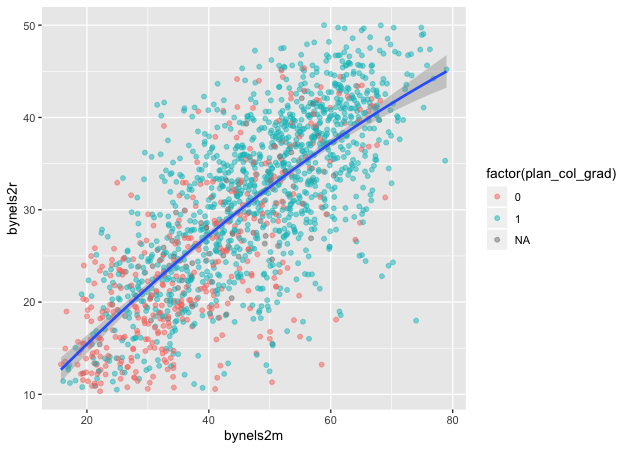

``` r
## libraries
library(tidyverse)
library(haven)
library(labelled)
```

Another key part of exploratory data analysis is making plots that let
you visually inspect the data. This module will focus on graphics.

R has three major graphing systems: the [base
system](https://stat.ethz.ch/R-manual/R-devel/library/graphics/html/00Index.html),
[lattice](http://lattice.r-forge.r-project.org), and
[ggplot2](http://ggplot2.tidyverse.org). Each system has its benefits
and drawbacks. Each system is also very versatile with many, many
options for creating and adjusting plots.

Unfortunately, there isn’t enough time to go through each system. After
describing a few base R graphing functions, this module will focus on
ggplot2 since it allows users to build plots using the [grammar of
graphics](http://vita.had.co.nz/papers/layered-grammar.html) and
integrates well with the tidyverse.

We’ll use the same ELS plans data we’ve been using, again in Stata
format since it has variable and value labels.

``` r
## read in Stata data file
df <- read_dta('../data/els_plans.dta')
```

Plots using base R
==================

Even though users have developed new graphics libraries, the base R
graphics system is still very powerful. It’s also very easy to use in a
pinch. When I want a quick visual of a data distribution that’s just for
me, I generally use base R.

Histogram
---------

For continuous variables, a histogram is a useful plot. Though the
`hist()` function has many options to adjust how it looks, the defaults
work really well.

``` r
## histogram of math scores
hist(df$bynels2m)
```


> #### Quick exercise
>
> Check the distribution of reading scores.

Density
-------

Density plots are also really helpful. R doesn’t have single density
plot function, but you can `plot()` the `density()` of a continuous
variable. Unlike `hist()`, however, `density()` doesn’t automatically
ignore missing values, so like some other commands, we have to tell it
to remove `NA`s.

``` r
## density plot of math scores
plot(density(df$bynels2m, na.rm = TRUE))
```


> #### Quick exercise
>
> Plot the density of reading scores. Next, try to use the `col`
> argument in `plot()` to change the color of the line to `'red'`.

Box plot
--------

Call a box plot using the `boxplot()` function. This one is a little
tricker because it uses the [R
formula](https://www.statmethods.net/graphs/boxplot.html) to set the
continuous variable against the group. (We’ll talk more about formulas
in the module on modeling.) The formula uses a tilde, `~`, and should be
constructed like this:

-   `<var> ~ <group var>`

<!-- -->

``` r
## box plot of math scores against student expectations
boxplot(bynels2m ~ bystexp, data = df)
```


Scatter
-------

Finally, plot continuous variables against one another using the base
`plot()` function. There are two primary ways to make a scatter plot
using `plot()`:

-   `plot(x, y)`
-   `plot(y ~ x)`

We’ll use the first.

``` r
## scatter plot of math against reading scores
plot(df$bynels2m, df$bynels2r)
```


> #### Quick exercise
>
> Plot math scores against reading scores using the other formula
> method.

Plots using ggplot2
===================

The first few times I tried to use ggplot2, I didn’t quite get it. But
once I did (and it doesn’t take too long!), I really started to like it
and it’s now my go to system for making plots.

The ggplot2 system is too involved to fully cover, but that’s thats kind
of the point of the grammar of graphics: once you see how it’s put
together, you can anticipate the commands you need to build your plot.

We’ll start by covering the same plots as above.

Histogram
---------

[As the main help site says](http://ggplot2.tidyverse.org), all ggplot2
plots need three things:

-   data
-   how variables in the data map onto the plot (*e.g.*, what’s on the
    x-axis? what’s on the y-axis)
-   what kind of figure you want to make or add to the plot

Depending on the plot you want to make, these pieces may come in
different points in the command structure, which is usually made up of
linked functions like other tidyverse libraries. The key difference
between the two is that while dplyr uses the pipe (`%>%`) to connect
different functions, ggplot2 uses a plus sign (`+`).

We’ll start by making a histogram again. To help make these pieces
clearer, I’ll use the argument names when possible. The first function,
which initializes the plot is `ggplot()`. Its first argument is the
data.

The aesthetic mappings, that is, which variables go where or how they
function on the plot, go inside the `aes()` function. Since we only have
one variable, `bynels2m`, it is assigned to `x`.

If we stop there and print…

``` r
## init ggplot 
p <- ggplot(data = df, mapping = aes(x = bynels2m))
p
```


…nothing! Well, not nothing, but no histogram. That’s because the plot
object `p` knows the data and the key variable mapping but doesn’t know
what do with them. What do we want?

Since we want a histogram, we add the `geom_histogram()` function to the
existing plot object. Trying again…

``` r
## add histogram instruction
p <- p + geom_histogram()
p
```


Success!

Density
-------

Unlike the base R graphics system, ggplot2 does have a density plotting
command, `geom_density()`. We’ll go ahead and chain it to the first
command and print.

``` r
## density
p <- ggplot(data = df, mapping = aes(x = bynels2m)) +
    geom_density()
p
```


> #### Quick exercise
>
> Make a density plot of reading scores.

If we want to superimpose the denisty plot over the histogram, we only
need chain the two commands together with a slight modification in how
the histogram is made. This way, the histogram and the density will be
on the same scale.

The change happens in the `geom_histogram()` function, where we add a
new mapping: `aes(y = ..density..)`.

``` r
## histogram with density plot overlapping
p <- ggplot(data = df, mapping = aes(x = bynels2m)) +
    geom_histogram(mapping = aes(y = ..density..)) +
    geom_density()
p
```


It worked, but it’s not the greatest visual since the colors are the
same and the density plot is thin with no fill. Added to what came
before, the `geom_histogram()` and `geom_density()` both take on new
arguments that change the defaults. Now the resulting plot should look
nicer and be easier to read.

``` r
## histogram with density plot overlapping (add color to see better)
p <- ggplot(data = df, mapping = aes(x = bynels2m)) +
    geom_histogram(mapping = aes(y = ..density..),
                   color = 'black',
                   fill = 'white') +
    geom_density(fill = 'red', alpha = 0.2)
p
```


> #### Quick exercise
>
> Try changing some of the arguments in the last plot. What happens when
> you change `alpha`? What does the `color` argument change? And `fill`?

Two-way
-------

Plotting the difference in a continuous distribution across groups is a
common task. Let’s see the difference between student math scores
between students with parents who have any postsecondary degree and
those without.

Since we’re using data that was labelled in Stata, we’ll first use
`val_labels()` to check the `bypared` variable.

``` r
## get parental education levels, use `val_labels()` to show them
val_labels(df$bypared)
```

    ##                                {missing} 
    ##                                       -9 
    ##    {survey component legitimate skip/na} 
    ##                                       -8 
    ##                          {nonrespondent} 
    ##                                       -4 
    ##               did not finish high school 
    ##                                        1 
    ##        graduated from high school or ged 
    ##                                        2 
    ##        attended 2-year school, no degree 
    ##                                        3 
    ##             graduated from 2-year school 
    ##                                        4 
    ##       attended college, no 4-year degree 
    ##                                        5 
    ##                   graduated from college 
    ##                                        6 
    ##  completed master^s degree or equivalent 
    ##                                        7 
    ## completed phd, md, other advanced degree 
    ##                                        8

The way this variable is structured prevents use from using a `>=` test
like we have been. We want to count parents with two-year degree (`4`)
in addition to those having a Bachelor’s degree or higher (`6`,
`7, and`8`), but we don't want to count those who attended, but didn't earn a degree (`5\`).

To do this, we’ll use the special operator `%in%` which does exactly
what it sounds like. If a value of `bypared` is **in** the set that we
give it, then the new indicator `pared_coll` will be 1; if not, 0.

The `ggplot()` function doesn’t need to use our full data. In fact, our
data needs to be set up a bit differently to make this plot. We’ll make
a new temporary data object that only has what we need.

``` r
## need to set up data
plot_df <- df %>%
    select(bypared, bynels2m) %>%
    na.omit() %>%                       # can't plot NAs, so drop them
    mutate(pared_coll = ifelse(bypared %in% c(4,6,7,8), 1, 0)) %>%
    select(-bypared) 

## show
head(plot_df)
```

    ## # A tibble: 6 x 2
    ##   bynels2m pared_coll
    ##      <dbl>      <dbl>
    ## 1     47.8          0
    ## 2     55.3          0
    ## 3     66.2          0
    ## 4     35.3          0
    ## 5     30.0          0
    ## 6     24.3          0

To plot against the two groups we’ve made, we need to add it to the
aesthetic feature, `aes()`. The math score, `bynels2m`, is still mapped
to `x`, but since we want two side-by-side histograms, we set the `fill`
aesthetic to our new indicator variable. So the function knows that it’s
a group, we wrap it in the `factor()` function.

Finally, we add some changes to the `geom_histogram()` function so that
each group is on the same scale.

``` r
## two way histogram
p <- ggplot(data = plot_df,
            aes(x = bynels2m, fill = factor(pared_coll))) +
    geom_histogram(alpha = 0.5, stat = 'density', position = 'identity')
p
```


> #### Quick exercise
>
> Remove some of the new arguments in `geom_histogram()`. How does the
> resulting plot change? Remove the `factor()` function from around
> `pared_coll`: what happens?

Box plot
--------

By this point, you’re hopefully seeing the pattern in how ggplot figures
are put together. To make a box plot, we need to add a `y` mapping to
the `aes()` in addition to the `x` mapping. We don’t have to, but we’ve
also added the same variable to `fill` as we did to `x` so that in
addition to having different box and whisker plots along the x-axis,
each plot is given it’s own color.

``` r
## box plot using both factor() and as_factor()
p <- ggplot(data = df,
            mapping = aes(x = factor(bypared),
                          y = bynels2r,
                          fill = as_factor(bypared))) +
    geom_boxplot()
p
```


> #### Quick exercise
>
> Change the `as_factor()` and `factor()` functions above. How does the
> plot change?

Scatter
=======

To make a scatter plot, make sure that the `aes()` has mappings for the
`x` axis and `y` axis and then use `geom_point()` to plot. To make
things easier to see, we’ll first reduce the data to 10% of the full
sample.

``` r
## sample 10% to make figure clearer
df_10 <- df %>% sample_frac(0.1)

## scatter
p <- ggplot(data = df_10, mapping = aes(x = bynels2m, y = bynels2r)) +
    geom_point()
p
```


``` r
## see student base year plans
table(as_factor(df$bystexp))
```

    ## 
    ##    {survey component legitimate skip/na} 
    ##                                        0 
    ##                          {nonrespondent} 
    ##                                        0 
    ##                             {don^t know} 
    ##                                     1450 
    ##         less than high school graduation 
    ##                                      128 
    ##       high school graduation or ged only 
    ##                                      983 
    ## attend or complete 2-year college/school 
    ##                                      879 
    ## attend college, 4-year degree incomplete 
    ##                                      561 
    ##                    graduate from college 
    ##                                     5416 
    ##     obtain master^s degree or equivalent 
    ##                                     3153 
    ## obtain phd, md, or other advanced degree 
    ##                                     2666

``` r
val_labels(df$bystexp)
```

    ##    {survey component legitimate skip/na} 
    ##                                       -8 
    ##                          {nonrespondent} 
    ##                                       -4 
    ##                             {don^t know} 
    ##                                       -1 
    ##         less than high school graduation 
    ##                                        1 
    ##       high school graduation or ged only 
    ##                                        2 
    ## attend or complete 2-year college/school 
    ##                                        3 
    ## attend college, 4-year degree incomplete 
    ##                                        4 
    ##                    graduate from college 
    ##                                        5 
    ##     obtain master^s degree or equivalent 
    ##                                        6 
    ## obtain phd, md, or other advanced degree 
    ##                                        7

``` r
## create variable for students who plan to graduate from college
df_10 <- df_10 %>%
    mutate(plan_col_grad = ifelse(bystexp >= 5, 'yes', 'no'))

## scatter
p <- ggplot(data = df_10,
            mapping = aes(x = bynels2m, y = bynels2r)) +
    geom_point(mapping = aes(color = factor(plan_col_grad)), alpha = 0.5)
p
```


``` r
## add fitted line with linear fit
p <- ggplot(data = df_10, mapping = aes(x = bynels2m, y = bynels2r)) +
    geom_point(mapping = aes(color = factor(plan_col_grad)), alpha = 0.5) +
    geom_smooth(method = lm)
p
```


``` r
## add fitted line with polynomial linear fit
p <- ggplot(data = df_10, mapping = aes(x = bynels2m, y = bynels2r)) +
    geom_point(mapping = aes(color = factor(plan_col_grad)), alpha = 0.5) +
    geom_smooth(method = lm, formula = y ~ poly(x,2))
p
```



``` r
## add fitted line with lowess
p <- ggplot(data = df_10, mapping = aes(x = bynels2m, y = bynels2r)) +
    geom_point(mapping = aes(color = factor(plan_col_grad)), alpha = 0.5) +
    geom_smooth(method = loess)
p
```


Plotly
======

``` r
library(plotly)
```

    ## 
    ## Attaching package: 'plotly'

    ## The following object is masked from 'package:ggplot2':
    ## 
    ##     last_plot

    ## The following object is masked from 'package:stats':
    ## 
    ##     filter

    ## The following object is masked from 'package:graphics':
    ## 
    ##     layout

As a final example, we’ll turn our last plot into an interactive plotly
figure. [Plotly](https://plot.ly/d3-js-for-r-and-shiny-charts/) works
with a number of languages, but it integrates really well with ggplot.
In fact, once the plot is made, we only have to use the `ggplotly()`
function to make it interactive. We’ll add a small bit to the `aes()`,
though, to make it easier to identify outliers when we hover over them.

``` r
## redo last figure with addition of text in aes()
p <- ggplot(data = df_10, mapping = aes(x = bynels2m, y = bynels2r)) +
    geom_point(mapping = aes(color = factor(plan_col_grad),
                             text = paste0('stu_id: ', stu_id)), alpha = 0.5) +
    geom_smooth(method = loess)
p
```


``` r
## create an interactive plot with the last figure
p <- ggplotly(p)
p
```

<!--html_preserve-->

<script type="application/json" data-for="30b724690f9b">{"x":{"data":[{"x":[66.7099990844727,41.5699996948242,64.0199966430664,48.7400016784668,33.5999984741211,22.5799999237061,37.5,50.4199981689453,55.2099990844727,32.310001373291,27.2999992370605,41.6300010681152,57.8499984741211,32.7900009155273,30.1900005340576,20.8600006103516,31.9500007629395,50.7599983215332,45.7000007629395,31.6800003051758,27.2299995422363,45.3699989318848,34.4500007629395,55.6399993896484,46.4700012207031,35.689998626709,28.9200000762939,38.8800010681152,35.6500015258789,21.6900005340576,23.3199996948242,33.3499984741211,19.5300006866455,60.5999984741211,71.7200012207031,36.1599998474121,25.3099994659424,43.8199996948242,29.8700008392334,39.4300003051758,47.7099990844727,43.9199981689453,39.2900009155273,28.6399993896484,19.7700004577637,22.8500003814697,53.8199996948242,51.310001373291,42.3300018310547,43.5900001525879,35.2799987792969,26.1000003814697,44.5499992370605,26.3700008392334,33.3300018310547,29.5499992370605,35.2999992370605,20,52.5099983215332,39.6399993896484,41.8400001525879,35.6500015258789,36.4099998474121,38.0099983215332,51.7299995422363,31.1200008392334,64.5400009155273,37.6199989318848,30.75,67.2699966430664,21.1499996185303,47.7400016784668,21.2099990844727,49.9300003051758,43.2999992370605,24.4099998474121,17.6499996185303,32.2099990844727,18.75,53.2599983215332,46.0099983215332,38.3400001525879,45.0299987792969,63.4300003051758,36.5099983215332,46.5800018310547,25.4500007629395,34.4199981689453,24.3500003814697,37.7599983215332,28.2600002288818,45.5,73.129997253418,32.7599983215332,33.3600006103516,25.9500007629395,24.2999992370605,19.9400005340576,31.7700004577637,34.5400009155273,22.7900009155273,30.9300003051758,43.3800010681152,51.6399993896484,62.7799987792969,57.689998626709,24.8199996948242,41.4000015258789,33.1699981689453,25.4799995422363,30.5599994659424,43.2400016784668,60.5800018310547,40.0800018310547,44.0099983215332,51.3300018310547,49.5099983215332,38.7900009155273,19.7999992370605,37.060001373291,32.5400009155273,31.3700008392334,28.3999996185303,38.4099998474121,30.3600006103516,39.4799995422363,30.2999992370605,34.7799987792969,27.5200004577637,61.439998626709,60.810001373291,21.3899993896484,35.9799995422363,29.1700000762939,53.6300010681152,31.7199993133545,22.1200008392334,32.5200004577637,37.4000015258789,30.1299991607666,44.0900001525879,29.5499992370605,45.6599998474121,19.6900005340576,53.0099983215332,42.2400016784668,55.3899993896484,45.5699996948242,62.3400001525879,57.5200004577637,40.0800018310547,24.9500007629395,45.7299995422363,39.8899993896484,18.9799995422363,50.2099990844727,24.0799999237061,43.060001373291,26.6100006103516,70.3300018310547,61.6599998474121,30.3500003814697,28.7700004577637,50.5099983215332,22.2900009155273,22.4899997711182,20.0900001525879,46.3600006103516,48.8300018310547,50.0900001525879,19.3899993896484,35.0299987792969,53.3800010681152,30.6000003814697,42.6800003051758,56.439998626709,17.2000007629395,52.6199989318848,31.3899993896484,36.2400016784668,22.1000003814697,51.9799995422363,24.5100002288818,27.1200008392334,59.9000015258789,29.1800003051758,37.4700012207031,48.689998626709,23.0499992370605,27.4500007629395,27.8899993896484,47.689998626709,27.6499996185303,37.6500015258789,46.7099990844727,45.7000007629395,62.9799995422363,49.810001373291,44.7200012207031,37.1100006103516,35.6100006103516,38.4000015258789,30.0400009155273,46.8499984741211,31.2600002288818,51.5499992370605,17.7199993133545,24.9799995422363,31.8700008392334,54.3699989318848,66.2099990844727,40.9000015258789,47.0800018310547,43.0900001525879,21.5200004577637,26.1100006103516,52.3199996948242,41.3199996948242,27.9899997711182,27.2999992370605,41.3899993896484,31.5400009155273,37.8199996948242,28.7299995422363,32.2900009155273,20.7600002288818,37.4000015258789,60.560001373291,23.7900009155273,31,27.6200008392334,56.6100006103516,23.2000007629395,34.6100006103516,36.1699981689453,42.0999984741211,47.5999984741211,51.9500007629395,41.4599990844727,38.5,32.7599983215332,30.6700000762939,39.7000007629395,42.1699981689453,44.2900009155273,29.1800003051758,16.9200000762939,37.4500007629395,53.9199981689453,27.3299999237061,19.2299995422363,31.5599994659424,24.1900005340576,22.5900001525879,46.310001373291,24.0200004577637,28.0400009155273,20.4500007629395,56.5499992370605,27.8500003814697,52.9000015258789,29.6599998474121,30.8500003814697,40.8499984741211,60.4500007629395,20.1599998474121,38.6300010681152,47.0200004577637,26.8999996185303,37.5,35.7200012207031,61.7999992370605,34.1599998474121,40.6399993896484,23.6800003051758,24.0100002288818,33.7299995422363,38.3300018310547,37.7999992370605,25.2999992370605,58.2599983215332,43.3499984741211,32.0699996948242,72.6500015258789,47.439998626709,47.6300010681152,58.7900009155273,37,54.3300018310547,32.4799995422363,41.2900009155273,52.9500007629395,26.5699996948242,23.0900001525879,33.9199981689453,24.9200000762939,37.3600006103516,43.3800010681152,28.2399997711182,22.5900001525879,63.2599983215332,38.7999992370605,48.0099983215332,25.1299991607666,36.6800003051758,34.0999984741211,44.3400001525879,45.4199981689453,53.3400001525879,37.2700004577637,35.5699996948242,47.439998626709,31.6599998474121,36.4000015258789,50.9799995422363,40.2099990844727,42.4900016784668,28.7900009155273,36.4300003051758,38.689998626709,35.9300003051758,60.0800018310547,26.2800006866455,23.5400009155273,36.75,52.6599998474121,27.25,48.9300003051758,60.9500007629395,51.6599998474121,22.3899993896484,32.2700004577637,17.5200004577637,27.0200004577637,27.6499996185303,26.5200004577637,47.189998626709,26.8099994659424,31.0799999237061,53.0099983215332,29.8600006103516,45.8199996948242,30.0799999237061,32.8499984741211,31.1900005340576,41.25,26.3500003814697,42.560001373291,53.6399993896484,45.5900001525879,25.4699993133545,54.810001373291,41.1399993896484,57.310001373291,29.1399993896484,45.9000015258789,32.2099990844727,27.0200004577637,25.0599994659424,28.4200000762939,18.4799995422363,63.9700012207031,29.6399993896484,26.8700008392334,26.2000007629395,44.2700004577637,34.4099998474121,24.4400005340576,34.25,34.1300010681152,61.6300010681152,36.810001373291,41.0200004577637,35.0900001525879,34.7299995422363,32.7299995422363,24.7199993133545,21.7600002288818,42.060001373291,30.8799991607666,21.8500003814697,31.7999992370605,42.5999984741211,29.4799995422363,29.9500007629395,55.9599990844727,41.3300018310547,33.1300010681152,36.2799987792969],"y":[42.0099983215332,27.25,36.689998626709,36.4000015258789,28.5499992370605,16.4899997711182,16.2700004577637,15.4700002670288,42.5900001525879,10.8900003433228,25.1800003051758,30.3299999237061,35.2599983215332,23.9500007629395,16.3299999237061,29.2299995422363,22.8099994659424,28.3099994659424,38.0099983215332,21.1700000762939,14.1999998092651,19.6399993896484,29.0699996948242,43.2799987792969,25.6700000762939,24.1100006103516,22.5499992370605,17.8400001525879,26.6000003814697,20.1900005340576,13.6700000762939,28.4200000762939,14.0100002288818,30.1399993896484,26.9699993133545,15.3400001525879,29.2299995422363,34.6699981689453,33.2999992370605,25.6200008392334,17.2199993133545,38.0200004577637,24.4699993133545,16.4899997711182,16.1200008392334,11.960000038147,32.6500015258789,26.0799999237061,21.2800006866455,34.689998626709,30.6399993896484,20.1399993896484,33.689998626709,13.7600002288818,31.7099990844727,28.3700008392334,37.5900001525879,13.8999996185303,39.8600006103516,11.8199996948242,15.3999996185303,23.7700004577637,24.7199993133545,30.6700000762939,27.8999996185303,18.2800006866455,43.1500015258789,25.9500007629395,14.3500003814697,34.5900001525879,16.5699996948242,33.0299987792969,11.9099998474121,35.9099998474121,25.6299991607666,12.9399995803833,14.0600004196167,24.0499992370605,12.9200000762939,18.4699993133545,19.3500003814697,25.6599998474121,36.3899993896484,34.8800010681152,20.7600002288818,25.9099998474121,13.289999961853,18.2000007629395,13.4399995803833,24.4200000762939,18.9799995422363,26.5100002288818,37.9799995422363,24.1000003814697,12.2799997329712,30.1700000762939,13.6599998474121,19.1599998474121,20.0100002288818,23.2399997711182,23.7999992370605,12.3100004196167,35.9799995422363,31.2600002288818,17.5100002288818,39.25,19.4400005340576,32.2799987792969,11.5,23.4200000762939,14.0500001907349,35.5200004577637,37.7200012207031,34.6399993896484,24.4799995422363,32.7599983215332,21.8400001525879,23.4300003051758,20.7199993133545,26.9400005340576,17.4200000762939,18.8600006103516,18.1200008392334,19.0200004577637,16.0300006866455,24.0400009155273,11.2700004577637,21.3899993896484,19.3899993896484,45,46.1199989318848,12.1000003814697,28.6499996185303,17.6200008392334,33.7299995422363,24.75,18.3099994659424,21.4699993133545,26.0799999237061,22.2900009155273,31.2600002288818,14.0699996948242,28.6499996185303,14.3199996948242,29.6000003814697,32.0400009155273,38.2099990844727,31.7800006866455,18.2900009155273,35.7900009155273,31.3400001525879,17.8099994659424,27.75,20.0900001525879,11.7399997711182,27.1200008392334,22.5200004577637,29.2099990844727,22.5300006866455,25.8700008392334,45.6500015258789,20.2900009155273,18.0499992370605,35.3499984741211,14.6499996185303,13.9499998092651,15.75,25.6100006103516,29.5599994659424,27.0499992370605,20.3400001525879,31.1200008392334,28.9799995422363,29.4200000762939,18.6700000762939,39.9700012207031,11.8999996185303,26.0100002288818,21.0599994659424,23.8700008392334,19.9500007629395,32,22.4200000762939,21.7399997711182,29.3700008392334,19.4699993133545,12.3000001907349,33.9500007629395,20.8099994659424,26.8299999237061,28.6800003051758,33.4199981689453,25.6200008392334,40.8899993896484,28.4599990844727,26.8099994659424,38.0900001525879,25.4500007629395,23.2399997711182,38.5999984741211,35.9199981689453,34.8899993896484,29.5100002288818,29.7099990844727,19.6700000762939,16.2299995422363,13.4200000762939,18.2199993133545,13.8500003814697,27.5100002288818,40.7000007629395,24.8099994659424,30.7999992370605,18.8299999237061,20.6599998474121,18.8299999237061,30.9899997711182,23.9899997711182,27.3500003814697,25.0900001525879,19.9200000762939,31.6800003051758,29.9099998474121,26.3999996185303,25.8700008392334,12.2799997329712,31.3400001525879,35.2000007629395,15.1499996185303,15.2299995422363,13.2399997711182,30.6499996185303,18.2199993133545,16.4300003051758,32.310001373291,27.5200004577637,37.6800003051758,19.5,17.7099990844727,25,26.6200008392334,20.5400009155273,26.3099994659424,31.0499992370605,28.2399997711182,20.1700000762939,12.4099998474121,29.6599998474121,41.0200004577637,13.6199998855591,12.9499998092651,24.5,17.0699996948242,24.2299995422363,32,20.8099994659424,17.6800003051758,12.4700002670288,45.5400009155273,29.5499992370605,23.6900005340576,31.5100002288818,11.9700002670288,16.4899997711182,36.2599983215332,19.5900001525879,28.0499992370605,31.4500007629395,15.0900001525879,32.2299995422363,16.5699996948242,37.2099990844727,22.7299995422363,21.2399997711182,21.5799999237061,19.5499992370605,27.4300003051758,21.6599998474121,26.3500003814697,22.6599998474121,31.3799991607666,18.7800006866455,24.1000003814697,36.9199981689453,29.0400009155273,33.310001373291,33.3300018310547,25.8799991607666,11.5200004577637,13.7200002670288,14.9700002670288,29.9500007629395,18.7299995422363,18.5200004577637,25.1800003051758,12.6599998474121,16.6299991607666,26.3500003814697,25.4300003051758,18.3899993896484,17.3400001525879,26.8400001525879,33.3600006103516,20.4400005340576,19.2900009155273,36.939998626709,33.7900009155273,22.2900009155273,41.4599990844727,20.8400001525879,25.2700004577637,31.2399997711182,16.7800006866455,25.1100006103516,18.5799999237061,33.7999992370605,33.8899993896484,12.1400003433228,26.7999992370605,21.8500003814697,10.9799995422363,33.8699989318848,15.5799999237061,14.7200002670288,21.1499996185303,39.5800018310547,31.5799999237061,36.3699989318848,28.8099994659424,35.0099983215332,27.2299995422363,20.3999996185303,15.3900003433228,14.5500001907349,16.0699996948242,15.1499996185303,33.939998626709,28.3700008392334,28.3299999237061,22.1100006103516,17.0599994659424,29.0200004577637,17.6399993896484,30.0400009155273,21.7700004577637,28.5100002288818,20.9099998474121,22.3799991607666,34.8499984741211,28.3799991607666,11.9700002670288,20.7000007629395,33.0699996948242,15.7700004577637,31.9300003051758,24.5900001525879,20.6900005340576,15.2299995422363,18.2099990844727,11.6599998474121,17.8999996185303,35.939998626709,24.9599990844727,22.2700004577637,17.3899993896484,34.0099983215332,20.8600006103516,29.7600002288818,14.710000038147,11.8999996185303,29.8299999237061,19.0100002288818,28.4400005340576,39.8300018310547,18,27.3400001525879,9.89000034332275,19.1800003051758,33.5800018310547,26.7399997711182,21.0599994659424,23.3199996948242,29.6299991607666,20.3400001525879,24.7700004577637,36.0200004577637,31.1000003814697,29.1499996185303,26.8500003814697],"text":["factor(plan_col_grad): no<br />stu_id: 300230<br />bynels2m: 66.71<br />bynels2r: 42.01","factor(plan_col_grad): no<br />stu_id: 207113<br />bynels2m: 41.57<br />bynels2r: 27.25","factor(plan_col_grad): no<br />stu_id: 251205<br />bynels2m: 64.02<br />bynels2r: 36.69","factor(plan_col_grad): no<br />stu_id: 309206<br />bynels2m: 48.74<br />bynels2r: 36.40","factor(plan_col_grad): no<br />stu_id: 114215<br />bynels2m: 33.60<br />bynels2r: 28.55","factor(plan_col_grad): no<br />stu_id: 290220<br />bynels2m: 22.58<br />bynels2r: 16.49","factor(plan_col_grad): no<br />stu_id: 168204<br />bynels2m: 37.50<br />bynels2r: 16.27","factor(plan_col_grad): no<br />stu_id: 244211<br />bynels2m: 50.42<br />bynels2r: 15.47","factor(plan_col_grad): no<br />stu_id: 301118<br />bynels2m: 55.21<br />bynels2r: 42.59","factor(plan_col_grad): no<br />stu_id: 401127<br />bynels2m: 32.31<br />bynels2r: 10.89","factor(plan_col_grad): no<br />stu_id: 267227<br />bynels2m: 27.30<br />bynels2r: 25.18","factor(plan_col_grad): no<br />stu_id: 361203<br />bynels2m: 41.63<br />bynels2r: 30.33","factor(plan_col_grad): no<br />stu_id: 261115<br />bynels2m: 57.85<br />bynels2r: 35.26","factor(plan_col_grad): no<br />stu_id: 286227<br />bynels2m: 32.79<br />bynels2r: 23.95","factor(plan_col_grad): no<br />stu_id: 119217<br />bynels2m: 30.19<br />bynels2r: 16.33","factor(plan_col_grad): no<br />stu_id: 233206<br />bynels2m: 20.86<br />bynels2r: 29.23","factor(plan_col_grad): no<br />stu_id: 333221<br />bynels2m: 31.95<br />bynels2r: 22.81","factor(plan_col_grad): no<br />stu_id: 158117<br />bynels2m: 50.76<br />bynels2r: 28.31","factor(plan_col_grad): no<br />stu_id: 301120<br />bynels2m: 45.70<br />bynels2r: 38.01","factor(plan_col_grad): no<br />stu_id: 371124<br />bynels2m: 31.68<br />bynels2r: 21.17","factor(plan_col_grad): no<br />stu_id: 288119<br />bynels2m: 27.23<br />bynels2r: 14.20","factor(plan_col_grad): no<br />stu_id: 373215<br />bynels2m: 45.37<br />bynels2r: 19.64","factor(plan_col_grad): no<br />stu_id: 264114<br />bynels2m: 34.45<br />bynels2r: 29.07","factor(plan_col_grad): no<br />stu_id: 440116<br />bynels2m: 55.64<br />bynels2r: 43.28","factor(plan_col_grad): no<br />stu_id: 271217<br />bynels2m: 46.47<br />bynels2r: 25.67","factor(plan_col_grad): no<br />stu_id: 114117<br />bynels2m: 35.69<br />bynels2r: 24.11","factor(plan_col_grad): no<br />stu_id: 151120<br />bynels2m: 28.92<br />bynels2r: 22.55","factor(plan_col_grad): no<br />stu_id: 327215<br />bynels2m: 38.88<br />bynels2r: 17.84","factor(plan_col_grad): no<br />stu_id: 371209<br />bynels2m: 35.65<br />bynels2r: 26.60","factor(plan_col_grad): no<br />stu_id: 130115<br />bynels2m: 21.69<br />bynels2r: 20.19","factor(plan_col_grad): no<br />stu_id: 308113<br />bynels2m: 23.32<br />bynels2r: 13.67","factor(plan_col_grad): no<br />stu_id: 353217<br />bynels2m: 33.35<br />bynels2r: 28.42","factor(plan_col_grad): no<br />stu_id: 370233<br />bynels2m: 19.53<br />bynels2r: 14.01","factor(plan_col_grad): no<br />stu_id: 145103<br />bynels2m: 60.60<br />bynels2r: 30.14","factor(plan_col_grad): no<br />stu_id: 274225<br />bynels2m: 71.72<br />bynels2r: 26.97","factor(plan_col_grad): no<br />stu_id: 360203<br />bynels2m: 36.16<br />bynels2r: 15.34","factor(plan_col_grad): no<br />stu_id: 323111<br />bynels2m: 25.31<br />bynels2r: 29.23","factor(plan_col_grad): no<br />stu_id: 436316<br />bynels2m: 43.82<br />bynels2r: 34.67","factor(plan_col_grad): no<br />stu_id: 330211<br />bynels2m: 29.87<br />bynels2r: 33.30","factor(plan_col_grad): no<br />stu_id: 221221<br />bynels2m: 39.43<br />bynels2r: 25.62","factor(plan_col_grad): no<br />stu_id: 219208<br />bynels2m: 47.71<br />bynels2r: 17.22","factor(plan_col_grad): no<br />stu_id: 321112<br />bynels2m: 43.92<br />bynels2r: 38.02","factor(plan_col_grad): no<br />stu_id: 253112<br />bynels2m: 39.29<br />bynels2r: 24.47","factor(plan_col_grad): no<br />stu_id: 336218<br />bynels2m: 28.64<br />bynels2r: 16.49","factor(plan_col_grad): no<br />stu_id: 147105<br />bynels2m: 19.77<br />bynels2r: 16.12","factor(plan_col_grad): no<br />stu_id: 312108<br />bynels2m: 22.85<br />bynels2r: 11.96","factor(plan_col_grad): no<br />stu_id: 150124<br />bynels2m: 53.82<br />bynels2r: 32.65","factor(plan_col_grad): no<br />stu_id: 359304<br />bynels2m: 51.31<br />bynels2r: 26.08","factor(plan_col_grad): no<br />stu_id: 220116<br />bynels2m: 42.33<br />bynels2r: 21.28","factor(plan_col_grad): no<br />stu_id: 333124<br />bynels2m: 43.59<br />bynels2r: 34.69","factor(plan_col_grad): no<br />stu_id: 294115<br />bynels2m: 35.28<br />bynels2r: 30.64","factor(plan_col_grad): no<br />stu_id: 377108<br />bynels2m: 26.10<br />bynels2r: 20.14","factor(plan_col_grad): no<br />stu_id: 255121<br />bynels2m: 44.55<br />bynels2r: 33.69","factor(plan_col_grad): no<br />stu_id: 264204<br />bynels2m: 26.37<br />bynels2r: 13.76","factor(plan_col_grad): no<br />stu_id: 366113<br />bynels2m: 33.33<br />bynels2r: 31.71","factor(plan_col_grad): no<br />stu_id: 377207<br />bynels2m: 29.55<br />bynels2r: 28.37","factor(plan_col_grad): no<br />stu_id: 162120<br />bynels2m: 35.30<br />bynels2r: 37.59","factor(plan_col_grad): no<br />stu_id: 224213<br />bynels2m: 20.00<br />bynels2r: 13.90","factor(plan_col_grad): no<br />stu_id: 447215<br />bynels2m: 52.51<br />bynels2r: 39.86","factor(plan_col_grad): no<br />stu_id: 372115<br />bynels2m: 39.64<br />bynels2r: 11.82","factor(plan_col_grad): no<br />stu_id: 376211<br />bynels2m: 41.84<br />bynels2r: 15.40","factor(plan_col_grad): no<br />stu_id: 156110<br />bynels2m: 35.65<br />bynels2r: 23.77","factor(plan_col_grad): no<br />stu_id: 138128<br />bynels2m: 36.41<br />bynels2r: 24.72","factor(plan_col_grad): no<br />stu_id: 252222<br />bynels2m: 38.01<br />bynels2r: 30.67","factor(plan_col_grad): no<br />stu_id: 416201<br />bynels2m: 51.73<br />bynels2r: 27.90","factor(plan_col_grad): no<br />stu_id: 214107<br />bynels2m: 31.12<br />bynels2r: 18.28","factor(plan_col_grad): no<br />stu_id: 379211<br />bynels2m: 64.54<br />bynels2r: 43.15","factor(plan_col_grad): no<br />stu_id: 224115<br />bynels2m: 37.62<br />bynels2r: 25.95","factor(plan_col_grad): no<br />stu_id: 223116<br />bynels2m: 30.75<br />bynels2r: 14.35","factor(plan_col_grad): no<br />stu_id: 302103<br />bynels2m: 67.27<br />bynels2r: 34.59","factor(plan_col_grad): no<br />stu_id: 226210<br />bynels2m: 21.15<br />bynels2r: 16.57","factor(plan_col_grad): no<br />stu_id: 192124<br />bynels2m: 47.74<br />bynels2r: 33.03","factor(plan_col_grad): no<br />stu_id: 460102<br />bynels2m: 21.21<br />bynels2r: 11.91","factor(plan_col_grad): no<br />stu_id: 277209<br />bynels2m: 49.93<br />bynels2r: 35.91","factor(plan_col_grad): no<br />stu_id: 448103<br />bynels2m: 43.30<br />bynels2r: 25.63","factor(plan_col_grad): no<br />stu_id: 424117<br />bynels2m: 24.41<br />bynels2r: 12.94","factor(plan_col_grad): no<br />stu_id: 301205<br />bynels2m: 17.65<br />bynels2r: 14.06","factor(plan_col_grad): no<br />stu_id: 310106<br />bynels2m: 32.21<br />bynels2r: 24.05","factor(plan_col_grad): no<br />stu_id: 129201<br />bynels2m: 18.75<br />bynels2r: 12.92","factor(plan_col_grad): no<br />stu_id: 403220<br />bynels2m: 53.26<br />bynels2r: 18.47","factor(plan_col_grad): no<br />stu_id: 377204<br />bynels2m: 46.01<br />bynels2r: 19.35","factor(plan_col_grad): no<br />stu_id: 243209<br />bynels2m: 38.34<br />bynels2r: 25.66","factor(plan_col_grad): no<br />stu_id: 149116<br />bynels2m: 45.03<br />bynels2r: 36.39","factor(plan_col_grad): no<br />stu_id: 126214<br />bynels2m: 63.43<br />bynels2r: 34.88","factor(plan_col_grad): no<br />stu_id: 217214<br />bynels2m: 36.51<br />bynels2r: 20.76","factor(plan_col_grad): no<br />stu_id: 323104<br />bynels2m: 46.58<br />bynels2r: 25.91","factor(plan_col_grad): no<br />stu_id: 286215<br />bynels2m: 25.45<br />bynels2r: 13.29","factor(plan_col_grad): no<br />stu_id: 182101<br />bynels2m: 34.42<br />bynels2r: 18.20","factor(plan_col_grad): no<br />stu_id: 236115<br />bynels2m: 24.35<br />bynels2r: 13.44","factor(plan_col_grad): no<br />stu_id: 461220<br />bynels2m: 37.76<br />bynels2r: 24.42","factor(plan_col_grad): no<br />stu_id: 170102<br />bynels2m: 28.26<br />bynels2r: 18.98","factor(plan_col_grad): no<br />stu_id: 273212<br />bynels2m: 45.50<br />bynels2r: 26.51","factor(plan_col_grad): no<br />stu_id: 455308<br />bynels2m: 73.13<br />bynels2r: 37.98","factor(plan_col_grad): no<br />stu_id: 350106<br />bynels2m: 32.76<br />bynels2r: 24.10","factor(plan_col_grad): no<br />stu_id: 148114<br />bynels2m: 33.36<br />bynels2r: 12.28","factor(plan_col_grad): no<br />stu_id: 187217<br />bynels2m: 25.95<br />bynels2r: 30.17","factor(plan_col_grad): no<br />stu_id: 291204<br />bynels2m: 24.30<br />bynels2r: 13.66","factor(plan_col_grad): no<br />stu_id: 235117<br />bynels2m: 19.94<br />bynels2r: 19.16","factor(plan_col_grad): no<br />stu_id: 137214<br />bynels2m: 31.77<br />bynels2r: 20.01","factor(plan_col_grad): no<br />stu_id: 376225<br />bynels2m: 34.54<br />bynels2r: 23.24","factor(plan_col_grad): no<br />stu_id: 180217<br />bynels2m: 22.79<br />bynels2r: 23.80","factor(plan_col_grad): no<br />stu_id: 352124<br />bynels2m: 30.93<br />bynels2r: 12.31","factor(plan_col_grad): no<br />stu_id: 182205<br />bynels2m: 43.38<br />bynels2r: 35.98","factor(plan_col_grad): no<br />stu_id: 147110<br />bynels2m: 51.64<br />bynels2r: 31.26","factor(plan_col_grad): no<br />stu_id: 375222<br />bynels2m: 62.78<br />bynels2r: 17.51","factor(plan_col_grad): no<br />stu_id: 290111<br />bynels2m: 57.69<br />bynels2r: 39.25","factor(plan_col_grad): no<br />stu_id: 131206<br />bynels2m: 24.82<br />bynels2r: 19.44","factor(plan_col_grad): no<br />stu_id: 174204<br />bynels2m: 41.40<br />bynels2r: 32.28","factor(plan_col_grad): no<br />stu_id: 289111<br />bynels2m: 33.17<br />bynels2r: 11.50","factor(plan_col_grad): no<br />stu_id: 327206<br />bynels2m: 25.48<br />bynels2r: 23.42","factor(plan_col_grad): no<br />stu_id: 362206<br />bynels2m: 30.56<br />bynels2r: 14.05","factor(plan_col_grad): no<br />stu_id: 198224<br />bynels2m: 43.24<br />bynels2r: 35.52","factor(plan_col_grad): no<br />stu_id: 143212<br />bynels2m: 60.58<br />bynels2r: 37.72","factor(plan_col_grad): no<br />stu_id: 175218<br />bynels2m: 40.08<br />bynels2r: 34.64","factor(plan_col_grad): no<br />stu_id: 227120<br />bynels2m: 44.01<br />bynels2r: 24.48","factor(plan_col_grad): no<br />stu_id: 357106<br />bynels2m: 51.33<br />bynels2r: 32.76","factor(plan_col_grad): no<br />stu_id: 316118<br />bynels2m: 49.51<br />bynels2r: 21.84","factor(plan_col_grad): no<br />stu_id: 237221<br />bynels2m: 38.79<br />bynels2r: 23.43","factor(plan_col_grad): no<br />stu_id: 186113<br />bynels2m: 19.80<br />bynels2r: 20.72","factor(plan_col_grad): no<br />stu_id: 153131<br />bynels2m: 37.06<br />bynels2r: 26.94","factor(plan_col_grad): no<br />stu_id: 261204<br />bynels2m: 32.54<br />bynels2r: 17.42","factor(plan_col_grad): no<br />stu_id: 241206<br />bynels2m: 31.37<br />bynels2r: 18.86","factor(plan_col_grad): no<br />stu_id: 381307<br />bynels2m: 28.40<br />bynels2r: 18.12","factor(plan_col_grad): no<br />stu_id: 321101<br />bynels2m: 38.41<br />bynels2r: 19.02","factor(plan_col_grad): no<br />stu_id: 126229<br />bynels2m: 30.36<br />bynels2r: 16.03","factor(plan_col_grad): no<br />stu_id: 359226<br />bynels2m: 39.48<br />bynels2r: 24.04","factor(plan_col_grad): no<br />stu_id: 192204<br />bynels2m: 30.30<br />bynels2r: 11.27","factor(plan_col_grad): no<br />stu_id: 134218<br />bynels2m: 34.78<br />bynels2r: 21.39","factor(plan_col_grad): no<br />stu_id: 247108<br />bynels2m: 27.52<br />bynels2r: 19.39","factor(plan_col_grad): no<br />stu_id: 446120<br />bynels2m: 61.44<br />bynels2r: 45.00","factor(plan_col_grad): no<br />stu_id: 439214<br />bynels2m: 60.81<br />bynels2r: 46.12","factor(plan_col_grad): no<br />stu_id: 258224<br />bynels2m: 21.39<br />bynels2r: 12.10","factor(plan_col_grad): no<br />stu_id: 452103<br />bynels2m: 35.98<br />bynels2r: 28.65","factor(plan_col_grad): no<br />stu_id: 330215<br />bynels2m: 29.17<br />bynels2r: 17.62","factor(plan_col_grad): no<br />stu_id: 145204<br />bynels2m: 53.63<br />bynels2r: 33.73","factor(plan_col_grad): no<br />stu_id: 249113<br />bynels2m: 31.72<br />bynels2r: 24.75","factor(plan_col_grad): no<br />stu_id: 257101<br />bynels2m: 22.12<br />bynels2r: 18.31","factor(plan_col_grad): no<br />stu_id: 176108<br />bynels2m: 32.52<br />bynels2r: 21.47","factor(plan_col_grad): no<br />stu_id: 369227<br />bynels2m: 37.40<br />bynels2r: 26.08","factor(plan_col_grad): no<br />stu_id: 453206<br />bynels2m: 30.13<br />bynels2r: 22.29","factor(plan_col_grad): no<br />stu_id: 179105<br />bynels2m: 44.09<br />bynels2r: 31.26","factor(plan_col_grad): no<br />stu_id: 287112<br />bynels2m: 29.55<br />bynels2r: 14.07","factor(plan_col_grad): no<br />stu_id: 144113<br />bynels2m: 45.66<br />bynels2r: 28.65","factor(plan_col_grad): no<br />stu_id: 116118<br />bynels2m: 19.69<br />bynels2r: 14.32","factor(plan_col_grad): no<br />stu_id: 297105<br />bynels2m: 53.01<br />bynels2r: 29.60","factor(plan_col_grad): no<br />stu_id: 158104<br />bynels2m: 42.24<br />bynels2r: 32.04","factor(plan_col_grad): no<br />stu_id: 421208<br />bynels2m: 55.39<br />bynels2r: 38.21","factor(plan_col_grad): no<br />stu_id: 286205<br />bynels2m: 45.57<br />bynels2r: 31.78","factor(plan_col_grad): no<br />stu_id: 300116<br />bynels2m: 62.34<br />bynels2r: 18.29","factor(plan_col_grad): no<br />stu_id: 101112<br />bynels2m: 57.52<br />bynels2r: 35.79","factor(plan_col_grad): no<br />stu_id: 434115<br />bynels2m: 40.08<br />bynels2r: 31.34","factor(plan_col_grad): no<br />stu_id: 311105<br />bynels2m: 24.95<br />bynels2r: 17.81","factor(plan_col_grad): no<br />stu_id: 239133<br />bynels2m: 45.73<br />bynels2r: 27.75","factor(plan_col_grad): no<br />stu_id: 249221<br />bynels2m: 39.89<br />bynels2r: 20.09","factor(plan_col_grad): no<br />stu_id: 170106<br />bynels2m: 18.98<br />bynels2r: 11.74","factor(plan_col_grad): no<br />stu_id: 152128<br />bynels2m: 50.21<br />bynels2r: 27.12","factor(plan_col_grad): no<br />stu_id: 242219<br />bynels2m: 24.08<br />bynels2r: 22.52","factor(plan_col_grad): no<br />stu_id: 336211<br />bynels2m: 43.06<br />bynels2r: 29.21","factor(plan_col_grad): no<br />stu_id: 129114<br />bynels2m: 26.61<br />bynels2r: 22.53","factor(plan_col_grad): no<br />stu_id: 303222<br />bynels2m: 70.33<br />bynels2r: 25.87","factor(plan_col_grad): no<br />stu_id: 363105<br />bynels2m: 61.66<br />bynels2r: 45.65","factor(plan_col_grad): no<br />stu_id: 288206<br />bynels2m: 30.35<br />bynels2r: 20.29","factor(plan_col_grad): no<br />stu_id: 218109<br />bynels2m: 28.77<br />bynels2r: 18.05","factor(plan_col_grad): no<br />stu_id: 445117<br />bynels2m: 50.51<br />bynels2r: 35.35","factor(plan_col_grad): no<br />stu_id: 242220<br />bynels2m: 22.29<br />bynels2r: 14.65","factor(plan_col_grad): no<br />stu_id: 292106<br />bynels2m: 22.49<br />bynels2r: 13.95","factor(plan_col_grad): no<br />stu_id: 325104<br />bynels2m: 20.09<br />bynels2r: 15.75","factor(plan_col_grad): no<br />stu_id: 251204<br />bynels2m: 46.36<br />bynels2r: 25.61","factor(plan_col_grad): no<br />stu_id: 347119<br />bynels2m: 48.83<br />bynels2r: 29.56","factor(plan_col_grad): no<br />stu_id: 369102<br />bynels2m: 50.09<br />bynels2r: 27.05","factor(plan_col_grad): no<br />stu_id: 252225<br />bynels2m: 19.39<br />bynels2r: 20.34","factor(plan_col_grad): no<br />stu_id: 223129<br />bynels2m: 35.03<br />bynels2r: 31.12","factor(plan_col_grad): no<br />stu_id: 142104<br />bynels2m: 53.38<br />bynels2r: 28.98","factor(plan_col_grad): no<br />stu_id: 324301<br />bynels2m: 30.60<br />bynels2r: 29.42","factor(plan_col_grad): no<br />stu_id: 296124<br />bynels2m: 42.68<br />bynels2r: 18.67","factor(plan_col_grad): no<br />stu_id: 192211<br />bynels2m: 56.44<br />bynels2r: 39.97","factor(plan_col_grad): no<br />stu_id: 282102<br />bynels2m: 17.20<br />bynels2r: 11.90","factor(plan_col_grad): no<br />stu_id: 293123<br />bynels2m: 52.62<br />bynels2r: 26.01","factor(plan_col_grad): no<br />stu_id: 307126<br />bynels2m: 31.39<br />bynels2r: 21.06","factor(plan_col_grad): no<br />stu_id: 201102<br />bynels2m: 36.24<br />bynels2r: 23.87","factor(plan_col_grad): no<br />stu_id: 216134<br />bynels2m: 22.10<br />bynels2r: 19.95","factor(plan_col_grad): no<br />stu_id: 149108<br />bynels2m: 51.98<br />bynels2r: 32.00","factor(plan_col_grad): no<br />stu_id: 193104<br />bynels2m: 24.51<br />bynels2r: 22.42","factor(plan_col_grad): no<br />stu_id: 357304<br />bynels2m: 27.12<br />bynels2r: 21.74","factor(plan_col_grad): no<br />stu_id: 396209<br />bynels2m: 59.90<br />bynels2r: 29.37","factor(plan_col_grad): no<br />stu_id: 199102<br />bynels2m: 29.18<br />bynels2r: 19.47","factor(plan_col_grad): no<br />stu_id: 281212<br />bynels2m: 37.47<br />bynels2r: 12.30","factor(plan_col_grad): no<br />stu_id: 436319<br />bynels2m: 48.69<br />bynels2r: 33.95","factor(plan_col_grad): no<br />stu_id: 261120<br />bynels2m: 23.05<br />bynels2r: 20.81","factor(plan_col_grad): no<br />stu_id: 183101<br />bynels2m: 27.45<br />bynels2r: 26.83","factor(plan_col_grad): no<br />stu_id: 194126<br />bynels2m: 27.89<br />bynels2r: 28.68","factor(plan_col_grad): no<br />stu_id: 373223<br />bynels2m: 47.69<br />bynels2r: 33.42","factor(plan_col_grad): no<br />stu_id: 171206<br />bynels2m: 27.65<br />bynels2r: 25.62","factor(plan_col_grad): no<br />stu_id: 339112<br />bynels2m: 37.65<br />bynels2r: 40.89","factor(plan_col_grad): no<br />stu_id: 273111<br />bynels2m: 46.71<br />bynels2r: 28.46","factor(plan_col_grad): no<br />stu_id: 165105<br />bynels2m: 45.70<br />bynels2r: 26.81","factor(plan_col_grad): no<br />stu_id: 343131<br />bynels2m: 62.98<br />bynels2r: 38.09","factor(plan_col_grad): no<br />stu_id: 349128<br />bynels2m: 49.81<br />bynels2r: 25.45","factor(plan_col_grad): no<br />stu_id: 231212<br />bynels2m: 44.72<br />bynels2r: 23.24","factor(plan_col_grad): no<br />stu_id: 183120<br />bynels2m: 37.11<br />bynels2r: 38.60","factor(plan_col_grad): no<br />stu_id: 259102<br />bynels2m: 35.61<br />bynels2r: 35.92","factor(plan_col_grad): no<br />stu_id: 136111<br />bynels2m: 38.40<br />bynels2r: 34.89","factor(plan_col_grad): no<br />stu_id: 357218<br />bynels2m: 30.04<br />bynels2r: 29.51","factor(plan_col_grad): no<br />stu_id: 383217<br />bynels2m: 46.85<br />bynels2r: 29.71","factor(plan_col_grad): no<br />stu_id: 139112<br />bynels2m: 31.26<br />bynels2r: 19.67","factor(plan_col_grad): no<br />stu_id: 126204<br />bynels2m: 51.55<br />bynels2r: 16.23","factor(plan_col_grad): no<br />stu_id: 235111<br />bynels2m: 17.72<br />bynels2r: 13.42","factor(plan_col_grad): no<br />stu_id: 137224<br />bynels2m: 24.98<br />bynels2r: 18.22","factor(plan_col_grad): no<br />stu_id: 288101<br />bynels2m: 31.87<br />bynels2r: 13.85","factor(plan_col_grad): no<br />stu_id: 107223<br />bynels2m: 54.37<br />bynels2r: 27.51","factor(plan_col_grad): no<br />stu_id: 430201<br />bynels2m: 66.21<br />bynels2r: 40.70","factor(plan_col_grad): no<br />stu_id: 444118<br />bynels2m: 40.90<br />bynels2r: 24.81","factor(plan_col_grad): no<br />stu_id: 343125<br />bynels2m: 47.08<br />bynels2r: 30.80","factor(plan_col_grad): no<br />stu_id: 103112<br />bynels2m: 43.09<br />bynels2r: 18.83","factor(plan_col_grad): no<br />stu_id: 294207<br />bynels2m: 21.52<br />bynels2r: 20.66","factor(plan_col_grad): no<br />stu_id: 298205<br />bynels2m: 26.11<br />bynels2r: 18.83","factor(plan_col_grad): no<br />stu_id: 113212<br />bynels2m: 52.32<br />bynels2r: 30.99","factor(plan_col_grad): no<br />stu_id: 306215<br />bynels2m: 41.32<br />bynels2r: 23.99","factor(plan_col_grad): no<br />stu_id: 331120<br />bynels2m: 27.99<br />bynels2r: 27.35","factor(plan_col_grad): no<br />stu_id: 298107<br />bynels2m: 27.30<br />bynels2r: 25.09","factor(plan_col_grad): no<br />stu_id: 165112<br />bynels2m: 41.39<br />bynels2r: 19.92","factor(plan_col_grad): no<br />stu_id: 308305<br />bynels2m: 31.54<br />bynels2r: 31.68","factor(plan_col_grad): no<br />stu_id: 309201<br />bynels2m: 37.82<br />bynels2r: 29.91","factor(plan_col_grad): no<br />stu_id: 107108<br />bynels2m: 28.73<br />bynels2r: 26.40","factor(plan_col_grad): no<br />stu_id: 223211<br />bynels2m: 32.29<br />bynels2r: 25.87","factor(plan_col_grad): no<br />stu_id: 133222<br />bynels2m: 20.76<br />bynels2r: 12.28","factor(plan_col_grad): no<br />stu_id: 123107<br />bynels2m: 37.40<br />bynels2r: 31.34","factor(plan_col_grad): no<br />stu_id: 200112<br />bynels2m: 60.56<br />bynels2r: 35.20","factor(plan_col_grad): no<br />stu_id: 374107<br />bynels2m: 23.79<br />bynels2r: 15.15","factor(plan_col_grad): no<br />stu_id: 136104<br />bynels2m: 31.00<br />bynels2r: 15.23","factor(plan_col_grad): no<br />stu_id: 262102<br />bynels2m: 27.62<br />bynels2r: 13.24","factor(plan_col_grad): no<br />stu_id: 115113<br />bynels2m: 56.61<br />bynels2r: 30.65","factor(plan_col_grad): no<br />stu_id: 250319<br />bynels2m: 23.20<br />bynels2r: 18.22","factor(plan_col_grad): no<br />stu_id: 102211<br />bynels2m: 34.61<br />bynels2r: 16.43","factor(plan_col_grad): no<br />stu_id: 408222<br />bynels2m: 36.17<br />bynels2r: 32.31","factor(plan_col_grad): no<br />stu_id: 157104<br />bynels2m: 42.10<br />bynels2r: 27.52","factor(plan_col_grad): no<br />stu_id: 122121<br />bynels2m: 47.60<br />bynels2r: 37.68","factor(plan_col_grad): no<br />stu_id: 311125<br />bynels2m: 51.95<br />bynels2r: 19.50","factor(plan_col_grad): no<br />stu_id: 258101<br />bynels2m: 41.46<br />bynels2r: 17.71","factor(plan_col_grad): no<br />stu_id: 195218<br />bynels2m: 38.50<br />bynels2r: 25.00","factor(plan_col_grad): no<br />stu_id: 321210<br />bynels2m: 32.76<br />bynels2r: 26.62","factor(plan_col_grad): no<br />stu_id: 283119<br />bynels2m: 30.67<br />bynels2r: 20.54","factor(plan_col_grad): no<br />stu_id: 368217<br />bynels2m: 39.70<br />bynels2r: 26.31","factor(plan_col_grad): no<br />stu_id: 334108<br />bynels2m: 42.17<br />bynels2r: 31.05","factor(plan_col_grad): no<br />stu_id: 139214<br />bynels2m: 44.29<br />bynels2r: 28.24","factor(plan_col_grad): no<br />stu_id: 316105<br />bynels2m: 29.18<br />bynels2r: 20.17","factor(plan_col_grad): no<br />stu_id: 235221<br />bynels2m: 16.92<br />bynels2r: 12.41","factor(plan_col_grad): no<br />stu_id: 253104<br />bynels2m: 37.45<br />bynels2r: 29.66","factor(plan_col_grad): no<br />stu_id: 316114<br />bynels2m: 53.92<br />bynels2r: 41.02","factor(plan_col_grad): no<br />stu_id: 215127<br />bynels2m: 27.33<br />bynels2r: 13.62","factor(plan_col_grad): no<br />stu_id: 306103<br />bynels2m: 19.23<br />bynels2r: 12.95","factor(plan_col_grad): no<br />stu_id: 236217<br />bynels2m: 31.56<br />bynels2r: 24.50","factor(plan_col_grad): no<br />stu_id: 362214<br />bynels2m: 24.19<br />bynels2r: 17.07","factor(plan_col_grad): no<br />stu_id: 363129<br />bynels2m: 22.59<br />bynels2r: 24.23","factor(plan_col_grad): no<br />stu_id: 150128<br />bynels2m: 46.31<br />bynels2r: 32.00","factor(plan_col_grad): no<br />stu_id: 400117<br />bynels2m: 24.02<br />bynels2r: 20.81","factor(plan_col_grad): no<br />stu_id: 290229<br />bynels2m: 28.04<br />bynels2r: 17.68","factor(plan_col_grad): no<br />stu_id: 190102<br />bynels2m: 20.45<br />bynels2r: 12.47","factor(plan_col_grad): no<br />stu_id: 386103<br />bynels2m: 56.55<br />bynels2r: 45.54","factor(plan_col_grad): no<br />stu_id: 136119<br />bynels2m: 27.85<br />bynels2r: 29.55","factor(plan_col_grad): no<br />stu_id: 313106<br />bynels2m: 52.90<br />bynels2r: 23.69","factor(plan_col_grad): no<br />stu_id: 192217<br />bynels2m: 29.66<br />bynels2r: 31.51","factor(plan_col_grad): no<br />stu_id: 261105<br />bynels2m: 30.85<br />bynels2r: 11.97","factor(plan_col_grad): no<br />stu_id: 124221<br />bynels2m: 40.85<br />bynels2r: 16.49","factor(plan_col_grad): no<br />stu_id: 267207<br />bynels2m: 60.45<br />bynels2r: 36.26","factor(plan_col_grad): no<br />stu_id: 261210<br />bynels2m: 20.16<br />bynels2r: 19.59","factor(plan_col_grad): no<br />stu_id: 121215<br />bynels2m: 38.63<br />bynels2r: 28.05","factor(plan_col_grad): no<br />stu_id: 315107<br />bynels2m: 47.02<br />bynels2r: 31.45","factor(plan_col_grad): no<br />stu_id: 215219<br />bynels2m: 26.90<br />bynels2r: 15.09","factor(plan_col_grad): no<br />stu_id: 457202<br />bynels2m: 37.50<br />bynels2r: 32.23","factor(plan_col_grad): no<br />stu_id: 229125<br />bynels2m: 35.72<br />bynels2r: 16.57","factor(plan_col_grad): no<br />stu_id: 346123<br />bynels2m: 61.80<br />bynels2r: 37.21","factor(plan_col_grad): no<br />stu_id: 377317<br />bynels2m: 34.16<br />bynels2r: 22.73","factor(plan_col_grad): no<br />stu_id: 302232<br />bynels2m: 40.64<br />bynels2r: 21.24","factor(plan_col_grad): no<br />stu_id: 237132<br />bynels2m: 23.68<br />bynels2r: 21.58","factor(plan_col_grad): no<br />stu_id: 264216<br />bynels2m: 24.01<br />bynels2r: 19.55","factor(plan_col_grad): no<br />stu_id: 150226<br />bynels2m: 33.73<br />bynels2r: 27.43","factor(plan_col_grad): no<br />stu_id: 311217<br />bynels2m: 38.33<br />bynels2r: 21.66","factor(plan_col_grad): no<br />stu_id: 324114<br />bynels2m: 37.80<br />bynels2r: 26.35","factor(plan_col_grad): no<br />stu_id: 146201<br />bynels2m: 25.30<br />bynels2r: 22.66","factor(plan_col_grad): no<br />stu_id: 349110<br />bynels2m: 58.26<br />bynels2r: 31.38","factor(plan_col_grad): no<br />stu_id: 292101<br />bynels2m: 43.35<br />bynels2r: 18.78","factor(plan_col_grad): no<br />stu_id: 320207<br />bynels2m: 32.07<br />bynels2r: 24.10","factor(plan_col_grad): no<br />stu_id: 168113<br />bynels2m: 72.65<br />bynels2r: 36.92","factor(plan_col_grad): no<br />stu_id: 418223<br />bynels2m: 47.44<br />bynels2r: 29.04","factor(plan_col_grad): no<br />stu_id: 147104<br />bynels2m: 47.63<br />bynels2r: 33.31","factor(plan_col_grad): no<br />stu_id: 177106<br />bynels2m: 58.79<br />bynels2r: 33.33","factor(plan_col_grad): no<br />stu_id: 102217<br />bynels2m: 37.00<br />bynels2r: 25.88","factor(plan_col_grad): no<br />stu_id: 429118<br />bynels2m: 54.33<br />bynels2r: 11.52","factor(plan_col_grad): no<br />stu_id: 124215<br />bynels2m: 32.48<br />bynels2r: 13.72","factor(plan_col_grad): no<br />stu_id: 172207<br />bynels2m: 41.29<br />bynels2r: 14.97","factor(plan_col_grad): no<br />stu_id: 150127<br />bynels2m: 52.95<br />bynels2r: 29.95","factor(plan_col_grad): no<br />stu_id: 320234<br />bynels2m: 26.57<br />bynels2r: 18.73","factor(plan_col_grad): no<br />stu_id: 242202<br />bynels2m: 23.09<br />bynels2r: 18.52","factor(plan_col_grad): no<br />stu_id: 364119<br />bynels2m: 33.92<br />bynels2r: 25.18","factor(plan_col_grad): no<br />stu_id: 369118<br />bynels2m: 24.92<br />bynels2r: 12.66","factor(plan_col_grad): no<br />stu_id: 338122<br />bynels2m: 37.36<br />bynels2r: 16.63","factor(plan_col_grad): no<br />stu_id: 179234<br />bynels2m: 43.38<br />bynels2r: 26.35","factor(plan_col_grad): no<br />stu_id: 228203<br />bynels2m: 28.24<br />bynels2r: 25.43","factor(plan_col_grad): no<br />stu_id: 107204<br />bynels2m: 22.59<br />bynels2r: 18.39","factor(plan_col_grad): no<br />stu_id: 133219<br />bynels2m: 63.26<br />bynels2r: 17.34","factor(plan_col_grad): no<br />stu_id: 335109<br />bynels2m: 38.80<br />bynels2r: 26.84","factor(plan_col_grad): no<br />stu_id: 279101<br />bynels2m: 48.01<br />bynels2r: 33.36","factor(plan_col_grad): no<br />stu_id: 253225<br />bynels2m: 25.13<br />bynels2r: 20.44","factor(plan_col_grad): no<br />stu_id: 237217<br />bynels2m: 36.68<br />bynels2r: 19.29","factor(plan_col_grad): no<br />stu_id: 142206<br />bynels2m: 34.10<br />bynels2r: 36.94","factor(plan_col_grad): no<br />stu_id: 445209<br />bynels2m: 44.34<br />bynels2r: 33.79","factor(plan_col_grad): no<br />stu_id: 137218<br />bynels2m: 45.42<br />bynels2r: 22.29","factor(plan_col_grad): no<br />stu_id: 267116<br />bynels2m: 53.34<br />bynels2r: 41.46","factor(plan_col_grad): no<br />stu_id: 158202<br />bynels2m: 37.27<br />bynels2r: 20.84","factor(plan_col_grad): no<br />stu_id: 276214<br />bynels2m: 35.57<br />bynels2r: 25.27","factor(plan_col_grad): no<br />stu_id: 362102<br />bynels2m: 47.44<br />bynels2r: 31.24","factor(plan_col_grad): no<br />stu_id: 334205<br />bynels2m: 31.66<br />bynels2r: 16.78","factor(plan_col_grad): no<br />stu_id: 305203<br />bynels2m: 36.40<br />bynels2r: 25.11","factor(plan_col_grad): no<br />stu_id: 204217<br />bynels2m: 50.98<br />bynels2r: 18.58","factor(plan_col_grad): no<br />stu_id: 289203<br />bynels2m: 40.21<br />bynels2r: 33.80","factor(plan_col_grad): no<br />stu_id: 160206<br />bynels2m: 42.49<br />bynels2r: 33.89","factor(plan_col_grad): no<br />stu_id: 285204<br />bynels2m: 28.79<br />bynels2r: 12.14","factor(plan_col_grad): no<br />stu_id: 319202<br />bynels2m: 36.43<br />bynels2r: 26.80","factor(plan_col_grad): no<br />stu_id: 399204<br />bynels2m: 38.69<br />bynels2r: 21.85","factor(plan_col_grad): no<br />stu_id: 268328<br />bynels2m: 35.93<br />bynels2r: 10.98","factor(plan_col_grad): no<br />stu_id: 123118<br />bynels2m: 60.08<br />bynels2r: 33.87","factor(plan_col_grad): no<br />stu_id: 295227<br />bynels2m: 26.28<br />bynels2r: 15.58","factor(plan_col_grad): no<br />stu_id: 340123<br />bynels2m: 23.54<br />bynels2r: 14.72","factor(plan_col_grad): no<br />stu_id: 336212<br />bynels2m: 36.75<br />bynels2r: 21.15","factor(plan_col_grad): no<br />stu_id: 116219<br />bynels2m: 52.66<br />bynels2r: 39.58","factor(plan_col_grad): no<br />stu_id: 217216<br />bynels2m: 27.25<br />bynels2r: 31.58","factor(plan_col_grad): no<br />stu_id: 425226<br />bynels2m: 48.93<br />bynels2r: 36.37","factor(plan_col_grad): no<br />stu_id: 125212<br />bynels2m: 60.95<br />bynels2r: 28.81","factor(plan_col_grad): no<br />stu_id: 152226<br />bynels2m: 51.66<br />bynels2r: 35.01","factor(plan_col_grad): no<br />stu_id: 198222<br />bynels2m: 22.39<br />bynels2r: 27.23","factor(plan_col_grad): no<br />stu_id: 214213<br />bynels2m: 32.27<br />bynels2r: 20.40","factor(plan_col_grad): no<br />stu_id: 292202<br />bynels2m: 17.52<br />bynels2r: 15.39","factor(plan_col_grad): no<br />stu_id: 169206<br />bynels2m: 27.02<br />bynels2r: 14.55","factor(plan_col_grad): no<br />stu_id: 286214<br />bynels2m: 27.65<br />bynels2r: 16.07","factor(plan_col_grad): no<br />stu_id: 175105<br />bynels2m: 26.52<br />bynels2r: 15.15","factor(plan_col_grad): no<br />stu_id: 157107<br />bynels2m: 47.19<br />bynels2r: 33.94","factor(plan_col_grad): no<br />stu_id: 131113<br />bynels2m: 26.81<br />bynels2r: 28.37","factor(plan_col_grad): no<br />stu_id: 105101<br />bynels2m: 31.08<br />bynels2r: 28.33","factor(plan_col_grad): no<br />stu_id: 226213<br />bynels2m: 53.01<br />bynels2r: 22.11","factor(plan_col_grad): no<br />stu_id: 195226<br />bynels2m: 29.86<br />bynels2r: 17.06","factor(plan_col_grad): no<br />stu_id: 136128<br />bynels2m: 45.82<br />bynels2r: 29.02","factor(plan_col_grad): no<br />stu_id: 424210<br />bynels2m: 30.08<br />bynels2r: 17.64","factor(plan_col_grad): no<br />stu_id: 237307<br />bynels2m: 32.85<br />bynels2r: 30.04","factor(plan_col_grad): no<br />stu_id: 259227<br />bynels2m: 31.19<br />bynels2r: 21.77","factor(plan_col_grad): no<br />stu_id: 149213<br />bynels2m: 41.25<br />bynels2r: 28.51","factor(plan_col_grad): no<br />stu_id: 122214<br />bynels2m: 26.35<br />bynels2r: 20.91","factor(plan_col_grad): no<br />stu_id: 307217<br />bynels2m: 42.56<br />bynels2r: 22.38","factor(plan_col_grad): no<br />stu_id: 381208<br />bynels2m: 53.64<br />bynels2r: 34.85","factor(plan_col_grad): no<br />stu_id: 171110<br />bynels2m: 45.59<br />bynels2r: 28.38","factor(plan_col_grad): no<br />stu_id: 104106<br />bynels2m: 25.47<br />bynels2r: 11.97","factor(plan_col_grad): no<br />stu_id: 358221<br />bynels2m: 54.81<br />bynels2r: 20.70","factor(plan_col_grad): no<br />stu_id: 278115<br />bynels2m: 41.14<br />bynels2r: 33.07","factor(plan_col_grad): no<br />stu_id: 188116<br />bynels2m: 57.31<br />bynels2r: 15.77","factor(plan_col_grad): no<br />stu_id: 332120<br />bynels2m: 29.14<br />bynels2r: 31.93","factor(plan_col_grad): no<br />stu_id: 235215<br />bynels2m: 45.90<br />bynels2r: 24.59","factor(plan_col_grad): no<br />stu_id: 368123<br />bynels2m: 32.21<br />bynels2r: 20.69","factor(plan_col_grad): no<br />stu_id: 180203<br />bynels2m: 27.02<br />bynels2r: 15.23","factor(plan_col_grad): no<br />stu_id: 121107<br />bynels2m: 25.06<br />bynels2r: 18.21","factor(plan_col_grad): no<br />stu_id: 314130<br />bynels2m: 28.42<br />bynels2r: 11.66","factor(plan_col_grad): no<br />stu_id: 135201<br />bynels2m: 18.48<br />bynels2r: 17.90","factor(plan_col_grad): no<br />stu_id: 445229<br />bynels2m: 63.97<br />bynels2r: 35.94","factor(plan_col_grad): no<br />stu_id: 349215<br />bynels2m: 29.64<br />bynels2r: 24.96","factor(plan_col_grad): no<br />stu_id: 266222<br />bynels2m: 26.87<br />bynels2r: 22.27","factor(plan_col_grad): no<br />stu_id: 259219<br />bynels2m: 26.20<br />bynels2r: 17.39","factor(plan_col_grad): no<br />stu_id: 338102<br />bynels2m: 44.27<br />bynels2r: 34.01","factor(plan_col_grad): no<br />stu_id: 193222<br />bynels2m: 34.41<br />bynels2r: 20.86","factor(plan_col_grad): no<br />stu_id: 366203<br />bynels2m: 24.44<br />bynels2r: 29.76","factor(plan_col_grad): no<br />stu_id: 263111<br />bynels2m: 34.25<br />bynels2r: 14.71","factor(plan_col_grad): no<br />stu_id: 461221<br />bynels2m: 34.13<br />bynels2r: 11.90","factor(plan_col_grad): no<br />stu_id: 437121<br />bynels2m: 61.63<br />bynels2r: 29.83","factor(plan_col_grad): no<br />stu_id: 248113<br />bynels2m: 36.81<br />bynels2r: 19.01","factor(plan_col_grad): no<br />stu_id: 104224<br />bynels2m: 41.02<br />bynels2r: 28.44","factor(plan_col_grad): no<br />stu_id: 151104<br />bynels2m: 35.09<br />bynels2r: 39.83","factor(plan_col_grad): no<br />stu_id: 395201<br />bynels2m: 34.73<br />bynels2r: 18.00","factor(plan_col_grad): no<br />stu_id: 195215<br />bynels2m: 32.73<br />bynels2r: 27.34","factor(plan_col_grad): no<br />stu_id: 113231<br />bynels2m: 24.72<br />bynels2r:  9.89","factor(plan_col_grad): no<br />stu_id: 285123<br />bynels2m: 21.76<br />bynels2r: 19.18","factor(plan_col_grad): no<br />stu_id: 184209<br />bynels2m: 42.06<br />bynels2r: 33.58","factor(plan_col_grad): no<br />stu_id: 160125<br />bynels2m: 30.88<br />bynels2r: 26.74","factor(plan_col_grad): no<br />stu_id: 223204<br />bynels2m: 21.85<br />bynels2r: 21.06","factor(plan_col_grad): no<br />stu_id: 210105<br />bynels2m: 31.80<br />bynels2r: 23.32","factor(plan_col_grad): no<br />stu_id: 116104<br />bynels2m: 42.60<br />bynels2r: 29.63","factor(plan_col_grad): no<br />stu_id: 125125<br />bynels2m: 29.48<br />bynels2r: 20.34","factor(plan_col_grad): no<br />stu_id: 325206<br />bynels2m: 29.95<br />bynels2r: 24.77","factor(plan_col_grad): no<br />stu_id: 418306<br />bynels2m: 55.96<br />bynels2r: 36.02","factor(plan_col_grad): no<br />stu_id: 224201<br />bynels2m: 41.33<br />bynels2r: 31.10","factor(plan_col_grad): no<br />stu_id: 210211<br />bynels2m: 33.13<br />bynels2r: 29.15","factor(plan_col_grad): no<br />stu_id: 417111<br />bynels2m: 36.28<br />bynels2r: 26.85"],"type":"scatter","mode":"markers","marker":{"autocolorscale":false,"color":"rgba(248,118,109,1)","opacity":0.5,"size":5.66929133858268,"symbol":"circle","line":{"width":1.88976377952756,"color":"rgba(248,118,109,1)"}},"hoveron":"points","name":"no","legendgroup":"no","showlegend":true,"xaxis":"x","yaxis":"y","hoverinfo":"text","frame":null},{"x":[40.6199989318848,56.4599990844727,21.5200004577637,49.8199996948242,59.7700004577637,59.7700004577637,58.9199981689453,47.6300010681152,34.1199989318848,38.25,45.9300003051758,44.5299987792969,41.4700012207031,51.2200012207031,44.3400001525879,47.6100006103516,57.7599983215332,30.2700004577637,55.9300003051758,38.5999984741211,29.25,30.8799991607666,47.1399993896484,45.9099998474121,57.5699996948242,51.810001373291,40.9599990844727,49.75,55.2799987792969,53.0099983215332,76.6900024414062,60.0800018310547,30.7299995422363,26.4799995422363,23.4099998474121,23.2800006866455,42.2000007629395,59.1599998474121,31.3199996948242,52.1599998474121,45.8699989318848,54.9599990844727,40.3300018310547,36.0800018310547,34.0699996948242,27.8799991607666,49.3800010681152,30.9799995422363,39.1500015258789,55.7999992370605,34.6399993896484,41.439998626709,45.0800018310547,58.9000015258789,24.7600002288818,25.2399997711182,46.8400001525879,35.7999992370605,41.8899993896484,21.8099994659424,55.2000007629395,44.189998626709,67.6800003051758,62.5400009155273,42.5,59.6399993896484,36.1599998474121,36.5,54.0299987792969,44.4500007629395,46.9199981689453,22.4300003051758,53.5800018310547,47.4900016784668,41.5699996948242,33.5999984741211,38.0400009155273,41.9500007629395,44.5,56.4099998474121,67.2799987792969,21.5699996948242,61.5099983215332,49.0400009155273,30.1100006103516,62.189998626709,54.5900001525879,54.8300018310547,61.75,61.2200012207031,58.2000007629395,57.5400009155273,51.8300018310547,54.4599990844727,42.9599990844727,39.6699981689453,33.2799987792969,50.9599990844727,54.7599983215332,42.8400001525879,57.1399993896484,31.0599994659424,56.25,56.9099998474121,70.0299987792969,24.4599990844727,63.0999984741211,48.3600006103516,47.9199981689453,73.25,50.2900009155273,48.0900001525879,55.8600006103516,52.5400009155273,50.1399993896484,45.3800010681152,45.2999992370605,30.7900009155273,38.1800003051758,50.25,49.6399993896484,45.9900016784668,33.5900001525879,62.2299995422363,55.5,28.5699996948242,71.1100006103516,50.9300003051758,55.3199996948242,34.7000007629395,51.9300003051758,36.9599990844727,59.5800018310547,63.9300003051758,55.0800018310547,42.6399993896484,34.1300010681152,72.4599990844727,56.5299987792969,53.8300018310547,26,39.2299995422363,47.6199989318848,64.4199981689453,70.120002746582,55.0699996948242,59.4500007629395,23.0900001525879,55.2999992370605,57.5099983215332,51.2700004577637,60.9300003051758,53.2799987792969,46.9799995422363,51.3300018310547,33.6100006103516,39.6399993896484,50.7200012207031,37.7200012207031,19.6299991607666,26.9200000762939,48.9000015258789,48.7000007629395,74.9700012207031,51.5299987792969,54.9599990844727,44.5800018310547,39.7999992370605,65.0100021362305,47.5800018310547,58.6199989318848,24.8199996948242,38.8800010681152,60.3699989318848,38.3300018310547,34.7799987792969,47.5200004577637,45.4500007629395,49.6199989318848,65.8000030517578,52.6599998474121,70.1800003051758,35.5699996948242,53.9700012207031,59.689998626709,37.4700012207031,36.4300003051758,65.3499984741211,29.5300006866455,66.0500030517578,39.6300010681152,24.5200004577637,46.6399993896484,55.3300018310547,45,58.0200004577637,58.9700012207031,50.7900009155273,54.7200012207031,48.7700004577637,54.7400016784668,65.6900024414062,70.9599990844727,49.2200012207031,47.939998626709,70.1999969482422,20.4400005340576,43.8699989318848,23.5799999237061,30.2600002288818,24.9899997711182,58.6800003051758,51.3499984741211,51.9300003051758,60.7299995422363,51.5099983215332,49.689998626709,54.4599990844727,32.3699989318848,52.1100006103516,58.3600006103516,60.8300018310547,48.7299995422363,52.560001373291,68.7900009155273,41.2400016784668,54.9799995422363,63.4799995422363,32.3300018310547,44.9000015258789,57.4799995422363,49.6800003051758,50.8600006103516,64.2200012207031,55.3400001525879,61.3300018310547,50.939998626709,47.7599983215332,41.2999992370605,40.5299987792969,26.4099998474121,68.870002746582,56.8800010681152,57.3199996948242,48.8300018310547,33.0099983215332,43.060001373291,62.5499992370605,43.5999984741211,40.3899993896484,30.9099998474121,24.5499992370605,25.4699993133545,41.6599998474121,45.1300010681152,28.1100006103516,52.5800018310547,49.6199989318848,27.4799995422363,61.3699989318848,32.5800018310547,48.5200004577637,66.6500015258789,37.6100006103516,49.3199996948242,48.6500015258789,58.3899993896484,61.1800003051758,46.9599990844727,50.1800003051758,58.8199996948242,58.2200012207031,33.7799987792969,31.4200000762939,67.6399993896484,32.9199981689453,60.5499992370605,44.5900001525879,51.9000015258789,55.6100006103516,53.8499984741211,65.879997253418,44.6199989318848,43.7200012207031,56.2999992370605,47.6500015258789,64.9400024414062,46.6699981689453,39.0800018310547,34.5400009155273,30.9099998474121,35.2999992370605,40.5800018310547,64.0699996948242,63.1800003051758,63.4300003051758,43.2299995422363,27.25,67.629997253418,45.6699981689453,38.7299995422363,58.4300003051758,62.5499992370605,44.7799987792969,75.3600006103516,54.3199996948242,63.9300003051758,54.6800003051758,21.3400001525879,30.4400005340576,59.4900016784668,42.6399993896484,27.1900005340576,45.7299995422363,66.8000030517578,44.1500015258789,57.4799995422363,52.7200012207031,60.7000007629395,52.9700012207031,58.0699996948242,23.8099994659424,41.2200012207031,48.1199989318848,52.8300018310547,42.4599990844727,65.620002746582,60.2200012207031,68.9800033569336,53.2400016784668,59.1699981689453,44.7000007629395,45.189998626709,15.4899997711182,61.9099998474121,51.6199989318848,49.0900001525879,30.4400005340576,59.1100006103516,64.5199966430664,52.8800010681152,50.5999984741211,65.7399978637695,67.4899978637695,27.3899993896484,63.0900001525879,68.4499969482422,62.939998626709,61.2099990844727,48.0299987792969,42.5699996948242,48.2400016784668,56.4300003051758,38.7099990844727,56.2599983215332,26.2999992370605,42.939998626709,47.0400009155273,53.5499992370605,51.8300018310547,32.8899993896484,52.7999992370605,45.1599998474121,50.689998626709,46.4000015258789,43.810001373291,39.5900001525879,46.4000015258789,23.0300006866455,26.2999992370605,58.4199981689453,54.25,40.7000007629395,61.4900016784668,34.2400016784668,21.1000003814697,31.8899993896484,48.1399993896484,61.5,40.0400009155273,38.5999984741211,41.0900001525879,55.7900009155273,55.0499992370605,55.2200012207031,51.3199996948242,31.6200008392334,50.3300018310547,22.4500007629395,56.6800003051758,54.3800010681152,63.9000015258789,55.4300003051758,41.4700012207031,33.6599998474121,40.5,20.8400001525879,41.810001373291,48.4500007629395,60.9599990844727,40.0999984741211,73.1900024414062,42.1300010681152,74.1600036621094,34.7400016784668,44.2099990844727,51.3199996948242,45.7299995422363,52.9500007629395,53.3400001525879,24.6000003814697,44.8400001525879,43.0299987792969,50.7700004577637,52.2900009155273,61.1599998474121,66.6600036621094,61.9300003051758,46.6399993896484,51.9700012207031,43.4199981689453,49.6699981689453,39.6800003051758,45.9199981689453,62.7099990844727,61.0800018310547,25.4899997711182,50.7099990844727,39.0299987792969,64.7099990844727,69.9899978637695,63.0200004577637,69.5,52.3800010681152,47.189998626709,43.9000015258789,40.9700012207031,35.8699989318848,20.4500007629395,54.9799995422363,33.4500007629395,54.2000007629395,60.7299995422363,55.7099990844727,31.7000007629395,33.1699981689453,58.310001373291,52.8499984741211,70.2399978637695,28.9899997711182,45.3499984741211,54.8300018310547,66.3399963378906,43.4099998474121,38.3499984741211,55.3699989318848,59.9199981689453,54.5499992370605,67.3099975585938,55.189998626709,41.939998626709,56.5400009155273,30.25,51.5800018310547,67.4599990844727,37.7599983215332,54.4599990844727,53.810001373291,63.5,41.3499984741211,43.8499984741211,52,63.9500007629395,28.6499996185303,39.9599990844727,50.0800018310547,60.4799995422363,63.4199981689453,63.6800003051758,30.7099990844727,63.0400009155273,42.2000007629395,32.7099990844727,51.1800003051758,42.5999984741211,54.9700012207031,40.4700012207031,25.7900009155273,20.1299991607666,50.9300003051758,36.4000015258789,55.689998626709,32.6699981689453,65.4599990844727,45.4799995422363,47.9300003051758,38.1199989318848,37.5499992370605,63.8300018310547,44.2799987792969,58.7299995422363,46.060001373291,54.7900009155273,56.5499992370605,56.5400009155273,47.8300018310547,41.25,46.2000007629395,65.0400009155273,66.25,72.3000030517578,69.9400024414062,52.9500007629395,32,64.2399978637695,32.3199996948242,44.4599990844727,55.4799995422363,56.0800018310547,62.4099998474121,54.1699981689453,52.9000015258789,71.8899993896484,53.4599990844727,45.9500007629395,39.8199996948242,29.7099990844727,54.2599983215332,40.1300010681152,45.7400016784668,67.9800033569336,59.2799987792969,51.4799995422363,44.9199981689453,54.9099998474121,41.5800018310547,47.1500015258789,41.1399993896484,58.3600006103516,48.1800003051758,69.5100021362305,61.3899993896484,60.6500015258789,49.689998626709,43.0999984741211,32.9900016784668,52.189998626709,23.3899993896484,46.0999984741211,34.7200012207031,31.1399993896484,45.0400009155273,45.2999992370605,27.4099998474121,50.689998626709,24.2999992370605,42.9500007629395,38.1300010681152,22.6100006103516,64.1100006103516,47.0200004577637,31.8500003814697,37.1699981689453,52.5499992370605,41.310001373291,56.9500007629395,46.2900009155273,54.5699996948242,62.0699996948242,25.4899997711182,39.7999992370605,39.5499992370605,35.0200004577637,37.7700004577637,49.6599998474121,52.3600006103516,59.8400001525879,53.0200004577637,55.4700012207031,54.9500007629395,47.9799995422363,50.1399993896484,39.3400001525879,54.4199981689453,51.4700012207031,54.1800003051758,37.4199981689453,45.560001373291,54.2999992370605,44.9000015258789,53.4300003051758,66.2200012207031,34.8499984741211,59.3300018310547,60.8600006103516,53.1199989318848,54.939998626709,61.0699996948242,30.1900005340576,59.0999984741211,31.3899993896484,43.689998626709,60.5699996948242,43.2799987792969,32.4599990844727,55.810001373291,48.5099983215332,59.9099998474121,45.6399993896484,28.5400009155273,56.2299995422363,47.5,53.3800010681152,52.0299987792969,59.6300010681152,48.3899993896484,34.2799987792969,59.1800003051758,52.6500015258789,59.0800018310547,49.6199989318848,63.0699996948242,37.0299987792969,32.7700004577637,49.5999984741211,42.310001373291,53.7799987792969,68.6399993896484,31.6399993896484,63.5299987792969,25.6499996185303,56.4000015258789,60.2400016784668,53.9199981689453,51.8400001525879,66.5199966430664,30.3600006103516,46.3300018310547,73.0699996948242,43.7900009155273,39.5200004577637,35.25,42.7900009155273,42.8199996948242,59.1300010681152,53.4599990844727,58.4300003051758,35.8400001525879,71.5400009155273,46.4099998474121,43.7200012207031,45.1199989318848,55.689998626709,55.6699981689453,37.0299987792969,40.6300010681152,32.2599983215332,25.7600002288818,63.5200004577637,19.7700004577637,33.6699981689453,59.1300010681152,28.8799991607666,68.7699966430664,57.5299987792969,57.7400016784668,34.6399993896484,30.2800006866455,54.6300010681152,45.6199989318848,25.3299999237061,59.2799987792969,51.7099990844727,30,60.5699996948242,66.2099990844727,59.4599990844727,61.0499992370605,41.1300010681152,41.7299995422363,51.6399993896484,54.189998626709,48.8699989318848,23.3500003814697,54.7099990844727,55.9900016784668,27.75,67.6500015258789,59.1699981689453,36.2599983215332,31.7199993133545,65.5199966430664,41.8199996948242,69.4899978637695,66.6699981689453,52.0099983215332,45.8400001525879,39.2000007629395,67.870002746582,59.8600006103516,42.6500015258789,63.9300003051758,60.9099998474121,28.8799991607666,38.5299987792969,49.9099998474121,19.7700004577637,43.0800018310547,49.3899993896484,54.3499984741211,54.0699996948242,45.6500015258789,40.75,35.560001373291,50.9000015258789,30.0300006866455,38.8800010681152,39.810001373291,23.3500003814697,44.3899993896484,40.6599998474121,40.439998626709,47.1800003051758,35.5299987792969,45.310001373291,67.4800033569336,53.5800018310547,54.689998626709,57.9000015258789,37.5900001525879,63.3899993896484,35.1800003051758,31.9599990844727,36.3600006103516,33.1699981689453,55.8199996948242,23.2299995422363,49.7900009155273,61.560001373291,51.5400009155273,45.8400001525879,52.1100006103516,68.4800033569336,54.5800018310547,53.8600006103516,53.8899993896484,61.2400016784668,47.8699989318848,55.3499984741211,54.9300003051758,65.6900024414062,68.6100006103516,58.9300003051758,31.7299995422363,47.1300010681152,37.4599990844727,37.939998626709,51.6399993896484,57.8199996948242,46.7999992370605,56.0400009155273,61.4700012207031,48.8600006103516,53.0999984741211,35.0999984741211,40.4900016784668,63.3800010681152,58.3300018310547,47.6300010681152,68.9700012207031,55.9199981689453,56.8800010681152,38.7999992370605,50.4099998474121,43.9500007629395,35.0099983215332,66.5199966430664,51.8899993896484,53.7799987792969,27.7800006866455,50.6800003051758,30.0499992370605,26.4500007629395,63.2099990844727,49.5900001525879,30.3999996185303,47.1100006103516,43.9199981689453,54.4300003051758,53.1100006103516,56.0800018310547,37.6599998474121,50.0400009155273,40.6199989318848,60.1599998474121,37.7099990844727,56.0099983215332,54.3699989318848,22.5599994659424,26.9400005340576,49.3699989318848,48.5,40.939998626709,45.7200012207031,20.1900005340576,25.0599994659424,47.0099983215332,55.7400016784668,61.5499992370605,58.2900009155273,19.3400001525879,71.8899993896484,29.6700000762939,53.2000007629395,49.1100006103516,44.7299995422363,56.4199981689453,51.6599998474121,45.0499992370605,41.9700012207031,52.0800018310547,45.2999992370605,66.129997253418,58.7799987792969,36.1300010681152,47.4700012207031,62.3199996948242,36.8199996948242,51.7599983215332,58.939998626709,51.5099983215332,37.0499992370605,72.1800003051758,44.7200012207031,47.7000007629395,28.0499992370605,38.6300010681152,65.120002746582,48.939998626709,44.4799995422363,47.2799987792969,63.1300010681152,63.1800003051758,54.6199989318848,40.8400001525879,46.1300010681152,21.7900009155273,30.7900009155273,37.3800010681152,41.8199996948242,48.7099990844727,62.9700012207031,49.7299995422363,64.5500030517578,44.189998626709,53.3300018310547,64.4000015258789,48.2099990844727,23.0400009155273,22.1800003051758,49.7299995422363,54.2200012207031,56.9099998474121,15.1199998855591,58.6599998474121,41.7000007629395,39,46.4199981689453,47.6399993896484,40.1699981689453,33.6300010681152,50.7999992370605,42.2099990844727,45.3899993896484,63.0800018310547,57.4099998474121,57.939998626709,35.6500015258789,51.1599998474121,58.7000007629395,22.7399997711182,38.2700004577637,38,54.2700004577637,52.8699989318848,44.6699981689453,40.439998626709,37.2299995422363,64.5199966430664,16.1200008392334,65.5699996948242,56.1699981689453,63.1599998474121,63.0299987792969,56.6699981689453,57.189998626709,59.7900009155273,67.1399993896484,29.1399993896484,42.8699989318848,45.1599998474121,37.6300010681152,52.4799995422363,55.3600006103516,68.1500015258789,37.7000007629395,64.3099975585938,68.8000030517578,38.7900009155273,61.060001373291,45.2000007629395,46.689998626709,33.1500015258789,33.9000015258789,26.0799999237061,59.2099990844727,51.0400009155273,56.1300010681152,40.7299995422363,51.3199996948242,21.6900005340576,45.2900009155273,36.1199989318848,35.7999992370605,51.4000015258789,43.5,34.5400009155273,33.5999984741211,56.2900009155273,40.0499992370605,56.4199981689453,32.6199989318848,44.1300010681152,42.5800018310547,54.3300018310547,48.4799995422363,57.9199981689453,44.689998626709,41.2200012207031,50.0699996948242,39.7000007629395,38.2099990844727,48.189998626709,35.0699996948242,60.9199981689453,42.8499984741211,35.4900016784668,47.439998626709,46.6100006103516,49.3199996948242,55.7700004577637,21.9400005340576,28.5599994659424,58.9000015258789,45.189998626709,49.310001373291,64.6900024414062,41.3199996948242,32.189998626709,50.4099998474121,23.9200000762939,29.5200004577637,56.0400009155273,41.5400009155273,61.2599983215332,29.6599998474121,22.3099994659424,20.2600002288818,46.1100006103516,25.6499996185303,38.9900016784668,42.0499992370605,54.4599990844727,37.0200004577637,68.6800003051758,57.2599983215332,36.4599990844727,47.4799995422363,56.4599990844727,48.189998626709,61.2200012207031,57.3600006103516,35.8499984741211,41.9700012207031,64.7799987792969,29.0300006866455,53.9500007629395,37.8400001525879,43.3600006103516,32.3699989318848,52.7599983215332,60.7900009155273,60.6199989318848,57.6500015258789,48,33.6199989318848,55.5099983215332,55.9599990844727,19.9699993133545,47.6100006103516,28.5900001525879,37.9500007629395,49.3600006103516,63.0200004577637,45.0800018310547,27.7600002288818,63.4000015258789,55.2599983215332,20.2700004577637,43.1300010681152,68.9800033569336,60.0200004577637,30.4099998474121,41.4300003051758,62.1399993896484,26.2999992370605,67.5100021362305,27.3899993896484,25.9699993133545,29.2399997711182,36.7999992370605,30.4099998474121,57.8499984741211,59.3199996948242,39.0299987792969,28.9400005340576,61.6399993896484,56.0900001525879,70.1800003051758,63.4300003051758,59.0800018310547,38.9000015258789,61.4799995422363,56.2900009155273,31.4899997711182,67.5199966430664,30.3899993896484,59.4099998474121,45.2700004577637,58.1599998474121,51.8199996948242,66.3199996948242,48.4500007629395,60.439998626709,39.3600006103516,47.8899993896484,54.2400016784668,50.7799987792969,61.1599998474121,28.9599990844727,47.8800010681152,47.2799987792969,22.8099994659424,59.0400009155273,36,61.5,47.4700012207031,49.4900016784668,58.0299987792969,42.2299995422363,45.0699996948242,57.5,43.6399993896484,37.5999984741211,79.1600036621094,56.1100006103516,60.5699996948242,58.7200012207031,35.8400001525879,24.5699996948242,37.7200012207031,30.0900001525879,34.8199996948242,61.1500015258789,41.1599998474121,28.3899993896484,58.2799987792969,38.8899993896484,59.6599998474121,33.7700004577637,40.1599998474121,48.7400016784668,24.8999996185303,68.6800003051758,47.4000015258789,42.2000007629395,54.3699989318848,39.3199996948242,56.6800003051758,49.4900016784668,47.1199989318848,61.810001373291,43.8199996948242,55.4700012207031,26.7999992370605,56.8800010681152,51.4700012207031,63.1599998474121,44.0999984741211,68.8399963378906,36.4500007629395,34.9700012207031,53.6699981689453,78.7300033569336,22.8199996948242,38.6300010681152,63.7400016784668,52.25,36.9799995422363,27.2000007629395,43.7099990844727,34.189998626709,26.2399997711182,45.7700004577637,39.6500015258789,17.2099990844727,46.8600006103516,56.0900001525879,46.8800010681152,57.1100006103516,42.8300018310547,40.6100006103516,64.6100006103516,38.8600006103516,41.1599998474121,41.439998626709,17.7700004577637,32,64.6999969482422,49.6300010681152,19.0799999237061,29.6000003814697,31.2000007629395,46.3499984741211,41.6199989318848,61.8600006103516,21.6200008392334,69.2699966430664,48.0200004577637,39.6100006103516,35.1100006103516,43.7700004577637],"y":[26.7700004577637,30.8199996948242,16.8400001525879,40.1300010681152,42.439998626709,44.689998626709,38.1699981689453,26.0699996948242,16.9099998474121,14.1800003051758,34.5299987792969,17.1800003051758,27.9400005340576,40.4900016784668,29.1399993896484,38.4500007629395,29.8799991607666,23.2399997711182,40.6500015258789,31.9400005340576,20.0900001525879,22.1499996185303,39.5900001525879,23.5,37.3499984741211,35.0400009155273,33.4799995422363,31.7800006866455,33.9199981689453,23.9699993133545,47.2400016784668,32.310001373291,23.4300003051758,14.6300001144409,21.7700004577637,25.9300003051758,29.8899993896484,30.3899993896484,22.6200008392334,38.1100006103516,36.2000007629395,35.1100006103516,23.7000007629395,20.1900005340576,23.8600006103516,12.8100004196167,34.0800018310547,29.3799991607666,20.2800006866455,41.2999992370605,26.2199993133545,37.5299987792969,33.9900016784668,47.5299987792969,26.1599998474121,19.2600002288818,25.2700004577637,17.8400001525879,27.3500003814697,17.4599990844727,36.5299987792969,38.9900016784668,47.6100006103516,41.4500007629395,34,34.4099998474121,17.4799995422363,28.1499996185303,29.2600002288818,28.6800003051758,31.9699993133545,17.3099994659424,31.3500003814697,31.9500007629395,24.4799995422363,18.7299995422363,27.1700000762939,20.75,34.9000015258789,43.9599990844727,39.2900009155273,24.1399993896484,44.7599983215332,29.9500007629395,18.3500003814697,35.1399993896484,40.6599998474121,34.7700004577637,38.8300018310547,46.1100006103516,43.689998626709,39.689998626709,23.6200008392334,28.7700004577637,22.7600002288818,33.6199989318848,25.3700008392334,23.1499996185303,34.0900001525879,29.0599994659424,35.1800003051758,23.4899997711182,33.0099983215332,40.6399993896484,47.0299987792969,21.5200004577637,40.939998626709,20.25,33.7999992370605,39.3499984741211,41.2599983215332,26.6900005340576,32.7599983215332,34.189998626709,34.060001373291,32.0699996948242,42.2599983215332,25.8799991607666,34.3899993896484,46.2200012207031,36.9099998474121,27.0200004577637,26.0100002288818,41.1599998474121,32.5699996948242,22.0599994659424,43.4599990844727,32.8499984741211,34.9000015258789,24.1100006103516,41.9099998474121,19.2700004577637,37.4099998474121,26,40.9000015258789,31.0200004577637,27.0799999237061,49.7400016784668,31.7800006866455,28.2800006866455,11.1999998092651,18.3500003814697,25.9699993133545,33.5900001525879,44.5,38.0800018310547,22.3899993896484,16.8500003814697,33.0800018310547,30.6499996185303,33.4599990844727,42.5299987792969,44.439998626709,34.8600006103516,38.2999992370605,23.5599994659424,26.9099998474121,31.6200008392334,15.5600004196167,11.1400003433228,31.2099990844727,32.0499992370605,22.1499996185303,40.4900016784668,27.9200000762939,36.6599998474121,30.0300006866455,28.2399997711182,39.689998626709,39.9300003051758,29.0300006866455,13.9200000762939,27.3600006103516,33.4599990844727,27.8999996185303,23.7299995422363,37.1199989318848,31.25,30.1399993896484,38.0999984741211,38.7000007629395,41.8300018310547,36.2299995422363,31.0200004577637,31.7000007629395,28.1200008392334,18.7800006866455,41.7200012207031,30.5300006866455,41.9700012207031,29.4500007629395,19.1399993896484,33.6399993896484,38.2000007629395,36.0200004577637,34.1399993896484,37.7900009155273,37.2099990844727,37.4000015258789,31.6599998474121,35.1399993896484,36.25,46.1699981689453,32.8499984741211,38.9500007629395,39.939998626709,13.7200002670288,38.8300018310547,18.3799991607666,11.75,26.5599994659424,35.8199996948242,43.9500007629395,38.2599983215332,43.8899993896484,37.8699989318848,28.1499996185303,30.6200008392334,20.9400005340576,27.0200004577637,30,40.3699989318848,36.189998626709,36.1599998474121,40.6599998474121,24.75,33.8600006103516,36.6199989318848,27.7900009155273,27.7000007629395,40.0400009155273,19.5400009155273,33.25,47.0200004577637,42.0900001525879,43.2700004577637,23.4599990844727,21.8299999237061,28.0699996948242,12.8400001525879,15.9700002670288,44.1399993896484,39.1399993896484,19.7800006866455,27.2099990844727,28.6399993896484,30.0400009155273,40.1599998474121,27.4099998474121,19.6900005340576,23.8799991607666,20.1599998474121,15.0600004196167,29.9500007629395,23.6000003814697,27.9099998474121,31.9400005340576,34.7000007629395,21.2999992370605,26.1000003814697,32.0200004577637,30.7600002288818,45.5800018310547,17.0599994659424,27.1299991607666,34.0800018310547,29.7900009155273,42.4700012207031,23.9400005340576,35.5,31.0599994659424,39.5699996948242,23.4300003051758,20.3199996948242,40.0200004577637,23.9300003051758,28.4500007629395,31.5100002288818,33.8899993896484,35.1699981689453,37.7900009155273,47.9799995422363,36.8499984741211,39.439998626709,30.1700000762939,33.9300003051758,42.1599998474121,25.4699993133545,31.7800006866455,20,22.6100006103516,45.1800003051758,21.8600006103516,42.8600006103516,41.6800003051758,35.4199981689453,31,23.8999996185303,45.8300018310547,34.4000015258789,37.1800003051758,35.2700004577637,45.75,34.7799987792969,48.7799987792969,33.9599990844727,45.189998626709,34.7299995422363,13.2600002288818,24.3799991607666,34.810001373291,27.8700008392334,16.0300006866455,23.9500007629395,47.5499992370605,35.6300010681152,35.0800018310547,44.1199989318848,25.8099994659424,36.2099990844727,30.0799999237061,13.1300001144409,26.2600002288818,30.3799991607666,30.4599990844727,30.8199996948242,39.2799987792969,46.6599998474121,48.8499984741211,33.6100006103516,43.5,39.1399993896484,26.2199993133545,11.7600002288818,46.6699981689453,20.8500003814697,36.2700004577637,33.8699989318848,34.3499984741211,43.2099990844727,24.25,40.5200004577637,36.25,34.3300018310547,31.9899997711182,41.8300018310547,41.3800010681152,41.7700004577637,39.9700012207031,34.1300010681152,23.8199996948242,41.5200004577637,42.8899993896484,31.3799991607666,41.3300018310547,16.3999996185303,29.8799991607666,39.5900001525879,35.1199989318848,28.2299995422363,29.1100006103516,23.3999996185303,31.7800006866455,34.5999984741211,30.9799995422363,22.6200008392334,21.9799995422363,45.9599990844727,22.0300006866455,37.3199996948242,25.6700000762939,34.9000015258789,35.7999992370605,39.0200004577637,32.189998626709,22.2600002288818,31.5699996948242,27.2099990844727,48.7299995422363,28.8099994659424,34.9199981689453,33.2099990844727,37.3300018310547,30.4400005340576,41.1800003051758,19.8799991607666,28.6900005340576,37.5200004577637,20.8099994659424,21.9300003051758,38.6399993896484,35.25,26.6599998474121,15.5100002288818,20.1200008392334,26.2700004577637,15.1899995803833,28.6100006103516,36.2400016784668,38.9099998474121,31.2399997711182,43.7299995422363,22.1499996185303,40.189998626709,42.5099983215332,37.9000015258789,31.7099990844727,20.3199996948242,37.9599990844727,45.1300010681152,19.1000003814697,31.75,29.0599994659424,36.9300003051758,36.2299995422363,33.0800018310547,40.25,38.1800003051758,44.7000007629395,27.6800003051758,25.8799991607666,27.1900005340576,14.9200000762939,27.5100002288818,36.0699996948242,44.8199996948242,22.25,32.0900001525879,31.1599998474121,39.8400001525879,41.2000007629395,49.310001373291,38.4199981689453,27.1000003814697,21.7600002288818,21.4099998474121,31.4400005340576,15.2700004577637,14.0299997329712,27.7000007629395,31.9899997711182,34.8499984741211,34.3300018310547,42.810001373291,16.0900001525879,20.9400005340576,33.0900001525879,16.8500003814697,47.3800010681152,11.5299997329712,31.9899997711182,34.7099990844727,50.5699996948242,27.8099994659424,27.9400005340576,28.9200000762939,37.2099990844727,27.6700000762939,48.7999992370605,40.2900009155273,26.9300003051758,38.2000007629395,24.5,27.75,39.8800010681152,19.6299991607666,45.5200004577637,43.9000015258789,42.2900009155273,35.3499984741211,41.7599983215332,34.4300003051758,31.1800003051758,11.6099996566772,24.0100002288818,44.3800010681152,42.9500007629395,39.7599983215332,36.1699981689453,17.5300006866455,41.0999984741211,34.2599983215332,27.6499996185303,47.560001373291,32.9700012207031,40.4099998474121,27.75,13.9899997711182,23.1200008392334,14.6099996566772,22.7399997711182,27.2900009155273,22.1299991607666,41.4700012207031,36.8699989318848,26.2000007629395,33.4599990844727,21.3500003814697,47.8899993896484,30.0900001525879,42.5299987792969,36.2900009155273,31.5,27.6499996185303,32.2599983215332,39.8699989318848,36.5299987792969,33.5999984741211,33.189998626709,14.789999961853,32.7700004577637,44.5900001525879,39.2200012207031,16.8899993896484,33.8699989318848,17.6299991607666,24.1499996185303,29.7900009155273,28.6900005340576,36.5200004577637,32.7299995422363,33.8899993896484,37.4799995422363,38.9900016784668,44.0200004577637,19.2600002288818,29.1000003814697,23.9500007629395,27.2399997711182,30.5300006866455,46.4599990844727,33.5699996948242,32.5499992370605,35.5200004577637,32.4000015258789,29.25,19.6599998474121,17.5900001525879,42.6399993896484,28.0499992370605,50.5699996948242,38.189998626709,40.2700004577637,42.6599998474121,28.9799995422363,18.8500003814697,39.9900016784668,22.0499992370605,27.8899993896484,17.9799995422363,24.8299999237061,31.25,39.8699989318848,17.8899993896484,34.9199981689453,14.4499998092651,29.3899993896484,35.4199981689453,29.4400005340576,31.9300003051758,29.1000003814697,13.0900001525879,24.4899997711182,44.560001373291,23.9899997711182,36.1199989318848,28.5,35.0099983215332,40.939998626709,19.8400001525879,16.3700008392334,31.3600006103516,20.9899997711182,13.039999961853,13.8699998855591,27.6499996185303,30.9899997711182,28.5900001525879,30.3600006103516,34.3499984741211,28.7299995422363,33.0499992370605,37.3800010681152,37.25,34.4099998474121,39.3400001525879,22.5699996948242,24.5499992370605,36.8400001525879,41.3699989318848,39.0299987792969,39.0499992370605,28.4799995422363,29.5900001525879,47.1199989318848,27.9599990844727,40.8899993896484,41.5400009155273,13.8400001525879,40.0200004577637,24.0499992370605,18.3500003814697,31.3899993896484,39.3400001525879,30.2299995422363,47.5200004577637,41.5699996948242,45.0900001525879,36.2599983215332,24.9400005340576,39.0099983215332,29.1000003814697,24.7700004577637,32.6100006103516,40.0200004577637,26.8799991607666,23.0699996948242,31.2299995422363,32.0499992370605,39.7200012207031,32.4900016784668,33.8800010681152,31.0900001525879,15.460000038147,31.6000003814697,19.1800003051758,38.0699996948242,44.1699981689453,20.1700000762939,48.7799987792969,18.6599998474121,34.4700012207031,39.7000007629395,33.0499992370605,47.4799995422363,39.0099983215332,14.3299999237061,27.8400001525879,44.5299987792969,31.1599998474121,28.5499992370605,23.7800006866455,26.8600006103516,33.6199989318848,42.689998626709,37.2099990844727,39.4799995422363,24.2099990844727,44.1100006103516,27.1100006103516,35.75,28.5900001525879,31.2199993133545,42.9599990844727,22.3600006103516,24.7000007629395,34.1399993896484,17.2000007629395,34.3699989318848,18.8500003814697,31.2600002288818,35.7599983215332,15.5200004577637,35.1800003051758,33.75,43.4700012207031,42.9300003051758,23.4400005340576,35.3400001525879,31.2999992370605,21.7199993133545,44.0999984741211,40.8499984741211,30.8299999237061,36.2599983215332,41.6699981689453,40.6100006103516,42.0800018310547,27.5200004577637,32.9900016784668,28.8400001525879,31.0300006866455,32.9500007629395,20.8099994659424,30.8099994659424,39.9300003051758,18.9300003051758,41.5499992370605,38.9700012207031,27.1700000762939,37.4300003051758,44.5800018310547,37.7900009155273,38.2200012207031,41.7599983215332,39.8199996948242,33.9099998474121,42.2599983215332,43.2599983215332,32.75,33.2299995422363,41.3600006103516,41.8499984741211,15.8999996185303,26.6100006103516,36.8800010681152,29.0599994659424,29.7900009155273,28.5,33.9900016784668,35.0699996948242,25.3600006103516,37.6399993896484,31.25,23.2299995422363,27.0900001525879,26.0499992370605,15.6499996185303,16.4500007629395,28.6299991607666,33.5499992370605,27.6100006103516,36.2799987792969,32.3499984741211,28.3999996185303,36.4900016784668,26.5400009155273,37.5,48.7000007629395,30.6900005340576,44.0800018310547,27.4300003051758,32.2099990844727,28.0799999237061,22.4300003051758,13.1899995803833,17.3899993896484,27.9400005340576,38.5099983215332,41.1300010681152,29.0300006866455,39.3300018310547,30.6100006103516,39.5200004577637,27.3500003814697,32.5299987792969,30.3099994659424,35.9199981689453,44,31.4599990844727,46.2400016784668,38.5800018310547,32.1100006103516,25.7700004577637,16.3999996185303,30.7299995422363,20.4200000762939,29.5200004577637,32.0999984741211,28.9599990844727,36.5400009155273,41.8600006103516,26.3500003814697,32.5,33.7400016784668,21.9099998474121,45.7999992370605,37.9700012207031,33.2400016784668,37.310001373291,39.2099990844727,43.0299987792969,28.1100006103516,29.8899993896484,34.7000007629395,25.7399997711182,45.4500007629395,37.2200012207031,28.3500003814697,26.1399993896484,45.2799987792969,21.5200004577637,17.4400005340576,41.7200012207031,19.4300003051758,24.7199993133545,37.5800018310547,30.8199996948242,38.9500007629395,31.9099998474121,39.4599990844727,17.6599998474121,23.2999992370605,31.0699996948242,34.0499992370605,32.8499984741211,29.3799991607666,33.7900009155273,14.4399995803833,18.2900009155273,39.9000015258789,17.3400001525879,32.3300018310547,34.189998626709,15.9099998474121,16.5599994659424,28.1100006103516,44.7799987792969,47.9900016784668,38.6399993896484,15.0100002288818,39.7299995422363,30.1800003051758,24.9699993133545,31.3799991607666,34.8699989318848,32.7400016784668,35.4900016784668,29.1000003814697,18.9699993133545,18.2399997711182,27.2600002288818,38.5400009155273,35.4500007629395,20.9200000762939,36.3300018310547,48.2400016784668,26.1200008392334,37.3199996948242,32.9000015258789,43.2999992370605,30.0799999237061,34.689998626709,20.8299999237061,35.1399993896484,14.3599996566772,28.3899993896484,40.0999984741211,22.5599994659424,20.75,23.4400005340576,37.7299995422363,40.9799995422363,43.3300018310547,15.5699996948242,23.8700008392334,13.3699998855591,20.5100002288818,35.189998626709,18.4500007629395,37.0200004577637,48.6100006103516,34.1699981689453,36.439998626709,46.9199981689453,33.4300003051758,33.2299995422363,25.5400009155273,14.8100004196167,30.8199996948242,29.9799995422363,41.7099990844727,24.7199993133545,15.0699996948242,33.1500015258789,35.4799995422363,24.7900009155273,31.1599998474121,25.75,24.6499996185303,15.4700002670288,31.0799999237061,28.2399997711182,34.0400009155273,37.5900001525879,44.7099990844727,32.8800010681152,14.2700004577637,46.8899993896484,30.2000007629395,19.5599994659424,30.3199996948242,36.310001373291,31.6000003814697,37.1199989318848,39.3600006103516,22.0300006866455,26.4599990844727,32.1699981689453,17.5699996948242,44.2299995422363,45.75,40.25,35,42.5699996948242,38.5999984741211,30.0900001525879,49.7400016784668,27.2399997711182,34.3300018310547,41.5200004577637,41.9000015258789,38.1699981689453,31.8700008392334,41.810001373291,35.5,44.2200012207031,33.0299987792969,26.2999992370605,43.6100006103516,20.5100002288818,23.6599998474121,27.3700008392334,33.9700012207031,24.3799991607666,41.9900016784668,27.4599990844727,34.6399993896484,41.25,39.9900016784668,14.9300003051758,42.9300003051758,15.0600004196167,22.1599998474121,38.7799987792969,37.3499984741211,32.4500007629395,15.0200004577637,40.9099998474121,23.75,29.25,14.210000038147,39.8600006103516,24.0400009155273,43.2299995422363,35.7999992370605,44.4700012207031,35.560001373291,15.6899995803833,36.1300010681152,16.6000003814697,26.6800003051758,34.6300010681152,14.3599996566772,44.5800018310547,28.4899997711182,26.0200004577637,40.8199996948242,35.7200012207031,33.5,28.7299995422363,20.3500003814697,11.6899995803833,42.1300010681152,47.7099990844727,20.1100006103516,25.0100002288818,35.8400001525879,31.6900005340576,39.3300018310547,15.3500003814697,31.9500007629395,30.4400005340576,31.4500007629395,46.5299987792969,20.5400009155273,25.4200000762939,22.3500003814697,35.8600006103516,20.2299995422363,34.7599983215332,39.3400001525879,38.7400016784668,29.3600006103516,24.6200008392334,29.0699996948242,24.8099994659424,34.3899993896484,43.3899993896484,34.3199996948242,38.4099998474121,37.3499984741211,23.7399997711182,33.0699996948242,43.2700004577637,14.25,34.5,29.6000003814697,37.9099998474121,20.4799995422363,27.2800006866455,32.1300010681152,41.4500007629395,39.0699996948242,28.7199993133545,21.2099990844727,36.0200004577637,33.9500007629395,17.5100002288818,35.8199996948242,23.1700000762939,25.8299999237061,37.9199981689453,44.0900001525879,34.0800018310547,22.5699996948242,43.4199981689453,42.189998626709,13.5200004577637,25.9300003051758,46.9300003051758,44.7000007629395,24,37.7599983215332,44.1100006103516,13.75,40.2000007629395,18.7000007629395,13.8000001907349,25.3299999237061,23.5400009155273,28.1000003814697,38.2599983215332,39.060001373291,45.1800003051758,20.1100006103516,41.9199981689453,41.4000015258789,42.6699981689453,38.9599990844727,39.6100006103516,30.9799995422363,45.1100006103516,40.3899993896484,19.7000007629395,42.9199981689453,21.6499996185303,32.3600006103516,21.2600002288818,35.9799995422363,46.0499992370605,40.0200004577637,33.5099983215332,39.0900001525879,40.9500007629395,27.2299995422363,33.1699981689453,29.25,43.2400016784668,26.2600002288818,29.6900005340576,31.8099994659424,18.2099990844727,34.0900001525879,20.8999996185303,41.939998626709,32.939998626709,32.2299995422363,34.6699981689453,22.1700000762939,32.0299987792969,39.2599983215332,23.5499992370605,37.1100006103516,44.4099998474121,34.6699981689453,12.6199998855591,41.5200004577637,26.9500007629395,16.9200000762939,21.7700004577637,19.0100002288818,24.3600006103516,37.2400016784668,28.3600006103516,17.5400009155273,23.8199996948242,21.2700004577637,31.0499992370605,22.7999992370605,28.1599998474121,37.9900016784668,21.4300003051758,42.2000007629395,34.8499984741211,33.4300003051758,33.3300018310547,14.2700004577637,32.9000015258789,31.1000003814697,28.3700008392334,42.2299995422363,44.2799987792969,31.1800003051758,20.3500003814697,41.2099990844727,35.8800010681152,39.4199981689453,20.1000003814697,44.3300018310547,24.4099998474121,22.8700008392334,28.7600002288818,44.6199989318848,26.4699993133545,28.5900001525879,34.8400001525879,34.8600006103516,14.3500003814697,34.4099998474121,21.2199993133545,19.0300006866455,14.1199998855591,37.4300003051758,36.2000007629395,13.289999961853,32.7799987792969,39.5900001525879,38.0800018310547,39.7799987792969,31.9699993133545,35.7799987792969,49.7400016784668,23.0300006866455,24.9599990844727,28.2299995422363,13.6000003814697,29.4500007629395,48.7799987792969,29.7099990844727,12.5600004196167,30.25,24.7800006866455,31.3999996185303,27.7199993133545,44.3600006103516,13.3100004196167,47.5,33.6199989318848,35.2999992370605,24.4899997711182,14.6599998474121],"text":["factor(plan_col_grad): yes<br />stu_id: 116224<br />bynels2m: 40.62<br />bynels2r: 26.77","factor(plan_col_grad): yes<br />stu_id: 180135<br />bynels2m: 56.46<br />bynels2r: 30.82","factor(plan_col_grad): yes<br />stu_id: 325227<br />bynels2m: 21.52<br />bynels2r: 16.84","factor(plan_col_grad): yes<br />stu_id: 271112<br />bynels2m: 49.82<br />bynels2r: 40.13","factor(plan_col_grad): yes<br />stu_id: 253224<br />bynels2m: 59.77<br />bynels2r: 42.44","factor(plan_col_grad): yes<br />stu_id: 152220<br />bynels2m: 59.77<br />bynels2r: 44.69","factor(plan_col_grad): yes<br />stu_id: 160210<br />bynels2m: 58.92<br />bynels2r: 38.17","factor(plan_col_grad): yes<br />stu_id: 268304<br />bynels2m: 47.63<br />bynels2r: 26.07","factor(plan_col_grad): yes<br />stu_id: 288234<br />bynels2m: 34.12<br />bynels2r: 16.91","factor(plan_col_grad): yes<br />stu_id: 336216<br />bynels2m: 38.25<br />bynels2r: 14.18","factor(plan_col_grad): yes<br />stu_id: 397211<br />bynels2m: 45.93<br />bynels2r: 34.53","factor(plan_col_grad): yes<br />stu_id: 179111<br />bynels2m: 44.53<br />bynels2r: 17.18","factor(plan_col_grad): yes<br />stu_id: 137217<br />bynels2m: 41.47<br />bynels2r: 27.94","factor(plan_col_grad): yes<br />stu_id: 425233<br />bynels2m: 51.22<br />bynels2r: 40.49","factor(plan_col_grad): yes<br />stu_id: 331211<br />bynels2m: 44.34<br />bynels2r: 29.14","factor(plan_col_grad): yes<br />stu_id: 270214<br />bynels2m: 47.61<br />bynels2r: 38.45","factor(plan_col_grad): yes<br />stu_id: 297129<br />bynels2m: 57.76<br />bynels2r: 29.88","factor(plan_col_grad): yes<br />stu_id: 220218<br />bynels2m: 30.27<br />bynels2r: 23.24","factor(plan_col_grad): yes<br />stu_id: 104110<br />bynels2m: 55.93<br />bynels2r: 40.65","factor(plan_col_grad): yes<br />stu_id: 137221<br />bynels2m: 38.60<br />bynels2r: 31.94","factor(plan_col_grad): yes<br />stu_id: 131222<br />bynels2m: 29.25<br />bynels2r: 20.09","factor(plan_col_grad): yes<br />stu_id: 434207<br />bynels2m: 30.88<br />bynels2r: 22.15","factor(plan_col_grad): yes<br />stu_id: 401109<br />bynels2m: 47.14<br />bynels2r: 39.59","factor(plan_col_grad): yes<br />stu_id: 170214<br />bynels2m: 45.91<br />bynels2r: 23.50","factor(plan_col_grad): yes<br />stu_id: 189204<br />bynels2m: 57.57<br />bynels2r: 37.35","factor(plan_col_grad): yes<br />stu_id: 157101<br />bynels2m: 51.81<br />bynels2r: 35.04","factor(plan_col_grad): yes<br />stu_id: 340114<br />bynels2m: 40.96<br />bynels2r: 33.48","factor(plan_col_grad): yes<br />stu_id: 265206<br />bynels2m: 49.75<br />bynels2r: 31.78","factor(plan_col_grad): yes<br />stu_id: 391120<br />bynels2m: 55.28<br />bynels2r: 33.92","factor(plan_col_grad): yes<br />stu_id: 286120<br />bynels2m: 53.01<br />bynels2r: 23.97","factor(plan_col_grad): yes<br />stu_id: 440215<br />bynels2m: 76.69<br />bynels2r: 47.24","factor(plan_col_grad): yes<br />stu_id: 371126<br />bynels2m: 60.08<br />bynels2r: 32.31","factor(plan_col_grad): yes<br />stu_id: 230117<br />bynels2m: 30.73<br />bynels2r: 23.43","factor(plan_col_grad): yes<br />stu_id: 288113<br />bynels2m: 26.48<br />bynels2r: 14.63","factor(plan_col_grad): yes<br />stu_id: 348121<br />bynels2m: 23.41<br />bynels2r: 21.77","factor(plan_col_grad): yes<br />stu_id: 191219<br />bynels2m: 23.28<br />bynels2r: 25.93","factor(plan_col_grad): yes<br />stu_id: 211207<br />bynels2m: 42.20<br />bynels2r: 29.89","factor(plan_col_grad): yes<br />stu_id: 296220<br />bynels2m: 59.16<br />bynels2r: 30.39","factor(plan_col_grad): yes<br />stu_id: 349202<br />bynels2m: 31.32<br />bynels2r: 22.62","factor(plan_col_grad): yes<br />stu_id: 449118<br />bynels2m: 52.16<br />bynels2r: 38.11","factor(plan_col_grad): yes<br />stu_id: 187101<br />bynels2m: 45.87<br />bynels2r: 36.20","factor(plan_col_grad): yes<br />stu_id: 445228<br />bynels2m: 54.96<br />bynels2r: 35.11","factor(plan_col_grad): yes<br />stu_id: 267117<br />bynels2m: 40.33<br />bynels2r: 23.70","factor(plan_col_grad): yes<br />stu_id: 228217<br />bynels2m: 36.08<br />bynels2r: 20.19","factor(plan_col_grad): yes<br />stu_id: 286212<br />bynels2m: 34.07<br />bynels2r: 23.86","factor(plan_col_grad): yes<br />stu_id: 327212<br />bynels2m: 27.88<br />bynels2r: 12.81","factor(plan_col_grad): yes<br />stu_id: 336114<br />bynels2m: 49.38<br />bynels2r: 34.08","factor(plan_col_grad): yes<br />stu_id: 118208<br />bynels2m: 30.98<br />bynels2r: 29.38","factor(plan_col_grad): yes<br />stu_id: 191205<br />bynels2m: 39.15<br />bynels2r: 20.28","factor(plan_col_grad): yes<br />stu_id: 346207<br />bynels2m: 55.80<br />bynels2r: 41.30","factor(plan_col_grad): yes<br />stu_id: 240111<br />bynels2m: 34.64<br />bynels2r: 26.22","factor(plan_col_grad): yes<br />stu_id: 314218<br />bynels2m: 41.44<br />bynels2r: 37.53","factor(plan_col_grad): yes<br />stu_id: 129212<br />bynels2m: 45.08<br />bynels2r: 33.99","factor(plan_col_grad): yes<br />stu_id: 271211<br />bynels2m: 58.90<br />bynels2r: 47.53","factor(plan_col_grad): yes<br />stu_id: 206107<br />bynels2m: 24.76<br />bynels2r: 26.16","factor(plan_col_grad): yes<br />stu_id: 226106<br />bynels2m: 25.24<br />bynels2r: 19.26","factor(plan_col_grad): yes<br />stu_id: 455307<br />bynels2m: 46.84<br />bynels2r: 25.27","factor(plan_col_grad): yes<br />stu_id: 225108<br />bynels2m: 35.80<br />bynels2r: 17.84","factor(plan_col_grad): yes<br />stu_id: 383126<br />bynels2m: 41.89<br />bynels2r: 27.35","factor(plan_col_grad): yes<br />stu_id: 387217<br />bynels2m: 21.81<br />bynels2r: 17.46","factor(plan_col_grad): yes<br />stu_id: 430102<br />bynels2m: 55.20<br />bynels2r: 36.53","factor(plan_col_grad): yes<br />stu_id: 248209<br />bynels2m: 44.19<br />bynels2r: 38.99","factor(plan_col_grad): yes<br />stu_id: 110104<br />bynels2m: 67.68<br />bynels2r: 47.61","factor(plan_col_grad): yes<br />stu_id: 257212<br />bynels2m: 62.54<br />bynels2r: 41.45","factor(plan_col_grad): yes<br />stu_id: 222117<br />bynels2m: 42.50<br />bynels2r: 34.00","factor(plan_col_grad): yes<br />stu_id: 144206<br />bynels2m: 59.64<br />bynels2r: 34.41","factor(plan_col_grad): yes<br />stu_id: 164222<br />bynels2m: 36.16<br />bynels2r: 17.48","factor(plan_col_grad): yes<br />stu_id: 154219<br />bynels2m: 36.50<br />bynels2r: 28.15","factor(plan_col_grad): yes<br />stu_id: 112226<br />bynels2m: 54.03<br />bynels2r: 29.26","factor(plan_col_grad): yes<br />stu_id: 363124<br />bynels2m: 44.45<br />bynels2r: 28.68","factor(plan_col_grad): yes<br />stu_id: 123128<br />bynels2m: 46.92<br />bynels2r: 31.97","factor(plan_col_grad): yes<br />stu_id: 421114<br />bynels2m: 22.43<br />bynels2r: 17.31","factor(plan_col_grad): yes<br />stu_id: 384117<br />bynels2m: 53.58<br />bynels2r: 31.35","factor(plan_col_grad): yes<br />stu_id: 438216<br />bynels2m: 47.49<br />bynels2r: 31.95","factor(plan_col_grad): yes<br />stu_id: 198121<br />bynels2m: 41.57<br />bynels2r: 24.48","factor(plan_col_grad): yes<br />stu_id: 418116<br />bynels2m: 33.60<br />bynels2r: 18.73","factor(plan_col_grad): yes<br />stu_id: 306101<br />bynels2m: 38.04<br />bynels2r: 27.17","factor(plan_col_grad): yes<br />stu_id: 172222<br />bynels2m: 41.95<br />bynels2r: 20.75","factor(plan_col_grad): yes<br />stu_id: 433217<br />bynels2m: 44.50<br />bynels2r: 34.90","factor(plan_col_grad): yes<br />stu_id: 270215<br />bynels2m: 56.41<br />bynels2r: 43.96","factor(plan_col_grad): yes<br />stu_id: 348231<br />bynels2m: 67.28<br />bynels2r: 39.29","factor(plan_col_grad): yes<br />stu_id: 333125<br />bynels2m: 21.57<br />bynels2r: 24.14","factor(plan_col_grad): yes<br />stu_id: 439123<br />bynels2m: 61.51<br />bynels2r: 44.76","factor(plan_col_grad): yes<br />stu_id: 261118<br />bynels2m: 49.04<br />bynels2r: 29.95","factor(plan_col_grad): yes<br />stu_id: 248105<br />bynels2m: 30.11<br />bynels2r: 18.35","factor(plan_col_grad): yes<br />stu_id: 422202<br />bynels2m: 62.19<br />bynels2r: 35.14","factor(plan_col_grad): yes<br />stu_id: 400114<br />bynels2m: 54.59<br />bynels2r: 40.66","factor(plan_col_grad): yes<br />stu_id: 156120<br />bynels2m: 54.83<br />bynels2r: 34.77","factor(plan_col_grad): yes<br />stu_id: 360222<br />bynels2m: 61.75<br />bynels2r: 38.83","factor(plan_col_grad): yes<br />stu_id: 425228<br />bynels2m: 61.22<br />bynels2r: 46.11","factor(plan_col_grad): yes<br />stu_id: 435205<br />bynels2m: 58.20<br />bynels2r: 43.69","factor(plan_col_grad): yes<br />stu_id: 108212<br />bynels2m: 57.54<br />bynels2r: 39.69","factor(plan_col_grad): yes<br />stu_id: 345102<br />bynels2m: 51.83<br />bynels2r: 23.62","factor(plan_col_grad): yes<br />stu_id: 201117<br />bynels2m: 54.46<br />bynels2r: 28.77","factor(plan_col_grad): yes<br />stu_id: 278205<br />bynels2m: 42.96<br />bynels2r: 22.76","factor(plan_col_grad): yes<br />stu_id: 413101<br />bynels2m: 39.67<br />bynels2r: 33.62","factor(plan_col_grad): yes<br />stu_id: 427108<br />bynels2m: 33.28<br />bynels2r: 25.37","factor(plan_col_grad): yes<br />stu_id: 355105<br />bynels2m: 50.96<br />bynels2r: 23.15","factor(plan_col_grad): yes<br />stu_id: 214223<br />bynels2m: 54.76<br />bynels2r: 34.09","factor(plan_col_grad): yes<br />stu_id: 232106<br />bynels2m: 42.84<br />bynels2r: 29.06","factor(plan_col_grad): yes<br />stu_id: 291216<br />bynels2m: 57.14<br />bynels2r: 35.18","factor(plan_col_grad): yes<br />stu_id: 121222<br />bynels2m: 31.06<br />bynels2r: 23.49","factor(plan_col_grad): yes<br />stu_id: 217103<br />bynels2m: 56.25<br />bynels2r: 33.01","factor(plan_col_grad): yes<br />stu_id: 407112<br />bynels2m: 56.91<br />bynels2r: 40.64","factor(plan_col_grad): yes<br />stu_id: 140212<br />bynels2m: 70.03<br />bynels2r: 47.03","factor(plan_col_grad): yes<br />stu_id: 103128<br />bynels2m: 24.46<br />bynels2r: 21.52","factor(plan_col_grad): yes<br />stu_id: 450118<br />bynels2m: 63.10<br />bynels2r: 40.94","factor(plan_col_grad): yes<br />stu_id: 241101<br />bynels2m: 48.36<br />bynels2r: 20.25","factor(plan_col_grad): yes<br />stu_id: 343226<br />bynels2m: 47.92<br />bynels2r: 33.80","factor(plan_col_grad): yes<br />stu_id: 176220<br />bynels2m: 73.25<br />bynels2r: 39.35","factor(plan_col_grad): yes<br />stu_id: 406219<br />bynels2m: 50.29<br />bynels2r: 41.26","factor(plan_col_grad): yes<br />stu_id: 160120<br />bynels2m: 48.09<br />bynels2r: 26.69","factor(plan_col_grad): yes<br />stu_id: 320226<br />bynels2m: 55.86<br />bynels2r: 32.76","factor(plan_col_grad): yes<br />stu_id: 104104<br />bynels2m: 52.54<br />bynels2r: 34.19","factor(plan_col_grad): yes<br />stu_id: 315118<br />bynels2m: 50.14<br />bynels2r: 34.06","factor(plan_col_grad): yes<br />stu_id: 382212<br />bynels2m: 45.38<br />bynels2r: 32.07","factor(plan_col_grad): yes<br />stu_id: 270208<br />bynels2m: 45.30<br />bynels2r: 42.26","factor(plan_col_grad): yes<br />stu_id: 221107<br />bynels2m: 30.79<br />bynels2r: 25.88","factor(plan_col_grad): yes<br />stu_id: 452201<br />bynels2m: 38.18<br />bynels2r: 34.39","factor(plan_col_grad): yes<br />stu_id: 166109<br />bynels2m: 50.25<br />bynels2r: 46.22","factor(plan_col_grad): yes<br />stu_id: 307109<br />bynels2m: 49.64<br />bynels2r: 36.91","factor(plan_col_grad): yes<br />stu_id: 394223<br />bynels2m: 45.99<br />bynels2r: 27.02","factor(plan_col_grad): yes<br />stu_id: 223104<br />bynels2m: 33.59<br />bynels2r: 26.01","factor(plan_col_grad): yes<br />stu_id: 435210<br />bynels2m: 62.23<br />bynels2r: 41.16","factor(plan_col_grad): yes<br />stu_id: 166208<br />bynels2m: 55.50<br />bynels2r: 32.57","factor(plan_col_grad): yes<br />stu_id: 262111<br />bynels2m: 28.57<br />bynels2r: 22.06","factor(plan_col_grad): yes<br />stu_id: 148105<br />bynels2m: 71.11<br />bynels2r: 43.46","factor(plan_col_grad): yes<br />stu_id: 457112<br />bynels2m: 50.93<br />bynels2r: 32.85","factor(plan_col_grad): yes<br />stu_id: 155105<br />bynels2m: 55.32<br />bynels2r: 34.90","factor(plan_col_grad): yes<br />stu_id: 332227<br />bynels2m: 34.70<br />bynels2r: 24.11","factor(plan_col_grad): yes<br />stu_id: 421109<br />bynels2m: 51.93<br />bynels2r: 41.91","factor(plan_col_grad): yes<br />stu_id: 318120<br />bynels2m: 36.96<br />bynels2r: 19.27","factor(plan_col_grad): yes<br />stu_id: 127214<br />bynels2m: 59.58<br />bynels2r: 37.41","factor(plan_col_grad): yes<br />stu_id: 427130<br />bynels2m: 63.93<br />bynels2r: 26.00","factor(plan_col_grad): yes<br />stu_id: 454219<br />bynels2m: 55.08<br />bynels2r: 40.90","factor(plan_col_grad): yes<br />stu_id: 428116<br />bynels2m: 42.64<br />bynels2r: 31.02","factor(plan_col_grad): yes<br />stu_id: 297222<br />bynels2m: 34.13<br />bynels2r: 27.08","factor(plan_col_grad): yes<br />stu_id: 455315<br />bynels2m: 72.46<br />bynels2r: 49.74","factor(plan_col_grad): yes<br />stu_id: 199103<br />bynels2m: 56.53<br />bynels2r: 31.78","factor(plan_col_grad): yes<br />stu_id: 454124<br />bynels2m: 53.83<br />bynels2r: 28.28","factor(plan_col_grad): yes<br />stu_id: 138110<br />bynels2m: 26.00<br />bynels2r: 11.20","factor(plan_col_grad): yes<br />stu_id: 275105<br />bynels2m: 39.23<br />bynels2r: 18.35","factor(plan_col_grad): yes<br />stu_id: 328102<br />bynels2m: 47.62<br />bynels2r: 25.97","factor(plan_col_grad): yes<br />stu_id: 382210<br />bynels2m: 64.42<br />bynels2r: 33.59","factor(plan_col_grad): yes<br />stu_id: 152222<br />bynels2m: 70.12<br />bynels2r: 44.50","factor(plan_col_grad): yes<br />stu_id: 453230<br />bynels2m: 55.07<br />bynels2r: 38.08","factor(plan_col_grad): yes<br />stu_id: 169213<br />bynels2m: 59.45<br />bynels2r: 22.39","factor(plan_col_grad): yes<br />stu_id: 383218<br />bynels2m: 23.09<br />bynels2r: 16.85","factor(plan_col_grad): yes<br />stu_id: 195201<br />bynels2m: 55.30<br />bynels2r: 33.08","factor(plan_col_grad): yes<br />stu_id: 219125<br />bynels2m: 57.51<br />bynels2r: 30.65","factor(plan_col_grad): yes<br />stu_id: 121127<br />bynels2m: 51.27<br />bynels2r: 33.46","factor(plan_col_grad): yes<br />stu_id: 230121<br />bynels2m: 60.93<br />bynels2r: 42.53","factor(plan_col_grad): yes<br />stu_id: 160118<br />bynels2m: 53.28<br />bynels2r: 44.44","factor(plan_col_grad): yes<br />stu_id: 105205<br />bynels2m: 46.98<br />bynels2r: 34.86","factor(plan_col_grad): yes<br />stu_id: 113107<br />bynels2m: 51.33<br />bynels2r: 38.30","factor(plan_col_grad): yes<br />stu_id: 152116<br />bynels2m: 33.61<br />bynels2r: 23.56","factor(plan_col_grad): yes<br />stu_id: 194225<br />bynels2m: 39.64<br />bynels2r: 26.91","factor(plan_col_grad): yes<br />stu_id: 272129<br />bynels2m: 50.72<br />bynels2r: 31.62","factor(plan_col_grad): yes<br />stu_id: 185118<br />bynels2m: 37.72<br />bynels2r: 15.56","factor(plan_col_grad): yes<br />stu_id: 309217<br />bynels2m: 19.63<br />bynels2r: 11.14","factor(plan_col_grad): yes<br />stu_id: 415105<br />bynels2m: 26.92<br />bynels2r: 31.21","factor(plan_col_grad): yes<br />stu_id: 176112<br />bynels2m: 48.90<br />bynels2r: 32.05","factor(plan_col_grad): yes<br />stu_id: 153216<br />bynels2m: 48.70<br />bynels2r: 22.15","factor(plan_col_grad): yes<br />stu_id: 133118<br />bynels2m: 74.97<br />bynels2r: 40.49","factor(plan_col_grad): yes<br />stu_id: 123211<br />bynels2m: 51.53<br />bynels2r: 27.92","factor(plan_col_grad): yes<br />stu_id: 432134<br />bynels2m: 54.96<br />bynels2r: 36.66","factor(plan_col_grad): yes<br />stu_id: 460218<br />bynels2m: 44.58<br />bynels2r: 30.03","factor(plan_col_grad): yes<br />stu_id: 447312<br />bynels2m: 39.80<br />bynels2r: 28.24","factor(plan_col_grad): yes<br />stu_id: 206223<br />bynels2m: 65.01<br />bynels2r: 39.69","factor(plan_col_grad): yes<br />stu_id: 179102<br />bynels2m: 47.58<br />bynels2r: 39.93","factor(plan_col_grad): yes<br />stu_id: 120102<br />bynels2m: 58.62<br />bynels2r: 29.03","factor(plan_col_grad): yes<br />stu_id: 322119<br />bynels2m: 24.82<br />bynels2r: 13.92","factor(plan_col_grad): yes<br />stu_id: 122117<br />bynels2m: 38.88<br />bynels2r: 27.36","factor(plan_col_grad): yes<br />stu_id: 143113<br />bynels2m: 60.37<br />bynels2r: 33.46","factor(plan_col_grad): yes<br />stu_id: 367119<br />bynels2m: 38.33<br />bynels2r: 27.90","factor(plan_col_grad): yes<br />stu_id: 149120<br />bynels2m: 34.78<br />bynels2r: 23.73","factor(plan_col_grad): yes<br />stu_id: 228121<br />bynels2m: 47.52<br />bynels2r: 37.12","factor(plan_col_grad): yes<br />stu_id: 297103<br />bynels2m: 45.45<br />bynels2r: 31.25","factor(plan_col_grad): yes<br />stu_id: 235103<br />bynels2m: 49.62<br />bynels2r: 30.14","factor(plan_col_grad): yes<br />stu_id: 317210<br />bynels2m: 65.80<br />bynels2r: 38.10","factor(plan_col_grad): yes<br />stu_id: 381304<br />bynels2m: 52.66<br />bynels2r: 38.70","factor(plan_col_grad): yes<br />stu_id: 209207<br />bynels2m: 70.18<br />bynels2r: 41.83","factor(plan_col_grad): yes<br />stu_id: 434210<br />bynels2m: 35.57<br />bynels2r: 36.23","factor(plan_col_grad): yes<br />stu_id: 347104<br />bynels2m: 53.97<br />bynels2r: 31.02","factor(plan_col_grad): yes<br />stu_id: 359116<br />bynels2m: 59.69<br />bynels2r: 31.70","factor(plan_col_grad): yes<br />stu_id: 194222<br />bynels2m: 37.47<br />bynels2r: 28.12","factor(plan_col_grad): yes<br />stu_id: 229117<br />bynels2m: 36.43<br />bynels2r: 18.78","factor(plan_col_grad): yes<br />stu_id: 152213<br />bynels2m: 65.35<br />bynels2r: 41.72","factor(plan_col_grad): yes<br />stu_id: 222121<br />bynels2m: 29.53<br />bynels2r: 30.53","factor(plan_col_grad): yes<br />stu_id: 155203<br />bynels2m: 66.05<br />bynels2r: 41.97","factor(plan_col_grad): yes<br />stu_id: 283116<br />bynels2m: 39.63<br />bynels2r: 29.45","factor(plan_col_grad): yes<br />stu_id: 189105<br />bynels2m: 24.52<br />bynels2r: 19.14","factor(plan_col_grad): yes<br />stu_id: 250317<br />bynels2m: 46.64<br />bynels2r: 33.64","factor(plan_col_grad): yes<br />stu_id: 349208<br />bynels2m: 55.33<br />bynels2r: 38.20","factor(plan_col_grad): yes<br />stu_id: 150202<br />bynels2m: 45.00<br />bynels2r: 36.02","factor(plan_col_grad): yes<br />stu_id: 408102<br />bynels2m: 58.02<br />bynels2r: 34.14","factor(plan_col_grad): yes<br />stu_id: 168117<br />bynels2m: 58.97<br />bynels2r: 37.79","factor(plan_col_grad): yes<br />stu_id: 402211<br />bynels2m: 50.79<br />bynels2r: 37.21","factor(plan_col_grad): yes<br />stu_id: 419231<br />bynels2m: 54.72<br />bynels2r: 37.40","factor(plan_col_grad): yes<br />stu_id: 449106<br />bynels2m: 48.77<br />bynels2r: 31.66","factor(plan_col_grad): yes<br />stu_id: 404201<br />bynels2m: 54.74<br />bynels2r: 35.14","factor(plan_col_grad): yes<br />stu_id: 266108<br />bynels2m: 65.69<br />bynels2r: 36.25","factor(plan_col_grad): yes<br />stu_id: 291134<br />bynels2m: 70.96<br />bynels2r: 46.17","factor(plan_col_grad): yes<br />stu_id: 242132<br />bynels2m: 49.22<br />bynels2r: 32.85","factor(plan_col_grad): yes<br />stu_id: 288128<br />bynels2m: 47.94<br />bynels2r: 38.95","factor(plan_col_grad): yes<br />stu_id: 174109<br />bynels2m: 70.20<br />bynels2r: 39.94","factor(plan_col_grad): yes<br />stu_id: 328208<br />bynels2m: 20.44<br />bynels2r: 13.72","factor(plan_col_grad): yes<br />stu_id: 272108<br />bynels2m: 43.87<br />bynels2r: 38.83","factor(plan_col_grad): yes<br />stu_id: 369115<br />bynels2m: 23.58<br />bynels2r: 18.38","factor(plan_col_grad): yes<br />stu_id: 240104<br />bynels2m: 30.26<br />bynels2r: 11.75","factor(plan_col_grad): yes<br />stu_id: 236121<br />bynels2m: 24.99<br />bynels2r: 26.56","factor(plan_col_grad): yes<br />stu_id: 246221<br />bynels2m: 58.68<br />bynels2r: 35.82","factor(plan_col_grad): yes<br />stu_id: 402101<br />bynels2m: 51.35<br />bynels2r: 43.95","factor(plan_col_grad): yes<br />stu_id: 294116<br />bynels2m: 51.93<br />bynels2r: 38.26","factor(plan_col_grad): yes<br />stu_id: 418209<br />bynels2m: 60.73<br />bynels2r: 43.89","factor(plan_col_grad): yes<br />stu_id: 432114<br />bynels2m: 51.51<br />bynels2r: 37.87","factor(plan_col_grad): yes<br />stu_id: 402231<br />bynels2m: 49.69<br />bynels2r: 28.15","factor(plan_col_grad): yes<br />stu_id: 413104<br />bynels2m: 54.46<br />bynels2r: 30.62","factor(plan_col_grad): yes<br />stu_id: 206131<br />bynels2m: 32.37<br />bynels2r: 20.94","factor(plan_col_grad): yes<br />stu_id: 298109<br />bynels2m: 52.11<br />bynels2r: 27.02","factor(plan_col_grad): yes<br />stu_id: 199230<br />bynels2m: 58.36<br />bynels2r: 30.00","factor(plan_col_grad): yes<br />stu_id: 304211<br />bynels2m: 60.83<br />bynels2r: 40.37","factor(plan_col_grad): yes<br />stu_id: 180116<br />bynels2m: 48.73<br />bynels2r: 36.19","factor(plan_col_grad): yes<br />stu_id: 141104<br />bynels2m: 52.56<br />bynels2r: 36.16","factor(plan_col_grad): yes<br />stu_id: 363103<br />bynels2m: 68.79<br />bynels2r: 40.66","factor(plan_col_grad): yes<br />stu_id: 227202<br />bynels2m: 41.24<br />bynels2r: 24.75","factor(plan_col_grad): yes<br />stu_id: 109115<br />bynels2m: 54.98<br />bynels2r: 33.86","factor(plan_col_grad): yes<br />stu_id: 171102<br />bynels2m: 63.48<br />bynels2r: 36.62","factor(plan_col_grad): yes<br />stu_id: 245115<br />bynels2m: 32.33<br />bynels2r: 27.79","factor(plan_col_grad): yes<br />stu_id: 139105<br />bynels2m: 44.90<br />bynels2r: 27.70","factor(plan_col_grad): yes<br />stu_id: 158128<br />bynels2m: 57.48<br />bynels2r: 40.04","factor(plan_col_grad): yes<br />stu_id: 297208<br />bynels2m: 49.68<br />bynels2r: 19.54","factor(plan_col_grad): yes<br />stu_id: 142122<br />bynels2m: 50.86<br />bynels2r: 33.25","factor(plan_col_grad): yes<br />stu_id: 397104<br />bynels2m: 64.22<br />bynels2r: 47.02","factor(plan_col_grad): yes<br />stu_id: 253201<br />bynels2m: 55.34<br />bynels2r: 42.09","factor(plan_col_grad): yes<br />stu_id: 266101<br />bynels2m: 61.33<br />bynels2r: 43.27","factor(plan_col_grad): yes<br />stu_id: 307201<br />bynels2m: 50.94<br />bynels2r: 23.46","factor(plan_col_grad): yes<br />stu_id: 265103<br />bynels2m: 47.76<br />bynels2r: 21.83","factor(plan_col_grad): yes<br />stu_id: 164116<br />bynels2m: 41.30<br />bynels2r: 28.07","factor(plan_col_grad): yes<br />stu_id: 129110<br />bynels2m: 40.53<br />bynels2r: 12.84","factor(plan_col_grad): yes<br />stu_id: 309221<br />bynels2m: 26.41<br />bynels2r: 15.97","factor(plan_col_grad): yes<br />stu_id: 184206<br />bynels2m: 68.87<br />bynels2r: 44.14","factor(plan_col_grad): yes<br />stu_id: 329121<br />bynels2m: 56.88<br />bynels2r: 39.14","factor(plan_col_grad): yes<br />stu_id: 110205<br />bynels2m: 57.32<br />bynels2r: 19.78","factor(plan_col_grad): yes<br />stu_id: 300225<br />bynels2m: 48.83<br />bynels2r: 27.21","factor(plan_col_grad): yes<br />stu_id: 312101<br />bynels2m: 33.01<br />bynels2r: 28.64","factor(plan_col_grad): yes<br />stu_id: 303227<br />bynels2m: 43.06<br />bynels2r: 30.04","factor(plan_col_grad): yes<br />stu_id: 316106<br />bynels2m: 62.55<br />bynels2r: 40.16","factor(plan_col_grad): yes<br />stu_id: 107109<br />bynels2m: 43.60<br />bynels2r: 27.41","factor(plan_col_grad): yes<br />stu_id: 373210<br />bynels2m: 40.39<br />bynels2r: 19.69","factor(plan_col_grad): yes<br />stu_id: 291228<br />bynels2m: 30.91<br />bynels2r: 23.88","factor(plan_col_grad): yes<br />stu_id: 331116<br />bynels2m: 24.55<br />bynels2r: 20.16","factor(plan_col_grad): yes<br />stu_id: 284104<br />bynels2m: 25.47<br />bynels2r: 15.06","factor(plan_col_grad): yes<br />stu_id: 234216<br />bynels2m: 41.66<br />bynels2r: 29.95","factor(plan_col_grad): yes<br />stu_id: 175103<br />bynels2m: 45.13<br />bynels2r: 23.60","factor(plan_col_grad): yes<br />stu_id: 327130<br />bynels2m: 28.11<br />bynels2r: 27.91","factor(plan_col_grad): yes<br />stu_id: 260111<br />bynels2m: 52.58<br />bynels2r: 31.94","factor(plan_col_grad): yes<br />stu_id: 439114<br />bynels2m: 49.62<br />bynels2r: 34.70","factor(plan_col_grad): yes<br />stu_id: 137209<br />bynels2m: 27.48<br />bynels2r: 21.30","factor(plan_col_grad): yes<br />stu_id: 143108<br />bynels2m: 61.37<br />bynels2r: 26.10","factor(plan_col_grad): yes<br />stu_id: 314104<br />bynels2m: 32.58<br />bynels2r: 32.02","factor(plan_col_grad): yes<br />stu_id: 134114<br />bynels2m: 48.52<br />bynels2r: 30.76","factor(plan_col_grad): yes<br />stu_id: 428318<br />bynels2m: 66.65<br />bynels2r: 45.58","factor(plan_col_grad): yes<br />stu_id: 410207<br />bynels2m: 37.61<br />bynels2r: 17.06","factor(plan_col_grad): yes<br />stu_id: 426205<br />bynels2m: 49.32<br />bynels2r: 27.13","factor(plan_col_grad): yes<br />stu_id: 400211<br />bynels2m: 48.65<br />bynels2r: 34.08","factor(plan_col_grad): yes<br />stu_id: 230217<br />bynels2m: 58.39<br />bynels2r: 29.79","factor(plan_col_grad): yes<br />stu_id: 271218<br />bynels2m: 61.18<br />bynels2r: 42.47","factor(plan_col_grad): yes<br />stu_id: 376122<br />bynels2m: 46.96<br />bynels2r: 23.94","factor(plan_col_grad): yes<br />stu_id: 352101<br />bynels2m: 50.18<br />bynels2r: 35.50","factor(plan_col_grad): yes<br />stu_id: 452239<br />bynels2m: 58.82<br />bynels2r: 31.06","factor(plan_col_grad): yes<br />stu_id: 432128<br />bynels2m: 58.22<br />bynels2r: 39.57","factor(plan_col_grad): yes<br />stu_id: 251109<br />bynels2m: 33.78<br />bynels2r: 23.43","factor(plan_col_grad): yes<br />stu_id: 335121<br />bynels2m: 31.42<br />bynels2r: 20.32","factor(plan_col_grad): yes<br />stu_id: 126108<br />bynels2m: 67.64<br />bynels2r: 40.02","factor(plan_col_grad): yes<br />stu_id: 153103<br />bynels2m: 32.92<br />bynels2r: 23.93","factor(plan_col_grad): yes<br />stu_id: 280127<br />bynels2m: 60.55<br />bynels2r: 28.45","factor(plan_col_grad): yes<br />stu_id: 445101<br />bynels2m: 44.59<br />bynels2r: 31.51","factor(plan_col_grad): yes<br />stu_id: 439110<br />bynels2m: 51.90<br />bynels2r: 33.89","factor(plan_col_grad): yes<br />stu_id: 234122<br />bynels2m: 55.61<br />bynels2r: 35.17","factor(plan_col_grad): yes<br />stu_id: 194114<br />bynels2m: 53.85<br />bynels2r: 37.79","factor(plan_col_grad): yes<br />stu_id: 346101<br />bynels2m: 65.88<br />bynels2r: 47.98","factor(plan_col_grad): yes<br />stu_id: 156122<br />bynels2m: 44.62<br />bynels2r: 36.85","factor(plan_col_grad): yes<br />stu_id: 198202<br />bynels2m: 43.72<br />bynels2r: 39.44","factor(plan_col_grad): yes<br />stu_id: 114205<br />bynels2m: 56.30<br />bynels2r: 30.17","factor(plan_col_grad): yes<br />stu_id: 153214<br />bynels2m: 47.65<br />bynels2r: 33.93","factor(plan_col_grad): yes<br />stu_id: 395118<br />bynels2m: 64.94<br />bynels2r: 42.16","factor(plan_col_grad): yes<br />stu_id: 208212<br />bynels2m: 46.67<br />bynels2r: 25.47","factor(plan_col_grad): yes<br />stu_id: 412210<br />bynels2m: 39.08<br />bynels2r: 31.78","factor(plan_col_grad): yes<br />stu_id: 189206<br />bynels2m: 34.54<br />bynels2r: 20.00","factor(plan_col_grad): yes<br />stu_id: 119234<br />bynels2m: 30.91<br />bynels2r: 22.61","factor(plan_col_grad): yes<br />stu_id: 387208<br />bynels2m: 35.30<br />bynels2r: 45.18","factor(plan_col_grad): yes<br />stu_id: 342104<br />bynels2m: 40.58<br />bynels2r: 21.86","factor(plan_col_grad): yes<br />stu_id: 381201<br />bynels2m: 64.07<br />bynels2r: 42.86","factor(plan_col_grad): yes<br />stu_id: 126205<br />bynels2m: 63.18<br />bynels2r: 41.68","factor(plan_col_grad): yes<br />stu_id: 106111<br />bynels2m: 63.43<br />bynels2r: 35.42","factor(plan_col_grad): yes<br />stu_id: 267109<br />bynels2m: 43.23<br />bynels2r: 31.00","factor(plan_col_grad): yes<br />stu_id: 264201<br />bynels2m: 27.25<br />bynels2r: 23.90","factor(plan_col_grad): yes<br />stu_id: 437106<br />bynels2m: 67.63<br />bynels2r: 45.83","factor(plan_col_grad): yes<br />stu_id: 135121<br />bynels2m: 45.67<br />bynels2r: 34.40","factor(plan_col_grad): yes<br />stu_id: 309219<br />bynels2m: 38.73<br />bynels2r: 37.18","factor(plan_col_grad): yes<br />stu_id: 179115<br />bynels2m: 58.43<br />bynels2r: 35.27","factor(plan_col_grad): yes<br />stu_id: 106115<br />bynels2m: 62.55<br />bynels2r: 45.75","factor(plan_col_grad): yes<br />stu_id: 140126<br />bynels2m: 44.78<br />bynels2r: 34.78","factor(plan_col_grad): yes<br />stu_id: 440121<br />bynels2m: 75.36<br />bynels2r: 48.78","factor(plan_col_grad): yes<br />stu_id: 363219<br />bynels2m: 54.32<br />bynels2r: 33.96","factor(plan_col_grad): yes<br />stu_id: 152114<br />bynels2m: 63.93<br />bynels2r: 45.19","factor(plan_col_grad): yes<br />stu_id: 402234<br />bynels2m: 54.68<br />bynels2r: 34.73","factor(plan_col_grad): yes<br />stu_id: 220110<br />bynels2m: 21.34<br />bynels2r: 13.26","factor(plan_col_grad): yes<br />stu_id: 174228<br />bynels2m: 30.44<br />bynels2r: 24.38","factor(plan_col_grad): yes<br />stu_id: 297201<br />bynels2m: 59.49<br />bynels2r: 34.81","factor(plan_col_grad): yes<br />stu_id: 431204<br />bynels2m: 42.64<br />bynels2r: 27.87","factor(plan_col_grad): yes<br />stu_id: 298210<br />bynels2m: 27.19<br />bynels2r: 16.03","factor(plan_col_grad): yes<br />stu_id: 385110<br />bynels2m: 45.73<br />bynels2r: 23.95","factor(plan_col_grad): yes<br />stu_id: 436106<br />bynels2m: 66.80<br />bynels2r: 47.55","factor(plan_col_grad): yes<br />stu_id: 336118<br />bynels2m: 44.15<br />bynels2r: 35.63","factor(plan_col_grad): yes<br />stu_id: 422120<br />bynels2m: 57.48<br />bynels2r: 35.08","factor(plan_col_grad): yes<br />stu_id: 309128<br />bynels2m: 52.72<br />bynels2r: 44.12","factor(plan_col_grad): yes<br />stu_id: 451114<br />bynels2m: 60.70<br />bynels2r: 25.81","factor(plan_col_grad): yes<br />stu_id: 313107<br />bynels2m: 52.97<br />bynels2r: 36.21","factor(plan_col_grad): yes<br />stu_id: 188210<br />bynels2m: 58.07<br />bynels2r: 30.08","factor(plan_col_grad): yes<br />stu_id: 434303<br />bynels2m: 23.81<br />bynels2r: 13.13","factor(plan_col_grad): yes<br />stu_id: 288235<br />bynels2m: 41.22<br />bynels2r: 26.26","factor(plan_col_grad): yes<br />stu_id: 133226<br />bynels2m: 48.12<br />bynels2r: 30.38","factor(plan_col_grad): yes<br />stu_id: 330212<br />bynels2m: 52.83<br />bynels2r: 30.46","factor(plan_col_grad): yes<br />stu_id: 248202<br />bynels2m: 42.46<br />bynels2r: 30.82","factor(plan_col_grad): yes<br />stu_id: 244222<br />bynels2m: 65.62<br />bynels2r: 39.28","factor(plan_col_grad): yes<br />stu_id: 426113<br />bynels2m: 60.22<br />bynels2r: 46.66","factor(plan_col_grad): yes<br />stu_id: 300213<br />bynels2m: 68.98<br />bynels2r: 48.85","factor(plan_col_grad): yes<br />stu_id: 234217<br />bynels2m: 53.24<br />bynels2r: 33.61","factor(plan_col_grad): yes<br />stu_id: 221114<br />bynels2m: 59.17<br />bynels2r: 43.50","factor(plan_col_grad): yes<br />stu_id: 455125<br />bynels2m: 44.70<br />bynels2r: 39.14","factor(plan_col_grad): yes<br />stu_id: 170118<br />bynels2m: 45.19<br />bynels2r: 26.22","factor(plan_col_grad): yes<br />stu_id: 119224<br />bynels2m: 15.49<br />bynels2r: 11.76","factor(plan_col_grad): yes<br />stu_id: 408126<br />bynels2m: 61.91<br />bynels2r: 46.67","factor(plan_col_grad): yes<br />stu_id: 163225<br />bynels2m: 51.62<br />bynels2r: 20.85","factor(plan_col_grad): yes<br />stu_id: 347112<br />bynels2m: 49.09<br />bynels2r: 36.27","factor(plan_col_grad): yes<br />stu_id: 397112<br />bynels2m: 30.44<br />bynels2r: 33.87","factor(plan_col_grad): yes<br />stu_id: 163113<br />bynels2m: 59.11<br />bynels2r: 34.35","factor(plan_col_grad): yes<br />stu_id: 188121<br />bynels2m: 64.52<br />bynels2r: 43.21","factor(plan_col_grad): yes<br />stu_id: 267107<br />bynels2m: 52.88<br />bynels2r: 24.25","factor(plan_col_grad): yes<br />stu_id: 217204<br />bynels2m: 50.60<br />bynels2r: 40.52","factor(plan_col_grad): yes<br />stu_id: 398211<br />bynels2m: 65.74<br />bynels2r: 36.25","factor(plan_col_grad): yes<br />stu_id: 147222<br />bynels2m: 67.49<br />bynels2r: 34.33","factor(plan_col_grad): yes<br />stu_id: 123114<br />bynels2m: 27.39<br />bynels2r: 31.99","factor(plan_col_grad): yes<br />stu_id: 273216<br />bynels2m: 63.09<br />bynels2r: 41.83","factor(plan_col_grad): yes<br />stu_id: 199231<br />bynels2m: 68.45<br />bynels2r: 41.38","factor(plan_col_grad): yes<br />stu_id: 341117<br />bynels2m: 62.94<br />bynels2r: 41.77","factor(plan_col_grad): yes<br />stu_id: 109214<br />bynels2m: 61.21<br />bynels2r: 39.97","factor(plan_col_grad): yes<br />stu_id: 250217<br />bynels2m: 48.03<br />bynels2r: 34.13","factor(plan_col_grad): yes<br />stu_id: 444204<br />bynels2m: 42.57<br />bynels2r: 23.82","factor(plan_col_grad): yes<br />stu_id: 167218<br />bynels2m: 48.24<br />bynels2r: 41.52","factor(plan_col_grad): yes<br />stu_id: 394226<br />bynels2m: 56.43<br />bynels2r: 42.89","factor(plan_col_grad): yes<br />stu_id: 396204<br />bynels2m: 38.71<br />bynels2r: 31.38","factor(plan_col_grad): yes<br />stu_id: 405104<br />bynels2m: 56.26<br />bynels2r: 41.33","factor(plan_col_grad): yes<br />stu_id: 268231<br />bynels2m: 26.30<br />bynels2r: 16.40","factor(plan_col_grad): yes<br />stu_id: 241124<br />bynels2m: 42.94<br />bynels2r: 29.88","factor(plan_col_grad): yes<br />stu_id: 392314<br />bynels2m: 47.04<br />bynels2r: 39.59","factor(plan_col_grad): yes<br />stu_id: 121221<br />bynels2m: 53.55<br />bynels2r: 35.12","factor(plan_col_grad): yes<br />stu_id: 278210<br />bynels2m: 51.83<br />bynels2r: 28.23","factor(plan_col_grad): yes<br />stu_id: 448201<br />bynels2m: 32.89<br />bynels2r: 29.11","factor(plan_col_grad): yes<br />stu_id: 457207<br />bynels2m: 52.80<br />bynels2r: 23.40","factor(plan_col_grad): yes<br />stu_id: 197211<br />bynels2m: 45.16<br />bynels2r: 31.78","factor(plan_col_grad): yes<br />stu_id: 376201<br />bynels2m: 50.69<br />bynels2r: 34.60","factor(plan_col_grad): yes<br />stu_id: 295124<br />bynels2m: 46.40<br />bynels2r: 30.98","factor(plan_col_grad): yes<br />stu_id: 438101<br />bynels2m: 43.81<br />bynels2r: 22.62","factor(plan_col_grad): yes<br />stu_id: 297101<br />bynels2m: 39.59<br />bynels2r: 21.98","factor(plan_col_grad): yes<br />stu_id: 167101<br />bynels2m: 46.40<br />bynels2r: 45.96","factor(plan_col_grad): yes<br />stu_id: 130203<br />bynels2m: 23.03<br />bynels2r: 22.03","factor(plan_col_grad): yes<br />stu_id: 253222<br />bynels2m: 26.30<br />bynels2r: 37.32","factor(plan_col_grad): yes<br />stu_id: 150130<br />bynels2m: 58.42<br />bynels2r: 25.67","factor(plan_col_grad): yes<br />stu_id: 250307<br />bynels2m: 54.25<br />bynels2r: 34.90","factor(plan_col_grad): yes<br />stu_id: 105103<br />bynels2m: 40.70<br />bynels2r: 35.80","factor(plan_col_grad): yes<br />stu_id: 317105<br />bynels2m: 61.49<br />bynels2r: 39.02","factor(plan_col_grad): yes<br />stu_id: 232118<br />bynels2m: 34.24<br />bynels2r: 32.19","factor(plan_col_grad): yes<br />stu_id: 221116<br />bynels2m: 21.10<br />bynels2r: 22.26","factor(plan_col_grad): yes<br />stu_id: 154216<br />bynels2m: 31.89<br />bynels2r: 31.57","factor(plan_col_grad): yes<br />stu_id: 413114<br />bynels2m: 48.14<br />bynels2r: 27.21","factor(plan_col_grad): yes<br />stu_id: 428105<br />bynels2m: 61.50<br />bynels2r: 48.73","factor(plan_col_grad): yes<br />stu_id: 326222<br />bynels2m: 40.04<br />bynels2r: 28.81","factor(plan_col_grad): yes<br />stu_id: 249118<br />bynels2m: 38.60<br />bynels2r: 34.92","factor(plan_col_grad): yes<br />stu_id: 370231<br />bynels2m: 41.09<br />bynels2r: 33.21","factor(plan_col_grad): yes<br />stu_id: 439220<br />bynels2m: 55.79<br />bynels2r: 37.33","factor(plan_col_grad): yes<br />stu_id: 109128<br />bynels2m: 55.05<br />bynels2r: 30.44","factor(plan_col_grad): yes<br />stu_id: 458232<br />bynels2m: 55.22<br />bynels2r: 41.18","factor(plan_col_grad): yes<br />stu_id: 270207<br />bynels2m: 51.32<br />bynels2r: 19.88","factor(plan_col_grad): yes<br />stu_id: 239203<br />bynels2m: 31.62<br />bynels2r: 28.69","factor(plan_col_grad): yes<br />stu_id: 358127<br />bynels2m: 50.33<br />bynels2r: 37.52","factor(plan_col_grad): yes<br />stu_id: 233223<br />bynels2m: 22.45<br />bynels2r: 20.81","factor(plan_col_grad): yes<br />stu_id: 146108<br />bynels2m: 56.68<br />bynels2r: 21.93","factor(plan_col_grad): yes<br />stu_id: 363121<br />bynels2m: 54.38<br />bynels2r: 38.64","factor(plan_col_grad): yes<br />stu_id: 453205<br />bynels2m: 63.90<br />bynels2r: 35.25","factor(plan_col_grad): yes<br />stu_id: 289230<br />bynels2m: 55.43<br />bynels2r: 26.66","factor(plan_col_grad): yes<br />stu_id: 278114<br />bynels2m: 41.47<br />bynels2r: 15.51","factor(plan_col_grad): yes<br />stu_id: 309216<br />bynels2m: 33.66<br />bynels2r: 20.12","factor(plan_col_grad): yes<br />stu_id: 458103<br />bynels2m: 40.50<br />bynels2r: 26.27","factor(plan_col_grad): yes<br />stu_id: 282225<br />bynels2m: 20.84<br />bynels2r: 15.19","factor(plan_col_grad): yes<br />stu_id: 442209<br />bynels2m: 41.81<br />bynels2r: 28.61","factor(plan_col_grad): yes<br />stu_id: 328107<br />bynels2m: 48.45<br />bynels2r: 36.24","factor(plan_col_grad): yes<br />stu_id: 353216<br />bynels2m: 60.96<br />bynels2r: 38.91","factor(plan_col_grad): yes<br />stu_id: 357210<br />bynels2m: 40.10<br />bynels2r: 31.24","factor(plan_col_grad): yes<br />stu_id: 296128<br />bynels2m: 73.19<br />bynels2r: 43.73","factor(plan_col_grad): yes<br />stu_id: 386105<br />bynels2m: 42.13<br />bynels2r: 22.15","factor(plan_col_grad): yes<br />stu_id: 452206<br />bynels2m: 74.16<br />bynels2r: 40.19","factor(plan_col_grad): yes<br />stu_id: 248229<br />bynels2m: 34.74<br />bynels2r: 42.51","factor(plan_col_grad): yes<br />stu_id: 425304<br />bynels2m: 44.21<br />bynels2r: 37.90","factor(plan_col_grad): yes<br />stu_id: 444203<br />bynels2m: 51.32<br />bynels2r: 31.71","factor(plan_col_grad): yes<br />stu_id: 119223<br />bynels2m: 45.73<br />bynels2r: 20.32","factor(plan_col_grad): yes<br />stu_id: 396218<br />bynels2m: 52.95<br />bynels2r: 37.96","factor(plan_col_grad): yes<br />stu_id: 393209<br />bynels2m: 53.34<br />bynels2r: 45.13","factor(plan_col_grad): yes<br />stu_id: 338216<br />bynels2m: 24.60<br />bynels2r: 19.10","factor(plan_col_grad): yes<br />stu_id: 294109<br />bynels2m: 44.84<br />bynels2r: 31.75","factor(plan_col_grad): yes<br />stu_id: 367116<br />bynels2m: 43.03<br />bynels2r: 29.06","factor(plan_col_grad): yes<br />stu_id: 432106<br />bynels2m: 50.77<br />bynels2r: 36.93","factor(plan_col_grad): yes<br />stu_id: 268123<br />bynels2m: 52.29<br />bynels2r: 36.23","factor(plan_col_grad): yes<br />stu_id: 206210<br />bynels2m: 61.16<br />bynels2r: 33.08","factor(plan_col_grad): yes<br />stu_id: 268228<br />bynels2m: 66.66<br />bynels2r: 40.25","factor(plan_col_grad): yes<br />stu_id: 134104<br />bynels2m: 61.93<br />bynels2r: 38.18","factor(plan_col_grad): yes<br />stu_id: 359121<br />bynels2m: 46.64<br />bynels2r: 44.70","factor(plan_col_grad): yes<br />stu_id: 329205<br />bynels2m: 51.97<br />bynels2r: 27.68","factor(plan_col_grad): yes<br />stu_id: 397119<br />bynels2m: 43.42<br />bynels2r: 25.88","factor(plan_col_grad): yes<br />stu_id: 110130<br />bynels2m: 49.67<br />bynels2r: 27.19","factor(plan_col_grad): yes<br />stu_id: 365106<br />bynels2m: 39.68<br />bynels2r: 14.92","factor(plan_col_grad): yes<br />stu_id: 444112<br />bynels2m: 45.92<br />bynels2r: 27.51","factor(plan_col_grad): yes<br />stu_id: 420113<br />bynels2m: 62.71<br />bynels2r: 36.07","factor(plan_col_grad): yes<br />stu_id: 152118<br />bynels2m: 61.08<br />bynels2r: 44.82","factor(plan_col_grad): yes<br />stu_id: 373106<br />bynels2m: 25.49<br />bynels2r: 22.25","factor(plan_col_grad): yes<br />stu_id: 132230<br />bynels2m: 50.71<br />bynels2r: 32.09","factor(plan_col_grad): yes<br />stu_id: 237231<br />bynels2m: 39.03<br />bynels2r: 31.16","factor(plan_col_grad): yes<br />stu_id: 163107<br />bynels2m: 64.71<br />bynels2r: 39.84","factor(plan_col_grad): yes<br />stu_id: 414108<br />bynels2m: 69.99<br />bynels2r: 41.20","factor(plan_col_grad): yes<br />stu_id: 271216<br />bynels2m: 63.02<br />bynels2r: 49.31","factor(plan_col_grad): yes<br />stu_id: 425231<br />bynels2m: 69.50<br />bynels2r: 38.42","factor(plan_col_grad): yes<br />stu_id: 331206<br />bynels2m: 52.38<br />bynels2r: 27.10","factor(plan_col_grad): yes<br />stu_id: 170210<br />bynels2m: 47.19<br />bynels2r: 21.76","factor(plan_col_grad): yes<br />stu_id: 422206<br />bynels2m: 43.90<br />bynels2r: 21.41","factor(plan_col_grad): yes<br />stu_id: 343117<br />bynels2m: 40.97<br />bynels2r: 31.44","factor(plan_col_grad): yes<br />stu_id: 303111<br />bynels2m: 35.87<br />bynels2r: 15.27","factor(plan_col_grad): yes<br />stu_id: 303119<br />bynels2m: 20.45<br />bynels2r: 14.03","factor(plan_col_grad): yes<br />stu_id: 324105<br />bynels2m: 54.98<br />bynels2r: 27.70","factor(plan_col_grad): yes<br />stu_id: 188211<br />bynels2m: 33.45<br />bynels2r: 31.99","factor(plan_col_grad): yes<br />stu_id: 112105<br />bynels2m: 54.20<br />bynels2r: 34.85","factor(plan_col_grad): yes<br />stu_id: 439105<br />bynels2m: 60.73<br />bynels2r: 34.33","factor(plan_col_grad): yes<br />stu_id: 219115<br />bynels2m: 55.71<br />bynels2r: 42.81","factor(plan_col_grad): yes<br />stu_id: 281129<br />bynels2m: 31.70<br />bynels2r: 16.09","factor(plan_col_grad): yes<br />stu_id: 392114<br />bynels2m: 33.17<br />bynels2r: 20.94","factor(plan_col_grad): yes<br />stu_id: 313207<br />bynels2m: 58.31<br />bynels2r: 33.09","factor(plan_col_grad): yes<br />stu_id: 302207<br />bynels2m: 52.85<br />bynels2r: 16.85","factor(plan_col_grad): yes<br />stu_id: 268107<br />bynels2m: 70.24<br />bynels2r: 47.38","factor(plan_col_grad): yes<br />stu_id: 289122<br />bynels2m: 28.99<br />bynels2r: 11.53","factor(plan_col_grad): yes<br />stu_id: 197124<br />bynels2m: 45.35<br />bynels2r: 31.99","factor(plan_col_grad): yes<br />stu_id: 426115<br />bynels2m: 54.83<br />bynels2r: 34.71","factor(plan_col_grad): yes<br />stu_id: 143121<br />bynels2m: 66.34<br />bynels2r: 50.57","factor(plan_col_grad): yes<br />stu_id: 396223<br />bynels2m: 43.41<br />bynels2r: 27.81","factor(plan_col_grad): yes<br />stu_id: 159110<br />bynels2m: 38.35<br />bynels2r: 27.94","factor(plan_col_grad): yes<br />stu_id: 265225<br />bynels2m: 55.37<br />bynels2r: 28.92","factor(plan_col_grad): yes<br />stu_id: 378206<br />bynels2m: 59.92<br />bynels2r: 37.21","factor(plan_col_grad): yes<br />stu_id: 369110<br />bynels2m: 54.55<br />bynels2r: 27.67","factor(plan_col_grad): yes<br />stu_id: 383111<br />bynels2m: 67.31<br />bynels2r: 48.80","factor(plan_col_grad): yes<br />stu_id: 426201<br />bynels2m: 55.19<br />bynels2r: 40.29","factor(plan_col_grad): yes<br />stu_id: 369217<br />bynels2m: 41.94<br />bynels2r: 26.93","factor(plan_col_grad): yes<br />stu_id: 133124<br />bynels2m: 56.54<br />bynels2r: 38.20","factor(plan_col_grad): yes<br />stu_id: 252104<br />bynels2m: 30.25<br />bynels2r: 24.50","factor(plan_col_grad): yes<br />stu_id: 234214<br />bynels2m: 51.58<br />bynels2r: 27.75","factor(plan_col_grad): yes<br />stu_id: 317202<br />bynels2m: 67.46<br />bynels2r: 39.88","factor(plan_col_grad): yes<br />stu_id: 281217<br />bynels2m: 37.76<br />bynels2r: 19.63","factor(plan_col_grad): yes<br />stu_id: 210116<br />bynels2m: 54.46<br />bynels2r: 45.52","factor(plan_col_grad): yes<br />stu_id: 171111<br />bynels2m: 53.81<br />bynels2r: 43.90","factor(plan_col_grad): yes<br />stu_id: 123203<br />bynels2m: 63.50<br />bynels2r: 42.29","factor(plan_col_grad): yes<br />stu_id: 389210<br />bynels2m: 41.35<br />bynels2r: 35.35","factor(plan_col_grad): yes<br />stu_id: 415106<br />bynels2m: 43.85<br />bynels2r: 41.76","factor(plan_col_grad): yes<br />stu_id: 130101<br />bynels2m: 52.00<br />bynels2r: 34.43","factor(plan_col_grad): yes<br />stu_id: 407110<br />bynels2m: 63.95<br />bynels2r: 31.18","factor(plan_col_grad): yes<br />stu_id: 378117<br />bynels2m: 28.65<br />bynels2r: 11.61","factor(plan_col_grad): yes<br />stu_id: 361226<br />bynels2m: 39.96<br />bynels2r: 24.01","factor(plan_col_grad): yes<br />stu_id: 272117<br />bynels2m: 50.08<br />bynels2r: 44.38","factor(plan_col_grad): yes<br />stu_id: 373234<br />bynels2m: 60.48<br />bynels2r: 42.95","factor(plan_col_grad): yes<br />stu_id: 109210<br />bynels2m: 63.42<br />bynels2r: 39.76","factor(plan_col_grad): yes<br />stu_id: 258202<br />bynels2m: 63.68<br />bynels2r: 36.17","factor(plan_col_grad): yes<br />stu_id: 295219<br />bynels2m: 30.71<br />bynels2r: 17.53","factor(plan_col_grad): yes<br />stu_id: 276227<br />bynels2m: 63.04<br />bynels2r: 41.10","factor(plan_col_grad): yes<br />stu_id: 385129<br />bynels2m: 42.20<br />bynels2r: 34.26","factor(plan_col_grad): yes<br />stu_id: 247109<br />bynels2m: 32.71<br />bynels2r: 27.65","factor(plan_col_grad): yes<br />stu_id: 424218<br />bynels2m: 51.18<br />bynels2r: 47.56","factor(plan_col_grad): yes<br />stu_id: 241303<br />bynels2m: 42.60<br />bynels2r: 32.97","factor(plan_col_grad): yes<br />stu_id: 398203<br />bynels2m: 54.97<br />bynels2r: 40.41","factor(plan_col_grad): yes<br />stu_id: 387110<br />bynels2m: 40.47<br />bynels2r: 27.75","factor(plan_col_grad): yes<br />stu_id: 292213<br />bynels2m: 25.79<br />bynels2r: 13.99","factor(plan_col_grad): yes<br />stu_id: 201212<br />bynels2m: 20.13<br />bynels2r: 23.12","factor(plan_col_grad): yes<br />stu_id: 441101<br />bynels2m: 50.93<br />bynels2r: 14.61","factor(plan_col_grad): yes<br />stu_id: 242121<br />bynels2m: 36.40<br />bynels2r: 22.74","factor(plan_col_grad): yes<br />stu_id: 283232<br />bynels2m: 55.69<br />bynels2r: 27.29","factor(plan_col_grad): yes<br />stu_id: 226215<br />bynels2m: 32.67<br />bynels2r: 22.13","factor(plan_col_grad): yes<br />stu_id: 439129<br />bynels2m: 65.46<br />bynels2r: 41.47","factor(plan_col_grad): yes<br />stu_id: 187113<br />bynels2m: 45.48<br />bynels2r: 36.87","factor(plan_col_grad): yes<br />stu_id: 310207<br />bynels2m: 47.93<br />bynels2r: 26.20","factor(plan_col_grad): yes<br />stu_id: 254116<br />bynels2m: 38.12<br />bynels2r: 33.46","factor(plan_col_grad): yes<br />stu_id: 381303<br />bynels2m: 37.55<br />bynels2r: 21.35","factor(plan_col_grad): yes<br />stu_id: 108228<br />bynels2m: 63.83<br />bynels2r: 47.89","factor(plan_col_grad): yes<br />stu_id: 446121<br />bynels2m: 44.28<br />bynels2r: 30.09","factor(plan_col_grad): yes<br />stu_id: 387218<br />bynels2m: 58.73<br />bynels2r: 42.53","factor(plan_col_grad): yes<br />stu_id: 187106<br />bynels2m: 46.06<br />bynels2r: 36.29","factor(plan_col_grad): yes<br />stu_id: 239221<br />bynels2m: 54.79<br />bynels2r: 31.50","factor(plan_col_grad): yes<br />stu_id: 320221<br />bynels2m: 56.55<br />bynels2r: 27.65","factor(plan_col_grad): yes<br />stu_id: 402223<br />bynels2m: 56.54<br />bynels2r: 32.26","factor(plan_col_grad): yes<br />stu_id: 309226<br />bynels2m: 47.83<br />bynels2r: 39.87","factor(plan_col_grad): yes<br />stu_id: 229127<br />bynels2m: 41.25<br />bynels2r: 36.53","factor(plan_col_grad): yes<br />stu_id: 346206<br />bynels2m: 46.20<br />bynels2r: 33.60","factor(plan_col_grad): yes<br />stu_id: 260130<br />bynels2m: 65.04<br />bynels2r: 33.19","factor(plan_col_grad): yes<br />stu_id: 192207<br />bynels2m: 66.25<br />bynels2r: 14.79","factor(plan_col_grad): yes<br />stu_id: 119106<br />bynels2m: 72.30<br />bynels2r: 32.77","factor(plan_col_grad): yes<br />stu_id: 291105<br />bynels2m: 69.94<br />bynels2r: 44.59","factor(plan_col_grad): yes<br />stu_id: 289126<br />bynels2m: 52.95<br />bynels2r: 39.22","factor(plan_col_grad): yes<br />stu_id: 448202<br />bynels2m: 32.00<br />bynels2r: 16.89","factor(plan_col_grad): yes<br />stu_id: 268104<br />bynels2m: 64.24<br />bynels2r: 33.87","factor(plan_col_grad): yes<br />stu_id: 140108<br />bynels2m: 32.32<br />bynels2r: 17.63","factor(plan_col_grad): yes<br />stu_id: 139116<br />bynels2m: 44.46<br />bynels2r: 24.15","factor(plan_col_grad): yes<br />stu_id: 384118<br />bynels2m: 55.48<br />bynels2r: 29.79","factor(plan_col_grad): yes<br />stu_id: 458205<br />bynels2m: 56.08<br />bynels2r: 28.69","factor(plan_col_grad): yes<br />stu_id: 458211<br />bynels2m: 62.41<br />bynels2r: 36.52","factor(plan_col_grad): yes<br />stu_id: 441120<br />bynels2m: 54.17<br />bynels2r: 32.73","factor(plan_col_grad): yes<br />stu_id: 105128<br />bynels2m: 52.90<br />bynels2r: 33.89","factor(plan_col_grad): yes<br />stu_id: 439205<br />bynels2m: 71.89<br />bynels2r: 37.48","factor(plan_col_grad): yes<br />stu_id: 209225<br />bynels2m: 53.46<br />bynels2r: 38.99","factor(plan_col_grad): yes<br />stu_id: 312119<br />bynels2m: 45.95<br />bynels2r: 44.02","factor(plan_col_grad): yes<br />stu_id: 329218<br />bynels2m: 39.82<br />bynels2r: 19.26","factor(plan_col_grad): yes<br />stu_id: 239111<br />bynels2m: 29.71<br />bynels2r: 29.10","factor(plan_col_grad): yes<br />stu_id: 276215<br />bynels2m: 54.26<br />bynels2r: 23.95","factor(plan_col_grad): yes<br />stu_id: 426313<br />bynels2m: 40.13<br />bynels2r: 27.24","factor(plan_col_grad): yes<br />stu_id: 280113<br />bynels2m: 45.74<br />bynels2r: 30.53","factor(plan_col_grad): yes<br />stu_id: 317206<br />bynels2m: 67.98<br />bynels2r: 46.46","factor(plan_col_grad): yes<br />stu_id: 133107<br />bynels2m: 59.28<br />bynels2r: 33.57","factor(plan_col_grad): yes<br />stu_id: 194129<br />bynels2m: 51.48<br />bynels2r: 32.55","factor(plan_col_grad): yes<br />stu_id: 153125<br />bynels2m: 44.92<br />bynels2r: 35.52","factor(plan_col_grad): yes<br />stu_id: 374121<br />bynels2m: 54.91<br />bynels2r: 32.40","factor(plan_col_grad): yes<br />stu_id: 302229<br />bynels2m: 41.58<br />bynels2r: 29.25","factor(plan_col_grad): yes<br />stu_id: 116203<br />bynels2m: 47.15<br />bynels2r: 19.66","factor(plan_col_grad): yes<br />stu_id: 321206<br />bynels2m: 41.14<br />bynels2r: 17.59","factor(plan_col_grad): yes<br />stu_id: 452106<br />bynels2m: 58.36<br />bynels2r: 42.64","factor(plan_col_grad): yes<br />stu_id: 229118<br />bynels2m: 48.18<br />bynels2r: 28.05","factor(plan_col_grad): yes<br />stu_id: 446111<br />bynels2m: 69.51<br />bynels2r: 50.57","factor(plan_col_grad): yes<br />stu_id: 296101<br />bynels2m: 61.39<br />bynels2r: 38.19","factor(plan_col_grad): yes<br />stu_id: 380209<br />bynels2m: 60.65<br />bynels2r: 40.27","factor(plan_col_grad): yes<br />stu_id: 122118<br />bynels2m: 49.69<br />bynels2r: 42.66","factor(plan_col_grad): yes<br />stu_id: 346107<br />bynels2m: 43.10<br />bynels2r: 28.98","factor(plan_col_grad): yes<br />stu_id: 339133<br />bynels2m: 32.99<br />bynels2r: 18.85","factor(plan_col_grad): yes<br />stu_id: 423218<br />bynels2m: 52.19<br />bynels2r: 39.99","factor(plan_col_grad): yes<br />stu_id: 340230<br />bynels2m: 23.39<br />bynels2r: 22.05","factor(plan_col_grad): yes<br />stu_id: 419229<br />bynels2m: 46.10<br />bynels2r: 27.89","factor(plan_col_grad): yes<br />stu_id: 383119<br />bynels2m: 34.72<br />bynels2r: 17.98","factor(plan_col_grad): yes<br />stu_id: 237129<br />bynels2m: 31.14<br />bynels2r: 24.83","factor(plan_col_grad): yes<br />stu_id: 370219<br />bynels2m: 45.04<br />bynels2r: 31.25","factor(plan_col_grad): yes<br />stu_id: 390209<br />bynels2m: 45.30<br />bynels2r: 39.87","factor(plan_col_grad): yes<br />stu_id: 275203<br />bynels2m: 27.41<br />bynels2r: 17.89","factor(plan_col_grad): yes<br />stu_id: 394205<br />bynels2m: 50.69<br />bynels2r: 34.92","factor(plan_col_grad): yes<br />stu_id: 328203<br />bynels2m: 24.30<br />bynels2r: 14.45","factor(plan_col_grad): yes<br />stu_id: 377215<br />bynels2m: 42.95<br />bynels2r: 29.39","factor(plan_col_grad): yes<br />stu_id: 405108<br />bynels2m: 38.13<br />bynels2r: 35.42","factor(plan_col_grad): yes<br />stu_id: 305218<br />bynels2m: 22.61<br />bynels2r: 29.44","factor(plan_col_grad): yes<br />stu_id: 114116<br />bynels2m: 64.11<br />bynels2r: 31.93","factor(plan_col_grad): yes<br />stu_id: 178225<br />bynels2m: 47.02<br />bynels2r: 29.10","factor(plan_col_grad): yes<br />stu_id: 174227<br />bynels2m: 31.85<br />bynels2r: 13.09","factor(plan_col_grad): yes<br />stu_id: 302233<br />bynels2m: 37.17<br />bynels2r: 24.49","factor(plan_col_grad): yes<br />stu_id: 409212<br />bynels2m: 52.55<br />bynels2r: 44.56","factor(plan_col_grad): yes<br />stu_id: 122110<br />bynels2m: 41.31<br />bynels2r: 23.99","factor(plan_col_grad): yes<br />stu_id: 198112<br />bynels2m: 56.95<br />bynels2r: 36.12","factor(plan_col_grad): yes<br />stu_id: 196107<br />bynels2m: 46.29<br />bynels2r: 28.50","factor(plan_col_grad): yes<br />stu_id: 127222<br />bynels2m: 54.57<br />bynels2r: 35.01","factor(plan_col_grad): yes<br />stu_id: 377302<br />bynels2m: 62.07<br />bynels2r: 40.94","factor(plan_col_grad): yes<br />stu_id: 167203<br />bynels2m: 25.49<br />bynels2r: 19.84","factor(plan_col_grad): yes<br />stu_id: 427106<br />bynels2m: 39.80<br />bynels2r: 16.37","factor(plan_col_grad): yes<br />stu_id: 375219<br />bynels2m: 39.55<br />bynels2r: 31.36","factor(plan_col_grad): yes<br />stu_id: 137107<br />bynels2m: 35.02<br />bynels2r: 20.99","factor(plan_col_grad): yes<br />stu_id: 284120<br />bynels2m: 37.77<br />bynels2r: 13.04","factor(plan_col_grad): yes<br />stu_id: 275228<br />bynels2m: 49.66<br />bynels2r: 13.87","factor(plan_col_grad): yes<br />stu_id: 113127<br />bynels2m: 52.36<br />bynels2r: 27.65","factor(plan_col_grad): yes<br />stu_id: 228220<br />bynels2m: 59.84<br />bynels2r: 30.99","factor(plan_col_grad): yes<br />stu_id: 155116<br />bynels2m: 53.02<br />bynels2r: 28.59","factor(plan_col_grad): yes<br />stu_id: 379119<br />bynels2m: 55.47<br />bynels2r: 30.36","factor(plan_col_grad): yes<br />stu_id: 107124<br />bynels2m: 54.95<br />bynels2r: 34.35","factor(plan_col_grad): yes<br />stu_id: 278125<br />bynels2m: 47.98<br />bynels2r: 28.73","factor(plan_col_grad): yes<br />stu_id: 273107<br />bynels2m: 50.14<br />bynels2r: 33.05","factor(plan_col_grad): yes<br />stu_id: 385114<br />bynels2m: 39.34<br />bynels2r: 37.38","factor(plan_col_grad): yes<br />stu_id: 145209<br />bynels2m: 54.42<br />bynels2r: 37.25","factor(plan_col_grad): yes<br />stu_id: 421215<br />bynels2m: 51.47<br />bynels2r: 34.41","factor(plan_col_grad): yes<br />stu_id: 397107<br />bynels2m: 54.18<br />bynels2r: 39.34","factor(plan_col_grad): yes<br />stu_id: 246202<br />bynels2m: 37.42<br />bynels2r: 22.57","factor(plan_col_grad): yes<br />stu_id: 361228<br />bynels2m: 45.56<br />bynels2r: 24.55","factor(plan_col_grad): yes<br />stu_id: 317118<br />bynels2m: 54.30<br />bynels2r: 36.84","factor(plan_col_grad): yes<br />stu_id: 396214<br />bynels2m: 44.90<br />bynels2r: 41.37","factor(plan_col_grad): yes<br />stu_id: 348223<br />bynels2m: 53.43<br />bynels2r: 39.03","factor(plan_col_grad): yes<br />stu_id: 124127<br />bynels2m: 66.22<br />bynels2r: 39.05","factor(plan_col_grad): yes<br />stu_id: 160103<br />bynels2m: 34.85<br />bynels2r: 28.48","factor(plan_col_grad): yes<br />stu_id: 440102<br />bynels2m: 59.33<br />bynels2r: 29.59","factor(plan_col_grad): yes<br />stu_id: 445210<br />bynels2m: 60.86<br />bynels2r: 47.12","factor(plan_col_grad): yes<br />stu_id: 292130<br />bynels2m: 53.12<br />bynels2r: 27.96","factor(plan_col_grad): yes<br />stu_id: 398222<br />bynels2m: 54.94<br />bynels2r: 40.89","factor(plan_col_grad): yes<br />stu_id: 147218<br />bynels2m: 61.07<br />bynels2r: 41.54","factor(plan_col_grad): yes<br />stu_id: 217207<br />bynels2m: 30.19<br />bynels2r: 13.84","factor(plan_col_grad): yes<br />stu_id: 414101<br />bynels2m: 59.10<br />bynels2r: 40.02","factor(plan_col_grad): yes<br />stu_id: 178106<br />bynels2m: 31.39<br />bynels2r: 24.05","factor(plan_col_grad): yes<br />stu_id: 121224<br />bynels2m: 43.69<br />bynels2r: 18.35","factor(plan_col_grad): yes<br />stu_id: 440150<br />bynels2m: 60.57<br />bynels2r: 31.39","factor(plan_col_grad): yes<br />stu_id: 124126<br />bynels2m: 43.28<br />bynels2r: 39.34","factor(plan_col_grad): yes<br />stu_id: 321205<br />bynels2m: 32.46<br />bynels2r: 30.23","factor(plan_col_grad): yes<br />stu_id: 210117<br />bynels2m: 55.81<br />bynels2r: 47.52","factor(plan_col_grad): yes<br />stu_id: 237304<br />bynels2m: 48.51<br />bynels2r: 41.57","factor(plan_col_grad): yes<br />stu_id: 144118<br />bynels2m: 59.91<br />bynels2r: 45.09","factor(plan_col_grad): yes<br />stu_id: 219108<br />bynels2m: 45.64<br />bynels2r: 36.26","factor(plan_col_grad): yes<br />stu_id: 187206<br />bynels2m: 28.54<br />bynels2r: 24.94","factor(plan_col_grad): yes<br />stu_id: 413112<br />bynels2m: 56.23<br />bynels2r: 39.01","factor(plan_col_grad): yes<br />stu_id: 160204<br />bynels2m: 47.50<br />bynels2r: 29.10","factor(plan_col_grad): yes<br />stu_id: 201204<br />bynels2m: 53.38<br />bynels2r: 24.77","factor(plan_col_grad): yes<br />stu_id: 452102<br />bynels2m: 52.03<br />bynels2r: 32.61","factor(plan_col_grad): yes<br />stu_id: 226218<br />bynels2m: 59.63<br />bynels2r: 40.02","factor(plan_col_grad): yes<br />stu_id: 170101<br />bynels2m: 48.39<br />bynels2r: 26.88","factor(plan_col_grad): yes<br />stu_id: 262203<br />bynels2m: 34.28<br />bynels2r: 23.07","factor(plan_col_grad): yes<br />stu_id: 127215<br />bynels2m: 59.18<br />bynels2r: 31.23","factor(plan_col_grad): yes<br />stu_id: 452232<br />bynels2m: 52.65<br />bynels2r: 32.05","factor(plan_col_grad): yes<br />stu_id: 349216<br />bynels2m: 59.08<br />bynels2r: 39.72","factor(plan_col_grad): yes<br />stu_id: 114108<br />bynels2m: 49.62<br />bynels2r: 32.49","factor(plan_col_grad): yes<br />stu_id: 306219<br />bynels2m: 63.07<br />bynels2r: 33.88","factor(plan_col_grad): yes<br />stu_id: 132208<br />bynels2m: 37.03<br />bynels2r: 31.09","factor(plan_col_grad): yes<br />stu_id: 346222<br />bynels2m: 32.77<br />bynels2r: 15.46","factor(plan_col_grad): yes<br />stu_id: 117205<br />bynels2m: 49.60<br />bynels2r: 31.60","factor(plan_col_grad): yes<br />stu_id: 233229<br />bynels2m: 42.31<br />bynels2r: 19.18","factor(plan_col_grad): yes<br />stu_id: 215108<br />bynels2m: 53.78<br />bynels2r: 38.07","factor(plan_col_grad): yes<br />stu_id: 444116<br />bynels2m: 68.64<br />bynels2r: 44.17","factor(plan_col_grad): yes<br />stu_id: 256308<br />bynels2m: 31.64<br />bynels2r: 20.17","factor(plan_col_grad): yes<br />stu_id: 352115<br />bynels2m: 63.53<br />bynels2r: 48.78","factor(plan_col_grad): yes<br />stu_id: 432215<br />bynels2m: 25.65<br />bynels2r: 18.66","factor(plan_col_grad): yes<br />stu_id: 359206<br />bynels2m: 56.40<br />bynels2r: 34.47","factor(plan_col_grad): yes<br />stu_id: 329114<br />bynels2m: 60.24<br />bynels2r: 39.70","factor(plan_col_grad): yes<br />stu_id: 166202<br />bynels2m: 53.92<br />bynels2r: 33.05","factor(plan_col_grad): yes<br />stu_id: 295128<br />bynels2m: 51.84<br />bynels2r: 47.48","factor(plan_col_grad): yes<br />stu_id: 391207<br />bynels2m: 66.52<br />bynels2r: 39.01","factor(plan_col_grad): yes<br />stu_id: 103301<br />bynels2m: 30.36<br />bynels2r: 14.33","factor(plan_col_grad): yes<br />stu_id: 219124<br />bynels2m: 46.33<br />bynels2r: 27.84","factor(plan_col_grad): yes<br />stu_id: 141216<br />bynels2m: 73.07<br />bynels2r: 44.53","factor(plan_col_grad): yes<br />stu_id: 228112<br />bynels2m: 43.79<br />bynels2r: 31.16","factor(plan_col_grad): yes<br />stu_id: 187218<br />bynels2m: 39.52<br />bynels2r: 28.55","factor(plan_col_grad): yes<br />stu_id: 291222<br />bynels2m: 35.25<br />bynels2r: 23.78","factor(plan_col_grad): yes<br />stu_id: 182202<br />bynels2m: 42.79<br />bynels2r: 26.86","factor(plan_col_grad): yes<br />stu_id: 161106<br />bynels2m: 42.82<br />bynels2r: 33.62","factor(plan_col_grad): yes<br />stu_id: 393111<br />bynels2m: 59.13<br />bynels2r: 42.69","factor(plan_col_grad): yes<br />stu_id: 332211<br />bynels2m: 53.46<br />bynels2r: 37.21","factor(plan_col_grad): yes<br />stu_id: 265201<br />bynels2m: 58.43<br />bynels2r: 39.48","factor(plan_col_grad): yes<br />stu_id: 373217<br />bynels2m: 35.84<br />bynels2r: 24.21","factor(plan_col_grad): yes<br />stu_id: 429201<br />bynels2m: 71.54<br />bynels2r: 44.11","factor(plan_col_grad): yes<br />stu_id: 230214<br />bynels2m: 46.41<br />bynels2r: 27.11","factor(plan_col_grad): yes<br />stu_id: 309114<br />bynels2m: 43.72<br />bynels2r: 35.75","factor(plan_col_grad): yes<br />stu_id: 221223<br />bynels2m: 45.12<br />bynels2r: 28.59","factor(plan_col_grad): yes<br />stu_id: 196106<br />bynels2m: 55.69<br />bynels2r: 31.22","factor(plan_col_grad): yes<br />stu_id: 408226<br />bynels2m: 55.67<br />bynels2r: 42.96","factor(plan_col_grad): yes<br />stu_id: 325109<br />bynels2m: 37.03<br />bynels2r: 22.36","factor(plan_col_grad): yes<br />stu_id: 289219<br />bynels2m: 40.63<br />bynels2r: 24.70","factor(plan_col_grad): yes<br />stu_id: 203202<br />bynels2m: 32.26<br />bynels2r: 34.14","factor(plan_col_grad): yes<br />stu_id: 342103<br />bynels2m: 25.76<br />bynels2r: 17.20","factor(plan_col_grad): yes<br />stu_id: 352205<br />bynels2m: 63.52<br />bynels2r: 34.37","factor(plan_col_grad): yes<br />stu_id: 102121<br />bynels2m: 19.77<br />bynels2r: 18.85","factor(plan_col_grad): yes<br />stu_id: 423215<br />bynels2m: 33.67<br />bynels2r: 31.26","factor(plan_col_grad): yes<br />stu_id: 292123<br />bynels2m: 59.13<br />bynels2r: 35.76","factor(plan_col_grad): yes<br />stu_id: 143221<br />bynels2m: 28.88<br />bynels2r: 15.52","factor(plan_col_grad): yes<br />stu_id: 336105<br />bynels2m: 68.77<br />bynels2r: 35.18","factor(plan_col_grad): yes<br />stu_id: 275102<br />bynels2m: 57.53<br />bynels2r: 33.75","factor(plan_col_grad): yes<br />stu_id: 256201<br />bynels2m: 57.74<br />bynels2r: 43.47","factor(plan_col_grad): yes<br />stu_id: 114130<br />bynels2m: 34.64<br />bynels2r: 42.93","factor(plan_col_grad): yes<br />stu_id: 369107<br />bynels2m: 30.28<br />bynels2r: 23.44","factor(plan_col_grad): yes<br />stu_id: 419202<br />bynels2m: 54.63<br />bynels2r: 35.34","factor(plan_col_grad): yes<br />stu_id: 256328<br />bynels2m: 45.62<br />bynels2r: 31.30","factor(plan_col_grad): yes<br />stu_id: 193205<br />bynels2m: 25.33<br />bynels2r: 21.72","factor(plan_col_grad): yes<br />stu_id: 459214<br />bynels2m: 59.28<br />bynels2r: 44.10","factor(plan_col_grad): yes<br />stu_id: 125101<br />bynels2m: 51.71<br />bynels2r: 40.85","factor(plan_col_grad): yes<br />stu_id: 410210<br />bynels2m: 30.00<br />bynels2r: 30.83","factor(plan_col_grad): yes<br />stu_id: 304121<br />bynels2m: 60.57<br />bynels2r: 36.26","factor(plan_col_grad): yes<br />stu_id: 407106<br />bynels2m: 66.21<br />bynels2r: 41.67","factor(plan_col_grad): yes<br />stu_id: 191112<br />bynels2m: 59.46<br />bynels2r: 40.61","factor(plan_col_grad): yes<br />stu_id: 120205<br />bynels2m: 61.05<br />bynels2r: 42.08","factor(plan_col_grad): yes<br />stu_id: 206110<br />bynels2m: 41.13<br />bynels2r: 27.52","factor(plan_col_grad): yes<br />stu_id: 273117<br />bynels2m: 41.73<br />bynels2r: 32.99","factor(plan_col_grad): yes<br />stu_id: 391209<br />bynels2m: 51.64<br />bynels2r: 28.84","factor(plan_col_grad): yes<br />stu_id: 381115<br />bynels2m: 54.19<br />bynels2r: 31.03","factor(plan_col_grad): yes<br />stu_id: 196214<br />bynels2m: 48.87<br />bynels2r: 32.95","factor(plan_col_grad): yes<br />stu_id: 238109<br />bynels2m: 23.35<br />bynels2r: 20.81","factor(plan_col_grad): yes<br />stu_id: 354211<br />bynels2m: 54.71<br />bynels2r: 30.81","factor(plan_col_grad): yes<br />stu_id: 412209<br />bynels2m: 55.99<br />bynels2r: 39.93","factor(plan_col_grad): yes<br />stu_id: 258106<br />bynels2m: 27.75<br />bynels2r: 18.93","factor(plan_col_grad): yes<br />stu_id: 158208<br />bynels2m: 67.65<br />bynels2r: 41.55","factor(plan_col_grad): yes<br />stu_id: 113216<br />bynels2m: 59.17<br />bynels2r: 38.97","factor(plan_col_grad): yes<br />stu_id: 414206<br />bynels2m: 36.26<br />bynels2r: 27.17","factor(plan_col_grad): yes<br />stu_id: 134214<br />bynels2m: 31.72<br />bynels2r: 37.43","factor(plan_col_grad): yes<br />stu_id: 193120<br />bynels2m: 65.52<br />bynels2r: 44.58","factor(plan_col_grad): yes<br />stu_id: 115222<br />bynels2m: 41.82<br />bynels2r: 37.79","factor(plan_col_grad): yes<br />stu_id: 439209<br />bynels2m: 69.49<br />bynels2r: 38.22","factor(plan_col_grad): yes<br />stu_id: 393213<br />bynels2m: 66.67<br />bynels2r: 41.76","factor(plan_col_grad): yes<br />stu_id: 354114<br />bynels2m: 52.01<br />bynels2r: 39.82","factor(plan_col_grad): yes<br />stu_id: 200117<br />bynels2m: 45.84<br />bynels2r: 33.91","factor(plan_col_grad): yes<br />stu_id: 335127<br />bynels2m: 39.20<br />bynels2r: 42.26","factor(plan_col_grad): yes<br />stu_id: 143229<br />bynels2m: 67.87<br />bynels2r: 43.26","factor(plan_col_grad): yes<br />stu_id: 144131<br />bynels2m: 59.86<br />bynels2r: 32.75","factor(plan_col_grad): yes<br />stu_id: 156102<br />bynels2m: 42.65<br />bynels2r: 33.23","factor(plan_col_grad): yes<br />stu_id: 105107<br />bynels2m: 63.93<br />bynels2r: 41.36","factor(plan_col_grad): yes<br />stu_id: 402209<br />bynels2m: 60.91<br />bynels2r: 41.85","factor(plan_col_grad): yes<br />stu_id: 196110<br />bynels2m: 28.88<br />bynels2r: 15.90","factor(plan_col_grad): yes<br />stu_id: 211218<br />bynels2m: 38.53<br />bynels2r: 26.61","factor(plan_col_grad): yes<br />stu_id: 434120<br />bynels2m: 49.91<br />bynels2r: 36.88","factor(plan_col_grad): yes<br />stu_id: 144210<br />bynels2m: 19.77<br />bynels2r: 29.06","factor(plan_col_grad): yes<br />stu_id: 401117<br />bynels2m: 43.08<br />bynels2r: 29.79","factor(plan_col_grad): yes<br />stu_id: 170211<br />bynels2m: 49.39<br />bynels2r: 28.50","factor(plan_col_grad): yes<br />stu_id: 452217<br />bynels2m: 54.35<br />bynels2r: 33.99","factor(plan_col_grad): yes<br />stu_id: 347120<br />bynels2m: 54.07<br />bynels2r: 35.07","factor(plan_col_grad): yes<br />stu_id: 270105<br />bynels2m: 45.65<br />bynels2r: 25.36","factor(plan_col_grad): yes<br />stu_id: 225212<br />bynels2m: 40.75<br />bynels2r: 37.64","factor(plan_col_grad): yes<br />stu_id: 151103<br />bynels2m: 35.56<br />bynels2r: 31.25","factor(plan_col_grad): yes<br />stu_id: 227123<br />bynels2m: 50.90<br />bynels2r: 23.23","factor(plan_col_grad): yes<br />stu_id: 355233<br />bynels2m: 30.03<br />bynels2r: 27.09","factor(plan_col_grad): yes<br />stu_id: 389104<br />bynels2m: 38.88<br />bynels2r: 26.05","factor(plan_col_grad): yes<br />stu_id: 206129<br />bynels2m: 39.81<br />bynels2r: 15.65","factor(plan_col_grad): yes<br />stu_id: 119209<br />bynels2m: 23.35<br />bynels2r: 16.45","factor(plan_col_grad): yes<br />stu_id: 137111<br />bynels2m: 44.39<br />bynels2r: 28.63","factor(plan_col_grad): yes<br />stu_id: 392302<br />bynels2m: 40.66<br />bynels2r: 33.55","factor(plan_col_grad): yes<br />stu_id: 382201<br />bynels2m: 40.44<br />bynels2r: 27.61","factor(plan_col_grad): yes<br />stu_id: 301127<br />bynels2m: 47.18<br />bynels2r: 36.28","factor(plan_col_grad): yes<br />stu_id: 154221<br />bynels2m: 35.53<br />bynels2r: 32.35","factor(plan_col_grad): yes<br />stu_id: 234102<br />bynels2m: 45.31<br />bynels2r: 28.40","factor(plan_col_grad): yes<br />stu_id: 117212<br />bynels2m: 67.48<br />bynels2r: 36.49","factor(plan_col_grad): yes<br />stu_id: 289216<br />bynels2m: 53.58<br />bynels2r: 26.54","factor(plan_col_grad): yes<br />stu_id: 247116<br />bynels2m: 54.69<br />bynels2r: 37.50","factor(plan_col_grad): yes<br />stu_id: 133126<br />bynels2m: 57.90<br />bynels2r: 48.70","factor(plan_col_grad): yes<br />stu_id: 368122<br />bynels2m: 37.59<br />bynels2r: 30.69","factor(plan_col_grad): yes<br />stu_id: 303230<br />bynels2m: 63.39<br />bynels2r: 44.08","factor(plan_col_grad): yes<br />stu_id: 398108<br />bynels2m: 35.18<br />bynels2r: 27.43","factor(plan_col_grad): yes<br />stu_id: 227218<br />bynels2m: 31.96<br />bynels2r: 32.21","factor(plan_col_grad): yes<br />stu_id: 455102<br />bynels2m: 36.36<br />bynels2r: 28.08","factor(plan_col_grad): yes<br />stu_id: 280212<br />bynels2m: 33.17<br />bynels2r: 22.43","factor(plan_col_grad): yes<br />stu_id: 414216<br />bynels2m: 55.82<br />bynels2r: 13.19","factor(plan_col_grad): yes<br />stu_id: 290117<br />bynels2m: 23.23<br />bynels2r: 17.39","factor(plan_col_grad): yes<br />stu_id: 225211<br />bynels2m: 49.79<br />bynels2r: 27.94","factor(plan_col_grad): yes<br />stu_id: 149117<br />bynels2m: 61.56<br />bynels2r: 38.51","factor(plan_col_grad): yes<br />stu_id: 199229<br />bynels2m: 51.54<br />bynels2r: 41.13","factor(plan_col_grad): yes<br />stu_id: 326218<br />bynels2m: 45.84<br />bynels2r: 29.03","factor(plan_col_grad): yes<br />stu_id: 383121<br />bynels2m: 52.11<br />bynels2r: 39.33","factor(plan_col_grad): yes<br />stu_id: 120124<br />bynels2m: 68.48<br />bynels2r: 30.61","factor(plan_col_grad): yes<br />stu_id: 152111<br />bynels2m: 54.58<br />bynels2r: 39.52","factor(plan_col_grad): yes<br />stu_id: 459107<br />bynels2m: 53.86<br />bynels2r: 27.35","factor(plan_col_grad): yes<br />stu_id: 120202<br />bynels2m: 53.89<br />bynels2r: 32.53","factor(plan_col_grad): yes<br />stu_id: 420103<br />bynels2m: 61.24<br />bynels2r: 30.31","factor(plan_col_grad): yes<br />stu_id: 411131<br />bynels2m: 47.87<br />bynels2r: 35.92","factor(plan_col_grad): yes<br />stu_id: 270203<br />bynels2m: 55.35<br />bynels2r: 44.00","factor(plan_col_grad): yes<br />stu_id: 197214<br />bynels2m: 54.93<br />bynels2r: 31.46","factor(plan_col_grad): yes<br />stu_id: 142225<br />bynels2m: 65.69<br />bynels2r: 46.24","factor(plan_col_grad): yes<br />stu_id: 421209<br />bynels2m: 68.61<br />bynels2r: 38.58","factor(plan_col_grad): yes<br />stu_id: 428308<br />bynels2m: 58.93<br />bynels2r: 32.11","factor(plan_col_grad): yes<br />stu_id: 443211<br />bynels2m: 31.73<br />bynels2r: 25.77","factor(plan_col_grad): yes<br />stu_id: 287105<br />bynels2m: 47.13<br />bynels2r: 16.40","factor(plan_col_grad): yes<br />stu_id: 424308<br />bynels2m: 37.46<br />bynels2r: 30.73","factor(plan_col_grad): yes<br />stu_id: 195204<br />bynels2m: 37.94<br />bynels2r: 20.42","factor(plan_col_grad): yes<br />stu_id: 361113<br />bynels2m: 51.64<br />bynels2r: 29.52","factor(plan_col_grad): yes<br />stu_id: 381106<br />bynels2m: 57.82<br />bynels2r: 32.10","factor(plan_col_grad): yes<br />stu_id: 225225<br />bynels2m: 46.80<br />bynels2r: 28.96","factor(plan_col_grad): yes<br />stu_id: 421214<br />bynels2m: 56.04<br />bynels2r: 36.54","factor(plan_col_grad): yes<br />stu_id: 454207<br />bynels2m: 61.47<br />bynels2r: 41.86","factor(plan_col_grad): yes<br />stu_id: 305108<br />bynels2m: 48.86<br />bynels2r: 26.35","factor(plan_col_grad): yes<br />stu_id: 312213<br />bynels2m: 53.10<br />bynels2r: 32.50","factor(plan_col_grad): yes<br />stu_id: 371229<br />bynels2m: 35.10<br />bynels2r: 33.74","factor(plan_col_grad): yes<br />stu_id: 106107<br />bynels2m: 40.49<br />bynels2r: 21.91","factor(plan_col_grad): yes<br />stu_id: 144231<br />bynels2m: 63.38<br />bynels2r: 45.80","factor(plan_col_grad): yes<br />stu_id: 252106<br />bynels2m: 58.33<br />bynels2r: 37.97","factor(plan_col_grad): yes<br />stu_id: 242127<br />bynels2m: 47.63<br />bynels2r: 33.24","factor(plan_col_grad): yes<br />stu_id: 420206<br />bynels2m: 68.97<br />bynels2r: 37.31","factor(plan_col_grad): yes<br />stu_id: 413103<br />bynels2m: 55.92<br />bynels2r: 39.21","factor(plan_col_grad): yes<br />stu_id: 436102<br />bynels2m: 56.88<br />bynels2r: 43.03","factor(plan_col_grad): yes<br />stu_id: 229120<br />bynels2m: 38.80<br />bynels2r: 28.11","factor(plan_col_grad): yes<br />stu_id: 352207<br />bynels2m: 50.41<br />bynels2r: 29.89","factor(plan_col_grad): yes<br />stu_id: 426309<br />bynels2m: 43.95<br />bynels2r: 34.70","factor(plan_col_grad): yes<br />stu_id: 282101<br />bynels2m: 35.01<br />bynels2r: 25.74","factor(plan_col_grad): yes<br />stu_id: 412118<br />bynels2m: 66.52<br />bynels2r: 45.45","factor(plan_col_grad): yes<br />stu_id: 390118<br />bynels2m: 51.89<br />bynels2r: 37.22","factor(plan_col_grad): yes<br />stu_id: 331230<br />bynels2m: 53.78<br />bynels2r: 28.35","factor(plan_col_grad): yes<br />stu_id: 324306<br />bynels2m: 27.78<br />bynels2r: 26.14","factor(plan_col_grad): yes<br />stu_id: 215214<br />bynels2m: 50.68<br />bynels2r: 45.28","factor(plan_col_grad): yes<br />stu_id: 458111<br />bynels2m: 30.05<br />bynels2r: 21.52","factor(plan_col_grad): yes<br />stu_id: 444119<br />bynels2m: 26.45<br />bynels2r: 17.44","factor(plan_col_grad): yes<br />stu_id: 192108<br />bynels2m: 63.21<br />bynels2r: 41.72","factor(plan_col_grad): yes<br />stu_id: 317203<br />bynels2m: 49.59<br />bynels2r: 19.43","factor(plan_col_grad): yes<br />stu_id: 289207<br />bynels2m: 30.40<br />bynels2r: 24.72","factor(plan_col_grad): yes<br />stu_id: 394103<br />bynels2m: 47.11<br />bynels2r: 37.58","factor(plan_col_grad): yes<br />stu_id: 163218<br />bynels2m: 43.92<br />bynels2r: 30.82","factor(plan_col_grad): yes<br />stu_id: 255218<br />bynels2m: 54.43<br />bynels2r: 38.95","factor(plan_col_grad): yes<br />stu_id: 272120<br />bynels2m: 53.11<br />bynels2r: 31.91","factor(plan_col_grad): yes<br />stu_id: 457106<br />bynels2m: 56.08<br />bynels2r: 39.46","factor(plan_col_grad): yes<br />stu_id: 328201<br />bynels2m: 37.66<br />bynels2r: 17.66","factor(plan_col_grad): yes<br />stu_id: 218218<br />bynels2m: 50.04<br />bynels2r: 23.30","factor(plan_col_grad): yes<br />stu_id: 413204<br />bynels2m: 40.62<br />bynels2r: 31.07","factor(plan_col_grad): yes<br />stu_id: 291125<br />bynels2m: 60.16<br />bynels2r: 34.05","factor(plan_col_grad): yes<br />stu_id: 427143<br />bynels2m: 37.71<br />bynels2r: 32.85","factor(plan_col_grad): yes<br />stu_id: 186216<br />bynels2m: 56.01<br />bynels2r: 29.38","factor(plan_col_grad): yes<br />stu_id: 391106<br />bynels2m: 54.37<br />bynels2r: 33.79","factor(plan_col_grad): yes<br />stu_id: 131106<br />bynels2m: 22.56<br />bynels2r: 14.44","factor(plan_col_grad): yes<br />stu_id: 306115<br />bynels2m: 26.94<br />bynels2r: 18.29","factor(plan_col_grad): yes<br />stu_id: 390116<br />bynels2m: 49.37<br />bynels2r: 39.90","factor(plan_col_grad): yes<br />stu_id: 125218<br />bynels2m: 48.50<br />bynels2r: 17.34","factor(plan_col_grad): yes<br />stu_id: 138211<br />bynels2m: 40.94<br />bynels2r: 32.33","factor(plan_col_grad): yes<br />stu_id: 433202<br />bynels2m: 45.72<br />bynels2r: 34.19","factor(plan_col_grad): yes<br />stu_id: 383204<br />bynels2m: 20.19<br />bynels2r: 15.91","factor(plan_col_grad): yes<br />stu_id: 180209<br />bynels2m: 25.06<br />bynels2r: 16.56","factor(plan_col_grad): yes<br />stu_id: 424321<br />bynels2m: 47.01<br />bynels2r: 28.11","factor(plan_col_grad): yes<br />stu_id: 385112<br />bynels2m: 55.74<br />bynels2r: 44.78","factor(plan_col_grad): yes<br />stu_id: 274234<br />bynels2m: 61.55<br />bynels2r: 47.99","factor(plan_col_grad): yes<br />stu_id: 398102<br />bynels2m: 58.29<br />bynels2r: 38.64","factor(plan_col_grad): yes<br />stu_id: 287213<br />bynels2m: 19.34<br />bynels2r: 15.01","factor(plan_col_grad): yes<br />stu_id: 424127<br />bynels2m: 71.89<br />bynels2r: 39.73","factor(plan_col_grad): yes<br />stu_id: 359112<br />bynels2m: 29.67<br />bynels2r: 30.18","factor(plan_col_grad): yes<br />stu_id: 448118<br />bynels2m: 53.20<br />bynels2r: 24.97","factor(plan_col_grad): yes<br />stu_id: 170119<br />bynels2m: 49.11<br />bynels2r: 31.38","factor(plan_col_grad): yes<br />stu_id: 363231<br />bynels2m: 44.73<br />bynels2r: 34.87","factor(plan_col_grad): yes<br />stu_id: 238202<br />bynels2m: 56.42<br />bynels2r: 32.74","factor(plan_col_grad): yes<br />stu_id: 158112<br />bynels2m: 51.66<br />bynels2r: 35.49","factor(plan_col_grad): yes<br />stu_id: 358201<br />bynels2m: 45.05<br />bynels2r: 29.10","factor(plan_col_grad): yes<br />stu_id: 107122<br />bynels2m: 41.97<br />bynels2r: 18.97","factor(plan_col_grad): yes<br />stu_id: 377110<br />bynels2m: 52.08<br />bynels2r: 18.24","factor(plan_col_grad): yes<br />stu_id: 298111<br />bynels2m: 45.30<br />bynels2r: 27.26","factor(plan_col_grad): yes<br />stu_id: 381319<br />bynels2m: 66.13<br />bynels2r: 38.54","factor(plan_col_grad): yes<br />stu_id: 187115<br />bynels2m: 58.78<br />bynels2r: 35.45","factor(plan_col_grad): yes<br />stu_id: 202211<br />bynels2m: 36.13<br />bynels2r: 20.92","factor(plan_col_grad): yes<br />stu_id: 105130<br />bynels2m: 47.47<br />bynels2r: 36.33","factor(plan_col_grad): yes<br />stu_id: 448114<br />bynels2m: 62.32<br />bynels2r: 48.24","factor(plan_col_grad): yes<br />stu_id: 396107<br />bynels2m: 36.82<br />bynels2r: 26.12","factor(plan_col_grad): yes<br />stu_id: 397113<br />bynels2m: 51.76<br />bynels2r: 37.32","factor(plan_col_grad): yes<br />stu_id: 278209<br />bynels2m: 58.94<br />bynels2r: 32.90","factor(plan_col_grad): yes<br />stu_id: 244217<br />bynels2m: 51.51<br />bynels2r: 43.30","factor(plan_col_grad): yes<br />stu_id: 194119<br />bynels2m: 37.05<br />bynels2r: 30.08","factor(plan_col_grad): yes<br />stu_id: 192119<br />bynels2m: 72.18<br />bynels2r: 34.69","factor(plan_col_grad): yes<br />stu_id: 204214<br />bynels2m: 44.72<br />bynels2r: 20.83","factor(plan_col_grad): yes<br />stu_id: 316214<br />bynels2m: 47.70<br />bynels2r: 35.14","factor(plan_col_grad): yes<br />stu_id: 162216<br />bynels2m: 28.05<br />bynels2r: 14.36","factor(plan_col_grad): yes<br />stu_id: 423219<br />bynels2m: 38.63<br />bynels2r: 28.39","factor(plan_col_grad): yes<br />stu_id: 183207<br />bynels2m: 65.12<br />bynels2r: 40.10","factor(plan_col_grad): yes<br />stu_id: 353206<br />bynels2m: 48.94<br />bynels2r: 22.56","factor(plan_col_grad): yes<br />stu_id: 371103<br />bynels2m: 44.48<br />bynels2r: 20.75","factor(plan_col_grad): yes<br />stu_id: 105201<br />bynels2m: 47.28<br />bynels2r: 23.44","factor(plan_col_grad): yes<br />stu_id: 460216<br />bynels2m: 63.13<br />bynels2r: 37.73","factor(plan_col_grad): yes<br />stu_id: 229222<br />bynels2m: 63.18<br />bynels2r: 40.98","factor(plan_col_grad): yes<br />stu_id: 103225<br />bynels2m: 54.62<br />bynels2r: 43.33","factor(plan_col_grad): yes<br />stu_id: 285224<br />bynels2m: 40.84<br />bynels2r: 15.57","factor(plan_col_grad): yes<br />stu_id: 338106<br />bynels2m: 46.13<br />bynels2r: 23.87","factor(plan_col_grad): yes<br />stu_id: 247325<br />bynels2m: 21.79<br />bynels2r: 13.37","factor(plan_col_grad): yes<br />stu_id: 324211<br />bynels2m: 30.79<br />bynels2r: 20.51","factor(plan_col_grad): yes<br />stu_id: 119230<br />bynels2m: 37.38<br />bynels2r: 35.19","factor(plan_col_grad): yes<br />stu_id: 269231<br />bynels2m: 41.82<br />bynels2r: 18.45","factor(plan_col_grad): yes<br />stu_id: 156216<br />bynels2m: 48.71<br />bynels2r: 37.02","factor(plan_col_grad): yes<br />stu_id: 433225<br />bynels2m: 62.97<br />bynels2r: 48.61","factor(plan_col_grad): yes<br />stu_id: 418302<br />bynels2m: 49.73<br />bynels2r: 34.17","factor(plan_col_grad): yes<br />stu_id: 276212<br />bynels2m: 64.55<br />bynels2r: 36.44","factor(plan_col_grad): yes<br />stu_id: 127113<br />bynels2m: 44.19<br />bynels2r: 46.92","factor(plan_col_grad): yes<br />stu_id: 425105<br />bynels2m: 53.33<br />bynels2r: 33.43","factor(plan_col_grad): yes<br />stu_id: 403211<br />bynels2m: 64.40<br />bynels2r: 33.23","factor(plan_col_grad): yes<br />stu_id: 110227<br />bynels2m: 48.21<br />bynels2r: 25.54","factor(plan_col_grad): yes<br />stu_id: 285104<br />bynels2m: 23.04<br />bynels2r: 14.81","factor(plan_col_grad): yes<br />stu_id: 188212<br />bynels2m: 22.18<br />bynels2r: 30.82","factor(plan_col_grad): yes<br />stu_id: 214204<br />bynels2m: 49.73<br />bynels2r: 29.98","factor(plan_col_grad): yes<br />stu_id: 349214<br />bynels2m: 54.22<br />bynels2r: 41.71","factor(plan_col_grad): yes<br />stu_id: 169202<br />bynels2m: 56.91<br />bynels2r: 24.72","factor(plan_col_grad): yes<br />stu_id: 102202<br />bynels2m: 15.12<br />bynels2r: 15.07","factor(plan_col_grad): yes<br />stu_id: 389218<br />bynels2m: 58.66<br />bynels2r: 33.15","factor(plan_col_grad): yes<br />stu_id: 409218<br />bynels2m: 41.70<br />bynels2r: 35.48","factor(plan_col_grad): yes<br />stu_id: 365105<br />bynels2m: 39.00<br />bynels2r: 24.79","factor(plan_col_grad): yes<br />stu_id: 250104<br />bynels2m: 46.42<br />bynels2r: 31.16","factor(plan_col_grad): yes<br />stu_id: 143216<br />bynels2m: 47.64<br />bynels2r: 25.75","factor(plan_col_grad): yes<br />stu_id: 376110<br />bynels2m: 40.17<br />bynels2r: 24.65","factor(plan_col_grad): yes<br />stu_id: 215115<br />bynels2m: 33.63<br />bynels2r: 15.47","factor(plan_col_grad): yes<br />stu_id: 414227<br />bynels2m: 50.80<br />bynels2r: 31.08","factor(plan_col_grad): yes<br />stu_id: 451315<br />bynels2m: 42.21<br />bynels2r: 28.24","factor(plan_col_grad): yes<br />stu_id: 176116<br />bynels2m: 45.39<br />bynels2r: 34.04","factor(plan_col_grad): yes<br />stu_id: 165122<br />bynels2m: 63.08<br />bynels2r: 37.59","factor(plan_col_grad): yes<br />stu_id: 185220<br />bynels2m: 57.41<br />bynels2r: 44.71","factor(plan_col_grad): yes<br />stu_id: 391104<br />bynels2m: 57.94<br />bynels2r: 32.88","factor(plan_col_grad): yes<br />stu_id: 209215<br />bynels2m: 35.65<br />bynels2r: 14.27","factor(plan_col_grad): yes<br />stu_id: 274103<br />bynels2m: 51.16<br />bynels2r: 46.89","factor(plan_col_grad): yes<br />stu_id: 450121<br />bynels2m: 58.70<br />bynels2r: 30.20","factor(plan_col_grad): yes<br />stu_id: 291224<br />bynels2m: 22.74<br />bynels2r: 19.56","factor(plan_col_grad): yes<br />stu_id: 220103<br />bynels2m: 38.27<br />bynels2r: 30.32","factor(plan_col_grad): yes<br />stu_id: 118212<br />bynels2m: 38.00<br />bynels2r: 36.31","factor(plan_col_grad): yes<br />stu_id: 139218<br />bynels2m: 54.27<br />bynels2r: 31.60","factor(plan_col_grad): yes<br />stu_id: 104220<br />bynels2m: 52.87<br />bynels2r: 37.12","factor(plan_col_grad): yes<br />stu_id: 231201<br />bynels2m: 44.67<br />bynels2r: 39.36","factor(plan_col_grad): yes<br />stu_id: 231208<br />bynels2m: 40.44<br />bynels2r: 22.03","factor(plan_col_grad): yes<br />stu_id: 415110<br />bynels2m: 37.23<br />bynels2r: 26.46","factor(plan_col_grad): yes<br />stu_id: 419217<br />bynels2m: 64.52<br />bynels2r: 32.17","factor(plan_col_grad): yes<br />stu_id: 318111<br />bynels2m: 16.12<br />bynels2r: 17.57","factor(plan_col_grad): yes<br />stu_id: 393108<br />bynels2m: 65.57<br />bynels2r: 44.23","factor(plan_col_grad): yes<br />stu_id: 175202<br />bynels2m: 56.17<br />bynels2r: 45.75","factor(plan_col_grad): yes<br />stu_id: 362204<br />bynels2m: 63.16<br />bynels2r: 40.25","factor(plan_col_grad): yes<br />stu_id: 392308<br />bynels2m: 63.03<br />bynels2r: 35.00","factor(plan_col_grad): yes<br />stu_id: 455109<br />bynels2m: 56.67<br />bynels2r: 42.57","factor(plan_col_grad): yes<br />stu_id: 391123<br />bynels2m: 57.19<br />bynels2r: 38.60","factor(plan_col_grad): yes<br />stu_id: 317220<br />bynels2m: 59.79<br />bynels2r: 30.09","factor(plan_col_grad): yes<br />stu_id: 283224<br />bynels2m: 67.14<br />bynels2r: 49.74","factor(plan_col_grad): yes<br />stu_id: 164125<br />bynels2m: 29.14<br />bynels2r: 27.24","factor(plan_col_grad): yes<br />stu_id: 417125<br />bynels2m: 42.87<br />bynels2r: 34.33","factor(plan_col_grad): yes<br />stu_id: 177212<br />bynels2m: 45.16<br />bynels2r: 41.52","factor(plan_col_grad): yes<br />stu_id: 419105<br />bynels2m: 37.63<br />bynels2r: 41.90","factor(plan_col_grad): yes<br />stu_id: 207213<br />bynels2m: 52.48<br />bynels2r: 38.17","factor(plan_col_grad): yes<br />stu_id: 367204<br />bynels2m: 55.36<br />bynels2r: 31.87","factor(plan_col_grad): yes<br />stu_id: 394207<br />bynels2m: 68.15<br />bynels2r: 41.81","factor(plan_col_grad): yes<br />stu_id: 306110<br />bynels2m: 37.70<br />bynels2r: 35.50","factor(plan_col_grad): yes<br />stu_id: 174205<br />bynels2m: 64.31<br />bynels2r: 44.22","factor(plan_col_grad): yes<br />stu_id: 439211<br />bynels2m: 68.80<br />bynels2r: 33.03","factor(plan_col_grad): yes<br />stu_id: 209112<br />bynels2m: 38.79<br />bynels2r: 26.30","factor(plan_col_grad): yes<br />stu_id: 225101<br />bynels2m: 61.06<br />bynels2r: 43.61","factor(plan_col_grad): yes<br />stu_id: 181220<br />bynels2m: 45.20<br />bynels2r: 20.51","factor(plan_col_grad): yes<br />stu_id: 173214<br />bynels2m: 46.69<br />bynels2r: 23.66","factor(plan_col_grad): yes<br />stu_id: 234226<br />bynels2m: 33.15<br />bynels2r: 27.37","factor(plan_col_grad): yes<br />stu_id: 257117<br />bynels2m: 33.90<br />bynels2r: 33.97","factor(plan_col_grad): yes<br />stu_id: 193220<br />bynels2m: 26.08<br />bynels2r: 24.38","factor(plan_col_grad): yes<br />stu_id: 400106<br />bynels2m: 59.21<br />bynels2r: 41.99","factor(plan_col_grad): yes<br />stu_id: 385211<br />bynels2m: 51.04<br />bynels2r: 27.46","factor(plan_col_grad): yes<br />stu_id: 172214<br />bynels2m: 56.13<br />bynels2r: 34.64","factor(plan_col_grad): yes<br />stu_id: 408216<br />bynels2m: 40.73<br />bynels2r: 41.25","factor(plan_col_grad): yes<br />stu_id: 317207<br />bynels2m: 51.32<br />bynels2r: 39.99","factor(plan_col_grad): yes<br />stu_id: 292117<br />bynels2m: 21.69<br />bynels2r: 14.93","factor(plan_col_grad): yes<br />stu_id: 370120<br />bynels2m: 45.29<br />bynels2r: 42.93","factor(plan_col_grad): yes<br />stu_id: 268323<br />bynels2m: 36.12<br />bynels2r: 15.06","factor(plan_col_grad): yes<br />stu_id: 211106<br />bynels2m: 35.80<br />bynels2r: 22.16","factor(plan_col_grad): yes<br />stu_id: 429101<br />bynels2m: 51.40<br />bynels2r: 38.78","factor(plan_col_grad): yes<br />stu_id: 461108<br />bynels2m: 43.50<br />bynels2r: 37.35","factor(plan_col_grad): yes<br />stu_id: 404118<br />bynels2m: 34.54<br />bynels2r: 32.45","factor(plan_col_grad): yes<br />stu_id: 113202<br />bynels2m: 33.60<br />bynels2r: 15.02","factor(plan_col_grad): yes<br />stu_id: 277135<br />bynels2m: 56.29<br />bynels2r: 40.91","factor(plan_col_grad): yes<br />stu_id: 302110<br />bynels2m: 40.05<br />bynels2r: 23.75","factor(plan_col_grad): yes<br />stu_id: 431201<br />bynels2m: 56.42<br />bynels2r: 29.25","factor(plan_col_grad): yes<br />stu_id: 342227<br />bynels2m: 32.62<br />bynels2r: 14.21","factor(plan_col_grad): yes<br />stu_id: 417207<br />bynels2m: 44.13<br />bynels2r: 39.86","factor(plan_col_grad): yes<br />stu_id: 125201<br />bynels2m: 42.58<br />bynels2r: 24.04","factor(plan_col_grad): yes<br />stu_id: 301128<br />bynels2m: 54.33<br />bynels2r: 43.23","factor(plan_col_grad): yes<br />stu_id: 231112<br />bynels2m: 48.48<br />bynels2r: 35.80","factor(plan_col_grad): yes<br />stu_id: 439226<br />bynels2m: 57.92<br />bynels2r: 44.47","factor(plan_col_grad): yes<br />stu_id: 426315<br />bynels2m: 44.69<br />bynels2r: 35.56","factor(plan_col_grad): yes<br />stu_id: 281210<br />bynels2m: 41.22<br />bynels2r: 15.69","factor(plan_col_grad): yes<br />stu_id: 163108<br />bynels2m: 50.07<br />bynels2r: 36.13","factor(plan_col_grad): yes<br />stu_id: 220104<br />bynels2m: 39.70<br />bynels2r: 16.60","factor(plan_col_grad): yes<br />stu_id: 125109<br />bynels2m: 38.21<br />bynels2r: 26.68","factor(plan_col_grad): yes<br />stu_id: 180127<br />bynels2m: 48.19<br />bynels2r: 34.63","factor(plan_col_grad): yes<br />stu_id: 316203<br />bynels2m: 35.07<br />bynels2r: 14.36","factor(plan_col_grad): yes<br />stu_id: 399105<br />bynels2m: 60.92<br />bynels2r: 44.58","factor(plan_col_grad): yes<br />stu_id: 446115<br />bynels2m: 42.85<br />bynels2r: 28.49","factor(plan_col_grad): yes<br />stu_id: 345125<br />bynels2m: 35.49<br />bynels2r: 26.02","factor(plan_col_grad): yes<br />stu_id: 418224<br />bynels2m: 47.44<br />bynels2r: 40.82","factor(plan_col_grad): yes<br />stu_id: 264225<br />bynels2m: 46.61<br />bynels2r: 35.72","factor(plan_col_grad): yes<br />stu_id: 308321<br />bynels2m: 49.32<br />bynels2r: 33.50","factor(plan_col_grad): yes<br />stu_id: 455319<br />bynels2m: 55.77<br />bynels2r: 28.73","factor(plan_col_grad): yes<br />stu_id: 163132<br />bynels2m: 21.94<br />bynels2r: 20.35","factor(plan_col_grad): yes<br />stu_id: 179114<br />bynels2m: 28.56<br />bynels2r: 11.69","factor(plan_col_grad): yes<br />stu_id: 378204<br />bynels2m: 58.90<br />bynels2r: 42.13","factor(plan_col_grad): yes<br />stu_id: 264301<br />bynels2m: 45.19<br />bynels2r: 47.71","factor(plan_col_grad): yes<br />stu_id: 336206<br />bynels2m: 49.31<br />bynels2r: 20.11","factor(plan_col_grad): yes<br />stu_id: 109127<br />bynels2m: 64.69<br />bynels2r: 25.01","factor(plan_col_grad): yes<br />stu_id: 237222<br />bynels2m: 41.32<br />bynels2r: 35.84","factor(plan_col_grad): yes<br />stu_id: 124230<br />bynels2m: 32.19<br />bynels2r: 31.69","factor(plan_col_grad): yes<br />stu_id: 211216<br />bynels2m: 50.41<br />bynels2r: 39.33","factor(plan_col_grad): yes<br />stu_id: 461205<br />bynels2m: 23.92<br />bynels2r: 15.35","factor(plan_col_grad): yes<br />stu_id: 429105<br />bynels2m: 29.52<br />bynels2r: 31.95","factor(plan_col_grad): yes<br />stu_id: 197208<br />bynels2m: 56.04<br />bynels2r: 30.44","factor(plan_col_grad): yes<br />stu_id: 208103<br />bynels2m: 41.54<br />bynels2r: 31.45","factor(plan_col_grad): yes<br />stu_id: 452220<br />bynels2m: 61.26<br />bynels2r: 46.53","factor(plan_col_grad): yes<br />stu_id: 130211<br />bynels2m: 29.66<br />bynels2r: 20.54","factor(plan_col_grad): yes<br />stu_id: 320210<br />bynels2m: 22.31<br />bynels2r: 25.42","factor(plan_col_grad): yes<br />stu_id: 121105<br />bynels2m: 20.26<br />bynels2r: 22.35","factor(plan_col_grad): yes<br />stu_id: 424317<br />bynels2m: 46.11<br />bynels2r: 35.86","factor(plan_col_grad): yes<br />stu_id: 103218<br />bynels2m: 25.65<br />bynels2r: 20.23","factor(plan_col_grad): yes<br />stu_id: 235218<br />bynels2m: 38.99<br />bynels2r: 34.76","factor(plan_col_grad): yes<br />stu_id: 123121<br />bynels2m: 42.05<br />bynels2r: 39.34","factor(plan_col_grad): yes<br />stu_id: 112115<br />bynels2m: 54.46<br />bynels2r: 38.74","factor(plan_col_grad): yes<br />stu_id: 422108<br />bynels2m: 37.02<br />bynels2r: 29.36","factor(plan_col_grad): yes<br />stu_id: 334215<br />bynels2m: 68.68<br />bynels2r: 24.62","factor(plan_col_grad): yes<br />stu_id: 170126<br />bynels2m: 57.26<br />bynels2r: 29.07","factor(plan_col_grad): yes<br />stu_id: 268116<br />bynels2m: 36.46<br />bynels2r: 24.81","factor(plan_col_grad): yes<br />stu_id: 423109<br />bynels2m: 47.48<br />bynels2r: 34.39","factor(plan_col_grad): yes<br />stu_id: 400201<br />bynels2m: 56.46<br />bynels2r: 43.39","factor(plan_col_grad): yes<br />stu_id: 174214<br />bynels2m: 48.19<br />bynels2r: 34.32","factor(plan_col_grad): yes<br />stu_id: 392317<br />bynels2m: 61.22<br />bynels2r: 38.41","factor(plan_col_grad): yes<br />stu_id: 264214<br />bynels2m: 57.36<br />bynels2r: 37.35","factor(plan_col_grad): yes<br />stu_id: 297128<br />bynels2m: 35.85<br />bynels2r: 23.74","factor(plan_col_grad): yes<br />stu_id: 177114<br />bynels2m: 41.97<br />bynels2r: 33.07","factor(plan_col_grad): yes<br />stu_id: 412112<br />bynels2m: 64.78<br />bynels2r: 43.27","factor(plan_col_grad): yes<br />stu_id: 229214<br />bynels2m: 29.03<br />bynels2r: 14.25","factor(plan_col_grad): yes<br />stu_id: 216122<br />bynels2m: 53.95<br />bynels2r: 34.50","factor(plan_col_grad): yes<br />stu_id: 284118<br />bynels2m: 37.84<br />bynels2r: 29.60","factor(plan_col_grad): yes<br />stu_id: 186204<br />bynels2m: 43.36<br />bynels2r: 37.91","factor(plan_col_grad): yes<br />stu_id: 206214<br />bynels2m: 32.37<br />bynels2r: 20.48","factor(plan_col_grad): yes<br />stu_id: 428303<br />bynels2m: 52.76<br />bynels2r: 27.28","factor(plan_col_grad): yes<br />stu_id: 250331<br />bynels2m: 60.79<br />bynels2r: 32.13","factor(plan_col_grad): yes<br />stu_id: 227208<br />bynels2m: 60.62<br />bynels2r: 41.45","factor(plan_col_grad): yes<br />stu_id: 418304<br />bynels2m: 57.65<br />bynels2r: 39.07","factor(plan_col_grad): yes<br />stu_id: 335218<br />bynels2m: 48.00<br />bynels2r: 28.72","factor(plan_col_grad): yes<br />stu_id: 149223<br />bynels2m: 33.62<br />bynels2r: 21.21","factor(plan_col_grad): yes<br />stu_id: 226206<br />bynels2m: 55.51<br />bynels2r: 36.02","factor(plan_col_grad): yes<br />stu_id: 294202<br />bynels2m: 55.96<br />bynels2r: 33.95","factor(plan_col_grad): yes<br />stu_id: 347217<br />bynels2m: 19.97<br />bynels2r: 17.51","factor(plan_col_grad): yes<br />stu_id: 392313<br />bynels2m: 47.61<br />bynels2r: 35.82","factor(plan_col_grad): yes<br />stu_id: 164110<br />bynels2m: 28.59<br />bynels2r: 23.17","factor(plan_col_grad): yes<br />stu_id: 455324<br />bynels2m: 37.95<br />bynels2r: 25.83","factor(plan_col_grad): yes<br />stu_id: 374122<br />bynels2m: 49.36<br />bynels2r: 37.92","factor(plan_col_grad): yes<br />stu_id: 385118<br />bynels2m: 63.02<br />bynels2r: 44.09","factor(plan_col_grad): yes<br />stu_id: 426208<br />bynels2m: 45.08<br />bynels2r: 34.08","factor(plan_col_grad): yes<br />stu_id: 342220<br />bynels2m: 27.76<br />bynels2r: 22.57","factor(plan_col_grad): yes<br />stu_id: 351205<br />bynels2m: 63.40<br />bynels2r: 43.42","factor(plan_col_grad): yes<br />stu_id: 424324<br />bynels2m: 55.26<br />bynels2r: 42.19","factor(plan_col_grad): yes<br />stu_id: 377322<br />bynels2m: 20.27<br />bynels2r: 13.52","factor(plan_col_grad): yes<br />stu_id: 322203<br />bynels2m: 43.13<br />bynels2r: 25.93","factor(plan_col_grad): yes<br />stu_id: 357224<br />bynels2m: 68.98<br />bynels2r: 46.93","factor(plan_col_grad): yes<br />stu_id: 140217<br />bynels2m: 60.02<br />bynels2r: 44.70","factor(plan_col_grad): yes<br />stu_id: 231218<br />bynels2m: 30.41<br />bynels2r: 24.00","factor(plan_col_grad): yes<br />stu_id: 412108<br />bynels2m: 41.43<br />bynels2r: 37.76","factor(plan_col_grad): yes<br />stu_id: 150116<br />bynels2m: 62.14<br />bynels2r: 44.11","factor(plan_col_grad): yes<br />stu_id: 220102<br />bynels2m: 26.30<br />bynels2r: 13.75","factor(plan_col_grad): yes<br />stu_id: 404209<br />bynels2m: 67.51<br />bynels2r: 40.20","factor(plan_col_grad): yes<br />stu_id: 332224<br />bynels2m: 27.39<br />bynels2r: 18.70","factor(plan_col_grad): yes<br />stu_id: 185120<br />bynels2m: 25.97<br />bynels2r: 13.80","factor(plan_col_grad): yes<br />stu_id: 383124<br />bynels2m: 29.24<br />bynels2r: 25.33","factor(plan_col_grad): yes<br />stu_id: 196230<br />bynels2m: 36.80<br />bynels2r: 23.54","factor(plan_col_grad): yes<br />stu_id: 268302<br />bynels2m: 30.41<br />bynels2r: 28.10","factor(plan_col_grad): yes<br />stu_id: 317218<br />bynels2m: 57.85<br />bynels2r: 38.26","factor(plan_col_grad): yes<br />stu_id: 152217<br />bynels2m: 59.32<br />bynels2r: 39.06","factor(plan_col_grad): yes<br />stu_id: 439221<br />bynels2m: 39.03<br />bynels2r: 45.18","factor(plan_col_grad): yes<br />stu_id: 287226<br />bynels2m: 28.94<br />bynels2r: 20.11","factor(plan_col_grad): yes<br />stu_id: 308317<br />bynels2m: 61.64<br />bynels2r: 41.92","factor(plan_col_grad): yes<br />stu_id: 418303<br />bynels2m: 56.09<br />bynels2r: 41.40","factor(plan_col_grad): yes<br />stu_id: 395113<br />bynels2m: 70.18<br />bynels2r: 42.67","factor(plan_col_grad): yes<br />stu_id: 385201<br />bynels2m: 63.43<br />bynels2r: 38.96","factor(plan_col_grad): yes<br />stu_id: 396119<br />bynels2m: 59.08<br />bynels2r: 39.61","factor(plan_col_grad): yes<br />stu_id: 260228<br />bynels2m: 38.90<br />bynels2r: 30.98","factor(plan_col_grad): yes<br />stu_id: 425220<br />bynels2m: 61.48<br />bynels2r: 45.11","factor(plan_col_grad): yes<br />stu_id: 264317<br />bynels2m: 56.29<br />bynels2r: 40.39","factor(plan_col_grad): yes<br />stu_id: 367104<br />bynels2m: 31.49<br />bynels2r: 19.70","factor(plan_col_grad): yes<br />stu_id: 402115<br />bynels2m: 67.52<br />bynels2r: 42.92","factor(plan_col_grad): yes<br />stu_id: 334204<br />bynels2m: 30.39<br />bynels2r: 21.65","factor(plan_col_grad): yes<br />stu_id: 455313<br />bynels2m: 59.41<br />bynels2r: 32.36","factor(plan_col_grad): yes<br />stu_id: 284106<br />bynels2m: 45.27<br />bynels2r: 21.26","factor(plan_col_grad): yes<br />stu_id: 441207<br />bynels2m: 58.16<br />bynels2r: 35.98","factor(plan_col_grad): yes<br />stu_id: 232117<br />bynels2m: 51.82<br />bynels2r: 46.05","factor(plan_col_grad): yes<br />stu_id: 381320<br />bynels2m: 66.32<br />bynels2r: 40.02","factor(plan_col_grad): yes<br />stu_id: 216106<br />bynels2m: 48.45<br />bynels2r: 33.51","factor(plan_col_grad): yes<br />stu_id: 372210<br />bynels2m: 60.44<br />bynels2r: 39.09","factor(plan_col_grad): yes<br />stu_id: 213102<br />bynels2m: 39.36<br />bynels2r: 40.95","factor(plan_col_grad): yes<br />stu_id: 297231<br />bynels2m: 47.89<br />bynels2r: 27.23","factor(plan_col_grad): yes<br />stu_id: 279124<br />bynels2m: 54.24<br />bynels2r: 33.17","factor(plan_col_grad): yes<br />stu_id: 459211<br />bynels2m: 50.78<br />bynels2r: 29.25","factor(plan_col_grad): yes<br />stu_id: 223102<br />bynels2m: 61.16<br />bynels2r: 43.24","factor(plan_col_grad): yes<br />stu_id: 229105<br />bynels2m: 28.96<br />bynels2r: 26.26","factor(plan_col_grad): yes<br />stu_id: 249122<br />bynels2m: 47.88<br />bynels2r: 29.69","factor(plan_col_grad): yes<br />stu_id: 278204<br />bynels2m: 47.28<br />bynels2r: 31.81","factor(plan_col_grad): yes<br />stu_id: 193118<br />bynels2m: 22.81<br />bynels2r: 18.21","factor(plan_col_grad): yes<br />stu_id: 391119<br />bynels2m: 59.04<br />bynels2r: 34.09","factor(plan_col_grad): yes<br />stu_id: 116205<br />bynels2m: 36.00<br />bynels2r: 20.90","factor(plan_col_grad): yes<br />stu_id: 162121<br />bynels2m: 61.50<br />bynels2r: 41.94","factor(plan_col_grad): yes<br />stu_id: 417106<br />bynels2m: 47.47<br />bynels2r: 32.94","factor(plan_col_grad): yes<br />stu_id: 378115<br />bynels2m: 49.49<br />bynels2r: 32.23","factor(plan_col_grad): yes<br />stu_id: 284123<br />bynels2m: 58.03<br />bynels2r: 34.67","factor(plan_col_grad): yes<br />stu_id: 363221<br />bynels2m: 42.23<br />bynels2r: 22.17","factor(plan_col_grad): yes<br />stu_id: 124218<br />bynels2m: 45.07<br />bynels2r: 32.03","factor(plan_col_grad): yes<br />stu_id: 444102<br />bynels2m: 57.50<br />bynels2r: 39.26","factor(plan_col_grad): yes<br />stu_id: 187211<br />bynels2m: 43.64<br />bynels2r: 23.55","factor(plan_col_grad): yes<br />stu_id: 251207<br />bynels2m: 37.60<br />bynels2r: 37.11","factor(plan_col_grad): yes<br />stu_id: 304129<br />bynels2m: 79.16<br />bynels2r: 44.41","factor(plan_col_grad): yes<br />stu_id: 297134<br />bynels2m: 56.11<br />bynels2r: 34.67","factor(plan_col_grad): yes<br />stu_id: 268205<br />bynels2m: 60.57<br />bynels2r: 12.62","factor(plan_col_grad): yes<br />stu_id: 223109<br />bynels2m: 58.72<br />bynels2r: 41.52","factor(plan_col_grad): yes<br />stu_id: 395130<br />bynels2m: 35.84<br />bynels2r: 26.95","factor(plan_col_grad): yes<br />stu_id: 458102<br />bynels2m: 24.57<br />bynels2r: 16.92","factor(plan_col_grad): yes<br />stu_id: 329113<br />bynels2m: 37.72<br />bynels2r: 21.77","factor(plan_col_grad): yes<br />stu_id: 115101<br />bynels2m: 30.09<br />bynels2r: 19.01","factor(plan_col_grad): yes<br />stu_id: 225203<br />bynels2m: 34.82<br />bynels2r: 24.36","factor(plan_col_grad): yes<br />stu_id: 162105<br />bynels2m: 61.15<br />bynels2r: 37.24","factor(plan_col_grad): yes<br />stu_id: 422123<br />bynels2m: 41.16<br />bynels2r: 28.36","factor(plan_col_grad): yes<br />stu_id: 239209<br />bynels2m: 28.39<br />bynels2r: 17.54","factor(plan_col_grad): yes<br />stu_id: 154105<br />bynels2m: 58.28<br />bynels2r: 23.82","factor(plan_col_grad): yes<br />stu_id: 327125<br />bynels2m: 38.89<br />bynels2r: 21.27","factor(plan_col_grad): yes<br />stu_id: 211124<br />bynels2m: 59.66<br />bynels2r: 31.05","factor(plan_col_grad): yes<br />stu_id: 327117<br />bynels2m: 33.77<br />bynels2r: 22.80","factor(plan_col_grad): yes<br />stu_id: 131215<br />bynels2m: 40.16<br />bynels2r: 28.16","factor(plan_col_grad): yes<br />stu_id: 418226<br />bynels2m: 48.74<br />bynels2r: 37.99","factor(plan_col_grad): yes<br />stu_id: 253116<br />bynels2m: 24.90<br />bynels2r: 21.43","factor(plan_col_grad): yes<br />stu_id: 446104<br />bynels2m: 68.68<br />bynels2r: 42.20","factor(plan_col_grad): yes<br />stu_id: 419122<br />bynels2m: 47.40<br />bynels2r: 34.85","factor(plan_col_grad): yes<br />stu_id: 370124<br />bynels2m: 42.20<br />bynels2r: 33.43","factor(plan_col_grad): yes<br />stu_id: 242209<br />bynels2m: 54.37<br />bynels2r: 33.33","factor(plan_col_grad): yes<br />stu_id: 121214<br />bynels2m: 39.32<br />bynels2r: 14.27","factor(plan_col_grad): yes<br />stu_id: 451105<br />bynels2m: 56.68<br />bynels2r: 32.90","factor(plan_col_grad): yes<br />stu_id: 102213<br />bynels2m: 49.49<br />bynels2r: 31.10","factor(plan_col_grad): yes<br />stu_id: 404107<br />bynels2m: 47.12<br />bynels2r: 28.37","factor(plan_col_grad): yes<br />stu_id: 104208<br />bynels2m: 61.81<br />bynels2r: 42.23","factor(plan_col_grad): yes<br />stu_id: 454125<br />bynels2m: 43.82<br />bynels2r: 44.28","factor(plan_col_grad): yes<br />stu_id: 416215<br />bynels2m: 55.47<br />bynels2r: 31.18","factor(plan_col_grad): yes<br />stu_id: 245201<br />bynels2m: 26.80<br />bynels2r: 20.35","factor(plan_col_grad): yes<br />stu_id: 434130<br />bynels2m: 56.88<br />bynels2r: 41.21","factor(plan_col_grad): yes<br />stu_id: 350217<br />bynels2m: 51.47<br />bynels2r: 35.88","factor(plan_col_grad): yes<br />stu_id: 173219<br />bynels2m: 63.16<br />bynels2r: 39.42","factor(plan_col_grad): yes<br />stu_id: 373203<br />bynels2m: 44.10<br />bynels2r: 20.10","factor(plan_col_grad): yes<br />stu_id: 291112<br />bynels2m: 68.84<br />bynels2r: 44.33","factor(plan_col_grad): yes<br />stu_id: 313210<br />bynels2m: 36.45<br />bynels2r: 24.41","factor(plan_col_grad): yes<br />stu_id: 352321<br />bynels2m: 34.97<br />bynels2r: 22.87","factor(plan_col_grad): yes<br />stu_id: 359218<br />bynels2m: 53.67<br />bynels2r: 28.76","factor(plan_col_grad): yes<br />stu_id: 323108<br />bynels2m: 78.73<br />bynels2r: 44.62","factor(plan_col_grad): yes<br />stu_id: 370209<br />bynels2m: 22.82<br />bynels2r: 26.47","factor(plan_col_grad): yes<br />stu_id: 383105<br />bynels2m: 38.63<br />bynels2r: 28.59","factor(plan_col_grad): yes<br />stu_id: 363119<br />bynels2m: 63.74<br />bynels2r: 34.84","factor(plan_col_grad): yes<br />stu_id: 201107<br />bynels2m: 52.25<br />bynels2r: 34.86","factor(plan_col_grad): yes<br />stu_id: 206212<br />bynels2m: 36.98<br />bynels2r: 14.35","factor(plan_col_grad): yes<br />stu_id: 222216<br />bynels2m: 27.20<br />bynels2r: 34.41","factor(plan_col_grad): yes<br />stu_id: 216209<br />bynels2m: 43.71<br />bynels2r: 21.22","factor(plan_col_grad): yes<br />stu_id: 282217<br />bynels2m: 34.19<br />bynels2r: 19.03","factor(plan_col_grad): yes<br />stu_id: 119123<br />bynels2m: 26.24<br />bynels2r: 14.12","factor(plan_col_grad): yes<br />stu_id: 176221<br />bynels2m: 45.77<br />bynels2r: 37.43","factor(plan_col_grad): yes<br />stu_id: 138203<br />bynels2m: 39.65<br />bynels2r: 36.20","factor(plan_col_grad): yes<br />stu_id: 365225<br />bynels2m: 17.21<br />bynels2r: 13.29","factor(plan_col_grad): yes<br />stu_id: 241315<br />bynels2m: 46.86<br />bynels2r: 32.78","factor(plan_col_grad): yes<br />stu_id: 439225<br />bynels2m: 56.09<br />bynels2r: 39.59","factor(plan_col_grad): yes<br />stu_id: 369116<br />bynels2m: 46.88<br />bynels2r: 38.08","factor(plan_col_grad): yes<br />stu_id: 258219<br />bynels2m: 57.11<br />bynels2r: 39.78","factor(plan_col_grad): yes<br />stu_id: 232104<br />bynels2m: 42.83<br />bynels2r: 31.97","factor(plan_col_grad): yes<br />stu_id: 136101<br />bynels2m: 40.61<br />bynels2r: 35.78","factor(plan_col_grad): yes<br />stu_id: 127229<br />bynels2m: 64.61<br />bynels2r: 49.74","factor(plan_col_grad): yes<br />stu_id: 314203<br />bynels2m: 38.86<br />bynels2r: 23.03","factor(plan_col_grad): yes<br />stu_id: 442204<br />bynels2m: 41.16<br />bynels2r: 24.96","factor(plan_col_grad): yes<br />stu_id: 121213<br />bynels2m: 41.44<br />bynels2r: 28.23","factor(plan_col_grad): yes<br />stu_id: 253118<br />bynels2m: 17.77<br />bynels2r: 13.60","factor(plan_col_grad): yes<br />stu_id: 252105<br />bynels2m: 32.00<br />bynels2r: 29.45","factor(plan_col_grad): yes<br />stu_id: 394109<br />bynels2m: 64.70<br />bynels2r: 48.78","factor(plan_col_grad): yes<br />stu_id: 416112<br />bynels2m: 49.63<br />bynels2r: 29.71","factor(plan_col_grad): yes<br />stu_id: 325114<br />bynels2m: 19.08<br />bynels2r: 12.56","factor(plan_col_grad): yes<br />stu_id: 455108<br />bynels2m: 29.60<br />bynels2r: 30.25","factor(plan_col_grad): yes<br />stu_id: 329213<br />bynels2m: 31.20<br />bynels2r: 24.78","factor(plan_col_grad): yes<br />stu_id: 199205<br />bynels2m: 46.35<br />bynels2r: 31.40","factor(plan_col_grad): yes<br />stu_id: 400209<br />bynels2m: 41.62<br />bynels2r: 27.72","factor(plan_col_grad): yes<br />stu_id: 241106<br />bynels2m: 61.86<br />bynels2r: 44.36","factor(plan_col_grad): yes<br />stu_id: 329202<br />bynels2m: 21.62<br />bynels2r: 13.31","factor(plan_col_grad): yes<br />stu_id: 432123<br />bynels2m: 69.27<br />bynels2r: 47.50","factor(plan_col_grad): yes<br />stu_id: 452107<br />bynels2m: 48.02<br />bynels2r: 33.62","factor(plan_col_grad): yes<br />stu_id: 409219<br />bynels2m: 39.61<br />bynels2r: 35.30","factor(plan_col_grad): yes<br />stu_id: 282114<br />bynels2m: 35.11<br />bynels2r: 24.49","factor(plan_col_grad): yes<br />stu_id: 265202<br />bynels2m: 43.77<br />bynels2r: 14.66"],"type":"scatter","mode":"markers","marker":{"autocolorscale":false,"color":"rgba(0,191,196,1)","opacity":0.5,"size":5.66929133858268,"symbol":"circle","line":{"width":1.88976377952756,"color":"rgba(0,191,196,1)"}},"hoveron":"points","name":"yes","legendgroup":"yes","showlegend":true,"xaxis":"x","yaxis":"y","hoverinfo":"text","frame":null},{"x":[37.6599998474121,60.5099983215332,48.2700004577637,null,null,44.3899993896484,54.3899993896484,54.9199981689453,55.5299987792969,64.9800033569336,null,49.810001373291,27.8700008392334,null,null,41.5800018310547,22.1000003814697,49.8699989318848,47.0400009155273,null,34.2900009155273,60.0200004577637,null,null,null,null,35.189998626709,38.5699996948242,53.4099998474121,40.6399993896484,null,null,40.5499992370605,53.189998626709,62.9500007629395,39.9500007629395,63.2799987792969,null,null,61.1699981689453,48.2299995422363,37.7999992370605,36.3300018310547,null,57.5800018310547,65.1800003051758,69.2799987792969,49.6100006103516,44.9099998474121,null,null,30.7800006866455,null,52.3800010681152,39.9099998474121,45.4300003051758,null,46.5400009155273,32.5999984741211,56.0200004577637,28.6700000762939,22.9300003051758,null,57.6699981689453,40.7599983215332,null,null,null,null,34.189998626709,53.5200004577637,58.2999992370605,null,35.25,60.3400001525879,58.0999984741211,null,56.3699989318848,46.9599990844727,30.1299991607666,null,null,38.7200012207031,43.6300010681152,26.4599990844727],"y":[24.1499996185303,40.6699981689453,25.4599990844727,null,null,29.1200008392334,30.1100006103516,33.1500015258789,39.0099983215332,38.6800003051758,null,36.2900009155273,18.5100002288818,null,null,27.5200004577637,15.4200000762939,28.9099998474121,27.2600002288818,null,19.9799995422363,38.2299995422363,null,null,null,null,22.0499992370605,28.8299999237061,35.5800018310547,20.6800003051758,null,null,22.8700008392334,31.3400001525879,40.810001373291,26.8199996948242,42.9700012207031,null,null,40.1699981689453,33.7700004577637,26.9799995422363,31.1299991607666,null,34.7000007629395,41.5699996948242,46.0999984741211,32.2400016784668,32.7700004577637,null,null,23.8899993896484,null,34.25,31.0300006866455,30.6599998474121,null,29.6599998474121,21.8899993896484,30.8400001525879,16.0100002288818,14.7200002670288,null,37.9500007629395,23.6599998474121,null,null,null,null,23.8299999237061,35.7999992370605,42.3400001525879,null,23.3600006103516,35.2799987792969,32.7999992370605,null,34.6199989318848,30.3600006103516,17.4500007629395,null,null,28.5699996948242,33.1300010681152,19.4400005340576],"text":["factor(plan_col_grad): NA<br />stu_id: 364220<br />bynels2m: 37.66<br />bynels2r: 24.15","factor(plan_col_grad): NA<br />stu_id: 193201<br />bynels2m: 60.51<br />bynels2r: 40.67","factor(plan_col_grad): NA<br />stu_id: 342118<br />bynels2m: 48.27<br />bynels2r: 25.46","factor(plan_col_grad): NA<br />stu_id: 363161<br />bynels2m:    NA<br />bynels2r:    NA","factor(plan_col_grad): NA<br />stu_id: 102261<br />bynels2m:    NA<br />bynels2r:    NA","factor(plan_col_grad): NA<br />stu_id: 380117<br />bynels2m: 44.39<br />bynels2r: 29.12","factor(plan_col_grad): NA<br />stu_id: 253218<br />bynels2m: 54.39<br />bynels2r: 30.11","factor(plan_col_grad): NA<br />stu_id: 309112<br />bynels2m: 54.92<br />bynels2r: 33.15","factor(plan_col_grad): NA<br />stu_id: 106117<br />bynels2m: 55.53<br />bynels2r: 39.01","factor(plan_col_grad): NA<br />stu_id: 416219<br />bynels2m: 64.98<br />bynels2r: 38.68","factor(plan_col_grad): NA<br />stu_id: 174216<br />bynels2m:    NA<br />bynels2r:    NA","factor(plan_col_grad): NA<br />stu_id: 308105<br />bynels2m: 49.81<br />bynels2r: 36.29","factor(plan_col_grad): NA<br />stu_id: 369201<br />bynels2m: 27.87<br />bynels2r: 18.51","factor(plan_col_grad): NA<br />stu_id: 314261<br />bynels2m:    NA<br />bynels2r:    NA","factor(plan_col_grad): NA<br />stu_id: 264261<br />bynels2m:    NA<br />bynels2r:    NA","factor(plan_col_grad): NA<br />stu_id: 288203<br />bynels2m: 41.58<br />bynels2r: 27.52","factor(plan_col_grad): NA<br />stu_id: 340207<br />bynels2m: 22.10<br />bynels2r: 15.42","factor(plan_col_grad): NA<br />stu_id: 121234<br />bynels2m: 49.87<br />bynels2r: 28.91","factor(plan_col_grad): NA<br />stu_id: 341218<br />bynels2m: 47.04<br />bynels2r: 27.26","factor(plan_col_grad): NA<br />stu_id: 310261<br />bynels2m:    NA<br />bynels2r:    NA","factor(plan_col_grad): NA<br />stu_id: 338215<br />bynels2m: 34.29<br />bynels2r: 19.98","factor(plan_col_grad): NA<br />stu_id: 374201<br />bynels2m: 60.02<br />bynels2r: 38.23","factor(plan_col_grad): NA<br />stu_id: 299161<br />bynels2m:    NA<br />bynels2r:    NA","factor(plan_col_grad): NA<br />stu_id: 200119<br />bynels2m:    NA<br />bynels2r:    NA","factor(plan_col_grad): NA<br />stu_id: 209161<br />bynels2m:    NA<br />bynels2r:    NA","factor(plan_col_grad): NA<br />stu_id: 261261<br />bynels2m:    NA<br />bynels2r:    NA","factor(plan_col_grad): NA<br />stu_id: 108209<br />bynels2m: 35.19<br />bynels2r: 22.05","factor(plan_col_grad): NA<br />stu_id: 367229<br />bynels2m: 38.57<br />bynels2r: 28.83","factor(plan_col_grad): NA<br />stu_id: 449109<br />bynels2m: 53.41<br />bynels2r: 35.58","factor(plan_col_grad): NA<br />stu_id: 340212<br />bynels2m: 40.64<br />bynels2r: 20.68","factor(plan_col_grad): NA<br />stu_id: 312207<br />bynels2m:    NA<br />bynels2r:    NA","factor(plan_col_grad): NA<br />stu_id: 368112<br />bynels2m:    NA<br />bynels2r:    NA","factor(plan_col_grad): NA<br />stu_id: 274114<br />bynels2m: 40.55<br />bynels2r: 22.87","factor(plan_col_grad): NA<br />stu_id: 123217<br />bynels2m: 53.19<br />bynels2r: 31.34","factor(plan_col_grad): NA<br />stu_id: 449115<br />bynels2m: 62.95<br />bynels2r: 40.81","factor(plan_col_grad): NA<br />stu_id: 240118<br />bynels2m: 39.95<br />bynels2r: 26.82","factor(plan_col_grad): NA<br />stu_id: 283213<br />bynels2m: 63.28<br />bynels2r: 42.97","factor(plan_col_grad): NA<br />stu_id: 442261<br />bynels2m:    NA<br />bynels2r:    NA","factor(plan_col_grad): NA<br />stu_id: 287207<br />bynels2m:    NA<br />bynels2r:    NA","factor(plan_col_grad): NA<br />stu_id: 382208<br />bynels2m: 61.17<br />bynels2r: 40.17","factor(plan_col_grad): NA<br />stu_id: 335125<br />bynels2m: 48.23<br />bynels2r: 33.77","factor(plan_col_grad): NA<br />stu_id: 238204<br />bynels2m: 37.80<br />bynels2r: 26.98","factor(plan_col_grad): NA<br />stu_id: 341103<br />bynels2m: 36.33<br />bynels2r: 31.13","factor(plan_col_grad): NA<br />stu_id: 114111<br />bynels2m:    NA<br />bynels2r:    NA","factor(plan_col_grad): NA<br />stu_id: 438213<br />bynels2m: 57.58<br />bynels2r: 34.70","factor(plan_col_grad): NA<br />stu_id: 429204<br />bynels2m: 65.18<br />bynels2r: 41.57","factor(plan_col_grad): NA<br />stu_id: 449124<br />bynels2m: 69.28<br />bynels2r: 46.10","factor(plan_col_grad): NA<br />stu_id: 295228<br />bynels2m: 49.61<br />bynels2r: 32.24","factor(plan_col_grad): NA<br />stu_id: 354226<br />bynels2m: 44.91<br />bynels2r: 32.77","factor(plan_col_grad): NA<br />stu_id: 309262<br />bynels2m:    NA<br />bynels2r:    NA","factor(plan_col_grad): NA<br />stu_id: 152224<br />bynels2m:    NA<br />bynels2r:    NA","factor(plan_col_grad): NA<br />stu_id: 260120<br />bynels2m: 30.78<br />bynels2r: 23.89","factor(plan_col_grad): NA<br />stu_id: 230261<br />bynels2m:    NA<br />bynels2r:    NA","factor(plan_col_grad): NA<br />stu_id: 418220<br />bynels2m: 52.38<br />bynels2r: 34.25","factor(plan_col_grad): NA<br />stu_id: 272201<br />bynels2m: 39.91<br />bynels2r: 31.03","factor(plan_col_grad): NA<br />stu_id: 452211<br />bynels2m: 45.43<br />bynels2r: 30.66","factor(plan_col_grad): NA<br />stu_id: 312102<br />bynels2m:    NA<br />bynels2r:    NA","factor(plan_col_grad): NA<br />stu_id: 338219<br />bynels2m: 46.54<br />bynels2r: 29.66","factor(plan_col_grad): NA<br />stu_id: 349240<br />bynels2m: 32.60<br />bynels2r: 21.89","factor(plan_col_grad): NA<br />stu_id: 156109<br />bynels2m: 56.02<br />bynels2r: 30.84","factor(plan_col_grad): NA<br />stu_id: 226118<br />bynels2m: 28.67<br />bynels2r: 16.01","factor(plan_col_grad): NA<br />stu_id: 214104<br />bynels2m: 22.93<br />bynels2r: 14.72","factor(plan_col_grad): NA<br />stu_id: 335124<br />bynels2m:    NA<br />bynels2r:    NA","factor(plan_col_grad): NA<br />stu_id: 401118<br />bynels2m: 57.67<br />bynels2r: 37.95","factor(plan_col_grad): NA<br />stu_id: 299108<br />bynels2m: 40.76<br />bynels2r: 23.66","factor(plan_col_grad): NA<br />stu_id: 152161<br />bynels2m:    NA<br />bynels2r:    NA","factor(plan_col_grad): NA<br />stu_id: 450164<br />bynels2m:    NA<br />bynels2r:    NA","factor(plan_col_grad): NA<br />stu_id: 246216<br />bynels2m:    NA<br />bynels2r:    NA","factor(plan_col_grad): NA<br />stu_id: 118222<br />bynels2m:    NA<br />bynels2r:    NA","factor(plan_col_grad): NA<br />stu_id: 289115<br />bynels2m: 34.19<br />bynels2r: 23.83","factor(plan_col_grad): NA<br />stu_id: 438108<br />bynels2m: 53.52<br />bynels2r: 35.80","factor(plan_col_grad): NA<br />stu_id: 397103<br />bynels2m: 58.30<br />bynels2r: 42.34","factor(plan_col_grad): NA<br />stu_id: 378105<br />bynels2m:    NA<br />bynels2r:    NA","factor(plan_col_grad): NA<br />stu_id: 284204<br />bynels2m: 35.25<br />bynels2r: 23.36","factor(plan_col_grad): NA<br />stu_id: 428316<br />bynels2m: 60.34<br />bynels2r: 35.28","factor(plan_col_grad): NA<br />stu_id: 393208<br />bynels2m: 58.10<br />bynels2r: 32.80","factor(plan_col_grad): NA<br />stu_id: 191104<br />bynels2m:    NA<br />bynels2r:    NA","factor(plan_col_grad): NA<br />stu_id: 302211<br />bynels2m: 56.37<br />bynels2r: 34.62","factor(plan_col_grad): NA<br />stu_id: 223126<br />bynels2m: 46.96<br />bynels2r: 30.36","factor(plan_col_grad): NA<br />stu_id: 103230<br />bynels2m: 30.13<br />bynels2r: 17.45","factor(plan_col_grad): NA<br />stu_id: 355161<br />bynels2m:    NA<br />bynels2r:    NA","factor(plan_col_grad): NA<br />stu_id: 370114<br />bynels2m:    NA<br />bynels2r:    NA","factor(plan_col_grad): NA<br />stu_id: 281126<br />bynels2m: 38.72<br />bynels2r: 28.57","factor(plan_col_grad): NA<br />stu_id: 391220<br />bynels2m: 43.63<br />bynels2r: 33.13","factor(plan_col_grad): NA<br />stu_id: 330110<br />bynels2m: 26.46<br />bynels2r: 19.44"],"type":"scatter","mode":"markers","marker":{"autocolorscale":false,"color":"rgba(127,127,127,1)","opacity":0.5,"size":5.66929133858268,"symbol":"circle","line":{"width":1.88976377952756,"color":"rgba(127,127,127,1)"}},"hoveron":"points","name":"NA","legendgroup":"NA","showlegend":true,"xaxis":"x","yaxis":"y","hoverinfo":"text","frame":null},{"x":[15.1199998855591,15.9306328447559,16.7412658039528,17.5518987631496,18.3625317223464,19.1731646815433,19.9837976407401,20.794430599937,21.6050635591338,22.4156965183306,23.2263294775275,24.0369624367243,24.8475953959212,25.658228355118,26.4688613143148,27.2794942735117,28.0901272327085,28.9007601919053,29.7113931511022,30.522026110299,31.3326590694959,32.1432920286927,32.9539249878895,33.7645579470864,34.5751909062832,35.3858238654801,36.1964568246769,37.0070897838737,37.8177227430706,38.6283557022674,39.4389886614643,40.2496216206611,41.0602545798579,41.8708875390548,42.6815204982516,43.4921534574485,44.3027864166453,45.1134193758421,45.924052335039,46.7346852942358,47.5453182534326,48.3559512126295,49.1665841718263,49.9772171310232,50.78785009022,51.5984830494168,52.4091160086137,53.2197489678105,54.0303819270074,54.8410148862042,55.651647845401,56.4622808045979,57.2729137637947,58.0835467229916,58.8941796821884,59.7048126413852,60.5154456005821,61.3260785597789,62.1367115189758,62.9473444781726,63.7579774373694,64.5686103965663,65.3792433557631,66.1898763149599,67.0005092741568,67.8111422333536,68.6217751925505,69.4324081517473,70.2430411109441,71.053674070141,71.8643070293378,72.6749399885347,73.4855729477315,74.2962059069283,75.1068388661252,75.917471825322,76.7281047845189,77.5387377437157,78.3493707029125,79.1600036621094],"y":[14.1491389907756,14.5706105499671,14.9929355498768,15.4161009049971,15.8400935298208,16.2649003388403,16.6905082465484,17.1169041674375,17.5440750160003,17.9720077067293,18.4006891541173,18.8301062726567,19.2602459768402,19.6910951811603,20.1226408001097,20.5548697481809,20.9877689398665,21.4215591729499,21.8570755859098,22.2940986726609,22.732289830976,23.1713104586279,23.6108219533894,24.0504857130333,24.4899631353323,24.9314259206672,25.3895121751998,25.8605483048978,26.3371634521845,26.8119867594832,27.2776473692172,27.7267744238099,28.1546561409226,28.5720774064164,28.9822728692327,29.3865169036696,29.7860838840254,30.1822481845982,30.5745240877053,30.9458459857764,31.2991487654695,31.6439992543588,31.9899642800187,32.3466106700234,32.7234877013883,33.1127464473545,33.5026927124483,33.8941343473561,34.2878792027646,34.6847351293604,35.0855198028041,35.4901332033394,35.8963979743881,36.3018968776437,36.7042126747996,37.1009281275494,37.4896259975866,37.868264435573,38.2398592859275,38.6057014824919,38.9658544087132,39.3203814480386,39.6693459839149,40.0128113997893,40.3508410791087,40.6834984053203,41.0108467618711,41.3329495322081,41.6498700997783,41.9616718480288,42.2684181604066,42.5701724203588,42.8669980113324,43.1589583167744,43.4461167201319,43.728536604852,44.0062813543816,44.2794143521678,44.5479989816576,44.8120986262981],"text":["bynels2m: 15.12000<br />bynels2r: 14.14914","bynels2m: 15.93063<br />bynels2r: 14.57061","bynels2m: 16.74127<br />bynels2r: 14.99294","bynels2m: 17.55190<br />bynels2r: 15.41610","bynels2m: 18.36253<br />bynels2r: 15.84009","bynels2m: 19.17316<br />bynels2r: 16.26490","bynels2m: 19.98380<br />bynels2r: 16.69051","bynels2m: 20.79443<br />bynels2r: 17.11690","bynels2m: 21.60506<br />bynels2r: 17.54408","bynels2m: 22.41570<br />bynels2r: 17.97201","bynels2m: 23.22633<br />bynels2r: 18.40069","bynels2m: 24.03696<br />bynels2r: 18.83011","bynels2m: 24.84760<br />bynels2r: 19.26025","bynels2m: 25.65823<br />bynels2r: 19.69110","bynels2m: 26.46886<br />bynels2r: 20.12264","bynels2m: 27.27949<br />bynels2r: 20.55487","bynels2m: 28.09013<br />bynels2r: 20.98777","bynels2m: 28.90076<br />bynels2r: 21.42156","bynels2m: 29.71139<br />bynels2r: 21.85708","bynels2m: 30.52203<br />bynels2r: 22.29410","bynels2m: 31.33266<br />bynels2r: 22.73229","bynels2m: 32.14329<br />bynels2r: 23.17131","bynels2m: 32.95392<br />bynels2r: 23.61082","bynels2m: 33.76456<br />bynels2r: 24.05049","bynels2m: 34.57519<br />bynels2r: 24.48996","bynels2m: 35.38582<br />bynels2r: 24.93143","bynels2m: 36.19646<br />bynels2r: 25.38951","bynels2m: 37.00709<br />bynels2r: 25.86055","bynels2m: 37.81772<br />bynels2r: 26.33716","bynels2m: 38.62836<br />bynels2r: 26.81199","bynels2m: 39.43899<br />bynels2r: 27.27765","bynels2m: 40.24962<br />bynels2r: 27.72677","bynels2m: 41.06025<br />bynels2r: 28.15466","bynels2m: 41.87089<br />bynels2r: 28.57208","bynels2m: 42.68152<br />bynels2r: 28.98227","bynels2m: 43.49215<br />bynels2r: 29.38652","bynels2m: 44.30279<br />bynels2r: 29.78608","bynels2m: 45.11342<br />bynels2r: 30.18225","bynels2m: 45.92405<br />bynels2r: 30.57452","bynels2m: 46.73469<br />bynels2r: 30.94585","bynels2m: 47.54532<br />bynels2r: 31.29915","bynels2m: 48.35595<br />bynels2r: 31.64400","bynels2m: 49.16658<br />bynels2r: 31.98996","bynels2m: 49.97722<br />bynels2r: 32.34661","bynels2m: 50.78785<br />bynels2r: 32.72349","bynels2m: 51.59848<br />bynels2r: 33.11275","bynels2m: 52.40912<br />bynels2r: 33.50269","bynels2m: 53.21975<br />bynels2r: 33.89413","bynels2m: 54.03038<br />bynels2r: 34.28788","bynels2m: 54.84101<br />bynels2r: 34.68474","bynels2m: 55.65165<br />bynels2r: 35.08552","bynels2m: 56.46228<br />bynels2r: 35.49013","bynels2m: 57.27291<br />bynels2r: 35.89640","bynels2m: 58.08355<br />bynels2r: 36.30190","bynels2m: 58.89418<br />bynels2r: 36.70421","bynels2m: 59.70481<br />bynels2r: 37.10093","bynels2m: 60.51545<br />bynels2r: 37.48963","bynels2m: 61.32608<br />bynels2r: 37.86826","bynels2m: 62.13671<br />bynels2r: 38.23986","bynels2m: 62.94734<br />bynels2r: 38.60570","bynels2m: 63.75798<br />bynels2r: 38.96585","bynels2m: 64.56861<br />bynels2r: 39.32038","bynels2m: 65.37924<br />bynels2r: 39.66935","bynels2m: 66.18988<br />bynels2r: 40.01281","bynels2m: 67.00051<br />bynels2r: 40.35084","bynels2m: 67.81114<br />bynels2r: 40.68350","bynels2m: 68.62178<br />bynels2r: 41.01085","bynels2m: 69.43241<br />bynels2r: 41.33295","bynels2m: 70.24304<br />bynels2r: 41.64987","bynels2m: 71.05367<br />bynels2r: 41.96167","bynels2m: 71.86431<br />bynels2r: 42.26842","bynels2m: 72.67494<br />bynels2r: 42.57017","bynels2m: 73.48557<br />bynels2r: 42.86700","bynels2m: 74.29621<br />bynels2r: 43.15896","bynels2m: 75.10684<br />bynels2r: 43.44612","bynels2m: 75.91747<br />bynels2r: 43.72854","bynels2m: 76.72810<br />bynels2r: 44.00628","bynels2m: 77.53874<br />bynels2r: 44.27941","bynels2m: 78.34937<br />bynels2r: 44.54800","bynels2m: 79.16000<br />bynels2r: 44.81210"],"type":"scatter","mode":"lines","name":"fitted values","line":{"width":3.77952755905512,"color":"rgba(51,102,255,1)","dash":"solid"},"hoveron":"points","showlegend":false,"xaxis":"x","yaxis":"y","hoverinfo":"text","frame":null},{"x":[15.1199998855591,15.9306328447559,16.7412658039528,17.5518987631496,18.3625317223464,19.1731646815433,19.9837976407401,20.794430599937,21.6050635591338,22.4156965183306,23.2263294775275,24.0369624367243,24.8475953959212,25.658228355118,26.4688613143148,27.2794942735117,28.0901272327085,28.9007601919053,29.7113931511022,30.522026110299,31.3326590694959,32.1432920286927,32.9539249878895,33.7645579470864,34.5751909062832,35.3858238654801,36.1964568246769,37.0070897838737,37.8177227430706,38.6283557022674,39.4389886614643,40.2496216206611,41.0602545798579,41.8708875390548,42.6815204982516,43.4921534574485,44.3027864166453,45.1134193758421,45.924052335039,46.7346852942358,47.5453182534326,48.3559512126295,49.1665841718263,49.9772171310232,50.78785009022,51.5984830494168,52.4091160086137,53.2197489678105,54.0303819270074,54.8410148862042,55.651647845401,56.4622808045979,57.2729137637947,58.0835467229916,58.8941796821884,59.7048126413852,60.5154456005821,61.3260785597789,62.1367115189758,62.9473444781726,63.7579774373694,64.5686103965663,65.3792433557631,66.1898763149599,67.0005092741568,67.8111422333536,68.6217751925505,69.4324081517473,70.2430411109441,71.053674070141,71.8643070293378,72.6749399885347,73.4855729477315,74.2962059069283,75.1068388661252,75.917471825322,76.7281047845189,77.5387377437157,78.3493707029125,79.1600036621094,79.1600036621094,79.1600036621094,78.3493707029125,77.5387377437157,76.7281047845189,75.917471825322,75.1068388661252,74.2962059069283,73.4855729477315,72.6749399885347,71.8643070293378,71.053674070141,70.2430411109441,69.4324081517473,68.6217751925505,67.8111422333536,67.0005092741568,66.1898763149599,65.3792433557631,64.5686103965663,63.7579774373694,62.9473444781726,62.1367115189758,61.3260785597789,60.5154456005821,59.7048126413852,58.8941796821884,58.0835467229916,57.2729137637947,56.4622808045979,55.651647845401,54.8410148862042,54.0303819270074,53.2197489678105,52.4091160086137,51.5984830494168,50.78785009022,49.9772171310232,49.1665841718263,48.3559512126295,47.5453182534326,46.7346852942358,45.924052335039,45.1134193758421,44.3027864166453,43.4921534574485,42.6815204982516,41.8708875390548,41.0602545798579,40.2496216206611,39.4389886614643,38.6283557022674,37.8177227430706,37.0070897838737,36.1964568246769,35.3858238654801,34.5751909062832,33.7645579470864,32.9539249878895,32.1432920286927,31.3326590694959,30.522026110299,29.7113931511022,28.9007601919053,28.0901272327085,27.2794942735117,26.4688613143148,25.658228355118,24.8475953959212,24.0369624367243,23.2263294775275,22.4156965183306,21.6050635591338,20.794430599937,19.9837976407401,19.1731646815433,18.3625317223464,17.5518987631496,16.7412658039528,15.9306328447559,15.1199998855591,15.1199998855591],"y":[11.9739851445992,12.5781795130935,13.1737562993564,13.7604461874545,14.3379365887406,14.9058640826892,15.4638079964946,16.0112880772719,16.547771708115,17.0726995784121,17.5855420704608,18.0858984457523,18.573640829344,19.0490794503391,19.5130911958449,19.9671381989925,20.413137524215,20.8537243300982,21.2927068927953,21.730940882751,22.1685140506654,22.6053799292308,23.0416286346918,23.4776317956436,23.9140633033866,24.355205578553,24.8203046487193,25.2999312163471,25.7801888526026,26.2508440178084,26.7067714791184,27.1471168779572,27.5755440572858,28.0035931101838,28.4233255981671,28.8273850838505,29.2165356432991,29.6001299891323,29.9901475214341,30.3738572724126,30.743018147503,31.0965098621309,31.4400315617128,31.7880504279392,32.1607701059583,32.5569234562875,32.9574765325977,33.3554973851692,33.7492716896075,34.1432370004865,34.5447637315533,34.9521774556205,35.3605693535121,35.766247455373,36.1661375331838,36.5577388542448,36.938853207195,37.307377055346,37.6642220256931,38.0088928513598,38.339983028533,38.6561977748701,38.9565055377227,39.2402205239167,39.5070062629344,39.7568194567301,39.9898270719385,40.206325059167,40.4066739814185,40.5912551113658,40.7604440709456,40.9145970732372,41.0540452052678,41.1790933620275,41.2900216026281,41.3870875825397,41.4705293062363,41.5405678088446,41.597409587096,41.6412487163782,41.6412487163782,47.9829485362181,47.4985883762193,47.0182608954909,46.5420334025269,46.0699856271643,45.6022118376358,45.1388232715214,44.679950817397,44.2257477674804,43.7763922498677,43.3320885846917,42.8930662181381,42.4595740052492,42.0318664518037,41.6101773539106,41.1946758952831,40.7854022756618,40.3821864301071,39.9845651212071,39.5917257888935,39.202510113624,38.8154965461618,38.4291518157999,38.0403987879782,37.6441174008541,37.2422878164154,36.8375462999144,36.432226595264,36.0280889510583,35.626275874055,35.2262332582344,34.8264867159218,34.4327713095431,34.0479088922988,33.6685694384216,33.2862052968183,32.9051709121077,32.5398969983247,32.1914886465868,31.8552793834359,31.5178346991402,31.1589006539766,30.7643663800641,30.3556321247516,29.9456487234887,29.5412201402983,29.1405617026491,28.7337682245594,28.3064319696627,27.848523259316,27.3731295011579,26.8941380517663,26.4211653934486,25.9587197016804,25.5076462627815,25.065862967278,24.6233396304229,24.1800152720869,23.737240988025,23.2960656112866,22.8572564625708,22.4214442790242,21.9893940158016,21.5624003555181,21.1426012973693,20.7321904043744,20.3331109119815,19.9468511243363,19.5743140995611,19.2158362377738,18.8713158350465,18.5403783238855,18.2225202576031,17.9172084966022,17.6239365949914,17.342250470901,17.0717556225397,16.8121148003971,16.5630415868408,16.324292836952,11.9739851445992],"text":["bynels2m: 15.12000<br />bynels2r: 14.14914","bynels2m: 15.93063<br />bynels2r: 14.57061","bynels2m: 16.74127<br />bynels2r: 14.99294","bynels2m: 17.55190<br />bynels2r: 15.41610","bynels2m: 18.36253<br />bynels2r: 15.84009","bynels2m: 19.17316<br />bynels2r: 16.26490","bynels2m: 19.98380<br />bynels2r: 16.69051","bynels2m: 20.79443<br />bynels2r: 17.11690","bynels2m: 21.60506<br />bynels2r: 17.54408","bynels2m: 22.41570<br />bynels2r: 17.97201","bynels2m: 23.22633<br />bynels2r: 18.40069","bynels2m: 24.03696<br />bynels2r: 18.83011","bynels2m: 24.84760<br />bynels2r: 19.26025","bynels2m: 25.65823<br />bynels2r: 19.69110","bynels2m: 26.46886<br />bynels2r: 20.12264","bynels2m: 27.27949<br />bynels2r: 20.55487","bynels2m: 28.09013<br />bynels2r: 20.98777","bynels2m: 28.90076<br />bynels2r: 21.42156","bynels2m: 29.71139<br />bynels2r: 21.85708","bynels2m: 30.52203<br />bynels2r: 22.29410","bynels2m: 31.33266<br />bynels2r: 22.73229","bynels2m: 32.14329<br />bynels2r: 23.17131","bynels2m: 32.95392<br />bynels2r: 23.61082","bynels2m: 33.76456<br />bynels2r: 24.05049","bynels2m: 34.57519<br />bynels2r: 24.48996","bynels2m: 35.38582<br />bynels2r: 24.93143","bynels2m: 36.19646<br />bynels2r: 25.38951","bynels2m: 37.00709<br />bynels2r: 25.86055","bynels2m: 37.81772<br />bynels2r: 26.33716","bynels2m: 38.62836<br />bynels2r: 26.81199","bynels2m: 39.43899<br />bynels2r: 27.27765","bynels2m: 40.24962<br />bynels2r: 27.72677","bynels2m: 41.06025<br />bynels2r: 28.15466","bynels2m: 41.87089<br />bynels2r: 28.57208","bynels2m: 42.68152<br />bynels2r: 28.98227","bynels2m: 43.49215<br />bynels2r: 29.38652","bynels2m: 44.30279<br />bynels2r: 29.78608","bynels2m: 45.11342<br />bynels2r: 30.18225","bynels2m: 45.92405<br />bynels2r: 30.57452","bynels2m: 46.73469<br />bynels2r: 30.94585","bynels2m: 47.54532<br />bynels2r: 31.29915","bynels2m: 48.35595<br />bynels2r: 31.64400","bynels2m: 49.16658<br />bynels2r: 31.98996","bynels2m: 49.97722<br />bynels2r: 32.34661","bynels2m: 50.78785<br />bynels2r: 32.72349","bynels2m: 51.59848<br />bynels2r: 33.11275","bynels2m: 52.40912<br />bynels2r: 33.50269","bynels2m: 53.21975<br />bynels2r: 33.89413","bynels2m: 54.03038<br />bynels2r: 34.28788","bynels2m: 54.84101<br />bynels2r: 34.68474","bynels2m: 55.65165<br />bynels2r: 35.08552","bynels2m: 56.46228<br />bynels2r: 35.49013","bynels2m: 57.27291<br />bynels2r: 35.89640","bynels2m: 58.08355<br />bynels2r: 36.30190","bynels2m: 58.89418<br />bynels2r: 36.70421","bynels2m: 59.70481<br />bynels2r: 37.10093","bynels2m: 60.51545<br />bynels2r: 37.48963","bynels2m: 61.32608<br />bynels2r: 37.86826","bynels2m: 62.13671<br />bynels2r: 38.23986","bynels2m: 62.94734<br />bynels2r: 38.60570","bynels2m: 63.75798<br />bynels2r: 38.96585","bynels2m: 64.56861<br />bynels2r: 39.32038","bynels2m: 65.37924<br />bynels2r: 39.66935","bynels2m: 66.18988<br />bynels2r: 40.01281","bynels2m: 67.00051<br />bynels2r: 40.35084","bynels2m: 67.81114<br />bynels2r: 40.68350","bynels2m: 68.62178<br />bynels2r: 41.01085","bynels2m: 69.43241<br />bynels2r: 41.33295","bynels2m: 70.24304<br />bynels2r: 41.64987","bynels2m: 71.05367<br />bynels2r: 41.96167","bynels2m: 71.86431<br />bynels2r: 42.26842","bynels2m: 72.67494<br />bynels2r: 42.57017","bynels2m: 73.48557<br />bynels2r: 42.86700","bynels2m: 74.29621<br />bynels2r: 43.15896","bynels2m: 75.10684<br />bynels2r: 43.44612","bynels2m: 75.91747<br />bynels2r: 43.72854","bynels2m: 76.72810<br />bynels2r: 44.00628","bynels2m: 77.53874<br />bynels2r: 44.27941","bynels2m: 78.34937<br />bynels2r: 44.54800","bynels2m: 79.16000<br />bynels2r: 44.81210","bynels2m: 79.16000<br />bynels2r: 44.81210","bynels2m: 79.16000<br />bynels2r: 44.81210","bynels2m: 78.34937<br />bynels2r: 44.54800","bynels2m: 77.53874<br />bynels2r: 44.27941","bynels2m: 76.72810<br />bynels2r: 44.00628","bynels2m: 75.91747<br />bynels2r: 43.72854","bynels2m: 75.10684<br />bynels2r: 43.44612","bynels2m: 74.29621<br />bynels2r: 43.15896","bynels2m: 73.48557<br />bynels2r: 42.86700","bynels2m: 72.67494<br />bynels2r: 42.57017","bynels2m: 71.86431<br />bynels2r: 42.26842","bynels2m: 71.05367<br />bynels2r: 41.96167","bynels2m: 70.24304<br />bynels2r: 41.64987","bynels2m: 69.43241<br />bynels2r: 41.33295","bynels2m: 68.62178<br />bynels2r: 41.01085","bynels2m: 67.81114<br />bynels2r: 40.68350","bynels2m: 67.00051<br />bynels2r: 40.35084","bynels2m: 66.18988<br />bynels2r: 40.01281","bynels2m: 65.37924<br />bynels2r: 39.66935","bynels2m: 64.56861<br />bynels2r: 39.32038","bynels2m: 63.75798<br />bynels2r: 38.96585","bynels2m: 62.94734<br />bynels2r: 38.60570","bynels2m: 62.13671<br />bynels2r: 38.23986","bynels2m: 61.32608<br />bynels2r: 37.86826","bynels2m: 60.51545<br />bynels2r: 37.48963","bynels2m: 59.70481<br />bynels2r: 37.10093","bynels2m: 58.89418<br />bynels2r: 36.70421","bynels2m: 58.08355<br />bynels2r: 36.30190","bynels2m: 57.27291<br />bynels2r: 35.89640","bynels2m: 56.46228<br />bynels2r: 35.49013","bynels2m: 55.65165<br />bynels2r: 35.08552","bynels2m: 54.84101<br />bynels2r: 34.68474","bynels2m: 54.03038<br />bynels2r: 34.28788","bynels2m: 53.21975<br />bynels2r: 33.89413","bynels2m: 52.40912<br />bynels2r: 33.50269","bynels2m: 51.59848<br />bynels2r: 33.11275","bynels2m: 50.78785<br />bynels2r: 32.72349","bynels2m: 49.97722<br />bynels2r: 32.34661","bynels2m: 49.16658<br />bynels2r: 31.98996","bynels2m: 48.35595<br />bynels2r: 31.64400","bynels2m: 47.54532<br />bynels2r: 31.29915","bynels2m: 46.73469<br />bynels2r: 30.94585","bynels2m: 45.92405<br />bynels2r: 30.57452","bynels2m: 45.11342<br />bynels2r: 30.18225","bynels2m: 44.30279<br />bynels2r: 29.78608","bynels2m: 43.49215<br />bynels2r: 29.38652","bynels2m: 42.68152<br />bynels2r: 28.98227","bynels2m: 41.87089<br />bynels2r: 28.57208","bynels2m: 41.06025<br />bynels2r: 28.15466","bynels2m: 40.24962<br />bynels2r: 27.72677","bynels2m: 39.43899<br />bynels2r: 27.27765","bynels2m: 38.62836<br />bynels2r: 26.81199","bynels2m: 37.81772<br />bynels2r: 26.33716","bynels2m: 37.00709<br />bynels2r: 25.86055","bynels2m: 36.19646<br />bynels2r: 25.38951","bynels2m: 35.38582<br />bynels2r: 24.93143","bynels2m: 34.57519<br />bynels2r: 24.48996","bynels2m: 33.76456<br />bynels2r: 24.05049","bynels2m: 32.95392<br />bynels2r: 23.61082","bynels2m: 32.14329<br />bynels2r: 23.17131","bynels2m: 31.33266<br />bynels2r: 22.73229","bynels2m: 30.52203<br />bynels2r: 22.29410","bynels2m: 29.71139<br />bynels2r: 21.85708","bynels2m: 28.90076<br />bynels2r: 21.42156","bynels2m: 28.09013<br />bynels2r: 20.98777","bynels2m: 27.27949<br />bynels2r: 20.55487","bynels2m: 26.46886<br />bynels2r: 20.12264","bynels2m: 25.65823<br />bynels2r: 19.69110","bynels2m: 24.84760<br />bynels2r: 19.26025","bynels2m: 24.03696<br />bynels2r: 18.83011","bynels2m: 23.22633<br />bynels2r: 18.40069","bynels2m: 22.41570<br />bynels2r: 17.97201","bynels2m: 21.60506<br />bynels2r: 17.54408","bynels2m: 20.79443<br />bynels2r: 17.11690","bynels2m: 19.98380<br />bynels2r: 16.69051","bynels2m: 19.17316<br />bynels2r: 16.26490","bynels2m: 18.36253<br />bynels2r: 15.84009","bynels2m: 17.55190<br />bynels2r: 15.41610","bynels2m: 16.74127<br />bynels2r: 14.99294","bynels2m: 15.93063<br />bynels2r: 14.57061","bynels2m: 15.12000<br />bynels2r: 14.14914","bynels2m: 15.12000<br />bynels2r: 14.14914"],"type":"scatter","mode":"lines","line":{"width":3.77952755905512,"color":"transparent","dash":"solid"},"fill":"toself","fillcolor":"rgba(153,153,153,0.4)","hoveron":"points","hoverinfo":"x+y","showlegend":false,"xaxis":"x","yaxis":"y","frame":null}],"layout":{"margin":{"t":26.2283105022831,"r":7.30593607305936,"b":40.1826484018265,"l":37.2602739726027},"plot_bgcolor":"rgba(235,235,235,1)","paper_bgcolor":"rgba(255,255,255,1)","font":{"color":"rgba(0,0,0,1)","family":"","size":14.6118721461187},"xaxis":{"domain":[0,1],"type":"linear","autorange":false,"tickmode":"array","range":[11.9179996967316,82.3620038509369],"ticktext":["20","40","60","80"],"tickvals":[20,40,60,80],"ticks":"outside","tickcolor":"rgba(51,51,51,1)","ticklen":3.65296803652968,"tickwidth":0.66417600664176,"showticklabels":true,"tickfont":{"color":"rgba(77,77,77,1)","family":"","size":11.689497716895},"tickangle":-0,"showline":false,"linecolor":null,"linewidth":0,"showgrid":true,"gridcolor":"rgba(255,255,255,1)","gridwidth":0.66417600664176,"zeroline":false,"anchor":"y","title":"bynels2m","titlefont":{"color":"rgba(0,0,0,1)","family":"","size":14.6118721461187},"hoverformat":".2f"},"yaxis":{"domain":[0,1],"type":"linear","autorange":false,"tickmode":"array","range":[7.85600037574768,52.6039996623993],"ticktext":["10","20","30","40","50"],"tickvals":[10,20,30,40,50],"ticks":"outside","tickcolor":"rgba(51,51,51,1)","ticklen":3.65296803652968,"tickwidth":0.66417600664176,"showticklabels":true,"tickfont":{"color":"rgba(77,77,77,1)","family":"","size":11.689497716895},"tickangle":-0,"showline":false,"linecolor":null,"linewidth":0,"showgrid":true,"gridcolor":"rgba(255,255,255,1)","gridwidth":0.66417600664176,"zeroline":false,"anchor":"x","title":"bynels2r","titlefont":{"color":"rgba(0,0,0,1)","family":"","size":14.6118721461187},"hoverformat":".2f"},"shapes":[{"type":"rect","fillcolor":null,"line":{"color":null,"width":0,"linetype":[]},"yref":"paper","xref":"paper","x0":0,"x1":1,"y0":0,"y1":1}],"showlegend":true,"legend":{"bgcolor":"rgba(255,255,255,1)","bordercolor":"transparent","borderwidth":1.88976377952756,"font":{"color":"rgba(0,0,0,1)","family":"","size":11.689497716895},"y":0.913385826771654},"annotations":[{"text":"factor(plan_col_grad)","x":1.02,"y":1,"showarrow":false,"ax":0,"ay":0,"font":{"color":"rgba(0,0,0,1)","family":"","size":14.6118721461187},"xref":"paper","yref":"paper","textangle":-0,"xanchor":"left","yanchor":"bottom","legendTitle":true}],"hovermode":"closest"},"source":"A","attrs":{"30b77c47a51":{"colour":{},"text":{},"x":{},"y":{},"type":"ggplotly"},"30b7743a5fd2":{"x":{},"y":{}}},"cur_data":"30b77c47a51","visdat":{"30b77c47a51":["function (y) ","x"],"30b7743a5fd2":["function (y) ","x"]},"config":{"modeBarButtonsToAdd":[{"name":"Collaborate","icon":{"width":1000,"ascent":500,"descent":-50,"path":"M487 375c7-10 9-23 5-36l-79-259c-3-12-11-23-22-31-11-8-22-12-35-12l-263 0c-15 0-29 5-43 15-13 10-23 23-28 37-5 13-5 25-1 37 0 0 0 3 1 7 1 5 1 8 1 11 0 2 0 4-1 6 0 3-1 5-1 6 1 2 2 4 3 6 1 2 2 4 4 6 2 3 4 5 5 7 5 7 9 16 13 26 4 10 7 19 9 26 0 2 0 5 0 9-1 4-1 6 0 8 0 2 2 5 4 8 3 3 5 5 5 7 4 6 8 15 12 26 4 11 7 19 7 26 1 1 0 4 0 9-1 4-1 7 0 8 1 2 3 5 6 8 4 4 6 6 6 7 4 5 8 13 13 24 4 11 7 20 7 28 1 1 0 4 0 7-1 3-1 6-1 7 0 2 1 4 3 6 1 1 3 4 5 6 2 3 3 5 5 6 1 2 3 5 4 9 2 3 3 7 5 10 1 3 2 6 4 10 2 4 4 7 6 9 2 3 4 5 7 7 3 2 7 3 11 3 3 0 8 0 13-1l0-1c7 2 12 2 14 2l218 0c14 0 25-5 32-16 8-10 10-23 6-37l-79-259c-7-22-13-37-20-43-7-7-19-10-37-10l-248 0c-5 0-9-2-11-5-2-3-2-7 0-12 4-13 18-20 41-20l264 0c5 0 10 2 16 5 5 3 8 6 10 11l85 282c2 5 2 10 2 17 7-3 13-7 17-13z m-304 0c-1-3-1-5 0-7 1-1 3-2 6-2l174 0c2 0 4 1 7 2 2 2 4 4 5 7l6 18c0 3 0 5-1 7-1 1-3 2-6 2l-173 0c-3 0-5-1-8-2-2-2-4-4-4-7z m-24-73c-1-3-1-5 0-7 2-2 3-2 6-2l174 0c2 0 5 0 7 2 3 2 4 4 5 7l6 18c1 2 0 5-1 6-1 2-3 3-5 3l-174 0c-3 0-5-1-7-3-3-1-4-4-5-6z"},"click":"function(gd) { \n        // is this being viewed in RStudio?\n        if (location.search == '?viewer_pane=1') {\n          alert('To learn about plotly for collaboration, visit:\\n https://cpsievert.github.io/plotly_book/plot-ly-for-collaboration.html');\n        } else {\n          window.open('https://cpsievert.github.io/plotly_book/plot-ly-for-collaboration.html', '_blank');\n        }\n      }"}],"cloud":false},"highlight":{"on":"plotly_click","persistent":false,"dynamic":false,"selectize":false,"opacityDim":0.2,"selected":{"opacity":1}},"base_url":"https://plot.ly"},"evals":["config.modeBarButtonsToAdd.0.click"],"jsHooks":{"render":[{"code":"function(el, x) { var ctConfig = crosstalk.var('plotlyCrosstalkOpts').set({\"on\":\"plotly_click\",\"persistent\":false,\"dynamic\":false,\"selectize\":false,\"opacityDim\":0.2,\"selected\":{\"opacity\":1}}); }","data":null}]}}</script>
<!--/html_preserve-->
Other than the neat! factor, the plotly figure is great for pinpointing
outliers. Looking at the figure, hover over markers that seem outside
the expected value. Clearly, this can be a great tool for inspecting
your data.

> #### Quick exercise
>
> Use the plotly figure to inspect your data, particularly outliers.

<!--html_preserve-->
<iframe markdown="1" src="./plotly/plotly/ptly_one.html">
</iframe><!--/html_preserve-->
