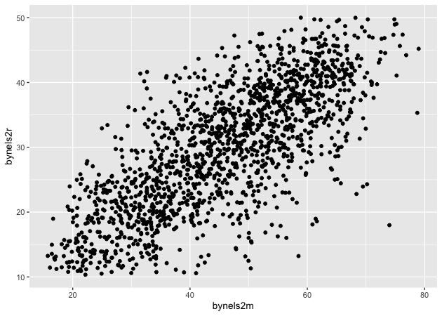
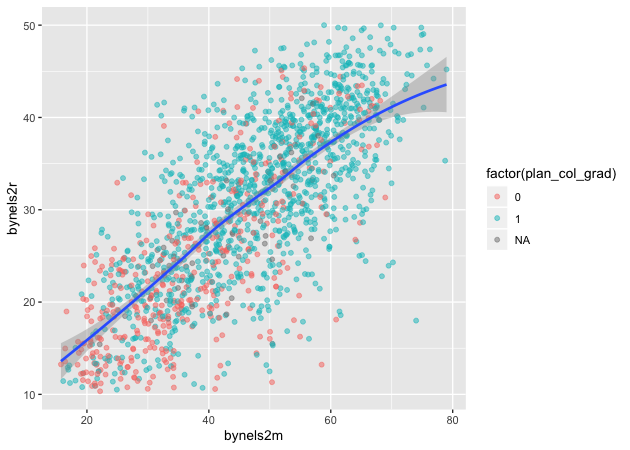

Another key part of exploratory data analysis is making plots that let
you visually inspect the data. This module will focus on graphics.

R has three major graphing systems: the [base
system](https://stat.ethz.ch/R-manual/R-devel/library/graphics/html/00Index.html),
[lattice](http://lattice.r-forge.r-project.org), and
[ggplot2](http://ggplot2.tidyverse.org). Each system has its benefits
and drawbacks and each is also very versatile with many, many options
for creating and adjusting plots.

Unfortunately, there isn’t enough time to go through all three graphing
systems. After describing a few base R graphing functions, this module
will focus on ggplot2 since it allows users to build plots using the
[grammar of graphics](http://vita.had.co.nz/papers/layered-grammar.html)
and integrates well with the tidyverse.

We’ll use the same ELS plans data we’ve been using, again in Stata
format since it has variable and value labels.

``` r
## libraries
library(tidyverse)
library(haven)
library(labelled)
```

``` r
## read in Stata data file
df <- read_dta('../data/els_plans.dta')
```

Plots using base R
==================

Even though users have developed new graphics libraries, the base R
graphics system is still very powerful. It’s also very easy to use in a
pinch. When I want a quick visual of a data distribution that’s just for
me, I generally use base R.

Histogram
---------

For continuous variables, a histogram is a useful plot. Though the
`hist()` function has many options to adjust how it looks, the defaults
work really well.

``` r
## histogram of math scores
hist(df$bynels2m)
```


> #### Quick exercise
>
> Check the distribution of reading scores.

Density
-------

Density plots are also really helpful. R doesn’t have single density
plot function, but you can get a density plot in one of two ways, each
of which will give a slightly different result.

First, you can adjust the `hist()` function to add the `freq = FALSE`
argument. It looks like the first histogram above, but notice that the
y-axis now represents density rather than counts.

``` r
## density plot of math scores with hist() function
hist(df$bynels2m, freq = FALSE)
```


Second, you can `plot()` the `density()` of a continuous variable.
Unlike `hist()`, however, `density()` doesn’t automatically ignore
missing values, so we have to tell it to remove `NA`s.

``` r
## density plot of math scores
plot(density(df$bynels2m, na.rm = TRUE))
```


> #### Quick exercise
>
> Plot the density of reading scores. Next, try to use the `col`
> argument in `plot()` to change the color of the line to `'red'`.

Box plot
--------

Call a box plot using the `boxplot()` function. This one is a little
trickier because it uses the [R
formula](https://www.statmethods.net/graphs/boxplot.html) construction
to set the continuous variable against the group. (We’ll talk more about
formulas in the module on modeling.) The formula uses a tilde, `~`, and
should be constructed like this:

-   `<var> ~ <group var>`

Notice how we can use the `data` argument instead of adding `df$` in
front of the variable names.

``` r
## box plot of math scores against student expectations
boxplot(bynels2m ~ bystexp, data = df)
```


Scatter
-------

Finally, plot continuous variables against one another using the base
`plot()` function. There are two primary ways to make a scatter plot
using `plot()`:

-   `plot(x, y)`
-   `plot(y ~ x)`

With both, `x` is the variable that will go on the x-axis and `y` the
one that will go on the y-axis. It’s really a matter of which makes
sense to you. We’ll use the first.

``` r
## scatter plot of math against reading scores
plot(df$bynels2m, df$bynels2r)
```


> #### Quick exercise
>
> Rerun the above plot, but this time store it in an object. Next, plot
> reading scores against math scores using the second formula method and
> store it in another object. Visually compare the two, but for a more
> formal test, use `identical(plot_1, plot_2)` on the two plot objects
> to prove they are the same.

Plots using ggplot2
===================

The first few times I tried to use ggplot2, I didn’t quite get it. But
once I did (and it doesn’t take too long!), I really started to like it.
It’s now my go-to system for making plots.

The [ggplot2 system](http://ggplot2.tidyverse.org/reference/) is too
involved to cover in all of its details, but that’s kind of the point of
the grammar of graphics: once you see how it’s put together, you can
anticipate the commands you need to build your plot.

We’ll start by covering the same plots as above.

Histogram
---------

[As the main help site says](http://ggplot2.tidyverse.org), all ggplot2
plots need three things:

-   data
-   how variables in the data map onto the plot (*e.g.*, what’s on the
    x-axis? what’s on the y-axis)
-   what kind of figure you want to make (*e.g.*, what do you want to
    **do** with those data and mappings?)

Depending on the plot you want to make, each of these pieces may be
called at different points in the command structure, which is usually
made up of linked functions like other tidyverse libraries. The key
difference between ggplot2 and dplyr, for example, is that while dplyr
uses the pipe (`%>%`) to connect different functions, ggplot2 uses a
plus sign (`+`).

We’ll start by making a histogram again. To help make these pieces
clearer, I’ll use the argument names when possible. The first function,
which initializes the plot is `ggplot()`. Its first argument is the
data.

The aesthetic mappings, that is, which variables go where or how they
function on the plot, go inside the `aes()` function. Since we only have
one variable, `bynels2m`, it is assigned to `x`.

If we stop there and print…

``` r
## init ggplot 
p <- ggplot(data = df, mapping = aes(x = bynels2m))
p
```


…nothing! Well, not nothing, but no histogram. That’s because the plot
object `p` knows the data and the key variable mapping but doesn’t know
what do with them. What do we want?

Since we want a histogram, we add the `geom_histogram()` function to the
existing plot object. Trying again…

``` r
## add histogram instruction
p <- p + geom_histogram()
p
```


Success!

Density
-------

Unlike the base R graphics system, ggplot2 does have a density plotting
command, `geom_density()`. We’ll go ahead and chain it to the first
command and print.

Notice how the function chain is the mostly the same as above, but (1)
written in a single linked chain and (2) using a different `geom_*()`
command at the end to indicate that we want something different.

``` r
## density
p <- ggplot(data = df, mapping = aes(x = bynels2m)) +
    geom_density()
p
```


> #### Quick exercise
>
> Make a density plot of reading scores.

If we want to superimpose the density plot over the histogram, we only
need chain the two commands together with a slight modification in how
the histogram is made. This way, the histogram and the density will be
on the same scale.

The change happens in the `geom_histogram()` function, where we add a
new mapping: `aes(y = ..density..)`. (NOTE: this is similar to what we
did above in base R to make a histogram on a density scale.)

``` r
## histogram with density plot overlapping
p <- ggplot(data = df, mapping = aes(x = bynels2m)) +
    geom_histogram(mapping = aes(y = ..density..)) +
    geom_density()
p
```


It worked, but it’s not the greatest visual since the colors are the
same and the density plot is thin with no fill.

Adding to what came before, the `geom_histogram()` and `geom_density()`
both take on new arguments that change the defaults. Now the resulting
plot should look nicer and be easier to read.

``` r
## histogram with density plot overlapping (add color to see better)
p <- ggplot(data = df, mapping = aes(x = bynels2m)) +
    geom_histogram(mapping = aes(y = ..density..),
                   color = 'black',
                   fill = 'white') +
    geom_density(fill = 'red', alpha = 0.2)
p
```


> #### Quick exercise
>
> Try changing some of the arguments in the last plot. What happens when
> you change `alpha` (keep the value between 0 and 1)? What does the
> `color` argument change? And `fill`? What happens if you switch the
> `geom_*()` functions, call `geom_histogram()` after you call
> `geom_density()`?

Two-way
-------

Plotting the difference in a continuous distribution across groups is a
common task. Let’s see the difference between student math scores
between students with parents who have any postsecondary degree and
those without.

Since we’re using data that was labelled in Stata, we’ll first use
`val_labels()` to check the `bypared` variable.

``` r
## get parental education levels, use `val_labels()` to show them
val_labels(df$bypared)
```

                                   {missing} 
                                          NA 
       {survey component legitimate skip/na} 
                                          NA 
                             {nonrespondent} 
                                          NA 
                  did not finish high school 
                                           1 
           graduated from high school or ged 
                                           2 
           attended 2-year school, no degree 
                                           3 
                graduated from 2-year school 
                                           4 
          attended college, no 4-year degree 
                                           5 
                      graduated from college 
                                           6 
     completed master^s degree or equivalent 
                                           7 
    completed phd, md, other advanced degree 
                                           8 

The way this variable is structured prevents us from using a `>=` test
like we have been. We want to count parents with a two-year degree (`4`)
in addition to those having a Bachelor’s degree or higher (`6`, `7`, and
`8`), but we don’t want to count those who attended, but didn’t earn a
degree (`5`).

To do this, we’ll use the special operator `%in%` which does exactly
what it sounds like. If a value of `bypared` is **in** the set that we
give it, then the new indicator `pared_coll` will be 1; if not, 0.

The `ggplot()` function doesn’t need to use our full data. In fact, our
data needs to be set up a bit differently to make this plot. We’ll make
a new temporary data object that only has the data we need.

``` r
## need to set up data
plot_df <- df %>%
    select(bypared, bynels2m) %>%
    na.omit() %>%                       # can't plot NAs, so drop them
    mutate(pared_coll = ifelse(bypared %in% c(4,6,7,8), 1, 0)) %>%
    select(-bypared) 

## show
head(plot_df)
```

    # A tibble: 6 x 2
      bynels2m pared_coll
         <dbl>      <dbl>
    1     47.8          0
    2     55.3          0
    3     66.2          0
    4     35.3          0
    5     30.0          0
    6     24.3          0

To plot against the two groups we’ve made, we need to add it to the
aesthetic feature, `aes()`. The math score, `bynels2m`, is still mapped
to `x`, but since we want two side-by-side histograms, we set the `fill`
aesthetic to our new indicator variable. So the function knows that it’s
a group, we wrap it in the `factor()` function.

Finally, we add some changes to the `geom_histogram()` function so that
each group is on the same scale.

``` r
## two way histogram
p <- ggplot(data = plot_df,
            aes(x = bynels2m, fill = factor(pared_coll))) +
    geom_histogram(alpha = 0.5, stat = 'density', position = 'identity')
p
```


> #### Quick exercise
>
> Remove some of the new arguments in `geom_histogram()`. How does the
> resulting plot change? Remove the `factor()` function from around
> `pared_coll`: what happens?

Box plot
--------

By this point, you’re hopefully seeing the pattern in how ggplot2
figures are put together. To make a box plot, we need to add a `y`
mapping to the `aes()` in addition to the `x` mapping. We don’t have to,
but we’ve also added the same variable to `fill` as we did to `x`. We do
this so that in addition to having different box and whisker plots along
the x-axis, each plot is given its own color.

``` r
## box plot using both factor() and as_factor()
p <- ggplot(data = df,
            mapping = aes(x = factor(bypared),
                          y = bynels2r,
                          fill = as_factor(bypared))) +
    geom_boxplot()
p
```


> #### Quick exercise
>
> Change the `as_factor()` and `factor()` functions above. How does the
> plot change?

Scatter
=======

To make a scatter plot, make sure that the `aes()` has mappings for the
`x` axis and `y` axis and then use `geom_point()` to plot. To make
things easier to see, we’ll first reduce the data to 10% of the full
sample using `sample_frac()` from dplyr.

``` r
## sample 10% to make figure clearer
df_10 <- df %>% sample_frac(0.1)

## scatter
p <- ggplot(data = df_10, mapping = aes(x = bynels2m, y = bynels2r)) +
    geom_point()
p
```



Now that we have our scatter plot, let’s say that we want to add a third
dimension. Specifically, we want to change the color of each point based
on whether a student plans to earn a Bachelor’s degree or higher. That
means we need a new dummy variable that is 1 for those with BA/BS plans
and 0 for others.

We can look at the student base year expectations with `table()`…

``` r
## see student base year plans
table(df$bystexp)
```


      -1    1    2    3    4    5    6    7 
    1450  128  983  879  561 5416 3153 2666 

…but those numbers don’t tell us much. Since we read in a Stata data
file with labelled values, though, we can use the `val_labels()`
function to see our options.

``` r
## see how the labels map
val_labels(df$bystexp)
```

       {survey component legitimate skip/na} 
                                          NA 
                             {nonrespondent} 
                                          NA 
                                {don^t know} 
                                          NA 
            less than high school graduation 
                                           1 
          high school graduation or ged only 
                                           2 
    attend or complete 2-year college/school 
                                           3 
    attend college, 4-year degree incomplete 
                                           4 
                       graduate from college 
                                           5 
        obtain master^s degree or equivalent 
                                           6 
    obtain phd, md, or other advanced degree 
                                           7 

Now we see that `bystexp >= 5` mean a student plans to earn a Bachelor’s
degree or higher. Let’s create that.

``` r
## create variable for students who plan to graduate from college
df_10 <- df_10 %>%
    mutate(plan_col_grad = ifelse(bystexp >= 5, 1, 0))
```

Now that we have our new variable `plan_col_grad`, we can add it the
`color` aesthetic, `aes()` in `geom_point()`. Don’t forget to use
`factor()` so that ggplot knows to treat it like a group!

``` r
## scatter
p <- ggplot(data = df_10,
            mapping = aes(x = bynels2m, y = bynels2r)) +
    geom_point(mapping = aes(color = factor(plan_col_grad)), alpha = 0.5)
p
```


> #### Quick exercise
>
> Change how you make `plan_col_grad` so that instead of 1 and 0, you
> use ‘yes’ and ‘no’. Make your figure again. What changes?

Fitted lines
------------

It’s often helpful to plot fitted lines against a scatter plot to help
see the underlying trend. There are a number of ways to do this with the
`geom_smooth()` function.

### Linear fit

Setting `method = lm` in `geom_smooth()` will fit a simple straight line
with 95% confidence interval shaded around it.

``` r
## add fitted line with linear fit
p <- ggplot(data = df_10, mapping = aes(x = bynels2m, y = bynels2r)) +
    geom_point(mapping = aes(color = factor(plan_col_grad)), alpha = 0.5) +
    geom_smooth(method = lm)
p
```


### Linear fit with polynomials

In addition to the `method`, we can add a `formula` to allow the fitted
line to take a non-linear shape. Using the `aes()` values of `x` and
`y`, the argument below uses an R formula, `y ~ x`, but with the
addition of the `poly()` function. Setting the second argument in
`poly()` to 2 gives the line an extra quadratic term, which allows it to
take a more curved shape.

``` r
## add fitted line with polynomial linear fit
p <- ggplot(data = df_10, mapping = aes(x = bynels2m, y = bynels2r)) +
    geom_point(mapping = aes(color = factor(plan_col_grad)), alpha = 0.5) +
    geom_smooth(method = lm, formula = y ~ poly(x,2))
p
```


> #### Quick exercise
>
> Change the value in `poly()` to higher numbers. How does the line
> change?

### Loess

Finally, we can skip trying to adjust a linear line and just fit a
[loess](https://en.wikipedia.org/wiki/Local_regression).

``` r
## add fitted line with loess
p <- ggplot(data = df_10, mapping = aes(x = bynels2m, y = bynels2r)) +
    geom_point(mapping = aes(color = factor(plan_col_grad)), alpha = 0.5) +
    geom_smooth(method = loess)
p
```



Plotly
======

As a final example, we’ll turn our last plot into an interactive plotly
figure. [Plotly](https://plot.ly/d3-js-for-r-and-shiny-charts/) works
with a number of languages, but it integrates really well with ggplot.
In fact, once the plot is made, we only have to use the `ggplotly()`
function to make it interactive.

``` r
## load plotly library
library(plotly)
```


    Attaching package: 'plotly'

    The following object is masked from 'package:ggplot2':

        last_plot

    The following object is masked from 'package:stats':

        filter

    The following object is masked from 'package:graphics':

        layout

``` r
## create an interactive plot with the last figure
p <- ggplotly(p)
p
```

<!--html_preserve-->

<script type="application/json" data-for="26876352b17c">{"x":{"data":[{"x":[40.9799995422363,51.2900009155273,61.6300010681152,31.5799999237061,44.1100006103516,43.6399993896484,19.3199996948242,23.3199996948242,25.9300003051758,41.2400016784668,34.7400016784668,53.0900001525879,25.8799991607666,53.2599983215332,26.5400009155273,50.9700012207031,33,34.0800018310547,28.4099998474121,41.3199996948242,38.3400001525879,24.4200000762939,59.2700004577637,32.810001373291,49.3800010681152,55.3899993896484,45.4199981689453,61.7599983215332,40.8499984741211,31.0900001525879,45.8600006103516,37.7900009155273,34.2599983215332,44.4799995422363,41.3800010681152,36.3600006103516,39.1300010681152,19.2099990844727,29.0900001525879,18.8999996185303,41.8699989318848,63.0400009155273,35.9599990844727,45.3800010681152,30.9300003051758,36.0299987792969,58.4000015258789,41.7299995422363,51.8699989318848,27.1800003051758,44.4099998474121,29.5400009155273,15.5500001907349,54.6599998474121,41.1199989318848,28.8400001525879,24.25,23.5599994659424,29.0200004577637,52.4000015258789,46.3600006103516,53.189998626709,22.4400005340576,23.2399997711182,37.6199989318848,34.5999984741211,21.3400001525879,41.4000015258789,41.3300018310547,48.189998626709,56.9599990844727,33,67.0899963378906,37.4599990844727,46.0099983215332,43.7900009155273,32.3699989318848,44.4900016784668,70.3300018310547,36.4000015258789,51.0800018310547,24.0799999237061,43.2999992370605,41.6300010681152,22.1399993896484,49.5200004577637,25.0799999237061,60.939998626709,43.8300018310547,48.7999992370605,56.2599983215332,37.1199989318848,40.1599998474121,25.5400009155273,73.129997253418,43.1399993896484,46.7700004577637,37.2999992370605,58.310001373291,25.6299991607666,40.5900001525879,22.9599990844727,26.6000003814697,20.7600002288818,53.9099998474121,51.0200004577637,39.1100006103516,30.8799991607666,54.7099990844727,38.8699989318848,38.7400016784668,44.5299987792969,32.3699989318848,40.5800018310547,27.75,25.3899993896484,39.2099990844727,23.3899993896484,28.6000003814697,28.8199996948242,64.5299987792969,23.0799999237061,31.8799991607666,38.1199989318848,35.4799995422363,29.7700004577637,64.9199981689453,74.5699996948242,39.0200004577637,47.7200012207031,73.5800018310547,27.1299991607666,19.7099990844727,48.2400016784668,51.5499992370605,23.0300006866455,44.2000007629395,61.7700004577637,34.8600006103516,42.060001373291,57.7200012207031,43.310001373291,50.1800003051758,20.6299991607666,33.0200004577637,44.9099998474121,18.5200004577637,59.9900016784668,33.5299987792969,27.8899993896484,53.3699989318848,34.2099990844727,46.5299987792969,34.3400001525879,19.1399993896484,26.5699996948242,34.7299995422363,25.6100006103516,42.1699981689453,44.2000007629395,31.0900001525879,29.1399993896484,40.5499992370605,50.7200012207031,32.9000015258789,33.6100006103516,31.3500003814697,37.6599998474121,46.9599990844727,42,51.0099983215332,24.9200000762939,36.8300018310547,32.3699989318848,21.1399993896484,33.060001373291,21.2900009155273,50.9799995422363,27.6299991607666,50.3600006103516,45.4900016784668,43.9199981689453,38.0699996948242,20,35.5299987792969,45.4500007629395,22.2299995422363,34.1199989318848,35.9199981689453,26.9500007629395,31.2900009155273,35.9199981689453,41.6100006103516,45.8400001525879,30.1200008392334,35.2799987792969,49.5999984741211,41.0400009155273,40.1699981689453,50.7400016784668,61.6199989318848,32.0200004577637,58.3600006103516,49.8199996948242,37.2900009155273,27.8799991607666,24.5699996948242,46.9300003051758,61.6599998474121,42.6800003051758,38.3699989318848,54.1599998474121,56.1500015258789,18.4699993133545,39.0200004577637,24.9699993133545,17.7900009155273,43.2900009155273,62.5499992370605,43.4300003051758,22.9300003051758,36.1599998474121,43.7400016784668,24.4300003051758,23.3700008392334,19.8199996948242,34.75,45,46.1800003051758,28.4200000762939,43.2599983215332,48.3300018310547,24.5200004577637,57.7200012207031,42.5499992370605,19.9699993133545,30.2999992370605,25.9799995422363,25.1299991607666,27.8299999237061,47.3499984741211,65.75,28.3400001525879,38.8300018310547,55.8699989318848,50,41.5200004577637,32.1699981689453,46.9099998474121,21.9899997711182,45.310001373291,51.9199981689453,24.0900001525879,44.0699996948242,22.1800003051758,39.4199981689453,45.5800018310547,46.2200012207031,51.9799995422363,42.810001373291,22.1000003814697,21.6900005340576,23.8799991607666,58.2299995422363,47.5299987792969,28.0200004577637,61.7999992370605,30.7099990844727,31.7999992370605,60.0800018310547,22.7900009155273,31.8799991607666,26.6499996185303,44.7000007629395,19.4899997711182,56.7799987792969,28.0400009155273,41.0900001525879,49.7400016784668,30.9099998474121,36.6399993896484,30.6499996185303,30.2000007629395,20.6499996185303,36.75,23.5900001525879,36.0999984741211,45.1599998474121,66.1100006103516,27.6000003814697,27.8500003814697,18.0200004577637,31.5100002288818,32.2599983215332,44.4599990844727,29.6000003814697,34.25,46.3600006103516,31.6100006103516,36.0099983215332,55.9900016784668,25.6100006103516,37.5,15.9399995803833,22.0900001525879,45.5900001525879,64.7300033569336,44.5499992370605,32.8499984741211,23.7099990844727,59.0200004577637,27.0499992370605,37,24.75,48.5999984741211,25.3400001525879,65.6500015258789,48.2900009155273,35.75,40.4199981689453,49.4199981689453,17.7999992370605,50.3699989318848,24.4500007629395,44.2900009155273,69.5899963378906,29.1200008392334,51.2299995422363,50.4199981689453,57.7000007629395,29.5200004577637,21.7299995422363,22.1000003814697,20.4500007629395,45.5999984741211,50.4599990844727,53.3800010681152,19.8899993896484,17.7299995422363,51.9099998474121,45.5499992370605,46.9500007629395,30.1900005340576,59.6199989318848,41.5200004577637,34.8300018310547,37.5499992370605,50.7599983215332,34.2599983215332,32.7099990844727,28.7099990844727,23.3299999237061,38.5200004577637,35.0400009155273,36.2400016784668,27.5300006866455,40.189998626709,35.7599983215332,39.7000007629395,29.5499992370605,45.3699989318848,28.6299991607666,38.9199981689453,40.5999984741211,42.8300018310547,41.6800003051758,28.0400009155273,31.0799999237061,35.2900009155273,41.0299987792969,38.1399993896484,33.5299987792969,44.0699996948242,27.8199996948242,39.6300010681152,25.9300003051758,53.0400009155273,34.6500015258789,24.8899993896484,31.3299999237061,38.4099998474121,36.2400016784668,60.5,43.2299995422363,25.0799999237061,34.5999984741211,24.0400009155273],"y":[29.4699993133545,40.3699989318848,29.8299999237061,23.7099990844727,22.9799995422363,30.6499996185303,15.4799995422363,13.6700000762939,17.4699993133545,12.210000038147,19.4400005340576,25.9500007629395,35.3300018310547,35.8699989318848,21.8099994659424,38.060001373291,23.3299999237061,21.1000003814697,26.7999992370605,23.9899997711182,11.6400003433228,16.4400005340576,34.0299987792969,13.5600004196167,34.1399993896484,39.5900001525879,22.2900009155273,37.939998626709,25.0799999237061,30.9300003051758,35.0900001525879,10.5200004577637,24.5900001525879,20.4200000762939,11.8000001907349,25.0100002288818,28.1399993896484,11.0699996948242,14.539999961853,18.8600006103516,11.4099998474121,41.4000015258789,25.9699993133545,17.75,28.2900009155273,26.9400005340576,37.560001373291,18.2999992370605,30.8199996948242,23.5599994659424,31.7999992370605,19.6599998474121,15.4799995422363,42.5499992370605,13.4899997711182,20.6299991607666,16.3500003814697,13.039999961853,15.0900001525879,33.1599998474121,25.6100006103516,33.2200012207031,23.6100006103516,13.0600004196167,18.2600002288818,15.7700004577637,24.3400001525879,32.2799987792969,31.1000003814697,29.0200004577637,38.3899993896484,19.8999996185303,46.75,21.2600002288818,19.3500003814697,34.8899993896484,29.7299995422363,22.3999996185303,25.8700008392334,25.1100006103516,22.5100002288818,24.0200004577637,18.6399993896484,30.6399993896484,12.9200000762939,27.4899997711182,22.2000007629395,35.7900009155273,35.6100006103516,32.1800003051758,22.6200008392334,25.4899997711182,29.4599990844727,12.039999961853,37.9799995422363,32.9700012207031,19.3199996948242,40.2299995422363,33.8199996948242,11.3800001144409,23.7700004577637,18.7600002288818,13.7700004577637,12.2799997329712,32.3499984741211,32.4500007629395,31.0499992370605,16.2199993133545,32.6199989318848,32.8699989318848,30.2800006866455,20.2600002288818,12.1599998474121,33.6199989318848,13.0799999237061,23.0799999237061,20.4200000762939,17.7999992370605,18.1399993896484,24.5200004577637,22.1299991607666,13.0799999237061,24.1800003051758,25.0200004577637,27.2199993133545,18.2199993133545,50.5699996948242,37.1599998474121,19.9400005340576,36.0400009155273,45.2900009155273,25.8500003814697,17.1399993896484,38.9799995422363,16.2299995422363,20.5400009155273,12.6499996185303,37.6300010681152,40.0900001525879,33.5800018310547,28.8199996948242,41.7999992370605,24.5,14.039999961853,18.0799999237061,35.189998626709,13.6000003814697,40.7000007629395,21.1599998474121,18.7099990844727,46.3199996948242,31.8600006103516,25.7600002288818,18.3899993896484,16.0599994659424,20.1599998474121,40.7799987792969,22.9400005340576,28.5599994659424,37.6399993896484,15.0299997329712,35.6500015258789,25.6000003814697,33.6100006103516,13.6999998092651,17.7600002288818,22.7199993133545,16.75,32.4500007629395,30.0599994659424,21.6700000762939,24.5699996948242,22.4099998474121,26.2299995422363,12.25,18.7000007629395,11.1899995803833,18.5799999237061,29.8799991607666,11.3199996948242,24.3099994659424,38.0200004577637,21.75,13.8999996185303,14.3800001144409,24.9099998474121,17.2399997711182,28.8600006103516,19.2600002288818,19.9899997711182,24.7800006866455,16.75,27.5200004577637,42.0800018310547,16.8999996185303,30.6399993896484,34.5900001525879,26.4200000762939,33.6399993896484,23.3700008392334,37.5800018310547,13.8100004196167,43.2900009155273,25.4699993133545,32.0299987792969,18.4500007629395,28.7600002288818,25.8500003814697,45.6500015258789,31.0699996948242,25.6499996185303,28.6700000762939,35.6699981689453,13.210000038147,12.5799999237061,32.9300003051758,15.789999961853,28.8500003814697,47.5299987792969,30.6299991607666,17.2099990844727,15.210000038147,28.5799999237061,16.2299995422363,18.8600006103516,17.9899997711182,16.3899993896484,32.4599990844727,20.8899993896484,11.6599998474121,30.4099998474121,26.4599990844727,31.6000003814697,34.1300010681152,28.5699996948242,17.5200004577637,11.2700004577637,11.0299997329712,19.9099998474121,17.6700000762939,29.5300006866455,34.5800018310547,40.8199996948242,31.4300003051758,28.2700004577637,16.0200004577637,32.310001373291,24.9799995422363,27.2900009155273,10.710000038147,32.3300018310547,45.0800018310547,13.039999961853,33.6100006103516,18.2099990844727,30.6499996185303,32.75,25.5499992370605,32,27.4599990844727,20.2099990844727,21.4699993133545,22.8799991607666,26.0200004577637,30.2299995422363,13.2799997329712,37.2099990844727,19.4899997711182,23.3199996948242,33.8699989318848,23.7999992370605,26.8099994659424,15.7200002670288,25.2099990844727,16.8500003814697,39.3800010681152,23.7199993133545,24.3199996948242,33.7200012207031,22.1299991607666,14.9799995422363,20.2600002288818,20.2299995422363,19.7800006866455,29.4400005340576,12.4399995803833,19.3700008392334,39.1800003051758,30.4699993133545,15.9499998092651,20.8600006103516,10.7200002670288,21.8400001525879,17.3799991607666,33.4300003051758,32.5,20.8899993896484,23.5300006866455,26.1100006103516,23.1700000762939,35.1500015258789,13.2600002288818,32.2299995422363,14.8000001907349,16.1200008392334,28.3799991607666,41.3199996948242,33.689998626709,27.4599990844727,18.8799991607666,33.3899993896484,17.4799995422363,25.8799991607666,14.6099996566772,40.4000015258789,12.6599998474121,30.6200008392334,30.9500007629395,17.1200008392334,31.6900005340576,32.5299987792969,11.2700004577637,33.3699989318848,28.5300006866455,28.2399997711182,12.5500001907349,21.5599994659424,30.1100006103516,15.4700002670288,41.9000015258789,28.9099998474121,20.8700008392334,29.9699993133545,16.1599998474121,21.7800006866455,34.7799987792969,28.9799995422363,12.3900003433228,22.1599998474121,28.7900009155273,22.2399997711182,39.0200004577637,22.7600002288818,39.8600006103516,31.0100002288818,23.2199993133545,22.2099990844727,28.3099994659424,10.7399997711182,22.5799999237061,24.0799999237061,11.25,11.8000001907349,17.5300006866455,32.9300003051758,17.5499992370605,22.5100002288818,41.689998626709,26.3099994659424,28.3700008392334,19.6399993896484,21.6700000762939,16.4699993133545,31.0799999237061,28,36.0699996948242,18.2900009155273,17.9400005340576,11.8299999237061,10.5799999237061,27.6100006103516,25.5,20.0100002288818,13.9499998092651,13.5600004196167,23.4699993133545,39.75,21.7399997711182,15.1300001144409,24.6700000762939,27.5599994659424,23.8700008392334,33.8699989318848,20.4300003051758,13.9300003051758,18.6599998474121,13.7299995422363],"text":["factor(plan_col_grad): 0<br />bynels2m: 40.98<br />bynels2r: 29.47","factor(plan_col_grad): 0<br />bynels2m: 51.29<br />bynels2r: 40.37","factor(plan_col_grad): 0<br />bynels2m: 61.63<br />bynels2r: 29.83","factor(plan_col_grad): 0<br />bynels2m: 31.58<br />bynels2r: 23.71","factor(plan_col_grad): 0<br />bynels2m: 44.11<br />bynels2r: 22.98","factor(plan_col_grad): 0<br />bynels2m: 43.64<br />bynels2r: 30.65","factor(plan_col_grad): 0<br />bynels2m: 19.32<br />bynels2r: 15.48","factor(plan_col_grad): 0<br />bynels2m: 23.32<br />bynels2r: 13.67","factor(plan_col_grad): 0<br />bynels2m: 25.93<br />bynels2r: 17.47","factor(plan_col_grad): 0<br />bynels2m: 41.24<br />bynels2r: 12.21","factor(plan_col_grad): 0<br />bynels2m: 34.74<br />bynels2r: 19.44","factor(plan_col_grad): 0<br />bynels2m: 53.09<br />bynels2r: 25.95","factor(plan_col_grad): 0<br />bynels2m: 25.88<br />bynels2r: 35.33","factor(plan_col_grad): 0<br />bynels2m: 53.26<br />bynels2r: 35.87","factor(plan_col_grad): 0<br />bynels2m: 26.54<br />bynels2r: 21.81","factor(plan_col_grad): 0<br />bynels2m: 50.97<br />bynels2r: 38.06","factor(plan_col_grad): 0<br />bynels2m: 33.00<br />bynels2r: 23.33","factor(plan_col_grad): 0<br />bynels2m: 34.08<br />bynels2r: 21.10","factor(plan_col_grad): 0<br />bynels2m: 28.41<br />bynels2r: 26.80","factor(plan_col_grad): 0<br />bynels2m: 41.32<br />bynels2r: 23.99","factor(plan_col_grad): 0<br />bynels2m: 38.34<br />bynels2r: 11.64","factor(plan_col_grad): 0<br />bynels2m: 24.42<br />bynels2r: 16.44","factor(plan_col_grad): 0<br />bynels2m: 59.27<br />bynels2r: 34.03","factor(plan_col_grad): 0<br />bynels2m: 32.81<br />bynels2r: 13.56","factor(plan_col_grad): 0<br />bynels2m: 49.38<br />bynels2r: 34.14","factor(plan_col_grad): 0<br />bynels2m: 55.39<br />bynels2r: 39.59","factor(plan_col_grad): 0<br />bynels2m: 45.42<br />bynels2r: 22.29","factor(plan_col_grad): 0<br />bynels2m: 61.76<br />bynels2r: 37.94","factor(plan_col_grad): 0<br />bynels2m: 40.85<br />bynels2r: 25.08","factor(plan_col_grad): 0<br />bynels2m: 31.09<br />bynels2r: 30.93","factor(plan_col_grad): 0<br />bynels2m: 45.86<br />bynels2r: 35.09","factor(plan_col_grad): 0<br />bynels2m: 37.79<br />bynels2r: 10.52","factor(plan_col_grad): 0<br />bynels2m: 34.26<br />bynels2r: 24.59","factor(plan_col_grad): 0<br />bynels2m: 44.48<br />bynels2r: 20.42","factor(plan_col_grad): 0<br />bynels2m: 41.38<br />bynels2r: 11.80","factor(plan_col_grad): 0<br />bynels2m: 36.36<br />bynels2r: 25.01","factor(plan_col_grad): 0<br />bynels2m: 39.13<br />bynels2r: 28.14","factor(plan_col_grad): 0<br />bynels2m: 19.21<br />bynels2r: 11.07","factor(plan_col_grad): 0<br />bynels2m: 29.09<br />bynels2r: 14.54","factor(plan_col_grad): 0<br />bynels2m: 18.90<br />bynels2r: 18.86","factor(plan_col_grad): 0<br />bynels2m: 41.87<br />bynels2r: 11.41","factor(plan_col_grad): 0<br />bynels2m: 63.04<br />bynels2r: 41.40","factor(plan_col_grad): 0<br />bynels2m: 35.96<br />bynels2r: 25.97","factor(plan_col_grad): 0<br />bynels2m: 45.38<br />bynels2r: 17.75","factor(plan_col_grad): 0<br />bynels2m: 30.93<br />bynels2r: 28.29","factor(plan_col_grad): 0<br />bynels2m: 36.03<br />bynels2r: 26.94","factor(plan_col_grad): 0<br />bynels2m: 58.40<br />bynels2r: 37.56","factor(plan_col_grad): 0<br />bynels2m: 41.73<br />bynels2r: 18.30","factor(plan_col_grad): 0<br />bynels2m: 51.87<br />bynels2r: 30.82","factor(plan_col_grad): 0<br />bynels2m: 27.18<br />bynels2r: 23.56","factor(plan_col_grad): 0<br />bynels2m: 44.41<br />bynels2r: 31.80","factor(plan_col_grad): 0<br />bynels2m: 29.54<br />bynels2r: 19.66","factor(plan_col_grad): 0<br />bynels2m: 15.55<br />bynels2r: 15.48","factor(plan_col_grad): 0<br />bynels2m: 54.66<br />bynels2r: 42.55","factor(plan_col_grad): 0<br />bynels2m: 41.12<br />bynels2r: 13.49","factor(plan_col_grad): 0<br />bynels2m: 28.84<br />bynels2r: 20.63","factor(plan_col_grad): 0<br />bynels2m: 24.25<br />bynels2r: 16.35","factor(plan_col_grad): 0<br />bynels2m: 23.56<br />bynels2r: 13.04","factor(plan_col_grad): 0<br />bynels2m: 29.02<br />bynels2r: 15.09","factor(plan_col_grad): 0<br />bynels2m: 52.40<br />bynels2r: 33.16","factor(plan_col_grad): 0<br />bynels2m: 46.36<br />bynels2r: 25.61","factor(plan_col_grad): 0<br />bynels2m: 53.19<br />bynels2r: 33.22","factor(plan_col_grad): 0<br />bynels2m: 22.44<br />bynels2r: 23.61","factor(plan_col_grad): 0<br />bynels2m: 23.24<br />bynels2r: 13.06","factor(plan_col_grad): 0<br />bynels2m: 37.62<br />bynels2r: 18.26","factor(plan_col_grad): 0<br />bynels2m: 34.60<br />bynels2r: 15.77","factor(plan_col_grad): 0<br />bynels2m: 21.34<br />bynels2r: 24.34","factor(plan_col_grad): 0<br />bynels2m: 41.40<br />bynels2r: 32.28","factor(plan_col_grad): 0<br />bynels2m: 41.33<br />bynels2r: 31.10","factor(plan_col_grad): 0<br />bynels2m: 48.19<br />bynels2r: 29.02","factor(plan_col_grad): 0<br />bynels2m: 56.96<br />bynels2r: 38.39","factor(plan_col_grad): 0<br />bynels2m: 33.00<br />bynels2r: 19.90","factor(plan_col_grad): 0<br />bynels2m: 67.09<br />bynels2r: 46.75","factor(plan_col_grad): 0<br />bynels2m: 37.46<br />bynels2r: 21.26","factor(plan_col_grad): 0<br />bynels2m: 46.01<br />bynels2r: 19.35","factor(plan_col_grad): 0<br />bynels2m: 43.79<br />bynels2r: 34.89","factor(plan_col_grad): 0<br />bynels2m: 32.37<br />bynels2r: 29.73","factor(plan_col_grad): 0<br />bynels2m: 44.49<br />bynels2r: 22.40","factor(plan_col_grad): 0<br />bynels2m: 70.33<br />bynels2r: 25.87","factor(plan_col_grad): 0<br />bynels2m: 36.40<br />bynels2r: 25.11","factor(plan_col_grad): 0<br />bynels2m: 51.08<br />bynels2r: 22.51","factor(plan_col_grad): 0<br />bynels2m: 24.08<br />bynels2r: 24.02","factor(plan_col_grad): 0<br />bynels2m: 43.30<br />bynels2r: 18.64","factor(plan_col_grad): 0<br />bynels2m: 41.63<br />bynels2r: 30.64","factor(plan_col_grad): 0<br />bynels2m: 22.14<br />bynels2r: 12.92","factor(plan_col_grad): 0<br />bynels2m: 49.52<br />bynels2r: 27.49","factor(plan_col_grad): 0<br />bynels2m: 25.08<br />bynels2r: 22.20","factor(plan_col_grad): 0<br />bynels2m: 60.94<br />bynels2r: 35.79","factor(plan_col_grad): 0<br />bynels2m: 43.83<br />bynels2r: 35.61","factor(plan_col_grad): 0<br />bynels2m: 48.80<br />bynels2r: 32.18","factor(plan_col_grad): 0<br />bynels2m: 56.26<br />bynels2r: 22.62","factor(plan_col_grad): 0<br />bynels2m: 37.12<br />bynels2r: 25.49","factor(plan_col_grad): 0<br />bynels2m: 40.16<br />bynels2r: 29.46","factor(plan_col_grad): 0<br />bynels2m: 25.54<br />bynels2r: 12.04","factor(plan_col_grad): 0<br />bynels2m: 73.13<br />bynels2r: 37.98","factor(plan_col_grad): 0<br />bynels2m: 43.14<br />bynels2r: 32.97","factor(plan_col_grad): 0<br />bynels2m: 46.77<br />bynels2r: 19.32","factor(plan_col_grad): 0<br />bynels2m: 37.30<br />bynels2r: 40.23","factor(plan_col_grad): 0<br />bynels2m: 58.31<br />bynels2r: 33.82","factor(plan_col_grad): 0<br />bynels2m: 25.63<br />bynels2r: 11.38","factor(plan_col_grad): 0<br />bynels2m: 40.59<br />bynels2r: 23.77","factor(plan_col_grad): 0<br />bynels2m: 22.96<br />bynels2r: 18.76","factor(plan_col_grad): 0<br />bynels2m: 26.60<br />bynels2r: 13.77","factor(plan_col_grad): 0<br />bynels2m: 20.76<br />bynels2r: 12.28","factor(plan_col_grad): 0<br />bynels2m: 53.91<br />bynels2r: 32.35","factor(plan_col_grad): 0<br />bynels2m: 51.02<br />bynels2r: 32.45","factor(plan_col_grad): 0<br />bynels2m: 39.11<br />bynels2r: 31.05","factor(plan_col_grad): 0<br />bynels2m: 30.88<br />bynels2r: 16.22","factor(plan_col_grad): 0<br />bynels2m: 54.71<br />bynels2r: 32.62","factor(plan_col_grad): 0<br />bynels2m: 38.87<br />bynels2r: 32.87","factor(plan_col_grad): 0<br />bynels2m: 38.74<br />bynels2r: 30.28","factor(plan_col_grad): 0<br />bynels2m: 44.53<br />bynels2r: 20.26","factor(plan_col_grad): 0<br />bynels2m: 32.37<br />bynels2r: 12.16","factor(plan_col_grad): 0<br />bynels2m: 40.58<br />bynels2r: 33.62","factor(plan_col_grad): 0<br />bynels2m: 27.75<br />bynels2r: 13.08","factor(plan_col_grad): 0<br />bynels2m: 25.39<br />bynels2r: 23.08","factor(plan_col_grad): 0<br />bynels2m: 39.21<br />bynels2r: 20.42","factor(plan_col_grad): 0<br />bynels2m: 23.39<br />bynels2r: 17.80","factor(plan_col_grad): 0<br />bynels2m: 28.60<br />bynels2r: 18.14","factor(plan_col_grad): 0<br />bynels2m: 28.82<br />bynels2r: 24.52","factor(plan_col_grad): 0<br />bynels2m: 64.53<br />bynels2r: 22.13","factor(plan_col_grad): 0<br />bynels2m: 23.08<br />bynels2r: 13.08","factor(plan_col_grad): 0<br />bynels2m: 31.88<br />bynels2r: 24.18","factor(plan_col_grad): 0<br />bynels2m: 38.12<br />bynels2r: 25.02","factor(plan_col_grad): 0<br />bynels2m: 35.48<br />bynels2r: 27.22","factor(plan_col_grad): 0<br />bynels2m: 29.77<br />bynels2r: 18.22","factor(plan_col_grad): 0<br />bynels2m: 64.92<br />bynels2r: 50.57","factor(plan_col_grad): 0<br />bynels2m: 74.57<br />bynels2r: 37.16","factor(plan_col_grad): 0<br />bynels2m: 39.02<br />bynels2r: 19.94","factor(plan_col_grad): 0<br />bynels2m: 47.72<br />bynels2r: 36.04","factor(plan_col_grad): 0<br />bynels2m: 73.58<br />bynels2r: 45.29","factor(plan_col_grad): 0<br />bynels2m: 27.13<br />bynels2r: 25.85","factor(plan_col_grad): 0<br />bynels2m: 19.71<br />bynels2r: 17.14","factor(plan_col_grad): 0<br />bynels2m: 48.24<br />bynels2r: 38.98","factor(plan_col_grad): 0<br />bynels2m: 51.55<br />bynels2r: 16.23","factor(plan_col_grad): 0<br />bynels2m: 23.03<br />bynels2r: 20.54","factor(plan_col_grad): 0<br />bynels2m: 44.20<br />bynels2r: 12.65","factor(plan_col_grad): 0<br />bynels2m: 61.77<br />bynels2r: 37.63","factor(plan_col_grad): 0<br />bynels2m: 34.86<br />bynels2r: 40.09","factor(plan_col_grad): 0<br />bynels2m: 42.06<br />bynels2r: 33.58","factor(plan_col_grad): 0<br />bynels2m: 57.72<br />bynels2r: 28.82","factor(plan_col_grad): 0<br />bynels2m: 43.31<br />bynels2r: 41.80","factor(plan_col_grad): 0<br />bynels2m: 50.18<br />bynels2r: 24.50","factor(plan_col_grad): 0<br />bynels2m: 20.63<br />bynels2r: 14.04","factor(plan_col_grad): 0<br />bynels2m: 33.02<br />bynels2r: 18.08","factor(plan_col_grad): 0<br />bynels2m: 44.91<br />bynels2r: 35.19","factor(plan_col_grad): 0<br />bynels2m: 18.52<br />bynels2r: 13.60","factor(plan_col_grad): 0<br />bynels2m: 59.99<br />bynels2r: 40.70","factor(plan_col_grad): 0<br />bynels2m: 33.53<br />bynels2r: 21.16","factor(plan_col_grad): 0<br />bynels2m: 27.89<br />bynels2r: 18.71","factor(plan_col_grad): 0<br />bynels2m: 53.37<br />bynels2r: 46.32","factor(plan_col_grad): 0<br />bynels2m: 34.21<br />bynels2r: 31.86","factor(plan_col_grad): 0<br />bynels2m: 46.53<br />bynels2r: 25.76","factor(plan_col_grad): 0<br />bynels2m: 34.34<br />bynels2r: 18.39","factor(plan_col_grad): 0<br />bynels2m: 19.14<br />bynels2r: 16.06","factor(plan_col_grad): 0<br />bynels2m: 26.57<br />bynels2r: 20.16","factor(plan_col_grad): 0<br />bynels2m: 34.73<br />bynels2r: 40.78","factor(plan_col_grad): 0<br />bynels2m: 25.61<br />bynels2r: 22.94","factor(plan_col_grad): 0<br />bynels2m: 42.17<br />bynels2r: 28.56","factor(plan_col_grad): 0<br />bynels2m: 44.20<br />bynels2r: 37.64","factor(plan_col_grad): 0<br />bynels2m: 31.09<br />bynels2r: 15.03","factor(plan_col_grad): 0<br />bynels2m: 29.14<br />bynels2r: 35.65","factor(plan_col_grad): 0<br />bynels2m: 40.55<br />bynels2r: 25.60","factor(plan_col_grad): 0<br />bynels2m: 50.72<br />bynels2r: 33.61","factor(plan_col_grad): 0<br />bynels2m: 32.90<br />bynels2r: 13.70","factor(plan_col_grad): 0<br />bynels2m: 33.61<br />bynels2r: 17.76","factor(plan_col_grad): 0<br />bynels2m: 31.35<br />bynels2r: 22.72","factor(plan_col_grad): 0<br />bynels2m: 37.66<br />bynels2r: 16.75","factor(plan_col_grad): 0<br />bynels2m: 46.96<br />bynels2r: 32.45","factor(plan_col_grad): 0<br />bynels2m: 42.00<br />bynels2r: 30.06","factor(plan_col_grad): 0<br />bynels2m: 51.01<br />bynels2r: 21.67","factor(plan_col_grad): 0<br />bynels2m: 24.92<br />bynels2r: 24.57","factor(plan_col_grad): 0<br />bynels2m: 36.83<br />bynels2r: 22.41","factor(plan_col_grad): 0<br />bynels2m: 32.37<br />bynels2r: 26.23","factor(plan_col_grad): 0<br />bynels2m: 21.14<br />bynels2r: 12.25","factor(plan_col_grad): 0<br />bynels2m: 33.06<br />bynels2r: 18.70","factor(plan_col_grad): 0<br />bynels2m: 21.29<br />bynels2r: 11.19","factor(plan_col_grad): 0<br />bynels2m: 50.98<br />bynels2r: 18.58","factor(plan_col_grad): 0<br />bynels2m: 27.63<br />bynels2r: 29.88","factor(plan_col_grad): 0<br />bynels2m: 50.36<br />bynels2r: 11.32","factor(plan_col_grad): 0<br />bynels2m: 45.49<br />bynels2r: 24.31","factor(plan_col_grad): 0<br />bynels2m: 43.92<br />bynels2r: 38.02","factor(plan_col_grad): 0<br />bynels2m: 38.07<br />bynels2r: 21.75","factor(plan_col_grad): 0<br />bynels2m: 20.00<br />bynels2r: 13.90","factor(plan_col_grad): 0<br />bynels2m: 35.53<br />bynels2r: 14.38","factor(plan_col_grad): 0<br />bynels2m: 45.45<br />bynels2r: 24.91","factor(plan_col_grad): 0<br />bynels2m: 22.23<br />bynels2r: 17.24","factor(plan_col_grad): 0<br />bynels2m: 34.12<br />bynels2r: 28.86","factor(plan_col_grad): 0<br />bynels2m: 35.92<br />bynels2r: 19.26","factor(plan_col_grad): 0<br />bynels2m: 26.95<br />bynels2r: 19.99","factor(plan_col_grad): 0<br />bynels2m: 31.29<br />bynels2r: 24.78","factor(plan_col_grad): 0<br />bynels2m: 35.92<br />bynels2r: 16.75","factor(plan_col_grad): 0<br />bynels2m: 41.61<br />bynels2r: 27.52","factor(plan_col_grad): 0<br />bynels2m: 45.84<br />bynels2r: 42.08","factor(plan_col_grad): 0<br />bynels2m: 30.12<br />bynels2r: 16.90","factor(plan_col_grad): 0<br />bynels2m: 35.28<br />bynels2r: 30.64","factor(plan_col_grad): 0<br />bynels2m: 49.60<br />bynels2r: 34.59","factor(plan_col_grad): 0<br />bynels2m: 41.04<br />bynels2r: 26.42","factor(plan_col_grad): 0<br />bynels2m: 40.17<br />bynels2r: 33.64","factor(plan_col_grad): 0<br />bynels2m: 50.74<br />bynels2r: 23.37","factor(plan_col_grad): 0<br />bynels2m: 61.62<br />bynels2r: 37.58","factor(plan_col_grad): 0<br />bynels2m: 32.02<br />bynels2r: 13.81","factor(plan_col_grad): 0<br />bynels2m: 58.36<br />bynels2r: 43.29","factor(plan_col_grad): 0<br />bynels2m: 49.82<br />bynels2r: 25.47","factor(plan_col_grad): 0<br />bynels2m: 37.29<br />bynels2r: 32.03","factor(plan_col_grad): 0<br />bynels2m: 27.88<br />bynels2r: 18.45","factor(plan_col_grad): 0<br />bynels2m: 24.57<br />bynels2r: 28.76","factor(plan_col_grad): 0<br />bynels2m: 46.93<br />bynels2r: 25.85","factor(plan_col_grad): 0<br />bynels2m: 61.66<br />bynels2r: 45.65","factor(plan_col_grad): 0<br />bynels2m: 42.68<br />bynels2r: 31.07","factor(plan_col_grad): 0<br />bynels2m: 38.37<br />bynels2r: 25.65","factor(plan_col_grad): 0<br />bynels2m: 54.16<br />bynels2r: 28.67","factor(plan_col_grad): 0<br />bynels2m: 56.15<br />bynels2r: 35.67","factor(plan_col_grad): 0<br />bynels2m: 18.47<br />bynels2r: 13.21","factor(plan_col_grad): 0<br />bynels2m: 39.02<br />bynels2r: 12.58","factor(plan_col_grad): 0<br />bynels2m: 24.97<br />bynels2r: 32.93","factor(plan_col_grad): 0<br />bynels2m: 17.79<br />bynels2r: 15.79","factor(plan_col_grad): 0<br />bynels2m: 43.29<br />bynels2r: 28.85","factor(plan_col_grad): 0<br />bynels2m: 62.55<br />bynels2r: 47.53","factor(plan_col_grad): 0<br />bynels2m: 43.43<br />bynels2r: 30.63","factor(plan_col_grad): 0<br />bynels2m: 22.93<br />bynels2r: 17.21","factor(plan_col_grad): 0<br />bynels2m: 36.16<br />bynels2r: 15.21","factor(plan_col_grad): 0<br />bynels2m: 43.74<br />bynels2r: 28.58","factor(plan_col_grad): 0<br />bynels2m: 24.43<br />bynels2r: 16.23","factor(plan_col_grad): 0<br />bynels2m: 23.37<br />bynels2r: 18.86","factor(plan_col_grad): 0<br />bynels2m: 19.82<br />bynels2r: 17.99","factor(plan_col_grad): 0<br />bynels2m: 34.75<br />bynels2r: 16.39","factor(plan_col_grad): 0<br />bynels2m: 45.00<br />bynels2r: 32.46","factor(plan_col_grad): 0<br />bynels2m: 46.18<br />bynels2r: 20.89","factor(plan_col_grad): 0<br />bynels2m: 28.42<br />bynels2r: 11.66","factor(plan_col_grad): 0<br />bynels2m: 43.26<br />bynels2r: 30.41","factor(plan_col_grad): 0<br />bynels2m: 48.33<br />bynels2r: 26.46","factor(plan_col_grad): 0<br />bynels2m: 24.52<br />bynels2r: 31.60","factor(plan_col_grad): 0<br />bynels2m: 57.72<br />bynels2r: 34.13","factor(plan_col_grad): 0<br />bynels2m: 42.55<br />bynels2r: 28.57","factor(plan_col_grad): 0<br />bynels2m: 19.97<br />bynels2r: 17.52","factor(plan_col_grad): 0<br />bynels2m: 30.30<br />bynels2r: 11.27","factor(plan_col_grad): 0<br />bynels2m: 25.98<br />bynels2r: 11.03","factor(plan_col_grad): 0<br />bynels2m: 25.13<br />bynels2r: 19.91","factor(plan_col_grad): 0<br />bynels2m: 27.83<br />bynels2r: 17.67","factor(plan_col_grad): 0<br />bynels2m: 47.35<br />bynels2r: 29.53","factor(plan_col_grad): 0<br />bynels2m: 65.75<br />bynels2r: 34.58","factor(plan_col_grad): 0<br />bynels2m: 28.34<br />bynels2r: 40.82","factor(plan_col_grad): 0<br />bynels2m: 38.83<br />bynels2r: 31.43","factor(plan_col_grad): 0<br />bynels2m: 55.87<br />bynels2r: 28.27","factor(plan_col_grad): 0<br />bynels2m: 50.00<br />bynels2r: 16.02","factor(plan_col_grad): 0<br />bynels2m: 41.52<br />bynels2r: 32.31","factor(plan_col_grad): 0<br />bynels2m: 32.17<br />bynels2r: 24.98","factor(plan_col_grad): 0<br />bynels2m: 46.91<br />bynels2r: 27.29","factor(plan_col_grad): 0<br />bynels2m: 21.99<br />bynels2r: 10.71","factor(plan_col_grad): 0<br />bynels2m: 45.31<br />bynels2r: 32.33","factor(plan_col_grad): 0<br />bynels2m: 51.92<br />bynels2r: 45.08","factor(plan_col_grad): 0<br />bynels2m: 24.09<br />bynels2r: 13.04","factor(plan_col_grad): 0<br />bynels2m: 44.07<br />bynels2r: 33.61","factor(plan_col_grad): 0<br />bynels2m: 22.18<br />bynels2r: 18.21","factor(plan_col_grad): 0<br />bynels2m: 39.42<br />bynels2r: 30.65","factor(plan_col_grad): 0<br />bynels2m: 45.58<br />bynels2r: 32.75","factor(plan_col_grad): 0<br />bynels2m: 46.22<br />bynels2r: 25.55","factor(plan_col_grad): 0<br />bynels2m: 51.98<br />bynels2r: 32.00","factor(plan_col_grad): 0<br />bynels2m: 42.81<br />bynels2r: 27.46","factor(plan_col_grad): 0<br />bynels2m: 22.10<br />bynels2r: 20.21","factor(plan_col_grad): 0<br />bynels2m: 21.69<br />bynels2r: 21.47","factor(plan_col_grad): 0<br />bynels2m: 23.88<br />bynels2r: 22.88","factor(plan_col_grad): 0<br />bynels2m: 58.23<br />bynels2r: 26.02","factor(plan_col_grad): 0<br />bynels2m: 47.53<br />bynels2r: 30.23","factor(plan_col_grad): 0<br />bynels2m: 28.02<br />bynels2r: 13.28","factor(plan_col_grad): 0<br />bynels2m: 61.80<br />bynels2r: 37.21","factor(plan_col_grad): 0<br />bynels2m: 30.71<br />bynels2r: 19.49","factor(plan_col_grad): 0<br />bynels2m: 31.80<br />bynels2r: 23.32","factor(plan_col_grad): 0<br />bynels2m: 60.08<br />bynels2r: 33.87","factor(plan_col_grad): 0<br />bynels2m: 22.79<br />bynels2r: 23.80","factor(plan_col_grad): 0<br />bynels2m: 31.88<br />bynels2r: 26.81","factor(plan_col_grad): 0<br />bynels2m: 26.65<br />bynels2r: 15.72","factor(plan_col_grad): 0<br />bynels2m: 44.70<br />bynels2r: 25.21","factor(plan_col_grad): 0<br />bynels2m: 19.49<br />bynels2r: 16.85","factor(plan_col_grad): 0<br />bynels2m: 56.78<br />bynels2r: 39.38","factor(plan_col_grad): 0<br />bynels2m: 28.04<br />bynels2r: 23.72","factor(plan_col_grad): 0<br />bynels2m: 41.09<br />bynels2r: 24.32","factor(plan_col_grad): 0<br />bynels2m: 49.74<br />bynels2r: 33.72","factor(plan_col_grad): 0<br />bynels2m: 30.91<br />bynels2r: 22.13","factor(plan_col_grad): 0<br />bynels2m: 36.64<br />bynels2r: 14.98","factor(plan_col_grad): 0<br />bynels2m: 30.65<br />bynels2r: 20.26","factor(plan_col_grad): 0<br />bynels2m: 30.20<br />bynels2r: 20.23","factor(plan_col_grad): 0<br />bynels2m: 20.65<br />bynels2r: 19.78","factor(plan_col_grad): 0<br />bynels2m: 36.75<br />bynels2r: 29.44","factor(plan_col_grad): 0<br />bynels2m: 23.59<br />bynels2r: 12.44","factor(plan_col_grad): 0<br />bynels2m: 36.10<br />bynels2r: 19.37","factor(plan_col_grad): 0<br />bynels2m: 45.16<br />bynels2r: 39.18","factor(plan_col_grad): 0<br />bynels2m: 66.11<br />bynels2r: 30.47","factor(plan_col_grad): 0<br />bynels2m: 27.60<br />bynels2r: 15.95","factor(plan_col_grad): 0<br />bynels2m: 27.85<br />bynels2r: 20.86","factor(plan_col_grad): 0<br />bynels2m: 18.02<br />bynels2r: 10.72","factor(plan_col_grad): 0<br />bynels2m: 31.51<br />bynels2r: 21.84","factor(plan_col_grad): 0<br />bynels2m: 32.26<br />bynels2r: 17.38","factor(plan_col_grad): 0<br />bynels2m: 44.46<br />bynels2r: 33.43","factor(plan_col_grad): 0<br />bynels2m: 29.60<br />bynels2r: 32.50","factor(plan_col_grad): 0<br />bynels2m: 34.25<br />bynels2r: 20.89","factor(plan_col_grad): 0<br />bynels2m: 46.36<br />bynels2r: 23.53","factor(plan_col_grad): 0<br />bynels2m: 31.61<br />bynels2r: 26.11","factor(plan_col_grad): 0<br />bynels2m: 36.01<br />bynels2r: 23.17","factor(plan_col_grad): 0<br />bynels2m: 55.99<br />bynels2r: 35.15","factor(plan_col_grad): 0<br />bynels2m: 25.61<br />bynels2r: 13.26","factor(plan_col_grad): 0<br />bynels2m: 37.50<br />bynels2r: 32.23","factor(plan_col_grad): 0<br />bynels2m: 15.94<br />bynels2r: 14.80","factor(plan_col_grad): 0<br />bynels2m: 22.09<br />bynels2r: 16.12","factor(plan_col_grad): 0<br />bynels2m: 45.59<br />bynels2r: 28.38","factor(plan_col_grad): 0<br />bynels2m: 64.73<br />bynels2r: 41.32","factor(plan_col_grad): 0<br />bynels2m: 44.55<br />bynels2r: 33.69","factor(plan_col_grad): 0<br />bynels2m: 32.85<br />bynels2r: 27.46","factor(plan_col_grad): 0<br />bynels2m: 23.71<br />bynels2r: 18.88","factor(plan_col_grad): 0<br />bynels2m: 59.02<br />bynels2r: 33.39","factor(plan_col_grad): 0<br />bynels2m: 27.05<br />bynels2r: 17.48","factor(plan_col_grad): 0<br />bynels2m: 37.00<br />bynels2r: 25.88","factor(plan_col_grad): 0<br />bynels2m: 24.75<br />bynels2r: 14.61","factor(plan_col_grad): 0<br />bynels2m: 48.60<br />bynels2r: 40.40","factor(plan_col_grad): 0<br />bynels2m: 25.34<br />bynels2r: 12.66","factor(plan_col_grad): 0<br />bynels2m: 65.65<br />bynels2r: 30.62","factor(plan_col_grad): 0<br />bynels2m: 48.29<br />bynels2r: 30.95","factor(plan_col_grad): 0<br />bynels2m: 35.75<br />bynels2r: 17.12","factor(plan_col_grad): 0<br />bynels2m: 40.42<br />bynels2r: 31.69","factor(plan_col_grad): 0<br />bynels2m: 49.42<br />bynels2r: 32.53","factor(plan_col_grad): 0<br />bynels2m: 17.80<br />bynels2r: 11.27","factor(plan_col_grad): 0<br />bynels2m: 50.37<br />bynels2r: 33.37","factor(plan_col_grad): 0<br />bynels2m: 24.45<br />bynels2r: 28.53","factor(plan_col_grad): 0<br />bynels2m: 44.29<br />bynels2r: 28.24","factor(plan_col_grad): 0<br />bynels2m: 69.59<br />bynels2r: 12.55","factor(plan_col_grad): 0<br />bynels2m: 29.12<br />bynels2r: 21.56","factor(plan_col_grad): 0<br />bynels2m: 51.23<br />bynels2r: 30.11","factor(plan_col_grad): 0<br />bynels2m: 50.42<br />bynels2r: 15.47","factor(plan_col_grad): 0<br />bynels2m: 57.70<br />bynels2r: 41.90","factor(plan_col_grad): 0<br />bynels2m: 29.52<br />bynels2r: 28.91","factor(plan_col_grad): 0<br />bynels2m: 21.73<br />bynels2r: 20.87","factor(plan_col_grad): 0<br />bynels2m: 22.10<br />bynels2r: 29.97","factor(plan_col_grad): 0<br />bynels2m: 20.45<br />bynels2r: 16.16","factor(plan_col_grad): 0<br />bynels2m: 45.60<br />bynels2r: 21.78","factor(plan_col_grad): 0<br />bynels2m: 50.46<br />bynels2r: 34.78","factor(plan_col_grad): 0<br />bynels2m: 53.38<br />bynels2r: 28.98","factor(plan_col_grad): 0<br />bynels2m: 19.89<br />bynels2r: 12.39","factor(plan_col_grad): 0<br />bynels2m: 17.73<br />bynels2r: 22.16","factor(plan_col_grad): 0<br />bynels2m: 51.91<br />bynels2r: 28.79","factor(plan_col_grad): 0<br />bynels2m: 45.55<br />bynels2r: 22.24","factor(plan_col_grad): 0<br />bynels2m: 46.95<br />bynels2r: 39.02","factor(plan_col_grad): 0<br />bynels2m: 30.19<br />bynels2r: 22.76","factor(plan_col_grad): 0<br />bynels2m: 59.62<br />bynels2r: 39.86","factor(plan_col_grad): 0<br />bynels2m: 41.52<br />bynels2r: 31.01","factor(plan_col_grad): 0<br />bynels2m: 34.83<br />bynels2r: 23.22","factor(plan_col_grad): 0<br />bynels2m: 37.55<br />bynels2r: 22.21","factor(plan_col_grad): 0<br />bynels2m: 50.76<br />bynels2r: 28.31","factor(plan_col_grad): 0<br />bynels2m: 34.26<br />bynels2r: 10.74","factor(plan_col_grad): 0<br />bynels2m: 32.71<br />bynels2r: 22.58","factor(plan_col_grad): 0<br />bynels2m: 28.71<br />bynels2r: 24.08","factor(plan_col_grad): 0<br />bynels2m: 23.33<br />bynels2r: 11.25","factor(plan_col_grad): 0<br />bynels2m: 38.52<br />bynels2r: 11.80","factor(plan_col_grad): 0<br />bynels2m: 35.04<br />bynels2r: 17.53","factor(plan_col_grad): 0<br />bynels2m: 36.24<br />bynels2r: 32.93","factor(plan_col_grad): 0<br />bynels2m: 27.53<br />bynels2r: 17.55","factor(plan_col_grad): 0<br />bynels2m: 40.19<br />bynels2r: 22.51","factor(plan_col_grad): 0<br />bynels2m: 35.76<br />bynels2r: 41.69","factor(plan_col_grad): 0<br />bynels2m: 39.70<br />bynels2r: 26.31","factor(plan_col_grad): 0<br />bynels2m: 29.55<br />bynels2r: 28.37","factor(plan_col_grad): 0<br />bynels2m: 45.37<br />bynels2r: 19.64","factor(plan_col_grad): 0<br />bynels2m: 28.63<br />bynels2r: 21.67","factor(plan_col_grad): 0<br />bynels2m: 38.92<br />bynels2r: 16.47","factor(plan_col_grad): 0<br />bynels2m: 40.60<br />bynels2r: 31.08","factor(plan_col_grad): 0<br />bynels2m: 42.83<br />bynels2r: 28.00","factor(plan_col_grad): 0<br />bynels2m: 41.68<br />bynels2r: 36.07","factor(plan_col_grad): 0<br />bynels2m: 28.04<br />bynels2r: 18.29","factor(plan_col_grad): 0<br />bynels2m: 31.08<br />bynels2r: 17.94","factor(plan_col_grad): 0<br />bynels2m: 35.29<br />bynels2r: 11.83","factor(plan_col_grad): 0<br />bynels2m: 41.03<br />bynels2r: 10.58","factor(plan_col_grad): 0<br />bynels2m: 38.14<br />bynels2r: 27.61","factor(plan_col_grad): 0<br />bynels2m: 33.53<br />bynels2r: 25.50","factor(plan_col_grad): 0<br />bynels2m: 44.07<br />bynels2r: 20.01","factor(plan_col_grad): 0<br />bynels2m: 27.82<br />bynels2r: 13.95","factor(plan_col_grad): 0<br />bynels2m: 39.63<br />bynels2r: 13.56","factor(plan_col_grad): 0<br />bynels2m: 25.93<br />bynels2r: 23.47","factor(plan_col_grad): 0<br />bynels2m: 53.04<br />bynels2r: 39.75","factor(plan_col_grad): 0<br />bynels2m: 34.65<br />bynels2r: 21.74","factor(plan_col_grad): 0<br />bynels2m: 24.89<br />bynels2r: 15.13","factor(plan_col_grad): 0<br />bynels2m: 31.33<br />bynels2r: 24.67","factor(plan_col_grad): 0<br />bynels2m: 38.41<br />bynels2r: 27.56","factor(plan_col_grad): 0<br />bynels2m: 36.24<br />bynels2r: 23.87","factor(plan_col_grad): 0<br />bynels2m: 60.50<br />bynels2r: 33.87","factor(plan_col_grad): 0<br />bynels2m: 43.23<br />bynels2r: 20.43","factor(plan_col_grad): 0<br />bynels2m: 25.08<br />bynels2r: 13.93","factor(plan_col_grad): 0<br />bynels2m: 34.60<br />bynels2r: 18.66","factor(plan_col_grad): 0<br />bynels2m: 24.04<br />bynels2r: 13.73"],"type":"scatter","mode":"markers","marker":{"autocolorscale":false,"color":"rgba(248,118,109,1)","opacity":0.5,"size":5.66929133858268,"symbol":"circle","line":{"width":1.88976377952756,"color":"rgba(248,118,109,1)"}},"hoveron":"points","name":"0","legendgroup":"0","showlegend":true,"xaxis":"x","yaxis":"y","hoverinfo":"text","frame":null},{"x":[42.1300010681152,37.7700004577637,59.7900009155273,61.8400001525879,51.8800010681152,34.6800003051758,59.9900016784668,17.5699996948242,50.2299995422363,54.5200004577637,35.0400009155273,48.7599983215332,31.2600002288818,50.060001373291,62.7299995422363,48.9199981689453,71.8899993896484,40.8300018310547,46.5800018310547,52.7200012207031,33.8699989318848,55.5099983215332,56.1800003051758,30.8099994659424,50.3400001525879,63.1100006103516,41.3899993896484,49.8499984741211,57.189998626709,25.8099994659424,30.2099990844727,55.8199996948242,39.5699996948242,48.7799987792969,55.7700004577637,56.9500007629395,23.7999992370605,54.6500015258789,67.870002746582,58.5,46.689998626709,70.5100021362305,69.6600036621094,33.1500015258789,61.3199996948242,47.2999992370605,56.1300010681152,50.2400016784668,43.939998626709,23.1800003051758,26.2999992370605,42.0200004577637,60.8400001525879,50.7000007629395,34.4300003051758,23.8899993896484,40.6199989318848,60.5200004577637,51.2000007629395,22.7199993133545,35.2000007629395,16.1499996185303,38.1199989318848,68.9800033569336,49.5099983215332,64.3899993896484,77.4300003051758,33.8699989318848,55.5800018310547,51.6100006103516,50.0999984741211,66,49.3400001525879,42.9500007629395,48.5900001525879,42.3300018310547,25.7900009155273,47.0200004577637,27.4400005340576,52.8800010681152,55.2999992370605,40.939998626709,51.6599998474121,40.8300018310547,20.1299991607666,49.1300010681152,50.4000015258789,56.6300010681152,51.7900009155273,42.939998626709,40.1199989318848,55.6800003051758,67.3399963378906,40.1699981689453,57.9700012207031,48.5200004577637,50.8800010681152,40.0400009155273,30.2900009155273,44.0400009155273,56.4300003051758,48.939998626709,55.5699996948242,23.8899993896484,28.3099994659424,43.060001373291,58.6199989318848,42.7200012207031,27.0400009155273,39.9599990844727,42.6399993896484,48.7299995422363,41.4300003051758,63.3400001525879,47.2700004577637,47.4799995422363,39.1699981689453,63.1599998474121,66.7399978637695,43.6300010681152,46.7299995422363,43.7400016784668,34.9599990844727,52.6500015258789,71.1999969482422,34.2700004577637,48.4300003051758,25.3299999237061,38.7999992370605,66.0699996948242,67.5500030517578,55.4000015258789,50.2599983215332,43.0200004577637,71.8899993896484,42.1500015258789,49.3800010681152,49.0400009155273,61.0299987792969,22.7199993133545,67.1399993896484,54.0200004577637,51.1199989318848,52.0099983215332,29.6000003814697,53.7000007629395,37.4099998474121,57.5699996948242,59.6300010681152,53.2000007629395,72.6800003051758,56.3300018310547,36.5,49.4700012207031,34.7799987792969,42.9599990844727,47.9599990844727,44.6199989318848,72.4400024414062,19.9599990844727,60.4700012207031,66.4700012207031,42.6300010681152,47.0499992370605,60.5800018310547,67.8499984741211,44.810001373291,58.2900009155273,51.0800018310547,47.310001373291,53.8600006103516,61.0099983215332,34.6599998474121,65.3000030517578,30.1000003814697,45.3600006103516,53.8800010681152,35.560001373291,61.9300003051758,56.3400001525879,33.3300018310547,40.2099990844727,39.9599990844727,26.6399993896484,64.0999984741211,46.8499984741211,58.4500007629395,61.1500015258789,42.2299995422363,48.4799995422363,37.9700012207031,56.5400009155273,36.7799987792969,37.8199996948242,42.1800003051758,53.4500007629395,64.3300018310547,64.2900009155273,40.7000007629395,37.9300003051758,59.560001373291,42.9700012207031,57.3400001525879,58.2900009155273,61.9300003051758,32.7400016784668,47.5400009155273,18.2399997711182,33.0299987792969,21.6900005340576,53.1599998474121,72.620002746582,33.0200004577637,66.0500030517578,48.0699996948242,41.0200004577637,56.2400016784668,56.0099983215332,19.4400005340576,63.5900001525879,51.689998626709,54.9599990844727,67.0800018310547,29.8600006103516,58.5200004577637,51.1500015258789,42.4099998474121,67.120002746582,20.5100002288818,40.560001373291,67.620002746582,24.5900001525879,43.689998626709,53.9900016784668,47.3600006103516,53.7099990844727,53.6300010681152,32.8800010681152,60.2900009155273,67.4899978637695,30.0300006866455,59.7999992370605,55.2999992370605,48.4500007629395,58.0099983215332,57.9500007629395,59.8499984741211,64.0599975585938,60.5999984741211,18.5,71.6100006103516,58.7299995422363,62.0800018310547,62.2099990844727,25.1299991607666,51.8899993896484,41.9099998474121,59.7099990844727,49.5999984741211,31.8500003814697,42.439998626709,66.5800018310547,31.4899997711182,24.2199993133545,53.9700012207031,41.9799995422363,30.2999992370605,21.5699996948242,59.4500007629395,38.8199996948242,59.4300003051758,66.5199966430664,39.7200012207031,58.8499984741211,53.560001373291,48.0900001525879,52.9500007629395,58.1399993896484,39.810001373291,35.0099983215332,58.6199989318848,55.0999984741211,49.2599983215332,58.310001373291,32.3699989318848,48.0900001525879,35.1100006103516,67.9199981689453,40.6300010681152,43.5800018310547,21.6499996185303,61.3899993896484,38.75,27.3899993896484,58.9300003051758,72.5299987792969,67.6600036621094,66.7300033569336,39.6300010681152,45.7900009155273,44.9900016784668,30.7000007629395,47.2299995422363,45.1800003051758,54.7700004577637,66.7600021362305,40.3699989318848,41.7000007629395,48.8899993896484,58.0900001525879,36.5299987792969,43.6800003051758,48.5200004577637,51.2900009155273,27.2600002288818,35.0400009155273,41.2099990844727,53.2900009155273,32.310001373291,64.8099975585938,21.3500003814697,50.0800018310547,68.7699966430664,30.5900001525879,38.1100006103516,60.6500015258789,52.4000015258789,41.6399993896484,19.0799999237061,48.4700012207031,56.2900009155273,64.5599975585938,34.9099998474121,49.7299995422363,40.2200012207031,66.3399963378906,69.3300018310547,41.5200004577637,43.2799987792969,39.0099983215332,62.4799995422363,59.9300003051758,42.6500015258789,59.9799995422363,38.2599983215332,24.9300003051758,44.3699989318848,29.8299999237061,56.189998626709,36.4599990844727,25.3500003814697,32.3300018310547,66.9899978637695,43.7099990844727,55.5699996948242,48.3400001525879,68.379997253418,45.6599998474121,36.8499984741211,50.5200004577637,63.9099998474121,67.3600006103516,45.5400009155273,24.25,44.6800003051758,38.7799987792969,21.6599998474121,29.3899993896484,31.2000007629395,46.5400009155273,46.2599983215332,47.8699989318848,56.1599998474121,63.8199996948242,42.189998626709,40.3600006103516,73.6800003051758,47.5200004577637,37.310001373291,54.8699989318848,41.060001373291,38.8899993896484,55.2000007629395,41.0699996948242,62.3400001525879,52.6500015258789,38.6100006103516,49.5299987792969,27.5100002288818,53.8499984741211,59.5800018310547,61.8400001525879,50.8400001525879,53.9700012207031,62.6500015258789,49.3800010681152,56.8400001525879,57.1300010681152,35.8300018310547,52.060001373291,25.3899993896484,47.5800018310547,28.6900005340576,48.310001373291,55.2799987792969,58.3899993896484,23.9400005340576,61.7200012207031,25.5599994659424,66.620002746582,56.7400016784668,61.4799995422363,27.9599990844727,31.0599994659424,44.4700012207031,35.4199981689453,66.1399993896484,56.4700012207031,38.8300018310547,49.0499992370605,64.3899993896484,49.7599983215332,58.5400009155273,59.1300010681152,65.1600036621094,55.560001373291,53.189998626709,47.5,19.8199996948242,53.1800003051758,60.8600006103516,55.8600006103516,58.9300003051758,38.3199996948242,36.560001373291,61.3699989318848,40.6199989318848,43.8800010681152,46.4000015258789,41.439998626709,60.1800003051758,33.1500015258789,30.6399993896484,45.7599983215332,46.4599990844727,42.6100006103516,46.6100006103516,58.0499992370605,35.3899993896484,67.3099975585938,35.6100006103516,61.8499984741211,19.7099990844727,55.8899993896484,31.5100002288818,51.2900009155273,44.8199996948242,42.3800010681152,54.7999992370605,63.3300018310547,35.060001373291,33.9700012207031,59.8300018310547,60.2599983215332,32.060001373291,69.5,58.9700012207031,58.5499992370605,54.7000007629395,44.4799995422363,48.8600006103516,24.7399997711182,46.0200004577637,40.189998626709,49.9199981689453,36.1699981689453,51.4000015258789,39.1800003051758,38.8800010681152,51.9300003051758,33.6699981689453,41.3899993896484,49.8499984741211,58.8199996948242,51.3800010681152,62.5499992370605,33.4300003051758,60.9500007629395,47.0800018310547,54.810001373291,61.1199989318848,36.2900009155273,52.8300018310547,32.189998626709,44.6399993896484,39.189998626709,60.6699981689453,62.6300010681152,46.4900016784668,57.5699996948242,60.0200004577637,68.6800003051758,48.0999984741211,65.129997253418,50,47.5900001525879,60.7299995422363,64.6600036621094,63.1599998474121,60.939998626709,58.7900009155273,57.3499984741211,57.4799995422363,54.3699989318848,31.4899997711182,61.5499992370605,46.6599998474121,53.939998626709,53.6199989318848,64.4599990844727,49.060001373291,56.8600006103516,46.8199996948242,45.3800010681152,56.2299995422363,42.8800010681152,35.0499992370605,56.6300010681152,49.4700012207031,35.8800010681152,52.8699989318848,34.5099983215332,61.6300010681152,44.7700004577637,41.8800010681152,54.1599998474121,56.1500015258789,52.2000007629395,51.2599983215332,26.25,55.6599998474121,55.1599998474121,56.560001373291,48.9500007629395,45.75,46.3400001525879,58.0900001525879,56.2599983215332,71.2600021362305,61.9599990844727,48.9599990844727,43.5800018310547,44.4599990844727,64.1699981689453,59.1500015258789,42.0699996948242,38.2999992370605,47.3600006103516,54.439998626709,42.6300010681152,62.6699981689453,60.8499984741211,56.0800018310547,48.0200004577637,21.6700000762939,62.7099990844727,26.6200008392334,57.0800018310547,56.6599998474121,68.1699981689453,54.0999984741211,51.3899993896484,31.1000003814697,27.25,47.3199996948242,56.9500007629395,45.9500007629395,47.2000007629395,31.5799999237061,39.6300010681152,24.5699996948242,50.0400009155273,62.3499984741211,55.9099998474121,53.2999992370605,61.060001373291,65.5500030517578,69.4499969482422,53.8300018310547,33.6300010681152,49.1599998474121,44.560001373291,45.7799987792969,38.4900016784668,63.3300018310547,47.9099998474121,67.379997253418,43.7000007629395,36.3199996948242,44.4500007629395,39.4599990844727,59.8400001525879,56.9700012207031,60.6699981689453,41.3199996948242,32.7400016784668,48.9500007629395,43.7400016784668,52.310001373291,35.0699996948242,55.5400009155273,34.1500015258789,54.3300018310547,39.2299995422363,61.8400001525879,48.0699996948242,24.3999996185303,57.4199981689453,62.9799995422363,68.6800003051758,39.0800018310547,44.5,46.8199996948242,58.8400001525879,61.9000015258789,52.7099990844727,46.4000015258789,71.379997253418,56.2700004577637,58.4799995422363,47.2799987792969,56.6199989318848,72.370002746582,51.3199996948242,32.0900001525879,23.9300003051758,43.9799995422363,57.2400016784668,43.4300003051758,50.8699989318848,55.2299995422363,48.7700004577637,40.310001373291,50.3400001525879,45.1199989318848,45.6300010681152,50.1500015258789,28.9599990844727,37.439998626709,39.4799995422363,48.0999984741211,58.0699996948242,50.7000007629395,36.1599998474121,48.9500007629395,39.8600006103516,57.189998626709,40.3899993896484,53.189998626709,39.1800003051758,35.7599983215332,54.6800003051758,62.9099998474121,40.2200012207031,52.9900016784668,45.0999984741211,67.4800033569336,30.4500007629395,23,37.4300003051758,68.4599990844727,62.3199996948242,55.2000007629395,50.7999992370605,57.689998626709,33.9199981689453,29.8899993896484,37.939998626709,45.4900016784668,48.0800018310547,21.0799999237061,18.0799999237061,63.7000007629395,34.0699996948242,58.9000015258789,65.0400009155273,58.3199996948242,44.8600006103516,58.6800003051758,58.2700004577637,43.9000015258789,63.0900001525879,59.9799995422363,26.8299999237061,55.8499984741211,67.5500030517578,28.6599998474121,57.9199981689453,32.4900016784668,48.5099983215332,38.8499984741211,63.9000015258789,60.8600006103516,49.9500007629395,37.8300018310547,40.6100006103516,54.6300010681152,50.3199996948242,41.2400016784668,50.1199989318848,41.1699981689453,31.3299999237061,49.5499992370605,60.9799995422363,62.3400001525879,45.0499992370605,43.0299987792969,66.6500015258789,37.7099990844727,68.5,36.4799995422363,51.5800018310547,63.0999984741211,57.1300010681152,72.8899993896484,47.4799995422363,61.9099998474121,41.2700004577637,56.8499984741211,55.4500007629395,47.1300010681152,61.2700004577637,28.5300006866455,43.7400016784668,32.1399993896484,60.7900009155273,56.7400016784668,51.2700004577637,57.5099983215332,46.2200012207031,60.7999992370605,46.9900016784668,55,39.5099983215332,33.25,52.0800018310547,51.1800003051758,66.9899978637695,60.4300003051758,43.2000007629395,77.3600006103516,61.0200004577637,32.5099983215332,23.3600006103516,70.129997253418,38.2099990844727,40.0099983215332,42.5,65.1100006103516,69.2099990844727,34.4700012207031,56.5999984741211,37.8899993896484,50.7599983215332,55.4099998474121,54.6500015258789,56.6699981689453,55.5,72.9100036621094,60.0699996948242,44.8400001525879,29.6700000762939,42.3899993896484,54.9199981689453,54.1199989318848,48.7700004577637,73.7300033569336,52.0800018310547,62.0699996948242,71.3099975585938,52.5800018310547,61.8499984741211,38.5800018310547,46.5800018310547,59.7700004577637,68.1800003051758,30.9500007629395,58.310001373291,52.8300018310547,27.8700008392334,29.6000003814697,30.9799995422363,48.4199981689453,39.8600006103516,57.5,47.8199996948242,23.0599994659424,50.5200004577637,55.4900016784668,26.0699996948242,47.9599990844727,48.7700004577637,52.7999992370605,46.5400009155273,47.189998626709,45.5999984741211,26.6800003051758,49.439998626709,52.25,29.6399993896484,37.9900016784668,43.4599990844727,60.7099990844727,53.4700012207031,46.9599990844727,30.1100006103516,60.1199989318848,53.8400001525879,47.4700012207031,25.2099990844727,55.0699996948242,67.2600021362305,35.9500007629395,34.9300003051758,56.7700004577637,43.8899993896484,67.2799987792969,49.2299995422363,51.5999984741211,54.3800010681152,54.2000007629395,55.7599983215332,64.1900024414062,30.2600002288818,41.5699996948242,45.4799995422363,58.75,30.7600002288818,55.2700004577637,54.939998626709,60.0900001525879,51.1300010681152,52.6800003051758,74.1600036621094,40.4700012207031,71.9300003051758,68.6100006103516,50.4300003051758,65.9199981689453,67.2799987792969,22.8099994659424,58.3600006103516,51.0200004577637,22.6100006103516,65.0999984741211,28.8799991607666,38.6300010681152,53.2200012207031,70.6800003051758,61.1599998474121,34.5200004577637,57.2900009155273,40.8800010681152,32.189998626709,29.9699993133545,36.9599990844727,55.9300003051758,26.6800003051758,57.939998626709,49.4599990844727,48.7599983215332,44.0699996948242,27.9200000762939,30.1100006103516,48.3899993896484,42.5,30.7000007629395,54.5699996948242,55.0299987792969,57,44.7299995422363,36.8400001525879,59.1699981689453,74.7699966430664,63.3899993896484,53.0400009155273,35.4799995422363,34.5900001525879,49.2299995422363,37.0499992370605,62.3199996948242,42.6300010681152,50.2400016784668,21.6299991607666,50.3199996948242,63.439998626709,48.5299987792969,50.3400001525879,35.9099998474121,24.1800003051758,53.4900016784668,61.8699989318848,69.1100006103516,43.6100006103516,31.6599998474121,44.0400009155273,66.7699966430664,37.4500007629395,64.4899978637695,64.0299987792969,53.1500015258789,47.1399993896484,58.3600006103516,49.8400001525879,53.0299987792969,53.2000007629395,42.2200012207031,60.1500015258789,32.3699989318848,39.5999984741211,46.2599983215332,40.939998626709,65.2399978637695,42.0099983215332,45.0099983215332,33.2000007629395,50.5400009155273,50.3600006103516,41.9199981689453,44.7200012207031,67.0899963378906,35.5299987792969,52.4199981689453,58.7400016784668,38.8300018310547,44.2599983215332,65.4599990844727,44.689998626709,43.3699989318848,48.9900016784668,52.7299995422363,26.3199996948242,56.689998626709,44.2999992370605,52.5999984741211,53.689998626709,57.3499984741211,54.5699996948242,53.3400001525879,46.4000015258789,50.0299987792969,54.7099990844727,59.4900016784668,63.0999984741211,52.810001373291,61.3899993896484,43.1599998474121,47.4799995422363,28.4099998474121,61.2299995422363,60.4300003051758,71.6900024414062,60.1800003051758,50.189998626709,20.4500007629395,58.2400016784668,27.0499992370605,57.939998626709,55.7599983215332,65,65.4300003051758,49.0900001525879,38.0400009155273,54.5099983215332,40.1599998474121,40.9500007629395,44.4500007629395,24.3099994659424,45.9300003051758,53.6699981689453,58.4300003051758,70.1800003051758,44.6199989318848,41.0299987792969,27.4799995422363,26.1800003051758,40.0200004577637,67.1900024414062,23.5699996948242,34.4199981689453,48.2400016784668,53.3300018310547,59.9900016784668,36.0099983215332,57.1300010681152,56.1500015258789,47.310001373291,60.060001373291,65.4499969482422,52.2400016784668,61.189998626709,55.3499984741211,59.1100006103516,48.1399993896484,53.4300003051758,37.3199996948242,31.6599998474121,39.7599983215332,29.6299991607666,57.2200012207031,71.8899993896484,78.7300033569336,70.7200012207031,63.7400016784668,38.6699981689453,38.4500007629395,43.0800018310547,52.9500007629395,67.4000015258789,45.5400009155273,31.8799991607666,22.4599990844727,54.2599983215332,60.5200004577637,63.9099998474121,51.9300003051758,61.8199996948242,64.5199966430664,40.7000007629395,41.3499984741211,34.7200012207031,40.0400009155273,38.9599990844727,24.8799991607666,40.4799995422363,45.7999992370605,52.2799987792969,53.4799995422363,43.7900009155273,64.4400024414062,50.560001373291,41.810001373291,61.060001373291,55.9900016784668,28.0499992370605,41.7400016784668,64.2799987792969,40.8600006103516,50.0999984741211,62.0299987792969,52.9900016784668,60.3300018310547,62.3499984741211,62.0200004577637,26.4099998474121,50.9900016784668,58.5699996948242,33.7799987792969,44.3199996948242,54.4199981689453,42.2400016784668,48.3400001525879,48.2400016784668,53.7200012207031,63.7400016784668,25.7800006866455,52.5900001525879,59.0299987792969,44.4599990844727,53.4300003051758,26.2999992370605,49.2200012207031,66.9199981689453,44.2799987792969,64.7600021362305,40.3800010681152,44.7000007629395,58.189998626709,55.2700004577637,48.810001373291,32.4900016784668,46.6100006103516,54.7700004577637,55.2799987792969,64.5199966430664,54.5200004577637,58.25,48.7900009155273,48.6800003051758,39.310001373291,33.5999984741211,58.2000007629395,36.2799987792969,51.939998626709,73.0100021362305,36.8199996948242,35.5999984741211,56.25,74.2600021362305,37.6199989318848,61.6500015258789,38.0400009155273,39.189998626709,32.9199981689453,36,25.3199996948242,24.5100002288818,53.1199989318848,39.7000007629395,36.310001373291,63.1300010681152,62.810001373291,41.25,51.0200004577637,47.060001373291,63.7400016784668,47.3300018310547,60.7799987792969,61.4500007629395,54.2700004577637,39.0699996948242,34.0400009155273,55.1399993896484,40.3600006103516,44.25,52.5800018310547,31.9099998474121,56.8800010681152,60.439998626709,52.2000007629395,33.0299987792969,52.560001373291,56.2700004577637,46.3800010681152],"y":[19.7000007629395,20.9200000762939,37.1699981689453,35.1199989318848,33.7299995422363,26.5300006866455,43.2799987792969,16.5799999237061,28.3099994659424,41.3699989318848,33.8800010681152,35.6399993896484,22.4300003051758,28.9699993133545,36.7900009155273,30.5499992370605,41.4199981689453,25.1499996185303,32.1399993896484,28.8500003814697,32.5699996948242,36.0200004577637,29.4599990844727,23.6499996185303,32.6399993896484,40.1800003051758,20.8400001525879,32.9300003051758,38.5999984741211,10.3999996185303,18.25,40.310001373291,20.8500003814697,34.6300010681152,40.060001373291,38.7599983215332,30.8600006103516,42.0900001525879,40.6399993896484,39.5499992370605,32.0699996948242,47.3199996948242,45.3199996948242,14.4799995422363,46.9900016784668,34.9099998474121,39.25,17.1000003814697,37.5800018310547,23.1700000762939,16.3999996185303,34.5,41.5299987792969,35.939998626709,24.0200004577637,15.8400001525879,22.8199996948242,30.9599990844727,22.0200004577637,25.0499992370605,20.4200000762939,14.3299999237061,33.4599990844727,46.9300003051758,18.5,40.8400001525879,41.0200004577637,15.3800001144409,36.5900001525879,44.7900009155273,32.7000007629395,35.6300010681152,39.3499984741211,19.8600006103516,34.2900009155273,34.7599983215332,17.9099998474121,29.1000003814697,17.2399997711182,24.25,29.5799999237061,32.3300018310547,31.7700004577637,25.2299995422363,23.1200008392334,17.4599990844727,26.7000007629395,20.4599990844727,41.0699996948242,32.7000007629395,34.4000015258789,36.810001373291,47.2200012207031,36.2299995422363,37.9300003051758,20.3199996948242,32.8600006103516,23.6700000762939,32.5,34.8699989318848,33.1800003051758,31.5,39.3499984741211,21.1100006103516,17.0900001525879,28.1599998474121,34.0900001525879,34.189998626709,22.9300003051758,21.0699996948242,27.8700008392334,26.5499992370605,37.7599983215332,41.7599983215332,20.5200004577637,33.8499984741211,25.1100006103516,40.25,41.5800018310547,19.5699996948242,19.7600002288818,34.7200012207031,26.4599990844727,32.0499992370605,37.8800010681152,27.6499996185303,18.9400005340576,13.4099998474121,23.9300003051758,44.7200012207031,48.5499992370605,30.4599990844727,25.6599998474121,34.8199996948242,36.0099983215332,30.1200008392334,28.3199996948242,35.1100006103516,46.7099990844727,19.3600006103516,49.7400016784668,37.2999992370605,35.8899993896484,31.9300003051758,30.25,29.7999992370605,29.5799999237061,41.189998626709,35.9099998474121,38.75,47.4900016784668,35.3499984741211,29.0400009155273,33.3199996948242,30.7900009155273,35.1199989318848,36.560001373291,33.0200004577637,45.25,20.5300006866455,30.2999992370605,41.1399993896484,39.0999984741211,37.9599990844727,28.75,48.6800003051758,39.0900001525879,38.6399993896484,26.3899993896484,18.1800003051758,27.3500003814697,45.6599998474121,25.8199996948242,28.6499996185303,21.0900001525879,30.0100002288818,39.5900001525879,31.25,42.7099990844727,38.7900009155273,22.5699996948242,22.8400001525879,37.3899993896484,25.4799995422363,36.6699981689453,29.6000003814697,36.060001373291,35.1599998474121,22.1700000762939,35.3800010681152,30,38.7799987792969,25.5499992370605,15.6800003051758,25.0400009155273,33.2400016784668,42.6300010681152,37.8800010681152,29.4699993133545,27.1700000762939,44.9700012207031,19.7399997711182,28.9599990844727,36.75,38.1800003051758,29.2600002288818,18.4200000762939,20.7600002288818,17.7900009155273,14.9300003051758,11.8400001525879,47.6100006103516,30.6000003814697,43.8699989318848,21.9899997711182,28.4500007629395,42.8400001525879,24.9599990844727,12.0699996948242,35.1300010681152,28.9599990844727,36.6599998474121,46.6199989318848,27.4099998474121,28.9400005340576,14.8800001144409,30.5400009155273,42.8699989318848,13.7700004577637,22.1599998474121,42.7900009155273,12.0100002288818,33,9.97999954223633,36.6199989318848,37.7099990844727,22.2600002288818,24.7600002288818,44.5999984741211,47.560001373291,14.3299999237061,42.3199996948242,29.25,33.5099983215332,42.2799987792969,30.1399993896484,47.9799995422363,36.9300003051758,33.0900001525879,14.7700004577637,45.7900009155273,32.6300010681152,40.5099983215332,44.1599998474121,28.3400001525879,37.2200012207031,36.4700012207031,44.9000015258789,29.6000003814697,13.0900001525879,40.5400009155273,46,31.1800003051758,21.5300006866455,35.3699989318848,21.1499996185303,30.7800006866455,24.1399993896484,22.3899993896484,21.4799995422363,24.1599998474121,39.0099983215332,33.8300018310547,24.6499996185303,37.9700012207031,34.3300018310547,33.0900001525879,47.2400016784668,21.1200008392334,29.6000003814697,38.2200012207031,32.4500007629395,39.8800010681152,37.4799995422363,20.4799995422363,26.6900005340576,24.4899997711182,36.5,24.7000007629395,30.2000007629395,18.9699993133545,38.189998626709,31.4799995422363,31.9899997711182,43.2799987792969,44.7000007629395,14.8000001907349,34.3400001525879,29.4500007629395,33,32.6800003051758,38.7799987792969,36.0699996948242,30.2900009155273,43.189998626709,41.939998626709,36.7200012207031,35.3899993896484,36.2999992370605,37.2200012207031,23.9400005340576,34,24.0499992370605,44.1699981689453,13.2200002670288,20.6200008392334,20.1399993896484,42.0200004577637,26.6700000762939,39.7900009155273,14.2799997329712,23.9099998474121,41.2900009155273,25.1599998474121,40.6699981689453,21.1499996185303,27.9400005340576,19.6100006103516,12.5600004196167,31.6900005340576,47.6100006103516,45.7200012207031,18.6399993896484,29.9799995422363,21.5300006866455,46.8400001525879,41.9199981689453,33.1800003051758,30.8099994659424,26.4599990844727,35.3699989318848,43.0699996948242,23.6599998474121,48.7799987792969,30.75,12.0600004196167,17.4200000762939,26.3500003814697,36.9300003051758,24.8099994659424,22.6800003051758,24.3299999237061,41.3199996948242,21.2199993133545,42.5299987792969,31.4200000762939,49.6599998474121,35.1500015258789,30.7900009155273,42.5,47.6300010681152,48.5,32.5,11.3800001144409,19.5400009155273,35.3199996948242,11.7200002670288,30.5100002288818,24.7800006866455,29.7299995422363,35.8699989318848,33.7999992370605,44.3899993896484,48.5499992370605,30.1200008392334,18.9200000762939,43.8899993896484,38.6500015258789,36.0099983215332,39.8699989318848,21.6000003814697,27.8999996185303,38.1599998474121,19.5499992370605,36.7000007629395,36.1699981689453,16.8600006103516,22.6299991607666,22.3799991607666,37.189998626709,37.4099998474121,41.4700012207031,38.1599998474121,41.5800018310547,35.7599983215332,34.0800018310547,42.560001373291,31.5900001525879,32.25,40.6699981689453,15.5500001907349,25.5699996948242,20.8600006103516,19.0599994659424,39.4000015258789,28.4099998474121,27.9599990844727,38.9099998474121,20.7600002288818,40.1399993896484,34.9799995422363,45.1100006103516,24.5300006866455,23.4899997711182,25.3199996948242,25.9200000762939,34.3800010681152,38.4799995422363,25.2399997711182,24.7999992370605,42.5099983215332,32.6699981689453,34.5400009155273,44.8199996948242,38.0499992370605,37.689998626709,24.5599994659424,29.1000003814697,17.0200004577637,36.8499984741211,27.8500003814697,31.4300003051758,32.1100006103516,29.1399993896484,38.4599990844727,26.1000003814697,21.0300006866455,14.8699998855591,28.3700008392334,43.6500015258789,31.4099998474121,27.3700008392334,15.4899997711182,36.8899993896484,24.9099998474121,31.0200004577637,33.5099983215332,26.9699993133545,27.2999992370605,48.7999992370605,15.6700000762939,32.6100006103516,16.25,39.4000015258789,20.2900009155273,36.8300018310547,25.2199993133545,32.4799995422363,41.7299995422363,32.4599990844727,22.5100002288818,19.7299995422363,31.4799995422363,41.0400009155273,15.0699996948242,38.4199981689453,37.7900009155273,35.1500015258789,31.6800003051758,20.75,20.3299999237061,27.6900005340576,38.5699996948242,26.5,24.7399997711182,21.1499996185303,25.9899997711182,28.5599994659424,27.3600006103516,41.9099998474121,24.2399997711182,34.4599990844727,32.5900001525879,31.7000007629395,36.2900009155273,31.9599990844727,21.7800006866455,39.2000007629395,17.2099990844727,32.1399993896484,36.1199989318848,18.5100002288818,39.4000015258789,40.189998626709,34.9199981689453,24.1599998474121,43.7099990844727,39.439998626709,39.5299987792969,39.8300018310547,44.7000007629395,24.6200008392334,30.1900005340576,29.5400009155273,26.7700004577637,25.5300006866455,42.2000007629395,44.7999992370605,39.4199981689453,36.1399993896484,42.7900009155273,42.5800018310547,38.4000015258789,33.7900009155273,29.3299999237061,41.7200012207031,34.189998626709,34.5999984741211,31.1200008392334,37.8699989318848,29.6399993896484,38.3199996948242,26.3500003814697,32.0699996948242,45.1500015258789,39.0800018310547,35.0699996948242,34.6699981689453,38.4599990844727,23.5100002288818,37.1199989318848,17.8600006103516,41.0699996948242,25.5,26.7000007629395,33.1500015258789,39.4900016784668,43.7299995422363,35.6199989318848,14.3800001144409,39.2400016784668,36.9500007629395,40,36.7200012207031,37.810001373291,31.8500003814697,29.2199993133545,40.2000007629395,43.2999992370605,12.9700002670288,37.7999992370605,38.7599983215332,12.6000003814697,39.5,40.5400009155273,16.1399993896484,27.3199996948242,36.0800018310547,44.6100006103516,23.0400009155273,40.9000015258789,44.3400001525879,28.6900005340576,31.4699993133545,15.0600004196167,37.9500007629395,18.4400005340576,35.5499992370605,43.6800003051758,39.1100006103516,34.2000007629395,37.3899993896484,21.9599990844727,18.5799999237061,28.7099990844727,30,13.3100004196167,36.7400016784668,17.1499996185303,20.1599998474121,12.2399997711182,33.2400016784668,39.9199981689453,50.5699996948242,20.9300003051758,40.5800018310547,38.939998626709,45.0200004577637,27.1200008392334,27.4799995422363,35.2299995422363,26.3700008392334,32.939998626709,27.1900005340576,35.4099998474121,36.25,31.5100002288818,30.8999996185303,30.0400009155273,28.6800003051758,20.0200004577637,30.9899997711182,31.3099994659424,43.7599983215332,20.2999992370605,23.3600006103516,27.0799999237061,32.7599983215332,45.5099983215332,14.3599996566772,37.3699989318848,18.6499996185303,44.2299995422363,18.3500003814697,35.5200004577637,18.9699993133545,27.9400005340576,17.1800003051758,49.9799995422363,25.4899997711182,18.1000003814697,28.9899997711182,36.189998626709,37.1199989318848,46.0999984741211,28.2700004577637,32.7799987792969,44.2700004577637,29.9400005340576,44.8400001525879,29.0799999237061,40.0200004577637,46.1599998474121,31.7099990844727,20.4799995422363,22.9200000762939,43.8499984741211,12.4700002670288,25.8799991607666,27.5,33.4700012207031,31.9599990844727,17,43.5,28.9200000762939,38.2299995422363,38.0299987792969,12.7399997711182,24.75,35.0200004577637,37.4900016784668,37.5999984741211,42.4599990844727,32.1800003051758,26.7099990844727,33.189998626709,44.5400009155273,17,13.5900001525879,32.7299995422363,20.1499996185303,32.0400009155273,35.0099983215332,36.5099983215332,40.6599998474121,30.4699993133545,46.1300010681152,22.3400001525879,13.1999998092651,31.6299991607666,43.7200012207031,28.1800003051758,45.2299995422363,33.1500015258789,31.2800006866455,27.6200008392334,11.539999961853,16.4099998474121,40.1300010681152,41.9799995422363,19.2700004577637,11.1199998855591,47.4099998474121,30.9500007629395,21.5499992370605,33.189998626709,34.6500015258789,37.5900001525879,42.9300003051758,26.8899993896484,19.25,46.4199981689453,21,27.9300003051758,44.5900001525879,37.5699996948242,10.8999996185303,27.9500007629395,28.3899993896484,33.6699981689453,19.3199996948242,32.1399993896484,47.1199989318848,34.0299987792969,25.3500003814697,31.8899993896484,35.3400001525879,31.3299999237061,24.75,30.1700000762939,26.6200008392334,21.5900001525879,40.9500007629395,37.0699996948242,29.8199996948242,32.189998626709,31.0799999237061,30.6299991607666,32.8499984741211,36.8400001525879,28.3700008392334,41.9900016784668,47.6399993896484,37.5,49.5400009155273,35.8499984741211,48.0200004577637,33.4000015258789,39.560001373291,37.4900016784668,16.3999996185303,22.7700004577637,19.5599994659424,12.6099996566772,22.2999992370605,48.0900001525879,29.7399997711182,34.9099998474121,33.0400009155273,30.3099994659424,30.1399993896484,24.3500003814697,38.5699996948242,24.4500007629395,24.4300003051758,36.0699996948242,32.7099990844727,34.1199989318848,36.4199981689453,34.0099983215332,43.560001373291,38.7200012207031,22.9500007629395,19.0699996948242,45.0999984741211,26.9799995422363,32.1599998474121,24.4799995422363,38.7400016784668,44.9199981689453,21.6299991607666,37.7099990844727,25.9599990844727,40.0800018310547,38.6100006103516,40.5800018310547,42.5699996948242,32.5699996948242,47.2200012207031,33.6399993896484,31.75,19.3199996948242,19.7800006866455,48.4799995422363,28.1499996185303,22.6299991607666,50.5699996948242,18.2399997711182,44.6300010681152,47.0999984741211,35.6699981689453,34.3600006103516,33.2000007629395,33.1599998474121,44.689998626709,38.2999992370605,33.1500015258789,33.0900001525879,39.8899993896484,17.8199996948242,25.8700008392334,12.8800001144409,31.0100002288818,27.1800003051758,36.4700012207031,38.6800003051758,23.9099998474121,43.3899993896484,28.8299999237061,15.789999961853,28.0599994659424,32.810001373291,23.3999996185303,27.1700000762939,31.1499996185303,39.1599998474121,22.2600002288818,23.0900001525879,34.8600006103516,26.0300006866455,32.9000015258789,36.2700004577637,27.3700008392334,36.3600006103516,25.1000003814697,14.1499996185303,25.8500003814697,27.1499996185303,31.4200000762939,19.8700008392334,39.439998626709,39.8699989318848,18.8999996185303,19.8700008392334,34.9000015258789,15.960000038147,37,38.310001373291,33.2900009155273,39.6800003051758,34.8499984741211,35.9599990844727,37.5,12.8400001525879,24.4799995422363,29.75,42.7299995422363,14.5699996948242,44.5800018310547,34.6199989318848,42.7400016784668,31.3199996948242,33,40.189998626709,27.75,45.0200004577637,43.3400001525879,41.1199989318848,42.6300010681152,39.2900009155273,18.2099990844727,36.8400001525879,29.7099990844727,29.4400005340576,35.7799987792969,15.5200004577637,19.9799995422363,38.6300010681152,43.2200012207031,43.2400016784668,19.7800006866455,39.3300018310547,31.8899993896484,22.1200008392334,13.0699996948242,37.8699989318848,25.6200008392334,17,45.560001373291,26.8600006103516,33.7000007629395,31.5799999237061,10.1999998092651,15.6599998474121,28.1399993896484,23.5900001525879,19.4300003051758,35.0099983215332,29.3099994659424,34.0299987792969,36.5999984741211,31.5699996948242,43.5,34.6300010681152,43.4700012207031,46.9799995422363,28.5,27.7800006866455,34.4099998474121,30.0799999237061,25.8199996948242,24.6299991607666,26.8799991607666,27.5799999237061,35.4700012207031,44.6800003051758,36.7000007629395,31.0900001525879,27.2199993133545,18.0599994659424,30.7199993133545,47.8899993896484,48.6599998474121,26.6599998474121,36.1599998474121,39.560001373291,35.0999984741211,21.5699996948242,45.1800003051758,39.6800003051758,42.689998626709,42.2099990844727,42.6399993896484,27.5200004577637,25.9300003051758,39.75,33.560001373291,40.2999992370605,20.9400005340576,21.9300003051758,33.2700004577637,24.2800006866455,44.439998626709,27.6599998474121,35.2599983215332,18.5,25.8600006103516,25.7399997711182,18.3199996948242,31.2800006866455,34.7599983215332,32.3499984741211,32.4900016784668,40.1300010681152,23.4699993133545,26.4799995422363,41.4700012207031,25.9099998474121,22.7399997711182,32.2099990844727,40.5400009155273,14.8900003433228,34.8300018310547,35.2599983215332,27.1499996185303,38.1699981689453,42.2799987792969,35.4300003051758,31.9300003051758,45.9599990844727,30.0300006866455,30.8099994659424,34.810001373291,40.939998626709,29.7600002288818,34.2900009155273,39.7299995422363,34.3899993896484,24.1399993896484,41.560001373291,37.2999992370605,47.2400016784668,39.5999984741211,19.3600006103516,14.0299997329712,38.1300010681152,21.6900005340576,44.6100006103516,49.7400016784668,39.310001373291,30.6299991607666,36.2700004577637,27.1700000762939,33.5200004577637,21.4799995422363,30.9699993133545,32.7400016784668,22.5499992370605,34.5299987792969,28.3299999237061,34.9199981689453,42.6699981689453,22.9400005340576,30.6800003051758,20.8799991607666,10.1800003051758,24.5499992370605,41.6699981689453,29.6100006103516,13.5299997329712,29.2600002288818,26.6000003814697,33.3199996948242,23.0400009155273,26.2900009155273,41.8699989318848,43.7900009155273,41.9700012207031,40.1300010681152,38.4300003051758,33.6100006103516,33.3199996948242,34.3499984741211,27.2099990844727,30.5599994659424,25.9400005340576,26.7999992370605,31.3600006103516,28.7700004577637,37.8800010681152,37.4799995422363,44.6199989318848,38.9300003051758,28.8999996185303,27.8099994659424,25.7600002288818,29.7900009155273,41.060001373291,49.439998626709,21.7900009155273,13.3299999237061,18.5900001525879,29.2299995422363,44.7700004577637,41.7400016784668,40.689998626709,43.3499984741211,32.1699981689453,35.7999992370605,23.6100006103516,14.7299995422363,37.9500007629395,31.0499992370605,40.189998626709,16.3099994659424,33.2700004577637,34.4799995422363,30.6599998474121,31.6299991607666,45.7099990844727,28.8400001525879,34.5800018310547,43.6100006103516,44.9300003051758,14.3599996566772,26.2800006866455,44.0400009155273,26.1900005340576,35.7799987792969,17.9300003051758,34.4199981689453,25.3500003814697,34.5299987792969,47.2400016784668,15.9700002670288,39.2599983215332,31.8899993896484,23.4300003051758,27.3600006103516,37.0200004577637,30.3199996948242,24.8400001525879,30.2900009155273,31.0300006866455,43.4300003051758,22.6299991607666,39.810001373291,40.6599998474121,27.4799995422363,39.0299987792969,37.3199996948242,28.0300006866455,43.8199996948242,33.7900009155273,45.6399993896484,28.8299999237061,26.6200008392334,42.5,22.4899997711182,21.0200004577637,22.2399997711182,25.4799995422363,39.3600006103516,31.8999996185303,47.2200012207031,31.9300003051758,39.4799995422363,35.0699996948242,25.3600006103516,19.9099998474121,15.0200004577637,21.4500007629395,14.4200000762939,24.0599994659424,43.1100006103516,26.1200008392334,27.0200004577637,33.8600006103516,41.189998626709,29.6800003051758,31.1900005340576,18.3700008392334,36.3199996948242,23.9300003051758,20.8999996185303,21.9400005340576,22.8199996948242,30.1700000762939,16.6000003814697,17.9300003051758,36.5999984741211,40.189998626709,26.6299991607666,43.4700012207031,32.560001373291,40.189998626709,31.5499992370605,40.4700012207031,42.8400001525879,31.6000003814697,18.3400001525879,28.5900001525879,43.5499992370605,20.6800003051758,30.3299999237061,36.7099990844727,26.4500007629395,39.1399993896484,39.0900001525879,34.6500015258789,22.4200000762939,36.1599998474121,42.3800010681152,33.689998626709],"text":["factor(plan_col_grad): 1<br />bynels2m: 42.13<br />bynels2r: 19.70","factor(plan_col_grad): 1<br />bynels2m: 37.77<br />bynels2r: 20.92","factor(plan_col_grad): 1<br />bynels2m: 59.79<br />bynels2r: 37.17","factor(plan_col_grad): 1<br />bynels2m: 61.84<br />bynels2r: 35.12","factor(plan_col_grad): 1<br />bynels2m: 51.88<br />bynels2r: 33.73","factor(plan_col_grad): 1<br />bynels2m: 34.68<br />bynels2r: 26.53","factor(plan_col_grad): 1<br />bynels2m: 59.99<br />bynels2r: 43.28","factor(plan_col_grad): 1<br />bynels2m: 17.57<br />bynels2r: 16.58","factor(plan_col_grad): 1<br />bynels2m: 50.23<br />bynels2r: 28.31","factor(plan_col_grad): 1<br />bynels2m: 54.52<br />bynels2r: 41.37","factor(plan_col_grad): 1<br />bynels2m: 35.04<br />bynels2r: 33.88","factor(plan_col_grad): 1<br />bynels2m: 48.76<br />bynels2r: 35.64","factor(plan_col_grad): 1<br />bynels2m: 31.26<br />bynels2r: 22.43","factor(plan_col_grad): 1<br />bynels2m: 50.06<br />bynels2r: 28.97","factor(plan_col_grad): 1<br />bynels2m: 62.73<br />bynels2r: 36.79","factor(plan_col_grad): 1<br />bynels2m: 48.92<br />bynels2r: 30.55","factor(plan_col_grad): 1<br />bynels2m: 71.89<br />bynels2r: 41.42","factor(plan_col_grad): 1<br />bynels2m: 40.83<br />bynels2r: 25.15","factor(plan_col_grad): 1<br />bynels2m: 46.58<br />bynels2r: 32.14","factor(plan_col_grad): 1<br />bynels2m: 52.72<br />bynels2r: 28.85","factor(plan_col_grad): 1<br />bynels2m: 33.87<br />bynels2r: 32.57","factor(plan_col_grad): 1<br />bynels2m: 55.51<br />bynels2r: 36.02","factor(plan_col_grad): 1<br />bynels2m: 56.18<br />bynels2r: 29.46","factor(plan_col_grad): 1<br />bynels2m: 30.81<br />bynels2r: 23.65","factor(plan_col_grad): 1<br />bynels2m: 50.34<br />bynels2r: 32.64","factor(plan_col_grad): 1<br />bynels2m: 63.11<br />bynels2r: 40.18","factor(plan_col_grad): 1<br />bynels2m: 41.39<br />bynels2r: 20.84","factor(plan_col_grad): 1<br />bynels2m: 49.85<br />bynels2r: 32.93","factor(plan_col_grad): 1<br />bynels2m: 57.19<br />bynels2r: 38.60","factor(plan_col_grad): 1<br />bynels2m: 25.81<br />bynels2r: 10.40","factor(plan_col_grad): 1<br />bynels2m: 30.21<br />bynels2r: 18.25","factor(plan_col_grad): 1<br />bynels2m: 55.82<br />bynels2r: 40.31","factor(plan_col_grad): 1<br />bynels2m: 39.57<br />bynels2r: 20.85","factor(plan_col_grad): 1<br />bynels2m: 48.78<br />bynels2r: 34.63","factor(plan_col_grad): 1<br />bynels2m: 55.77<br />bynels2r: 40.06","factor(plan_col_grad): 1<br />bynels2m: 56.95<br />bynels2r: 38.76","factor(plan_col_grad): 1<br />bynels2m: 23.80<br />bynels2r: 30.86","factor(plan_col_grad): 1<br />bynels2m: 54.65<br />bynels2r: 42.09","factor(plan_col_grad): 1<br />bynels2m: 67.87<br />bynels2r: 40.64","factor(plan_col_grad): 1<br />bynels2m: 58.50<br />bynels2r: 39.55","factor(plan_col_grad): 1<br />bynels2m: 46.69<br />bynels2r: 32.07","factor(plan_col_grad): 1<br />bynels2m: 70.51<br />bynels2r: 47.32","factor(plan_col_grad): 1<br />bynels2m: 69.66<br />bynels2r: 45.32","factor(plan_col_grad): 1<br />bynels2m: 33.15<br />bynels2r: 14.48","factor(plan_col_grad): 1<br />bynels2m: 61.32<br />bynels2r: 46.99","factor(plan_col_grad): 1<br />bynels2m: 47.30<br />bynels2r: 34.91","factor(plan_col_grad): 1<br />bynels2m: 56.13<br />bynels2r: 39.25","factor(plan_col_grad): 1<br />bynels2m: 50.24<br />bynels2r: 17.10","factor(plan_col_grad): 1<br />bynels2m: 43.94<br />bynels2r: 37.58","factor(plan_col_grad): 1<br />bynels2m: 23.18<br />bynels2r: 23.17","factor(plan_col_grad): 1<br />bynels2m: 26.30<br />bynels2r: 16.40","factor(plan_col_grad): 1<br />bynels2m: 42.02<br />bynels2r: 34.50","factor(plan_col_grad): 1<br />bynels2m: 60.84<br />bynels2r: 41.53","factor(plan_col_grad): 1<br />bynels2m: 50.70<br />bynels2r: 35.94","factor(plan_col_grad): 1<br />bynels2m: 34.43<br />bynels2r: 24.02","factor(plan_col_grad): 1<br />bynels2m: 23.89<br />bynels2r: 15.84","factor(plan_col_grad): 1<br />bynels2m: 40.62<br />bynels2r: 22.82","factor(plan_col_grad): 1<br />bynels2m: 60.52<br />bynels2r: 30.96","factor(plan_col_grad): 1<br />bynels2m: 51.20<br />bynels2r: 22.02","factor(plan_col_grad): 1<br />bynels2m: 22.72<br />bynels2r: 25.05","factor(plan_col_grad): 1<br />bynels2m: 35.20<br />bynels2r: 20.42","factor(plan_col_grad): 1<br />bynels2m: 16.15<br />bynels2r: 14.33","factor(plan_col_grad): 1<br />bynels2m: 38.12<br />bynels2r: 33.46","factor(plan_col_grad): 1<br />bynels2m: 68.98<br />bynels2r: 46.93","factor(plan_col_grad): 1<br />bynels2m: 49.51<br />bynels2r: 18.50","factor(plan_col_grad): 1<br />bynels2m: 64.39<br />bynels2r: 40.84","factor(plan_col_grad): 1<br />bynels2m: 77.43<br />bynels2r: 41.02","factor(plan_col_grad): 1<br />bynels2m: 33.87<br />bynels2r: 15.38","factor(plan_col_grad): 1<br />bynels2m: 55.58<br />bynels2r: 36.59","factor(plan_col_grad): 1<br />bynels2m: 51.61<br />bynels2r: 44.79","factor(plan_col_grad): 1<br />bynels2m: 50.10<br />bynels2r: 32.70","factor(plan_col_grad): 1<br />bynels2m: 66.00<br />bynels2r: 35.63","factor(plan_col_grad): 1<br />bynels2m: 49.34<br />bynels2r: 39.35","factor(plan_col_grad): 1<br />bynels2m: 42.95<br />bynels2r: 19.86","factor(plan_col_grad): 1<br />bynels2m: 48.59<br />bynels2r: 34.29","factor(plan_col_grad): 1<br />bynels2m: 42.33<br />bynels2r: 34.76","factor(plan_col_grad): 1<br />bynels2m: 25.79<br />bynels2r: 17.91","factor(plan_col_grad): 1<br />bynels2m: 47.02<br />bynels2r: 29.10","factor(plan_col_grad): 1<br />bynels2m: 27.44<br />bynels2r: 17.24","factor(plan_col_grad): 1<br />bynels2m: 52.88<br />bynels2r: 24.25","factor(plan_col_grad): 1<br />bynels2m: 55.30<br />bynels2r: 29.58","factor(plan_col_grad): 1<br />bynels2m: 40.94<br />bynels2r: 32.33","factor(plan_col_grad): 1<br />bynels2m: 51.66<br />bynels2r: 31.77","factor(plan_col_grad): 1<br />bynels2m: 40.83<br />bynels2r: 25.23","factor(plan_col_grad): 1<br />bynels2m: 20.13<br />bynels2r: 23.12","factor(plan_col_grad): 1<br />bynels2m: 49.13<br />bynels2r: 17.46","factor(plan_col_grad): 1<br />bynels2m: 50.40<br />bynels2r: 26.70","factor(plan_col_grad): 1<br />bynels2m: 56.63<br />bynels2r: 20.46","factor(plan_col_grad): 1<br />bynels2m: 51.79<br />bynels2r: 41.07","factor(plan_col_grad): 1<br />bynels2m: 42.94<br />bynels2r: 32.70","factor(plan_col_grad): 1<br />bynels2m: 40.12<br />bynels2r: 34.40","factor(plan_col_grad): 1<br />bynels2m: 55.68<br />bynels2r: 36.81","factor(plan_col_grad): 1<br />bynels2m: 67.34<br />bynels2r: 47.22","factor(plan_col_grad): 1<br />bynels2m: 40.17<br />bynels2r: 36.23","factor(plan_col_grad): 1<br />bynels2m: 57.97<br />bynels2r: 37.93","factor(plan_col_grad): 1<br />bynels2m: 48.52<br />bynels2r: 20.32","factor(plan_col_grad): 1<br />bynels2m: 50.88<br />bynels2r: 32.86","factor(plan_col_grad): 1<br />bynels2m: 40.04<br />bynels2r: 23.67","factor(plan_col_grad): 1<br />bynels2m: 30.29<br />bynels2r: 32.50","factor(plan_col_grad): 1<br />bynels2m: 44.04<br />bynels2r: 34.87","factor(plan_col_grad): 1<br />bynels2m: 56.43<br />bynels2r: 33.18","factor(plan_col_grad): 1<br />bynels2m: 48.94<br />bynels2r: 31.50","factor(plan_col_grad): 1<br />bynels2m: 55.57<br />bynels2r: 39.35","factor(plan_col_grad): 1<br />bynels2m: 23.89<br />bynels2r: 21.11","factor(plan_col_grad): 1<br />bynels2m: 28.31<br />bynels2r: 17.09","factor(plan_col_grad): 1<br />bynels2m: 43.06<br />bynels2r: 28.16","factor(plan_col_grad): 1<br />bynels2m: 58.62<br />bynels2r: 34.09","factor(plan_col_grad): 1<br />bynels2m: 42.72<br />bynels2r: 34.19","factor(plan_col_grad): 1<br />bynels2m: 27.04<br />bynels2r: 22.93","factor(plan_col_grad): 1<br />bynels2m: 39.96<br />bynels2r: 21.07","factor(plan_col_grad): 1<br />bynels2m: 42.64<br />bynels2r: 27.87","factor(plan_col_grad): 1<br />bynels2m: 48.73<br />bynels2r: 26.55","factor(plan_col_grad): 1<br />bynels2m: 41.43<br />bynels2r: 37.76","factor(plan_col_grad): 1<br />bynels2m: 63.34<br />bynels2r: 41.76","factor(plan_col_grad): 1<br />bynels2m: 47.27<br />bynels2r: 20.52","factor(plan_col_grad): 1<br />bynels2m: 47.48<br />bynels2r: 33.85","factor(plan_col_grad): 1<br />bynels2m: 39.17<br />bynels2r: 25.11","factor(plan_col_grad): 1<br />bynels2m: 63.16<br />bynels2r: 40.25","factor(plan_col_grad): 1<br />bynels2m: 66.74<br />bynels2r: 41.58","factor(plan_col_grad): 1<br />bynels2m: 43.63<br />bynels2r: 19.57","factor(plan_col_grad): 1<br />bynels2m: 46.73<br />bynels2r: 19.76","factor(plan_col_grad): 1<br />bynels2m: 43.74<br />bynels2r: 34.72","factor(plan_col_grad): 1<br />bynels2m: 34.96<br />bynels2r: 26.46","factor(plan_col_grad): 1<br />bynels2m: 52.65<br />bynels2r: 32.05","factor(plan_col_grad): 1<br />bynels2m: 71.20<br />bynels2r: 37.88","factor(plan_col_grad): 1<br />bynels2m: 34.27<br />bynels2r: 27.65","factor(plan_col_grad): 1<br />bynels2m: 48.43<br />bynels2r: 18.94","factor(plan_col_grad): 1<br />bynels2m: 25.33<br />bynels2r: 13.41","factor(plan_col_grad): 1<br />bynels2m: 38.80<br />bynels2r: 23.93","factor(plan_col_grad): 1<br />bynels2m: 66.07<br />bynels2r: 44.72","factor(plan_col_grad): 1<br />bynels2m: 67.55<br />bynels2r: 48.55","factor(plan_col_grad): 1<br />bynels2m: 55.40<br />bynels2r: 30.46","factor(plan_col_grad): 1<br />bynels2m: 50.26<br />bynels2r: 25.66","factor(plan_col_grad): 1<br />bynels2m: 43.02<br />bynels2r: 34.82","factor(plan_col_grad): 1<br />bynels2m: 71.89<br />bynels2r: 36.01","factor(plan_col_grad): 1<br />bynels2m: 42.15<br />bynels2r: 30.12","factor(plan_col_grad): 1<br />bynels2m: 49.38<br />bynels2r: 28.32","factor(plan_col_grad): 1<br />bynels2m: 49.04<br />bynels2r: 35.11","factor(plan_col_grad): 1<br />bynels2m: 61.03<br />bynels2r: 46.71","factor(plan_col_grad): 1<br />bynels2m: 22.72<br />bynels2r: 19.36","factor(plan_col_grad): 1<br />bynels2m: 67.14<br />bynels2r: 49.74","factor(plan_col_grad): 1<br />bynels2m: 54.02<br />bynels2r: 37.30","factor(plan_col_grad): 1<br />bynels2m: 51.12<br />bynels2r: 35.89","factor(plan_col_grad): 1<br />bynels2m: 52.01<br />bynels2r: 31.93","factor(plan_col_grad): 1<br />bynels2m: 29.60<br />bynels2r: 30.25","factor(plan_col_grad): 1<br />bynels2m: 53.70<br />bynels2r: 29.80","factor(plan_col_grad): 1<br />bynels2m: 37.41<br />bynels2r: 29.58","factor(plan_col_grad): 1<br />bynels2m: 57.57<br />bynels2r: 41.19","factor(plan_col_grad): 1<br />bynels2m: 59.63<br />bynels2r: 35.91","factor(plan_col_grad): 1<br />bynels2m: 53.20<br />bynels2r: 38.75","factor(plan_col_grad): 1<br />bynels2m: 72.68<br />bynels2r: 47.49","factor(plan_col_grad): 1<br />bynels2m: 56.33<br />bynels2r: 35.35","factor(plan_col_grad): 1<br />bynels2m: 36.50<br />bynels2r: 29.04","factor(plan_col_grad): 1<br />bynels2m: 49.47<br />bynels2r: 33.32","factor(plan_col_grad): 1<br />bynels2m: 34.78<br />bynels2r: 30.79","factor(plan_col_grad): 1<br />bynels2m: 42.96<br />bynels2r: 35.12","factor(plan_col_grad): 1<br />bynels2m: 47.96<br />bynels2r: 36.56","factor(plan_col_grad): 1<br />bynels2m: 44.62<br />bynels2r: 33.02","factor(plan_col_grad): 1<br />bynels2m: 72.44<br />bynels2r: 45.25","factor(plan_col_grad): 1<br />bynels2m: 19.96<br />bynels2r: 20.53","factor(plan_col_grad): 1<br />bynels2m: 60.47<br />bynels2r: 30.30","factor(plan_col_grad): 1<br />bynels2m: 66.47<br />bynels2r: 41.14","factor(plan_col_grad): 1<br />bynels2m: 42.63<br />bynels2r: 39.10","factor(plan_col_grad): 1<br />bynels2m: 47.05<br />bynels2r: 37.96","factor(plan_col_grad): 1<br />bynels2m: 60.58<br />bynels2r: 28.75","factor(plan_col_grad): 1<br />bynels2m: 67.85<br />bynels2r: 48.68","factor(plan_col_grad): 1<br />bynels2m: 44.81<br />bynels2r: 39.09","factor(plan_col_grad): 1<br />bynels2m: 58.29<br />bynels2r: 38.64","factor(plan_col_grad): 1<br />bynels2m: 51.08<br />bynels2r: 26.39","factor(plan_col_grad): 1<br />bynels2m: 47.31<br />bynels2r: 18.18","factor(plan_col_grad): 1<br />bynels2m: 53.86<br />bynels2r: 27.35","factor(plan_col_grad): 1<br />bynels2m: 61.01<br />bynels2r: 45.66","factor(plan_col_grad): 1<br />bynels2m: 34.66<br />bynels2r: 25.82","factor(plan_col_grad): 1<br />bynels2m: 65.30<br />bynels2r: 28.65","factor(plan_col_grad): 1<br />bynels2m: 30.10<br />bynels2r: 21.09","factor(plan_col_grad): 1<br />bynels2m: 45.36<br />bynels2r: 30.01","factor(plan_col_grad): 1<br />bynels2m: 53.88<br />bynels2r: 39.59","factor(plan_col_grad): 1<br />bynels2m: 35.56<br />bynels2r: 31.25","factor(plan_col_grad): 1<br />bynels2m: 61.93<br />bynels2r: 42.71","factor(plan_col_grad): 1<br />bynels2m: 56.34<br />bynels2r: 38.79","factor(plan_col_grad): 1<br />bynels2m: 33.33<br />bynels2r: 22.57","factor(plan_col_grad): 1<br />bynels2m: 40.21<br />bynels2r: 22.84","factor(plan_col_grad): 1<br />bynels2m: 39.96<br />bynels2r: 37.39","factor(plan_col_grad): 1<br />bynels2m: 26.64<br />bynels2r: 25.48","factor(plan_col_grad): 1<br />bynels2m: 64.10<br />bynels2r: 36.67","factor(plan_col_grad): 1<br />bynels2m: 46.85<br />bynels2r: 29.60","factor(plan_col_grad): 1<br />bynels2m: 58.45<br />bynels2r: 36.06","factor(plan_col_grad): 1<br />bynels2m: 61.15<br />bynels2r: 35.16","factor(plan_col_grad): 1<br />bynels2m: 42.23<br />bynels2r: 22.17","factor(plan_col_grad): 1<br />bynels2m: 48.48<br />bynels2r: 35.38","factor(plan_col_grad): 1<br />bynels2m: 37.97<br />bynels2r: 30.00","factor(plan_col_grad): 1<br />bynels2m: 56.54<br />bynels2r: 38.78","factor(plan_col_grad): 1<br />bynels2m: 36.78<br />bynels2r: 25.55","factor(plan_col_grad): 1<br />bynels2m: 37.82<br />bynels2r: 15.68","factor(plan_col_grad): 1<br />bynels2m: 42.18<br />bynels2r: 25.04","factor(plan_col_grad): 1<br />bynels2m: 53.45<br />bynels2r: 33.24","factor(plan_col_grad): 1<br />bynels2m: 64.33<br />bynels2r: 42.63","factor(plan_col_grad): 1<br />bynels2m: 64.29<br />bynels2r: 37.88","factor(plan_col_grad): 1<br />bynels2m: 40.70<br />bynels2r: 29.47","factor(plan_col_grad): 1<br />bynels2m: 37.93<br />bynels2r: 27.17","factor(plan_col_grad): 1<br />bynels2m: 59.56<br />bynels2r: 44.97","factor(plan_col_grad): 1<br />bynels2m: 42.97<br />bynels2r: 19.74","factor(plan_col_grad): 1<br />bynels2m: 57.34<br />bynels2r: 28.96","factor(plan_col_grad): 1<br />bynels2m: 58.29<br />bynels2r: 36.75","factor(plan_col_grad): 1<br />bynels2m: 61.93<br />bynels2r: 38.18","factor(plan_col_grad): 1<br />bynels2m: 32.74<br />bynels2r: 29.26","factor(plan_col_grad): 1<br />bynels2m: 47.54<br />bynels2r: 18.42","factor(plan_col_grad): 1<br />bynels2m: 18.24<br />bynels2r: 20.76","factor(plan_col_grad): 1<br />bynels2m: 33.03<br />bynels2r: 17.79","factor(plan_col_grad): 1<br />bynels2m: 21.69<br />bynels2r: 14.93","factor(plan_col_grad): 1<br />bynels2m: 53.16<br />bynels2r: 11.84","factor(plan_col_grad): 1<br />bynels2m: 72.62<br />bynels2r: 47.61","factor(plan_col_grad): 1<br />bynels2m: 33.02<br />bynels2r: 30.60","factor(plan_col_grad): 1<br />bynels2m: 66.05<br />bynels2r: 43.87","factor(plan_col_grad): 1<br />bynels2m: 48.07<br />bynels2r: 21.99","factor(plan_col_grad): 1<br />bynels2m: 41.02<br />bynels2r: 28.45","factor(plan_col_grad): 1<br />bynels2m: 56.24<br />bynels2r: 42.84","factor(plan_col_grad): 1<br />bynels2m: 56.01<br />bynels2r: 24.96","factor(plan_col_grad): 1<br />bynels2m: 19.44<br />bynels2r: 12.07","factor(plan_col_grad): 1<br />bynels2m: 63.59<br />bynels2r: 35.13","factor(plan_col_grad): 1<br />bynels2m: 51.69<br />bynels2r: 28.96","factor(plan_col_grad): 1<br />bynels2m: 54.96<br />bynels2r: 36.66","factor(plan_col_grad): 1<br />bynels2m: 67.08<br />bynels2r: 46.62","factor(plan_col_grad): 1<br />bynels2m: 29.86<br />bynels2r: 27.41","factor(plan_col_grad): 1<br />bynels2m: 58.52<br />bynels2r: 28.94","factor(plan_col_grad): 1<br />bynels2m: 51.15<br />bynels2r: 14.88","factor(plan_col_grad): 1<br />bynels2m: 42.41<br />bynels2r: 30.54","factor(plan_col_grad): 1<br />bynels2m: 67.12<br />bynels2r: 42.87","factor(plan_col_grad): 1<br />bynels2m: 20.51<br />bynels2r: 13.77","factor(plan_col_grad): 1<br />bynels2m: 40.56<br />bynels2r: 22.16","factor(plan_col_grad): 1<br />bynels2m: 67.62<br />bynels2r: 42.79","factor(plan_col_grad): 1<br />bynels2m: 24.59<br />bynels2r: 12.01","factor(plan_col_grad): 1<br />bynels2m: 43.69<br />bynels2r: 33.00","factor(plan_col_grad): 1<br />bynels2m: 53.99<br />bynels2r:  9.98","factor(plan_col_grad): 1<br />bynels2m: 47.36<br />bynels2r: 36.62","factor(plan_col_grad): 1<br />bynels2m: 53.71<br />bynels2r: 37.71","factor(plan_col_grad): 1<br />bynels2m: 53.63<br />bynels2r: 22.26","factor(plan_col_grad): 1<br />bynels2m: 32.88<br />bynels2r: 24.76","factor(plan_col_grad): 1<br />bynels2m: 60.29<br />bynels2r: 44.60","factor(plan_col_grad): 1<br />bynels2m: 67.49<br />bynels2r: 47.56","factor(plan_col_grad): 1<br />bynels2m: 30.03<br />bynels2r: 14.33","factor(plan_col_grad): 1<br />bynels2m: 59.80<br />bynels2r: 42.32","factor(plan_col_grad): 1<br />bynels2m: 55.30<br />bynels2r: 29.25","factor(plan_col_grad): 1<br />bynels2m: 48.45<br />bynels2r: 33.51","factor(plan_col_grad): 1<br />bynels2m: 58.01<br />bynels2r: 42.28","factor(plan_col_grad): 1<br />bynels2m: 57.95<br />bynels2r: 30.14","factor(plan_col_grad): 1<br />bynels2m: 59.85<br />bynels2r: 47.98","factor(plan_col_grad): 1<br />bynels2m: 64.06<br />bynels2r: 36.93","factor(plan_col_grad): 1<br />bynels2m: 60.60<br />bynels2r: 33.09","factor(plan_col_grad): 1<br />bynels2m: 18.50<br />bynels2r: 14.77","factor(plan_col_grad): 1<br />bynels2m: 71.61<br />bynels2r: 45.79","factor(plan_col_grad): 1<br />bynels2m: 58.73<br />bynels2r: 32.63","factor(plan_col_grad): 1<br />bynels2m: 62.08<br />bynels2r: 40.51","factor(plan_col_grad): 1<br />bynels2m: 62.21<br />bynels2r: 44.16","factor(plan_col_grad): 1<br />bynels2m: 25.13<br />bynels2r: 28.34","factor(plan_col_grad): 1<br />bynels2m: 51.89<br />bynels2r: 37.22","factor(plan_col_grad): 1<br />bynels2m: 41.91<br />bynels2r: 36.47","factor(plan_col_grad): 1<br />bynels2m: 59.71<br />bynels2r: 44.90","factor(plan_col_grad): 1<br />bynels2m: 49.60<br />bynels2r: 29.60","factor(plan_col_grad): 1<br />bynels2m: 31.85<br />bynels2r: 13.09","factor(plan_col_grad): 1<br />bynels2m: 42.44<br />bynels2r: 40.54","factor(plan_col_grad): 1<br />bynels2m: 66.58<br />bynels2r: 46.00","factor(plan_col_grad): 1<br />bynels2m: 31.49<br />bynels2r: 31.18","factor(plan_col_grad): 1<br />bynels2m: 24.22<br />bynels2r: 21.53","factor(plan_col_grad): 1<br />bynels2m: 53.97<br />bynels2r: 35.37","factor(plan_col_grad): 1<br />bynels2m: 41.98<br />bynels2r: 21.15","factor(plan_col_grad): 1<br />bynels2m: 30.30<br />bynels2r: 30.78","factor(plan_col_grad): 1<br />bynels2m: 21.57<br />bynels2r: 24.14","factor(plan_col_grad): 1<br />bynels2m: 59.45<br />bynels2r: 22.39","factor(plan_col_grad): 1<br />bynels2m: 38.82<br />bynels2r: 21.48","factor(plan_col_grad): 1<br />bynels2m: 59.43<br />bynels2r: 24.16","factor(plan_col_grad): 1<br />bynels2m: 66.52<br />bynels2r: 39.01","factor(plan_col_grad): 1<br />bynels2m: 39.72<br />bynels2r: 33.83","factor(plan_col_grad): 1<br />bynels2m: 58.85<br />bynels2r: 24.65","factor(plan_col_grad): 1<br />bynels2m: 53.56<br />bynels2r: 37.97","factor(plan_col_grad): 1<br />bynels2m: 48.09<br />bynels2r: 34.33","factor(plan_col_grad): 1<br />bynels2m: 52.95<br />bynels2r: 33.09","factor(plan_col_grad): 1<br />bynels2m: 58.14<br />bynels2r: 47.24","factor(plan_col_grad): 1<br />bynels2m: 39.81<br />bynels2r: 21.12","factor(plan_col_grad): 1<br />bynels2m: 35.01<br />bynels2r: 29.60","factor(plan_col_grad): 1<br />bynels2m: 58.62<br />bynels2r: 38.22","factor(plan_col_grad): 1<br />bynels2m: 55.10<br />bynels2r: 32.45","factor(plan_col_grad): 1<br />bynels2m: 49.26<br />bynels2r: 39.88","factor(plan_col_grad): 1<br />bynels2m: 58.31<br />bynels2r: 37.48","factor(plan_col_grad): 1<br />bynels2m: 32.37<br />bynels2r: 20.48","factor(plan_col_grad): 1<br />bynels2m: 48.09<br />bynels2r: 26.69","factor(plan_col_grad): 1<br />bynels2m: 35.11<br />bynels2r: 24.49","factor(plan_col_grad): 1<br />bynels2m: 67.92<br />bynels2r: 36.50","factor(plan_col_grad): 1<br />bynels2m: 40.63<br />bynels2r: 24.70","factor(plan_col_grad): 1<br />bynels2m: 43.58<br />bynels2r: 30.20","factor(plan_col_grad): 1<br />bynels2m: 21.65<br />bynels2r: 18.97","factor(plan_col_grad): 1<br />bynels2m: 61.39<br />bynels2r: 38.19","factor(plan_col_grad): 1<br />bynels2m: 38.75<br />bynels2r: 31.48","factor(plan_col_grad): 1<br />bynels2m: 27.39<br />bynels2r: 31.99","factor(plan_col_grad): 1<br />bynels2m: 58.93<br />bynels2r: 43.28","factor(plan_col_grad): 1<br />bynels2m: 72.53<br />bynels2r: 44.70","factor(plan_col_grad): 1<br />bynels2m: 67.66<br />bynels2r: 14.80","factor(plan_col_grad): 1<br />bynels2m: 66.73<br />bynels2r: 34.34","factor(plan_col_grad): 1<br />bynels2m: 39.63<br />bynels2r: 29.45","factor(plan_col_grad): 1<br />bynels2m: 45.79<br />bynels2r: 33.00","factor(plan_col_grad): 1<br />bynels2m: 44.99<br />bynels2r: 32.68","factor(plan_col_grad): 1<br />bynels2m: 30.70<br />bynels2r: 38.78","factor(plan_col_grad): 1<br />bynels2m: 47.23<br />bynels2r: 36.07","factor(plan_col_grad): 1<br />bynels2m: 45.18<br />bynels2r: 30.29","factor(plan_col_grad): 1<br />bynels2m: 54.77<br />bynels2r: 43.19","factor(plan_col_grad): 1<br />bynels2m: 66.76<br />bynels2r: 41.94","factor(plan_col_grad): 1<br />bynels2m: 40.37<br />bynels2r: 36.72","factor(plan_col_grad): 1<br />bynels2m: 41.70<br />bynels2r: 35.39","factor(plan_col_grad): 1<br />bynels2m: 48.89<br />bynels2r: 36.30","factor(plan_col_grad): 1<br />bynels2m: 58.09<br />bynels2r: 37.22","factor(plan_col_grad): 1<br />bynels2m: 36.53<br />bynels2r: 23.94","factor(plan_col_grad): 1<br />bynels2m: 43.68<br />bynels2r: 34.00","factor(plan_col_grad): 1<br />bynels2m: 48.52<br />bynels2r: 24.05","factor(plan_col_grad): 1<br />bynels2m: 51.29<br />bynels2r: 44.17","factor(plan_col_grad): 1<br />bynels2m: 27.26<br />bynels2r: 13.22","factor(plan_col_grad): 1<br />bynels2m: 35.04<br />bynels2r: 20.62","factor(plan_col_grad): 1<br />bynels2m: 41.21<br />bynels2r: 20.14","factor(plan_col_grad): 1<br />bynels2m: 53.29<br />bynels2r: 42.02","factor(plan_col_grad): 1<br />bynels2m: 32.31<br />bynels2r: 26.67","factor(plan_col_grad): 1<br />bynels2m: 64.81<br />bynels2r: 39.79","factor(plan_col_grad): 1<br />bynels2m: 21.35<br />bynels2r: 14.28","factor(plan_col_grad): 1<br />bynels2m: 50.08<br />bynels2r: 23.91","factor(plan_col_grad): 1<br />bynels2m: 68.77<br />bynels2r: 41.29","factor(plan_col_grad): 1<br />bynels2m: 30.59<br />bynels2r: 25.16","factor(plan_col_grad): 1<br />bynels2m: 38.11<br />bynels2r: 40.67","factor(plan_col_grad): 1<br />bynels2m: 60.65<br />bynels2r: 21.15","factor(plan_col_grad): 1<br />bynels2m: 52.40<br />bynels2r: 27.94","factor(plan_col_grad): 1<br />bynels2m: 41.64<br />bynels2r: 19.61","factor(plan_col_grad): 1<br />bynels2m: 19.08<br />bynels2r: 12.56","factor(plan_col_grad): 1<br />bynels2m: 48.47<br />bynels2r: 31.69","factor(plan_col_grad): 1<br />bynels2m: 56.29<br />bynels2r: 47.61","factor(plan_col_grad): 1<br />bynels2m: 64.56<br />bynels2r: 45.72","factor(plan_col_grad): 1<br />bynels2m: 34.91<br />bynels2r: 18.64","factor(plan_col_grad): 1<br />bynels2m: 49.73<br />bynels2r: 29.98","factor(plan_col_grad): 1<br />bynels2m: 40.22<br />bynels2r: 21.53","factor(plan_col_grad): 1<br />bynels2m: 66.34<br />bynels2r: 46.84","factor(plan_col_grad): 1<br />bynels2m: 69.33<br />bynels2r: 41.92","factor(plan_col_grad): 1<br />bynels2m: 41.52<br />bynels2r: 33.18","factor(plan_col_grad): 1<br />bynels2m: 43.28<br />bynels2r: 30.81","factor(plan_col_grad): 1<br />bynels2m: 39.01<br />bynels2r: 26.46","factor(plan_col_grad): 1<br />bynels2m: 62.48<br />bynels2r: 35.37","factor(plan_col_grad): 1<br />bynels2m: 59.93<br />bynels2r: 43.07","factor(plan_col_grad): 1<br />bynels2m: 42.65<br />bynels2r: 23.66","factor(plan_col_grad): 1<br />bynels2m: 59.98<br />bynels2r: 48.78","factor(plan_col_grad): 1<br />bynels2m: 38.26<br />bynels2r: 30.75","factor(plan_col_grad): 1<br />bynels2m: 24.93<br />bynels2r: 12.06","factor(plan_col_grad): 1<br />bynels2m: 44.37<br />bynels2r: 17.42","factor(plan_col_grad): 1<br />bynels2m: 29.83<br />bynels2r: 26.35","factor(plan_col_grad): 1<br />bynels2m: 56.19<br />bynels2r: 36.93","factor(plan_col_grad): 1<br />bynels2m: 36.46<br />bynels2r: 24.81","factor(plan_col_grad): 1<br />bynels2m: 25.35<br />bynels2r: 22.68","factor(plan_col_grad): 1<br />bynels2m: 32.33<br />bynels2r: 24.33","factor(plan_col_grad): 1<br />bynels2m: 66.99<br />bynels2r: 41.32","factor(plan_col_grad): 1<br />bynels2m: 43.71<br />bynels2r: 21.22","factor(plan_col_grad): 1<br />bynels2m: 55.57<br />bynels2r: 42.53","factor(plan_col_grad): 1<br />bynels2m: 48.34<br />bynels2r: 31.42","factor(plan_col_grad): 1<br />bynels2m: 68.38<br />bynels2r: 49.66","factor(plan_col_grad): 1<br />bynels2m: 45.66<br />bynels2r: 35.15","factor(plan_col_grad): 1<br />bynels2m: 36.85<br />bynels2r: 30.79","factor(plan_col_grad): 1<br />bynels2m: 50.52<br />bynels2r: 42.50","factor(plan_col_grad): 1<br />bynels2m: 63.91<br />bynels2r: 47.63","factor(plan_col_grad): 1<br />bynels2m: 67.36<br />bynels2r: 48.50","factor(plan_col_grad): 1<br />bynels2m: 45.54<br />bynels2r: 32.50","factor(plan_col_grad): 1<br />bynels2m: 24.25<br />bynels2r: 11.38","factor(plan_col_grad): 1<br />bynels2m: 44.68<br />bynels2r: 19.54","factor(plan_col_grad): 1<br />bynels2m: 38.78<br />bynels2r: 35.32","factor(plan_col_grad): 1<br />bynels2m: 21.66<br />bynels2r: 11.72","factor(plan_col_grad): 1<br />bynels2m: 29.39<br />bynels2r: 30.51","factor(plan_col_grad): 1<br />bynels2m: 31.20<br />bynels2r: 24.78","factor(plan_col_grad): 1<br />bynels2m: 46.54<br />bynels2r: 29.73","factor(plan_col_grad): 1<br />bynels2m: 46.26<br />bynels2r: 35.87","factor(plan_col_grad): 1<br />bynels2m: 47.87<br />bynels2r: 33.80","factor(plan_col_grad): 1<br />bynels2m: 56.16<br />bynels2r: 44.39","factor(plan_col_grad): 1<br />bynels2m: 63.82<br />bynels2r: 48.55","factor(plan_col_grad): 1<br />bynels2m: 42.19<br />bynels2r: 30.12","factor(plan_col_grad): 1<br />bynels2m: 40.36<br />bynels2r: 18.92","factor(plan_col_grad): 1<br />bynels2m: 73.68<br />bynels2r: 43.89","factor(plan_col_grad): 1<br />bynels2m: 47.52<br />bynels2r: 38.65","factor(plan_col_grad): 1<br />bynels2m: 37.31<br />bynels2r: 36.01","factor(plan_col_grad): 1<br />bynels2m: 54.87<br />bynels2r: 39.87","factor(plan_col_grad): 1<br />bynels2m: 41.06<br />bynels2r: 21.60","factor(plan_col_grad): 1<br />bynels2m: 38.89<br />bynels2r: 27.90","factor(plan_col_grad): 1<br />bynels2m: 55.20<br />bynels2r: 38.16","factor(plan_col_grad): 1<br />bynels2m: 41.07<br />bynels2r: 19.55","factor(plan_col_grad): 1<br />bynels2m: 62.34<br />bynels2r: 36.70","factor(plan_col_grad): 1<br />bynels2m: 52.65<br />bynels2r: 36.17","factor(plan_col_grad): 1<br />bynels2m: 38.61<br />bynels2r: 16.86","factor(plan_col_grad): 1<br />bynels2m: 49.53<br />bynels2r: 22.63","factor(plan_col_grad): 1<br />bynels2m: 27.51<br />bynels2r: 22.38","factor(plan_col_grad): 1<br />bynels2m: 53.85<br />bynels2r: 37.19","factor(plan_col_grad): 1<br />bynels2m: 59.58<br />bynels2r: 37.41","factor(plan_col_grad): 1<br />bynels2m: 61.84<br />bynels2r: 41.47","factor(plan_col_grad): 1<br />bynels2m: 50.84<br />bynels2r: 38.16","factor(plan_col_grad): 1<br />bynels2m: 53.97<br />bynels2r: 41.58","factor(plan_col_grad): 1<br />bynels2m: 62.65<br />bynels2r: 35.76","factor(plan_col_grad): 1<br />bynels2m: 49.38<br />bynels2r: 34.08","factor(plan_col_grad): 1<br />bynels2m: 56.84<br />bynels2r: 42.56","factor(plan_col_grad): 1<br />bynels2m: 57.13<br />bynels2r: 31.59","factor(plan_col_grad): 1<br />bynels2m: 35.83<br />bynels2r: 32.25","factor(plan_col_grad): 1<br />bynels2m: 52.06<br />bynels2r: 40.67","factor(plan_col_grad): 1<br />bynels2m: 25.39<br />bynels2r: 15.55","factor(plan_col_grad): 1<br />bynels2m: 47.58<br />bynels2r: 25.57","factor(plan_col_grad): 1<br />bynels2m: 28.69<br />bynels2r: 20.86","factor(plan_col_grad): 1<br />bynels2m: 48.31<br />bynels2r: 19.06","factor(plan_col_grad): 1<br />bynels2m: 55.28<br />bynels2r: 39.40","factor(plan_col_grad): 1<br />bynels2m: 58.39<br />bynels2r: 28.41","factor(plan_col_grad): 1<br />bynels2m: 23.94<br />bynels2r: 27.96","factor(plan_col_grad): 1<br />bynels2m: 61.72<br />bynels2r: 38.91","factor(plan_col_grad): 1<br />bynels2m: 25.56<br />bynels2r: 20.76","factor(plan_col_grad): 1<br />bynels2m: 66.62<br />bynels2r: 40.14","factor(plan_col_grad): 1<br />bynels2m: 56.74<br />bynels2r: 34.98","factor(plan_col_grad): 1<br />bynels2m: 61.48<br />bynels2r: 45.11","factor(plan_col_grad): 1<br />bynels2m: 27.96<br />bynels2r: 24.53","factor(plan_col_grad): 1<br />bynels2m: 31.06<br />bynels2r: 23.49","factor(plan_col_grad): 1<br />bynels2m: 44.47<br />bynels2r: 25.32","factor(plan_col_grad): 1<br />bynels2m: 35.42<br />bynels2r: 25.92","factor(plan_col_grad): 1<br />bynels2m: 66.14<br />bynels2r: 34.38","factor(plan_col_grad): 1<br />bynels2m: 56.47<br />bynels2r: 38.48","factor(plan_col_grad): 1<br />bynels2m: 38.83<br />bynels2r: 25.24","factor(plan_col_grad): 1<br />bynels2m: 49.05<br />bynels2r: 24.80","factor(plan_col_grad): 1<br />bynels2m: 64.39<br />bynels2r: 42.51","factor(plan_col_grad): 1<br />bynels2m: 49.76<br />bynels2r: 32.67","factor(plan_col_grad): 1<br />bynels2m: 58.54<br />bynels2r: 34.54","factor(plan_col_grad): 1<br />bynels2m: 59.13<br />bynels2r: 44.82","factor(plan_col_grad): 1<br />bynels2m: 65.16<br />bynels2r: 38.05","factor(plan_col_grad): 1<br />bynels2m: 55.56<br />bynels2r: 37.69","factor(plan_col_grad): 1<br />bynels2m: 53.19<br />bynels2r: 24.56","factor(plan_col_grad): 1<br />bynels2m: 47.50<br />bynels2r: 29.10","factor(plan_col_grad): 1<br />bynels2m: 19.82<br />bynels2r: 17.02","factor(plan_col_grad): 1<br />bynels2m: 53.18<br />bynels2r: 36.85","factor(plan_col_grad): 1<br />bynels2m: 60.86<br />bynels2r: 27.85","factor(plan_col_grad): 1<br />bynels2m: 55.86<br />bynels2r: 31.43","factor(plan_col_grad): 1<br />bynels2m: 58.93<br />bynels2r: 32.11","factor(plan_col_grad): 1<br />bynels2m: 38.32<br />bynels2r: 29.14","factor(plan_col_grad): 1<br />bynels2m: 36.56<br />bynels2r: 38.46","factor(plan_col_grad): 1<br />bynels2m: 61.37<br />bynels2r: 26.10","factor(plan_col_grad): 1<br />bynels2m: 40.62<br />bynels2r: 21.03","factor(plan_col_grad): 1<br />bynels2m: 43.88<br />bynels2r: 14.87","factor(plan_col_grad): 1<br />bynels2m: 46.40<br />bynels2r: 28.37","factor(plan_col_grad): 1<br />bynels2m: 41.44<br />bynels2r: 43.65","factor(plan_col_grad): 1<br />bynels2m: 60.18<br />bynels2r: 31.41","factor(plan_col_grad): 1<br />bynels2m: 33.15<br />bynels2r: 27.37","factor(plan_col_grad): 1<br />bynels2m: 30.64<br />bynels2r: 15.49","factor(plan_col_grad): 1<br />bynels2m: 45.76<br />bynels2r: 36.89","factor(plan_col_grad): 1<br />bynels2m: 46.46<br />bynels2r: 24.91","factor(plan_col_grad): 1<br />bynels2m: 42.61<br />bynels2r: 31.02","factor(plan_col_grad): 1<br />bynels2m: 46.61<br />bynels2r: 33.51","factor(plan_col_grad): 1<br />bynels2m: 58.05<br />bynels2r: 26.97","factor(plan_col_grad): 1<br />bynels2m: 35.39<br />bynels2r: 27.30","factor(plan_col_grad): 1<br />bynels2m: 67.31<br />bynels2r: 48.80","factor(plan_col_grad): 1<br />bynels2m: 35.61<br />bynels2r: 15.67","factor(plan_col_grad): 1<br />bynels2m: 61.85<br />bynels2r: 32.61","factor(plan_col_grad): 1<br />bynels2m: 19.71<br />bynels2r: 16.25","factor(plan_col_grad): 1<br />bynels2m: 55.89<br />bynels2r: 39.40","factor(plan_col_grad): 1<br />bynels2m: 31.51<br />bynels2r: 20.29","factor(plan_col_grad): 1<br />bynels2m: 51.29<br />bynels2r: 36.83","factor(plan_col_grad): 1<br />bynels2m: 44.82<br />bynels2r: 25.22","factor(plan_col_grad): 1<br />bynels2m: 42.38<br />bynels2r: 32.48","factor(plan_col_grad): 1<br />bynels2m: 54.80<br />bynels2r: 41.73","factor(plan_col_grad): 1<br />bynels2m: 63.33<br />bynels2r: 32.46","factor(plan_col_grad): 1<br />bynels2m: 35.06<br />bynels2r: 22.51","factor(plan_col_grad): 1<br />bynels2m: 33.97<br />bynels2r: 19.73","factor(plan_col_grad): 1<br />bynels2m: 59.83<br />bynels2r: 31.48","factor(plan_col_grad): 1<br />bynels2m: 60.26<br />bynels2r: 41.04","factor(plan_col_grad): 1<br />bynels2m: 32.06<br />bynels2r: 15.07","factor(plan_col_grad): 1<br />bynels2m: 69.50<br />bynels2r: 38.42","factor(plan_col_grad): 1<br />bynels2m: 58.97<br />bynels2r: 37.79","factor(plan_col_grad): 1<br />bynels2m: 58.55<br />bynels2r: 35.15","factor(plan_col_grad): 1<br />bynels2m: 54.70<br />bynels2r: 31.68","factor(plan_col_grad): 1<br />bynels2m: 44.48<br />bynels2r: 20.75","factor(plan_col_grad): 1<br />bynels2m: 48.86<br />bynels2r: 20.33","factor(plan_col_grad): 1<br />bynels2m: 24.74<br />bynels2r: 27.69","factor(plan_col_grad): 1<br />bynels2m: 46.02<br />bynels2r: 38.57","factor(plan_col_grad): 1<br />bynels2m: 40.19<br />bynels2r: 26.50","factor(plan_col_grad): 1<br />bynels2m: 49.92<br />bynels2r: 24.74","factor(plan_col_grad): 1<br />bynels2m: 36.17<br />bynels2r: 21.15","factor(plan_col_grad): 1<br />bynels2m: 51.40<br />bynels2r: 25.99","factor(plan_col_grad): 1<br />bynels2m: 39.18<br />bynels2r: 28.56","factor(plan_col_grad): 1<br />bynels2m: 38.88<br />bynels2r: 27.36","factor(plan_col_grad): 1<br />bynels2m: 51.93<br />bynels2r: 41.91","factor(plan_col_grad): 1<br />bynels2m: 33.67<br />bynels2r: 24.24","factor(plan_col_grad): 1<br />bynels2m: 41.39<br />bynels2r: 34.46","factor(plan_col_grad): 1<br />bynels2m: 49.85<br />bynels2r: 32.59","factor(plan_col_grad): 1<br />bynels2m: 58.82<br />bynels2r: 31.70","factor(plan_col_grad): 1<br />bynels2m: 51.38<br />bynels2r: 36.29","factor(plan_col_grad): 1<br />bynels2m: 62.55<br />bynels2r: 31.96","factor(plan_col_grad): 1<br />bynels2m: 33.43<br />bynels2r: 21.78","factor(plan_col_grad): 1<br />bynels2m: 60.95<br />bynels2r: 39.20","factor(plan_col_grad): 1<br />bynels2m: 47.08<br />bynels2r: 17.21","factor(plan_col_grad): 1<br />bynels2m: 54.81<br />bynels2r: 32.14","factor(plan_col_grad): 1<br />bynels2m: 61.12<br />bynels2r: 36.12","factor(plan_col_grad): 1<br />bynels2m: 36.29<br />bynels2r: 18.51","factor(plan_col_grad): 1<br />bynels2m: 52.83<br />bynels2r: 39.40","factor(plan_col_grad): 1<br />bynels2m: 32.19<br />bynels2r: 40.19","factor(plan_col_grad): 1<br />bynels2m: 44.64<br />bynels2r: 34.92","factor(plan_col_grad): 1<br />bynels2m: 39.19<br />bynels2r: 24.16","factor(plan_col_grad): 1<br />bynels2m: 60.67<br />bynels2r: 43.71","factor(plan_col_grad): 1<br />bynels2m: 62.63<br />bynels2r: 39.44","factor(plan_col_grad): 1<br />bynels2m: 46.49<br />bynels2r: 39.53","factor(plan_col_grad): 1<br />bynels2m: 57.57<br />bynels2r: 39.83","factor(plan_col_grad): 1<br />bynels2m: 60.02<br />bynels2r: 44.70","factor(plan_col_grad): 1<br />bynels2m: 68.68<br />bynels2r: 24.62","factor(plan_col_grad): 1<br />bynels2m: 48.10<br />bynels2r: 30.19","factor(plan_col_grad): 1<br />bynels2m: 65.13<br />bynels2r: 29.54","factor(plan_col_grad): 1<br />bynels2m: 50.00<br />bynels2r: 26.77","factor(plan_col_grad): 1<br />bynels2m: 47.59<br />bynels2r: 25.53","factor(plan_col_grad): 1<br />bynels2m: 60.73<br />bynels2r: 42.20","factor(plan_col_grad): 1<br />bynels2m: 64.66<br />bynels2r: 44.80","factor(plan_col_grad): 1<br />bynels2m: 63.16<br />bynels2r: 39.42","factor(plan_col_grad): 1<br />bynels2m: 60.94<br />bynels2r: 36.14","factor(plan_col_grad): 1<br />bynels2m: 58.79<br />bynels2r: 42.79","factor(plan_col_grad): 1<br />bynels2m: 57.35<br />bynels2r: 42.58","factor(plan_col_grad): 1<br />bynels2m: 57.48<br />bynels2r: 38.40","factor(plan_col_grad): 1<br />bynels2m: 54.37<br />bynels2r: 33.79","factor(plan_col_grad): 1<br />bynels2m: 31.49<br />bynels2r: 29.33","factor(plan_col_grad): 1<br />bynels2m: 61.55<br />bynels2r: 41.72","factor(plan_col_grad): 1<br />bynels2m: 46.66<br />bynels2r: 34.19","factor(plan_col_grad): 1<br />bynels2m: 53.94<br />bynels2r: 34.60","factor(plan_col_grad): 1<br />bynels2m: 53.62<br />bynels2r: 31.12","factor(plan_col_grad): 1<br />bynels2m: 64.46<br />bynels2r: 37.87","factor(plan_col_grad): 1<br />bynels2m: 49.06<br />bynels2r: 29.64","factor(plan_col_grad): 1<br />bynels2m: 56.86<br />bynels2r: 38.32","factor(plan_col_grad): 1<br />bynels2m: 46.82<br />bynels2r: 26.35","factor(plan_col_grad): 1<br />bynels2m: 45.38<br />bynels2r: 32.07","factor(plan_col_grad): 1<br />bynels2m: 56.23<br />bynels2r: 45.15","factor(plan_col_grad): 1<br />bynels2m: 42.88<br />bynels2r: 39.08","factor(plan_col_grad): 1<br />bynels2m: 35.05<br />bynels2r: 35.07","factor(plan_col_grad): 1<br />bynels2m: 56.63<br />bynels2r: 34.67","factor(plan_col_grad): 1<br />bynels2m: 49.47<br />bynels2r: 38.46","factor(plan_col_grad): 1<br />bynels2m: 35.88<br />bynels2r: 23.51","factor(plan_col_grad): 1<br />bynels2m: 52.87<br />bynels2r: 37.12","factor(plan_col_grad): 1<br />bynels2m: 34.51<br />bynels2r: 17.86","factor(plan_col_grad): 1<br />bynels2m: 61.63<br />bynels2r: 41.07","factor(plan_col_grad): 1<br />bynels2m: 44.77<br />bynels2r: 25.50","factor(plan_col_grad): 1<br />bynels2m: 41.88<br />bynels2r: 26.70","factor(plan_col_grad): 1<br />bynels2m: 54.16<br />bynels2r: 33.15","factor(plan_col_grad): 1<br />bynels2m: 56.15<br />bynels2r: 39.49","factor(plan_col_grad): 1<br />bynels2m: 52.20<br />bynels2r: 43.73","factor(plan_col_grad): 1<br />bynels2m: 51.26<br />bynels2r: 35.62","factor(plan_col_grad): 1<br />bynels2m: 26.25<br />bynels2r: 14.38","factor(plan_col_grad): 1<br />bynels2m: 55.66<br />bynels2r: 39.24","factor(plan_col_grad): 1<br />bynels2m: 55.16<br />bynels2r: 36.95","factor(plan_col_grad): 1<br />bynels2m: 56.56<br />bynels2r: 40.00","factor(plan_col_grad): 1<br />bynels2m: 48.95<br />bynels2r: 36.72","factor(plan_col_grad): 1<br />bynels2m: 45.75<br />bynels2r: 37.81","factor(plan_col_grad): 1<br />bynels2m: 46.34<br />bynels2r: 31.85","factor(plan_col_grad): 1<br />bynels2m: 58.09<br />bynels2r: 29.22","factor(plan_col_grad): 1<br />bynels2m: 56.26<br />bynels2r: 40.20","factor(plan_col_grad): 1<br />bynels2m: 71.26<br />bynels2r: 43.30","factor(plan_col_grad): 1<br />bynels2m: 61.96<br />bynels2r: 12.97","factor(plan_col_grad): 1<br />bynels2m: 48.96<br />bynels2r: 37.80","factor(plan_col_grad): 1<br />bynels2m: 43.58<br />bynels2r: 38.76","factor(plan_col_grad): 1<br />bynels2m: 44.46<br />bynels2r: 12.60","factor(plan_col_grad): 1<br />bynels2m: 64.17<br />bynels2r: 39.50","factor(plan_col_grad): 1<br />bynels2m: 59.15<br />bynels2r: 40.54","factor(plan_col_grad): 1<br />bynels2m: 42.07<br />bynels2r: 16.14","factor(plan_col_grad): 1<br />bynels2m: 38.30<br />bynels2r: 27.32","factor(plan_col_grad): 1<br />bynels2m: 47.36<br />bynels2r: 36.08","factor(plan_col_grad): 1<br />bynels2m: 54.44<br />bynels2r: 44.61","factor(plan_col_grad): 1<br />bynels2m: 42.63<br />bynels2r: 23.04","factor(plan_col_grad): 1<br />bynels2m: 62.67<br />bynels2r: 40.90","factor(plan_col_grad): 1<br />bynels2m: 60.85<br />bynels2r: 44.34","factor(plan_col_grad): 1<br />bynels2m: 56.08<br />bynels2r: 28.69","factor(plan_col_grad): 1<br />bynels2m: 48.02<br />bynels2r: 31.47","factor(plan_col_grad): 1<br />bynels2m: 21.67<br />bynels2r: 15.06","factor(plan_col_grad): 1<br />bynels2m: 62.71<br />bynels2r: 37.95","factor(plan_col_grad): 1<br />bynels2m: 26.62<br />bynels2r: 18.44","factor(plan_col_grad): 1<br />bynels2m: 57.08<br />bynels2r: 35.55","factor(plan_col_grad): 1<br />bynels2m: 56.66<br />bynels2r: 43.68","factor(plan_col_grad): 1<br />bynels2m: 68.17<br />bynels2r: 39.11","factor(plan_col_grad): 1<br />bynels2m: 54.10<br />bynels2r: 34.20","factor(plan_col_grad): 1<br />bynels2m: 51.39<br />bynels2r: 37.39","factor(plan_col_grad): 1<br />bynels2m: 31.10<br />bynels2r: 21.96","factor(plan_col_grad): 1<br />bynels2m: 27.25<br />bynels2r: 18.58","factor(plan_col_grad): 1<br />bynels2m: 47.32<br />bynels2r: 28.71","factor(plan_col_grad): 1<br />bynels2m: 56.95<br />bynels2r: 30.00","factor(plan_col_grad): 1<br />bynels2m: 45.95<br />bynels2r: 13.31","factor(plan_col_grad): 1<br />bynels2m: 47.20<br />bynels2r: 36.74","factor(plan_col_grad): 1<br />bynels2m: 31.58<br />bynels2r: 17.15","factor(plan_col_grad): 1<br />bynels2m: 39.63<br />bynels2r: 20.16","factor(plan_col_grad): 1<br />bynels2m: 24.57<br />bynels2r: 12.24","factor(plan_col_grad): 1<br />bynels2m: 50.04<br />bynels2r: 33.24","factor(plan_col_grad): 1<br />bynels2m: 62.35<br />bynels2r: 39.92","factor(plan_col_grad): 1<br />bynels2m: 55.91<br />bynels2r: 50.57","factor(plan_col_grad): 1<br />bynels2m: 53.30<br />bynels2r: 20.93","factor(plan_col_grad): 1<br />bynels2m: 61.06<br />bynels2r: 40.58","factor(plan_col_grad): 1<br />bynels2m: 65.55<br />bynels2r: 38.94","factor(plan_col_grad): 1<br />bynels2m: 69.45<br />bynels2r: 45.02","factor(plan_col_grad): 1<br />bynels2m: 53.83<br />bynels2r: 27.12","factor(plan_col_grad): 1<br />bynels2m: 33.63<br />bynels2r: 27.48","factor(plan_col_grad): 1<br />bynels2m: 49.16<br />bynels2r: 35.23","factor(plan_col_grad): 1<br />bynels2m: 44.56<br />bynels2r: 26.37","factor(plan_col_grad): 1<br />bynels2m: 45.78<br />bynels2r: 32.94","factor(plan_col_grad): 1<br />bynels2m: 38.49<br />bynels2r: 27.19","factor(plan_col_grad): 1<br />bynels2m: 63.33<br />bynels2r: 35.41","factor(plan_col_grad): 1<br />bynels2m: 47.91<br />bynels2r: 36.25","factor(plan_col_grad): 1<br />bynels2m: 67.38<br />bynels2r: 31.51","factor(plan_col_grad): 1<br />bynels2m: 43.70<br />bynels2r: 30.90","factor(plan_col_grad): 1<br />bynels2m: 36.32<br />bynels2r: 30.04","factor(plan_col_grad): 1<br />bynels2m: 44.45<br />bynels2r: 28.68","factor(plan_col_grad): 1<br />bynels2m: 39.46<br />bynels2r: 20.02","factor(plan_col_grad): 1<br />bynels2m: 59.84<br />bynels2r: 30.99","factor(plan_col_grad): 1<br />bynels2m: 56.97<br />bynels2r: 31.31","factor(plan_col_grad): 1<br />bynels2m: 60.67<br />bynels2r: 43.76","factor(plan_col_grad): 1<br />bynels2m: 41.32<br />bynels2r: 20.30","factor(plan_col_grad): 1<br />bynels2m: 32.74<br />bynels2r: 23.36","factor(plan_col_grad): 1<br />bynels2m: 48.95<br />bynels2r: 27.08","factor(plan_col_grad): 1<br />bynels2m: 43.74<br />bynels2r: 32.76","factor(plan_col_grad): 1<br />bynels2m: 52.31<br />bynels2r: 45.51","factor(plan_col_grad): 1<br />bynels2m: 35.07<br />bynels2r: 14.36","factor(plan_col_grad): 1<br />bynels2m: 55.54<br />bynels2r: 37.37","factor(plan_col_grad): 1<br />bynels2m: 34.15<br />bynels2r: 18.65","factor(plan_col_grad): 1<br />bynels2m: 54.33<br />bynels2r: 44.23","factor(plan_col_grad): 1<br />bynels2m: 39.23<br />bynels2r: 18.35","factor(plan_col_grad): 1<br />bynels2m: 61.84<br />bynels2r: 35.52","factor(plan_col_grad): 1<br />bynels2m: 48.07<br />bynels2r: 18.97","factor(plan_col_grad): 1<br />bynels2m: 24.40<br />bynels2r: 27.94","factor(plan_col_grad): 1<br />bynels2m: 57.42<br />bynels2r: 17.18","factor(plan_col_grad): 1<br />bynels2m: 62.98<br />bynels2r: 49.98","factor(plan_col_grad): 1<br />bynels2m: 68.68<br />bynels2r: 25.49","factor(plan_col_grad): 1<br />bynels2m: 39.08<br />bynels2r: 18.10","factor(plan_col_grad): 1<br />bynels2m: 44.50<br />bynels2r: 28.99","factor(plan_col_grad): 1<br />bynels2m: 46.82<br />bynels2r: 36.19","factor(plan_col_grad): 1<br />bynels2m: 58.84<br />bynels2r: 37.12","factor(plan_col_grad): 1<br />bynels2m: 61.90<br />bynels2r: 46.10","factor(plan_col_grad): 1<br />bynels2m: 52.71<br />bynels2r: 28.27","factor(plan_col_grad): 1<br />bynels2m: 46.40<br />bynels2r: 32.78","factor(plan_col_grad): 1<br />bynels2m: 71.38<br />bynels2r: 44.27","factor(plan_col_grad): 1<br />bynels2m: 56.27<br />bynels2r: 29.94","factor(plan_col_grad): 1<br />bynels2m: 58.48<br />bynels2r: 44.84","factor(plan_col_grad): 1<br />bynels2m: 47.28<br />bynels2r: 29.08","factor(plan_col_grad): 1<br />bynels2m: 56.62<br />bynels2r: 40.02","factor(plan_col_grad): 1<br />bynels2m: 72.37<br />bynels2r: 46.16","factor(plan_col_grad): 1<br />bynels2m: 51.32<br />bynels2r: 31.71","factor(plan_col_grad): 1<br />bynels2m: 32.09<br />bynels2r: 20.48","factor(plan_col_grad): 1<br />bynels2m: 23.93<br />bynels2r: 22.92","factor(plan_col_grad): 1<br />bynels2m: 43.98<br />bynels2r: 43.85","factor(plan_col_grad): 1<br />bynels2m: 57.24<br />bynels2r: 12.47","factor(plan_col_grad): 1<br />bynels2m: 43.43<br />bynels2r: 25.88","factor(plan_col_grad): 1<br />bynels2m: 50.87<br />bynels2r: 27.50","factor(plan_col_grad): 1<br />bynels2m: 55.23<br />bynels2r: 33.47","factor(plan_col_grad): 1<br />bynels2m: 48.77<br />bynels2r: 31.96","factor(plan_col_grad): 1<br />bynels2m: 40.31<br />bynels2r: 17.00","factor(plan_col_grad): 1<br />bynels2m: 50.34<br />bynels2r: 43.50","factor(plan_col_grad): 1<br />bynels2m: 45.12<br />bynels2r: 28.92","factor(plan_col_grad): 1<br />bynels2m: 45.63<br />bynels2r: 38.23","factor(plan_col_grad): 1<br />bynels2m: 50.15<br />bynels2r: 38.03","factor(plan_col_grad): 1<br />bynels2m: 28.96<br />bynels2r: 12.74","factor(plan_col_grad): 1<br />bynels2m: 37.44<br />bynels2r: 24.75","factor(plan_col_grad): 1<br />bynels2m: 39.48<br />bynels2r: 35.02","factor(plan_col_grad): 1<br />bynels2m: 48.10<br />bynels2r: 37.49","factor(plan_col_grad): 1<br />bynels2m: 58.07<br />bynels2r: 37.60","factor(plan_col_grad): 1<br />bynels2m: 50.70<br />bynels2r: 42.46","factor(plan_col_grad): 1<br />bynels2m: 36.16<br />bynels2r: 32.18","factor(plan_col_grad): 1<br />bynels2m: 48.95<br />bynels2r: 26.71","factor(plan_col_grad): 1<br />bynels2m: 39.86<br />bynels2r: 33.19","factor(plan_col_grad): 1<br />bynels2m: 57.19<br />bynels2r: 44.54","factor(plan_col_grad): 1<br />bynels2m: 40.39<br />bynels2r: 17.00","factor(plan_col_grad): 1<br />bynels2m: 53.19<br />bynels2r: 13.59","factor(plan_col_grad): 1<br />bynels2m: 39.18<br />bynels2r: 32.73","factor(plan_col_grad): 1<br />bynels2m: 35.76<br />bynels2r: 20.15","factor(plan_col_grad): 1<br />bynels2m: 54.68<br />bynels2r: 32.04","factor(plan_col_grad): 1<br />bynels2m: 62.91<br />bynels2r: 35.01","factor(plan_col_grad): 1<br />bynels2m: 40.22<br />bynels2r: 36.51","factor(plan_col_grad): 1<br />bynels2m: 52.99<br />bynels2r: 40.66","factor(plan_col_grad): 1<br />bynels2m: 45.10<br />bynels2r: 30.47","factor(plan_col_grad): 1<br />bynels2m: 67.48<br />bynels2r: 46.13","factor(plan_col_grad): 1<br />bynels2m: 30.45<br />bynels2r: 22.34","factor(plan_col_grad): 1<br />bynels2m: 23.00<br />bynels2r: 13.20","factor(plan_col_grad): 1<br />bynels2m: 37.43<br />bynels2r: 31.63","factor(plan_col_grad): 1<br />bynels2m: 68.46<br />bynels2r: 43.72","factor(plan_col_grad): 1<br />bynels2m: 62.32<br />bynels2r: 28.18","factor(plan_col_grad): 1<br />bynels2m: 55.20<br />bynels2r: 45.23","factor(plan_col_grad): 1<br />bynels2m: 50.80<br />bynels2r: 33.15","factor(plan_col_grad): 1<br />bynels2m: 57.69<br />bynels2r: 31.28","factor(plan_col_grad): 1<br />bynels2m: 33.92<br />bynels2r: 27.62","factor(plan_col_grad): 1<br />bynels2m: 29.89<br />bynels2r: 11.54","factor(plan_col_grad): 1<br />bynels2m: 37.94<br />bynels2r: 16.41","factor(plan_col_grad): 1<br />bynels2m: 45.49<br />bynels2r: 40.13","factor(plan_col_grad): 1<br />bynels2m: 48.08<br />bynels2r: 41.98","factor(plan_col_grad): 1<br />bynels2m: 21.08<br />bynels2r: 19.27","factor(plan_col_grad): 1<br />bynels2m: 18.08<br />bynels2r: 11.12","factor(plan_col_grad): 1<br />bynels2m: 63.70<br />bynels2r: 47.41","factor(plan_col_grad): 1<br />bynels2m: 34.07<br />bynels2r: 30.95","factor(plan_col_grad): 1<br />bynels2m: 58.90<br />bynels2r: 21.55","factor(plan_col_grad): 1<br />bynels2m: 65.04<br />bynels2r: 33.19","factor(plan_col_grad): 1<br />bynels2m: 58.32<br />bynels2r: 34.65","factor(plan_col_grad): 1<br />bynels2m: 44.86<br />bynels2r: 37.59","factor(plan_col_grad): 1<br />bynels2m: 58.68<br />bynels2r: 42.93","factor(plan_col_grad): 1<br />bynels2m: 58.27<br />bynels2r: 26.89","factor(plan_col_grad): 1<br />bynels2m: 43.90<br />bynels2r: 19.25","factor(plan_col_grad): 1<br />bynels2m: 63.09<br />bynels2r: 46.42","factor(plan_col_grad): 1<br />bynels2m: 59.98<br />bynels2r: 21.00","factor(plan_col_grad): 1<br />bynels2m: 26.83<br />bynels2r: 27.93","factor(plan_col_grad): 1<br />bynels2m: 55.85<br />bynels2r: 44.59","factor(plan_col_grad): 1<br />bynels2m: 67.55<br />bynels2r: 37.57","factor(plan_col_grad): 1<br />bynels2m: 28.66<br />bynels2r: 10.90","factor(plan_col_grad): 1<br />bynels2m: 57.92<br />bynels2r: 27.95","factor(plan_col_grad): 1<br />bynels2m: 32.49<br />bynels2r: 28.39","factor(plan_col_grad): 1<br />bynels2m: 48.51<br />bynels2r: 33.67","factor(plan_col_grad): 1<br />bynels2m: 38.85<br />bynels2r: 19.32","factor(plan_col_grad): 1<br />bynels2m: 63.90<br />bynels2r: 32.14","factor(plan_col_grad): 1<br />bynels2m: 60.86<br />bynels2r: 47.12","factor(plan_col_grad): 1<br />bynels2m: 49.95<br />bynels2r: 34.03","factor(plan_col_grad): 1<br />bynels2m: 37.83<br />bynels2r: 25.35","factor(plan_col_grad): 1<br />bynels2m: 40.61<br />bynels2r: 31.89","factor(plan_col_grad): 1<br />bynels2m: 54.63<br />bynels2r: 35.34","factor(plan_col_grad): 1<br />bynels2m: 50.32<br />bynels2r: 31.33","factor(plan_col_grad): 1<br />bynels2m: 41.24<br />bynels2r: 24.75","factor(plan_col_grad): 1<br />bynels2m: 50.12<br />bynels2r: 30.17","factor(plan_col_grad): 1<br />bynels2m: 41.17<br />bynels2r: 26.62","factor(plan_col_grad): 1<br />bynels2m: 31.33<br />bynels2r: 21.59","factor(plan_col_grad): 1<br />bynels2m: 49.55<br />bynels2r: 40.95","factor(plan_col_grad): 1<br />bynels2m: 60.98<br />bynels2r: 37.07","factor(plan_col_grad): 1<br />bynels2m: 62.34<br />bynels2r: 29.82","factor(plan_col_grad): 1<br />bynels2m: 45.05<br />bynels2r: 32.19","factor(plan_col_grad): 1<br />bynels2m: 43.03<br />bynels2r: 31.08","factor(plan_col_grad): 1<br />bynels2m: 66.65<br />bynels2r: 30.63","factor(plan_col_grad): 1<br />bynels2m: 37.71<br />bynels2r: 32.85","factor(plan_col_grad): 1<br />bynels2m: 68.50<br />bynels2r: 36.84","factor(plan_col_grad): 1<br />bynels2m: 36.48<br />bynels2r: 28.37","factor(plan_col_grad): 1<br />bynels2m: 51.58<br />bynels2r: 41.99","factor(plan_col_grad): 1<br />bynels2m: 63.10<br />bynels2r: 47.64","factor(plan_col_grad): 1<br />bynels2m: 57.13<br />bynels2r: 37.50","factor(plan_col_grad): 1<br />bynels2m: 72.89<br />bynels2r: 49.54","factor(plan_col_grad): 1<br />bynels2m: 47.48<br />bynels2r: 35.85","factor(plan_col_grad): 1<br />bynels2m: 61.91<br />bynels2r: 48.02","factor(plan_col_grad): 1<br />bynels2m: 41.27<br />bynels2r: 33.40","factor(plan_col_grad): 1<br />bynels2m: 56.85<br />bynels2r: 39.56","factor(plan_col_grad): 1<br />bynels2m: 55.45<br />bynels2r: 37.49","factor(plan_col_grad): 1<br />bynels2m: 47.13<br />bynels2r: 16.40","factor(plan_col_grad): 1<br />bynels2m: 61.27<br />bynels2r: 22.77","factor(plan_col_grad): 1<br />bynels2m: 28.53<br />bynels2r: 19.56","factor(plan_col_grad): 1<br />bynels2m: 43.74<br />bynels2r: 12.61","factor(plan_col_grad): 1<br />bynels2m: 32.14<br />bynels2r: 22.30","factor(plan_col_grad): 1<br />bynels2m: 60.79<br />bynels2r: 48.09","factor(plan_col_grad): 1<br />bynels2m: 56.74<br />bynels2r: 29.74","factor(plan_col_grad): 1<br />bynels2m: 51.27<br />bynels2r: 34.91","factor(plan_col_grad): 1<br />bynels2m: 57.51<br />bynels2r: 33.04","factor(plan_col_grad): 1<br />bynels2m: 46.22<br />bynels2r: 30.31","factor(plan_col_grad): 1<br />bynels2m: 60.80<br />bynels2r: 30.14","factor(plan_col_grad): 1<br />bynels2m: 46.99<br />bynels2r: 24.35","factor(plan_col_grad): 1<br />bynels2m: 55.00<br />bynels2r: 38.57","factor(plan_col_grad): 1<br />bynels2m: 39.51<br />bynels2r: 24.45","factor(plan_col_grad): 1<br />bynels2m: 33.25<br />bynels2r: 24.43","factor(plan_col_grad): 1<br />bynels2m: 52.08<br />bynels2r: 36.07","factor(plan_col_grad): 1<br />bynels2m: 51.18<br />bynels2r: 32.71","factor(plan_col_grad): 1<br />bynels2m: 66.99<br />bynels2r: 34.12","factor(plan_col_grad): 1<br />bynels2m: 60.43<br />bynels2r: 36.42","factor(plan_col_grad): 1<br />bynels2m: 43.20<br />bynels2r: 34.01","factor(plan_col_grad): 1<br />bynels2m: 77.36<br />bynels2r: 43.56","factor(plan_col_grad): 1<br />bynels2m: 61.02<br />bynels2r: 38.72","factor(plan_col_grad): 1<br />bynels2m: 32.51<br />bynels2r: 22.95","factor(plan_col_grad): 1<br />bynels2m: 23.36<br />bynels2r: 19.07","factor(plan_col_grad): 1<br />bynels2m: 70.13<br />bynels2r: 45.10","factor(plan_col_grad): 1<br />bynels2m: 38.21<br />bynels2r: 26.98","factor(plan_col_grad): 1<br />bynels2m: 40.01<br />bynels2r: 32.16","factor(plan_col_grad): 1<br />bynels2m: 42.50<br />bynels2r: 24.48","factor(plan_col_grad): 1<br />bynels2m: 65.11<br />bynels2r: 38.74","factor(plan_col_grad): 1<br />bynels2m: 69.21<br />bynels2r: 44.92","factor(plan_col_grad): 1<br />bynels2m: 34.47<br />bynels2r: 21.63","factor(plan_col_grad): 1<br />bynels2m: 56.60<br />bynels2r: 37.71","factor(plan_col_grad): 1<br />bynels2m: 37.89<br />bynels2r: 25.96","factor(plan_col_grad): 1<br />bynels2m: 50.76<br />bynels2r: 40.08","factor(plan_col_grad): 1<br />bynels2m: 55.41<br />bynels2r: 38.61","factor(plan_col_grad): 1<br />bynels2m: 54.65<br />bynels2r: 40.58","factor(plan_col_grad): 1<br />bynels2m: 56.67<br />bynels2r: 42.57","factor(plan_col_grad): 1<br />bynels2m: 55.50<br />bynels2r: 32.57","factor(plan_col_grad): 1<br />bynels2m: 72.91<br />bynels2r: 47.22","factor(plan_col_grad): 1<br />bynels2m: 60.07<br />bynels2r: 33.64","factor(plan_col_grad): 1<br />bynels2m: 44.84<br />bynels2r: 31.75","factor(plan_col_grad): 1<br />bynels2m: 29.67<br />bynels2r: 19.32","factor(plan_col_grad): 1<br />bynels2m: 42.39<br />bynels2r: 19.78","factor(plan_col_grad): 1<br />bynels2m: 54.92<br />bynels2r: 48.48","factor(plan_col_grad): 1<br />bynels2m: 54.12<br />bynels2r: 28.15","factor(plan_col_grad): 1<br />bynels2m: 48.77<br />bynels2r: 22.63","factor(plan_col_grad): 1<br />bynels2m: 73.73<br />bynels2r: 50.57","factor(plan_col_grad): 1<br />bynels2m: 52.08<br />bynels2r: 18.24","factor(plan_col_grad): 1<br />bynels2m: 62.07<br />bynels2r: 44.63","factor(plan_col_grad): 1<br />bynels2m: 71.31<br />bynels2r: 47.10","factor(plan_col_grad): 1<br />bynels2m: 52.58<br />bynels2r: 35.67","factor(plan_col_grad): 1<br />bynels2m: 61.85<br />bynels2r: 34.36","factor(plan_col_grad): 1<br />bynels2m: 38.58<br />bynels2r: 33.20","factor(plan_col_grad): 1<br />bynels2m: 46.58<br />bynels2r: 33.16","factor(plan_col_grad): 1<br />bynels2m: 59.77<br />bynels2r: 44.69","factor(plan_col_grad): 1<br />bynels2m: 68.18<br />bynels2r: 38.30","factor(plan_col_grad): 1<br />bynels2m: 30.95<br />bynels2r: 33.15","factor(plan_col_grad): 1<br />bynels2m: 58.31<br />bynels2r: 33.09","factor(plan_col_grad): 1<br />bynels2m: 52.83<br />bynels2r: 39.89","factor(plan_col_grad): 1<br />bynels2m: 27.87<br />bynels2r: 17.82","factor(plan_col_grad): 1<br />bynels2m: 29.60<br />bynels2r: 25.87","factor(plan_col_grad): 1<br />bynels2m: 30.98<br />bynels2r: 12.88","factor(plan_col_grad): 1<br />bynels2m: 48.42<br />bynels2r: 31.01","factor(plan_col_grad): 1<br />bynels2m: 39.86<br />bynels2r: 27.18","factor(plan_col_grad): 1<br />bynels2m: 57.50<br />bynels2r: 36.47","factor(plan_col_grad): 1<br />bynels2m: 47.82<br />bynels2r: 38.68","factor(plan_col_grad): 1<br />bynels2m: 23.06<br />bynels2r: 23.91","factor(plan_col_grad): 1<br />bynels2m: 50.52<br />bynels2r: 43.39","factor(plan_col_grad): 1<br />bynels2m: 55.49<br />bynels2r: 28.83","factor(plan_col_grad): 1<br />bynels2m: 26.07<br />bynels2r: 15.79","factor(plan_col_grad): 1<br />bynels2m: 47.96<br />bynels2r: 28.06","factor(plan_col_grad): 1<br />bynels2m: 48.77<br />bynels2r: 32.81","factor(plan_col_grad): 1<br />bynels2m: 52.80<br />bynels2r: 23.40","factor(plan_col_grad): 1<br />bynels2m: 46.54<br />bynels2r: 27.17","factor(plan_col_grad): 1<br />bynels2m: 47.19<br />bynels2r: 31.15","factor(plan_col_grad): 1<br />bynels2m: 45.60<br />bynels2r: 39.16","factor(plan_col_grad): 1<br />bynels2m: 26.68<br />bynels2r: 22.26","factor(plan_col_grad): 1<br />bynels2m: 49.44<br />bynels2r: 23.09","factor(plan_col_grad): 1<br />bynels2m: 52.25<br />bynels2r: 34.86","factor(plan_col_grad): 1<br />bynels2m: 29.64<br />bynels2r: 26.03","factor(plan_col_grad): 1<br />bynels2m: 37.99<br />bynels2r: 32.90","factor(plan_col_grad): 1<br />bynels2m: 43.46<br />bynels2r: 36.27","factor(plan_col_grad): 1<br />bynels2m: 60.71<br />bynels2r: 27.37","factor(plan_col_grad): 1<br />bynels2m: 53.47<br />bynels2r: 36.36","factor(plan_col_grad): 1<br />bynels2m: 46.96<br />bynels2r: 25.10","factor(plan_col_grad): 1<br />bynels2m: 30.11<br />bynels2r: 14.15","factor(plan_col_grad): 1<br />bynels2m: 60.12<br />bynels2r: 25.85","factor(plan_col_grad): 1<br />bynels2m: 53.84<br />bynels2r: 27.15","factor(plan_col_grad): 1<br />bynels2m: 47.47<br />bynels2r: 31.42","factor(plan_col_grad): 1<br />bynels2m: 25.21<br />bynels2r: 19.87","factor(plan_col_grad): 1<br />bynels2m: 55.07<br />bynels2r: 39.44","factor(plan_col_grad): 1<br />bynels2m: 67.26<br />bynels2r: 39.87","factor(plan_col_grad): 1<br />bynels2m: 35.95<br />bynels2r: 18.90","factor(plan_col_grad): 1<br />bynels2m: 34.93<br />bynels2r: 19.87","factor(plan_col_grad): 1<br />bynels2m: 56.77<br />bynels2r: 34.90","factor(plan_col_grad): 1<br />bynels2m: 43.89<br />bynels2r: 15.96","factor(plan_col_grad): 1<br />bynels2m: 67.28<br />bynels2r: 37.00","factor(plan_col_grad): 1<br />bynels2m: 49.23<br />bynels2r: 38.31","factor(plan_col_grad): 1<br />bynels2m: 51.60<br />bynels2r: 33.29","factor(plan_col_grad): 1<br />bynels2m: 54.38<br />bynels2r: 39.68","factor(plan_col_grad): 1<br />bynels2m: 54.20<br />bynels2r: 34.85","factor(plan_col_grad): 1<br />bynels2m: 55.76<br />bynels2r: 35.96","factor(plan_col_grad): 1<br />bynels2m: 64.19<br />bynels2r: 37.50","factor(plan_col_grad): 1<br />bynels2m: 30.26<br />bynels2r: 12.84","factor(plan_col_grad): 1<br />bynels2m: 41.57<br />bynels2r: 24.48","factor(plan_col_grad): 1<br />bynels2m: 45.48<br />bynels2r: 29.75","factor(plan_col_grad): 1<br />bynels2m: 58.75<br />bynels2r: 42.73","factor(plan_col_grad): 1<br />bynels2m: 30.76<br />bynels2r: 14.57","factor(plan_col_grad): 1<br />bynels2m: 55.27<br />bynels2r: 44.58","factor(plan_col_grad): 1<br />bynels2m: 54.94<br />bynels2r: 34.62","factor(plan_col_grad): 1<br />bynels2m: 60.09<br />bynels2r: 42.74","factor(plan_col_grad): 1<br />bynels2m: 51.13<br />bynels2r: 31.32","factor(plan_col_grad): 1<br />bynels2m: 52.68<br />bynels2r: 33.00","factor(plan_col_grad): 1<br />bynels2m: 74.16<br />bynels2r: 40.19","factor(plan_col_grad): 1<br />bynels2m: 40.47<br />bynels2r: 27.75","factor(plan_col_grad): 1<br />bynels2m: 71.93<br />bynels2r: 45.02","factor(plan_col_grad): 1<br />bynels2m: 68.61<br />bynels2r: 43.34","factor(plan_col_grad): 1<br />bynels2m: 50.43<br />bynels2r: 41.12","factor(plan_col_grad): 1<br />bynels2m: 65.92<br />bynels2r: 42.63","factor(plan_col_grad): 1<br />bynels2m: 67.28<br />bynels2r: 39.29","factor(plan_col_grad): 1<br />bynels2m: 22.81<br />bynels2r: 18.21","factor(plan_col_grad): 1<br />bynels2m: 58.36<br />bynels2r: 36.84","factor(plan_col_grad): 1<br />bynels2m: 51.02<br />bynels2r: 29.71","factor(plan_col_grad): 1<br />bynels2m: 22.61<br />bynels2r: 29.44","factor(plan_col_grad): 1<br />bynels2m: 65.10<br />bynels2r: 35.78","factor(plan_col_grad): 1<br />bynels2m: 28.88<br />bynels2r: 15.52","factor(plan_col_grad): 1<br />bynels2m: 38.63<br />bynels2r: 19.98","factor(plan_col_grad): 1<br />bynels2m: 53.22<br />bynels2r: 38.63","factor(plan_col_grad): 1<br />bynels2m: 70.68<br />bynels2r: 43.22","factor(plan_col_grad): 1<br />bynels2m: 61.16<br />bynels2r: 43.24","factor(plan_col_grad): 1<br />bynels2m: 34.52<br />bynels2r: 19.78","factor(plan_col_grad): 1<br />bynels2m: 57.29<br />bynels2r: 39.33","factor(plan_col_grad): 1<br />bynels2m: 40.88<br />bynels2r: 31.89","factor(plan_col_grad): 1<br />bynels2m: 32.19<br />bynels2r: 22.12","factor(plan_col_grad): 1<br />bynels2m: 29.97<br />bynels2r: 13.07","factor(plan_col_grad): 1<br />bynels2m: 36.96<br />bynels2r: 37.87","factor(plan_col_grad): 1<br />bynels2m: 55.93<br />bynels2r: 25.62","factor(plan_col_grad): 1<br />bynels2m: 26.68<br />bynels2r: 17.00","factor(plan_col_grad): 1<br />bynels2m: 57.94<br />bynels2r: 45.56","factor(plan_col_grad): 1<br />bynels2m: 49.46<br />bynels2r: 26.86","factor(plan_col_grad): 1<br />bynels2m: 48.76<br />bynels2r: 33.70","factor(plan_col_grad): 1<br />bynels2m: 44.07<br />bynels2r: 31.58","factor(plan_col_grad): 1<br />bynels2m: 27.92<br />bynels2r: 10.20","factor(plan_col_grad): 1<br />bynels2m: 30.11<br />bynels2r: 15.66","factor(plan_col_grad): 1<br />bynels2m: 48.39<br />bynels2r: 28.14","factor(plan_col_grad): 1<br />bynels2m: 42.50<br />bynels2r: 23.59","factor(plan_col_grad): 1<br />bynels2m: 30.70<br />bynels2r: 19.43","factor(plan_col_grad): 1<br />bynels2m: 54.57<br />bynels2r: 35.01","factor(plan_col_grad): 1<br />bynels2m: 55.03<br />bynels2r: 29.31","factor(plan_col_grad): 1<br />bynels2m: 57.00<br />bynels2r: 34.03","factor(plan_col_grad): 1<br />bynels2m: 44.73<br />bynels2r: 36.60","factor(plan_col_grad): 1<br />bynels2m: 36.84<br />bynels2r: 31.57","factor(plan_col_grad): 1<br />bynels2m: 59.17<br />bynels2r: 43.50","factor(plan_col_grad): 1<br />bynels2m: 74.77<br />bynels2r: 34.63","factor(plan_col_grad): 1<br />bynels2m: 63.39<br />bynels2r: 43.47","factor(plan_col_grad): 1<br />bynels2m: 53.04<br />bynels2r: 46.98","factor(plan_col_grad): 1<br />bynels2m: 35.48<br />bynels2r: 28.50","factor(plan_col_grad): 1<br />bynels2m: 34.59<br />bynels2r: 27.78","factor(plan_col_grad): 1<br />bynels2m: 49.23<br />bynels2r: 34.41","factor(plan_col_grad): 1<br />bynels2m: 37.05<br />bynels2r: 30.08","factor(plan_col_grad): 1<br />bynels2m: 62.32<br />bynels2r: 25.82","factor(plan_col_grad): 1<br />bynels2m: 42.63<br />bynels2r: 24.63","factor(plan_col_grad): 1<br />bynels2m: 50.24<br />bynels2r: 26.88","factor(plan_col_grad): 1<br />bynels2m: 21.63<br />bynels2r: 27.58","factor(plan_col_grad): 1<br />bynels2m: 50.32<br />bynels2r: 35.47","factor(plan_col_grad): 1<br />bynels2m: 63.44<br />bynels2r: 44.68","factor(plan_col_grad): 1<br />bynels2m: 48.53<br />bynels2r: 36.70","factor(plan_col_grad): 1<br />bynels2m: 50.34<br />bynels2r: 31.09","factor(plan_col_grad): 1<br />bynels2m: 35.91<br />bynels2r: 27.22","factor(plan_col_grad): 1<br />bynels2m: 24.18<br />bynels2r: 18.06","factor(plan_col_grad): 1<br />bynels2m: 53.49<br />bynels2r: 30.72","factor(plan_col_grad): 1<br />bynels2m: 61.87<br />bynels2r: 47.89","factor(plan_col_grad): 1<br />bynels2m: 69.11<br />bynels2r: 48.66","factor(plan_col_grad): 1<br />bynels2m: 43.61<br />bynels2r: 26.66","factor(plan_col_grad): 1<br />bynels2m: 31.66<br />bynels2r: 36.16","factor(plan_col_grad): 1<br />bynels2m: 44.04<br />bynels2r: 39.56","factor(plan_col_grad): 1<br />bynels2m: 66.77<br />bynels2r: 35.10","factor(plan_col_grad): 1<br />bynels2m: 37.45<br />bynels2r: 21.57","factor(plan_col_grad): 1<br />bynels2m: 64.49<br />bynels2r: 45.18","factor(plan_col_grad): 1<br />bynels2m: 64.03<br />bynels2r: 39.68","factor(plan_col_grad): 1<br />bynels2m: 53.15<br />bynels2r: 42.69","factor(plan_col_grad): 1<br />bynels2m: 47.14<br />bynels2r: 42.21","factor(plan_col_grad): 1<br />bynels2m: 58.36<br />bynels2r: 42.64","factor(plan_col_grad): 1<br />bynels2m: 49.84<br />bynels2r: 27.52","factor(plan_col_grad): 1<br />bynels2m: 53.03<br />bynels2r: 25.93","factor(plan_col_grad): 1<br />bynels2m: 53.20<br />bynels2r: 39.75","factor(plan_col_grad): 1<br />bynels2m: 42.22<br />bynels2r: 33.56","factor(plan_col_grad): 1<br />bynels2m: 60.15<br />bynels2r: 40.30","factor(plan_col_grad): 1<br />bynels2m: 32.37<br />bynels2r: 20.94","factor(plan_col_grad): 1<br />bynels2m: 39.60<br />bynels2r: 21.93","factor(plan_col_grad): 1<br />bynels2m: 46.26<br />bynels2r: 33.27","factor(plan_col_grad): 1<br />bynels2m: 40.94<br />bynels2r: 24.28","factor(plan_col_grad): 1<br />bynels2m: 65.24<br />bynels2r: 44.44","factor(plan_col_grad): 1<br />bynels2m: 42.01<br />bynels2r: 27.66","factor(plan_col_grad): 1<br />bynels2m: 45.01<br />bynels2r: 35.26","factor(plan_col_grad): 1<br />bynels2m: 33.20<br />bynels2r: 18.50","factor(plan_col_grad): 1<br />bynels2m: 50.54<br />bynels2r: 25.86","factor(plan_col_grad): 1<br />bynels2m: 50.36<br />bynels2r: 25.74","factor(plan_col_grad): 1<br />bynels2m: 41.92<br />bynels2r: 18.32","factor(plan_col_grad): 1<br />bynels2m: 44.72<br />bynels2r: 31.28","factor(plan_col_grad): 1<br />bynels2m: 67.09<br />bynels2r: 34.76","factor(plan_col_grad): 1<br />bynels2m: 35.53<br />bynels2r: 32.35","factor(plan_col_grad): 1<br />bynels2m: 52.42<br />bynels2r: 32.49","factor(plan_col_grad): 1<br />bynels2m: 58.74<br />bynels2r: 40.13","factor(plan_col_grad): 1<br />bynels2m: 38.83<br />bynels2r: 23.47","factor(plan_col_grad): 1<br />bynels2m: 44.26<br />bynels2r: 26.48","factor(plan_col_grad): 1<br />bynels2m: 65.46<br />bynels2r: 41.47","factor(plan_col_grad): 1<br />bynels2m: 44.69<br />bynels2r: 25.91","factor(plan_col_grad): 1<br />bynels2m: 43.37<br />bynels2r: 22.74","factor(plan_col_grad): 1<br />bynels2m: 48.99<br />bynels2r: 32.21","factor(plan_col_grad): 1<br />bynels2m: 52.73<br />bynels2r: 40.54","factor(plan_col_grad): 1<br />bynels2m: 26.32<br />bynels2r: 14.89","factor(plan_col_grad): 1<br />bynels2m: 56.69<br />bynels2r: 34.83","factor(plan_col_grad): 1<br />bynels2m: 44.30<br />bynels2r: 35.26","factor(plan_col_grad): 1<br />bynels2m: 52.60<br />bynels2r: 27.15","factor(plan_col_grad): 1<br />bynels2m: 53.69<br />bynels2r: 38.17","factor(plan_col_grad): 1<br />bynels2m: 57.35<br />bynels2r: 42.28","factor(plan_col_grad): 1<br />bynels2m: 54.57<br />bynels2r: 35.43","factor(plan_col_grad): 1<br />bynels2m: 53.34<br />bynels2r: 31.93","factor(plan_col_grad): 1<br />bynels2m: 46.40<br />bynels2r: 45.96","factor(plan_col_grad): 1<br />bynels2m: 50.03<br />bynels2r: 30.03","factor(plan_col_grad): 1<br />bynels2m: 54.71<br />bynels2r: 30.81","factor(plan_col_grad): 1<br />bynels2m: 59.49<br />bynels2r: 34.81","factor(plan_col_grad): 1<br />bynels2m: 63.10<br />bynels2r: 40.94","factor(plan_col_grad): 1<br />bynels2m: 52.81<br />bynels2r: 29.76","factor(plan_col_grad): 1<br />bynels2m: 61.39<br />bynels2r: 34.29","factor(plan_col_grad): 1<br />bynels2m: 43.16<br />bynels2r: 39.73","factor(plan_col_grad): 1<br />bynels2m: 47.48<br />bynels2r: 34.39","factor(plan_col_grad): 1<br />bynels2m: 28.41<br />bynels2r: 24.14","factor(plan_col_grad): 1<br />bynels2m: 61.23<br />bynels2r: 41.56","factor(plan_col_grad): 1<br />bynels2m: 60.43<br />bynels2r: 37.30","factor(plan_col_grad): 1<br />bynels2m: 71.69<br />bynels2r: 47.24","factor(plan_col_grad): 1<br />bynels2m: 60.18<br />bynels2r: 39.60","factor(plan_col_grad): 1<br />bynels2m: 50.19<br />bynels2r: 19.36","factor(plan_col_grad): 1<br />bynels2m: 20.45<br />bynels2r: 14.03","factor(plan_col_grad): 1<br />bynels2m: 58.24<br />bynels2r: 38.13","factor(plan_col_grad): 1<br />bynels2m: 27.05<br />bynels2r: 21.69","factor(plan_col_grad): 1<br />bynels2m: 57.94<br />bynels2r: 44.61","factor(plan_col_grad): 1<br />bynels2m: 55.76<br />bynels2r: 49.74","factor(plan_col_grad): 1<br />bynels2m: 65.00<br />bynels2r: 39.31","factor(plan_col_grad): 1<br />bynels2m: 65.43<br />bynels2r: 30.63","factor(plan_col_grad): 1<br />bynels2m: 49.09<br />bynels2r: 36.27","factor(plan_col_grad): 1<br />bynels2m: 38.04<br />bynels2r: 27.17","factor(plan_col_grad): 1<br />bynels2m: 54.51<br />bynels2r: 33.52","factor(plan_col_grad): 1<br />bynels2m: 40.16<br />bynels2r: 21.48","factor(plan_col_grad): 1<br />bynels2m: 40.95<br />bynels2r: 30.97","factor(plan_col_grad): 1<br />bynels2m: 44.45<br />bynels2r: 32.74","factor(plan_col_grad): 1<br />bynels2m: 24.31<br />bynels2r: 22.55","factor(plan_col_grad): 1<br />bynels2m: 45.93<br />bynels2r: 34.53","factor(plan_col_grad): 1<br />bynels2m: 53.67<br />bynels2r: 28.33","factor(plan_col_grad): 1<br />bynels2m: 58.43<br />bynels2r: 34.92","factor(plan_col_grad): 1<br />bynels2m: 70.18<br />bynels2r: 42.67","factor(plan_col_grad): 1<br />bynels2m: 44.62<br />bynels2r: 22.94","factor(plan_col_grad): 1<br />bynels2m: 41.03<br />bynels2r: 30.68","factor(plan_col_grad): 1<br />bynels2m: 27.48<br />bynels2r: 20.88","factor(plan_col_grad): 1<br />bynels2m: 26.18<br />bynels2r: 10.18","factor(plan_col_grad): 1<br />bynels2m: 40.02<br />bynels2r: 24.55","factor(plan_col_grad): 1<br />bynels2m: 67.19<br />bynels2r: 41.67","factor(plan_col_grad): 1<br />bynels2m: 23.57<br />bynels2r: 29.61","factor(plan_col_grad): 1<br />bynels2m: 34.42<br />bynels2r: 13.53","factor(plan_col_grad): 1<br />bynels2m: 48.24<br />bynels2r: 29.26","factor(plan_col_grad): 1<br />bynels2m: 53.33<br />bynels2r: 26.60","factor(plan_col_grad): 1<br />bynels2m: 59.99<br />bynels2r: 33.32","factor(plan_col_grad): 1<br />bynels2m: 36.01<br />bynels2r: 23.04","factor(plan_col_grad): 1<br />bynels2m: 57.13<br />bynels2r: 26.29","factor(plan_col_grad): 1<br />bynels2m: 56.15<br />bynels2r: 41.87","factor(plan_col_grad): 1<br />bynels2m: 47.31<br />bynels2r: 43.79","factor(plan_col_grad): 1<br />bynels2m: 60.06<br />bynels2r: 41.97","factor(plan_col_grad): 1<br />bynels2m: 65.45<br />bynels2r: 40.13","factor(plan_col_grad): 1<br />bynels2m: 52.24<br />bynels2r: 38.43","factor(plan_col_grad): 1<br />bynels2m: 61.19<br />bynels2r: 33.61","factor(plan_col_grad): 1<br />bynels2m: 55.35<br />bynels2r: 33.32","factor(plan_col_grad): 1<br />bynels2m: 59.11<br />bynels2r: 34.35","factor(plan_col_grad): 1<br />bynels2m: 48.14<br />bynels2r: 27.21","factor(plan_col_grad): 1<br />bynels2m: 53.43<br />bynels2r: 30.56","factor(plan_col_grad): 1<br />bynels2m: 37.32<br />bynels2r: 25.94","factor(plan_col_grad): 1<br />bynels2m: 31.66<br />bynels2r: 26.80","factor(plan_col_grad): 1<br />bynels2m: 39.76<br />bynels2r: 31.36","factor(plan_col_grad): 1<br />bynels2m: 29.63<br />bynels2r: 28.77","factor(plan_col_grad): 1<br />bynels2m: 57.22<br />bynels2r: 37.88","factor(plan_col_grad): 1<br />bynels2m: 71.89<br />bynels2r: 37.48","factor(plan_col_grad): 1<br />bynels2m: 78.73<br />bynels2r: 44.62","factor(plan_col_grad): 1<br />bynels2m: 70.72<br />bynels2r: 38.93","factor(plan_col_grad): 1<br />bynels2m: 63.74<br />bynels2r: 28.90","factor(plan_col_grad): 1<br />bynels2m: 38.67<br />bynels2r: 27.81","factor(plan_col_grad): 1<br />bynels2m: 38.45<br />bynels2r: 25.76","factor(plan_col_grad): 1<br />bynels2m: 43.08<br />bynels2r: 29.79","factor(plan_col_grad): 1<br />bynels2m: 52.95<br />bynels2r: 41.06","factor(plan_col_grad): 1<br />bynels2m: 67.40<br />bynels2r: 49.44","factor(plan_col_grad): 1<br />bynels2m: 45.54<br />bynels2r: 21.79","factor(plan_col_grad): 1<br />bynels2m: 31.88<br />bynels2r: 13.33","factor(plan_col_grad): 1<br />bynels2m: 22.46<br />bynels2r: 18.59","factor(plan_col_grad): 1<br />bynels2m: 54.26<br />bynels2r: 29.23","factor(plan_col_grad): 1<br />bynels2m: 60.52<br />bynels2r: 44.77","factor(plan_col_grad): 1<br />bynels2m: 63.91<br />bynels2r: 41.74","factor(plan_col_grad): 1<br />bynels2m: 51.93<br />bynels2r: 40.69","factor(plan_col_grad): 1<br />bynels2m: 61.82<br />bynels2r: 43.35","factor(plan_col_grad): 1<br />bynels2m: 64.52<br />bynels2r: 32.17","factor(plan_col_grad): 1<br />bynels2m: 40.70<br />bynels2r: 35.80","factor(plan_col_grad): 1<br />bynels2m: 41.35<br />bynels2r: 23.61","factor(plan_col_grad): 1<br />bynels2m: 34.72<br />bynels2r: 14.73","factor(plan_col_grad): 1<br />bynels2m: 40.04<br />bynels2r: 37.95","factor(plan_col_grad): 1<br />bynels2m: 38.96<br />bynels2r: 31.05","factor(plan_col_grad): 1<br />bynels2m: 24.88<br />bynels2r: 40.19","factor(plan_col_grad): 1<br />bynels2m: 40.48<br />bynels2r: 16.31","factor(plan_col_grad): 1<br />bynels2m: 45.80<br />bynels2r: 33.27","factor(plan_col_grad): 1<br />bynels2m: 52.28<br />bynels2r: 34.48","factor(plan_col_grad): 1<br />bynels2m: 53.48<br />bynels2r: 30.66","factor(plan_col_grad): 1<br />bynels2m: 43.79<br />bynels2r: 31.63","factor(plan_col_grad): 1<br />bynels2m: 64.44<br />bynels2r: 45.71","factor(plan_col_grad): 1<br />bynels2m: 50.56<br />bynels2r: 28.84","factor(plan_col_grad): 1<br />bynels2m: 41.81<br />bynels2r: 34.58","factor(plan_col_grad): 1<br />bynels2m: 61.06<br />bynels2r: 43.61","factor(plan_col_grad): 1<br />bynels2m: 55.99<br />bynels2r: 44.93","factor(plan_col_grad): 1<br />bynels2m: 28.05<br />bynels2r: 14.36","factor(plan_col_grad): 1<br />bynels2m: 41.74<br />bynels2r: 26.28","factor(plan_col_grad): 1<br />bynels2m: 64.28<br />bynels2r: 44.04","factor(plan_col_grad): 1<br />bynels2m: 40.86<br />bynels2r: 26.19","factor(plan_col_grad): 1<br />bynels2m: 50.10<br />bynels2r: 35.78","factor(plan_col_grad): 1<br />bynels2m: 62.03<br />bynels2r: 17.93","factor(plan_col_grad): 1<br />bynels2m: 52.99<br />bynels2r: 34.42","factor(plan_col_grad): 1<br />bynels2m: 60.33<br />bynels2r: 25.35","factor(plan_col_grad): 1<br />bynels2m: 62.35<br />bynels2r: 34.53","factor(plan_col_grad): 1<br />bynels2m: 62.02<br />bynels2r: 47.24","factor(plan_col_grad): 1<br />bynels2m: 26.41<br />bynels2r: 15.97","factor(plan_col_grad): 1<br />bynels2m: 50.99<br />bynels2r: 39.26","factor(plan_col_grad): 1<br />bynels2m: 58.57<br />bynels2r: 31.89","factor(plan_col_grad): 1<br />bynels2m: 33.78<br />bynels2r: 23.43","factor(plan_col_grad): 1<br />bynels2m: 44.32<br />bynels2r: 27.36","factor(plan_col_grad): 1<br />bynels2m: 54.42<br />bynels2r: 37.02","factor(plan_col_grad): 1<br />bynels2m: 42.24<br />bynels2r: 30.32","factor(plan_col_grad): 1<br />bynels2m: 48.34<br />bynels2r: 24.84","factor(plan_col_grad): 1<br />bynels2m: 48.24<br />bynels2r: 30.29","factor(plan_col_grad): 1<br />bynels2m: 53.72<br />bynels2r: 31.03","factor(plan_col_grad): 1<br />bynels2m: 63.74<br />bynels2r: 43.43","factor(plan_col_grad): 1<br />bynels2m: 25.78<br />bynels2r: 22.63","factor(plan_col_grad): 1<br />bynels2m: 52.59<br />bynels2r: 39.81","factor(plan_col_grad): 1<br />bynels2m: 59.03<br />bynels2r: 40.66","factor(plan_col_grad): 1<br />bynels2m: 44.46<br />bynels2r: 27.48","factor(plan_col_grad): 1<br />bynels2m: 53.43<br />bynels2r: 39.03","factor(plan_col_grad): 1<br />bynels2m: 26.30<br />bynels2r: 37.32","factor(plan_col_grad): 1<br />bynels2m: 49.22<br />bynels2r: 28.03","factor(plan_col_grad): 1<br />bynels2m: 66.92<br />bynels2r: 43.82","factor(plan_col_grad): 1<br />bynels2m: 44.28<br />bynels2r: 33.79","factor(plan_col_grad): 1<br />bynels2m: 64.76<br />bynels2r: 45.64","factor(plan_col_grad): 1<br />bynels2m: 40.38<br />bynels2r: 28.83","factor(plan_col_grad): 1<br />bynels2m: 44.70<br />bynels2r: 26.62","factor(plan_col_grad): 1<br />bynels2m: 58.19<br />bynels2r: 42.50","factor(plan_col_grad): 1<br />bynels2m: 55.27<br />bynels2r: 22.49","factor(plan_col_grad): 1<br />bynels2m: 48.81<br />bynels2r: 21.02","factor(plan_col_grad): 1<br />bynels2m: 32.49<br />bynels2r: 22.24","factor(plan_col_grad): 1<br />bynels2m: 46.61<br />bynels2r: 25.48","factor(plan_col_grad): 1<br />bynels2m: 54.77<br />bynels2r: 39.36","factor(plan_col_grad): 1<br />bynels2m: 55.28<br />bynels2r: 31.90","factor(plan_col_grad): 1<br />bynels2m: 64.52<br />bynels2r: 47.22","factor(plan_col_grad): 1<br />bynels2m: 54.52<br />bynels2r: 31.93","factor(plan_col_grad): 1<br />bynels2m: 58.25<br />bynels2r: 39.48","factor(plan_col_grad): 1<br />bynels2m: 48.79<br />bynels2r: 35.07","factor(plan_col_grad): 1<br />bynels2m: 48.68<br />bynels2r: 25.36","factor(plan_col_grad): 1<br />bynels2m: 39.31<br />bynels2r: 19.91","factor(plan_col_grad): 1<br />bynels2m: 33.60<br />bynels2r: 15.02","factor(plan_col_grad): 1<br />bynels2m: 58.20<br />bynels2r: 21.45","factor(plan_col_grad): 1<br />bynels2m: 36.28<br />bynels2r: 14.42","factor(plan_col_grad): 1<br />bynels2m: 51.94<br />bynels2r: 24.06","factor(plan_col_grad): 1<br />bynels2m: 73.01<br />bynels2r: 43.11","factor(plan_col_grad): 1<br />bynels2m: 36.82<br />bynels2r: 26.12","factor(plan_col_grad): 1<br />bynels2m: 35.60<br />bynels2r: 27.02","factor(plan_col_grad): 1<br />bynels2m: 56.25<br />bynels2r: 33.86","factor(plan_col_grad): 1<br />bynels2m: 74.26<br />bynels2r: 41.19","factor(plan_col_grad): 1<br />bynels2m: 37.62<br />bynels2r: 29.68","factor(plan_col_grad): 1<br />bynels2m: 61.65<br />bynels2r: 31.19","factor(plan_col_grad): 1<br />bynels2m: 38.04<br />bynels2r: 18.37","factor(plan_col_grad): 1<br />bynels2m: 39.19<br />bynels2r: 36.32","factor(plan_col_grad): 1<br />bynels2m: 32.92<br />bynels2r: 23.93","factor(plan_col_grad): 1<br />bynels2m: 36.00<br />bynels2r: 20.90","factor(plan_col_grad): 1<br />bynels2m: 25.32<br />bynels2r: 21.94","factor(plan_col_grad): 1<br />bynels2m: 24.51<br />bynels2r: 22.82","factor(plan_col_grad): 1<br />bynels2m: 53.12<br />bynels2r: 30.17","factor(plan_col_grad): 1<br />bynels2m: 39.70<br />bynels2r: 16.60","factor(plan_col_grad): 1<br />bynels2m: 36.31<br />bynels2r: 17.93","factor(plan_col_grad): 1<br />bynels2m: 63.13<br />bynels2r: 36.60","factor(plan_col_grad): 1<br />bynels2m: 62.81<br />bynels2r: 40.19","factor(plan_col_grad): 1<br />bynels2m: 41.25<br />bynels2r: 26.63","factor(plan_col_grad): 1<br />bynels2m: 51.02<br />bynels2r: 43.47","factor(plan_col_grad): 1<br />bynels2m: 47.06<br />bynels2r: 32.56","factor(plan_col_grad): 1<br />bynels2m: 63.74<br />bynels2r: 40.19","factor(plan_col_grad): 1<br />bynels2m: 47.33<br />bynels2r: 31.55","factor(plan_col_grad): 1<br />bynels2m: 60.78<br />bynels2r: 40.47","factor(plan_col_grad): 1<br />bynels2m: 61.45<br />bynels2r: 42.84","factor(plan_col_grad): 1<br />bynels2m: 54.27<br />bynels2r: 31.60","factor(plan_col_grad): 1<br />bynels2m: 39.07<br />bynels2r: 18.34","factor(plan_col_grad): 1<br />bynels2m: 34.04<br />bynels2r: 28.59","factor(plan_col_grad): 1<br />bynels2m: 55.14<br />bynels2r: 43.55","factor(plan_col_grad): 1<br />bynels2m: 40.36<br />bynels2r: 20.68","factor(plan_col_grad): 1<br />bynels2m: 44.25<br />bynels2r: 30.33","factor(plan_col_grad): 1<br />bynels2m: 52.58<br />bynels2r: 36.71","factor(plan_col_grad): 1<br />bynels2m: 31.91<br />bynels2r: 26.45","factor(plan_col_grad): 1<br />bynels2m: 56.88<br />bynels2r: 39.14","factor(plan_col_grad): 1<br />bynels2m: 60.44<br />bynels2r: 39.09","factor(plan_col_grad): 1<br />bynels2m: 52.20<br />bynels2r: 34.65","factor(plan_col_grad): 1<br />bynels2m: 33.03<br />bynels2r: 22.42","factor(plan_col_grad): 1<br />bynels2m: 52.56<br />bynels2r: 36.16","factor(plan_col_grad): 1<br />bynels2m: 56.27<br />bynels2r: 42.38","factor(plan_col_grad): 1<br />bynels2m: 46.38<br />bynels2r: 33.69"],"type":"scatter","mode":"markers","marker":{"autocolorscale":false,"color":"rgba(0,191,196,1)","opacity":0.5,"size":5.66929133858268,"symbol":"circle","line":{"width":1.88976377952756,"color":"rgba(0,191,196,1)"}},"hoveron":"points","name":"1","legendgroup":"1","showlegend":true,"xaxis":"x","yaxis":"y","hoverinfo":"text","frame":null},{"x":[51.7000007629395,29.0799999237061,47.2599983215332,33.1300010681152,53.0499992370605,45.2400016784668,44.4099998474121,null,32.9500007629395,48.2299995422363,68.4199981689453,53.2200012207031,34.2900009155273,60.1300010681152,48.0499992370605,null,null,55.939998626709,52.5099983215332,null,41.3300018310547,null,46.2099990844727,62.0900001525879,50.4099998474121,46.7299995422363,45.3699989318848,30.1800003051758,52.8699989318848,56.9599990844727,29.0599994659424,42.5900001525879,51.5800018310547,55.5299987792969,54,null,null,null,null,null,48.4700012207031,49.6100006103516,53.5200004577637,null,null,null,68.7699966430664,null,26.25,65.5599975585938,27.2000007629395,null,null,45.7799987792969,57.5,36.9300003051758,null,null,null,68.3199996948242,43.4099998474121,null,40.1399993896484,40.0499992370605,32.5800018310547,null,61.7599983215332,43.4099998474121,null,43.810001373291,null,29.0400009155273,33.6399993896484,55.0299987792969,null,30.6299991607666,56.1599998474121,60.4799995422363,33.4700012207031,null,39.8899993896484,60.5099983215332,null,null,33.9900016784668,null,35.7700004577637,49.310001373291,50.6800003051758,35.8300018310547,30.8899993896484,67.6800003051758,32.3899993896484,25.5400009155273,35.5],"y":[35.810001373291,21.1800003051758,30.6800003051758,22.1100006103516,29.4899997711182,35.2999992370605,26.6399993896484,null,17.3700008392334,33.7700004577637,38.0200004577637,32.2999992370605,19.9799995422363,39.8699989318848,25.0900001525879,null,null,34.0499992370605,33.2299995422363,null,29.6299991607666,null,30.4099998474121,34.5800018310547,29.3199996948242,32.1599998474121,30.1499996185303,18.6000003814697,34.4700012207031,33.2200012207031,20.8999996185303,25.6399993896484,27.9599990844727,39.0099983215332,39.4000015258789,null,null,null,null,null,31.7800006866455,30.7399997711182,35.7999992370605,null,null,null,41.5999984741211,null,18.4799995422363,35.8800010681152,21.1200008392334,null,null,26.9099998474121,35.3800010681152,27.3500003814697,null,null,null,38.7900009155273,32.5,null,25.4899997711182,30.2700004577637,25.8999996185303,null,43.1100006103516,31.7000007629395,null,22.2399997711182,null,14.9099998474121,19.8700008392334,39.5400009155273,null,18.0100002288818,34.4799995422363,33.7000007629395,31.9899997711182,null,26.3299999237061,40.6699981689453,null,null,26.6399993896484,null,25.5200004577637,27.1700000762939,33.9900016784668,19.7900009155273,22.4099998474121,38.3600006103516,26.9699993133545,13.4200000762939,24.75],"text":["factor(plan_col_grad): NA<br />bynels2m: 51.70<br />bynels2r: 35.81","factor(plan_col_grad): NA<br />bynels2m: 29.08<br />bynels2r: 21.18","factor(plan_col_grad): NA<br />bynels2m: 47.26<br />bynels2r: 30.68","factor(plan_col_grad): NA<br />bynels2m: 33.13<br />bynels2r: 22.11","factor(plan_col_grad): NA<br />bynels2m: 53.05<br />bynels2r: 29.49","factor(plan_col_grad): NA<br />bynels2m: 45.24<br />bynels2r: 35.30","factor(plan_col_grad): NA<br />bynels2m: 44.41<br />bynels2r: 26.64","factor(plan_col_grad): NA<br />bynels2m:    NA<br />bynels2r:    NA","factor(plan_col_grad): NA<br />bynels2m: 32.95<br />bynels2r: 17.37","factor(plan_col_grad): NA<br />bynels2m: 48.23<br />bynels2r: 33.77","factor(plan_col_grad): NA<br />bynels2m: 68.42<br />bynels2r: 38.02","factor(plan_col_grad): NA<br />bynels2m: 53.22<br />bynels2r: 32.30","factor(plan_col_grad): NA<br />bynels2m: 34.29<br />bynels2r: 19.98","factor(plan_col_grad): NA<br />bynels2m: 60.13<br />bynels2r: 39.87","factor(plan_col_grad): NA<br />bynels2m: 48.05<br />bynels2r: 25.09","factor(plan_col_grad): NA<br />bynels2m:    NA<br />bynels2r:    NA","factor(plan_col_grad): NA<br />bynels2m:    NA<br />bynels2r:    NA","factor(plan_col_grad): NA<br />bynels2m: 55.94<br />bynels2r: 34.05","factor(plan_col_grad): NA<br />bynels2m: 52.51<br />bynels2r: 33.23","factor(plan_col_grad): NA<br />bynels2m:    NA<br />bynels2r:    NA","factor(plan_col_grad): NA<br />bynels2m: 41.33<br />bynels2r: 29.63","factor(plan_col_grad): NA<br />bynels2m:    NA<br />bynels2r:    NA","factor(plan_col_grad): NA<br />bynels2m: 46.21<br />bynels2r: 30.41","factor(plan_col_grad): NA<br />bynels2m: 62.09<br />bynels2r: 34.58","factor(plan_col_grad): NA<br />bynels2m: 50.41<br />bynels2r: 29.32","factor(plan_col_grad): NA<br />bynels2m: 46.73<br />bynels2r: 32.16","factor(plan_col_grad): NA<br />bynels2m: 45.37<br />bynels2r: 30.15","factor(plan_col_grad): NA<br />bynels2m: 30.18<br />bynels2r: 18.60","factor(plan_col_grad): NA<br />bynels2m: 52.87<br />bynels2r: 34.47","factor(plan_col_grad): NA<br />bynels2m: 56.96<br />bynels2r: 33.22","factor(plan_col_grad): NA<br />bynels2m: 29.06<br />bynels2r: 20.90","factor(plan_col_grad): NA<br />bynels2m: 42.59<br />bynels2r: 25.64","factor(plan_col_grad): NA<br />bynels2m: 51.58<br />bynels2r: 27.96","factor(plan_col_grad): NA<br />bynels2m: 55.53<br />bynels2r: 39.01","factor(plan_col_grad): NA<br />bynels2m: 54.00<br />bynels2r: 39.40","factor(plan_col_grad): NA<br />bynels2m:    NA<br />bynels2r:    NA","factor(plan_col_grad): NA<br />bynels2m:    NA<br />bynels2r:    NA","factor(plan_col_grad): NA<br />bynels2m:    NA<br />bynels2r:    NA","factor(plan_col_grad): NA<br />bynels2m:    NA<br />bynels2r:    NA","factor(plan_col_grad): NA<br />bynels2m:    NA<br />bynels2r:    NA","factor(plan_col_grad): NA<br />bynels2m: 48.47<br />bynels2r: 31.78","factor(plan_col_grad): NA<br />bynels2m: 49.61<br />bynels2r: 30.74","factor(plan_col_grad): NA<br />bynels2m: 53.52<br />bynels2r: 35.80","factor(plan_col_grad): NA<br />bynels2m:    NA<br />bynels2r:    NA","factor(plan_col_grad): NA<br />bynels2m:    NA<br />bynels2r:    NA","factor(plan_col_grad): NA<br />bynels2m:    NA<br />bynels2r:    NA","factor(plan_col_grad): NA<br />bynels2m: 68.77<br />bynels2r: 41.60","factor(plan_col_grad): NA<br />bynels2m:    NA<br />bynels2r:    NA","factor(plan_col_grad): NA<br />bynels2m: 26.25<br />bynels2r: 18.48","factor(plan_col_grad): NA<br />bynels2m: 65.56<br />bynels2r: 35.88","factor(plan_col_grad): NA<br />bynels2m: 27.20<br />bynels2r: 21.12","factor(plan_col_grad): NA<br />bynels2m:    NA<br />bynels2r:    NA","factor(plan_col_grad): NA<br />bynels2m:    NA<br />bynels2r:    NA","factor(plan_col_grad): NA<br />bynels2m: 45.78<br />bynels2r: 26.91","factor(plan_col_grad): NA<br />bynels2m: 57.50<br />bynels2r: 35.38","factor(plan_col_grad): NA<br />bynels2m: 36.93<br />bynels2r: 27.35","factor(plan_col_grad): NA<br />bynels2m:    NA<br />bynels2r:    NA","factor(plan_col_grad): NA<br />bynels2m:    NA<br />bynels2r:    NA","factor(plan_col_grad): NA<br />bynels2m:    NA<br />bynels2r:    NA","factor(plan_col_grad): NA<br />bynels2m: 68.32<br />bynels2r: 38.79","factor(plan_col_grad): NA<br />bynels2m: 43.41<br />bynels2r: 32.50","factor(plan_col_grad): NA<br />bynels2m:    NA<br />bynels2r:    NA","factor(plan_col_grad): NA<br />bynels2m: 40.14<br />bynels2r: 25.49","factor(plan_col_grad): NA<br />bynels2m: 40.05<br />bynels2r: 30.27","factor(plan_col_grad): NA<br />bynels2m: 32.58<br />bynels2r: 25.90","factor(plan_col_grad): NA<br />bynels2m:    NA<br />bynels2r:    NA","factor(plan_col_grad): NA<br />bynels2m: 61.76<br />bynels2r: 43.11","factor(plan_col_grad): NA<br />bynels2m: 43.41<br />bynels2r: 31.70","factor(plan_col_grad): NA<br />bynels2m:    NA<br />bynels2r:    NA","factor(plan_col_grad): NA<br />bynels2m: 43.81<br />bynels2r: 22.24","factor(plan_col_grad): NA<br />bynels2m:    NA<br />bynels2r:    NA","factor(plan_col_grad): NA<br />bynels2m: 29.04<br />bynels2r: 14.91","factor(plan_col_grad): NA<br />bynels2m: 33.64<br />bynels2r: 19.87","factor(plan_col_grad): NA<br />bynels2m: 55.03<br />bynels2r: 39.54","factor(plan_col_grad): NA<br />bynels2m:    NA<br />bynels2r:    NA","factor(plan_col_grad): NA<br />bynels2m: 30.63<br />bynels2r: 18.01","factor(plan_col_grad): NA<br />bynels2m: 56.16<br />bynels2r: 34.48","factor(plan_col_grad): NA<br />bynels2m: 60.48<br />bynels2r: 33.70","factor(plan_col_grad): NA<br />bynels2m: 33.47<br />bynels2r: 31.99","factor(plan_col_grad): NA<br />bynels2m:    NA<br />bynels2r:    NA","factor(plan_col_grad): NA<br />bynels2m: 39.89<br />bynels2r: 26.33","factor(plan_col_grad): NA<br />bynels2m: 60.51<br />bynels2r: 40.67","factor(plan_col_grad): NA<br />bynels2m:    NA<br />bynels2r:    NA","factor(plan_col_grad): NA<br />bynels2m:    NA<br />bynels2r:    NA","factor(plan_col_grad): NA<br />bynels2m: 33.99<br />bynels2r: 26.64","factor(plan_col_grad): NA<br />bynels2m:    NA<br />bynels2r:    NA","factor(plan_col_grad): NA<br />bynels2m: 35.77<br />bynels2r: 25.52","factor(plan_col_grad): NA<br />bynels2m: 49.31<br />bynels2r: 27.17","factor(plan_col_grad): NA<br />bynels2m: 50.68<br />bynels2r: 33.99","factor(plan_col_grad): NA<br />bynels2m: 35.83<br />bynels2r: 19.79","factor(plan_col_grad): NA<br />bynels2m: 30.89<br />bynels2r: 22.41","factor(plan_col_grad): NA<br />bynels2m: 67.68<br />bynels2r: 38.36","factor(plan_col_grad): NA<br />bynels2m: 32.39<br />bynels2r: 26.97","factor(plan_col_grad): NA<br />bynels2m: 25.54<br />bynels2r: 13.42","factor(plan_col_grad): NA<br />bynels2m: 35.50<br />bynels2r: 24.75"],"type":"scatter","mode":"markers","marker":{"autocolorscale":false,"color":"rgba(127,127,127,1)","opacity":0.5,"size":5.66929133858268,"symbol":"circle","line":{"width":1.88976377952756,"color":"rgba(127,127,127,1)"}},"hoveron":"points","name":"NA","legendgroup":"NA","showlegend":true,"xaxis":"x","yaxis":"y","hoverinfo":"text","frame":null},{"x":[15.5500001907349,16.3497470662564,17.1494939417779,17.9492408172994,18.7489876928209,19.5487345683424,20.3484814438639,21.1482283193854,21.9479751949069,22.7477220704284,23.5474689459499,24.3472158214714,25.1469626969929,25.9467095725144,26.7464564480359,27.5462033235574,28.3459501990789,29.1456970746004,29.9454439501219,30.7451908256434,31.5449377011649,32.3446845766864,33.1444314522079,33.9441783277294,34.7439252032509,35.5436720787724,36.3434189542939,37.1431658298154,37.9429127053369,38.7426595808584,39.54240645638,40.3421533319015,41.141900207423,41.9416470829445,42.741393958466,43.5411408339875,44.340887709509,45.1406345850305,45.940381460552,46.7401283360735,47.539875211595,48.3396220871165,49.139368962638,49.9391158381595,50.738862713681,51.5386095892025,52.338356464724,53.1381033402455,53.937850215767,54.7375970912885,55.53734396681,56.3370908423315,57.136837717853,57.9365845933745,58.736331468896,59.5360783444175,60.335825219939,61.1355720954605,61.935318970982,62.7350658465035,63.534812722025,64.3345595975465,65.1343064730681,65.9340533485895,66.7338002241111,67.5335470996326,68.333293975154,69.1330408506756,69.9327877261971,70.7325346017186,71.5322814772401,72.3320283527616,73.1317752282831,73.9315221038046,74.7312689793261,75.5310158548476,76.3307627303691,77.1305096058906,77.9302564814121,78.7300033569336],"y":[14.9161772857834,15.2788967586376,15.6430275221261,16.0085426572289,16.3754152449257,16.7436183661961,17.1131251020201,17.4839085333774,17.8559417412477,18.2291978066107,18.6036498104464,18.9792708337344,19.3560339574545,19.7339122625865,20.1128788301101,20.4929067410051,20.8739690762513,21.2560364443692,21.6385735002785,22.0214145528807,22.4048861364849,22.7893147854004,23.1750270339363,23.5623494164017,23.951608467106,24.3431307203581,24.737495775625,25.1367710665162,25.5405857473546,25.9480023196578,26.3580832849431,26.769891144728,27.1824884005299,27.5941521030696,27.9982203539281,28.3973901476357,28.7966532827768,29.201001557936,29.6154267716978,30.0449773927112,30.4944262306277,30.9587312230608,31.4298236754603,31.8996348932762,32.3600961819584,32.8054162787297,33.2553044519637,33.7111718464073,34.1665767432439,34.6150774236569,35.0502321688297,35.4661776694297,35.8735654050187,36.2775491604287,36.6766317143078,37.0693158453045,37.454104332067,37.8294999532437,38.1942502870295,38.5501321664395,38.8978642559169,39.2374745986711,39.5689912379111,39.8924422168462,40.2078555786855,40.5152593666383,40.8146816239136,41.1061503937209,41.3896937192691,41.6653396437675,41.9331162104253,42.1930514624516,42.4451734430557,42.6895101954468,42.926089762834,43.1549401884265,43.3760895154336,43.5895657870643,43.7953970465279,43.9936113370336],"text":["bynels2m: 15.55000<br />bynels2r: 14.91618","bynels2m: 16.34975<br />bynels2r: 15.27890","bynels2m: 17.14949<br />bynels2r: 15.64303","bynels2m: 17.94924<br />bynels2r: 16.00854","bynels2m: 18.74899<br />bynels2r: 16.37542","bynels2m: 19.54873<br />bynels2r: 16.74362","bynels2m: 20.34848<br />bynels2r: 17.11313","bynels2m: 21.14823<br />bynels2r: 17.48391","bynels2m: 21.94798<br />bynels2r: 17.85594","bynels2m: 22.74772<br />bynels2r: 18.22920","bynels2m: 23.54747<br />bynels2r: 18.60365","bynels2m: 24.34722<br />bynels2r: 18.97927","bynels2m: 25.14696<br />bynels2r: 19.35603","bynels2m: 25.94671<br />bynels2r: 19.73391","bynels2m: 26.74646<br />bynels2r: 20.11288","bynels2m: 27.54620<br />bynels2r: 20.49291","bynels2m: 28.34595<br />bynels2r: 20.87397","bynels2m: 29.14570<br />bynels2r: 21.25604","bynels2m: 29.94544<br />bynels2r: 21.63857","bynels2m: 30.74519<br />bynels2r: 22.02141","bynels2m: 31.54494<br />bynels2r: 22.40489","bynels2m: 32.34468<br />bynels2r: 22.78931","bynels2m: 33.14443<br />bynels2r: 23.17503","bynels2m: 33.94418<br />bynels2r: 23.56235","bynels2m: 34.74393<br />bynels2r: 23.95161","bynels2m: 35.54367<br />bynels2r: 24.34313","bynels2m: 36.34342<br />bynels2r: 24.73750","bynels2m: 37.14317<br />bynels2r: 25.13677","bynels2m: 37.94291<br />bynels2r: 25.54059","bynels2m: 38.74266<br />bynels2r: 25.94800","bynels2m: 39.54241<br />bynels2r: 26.35808","bynels2m: 40.34215<br />bynels2r: 26.76989","bynels2m: 41.14190<br />bynels2r: 27.18249","bynels2m: 41.94165<br />bynels2r: 27.59415","bynels2m: 42.74139<br />bynels2r: 27.99822","bynels2m: 43.54114<br />bynels2r: 28.39739","bynels2m: 44.34089<br />bynels2r: 28.79665","bynels2m: 45.14063<br />bynels2r: 29.20100","bynels2m: 45.94038<br />bynels2r: 29.61543","bynels2m: 46.74013<br />bynels2r: 30.04498","bynels2m: 47.53988<br />bynels2r: 30.49443","bynels2m: 48.33962<br />bynels2r: 30.95873","bynels2m: 49.13937<br />bynels2r: 31.42982","bynels2m: 49.93912<br />bynels2r: 31.89963","bynels2m: 50.73886<br />bynels2r: 32.36010","bynels2m: 51.53861<br />bynels2r: 32.80542","bynels2m: 52.33836<br />bynels2r: 33.25530","bynels2m: 53.13810<br />bynels2r: 33.71117","bynels2m: 53.93785<br />bynels2r: 34.16658","bynels2m: 54.73760<br />bynels2r: 34.61508","bynels2m: 55.53734<br />bynels2r: 35.05023","bynels2m: 56.33709<br />bynels2r: 35.46618","bynels2m: 57.13684<br />bynels2r: 35.87357","bynels2m: 57.93658<br />bynels2r: 36.27755","bynels2m: 58.73633<br />bynels2r: 36.67663","bynels2m: 59.53608<br />bynels2r: 37.06932","bynels2m: 60.33583<br />bynels2r: 37.45410","bynels2m: 61.13557<br />bynels2r: 37.82950","bynels2m: 61.93532<br />bynels2r: 38.19425","bynels2m: 62.73507<br />bynels2r: 38.55013","bynels2m: 63.53481<br />bynels2r: 38.89786","bynels2m: 64.33456<br />bynels2r: 39.23747","bynels2m: 65.13431<br />bynels2r: 39.56899","bynels2m: 65.93405<br />bynels2r: 39.89244","bynels2m: 66.73380<br />bynels2r: 40.20786","bynels2m: 67.53355<br />bynels2r: 40.51526","bynels2m: 68.33329<br />bynels2r: 40.81468","bynels2m: 69.13304<br />bynels2r: 41.10615","bynels2m: 69.93279<br />bynels2r: 41.38969","bynels2m: 70.73253<br />bynels2r: 41.66534","bynels2m: 71.53228<br />bynels2r: 41.93312","bynels2m: 72.33203<br />bynels2r: 42.19305","bynels2m: 73.13178<br />bynels2r: 42.44517","bynels2m: 73.93152<br />bynels2r: 42.68951","bynels2m: 74.73127<br />bynels2r: 42.92609","bynels2m: 75.53102<br />bynels2r: 43.15494","bynels2m: 76.33076<br />bynels2r: 43.37609","bynels2m: 77.13051<br />bynels2r: 43.58957","bynels2m: 77.93026<br />bynels2r: 43.79540","bynels2m: 78.73000<br />bynels2r: 43.99361"],"type":"scatter","mode":"lines","name":"fitted values","line":{"width":3.77952755905512,"color":"rgba(51,102,255,1)","dash":"solid"},"hoveron":"points","showlegend":false,"xaxis":"x","yaxis":"y","hoverinfo":"text","frame":null},{"x":[15.5500001907349,16.3497470662564,17.1494939417779,17.9492408172994,18.7489876928209,19.5487345683424,20.3484814438639,21.1482283193854,21.9479751949069,22.7477220704284,23.5474689459499,24.3472158214714,25.1469626969929,25.9467095725144,26.7464564480359,27.5462033235574,28.3459501990789,29.1456970746004,29.9454439501219,30.7451908256434,31.5449377011649,32.3446845766864,33.1444314522079,33.9441783277294,34.7439252032509,35.5436720787724,36.3434189542939,37.1431658298154,37.9429127053369,38.7426595808584,39.54240645638,40.3421533319015,41.141900207423,41.9416470829445,42.741393958466,43.5411408339875,44.340887709509,45.1406345850305,45.940381460552,46.7401283360735,47.539875211595,48.3396220871165,49.139368962638,49.9391158381595,50.738862713681,51.5386095892025,52.338356464724,53.1381033402455,53.937850215767,54.7375970912885,55.53734396681,56.3370908423315,57.136837717853,57.9365845933745,58.736331468896,59.5360783444175,60.335825219939,61.1355720954605,61.935318970982,62.7350658465035,63.534812722025,64.3345595975465,65.1343064730681,65.9340533485895,66.7338002241111,67.5335470996326,68.333293975154,69.1330408506756,69.9327877261971,70.7325346017186,71.5322814772401,72.3320283527616,73.1317752282831,73.9315221038046,74.7312689793261,75.5310158548476,76.3307627303691,77.1305096058906,77.9302564814121,78.7300033569336,78.7300033569336,78.7300033569336,77.9302564814121,77.1305096058906,76.3307627303691,75.5310158548476,74.7312689793261,73.9315221038046,73.1317752282831,72.3320283527616,71.5322814772401,70.7325346017186,69.9327877261971,69.1330408506756,68.333293975154,67.5335470996326,66.7338002241111,65.9340533485895,65.1343064730681,64.3345595975465,63.534812722025,62.7350658465035,61.935318970982,61.1355720954605,60.335825219939,59.5360783444175,58.736331468896,57.9365845933745,57.136837717853,56.3370908423315,55.53734396681,54.7375970912885,53.937850215767,53.1381033402455,52.338356464724,51.5386095892025,50.738862713681,49.9391158381595,49.139368962638,48.3396220871165,47.539875211595,46.7401283360735,45.940381460552,45.1406345850305,44.340887709509,43.5411408339875,42.741393958466,41.9416470829445,41.141900207423,40.3421533319015,39.54240645638,38.7426595808584,37.9429127053369,37.1431658298154,36.3434189542939,35.5436720787724,34.7439252032509,33.9441783277294,33.1444314522079,32.3446845766864,31.5449377011649,30.7451908256434,29.9454439501219,29.1456970746004,28.3459501990789,27.5462033235574,26.7464564480359,25.9467095725144,25.1469626969929,24.3472158214714,23.5474689459499,22.7477220704284,21.9479751949069,21.1482283193854,20.3484814438639,19.5487345683424,18.7489876928209,17.9492408172994,17.1494939417779,16.3497470662564,15.5500001907349,15.5500001907349],"y":[12.7166993402469,13.2595578395358,13.7944625798948,14.3211439371024,14.8392915885655,15.3485485706171,15.8485070942907,16.3387090065734,16.8186558475706,17.2878360374911,17.7457787475349,18.192142690836,18.6268389716576,19.0501673097798,19.4629203977858,19.8664013541264,20.2623241159414,20.6526209645555,21.0396617262102,21.4251985280549,21.8099361533754,22.1942560973977,22.5785514502525,22.9634545608105,23.3499483217472,23.7393642904104,24.1342523883532,24.5415153012055,24.9554322908831,25.3684232444853,25.7762326956458,26.1795235063745,26.5833495476942,26.9943215271775,27.4092190253596,27.820308619702,28.2228586613637,28.6194725556435,29.0215647891927,29.4460874201553,29.9049368115357,30.3821303219362,30.8579594930807,31.3213801373209,31.7716913261786,32.2158324658806,32.6758995290748,33.1441952208661,33.6069544025781,34.0555684882531,34.4872490751988,34.9029351287805,35.312914609975,35.7190452495988,36.118443840292,36.5089177136477,36.8889297237735,37.2573027751887,37.6128028594948,37.9549587110082,38.2825213877122,38.5938818367024,38.8875696193324,39.1624154096651,39.4176394101038,39.652852116711,39.8679881553888,40.0632107020926,40.2388190387142,40.3951764814295,40.5326622417777,40.6516433824353,40.7524609126971,40.8354246915024,40.9008132686334,40.9488761779603,40.9798372194232,40.9938979339913,40.9912408780479,40.9720325313831,40.9720325313831,47.0151901426842,46.599553215008,46.1852336401373,45.772341811444,45.3610041988927,44.9513662570346,44.5435956993911,44.1378859734143,43.7344595424679,43.3335701790729,42.9355028061055,42.5405683998239,42.1490900853491,41.7613750924385,41.3776666165655,40.9980717472672,40.6224690240272,40.2504128564898,39.8810673606398,39.5132071241217,39.1453056218708,38.7756977145643,38.4016971312987,38.0192789403606,37.6297139769613,37.2348195883237,36.8360530712586,36.4342162000624,36.0294202100788,35.6132152624606,35.1745863590607,34.7261990839097,34.2781484719486,33.8347093748527,33.3950000915788,32.9485010377382,32.4778896492316,32.00168785784,31.5353321241854,31.0839156497198,30.6438673652671,30.2092887542029,29.7825305602285,29.3704479041899,28.9744716755694,28.5872216824967,28.1939826789616,27.7816272533656,27.3602587830815,26.9399338742404,26.5275813948304,26.1257392038261,25.7320268318269,25.3407391628968,24.9468971503059,24.5532686124648,24.161244271993,23.77150261762,23.3843734734031,22.9998361195944,22.6176305777064,22.2374852743467,21.8594519241828,21.4856140365612,21.1194121278839,20.7628372624344,20.4176572153932,20.0852289432514,19.7663989766328,19.4615208733579,19.1705595757304,18.8932276349247,18.6291080601814,18.3777431097495,18.1386881617752,17.9115389012858,17.6959413773554,17.4915924643575,17.2982356777393,17.11565523132,12.7166993402469],"text":["bynels2m: 15.55000<br />bynels2r: 14.91618","bynels2m: 16.34975<br />bynels2r: 15.27890","bynels2m: 17.14949<br />bynels2r: 15.64303","bynels2m: 17.94924<br />bynels2r: 16.00854","bynels2m: 18.74899<br />bynels2r: 16.37542","bynels2m: 19.54873<br />bynels2r: 16.74362","bynels2m: 20.34848<br />bynels2r: 17.11313","bynels2m: 21.14823<br />bynels2r: 17.48391","bynels2m: 21.94798<br />bynels2r: 17.85594","bynels2m: 22.74772<br />bynels2r: 18.22920","bynels2m: 23.54747<br />bynels2r: 18.60365","bynels2m: 24.34722<br />bynels2r: 18.97927","bynels2m: 25.14696<br />bynels2r: 19.35603","bynels2m: 25.94671<br />bynels2r: 19.73391","bynels2m: 26.74646<br />bynels2r: 20.11288","bynels2m: 27.54620<br />bynels2r: 20.49291","bynels2m: 28.34595<br />bynels2r: 20.87397","bynels2m: 29.14570<br />bynels2r: 21.25604","bynels2m: 29.94544<br />bynels2r: 21.63857","bynels2m: 30.74519<br />bynels2r: 22.02141","bynels2m: 31.54494<br />bynels2r: 22.40489","bynels2m: 32.34468<br />bynels2r: 22.78931","bynels2m: 33.14443<br />bynels2r: 23.17503","bynels2m: 33.94418<br />bynels2r: 23.56235","bynels2m: 34.74393<br />bynels2r: 23.95161","bynels2m: 35.54367<br />bynels2r: 24.34313","bynels2m: 36.34342<br />bynels2r: 24.73750","bynels2m: 37.14317<br />bynels2r: 25.13677","bynels2m: 37.94291<br />bynels2r: 25.54059","bynels2m: 38.74266<br />bynels2r: 25.94800","bynels2m: 39.54241<br />bynels2r: 26.35808","bynels2m: 40.34215<br />bynels2r: 26.76989","bynels2m: 41.14190<br />bynels2r: 27.18249","bynels2m: 41.94165<br />bynels2r: 27.59415","bynels2m: 42.74139<br />bynels2r: 27.99822","bynels2m: 43.54114<br />bynels2r: 28.39739","bynels2m: 44.34089<br />bynels2r: 28.79665","bynels2m: 45.14063<br />bynels2r: 29.20100","bynels2m: 45.94038<br />bynels2r: 29.61543","bynels2m: 46.74013<br />bynels2r: 30.04498","bynels2m: 47.53988<br />bynels2r: 30.49443","bynels2m: 48.33962<br />bynels2r: 30.95873","bynels2m: 49.13937<br />bynels2r: 31.42982","bynels2m: 49.93912<br />bynels2r: 31.89963","bynels2m: 50.73886<br />bynels2r: 32.36010","bynels2m: 51.53861<br />bynels2r: 32.80542","bynels2m: 52.33836<br />bynels2r: 33.25530","bynels2m: 53.13810<br />bynels2r: 33.71117","bynels2m: 53.93785<br />bynels2r: 34.16658","bynels2m: 54.73760<br />bynels2r: 34.61508","bynels2m: 55.53734<br />bynels2r: 35.05023","bynels2m: 56.33709<br />bynels2r: 35.46618","bynels2m: 57.13684<br />bynels2r: 35.87357","bynels2m: 57.93658<br />bynels2r: 36.27755","bynels2m: 58.73633<br />bynels2r: 36.67663","bynels2m: 59.53608<br />bynels2r: 37.06932","bynels2m: 60.33583<br />bynels2r: 37.45410","bynels2m: 61.13557<br />bynels2r: 37.82950","bynels2m: 61.93532<br />bynels2r: 38.19425","bynels2m: 62.73507<br />bynels2r: 38.55013","bynels2m: 63.53481<br />bynels2r: 38.89786","bynels2m: 64.33456<br />bynels2r: 39.23747","bynels2m: 65.13431<br />bynels2r: 39.56899","bynels2m: 65.93405<br />bynels2r: 39.89244","bynels2m: 66.73380<br />bynels2r: 40.20786","bynels2m: 67.53355<br />bynels2r: 40.51526","bynels2m: 68.33329<br />bynels2r: 40.81468","bynels2m: 69.13304<br />bynels2r: 41.10615","bynels2m: 69.93279<br />bynels2r: 41.38969","bynels2m: 70.73253<br />bynels2r: 41.66534","bynels2m: 71.53228<br />bynels2r: 41.93312","bynels2m: 72.33203<br />bynels2r: 42.19305","bynels2m: 73.13178<br />bynels2r: 42.44517","bynels2m: 73.93152<br />bynels2r: 42.68951","bynels2m: 74.73127<br />bynels2r: 42.92609","bynels2m: 75.53102<br />bynels2r: 43.15494","bynels2m: 76.33076<br />bynels2r: 43.37609","bynels2m: 77.13051<br />bynels2r: 43.58957","bynels2m: 77.93026<br />bynels2r: 43.79540","bynels2m: 78.73000<br />bynels2r: 43.99361","bynels2m: 78.73000<br />bynels2r: 43.99361","bynels2m: 78.73000<br />bynels2r: 43.99361","bynels2m: 77.93026<br />bynels2r: 43.79540","bynels2m: 77.13051<br />bynels2r: 43.58957","bynels2m: 76.33076<br />bynels2r: 43.37609","bynels2m: 75.53102<br />bynels2r: 43.15494","bynels2m: 74.73127<br />bynels2r: 42.92609","bynels2m: 73.93152<br />bynels2r: 42.68951","bynels2m: 73.13178<br />bynels2r: 42.44517","bynels2m: 72.33203<br />bynels2r: 42.19305","bynels2m: 71.53228<br />bynels2r: 41.93312","bynels2m: 70.73253<br />bynels2r: 41.66534","bynels2m: 69.93279<br />bynels2r: 41.38969","bynels2m: 69.13304<br />bynels2r: 41.10615","bynels2m: 68.33329<br />bynels2r: 40.81468","bynels2m: 67.53355<br />bynels2r: 40.51526","bynels2m: 66.73380<br />bynels2r: 40.20786","bynels2m: 65.93405<br />bynels2r: 39.89244","bynels2m: 65.13431<br />bynels2r: 39.56899","bynels2m: 64.33456<br />bynels2r: 39.23747","bynels2m: 63.53481<br />bynels2r: 38.89786","bynels2m: 62.73507<br />bynels2r: 38.55013","bynels2m: 61.93532<br />bynels2r: 38.19425","bynels2m: 61.13557<br />bynels2r: 37.82950","bynels2m: 60.33583<br />bynels2r: 37.45410","bynels2m: 59.53608<br />bynels2r: 37.06932","bynels2m: 58.73633<br />bynels2r: 36.67663","bynels2m: 57.93658<br />bynels2r: 36.27755","bynels2m: 57.13684<br />bynels2r: 35.87357","bynels2m: 56.33709<br />bynels2r: 35.46618","bynels2m: 55.53734<br />bynels2r: 35.05023","bynels2m: 54.73760<br />bynels2r: 34.61508","bynels2m: 53.93785<br />bynels2r: 34.16658","bynels2m: 53.13810<br />bynels2r: 33.71117","bynels2m: 52.33836<br />bynels2r: 33.25530","bynels2m: 51.53861<br />bynels2r: 32.80542","bynels2m: 50.73886<br />bynels2r: 32.36010","bynels2m: 49.93912<br />bynels2r: 31.89963","bynels2m: 49.13937<br />bynels2r: 31.42982","bynels2m: 48.33962<br />bynels2r: 30.95873","bynels2m: 47.53988<br />bynels2r: 30.49443","bynels2m: 46.74013<br />bynels2r: 30.04498","bynels2m: 45.94038<br />bynels2r: 29.61543","bynels2m: 45.14063<br />bynels2r: 29.20100","bynels2m: 44.34089<br />bynels2r: 28.79665","bynels2m: 43.54114<br />bynels2r: 28.39739","bynels2m: 42.74139<br />bynels2r: 27.99822","bynels2m: 41.94165<br />bynels2r: 27.59415","bynels2m: 41.14190<br />bynels2r: 27.18249","bynels2m: 40.34215<br />bynels2r: 26.76989","bynels2m: 39.54241<br />bynels2r: 26.35808","bynels2m: 38.74266<br />bynels2r: 25.94800","bynels2m: 37.94291<br />bynels2r: 25.54059","bynels2m: 37.14317<br />bynels2r: 25.13677","bynels2m: 36.34342<br />bynels2r: 24.73750","bynels2m: 35.54367<br />bynels2r: 24.34313","bynels2m: 34.74393<br />bynels2r: 23.95161","bynels2m: 33.94418<br />bynels2r: 23.56235","bynels2m: 33.14443<br />bynels2r: 23.17503","bynels2m: 32.34468<br />bynels2r: 22.78931","bynels2m: 31.54494<br />bynels2r: 22.40489","bynels2m: 30.74519<br />bynels2r: 22.02141","bynels2m: 29.94544<br />bynels2r: 21.63857","bynels2m: 29.14570<br />bynels2r: 21.25604","bynels2m: 28.34595<br />bynels2r: 20.87397","bynels2m: 27.54620<br />bynels2r: 20.49291","bynels2m: 26.74646<br />bynels2r: 20.11288","bynels2m: 25.94671<br />bynels2r: 19.73391","bynels2m: 25.14696<br />bynels2r: 19.35603","bynels2m: 24.34722<br />bynels2r: 18.97927","bynels2m: 23.54747<br />bynels2r: 18.60365","bynels2m: 22.74772<br />bynels2r: 18.22920","bynels2m: 21.94798<br />bynels2r: 17.85594","bynels2m: 21.14823<br />bynels2r: 17.48391","bynels2m: 20.34848<br />bynels2r: 17.11313","bynels2m: 19.54873<br />bynels2r: 16.74362","bynels2m: 18.74899<br />bynels2r: 16.37542","bynels2m: 17.94924<br />bynels2r: 16.00854","bynels2m: 17.14949<br />bynels2r: 15.64303","bynels2m: 16.34975<br />bynels2r: 15.27890","bynels2m: 15.55000<br />bynels2r: 14.91618","bynels2m: 15.55000<br />bynels2r: 14.91618"],"type":"scatter","mode":"lines","line":{"width":3.77952755905512,"color":"transparent","dash":"solid"},"fill":"toself","fillcolor":"rgba(153,153,153,0.4)","hoveron":"points","hoverinfo":"x+y","showlegend":false,"xaxis":"x","yaxis":"y","frame":null}],"layout":{"margin":{"t":26.2283105022831,"r":7.30593607305936,"b":40.1826484018265,"l":37.2602739726027},"plot_bgcolor":"rgba(235,235,235,1)","paper_bgcolor":"rgba(255,255,255,1)","font":{"color":"rgba(0,0,0,1)","family":"","size":14.6118721461187},"xaxis":{"domain":[0,1],"type":"linear","autorange":false,"tickmode":"array","range":[12.3910000324249,81.8890035152435],"ticktext":["20","40","60","80"],"tickvals":[20,40,60,80],"ticks":"outside","tickcolor":"rgba(51,51,51,1)","ticklen":3.65296803652968,"tickwidth":0.66417600664176,"showticklabels":true,"tickfont":{"color":"rgba(77,77,77,1)","family":"","size":11.689497716895},"tickangle":-0,"showline":false,"linecolor":null,"linewidth":0,"showgrid":true,"gridcolor":"rgba(255,255,255,1)","gridwidth":0.66417600664176,"zeroline":false,"anchor":"y","title":"bynels2m","titlefont":{"color":"rgba(0,0,0,1)","family":"","size":14.6118721461187},"hoverformat":".2f"},"yaxis":{"domain":[0,1],"type":"linear","autorange":false,"tickmode":"array","range":[7.95049953460693,52.5994997024536],"ticktext":["10","20","30","40","50"],"tickvals":[10,20,30,40,50],"ticks":"outside","tickcolor":"rgba(51,51,51,1)","ticklen":3.65296803652968,"tickwidth":0.66417600664176,"showticklabels":true,"tickfont":{"color":"rgba(77,77,77,1)","family":"","size":11.689497716895},"tickangle":-0,"showline":false,"linecolor":null,"linewidth":0,"showgrid":true,"gridcolor":"rgba(255,255,255,1)","gridwidth":0.66417600664176,"zeroline":false,"anchor":"x","title":"bynels2r","titlefont":{"color":"rgba(0,0,0,1)","family":"","size":14.6118721461187},"hoverformat":".2f"},"shapes":[{"type":"rect","fillcolor":null,"line":{"color":null,"width":0,"linetype":[]},"yref":"paper","xref":"paper","x0":0,"x1":1,"y0":0,"y1":1}],"showlegend":true,"legend":{"bgcolor":"rgba(255,255,255,1)","bordercolor":"transparent","borderwidth":1.88976377952756,"font":{"color":"rgba(0,0,0,1)","family":"","size":11.689497716895},"y":0.913385826771654},"annotations":[{"text":"factor(plan_col_grad)","x":1.02,"y":1,"showarrow":false,"ax":0,"ay":0,"font":{"color":"rgba(0,0,0,1)","family":"","size":14.6118721461187},"xref":"paper","yref":"paper","textangle":-0,"xanchor":"left","yanchor":"bottom","legendTitle":true}],"hovermode":"closest"},"source":"A","attrs":{"268717ddbba5":{"colour":{},"x":{},"y":{},"type":"ggplotly"},"26875e4a59e0":{"x":{},"y":{}}},"cur_data":"268717ddbba5","visdat":{"268717ddbba5":["function (y) ","x"],"26875e4a59e0":["function (y) ","x"]},"config":{"modeBarButtonsToAdd":[{"name":"Collaborate","icon":{"width":1000,"ascent":500,"descent":-50,"path":"M487 375c7-10 9-23 5-36l-79-259c-3-12-11-23-22-31-11-8-22-12-35-12l-263 0c-15 0-29 5-43 15-13 10-23 23-28 37-5 13-5 25-1 37 0 0 0 3 1 7 1 5 1 8 1 11 0 2 0 4-1 6 0 3-1 5-1 6 1 2 2 4 3 6 1 2 2 4 4 6 2 3 4 5 5 7 5 7 9 16 13 26 4 10 7 19 9 26 0 2 0 5 0 9-1 4-1 6 0 8 0 2 2 5 4 8 3 3 5 5 5 7 4 6 8 15 12 26 4 11 7 19 7 26 1 1 0 4 0 9-1 4-1 7 0 8 1 2 3 5 6 8 4 4 6 6 6 7 4 5 8 13 13 24 4 11 7 20 7 28 1 1 0 4 0 7-1 3-1 6-1 7 0 2 1 4 3 6 1 1 3 4 5 6 2 3 3 5 5 6 1 2 3 5 4 9 2 3 3 7 5 10 1 3 2 6 4 10 2 4 4 7 6 9 2 3 4 5 7 7 3 2 7 3 11 3 3 0 8 0 13-1l0-1c7 2 12 2 14 2l218 0c14 0 25-5 32-16 8-10 10-23 6-37l-79-259c-7-22-13-37-20-43-7-7-19-10-37-10l-248 0c-5 0-9-2-11-5-2-3-2-7 0-12 4-13 18-20 41-20l264 0c5 0 10 2 16 5 5 3 8 6 10 11l85 282c2 5 2 10 2 17 7-3 13-7 17-13z m-304 0c-1-3-1-5 0-7 1-1 3-2 6-2l174 0c2 0 4 1 7 2 2 2 4 4 5 7l6 18c0 3 0 5-1 7-1 1-3 2-6 2l-173 0c-3 0-5-1-8-2-2-2-4-4-4-7z m-24-73c-1-3-1-5 0-7 2-2 3-2 6-2l174 0c2 0 5 0 7 2 3 2 4 4 5 7l6 18c1 2 0 5-1 6-1 2-3 3-5 3l-174 0c-3 0-5-1-7-3-3-1-4-4-5-6z"},"click":"function(gd) { \n        // is this being viewed in RStudio?\n        if (location.search == '?viewer_pane=1') {\n          alert('To learn about plotly for collaboration, visit:\\n https://cpsievert.github.io/plotly_book/plot-ly-for-collaboration.html');\n        } else {\n          window.open('https://cpsievert.github.io/plotly_book/plot-ly-for-collaboration.html', '_blank');\n        }\n      }"}],"cloud":false},"highlight":{"on":"plotly_click","persistent":false,"dynamic":false,"selectize":false,"opacityDim":0.2,"selected":{"opacity":1}},"base_url":"https://plot.ly"},"evals":["config.modeBarButtonsToAdd.0.click"],"jsHooks":{"render":[{"code":"function(el, x) { var ctConfig = crosstalk.var('plotlyCrosstalkOpts').set({\"on\":\"plotly_click\",\"persistent\":false,\"dynamic\":false,\"selectize\":false,\"opacityDim\":0.2,\"selected\":{\"opacity\":1}}); }","data":null}]}}</script>
<!--/html_preserve-->
<!--html_preserve-->
<iframe markdown="1" src="./plotly/plotly/ptly_one.html">
</iframe><!--/html_preserve-->
Other than the neat! factor, the plotly figure is great for pinpointing
outliers. Looking at the figure, hover over markers that seem outside
the expected value. Clearly, this can be a great tool for inspecting
your data.

Hovering over each point, however, it’s not immediately clear which
observation is being considered. Sure, we could record the math and
reading scores along with the `plan_col_grad` value and then search for
them in the data, but it would be much easier if we could change the
tooltip to give us a unique identifier, like the student ID.

Luckily, plotly will let us do this. We’ll remake the last plot in
ggplot2, but add a small bit to the `aes()` in the form of a `text`
argument. Instead of using the default tooltip values, we’ll `paste0()`
our own together, using friendly variable names and rounded values
(`round()`). So that the information looks neat, we’ll use HTML break
line commands, `<br>`, to separate each line. Finally, when we call
`ggplotly()` this time, we’ll change the `tooltip` argument from the
default `'all'` to `'text'` so it only includes our nicely formatted
text.

``` r
## redo last figure with addition of text in aes()
p <- ggplot(data = df_10, mapping = aes(x = bynels2m, y = bynels2r)) +
    geom_point(mapping = aes(color = factor(plan_col_grad),
                             text = paste0('stu_id: ', stu_id,
                                           '<br>',
                                           'college?: ', plan_col_grad,
                                           '<br>',
                                           'math: ', round(bynels2m, 2),
                                           '<br>',
                                           'read: ', round(bynels2r, 2))),
               alpha = 0.5) +
    geom_smooth(method = loess)

## create an interactive plot, and limit tooltip to text argument above
p <- ggplotly(p, tooltip = 'text')
p
```

<!--html_preserve-->

<script type="application/json" data-for="268718f963a0">{"x":{"data":[{"x":[40.9799995422363,51.2900009155273,61.6300010681152,31.5799999237061,44.1100006103516,43.6399993896484,19.3199996948242,23.3199996948242,25.9300003051758,41.2400016784668,34.7400016784668,53.0900001525879,25.8799991607666,53.2599983215332,26.5400009155273,50.9700012207031,33,34.0800018310547,28.4099998474121,41.3199996948242,38.3400001525879,24.4200000762939,59.2700004577637,32.810001373291,49.3800010681152,55.3899993896484,45.4199981689453,61.7599983215332,40.8499984741211,31.0900001525879,45.8600006103516,37.7900009155273,34.2599983215332,44.4799995422363,41.3800010681152,36.3600006103516,39.1300010681152,19.2099990844727,29.0900001525879,18.8999996185303,41.8699989318848,63.0400009155273,35.9599990844727,45.3800010681152,30.9300003051758,36.0299987792969,58.4000015258789,41.7299995422363,51.8699989318848,27.1800003051758,44.4099998474121,29.5400009155273,15.5500001907349,54.6599998474121,41.1199989318848,28.8400001525879,24.25,23.5599994659424,29.0200004577637,52.4000015258789,46.3600006103516,53.189998626709,22.4400005340576,23.2399997711182,37.6199989318848,34.5999984741211,21.3400001525879,41.4000015258789,41.3300018310547,48.189998626709,56.9599990844727,33,67.0899963378906,37.4599990844727,46.0099983215332,43.7900009155273,32.3699989318848,44.4900016784668,70.3300018310547,36.4000015258789,51.0800018310547,24.0799999237061,43.2999992370605,41.6300010681152,22.1399993896484,49.5200004577637,25.0799999237061,60.939998626709,43.8300018310547,48.7999992370605,56.2599983215332,37.1199989318848,40.1599998474121,25.5400009155273,73.129997253418,43.1399993896484,46.7700004577637,37.2999992370605,58.310001373291,25.6299991607666,40.5900001525879,22.9599990844727,26.6000003814697,20.7600002288818,53.9099998474121,51.0200004577637,39.1100006103516,30.8799991607666,54.7099990844727,38.8699989318848,38.7400016784668,44.5299987792969,32.3699989318848,40.5800018310547,27.75,25.3899993896484,39.2099990844727,23.3899993896484,28.6000003814697,28.8199996948242,64.5299987792969,23.0799999237061,31.8799991607666,38.1199989318848,35.4799995422363,29.7700004577637,64.9199981689453,74.5699996948242,39.0200004577637,47.7200012207031,73.5800018310547,27.1299991607666,19.7099990844727,48.2400016784668,51.5499992370605,23.0300006866455,44.2000007629395,61.7700004577637,34.8600006103516,42.060001373291,57.7200012207031,43.310001373291,50.1800003051758,20.6299991607666,33.0200004577637,44.9099998474121,18.5200004577637,59.9900016784668,33.5299987792969,27.8899993896484,53.3699989318848,34.2099990844727,46.5299987792969,34.3400001525879,19.1399993896484,26.5699996948242,34.7299995422363,25.6100006103516,42.1699981689453,44.2000007629395,31.0900001525879,29.1399993896484,40.5499992370605,50.7200012207031,32.9000015258789,33.6100006103516,31.3500003814697,37.6599998474121,46.9599990844727,42,51.0099983215332,24.9200000762939,36.8300018310547,32.3699989318848,21.1399993896484,33.060001373291,21.2900009155273,50.9799995422363,27.6299991607666,50.3600006103516,45.4900016784668,43.9199981689453,38.0699996948242,20,35.5299987792969,45.4500007629395,22.2299995422363,34.1199989318848,35.9199981689453,26.9500007629395,31.2900009155273,35.9199981689453,41.6100006103516,45.8400001525879,30.1200008392334,35.2799987792969,49.5999984741211,41.0400009155273,40.1699981689453,50.7400016784668,61.6199989318848,32.0200004577637,58.3600006103516,49.8199996948242,37.2900009155273,27.8799991607666,24.5699996948242,46.9300003051758,61.6599998474121,42.6800003051758,38.3699989318848,54.1599998474121,56.1500015258789,18.4699993133545,39.0200004577637,24.9699993133545,17.7900009155273,43.2900009155273,62.5499992370605,43.4300003051758,22.9300003051758,36.1599998474121,43.7400016784668,24.4300003051758,23.3700008392334,19.8199996948242,34.75,45,46.1800003051758,28.4200000762939,43.2599983215332,48.3300018310547,24.5200004577637,57.7200012207031,42.5499992370605,19.9699993133545,30.2999992370605,25.9799995422363,25.1299991607666,27.8299999237061,47.3499984741211,65.75,28.3400001525879,38.8300018310547,55.8699989318848,50,41.5200004577637,32.1699981689453,46.9099998474121,21.9899997711182,45.310001373291,51.9199981689453,24.0900001525879,44.0699996948242,22.1800003051758,39.4199981689453,45.5800018310547,46.2200012207031,51.9799995422363,42.810001373291,22.1000003814697,21.6900005340576,23.8799991607666,58.2299995422363,47.5299987792969,28.0200004577637,61.7999992370605,30.7099990844727,31.7999992370605,60.0800018310547,22.7900009155273,31.8799991607666,26.6499996185303,44.7000007629395,19.4899997711182,56.7799987792969,28.0400009155273,41.0900001525879,49.7400016784668,30.9099998474121,36.6399993896484,30.6499996185303,30.2000007629395,20.6499996185303,36.75,23.5900001525879,36.0999984741211,45.1599998474121,66.1100006103516,27.6000003814697,27.8500003814697,18.0200004577637,31.5100002288818,32.2599983215332,44.4599990844727,29.6000003814697,34.25,46.3600006103516,31.6100006103516,36.0099983215332,55.9900016784668,25.6100006103516,37.5,15.9399995803833,22.0900001525879,45.5900001525879,64.7300033569336,44.5499992370605,32.8499984741211,23.7099990844727,59.0200004577637,27.0499992370605,37,24.75,48.5999984741211,25.3400001525879,65.6500015258789,48.2900009155273,35.75,40.4199981689453,49.4199981689453,17.7999992370605,50.3699989318848,24.4500007629395,44.2900009155273,69.5899963378906,29.1200008392334,51.2299995422363,50.4199981689453,57.7000007629395,29.5200004577637,21.7299995422363,22.1000003814697,20.4500007629395,45.5999984741211,50.4599990844727,53.3800010681152,19.8899993896484,17.7299995422363,51.9099998474121,45.5499992370605,46.9500007629395,30.1900005340576,59.6199989318848,41.5200004577637,34.8300018310547,37.5499992370605,50.7599983215332,34.2599983215332,32.7099990844727,28.7099990844727,23.3299999237061,38.5200004577637,35.0400009155273,36.2400016784668,27.5300006866455,40.189998626709,35.7599983215332,39.7000007629395,29.5499992370605,45.3699989318848,28.6299991607666,38.9199981689453,40.5999984741211,42.8300018310547,41.6800003051758,28.0400009155273,31.0799999237061,35.2900009155273,41.0299987792969,38.1399993896484,33.5299987792969,44.0699996948242,27.8199996948242,39.6300010681152,25.9300003051758,53.0400009155273,34.6500015258789,24.8899993896484,31.3299999237061,38.4099998474121,36.2400016784668,60.5,43.2299995422363,25.0799999237061,34.5999984741211,24.0400009155273],"y":[29.4699993133545,40.3699989318848,29.8299999237061,23.7099990844727,22.9799995422363,30.6499996185303,15.4799995422363,13.6700000762939,17.4699993133545,12.210000038147,19.4400005340576,25.9500007629395,35.3300018310547,35.8699989318848,21.8099994659424,38.060001373291,23.3299999237061,21.1000003814697,26.7999992370605,23.9899997711182,11.6400003433228,16.4400005340576,34.0299987792969,13.5600004196167,34.1399993896484,39.5900001525879,22.2900009155273,37.939998626709,25.0799999237061,30.9300003051758,35.0900001525879,10.5200004577637,24.5900001525879,20.4200000762939,11.8000001907349,25.0100002288818,28.1399993896484,11.0699996948242,14.539999961853,18.8600006103516,11.4099998474121,41.4000015258789,25.9699993133545,17.75,28.2900009155273,26.9400005340576,37.560001373291,18.2999992370605,30.8199996948242,23.5599994659424,31.7999992370605,19.6599998474121,15.4799995422363,42.5499992370605,13.4899997711182,20.6299991607666,16.3500003814697,13.039999961853,15.0900001525879,33.1599998474121,25.6100006103516,33.2200012207031,23.6100006103516,13.0600004196167,18.2600002288818,15.7700004577637,24.3400001525879,32.2799987792969,31.1000003814697,29.0200004577637,38.3899993896484,19.8999996185303,46.75,21.2600002288818,19.3500003814697,34.8899993896484,29.7299995422363,22.3999996185303,25.8700008392334,25.1100006103516,22.5100002288818,24.0200004577637,18.6399993896484,30.6399993896484,12.9200000762939,27.4899997711182,22.2000007629395,35.7900009155273,35.6100006103516,32.1800003051758,22.6200008392334,25.4899997711182,29.4599990844727,12.039999961853,37.9799995422363,32.9700012207031,19.3199996948242,40.2299995422363,33.8199996948242,11.3800001144409,23.7700004577637,18.7600002288818,13.7700004577637,12.2799997329712,32.3499984741211,32.4500007629395,31.0499992370605,16.2199993133545,32.6199989318848,32.8699989318848,30.2800006866455,20.2600002288818,12.1599998474121,33.6199989318848,13.0799999237061,23.0799999237061,20.4200000762939,17.7999992370605,18.1399993896484,24.5200004577637,22.1299991607666,13.0799999237061,24.1800003051758,25.0200004577637,27.2199993133545,18.2199993133545,50.5699996948242,37.1599998474121,19.9400005340576,36.0400009155273,45.2900009155273,25.8500003814697,17.1399993896484,38.9799995422363,16.2299995422363,20.5400009155273,12.6499996185303,37.6300010681152,40.0900001525879,33.5800018310547,28.8199996948242,41.7999992370605,24.5,14.039999961853,18.0799999237061,35.189998626709,13.6000003814697,40.7000007629395,21.1599998474121,18.7099990844727,46.3199996948242,31.8600006103516,25.7600002288818,18.3899993896484,16.0599994659424,20.1599998474121,40.7799987792969,22.9400005340576,28.5599994659424,37.6399993896484,15.0299997329712,35.6500015258789,25.6000003814697,33.6100006103516,13.6999998092651,17.7600002288818,22.7199993133545,16.75,32.4500007629395,30.0599994659424,21.6700000762939,24.5699996948242,22.4099998474121,26.2299995422363,12.25,18.7000007629395,11.1899995803833,18.5799999237061,29.8799991607666,11.3199996948242,24.3099994659424,38.0200004577637,21.75,13.8999996185303,14.3800001144409,24.9099998474121,17.2399997711182,28.8600006103516,19.2600002288818,19.9899997711182,24.7800006866455,16.75,27.5200004577637,42.0800018310547,16.8999996185303,30.6399993896484,34.5900001525879,26.4200000762939,33.6399993896484,23.3700008392334,37.5800018310547,13.8100004196167,43.2900009155273,25.4699993133545,32.0299987792969,18.4500007629395,28.7600002288818,25.8500003814697,45.6500015258789,31.0699996948242,25.6499996185303,28.6700000762939,35.6699981689453,13.210000038147,12.5799999237061,32.9300003051758,15.789999961853,28.8500003814697,47.5299987792969,30.6299991607666,17.2099990844727,15.210000038147,28.5799999237061,16.2299995422363,18.8600006103516,17.9899997711182,16.3899993896484,32.4599990844727,20.8899993896484,11.6599998474121,30.4099998474121,26.4599990844727,31.6000003814697,34.1300010681152,28.5699996948242,17.5200004577637,11.2700004577637,11.0299997329712,19.9099998474121,17.6700000762939,29.5300006866455,34.5800018310547,40.8199996948242,31.4300003051758,28.2700004577637,16.0200004577637,32.310001373291,24.9799995422363,27.2900009155273,10.710000038147,32.3300018310547,45.0800018310547,13.039999961853,33.6100006103516,18.2099990844727,30.6499996185303,32.75,25.5499992370605,32,27.4599990844727,20.2099990844727,21.4699993133545,22.8799991607666,26.0200004577637,30.2299995422363,13.2799997329712,37.2099990844727,19.4899997711182,23.3199996948242,33.8699989318848,23.7999992370605,26.8099994659424,15.7200002670288,25.2099990844727,16.8500003814697,39.3800010681152,23.7199993133545,24.3199996948242,33.7200012207031,22.1299991607666,14.9799995422363,20.2600002288818,20.2299995422363,19.7800006866455,29.4400005340576,12.4399995803833,19.3700008392334,39.1800003051758,30.4699993133545,15.9499998092651,20.8600006103516,10.7200002670288,21.8400001525879,17.3799991607666,33.4300003051758,32.5,20.8899993896484,23.5300006866455,26.1100006103516,23.1700000762939,35.1500015258789,13.2600002288818,32.2299995422363,14.8000001907349,16.1200008392334,28.3799991607666,41.3199996948242,33.689998626709,27.4599990844727,18.8799991607666,33.3899993896484,17.4799995422363,25.8799991607666,14.6099996566772,40.4000015258789,12.6599998474121,30.6200008392334,30.9500007629395,17.1200008392334,31.6900005340576,32.5299987792969,11.2700004577637,33.3699989318848,28.5300006866455,28.2399997711182,12.5500001907349,21.5599994659424,30.1100006103516,15.4700002670288,41.9000015258789,28.9099998474121,20.8700008392334,29.9699993133545,16.1599998474121,21.7800006866455,34.7799987792969,28.9799995422363,12.3900003433228,22.1599998474121,28.7900009155273,22.2399997711182,39.0200004577637,22.7600002288818,39.8600006103516,31.0100002288818,23.2199993133545,22.2099990844727,28.3099994659424,10.7399997711182,22.5799999237061,24.0799999237061,11.25,11.8000001907349,17.5300006866455,32.9300003051758,17.5499992370605,22.5100002288818,41.689998626709,26.3099994659424,28.3700008392334,19.6399993896484,21.6700000762939,16.4699993133545,31.0799999237061,28,36.0699996948242,18.2900009155273,17.9400005340576,11.8299999237061,10.5799999237061,27.6100006103516,25.5,20.0100002288818,13.9499998092651,13.5600004196167,23.4699993133545,39.75,21.7399997711182,15.1300001144409,24.6700000762939,27.5599994659424,23.8700008392334,33.8699989318848,20.4300003051758,13.9300003051758,18.6599998474121,13.7299995422363],"text":["stu_id: 197103<br>college?: 0<br>math: 40.98<br>read: 29.47","stu_id: 381117<br>college?: 0<br>math: 51.29<br>read: 40.37","stu_id: 437121<br>college?: 0<br>math: 61.63<br>read: 29.83","stu_id: 195231<br>college?: 0<br>math: 31.58<br>read: 23.71","stu_id: 208122<br>college?: 0<br>math: 44.11<br>read: 22.98","stu_id: 353209<br>college?: 0<br>math: 43.64<br>read: 30.65","stu_id: 375208<br>college?: 0<br>math: 19.32<br>read: 15.48","stu_id: 308113<br>college?: 0<br>math: 23.32<br>read: 13.67","stu_id: 324309<br>college?: 0<br>math: 25.93<br>read: 17.47","stu_id: 214113<br>college?: 0<br>math: 41.24<br>read: 12.21","stu_id: 139219<br>college?: 0<br>math: 34.74<br>read: 19.44","stu_id: 425219<br>college?: 0<br>math: 53.09<br>read: 25.95","stu_id: 267231<br>college?: 0<br>math: 25.88<br>read: 35.33","stu_id: 352317<br>college?: 0<br>math: 53.26<br>read: 35.87","stu_id: 113225<br>college?: 0<br>math: 26.54<br>read: 21.81","stu_id: 171205<br>college?: 0<br>math: 50.97<br>read: 38.06","stu_id: 337203<br>college?: 0<br>math: 33<br>read: 23.33","stu_id: 178208<br>college?: 0<br>math: 34.08<br>read: 21.1","stu_id: 125202<br>college?: 0<br>math: 28.41<br>read: 26.8","stu_id: 306215<br>college?: 0<br>math: 41.32<br>read: 23.99","stu_id: 169212<br>college?: 0<br>math: 38.34<br>read: 11.64","stu_id: 244103<br>college?: 0<br>math: 24.42<br>read: 16.44","stu_id: 135114<br>college?: 0<br>math: 59.27<br>read: 34.03","stu_id: 148113<br>college?: 0<br>math: 32.81<br>read: 13.56","stu_id: 352112<br>college?: 0<br>math: 49.38<br>read: 34.14","stu_id: 276213<br>college?: 0<br>math: 55.39<br>read: 39.59","stu_id: 137218<br>college?: 0<br>math: 45.42<br>read: 22.29","stu_id: 375113<br>college?: 0<br>math: 61.76<br>read: 37.94","stu_id: 234113<br>college?: 0<br>math: 40.85<br>read: 25.08","stu_id: 119104<br>college?: 0<br>math: 31.09<br>read: 30.93","stu_id: 376109<br>college?: 0<br>math: 45.86<br>read: 35.09","stu_id: 157215<br>college?: 0<br>math: 37.79<br>read: 10.52","stu_id: 299204<br>college?: 0<br>math: 34.26<br>read: 24.59","stu_id: 434206<br>college?: 0<br>math: 44.48<br>read: 20.42","stu_id: 101124<br>college?: 0<br>math: 41.38<br>read: 11.8","stu_id: 381104<br>college?: 0<br>math: 36.36<br>read: 25.01","stu_id: 416111<br>college?: 0<br>math: 39.13<br>read: 28.14","stu_id: 282218<br>college?: 0<br>math: 19.21<br>read: 11.07","stu_id: 242223<br>college?: 0<br>math: 29.09<br>read: 14.54","stu_id: 224102<br>college?: 0<br>math: 18.9<br>read: 18.86","stu_id: 256334<br>college?: 0<br>math: 41.87<br>read: 11.41","stu_id: 212111<br>college?: 0<br>math: 63.04<br>read: 41.4","stu_id: 254208<br>college?: 0<br>math: 35.96<br>read: 25.97","stu_id: 179206<br>college?: 0<br>math: 45.38<br>read: 17.75","stu_id: 163234<br>college?: 0<br>math: 30.93<br>read: 28.29","stu_id: 181228<br>college?: 0<br>math: 36.03<br>read: 26.94","stu_id: 114203<br>college?: 0<br>math: 58.4<br>read: 37.56","stu_id: 353110<br>college?: 0<br>math: 41.73<br>read: 18.3","stu_id: 358107<br>college?: 0<br>math: 51.87<br>read: 30.82","stu_id: 109201<br>college?: 0<br>math: 27.18<br>read: 23.56","stu_id: 352110<br>college?: 0<br>math: 44.41<br>read: 31.8","stu_id: 236113<br>college?: 0<br>math: 29.54<br>read: 19.66","stu_id: 241211<br>college?: 0<br>math: 15.55<br>read: 15.48","stu_id: 175203<br>college?: 0<br>math: 54.66<br>read: 42.55","stu_id: 219226<br>college?: 0<br>math: 41.12<br>read: 13.49","stu_id: 153226<br>college?: 0<br>math: 28.84<br>read: 20.63","stu_id: 457108<br>college?: 0<br>math: 24.25<br>read: 16.35","stu_id: 148204<br>college?: 0<br>math: 23.56<br>read: 13.04","stu_id: 286221<br>college?: 0<br>math: 29.02<br>read: 15.09","stu_id: 157216<br>college?: 0<br>math: 52.4<br>read: 33.16","stu_id: 251204<br>college?: 0<br>math: 46.36<br>read: 25.61","stu_id: 107232<br>college?: 0<br>math: 53.19<br>read: 33.22","stu_id: 260112<br>college?: 0<br>math: 22.44<br>read: 23.61","stu_id: 299106<br>college?: 0<br>math: 23.24<br>read: 13.06","stu_id: 424203<br>college?: 0<br>math: 37.62<br>read: 18.26","stu_id: 188206<br>college?: 0<br>math: 34.6<br>read: 15.77","stu_id: 461228<br>college?: 0<br>math: 21.34<br>read: 24.34","stu_id: 174204<br>college?: 0<br>math: 41.4<br>read: 32.28","stu_id: 224201<br>college?: 0<br>math: 41.33<br>read: 31.1","stu_id: 365208<br>college?: 0<br>math: 48.19<br>read: 29.02","stu_id: 455104<br>college?: 0<br>math: 56.96<br>read: 38.39","stu_id: 316119<br>college?: 0<br>math: 33<br>read: 19.9","stu_id: 110120<br>college?: 0<br>math: 67.09<br>read: 46.75","stu_id: 195217<br>college?: 0<br>math: 37.46<br>read: 21.26","stu_id: 377204<br>college?: 0<br>math: 46.01<br>read: 19.35","stu_id: 347101<br>college?: 0<br>math: 43.79<br>read: 34.89","stu_id: 180213<br>college?: 0<br>math: 32.37<br>read: 29.73","stu_id: 111216<br>college?: 0<br>math: 44.49<br>read: 22.4","stu_id: 303222<br>college?: 0<br>math: 70.33<br>read: 25.87","stu_id: 305203<br>college?: 0<br>math: 36.4<br>read: 25.11","stu_id: 230119<br>college?: 0<br>math: 51.08<br>read: 22.51","stu_id: 255108<br>college?: 0<br>math: 24.08<br>read: 24.02","stu_id: 268329<br>college?: 0<br>math: 43.3<br>read: 18.64","stu_id: 275224<br>college?: 0<br>math: 41.63<br>read: 30.64","stu_id: 101117<br>college?: 0<br>math: 22.14<br>read: 12.92","stu_id: 158204<br>college?: 0<br>math: 49.52<br>read: 27.49","stu_id: 153102<br>college?: 0<br>math: 25.08<br>read: 22.2","stu_id: 107125<br>college?: 0<br>math: 60.94<br>read: 35.79","stu_id: 451106<br>college?: 0<br>math: 43.83<br>read: 35.61","stu_id: 237201<br>college?: 0<br>math: 48.8<br>read: 32.18","stu_id: 350211<br>college?: 0<br>math: 56.26<br>read: 22.62","stu_id: 361110<br>college?: 0<br>math: 37.12<br>read: 25.49","stu_id: 287114<br>college?: 0<br>math: 40.16<br>read: 29.46","stu_id: 229203<br>college?: 0<br>math: 25.54<br>read: 12.04","stu_id: 455308<br>college?: 0<br>math: 73.13<br>read: 37.98","stu_id: 394212<br>college?: 0<br>math: 43.14<br>read: 32.97","stu_id: 113205<br>college?: 0<br>math: 46.77<br>read: 19.32","stu_id: 310208<br>college?: 0<br>math: 37.3<br>read: 40.23","stu_id: 124118<br>college?: 0<br>math: 58.31<br>read: 33.82","stu_id: 219207<br>college?: 0<br>math: 25.63<br>read: 11.38","stu_id: 366109<br>college?: 0<br>math: 40.59<br>read: 23.77","stu_id: 414202<br>college?: 0<br>math: 22.96<br>read: 18.76","stu_id: 294216<br>college?: 0<br>math: 26.6<br>read: 13.77","stu_id: 133222<br>college?: 0<br>math: 20.76<br>read: 12.28","stu_id: 182220<br>college?: 0<br>math: 53.91<br>read: 32.35","stu_id: 116126<br>college?: 0<br>math: 51.02<br>read: 32.45","stu_id: 287125<br>college?: 0<br>math: 39.11<br>read: 31.05","stu_id: 383201<br>college?: 0<br>math: 30.88<br>read: 16.22","stu_id: 358226<br>college?: 0<br>math: 54.71<br>read: 32.62","stu_id: 454212<br>college?: 0<br>math: 38.87<br>read: 32.87","stu_id: 277226<br>college?: 0<br>math: 38.74<br>read: 30.28","stu_id: 107202<br>college?: 0<br>math: 44.53<br>read: 20.26","stu_id: 338206<br>college?: 0<br>math: 32.37<br>read: 12.16","stu_id: 184107<br>college?: 0<br>math: 40.58<br>read: 33.62","stu_id: 370214<br>college?: 0<br>math: 27.75<br>read: 13.08","stu_id: 191121<br>college?: 0<br>math: 25.39<br>read: 23.08","stu_id: 297218<br>college?: 0<br>math: 39.21<br>read: 20.42","stu_id: 171221<br>college?: 0<br>math: 23.39<br>read: 17.8","stu_id: 137203<br>college?: 0<br>math: 28.6<br>read: 18.14","stu_id: 247327<br>college?: 0<br>math: 28.82<br>read: 24.52","stu_id: 150105<br>college?: 0<br>math: 64.53<br>read: 22.13","stu_id: 163226<br>college?: 0<br>math: 23.08<br>read: 13.08","stu_id: 181112<br>college?: 0<br>math: 31.88<br>read: 24.18","stu_id: 285125<br>college?: 0<br>math: 38.12<br>read: 25.02","stu_id: 376202<br>college?: 0<br>math: 35.48<br>read: 27.22","stu_id: 282213<br>college?: 0<br>math: 29.77<br>read: 18.22","stu_id: 141208<br>college?: 0<br>math: 64.92<br>read: 50.57","stu_id: 272212<br>college?: 0<br>math: 74.57<br>read: 37.16","stu_id: 311203<br>college?: 0<br>math: 39.02<br>read: 19.94","stu_id: 178108<br>college?: 0<br>math: 47.72<br>read: 36.04","stu_id: 394110<br>college?: 0<br>math: 73.58<br>read: 45.29","stu_id: 270216<br>college?: 0<br>math: 27.13<br>read: 25.85","stu_id: 359120<br>college?: 0<br>math: 19.71<br>read: 17.14","stu_id: 376221<br>college?: 0<br>math: 48.24<br>read: 38.98","stu_id: 126204<br>college?: 0<br>math: 51.55<br>read: 16.23","stu_id: 370130<br>college?: 0<br>math: 23.03<br>read: 20.54","stu_id: 457105<br>college?: 0<br>math: 44.2<br>read: 12.65","stu_id: 150218<br>college?: 0<br>math: 61.77<br>read: 37.63","stu_id: 273211<br>college?: 0<br>math: 34.86<br>read: 40.09","stu_id: 184209<br>college?: 0<br>math: 42.06<br>read: 33.58","stu_id: 129214<br>college?: 0<br>math: 57.72<br>read: 28.82","stu_id: 250111<br>college?: 0<br>math: 43.31<br>read: 41.8","stu_id: 350210<br>college?: 0<br>math: 50.18<br>read: 24.5","stu_id: 129117<br>college?: 0<br>math: 20.63<br>read: 14.04","stu_id: 124228<br>college?: 0<br>math: 33.02<br>read: 18.08","stu_id: 167204<br>college?: 0<br>math: 44.91<br>read: 35.19","stu_id: 315112<br>college?: 0<br>math: 18.52<br>read: 13.6","stu_id: 174122<br>college?: 0<br>math: 59.99<br>read: 40.7","stu_id: 361212<br>college?: 0<br>math: 33.53<br>read: 21.16","stu_id: 265211<br>college?: 0<br>math: 27.89<br>read: 18.71","stu_id: 385104<br>college?: 0<br>math: 53.37<br>read: 46.32","stu_id: 394227<br>college?: 0<br>math: 34.21<br>read: 31.86","stu_id: 212213<br>college?: 0<br>math: 46.53<br>read: 25.76","stu_id: 278119<br>college?: 0<br>math: 34.34<br>read: 18.39","stu_id: 177125<br>college?: 0<br>math: 19.14<br>read: 16.06","stu_id: 121104<br>college?: 0<br>math: 26.57<br>read: 20.16","stu_id: 201206<br>college?: 0<br>math: 34.73<br>read: 40.78","stu_id: 153107<br>college?: 0<br>math: 25.61<br>read: 22.94","stu_id: 324113<br>college?: 0<br>math: 42.17<br>read: 28.56","stu_id: 276114<br>college?: 0<br>math: 44.2<br>read: 37.64","stu_id: 168203<br>college?: 0<br>math: 31.09<br>read: 15.03","stu_id: 313209<br>college?: 0<br>math: 29.14<br>read: 35.65","stu_id: 290222<br>college?: 0<br>math: 40.55<br>read: 25.6","stu_id: 406202<br>college?: 0<br>math: 50.72<br>read: 33.61","stu_id: 308210<br>college?: 0<br>math: 32.9<br>read: 13.7","stu_id: 290216<br>college?: 0<br>math: 33.61<br>read: 17.76","stu_id: 290204<br>college?: 0<br>math: 31.35<br>read: 22.72","stu_id: 180230<br>college?: 0<br>math: 37.66<br>read: 16.75","stu_id: 355107<br>college?: 0<br>math: 46.96<br>read: 32.45","stu_id: 260132<br>college?: 0<br>math: 42<br>read: 30.06","stu_id: 265223<br>college?: 0<br>math: 51.01<br>read: 21.67","stu_id: 290124<br>college?: 0<br>math: 24.92<br>read: 24.57","stu_id: 292215<br>college?: 0<br>math: 36.83<br>read: 22.41","stu_id: 255106<br>college?: 0<br>math: 32.37<br>read: 26.23","stu_id: 261206<br>college?: 0<br>math: 21.14<br>read: 12.25","stu_id: 342201<br>college?: 0<br>math: 33.06<br>read: 18.7","stu_id: 143206<br>college?: 0<br>math: 21.29<br>read: 11.19","stu_id: 204217<br>college?: 0<br>math: 50.98<br>read: 18.58","stu_id: 224202<br>college?: 0<br>math: 27.63<br>read: 29.88","stu_id: 341219<br>college?: 0<br>math: 50.36<br>read: 11.32","stu_id: 364213<br>college?: 0<br>math: 45.49<br>read: 24.31","stu_id: 321112<br>college?: 0<br>math: 43.92<br>read: 38.02","stu_id: 271205<br>college?: 0<br>math: 38.07<br>read: 21.75","stu_id: 224213<br>college?: 0<br>math: 20<br>read: 13.9","stu_id: 279122<br>college?: 0<br>math: 35.53<br>read: 14.38","stu_id: 113232<br>college?: 0<br>math: 45.45<br>read: 24.91","stu_id: 195112<br>college?: 0<br>math: 22.23<br>read: 17.24","stu_id: 125127<br>college?: 0<br>math: 34.12<br>read: 28.86","stu_id: 296214<br>college?: 0<br>math: 35.92<br>read: 19.26","stu_id: 400204<br>college?: 0<br>math: 26.95<br>read: 19.99","stu_id: 235213<br>college?: 0<br>math: 31.29<br>read: 24.78","stu_id: 432203<br>college?: 0<br>math: 35.92<br>read: 16.75","stu_id: 308202<br>college?: 0<br>math: 41.61<br>read: 27.52","stu_id: 160214<br>college?: 0<br>math: 45.84<br>read: 42.08","stu_id: 378203<br>college?: 0<br>math: 30.12<br>read: 16.9","stu_id: 294115<br>college?: 0<br>math: 35.28<br>read: 30.64","stu_id: 326225<br>college?: 0<br>math: 49.6<br>read: 34.59","stu_id: 381204<br>college?: 0<br>math: 41.04<br>read: 26.42","stu_id: 191216<br>college?: 0<br>math: 40.17<br>read: 33.64","stu_id: 401122<br>college?: 0<br>math: 50.74<br>read: 23.37","stu_id: 394204<br>college?: 0<br>math: 61.62<br>read: 37.58","stu_id: 334212<br>college?: 0<br>math: 32.02<br>read: 13.81","stu_id: 275109<br>college?: 0<br>math: 58.36<br>read: 43.29","stu_id: 302118<br>college?: 0<br>math: 49.82<br>read: 25.47","stu_id: 163101<br>college?: 0<br>math: 37.29<br>read: 32.03","stu_id: 224228<br>college?: 0<br>math: 27.88<br>read: 18.45","stu_id: 173209<br>college?: 0<br>math: 24.57<br>read: 28.76","stu_id: 236122<br>college?: 0<br>math: 46.93<br>read: 25.85","stu_id: 363105<br>college?: 0<br>math: 61.66<br>read: 45.65","stu_id: 302104<br>college?: 0<br>math: 42.68<br>read: 31.07","stu_id: 254204<br>college?: 0<br>math: 38.37<br>read: 25.65","stu_id: 352201<br>college?: 0<br>math: 54.16<br>read: 28.67","stu_id: 348133<br>college?: 0<br>math: 56.15<br>read: 35.67","stu_id: 280110<br>college?: 0<br>math: 18.47<br>read: 13.21","stu_id: 182228<br>college?: 0<br>math: 39.02<br>read: 12.58","stu_id: 264319<br>college?: 0<br>math: 24.97<br>read: 32.93","stu_id: 107131<br>college?: 0<br>math: 17.79<br>read: 15.79","stu_id: 240219<br>college?: 0<br>math: 43.29<br>read: 28.85","stu_id: 314126<br>college?: 0<br>math: 62.55<br>read: 47.53","stu_id: 103322<br>college?: 0<br>math: 43.43<br>read: 30.63","stu_id: 107209<br>college?: 0<br>math: 22.93<br>read: 17.21","stu_id: 373220<br>college?: 0<br>math: 36.16<br>read: 15.21","stu_id: 150203<br>college?: 0<br>math: 43.74<br>read: 28.58","stu_id: 274204<br>college?: 0<br>math: 24.43<br>read: 16.23","stu_id: 293119<br>college?: 0<br>math: 23.37<br>read: 18.86","stu_id: 358213<br>college?: 0<br>math: 19.82<br>read: 17.99","stu_id: 336223<br>college?: 0<br>math: 34.75<br>read: 16.39","stu_id: 366208<br>college?: 0<br>math: 45<br>read: 32.46","stu_id: 419108<br>college?: 0<br>math: 46.18<br>read: 20.89","stu_id: 314130<br>college?: 0<br>math: 28.42<br>read: 11.66","stu_id: 375124<br>college?: 0<br>math: 43.26<br>read: 30.41","stu_id: 169204<br>college?: 0<br>math: 48.33<br>read: 26.46","stu_id: 170109<br>college?: 0<br>math: 24.52<br>read: 31.6","stu_id: 396115<br>college?: 0<br>math: 57.72<br>read: 34.13","stu_id: 224210<br>college?: 0<br>math: 42.55<br>read: 28.57","stu_id: 130226<br>college?: 0<br>math: 19.97<br>read: 17.52","stu_id: 192204<br>college?: 0<br>math: 30.3<br>read: 11.27","stu_id: 311130<br>college?: 0<br>math: 25.98<br>read: 11.03","stu_id: 294209<br>college?: 0<br>math: 25.13<br>read: 19.91","stu_id: 195208<br>college?: 0<br>math: 27.83<br>read: 17.67","stu_id: 248224<br>college?: 0<br>math: 47.35<br>read: 29.53","stu_id: 142102<br>college?: 0<br>math: 65.75<br>read: 34.58","stu_id: 107111<br>college?: 0<br>math: 28.34<br>read: 40.82","stu_id: 201106<br>college?: 0<br>math: 38.83<br>read: 31.43","stu_id: 177109<br>college?: 0<br>math: 55.87<br>read: 28.27","stu_id: 269228<br>college?: 0<br>math: 50<br>read: 16.02","stu_id: 434134<br>college?: 0<br>math: 41.52<br>read: 32.31","stu_id: 153114<br>college?: 0<br>math: 32.17<br>read: 24.98","stu_id: 247321<br>college?: 0<br>math: 46.91<br>read: 27.29","stu_id: 282112<br>college?: 0<br>math: 21.99<br>read: 10.71","stu_id: 105125<br>college?: 0<br>math: 45.31<br>read: 32.33","stu_id: 428115<br>college?: 0<br>math: 51.92<br>read: 45.08","stu_id: 377318<br>college?: 0<br>math: 24.09<br>read: 13.04","stu_id: 211116<br>college?: 0<br>math: 44.07<br>read: 33.61","stu_id: 225113<br>college?: 0<br>math: 22.18<br>read: 18.21","stu_id: 116220<br>college?: 0<br>math: 39.42<br>read: 30.65","stu_id: 225117<br>college?: 0<br>math: 45.58<br>read: 32.75","stu_id: 347110<br>college?: 0<br>math: 46.22<br>read: 25.55","stu_id: 149108<br>college?: 0<br>math: 51.98<br>read: 32","stu_id: 133208<br>college?: 0<br>math: 42.81<br>read: 27.46","stu_id: 306127<br>college?: 0<br>math: 22.1<br>read: 20.21","stu_id: 124120<br>college?: 0<br>math: 21.69<br>read: 21.47","stu_id: 242128<br>college?: 0<br>math: 23.88<br>read: 22.88","stu_id: 309104<br>college?: 0<br>math: 58.23<br>read: 26.02","stu_id: 227209<br>college?: 0<br>math: 47.53<br>read: 30.23","stu_id: 297202<br>college?: 0<br>math: 28.02<br>read: 13.28","stu_id: 346123<br>college?: 0<br>math: 61.8<br>read: 37.21","stu_id: 214111<br>college?: 0<br>math: 30.71<br>read: 19.49","stu_id: 210105<br>college?: 0<br>math: 31.8<br>read: 23.32","stu_id: 123118<br>college?: 0<br>math: 60.08<br>read: 33.87","stu_id: 180217<br>college?: 0<br>math: 22.79<br>read: 23.8","stu_id: 102207<br>college?: 0<br>math: 31.88<br>read: 26.81","stu_id: 270108<br>college?: 0<br>math: 26.65<br>read: 15.72","stu_id: 229123<br>college?: 0<br>math: 44.7<br>read: 25.21","stu_id: 451201<br>college?: 0<br>math: 19.49<br>read: 16.85","stu_id: 380112<br>college?: 0<br>math: 56.78<br>read: 39.38","stu_id: 445124<br>college?: 0<br>math: 28.04<br>read: 23.72","stu_id: 261216<br>college?: 0<br>math: 41.09<br>read: 24.32","stu_id: 153123<br>college?: 0<br>math: 49.74<br>read: 33.72","stu_id: 352217<br>college?: 0<br>math: 30.91<br>read: 22.13","stu_id: 275112<br>college?: 0<br>math: 36.64<br>read: 14.98","stu_id: 308112<br>college?: 0<br>math: 30.65<br>read: 20.26","stu_id: 184205<br>college?: 0<br>math: 30.2<br>read: 20.23","stu_id: 177205<br>college?: 0<br>math: 20.65<br>read: 19.78","stu_id: 298214<br>college?: 0<br>math: 36.75<br>read: 29.44","stu_id: 324220<br>college?: 0<br>math: 23.59<br>read: 12.44","stu_id: 308329<br>college?: 0<br>math: 36.1<br>read: 19.37","stu_id: 290123<br>college?: 0<br>math: 45.16<br>read: 39.18","stu_id: 291132<br>college?: 0<br>math: 66.11<br>read: 30.47","stu_id: 295119<br>college?: 0<br>math: 27.6<br>read: 15.95","stu_id: 204115<br>college?: 0<br>math: 27.85<br>read: 20.86","stu_id: 237111<br>college?: 0<br>math: 18.02<br>read: 10.72","stu_id: 376112<br>college?: 0<br>math: 31.51<br>read: 21.84","stu_id: 288120<br>college?: 0<br>math: 32.26<br>read: 17.38","stu_id: 138225<br>college?: 0<br>math: 44.46<br>read: 33.43","stu_id: 231118<br>college?: 0<br>math: 29.6<br>read: 32.5","stu_id: 115115<br>college?: 0<br>math: 34.25<br>read: 20.89","stu_id: 144109<br>college?: 0<br>math: 46.36<br>read: 23.53","stu_id: 177215<br>college?: 0<br>math: 31.61<br>read: 26.11","stu_id: 290121<br>college?: 0<br>math: 36.01<br>read: 23.17","stu_id: 123103<br>college?: 0<br>math: 55.99<br>read: 35.15","stu_id: 152211<br>college?: 0<br>math: 25.61<br>read: 13.26","stu_id: 457202<br>college?: 0<br>math: 37.5<br>read: 32.23","stu_id: 432222<br>college?: 0<br>math: 15.94<br>read: 14.8","stu_id: 281223<br>college?: 0<br>math: 22.09<br>read: 16.12","stu_id: 171110<br>college?: 0<br>math: 45.59<br>read: 28.38","stu_id: 128106<br>college?: 0<br>math: 64.73<br>read: 41.32","stu_id: 255121<br>college?: 0<br>math: 44.55<br>read: 33.69","stu_id: 224106<br>college?: 0<br>math: 32.85<br>read: 27.46","stu_id: 287130<br>college?: 0<br>math: 23.71<br>read: 18.88","stu_id: 210212<br>college?: 0<br>math: 59.02<br>read: 33.39","stu_id: 113101<br>college?: 0<br>math: 27.05<br>read: 17.48","stu_id: 102217<br>college?: 0<br>math: 37<br>read: 25.88","stu_id: 171204<br>college?: 0<br>math: 24.75<br>read: 14.61","stu_id: 415205<br>college?: 0<br>math: 48.6<br>read: 40.4","stu_id: 289233<br>college?: 0<br>math: 25.34<br>read: 12.66","stu_id: 307219<br>college?: 0<br>math: 65.65<br>read: 30.62","stu_id: 124125<br>college?: 0<br>math: 48.29<br>read: 30.95","stu_id: 313109<br>college?: 0<br>math: 35.75<br>read: 17.12","stu_id: 139205<br>college?: 0<br>math: 40.42<br>read: 31.69","stu_id: 185210<br>college?: 0<br>math: 49.42<br>read: 32.53","stu_id: 446204<br>college?: 0<br>math: 17.8<br>read: 11.27","stu_id: 164217<br>college?: 0<br>math: 50.37<br>read: 33.37","stu_id: 213206<br>college?: 0<br>math: 24.45<br>read: 28.53","stu_id: 139214<br>college?: 0<br>math: 44.29<br>read: 28.24","stu_id: 429136<br>college?: 0<br>math: 69.59<br>read: 12.55","stu_id: 217232<br>college?: 0<br>math: 29.12<br>read: 21.56","stu_id: 174225<br>college?: 0<br>math: 51.23<br>read: 30.11","stu_id: 244211<br>college?: 0<br>math: 50.42<br>read: 15.47","stu_id: 294222<br>college?: 0<br>math: 57.7<br>read: 41.9","stu_id: 403201<br>college?: 0<br>math: 29.52<br>read: 28.91","stu_id: 387210<br>college?: 0<br>math: 21.73<br>read: 20.87","stu_id: 121207<br>college?: 0<br>math: 22.1<br>read: 29.97","stu_id: 267206<br>college?: 0<br>math: 20.45<br>read: 16.16","stu_id: 246206<br>college?: 0<br>math: 45.6<br>read: 21.78","stu_id: 153210<br>college?: 0<br>math: 50.46<br>read: 34.78","stu_id: 142104<br>college?: 0<br>math: 53.38<br>read: 28.98","stu_id: 247312<br>college?: 0<br>math: 19.89<br>read: 12.39","stu_id: 107130<br>college?: 0<br>math: 17.73<br>read: 22.16","stu_id: 171109<br>college?: 0<br>math: 51.91<br>read: 28.79","stu_id: 370103<br>college?: 0<br>math: 45.55<br>read: 22.24","stu_id: 437201<br>college?: 0<br>math: 46.95<br>read: 39.02","stu_id: 327105<br>college?: 0<br>math: 30.19<br>read: 22.76","stu_id: 432110<br>college?: 0<br>math: 59.62<br>read: 39.86","stu_id: 372226<br>college?: 0<br>math: 41.52<br>read: 31.01","stu_id: 229111<br>college?: 0<br>math: 34.83<br>read: 23.22","stu_id: 119221<br>college?: 0<br>math: 37.55<br>read: 22.21","stu_id: 158117<br>college?: 0<br>math: 50.76<br>read: 28.31","stu_id: 137118<br>college?: 0<br>math: 34.26<br>read: 10.74","stu_id: 309215<br>college?: 0<br>math: 32.71<br>read: 22.58","stu_id: 216101<br>college?: 0<br>math: 28.71<br>read: 24.08","stu_id: 314116<br>college?: 0<br>math: 23.33<br>read: 11.25","stu_id: 286129<br>college?: 0<br>math: 38.52<br>read: 11.8","stu_id: 133217<br>college?: 0<br>math: 35.04<br>read: 17.53","stu_id: 197116<br>college?: 0<br>math: 36.24<br>read: 32.93","stu_id: 292125<br>college?: 0<br>math: 27.53<br>read: 17.55","stu_id: 133131<br>college?: 0<br>math: 40.19<br>read: 22.51","stu_id: 299111<br>college?: 0<br>math: 35.76<br>read: 41.69","stu_id: 368217<br>college?: 0<br>math: 39.7<br>read: 26.31","stu_id: 377207<br>college?: 0<br>math: 29.55<br>read: 28.37","stu_id: 373215<br>college?: 0<br>math: 45.37<br>read: 19.64","stu_id: 306129<br>college?: 0<br>math: 28.63<br>read: 21.67","stu_id: 292205<br>college?: 0<br>math: 38.92<br>read: 16.47","stu_id: 195230<br>college?: 0<br>math: 40.6<br>read: 31.08","stu_id: 197204<br>college?: 0<br>math: 42.83<br>read: 28","stu_id: 424327<br>college?: 0<br>math: 41.68<br>read: 36.07","stu_id: 118225<br>college?: 0<br>math: 28.04<br>read: 18.29","stu_id: 289109<br>college?: 0<br>math: 31.08<br>read: 17.94","stu_id: 457215<br>college?: 0<br>math: 35.29<br>read: 11.83","stu_id: 107215<br>college?: 0<br>math: 41.03<br>read: 10.58","stu_id: 194115<br>college?: 0<br>math: 38.14<br>read: 27.61","stu_id: 407212<br>college?: 0<br>math: 33.53<br>read: 25.5","stu_id: 280101<br>college?: 0<br>math: 44.07<br>read: 20.01","stu_id: 124103<br>college?: 0<br>math: 27.82<br>read: 13.95","stu_id: 269204<br>college?: 0<br>math: 39.63<br>read: 13.56","stu_id: 302120<br>college?: 0<br>math: 25.93<br>read: 23.47","stu_id: 114122<br>college?: 0<br>math: 53.04<br>read: 39.75","stu_id: 132115<br>college?: 0<br>math: 34.65<br>read: 21.74","stu_id: 204118<br>college?: 0<br>math: 24.89<br>read: 15.13","stu_id: 275206<br>college?: 0<br>math: 31.33<br>read: 24.67","stu_id: 158206<br>college?: 0<br>math: 38.41<br>read: 27.56","stu_id: 201102<br>college?: 0<br>math: 36.24<br>read: 23.87","stu_id: 377308<br>college?: 0<br>math: 60.5<br>read: 33.87","stu_id: 158209<br>college?: 0<br>math: 43.23<br>read: 20.43","stu_id: 290230<br>college?: 0<br>math: 25.08<br>read: 13.93","stu_id: 113218<br>college?: 0<br>math: 34.6<br>read: 18.66","stu_id: 461231<br>college?: 0<br>math: 24.04<br>read: 13.73"],"type":"scatter","mode":"markers","marker":{"autocolorscale":false,"color":"rgba(248,118,109,1)","opacity":0.5,"size":5.66929133858268,"symbol":"circle","line":{"width":1.88976377952756,"color":"rgba(248,118,109,1)"}},"hoveron":"points","name":"0","legendgroup":"0","showlegend":true,"xaxis":"x","yaxis":"y","hoverinfo":"text","frame":null},{"x":[42.1300010681152,37.7700004577637,59.7900009155273,61.8400001525879,51.8800010681152,34.6800003051758,59.9900016784668,17.5699996948242,50.2299995422363,54.5200004577637,35.0400009155273,48.7599983215332,31.2600002288818,50.060001373291,62.7299995422363,48.9199981689453,71.8899993896484,40.8300018310547,46.5800018310547,52.7200012207031,33.8699989318848,55.5099983215332,56.1800003051758,30.8099994659424,50.3400001525879,63.1100006103516,41.3899993896484,49.8499984741211,57.189998626709,25.8099994659424,30.2099990844727,55.8199996948242,39.5699996948242,48.7799987792969,55.7700004577637,56.9500007629395,23.7999992370605,54.6500015258789,67.870002746582,58.5,46.689998626709,70.5100021362305,69.6600036621094,33.1500015258789,61.3199996948242,47.2999992370605,56.1300010681152,50.2400016784668,43.939998626709,23.1800003051758,26.2999992370605,42.0200004577637,60.8400001525879,50.7000007629395,34.4300003051758,23.8899993896484,40.6199989318848,60.5200004577637,51.2000007629395,22.7199993133545,35.2000007629395,16.1499996185303,38.1199989318848,68.9800033569336,49.5099983215332,64.3899993896484,77.4300003051758,33.8699989318848,55.5800018310547,51.6100006103516,50.0999984741211,66,49.3400001525879,42.9500007629395,48.5900001525879,42.3300018310547,25.7900009155273,47.0200004577637,27.4400005340576,52.8800010681152,55.2999992370605,40.939998626709,51.6599998474121,40.8300018310547,20.1299991607666,49.1300010681152,50.4000015258789,56.6300010681152,51.7900009155273,42.939998626709,40.1199989318848,55.6800003051758,67.3399963378906,40.1699981689453,57.9700012207031,48.5200004577637,50.8800010681152,40.0400009155273,30.2900009155273,44.0400009155273,56.4300003051758,48.939998626709,55.5699996948242,23.8899993896484,28.3099994659424,43.060001373291,58.6199989318848,42.7200012207031,27.0400009155273,39.9599990844727,42.6399993896484,48.7299995422363,41.4300003051758,63.3400001525879,47.2700004577637,47.4799995422363,39.1699981689453,63.1599998474121,66.7399978637695,43.6300010681152,46.7299995422363,43.7400016784668,34.9599990844727,52.6500015258789,71.1999969482422,34.2700004577637,48.4300003051758,25.3299999237061,38.7999992370605,66.0699996948242,67.5500030517578,55.4000015258789,50.2599983215332,43.0200004577637,71.8899993896484,42.1500015258789,49.3800010681152,49.0400009155273,61.0299987792969,22.7199993133545,67.1399993896484,54.0200004577637,51.1199989318848,52.0099983215332,29.6000003814697,53.7000007629395,37.4099998474121,57.5699996948242,59.6300010681152,53.2000007629395,72.6800003051758,56.3300018310547,36.5,49.4700012207031,34.7799987792969,42.9599990844727,47.9599990844727,44.6199989318848,72.4400024414062,19.9599990844727,60.4700012207031,66.4700012207031,42.6300010681152,47.0499992370605,60.5800018310547,67.8499984741211,44.810001373291,58.2900009155273,51.0800018310547,47.310001373291,53.8600006103516,61.0099983215332,34.6599998474121,65.3000030517578,30.1000003814697,45.3600006103516,53.8800010681152,35.560001373291,61.9300003051758,56.3400001525879,33.3300018310547,40.2099990844727,39.9599990844727,26.6399993896484,64.0999984741211,46.8499984741211,58.4500007629395,61.1500015258789,42.2299995422363,48.4799995422363,37.9700012207031,56.5400009155273,36.7799987792969,37.8199996948242,42.1800003051758,53.4500007629395,64.3300018310547,64.2900009155273,40.7000007629395,37.9300003051758,59.560001373291,42.9700012207031,57.3400001525879,58.2900009155273,61.9300003051758,32.7400016784668,47.5400009155273,18.2399997711182,33.0299987792969,21.6900005340576,53.1599998474121,72.620002746582,33.0200004577637,66.0500030517578,48.0699996948242,41.0200004577637,56.2400016784668,56.0099983215332,19.4400005340576,63.5900001525879,51.689998626709,54.9599990844727,67.0800018310547,29.8600006103516,58.5200004577637,51.1500015258789,42.4099998474121,67.120002746582,20.5100002288818,40.560001373291,67.620002746582,24.5900001525879,43.689998626709,53.9900016784668,47.3600006103516,53.7099990844727,53.6300010681152,32.8800010681152,60.2900009155273,67.4899978637695,30.0300006866455,59.7999992370605,55.2999992370605,48.4500007629395,58.0099983215332,57.9500007629395,59.8499984741211,64.0599975585938,60.5999984741211,18.5,71.6100006103516,58.7299995422363,62.0800018310547,62.2099990844727,25.1299991607666,51.8899993896484,41.9099998474121,59.7099990844727,49.5999984741211,31.8500003814697,42.439998626709,66.5800018310547,31.4899997711182,24.2199993133545,53.9700012207031,41.9799995422363,30.2999992370605,21.5699996948242,59.4500007629395,38.8199996948242,59.4300003051758,66.5199966430664,39.7200012207031,58.8499984741211,53.560001373291,48.0900001525879,52.9500007629395,58.1399993896484,39.810001373291,35.0099983215332,58.6199989318848,55.0999984741211,49.2599983215332,58.310001373291,32.3699989318848,48.0900001525879,35.1100006103516,67.9199981689453,40.6300010681152,43.5800018310547,21.6499996185303,61.3899993896484,38.75,27.3899993896484,58.9300003051758,72.5299987792969,67.6600036621094,66.7300033569336,39.6300010681152,45.7900009155273,44.9900016784668,30.7000007629395,47.2299995422363,45.1800003051758,54.7700004577637,66.7600021362305,40.3699989318848,41.7000007629395,48.8899993896484,58.0900001525879,36.5299987792969,43.6800003051758,48.5200004577637,51.2900009155273,27.2600002288818,35.0400009155273,41.2099990844727,53.2900009155273,32.310001373291,64.8099975585938,21.3500003814697,50.0800018310547,68.7699966430664,30.5900001525879,38.1100006103516,60.6500015258789,52.4000015258789,41.6399993896484,19.0799999237061,48.4700012207031,56.2900009155273,64.5599975585938,34.9099998474121,49.7299995422363,40.2200012207031,66.3399963378906,69.3300018310547,41.5200004577637,43.2799987792969,39.0099983215332,62.4799995422363,59.9300003051758,42.6500015258789,59.9799995422363,38.2599983215332,24.9300003051758,44.3699989318848,29.8299999237061,56.189998626709,36.4599990844727,25.3500003814697,32.3300018310547,66.9899978637695,43.7099990844727,55.5699996948242,48.3400001525879,68.379997253418,45.6599998474121,36.8499984741211,50.5200004577637,63.9099998474121,67.3600006103516,45.5400009155273,24.25,44.6800003051758,38.7799987792969,21.6599998474121,29.3899993896484,31.2000007629395,46.5400009155273,46.2599983215332,47.8699989318848,56.1599998474121,63.8199996948242,42.189998626709,40.3600006103516,73.6800003051758,47.5200004577637,37.310001373291,54.8699989318848,41.060001373291,38.8899993896484,55.2000007629395,41.0699996948242,62.3400001525879,52.6500015258789,38.6100006103516,49.5299987792969,27.5100002288818,53.8499984741211,59.5800018310547,61.8400001525879,50.8400001525879,53.9700012207031,62.6500015258789,49.3800010681152,56.8400001525879,57.1300010681152,35.8300018310547,52.060001373291,25.3899993896484,47.5800018310547,28.6900005340576,48.310001373291,55.2799987792969,58.3899993896484,23.9400005340576,61.7200012207031,25.5599994659424,66.620002746582,56.7400016784668,61.4799995422363,27.9599990844727,31.0599994659424,44.4700012207031,35.4199981689453,66.1399993896484,56.4700012207031,38.8300018310547,49.0499992370605,64.3899993896484,49.7599983215332,58.5400009155273,59.1300010681152,65.1600036621094,55.560001373291,53.189998626709,47.5,19.8199996948242,53.1800003051758,60.8600006103516,55.8600006103516,58.9300003051758,38.3199996948242,36.560001373291,61.3699989318848,40.6199989318848,43.8800010681152,46.4000015258789,41.439998626709,60.1800003051758,33.1500015258789,30.6399993896484,45.7599983215332,46.4599990844727,42.6100006103516,46.6100006103516,58.0499992370605,35.3899993896484,67.3099975585938,35.6100006103516,61.8499984741211,19.7099990844727,55.8899993896484,31.5100002288818,51.2900009155273,44.8199996948242,42.3800010681152,54.7999992370605,63.3300018310547,35.060001373291,33.9700012207031,59.8300018310547,60.2599983215332,32.060001373291,69.5,58.9700012207031,58.5499992370605,54.7000007629395,44.4799995422363,48.8600006103516,24.7399997711182,46.0200004577637,40.189998626709,49.9199981689453,36.1699981689453,51.4000015258789,39.1800003051758,38.8800010681152,51.9300003051758,33.6699981689453,41.3899993896484,49.8499984741211,58.8199996948242,51.3800010681152,62.5499992370605,33.4300003051758,60.9500007629395,47.0800018310547,54.810001373291,61.1199989318848,36.2900009155273,52.8300018310547,32.189998626709,44.6399993896484,39.189998626709,60.6699981689453,62.6300010681152,46.4900016784668,57.5699996948242,60.0200004577637,68.6800003051758,48.0999984741211,65.129997253418,50,47.5900001525879,60.7299995422363,64.6600036621094,63.1599998474121,60.939998626709,58.7900009155273,57.3499984741211,57.4799995422363,54.3699989318848,31.4899997711182,61.5499992370605,46.6599998474121,53.939998626709,53.6199989318848,64.4599990844727,49.060001373291,56.8600006103516,46.8199996948242,45.3800010681152,56.2299995422363,42.8800010681152,35.0499992370605,56.6300010681152,49.4700012207031,35.8800010681152,52.8699989318848,34.5099983215332,61.6300010681152,44.7700004577637,41.8800010681152,54.1599998474121,56.1500015258789,52.2000007629395,51.2599983215332,26.25,55.6599998474121,55.1599998474121,56.560001373291,48.9500007629395,45.75,46.3400001525879,58.0900001525879,56.2599983215332,71.2600021362305,61.9599990844727,48.9599990844727,43.5800018310547,44.4599990844727,64.1699981689453,59.1500015258789,42.0699996948242,38.2999992370605,47.3600006103516,54.439998626709,42.6300010681152,62.6699981689453,60.8499984741211,56.0800018310547,48.0200004577637,21.6700000762939,62.7099990844727,26.6200008392334,57.0800018310547,56.6599998474121,68.1699981689453,54.0999984741211,51.3899993896484,31.1000003814697,27.25,47.3199996948242,56.9500007629395,45.9500007629395,47.2000007629395,31.5799999237061,39.6300010681152,24.5699996948242,50.0400009155273,62.3499984741211,55.9099998474121,53.2999992370605,61.060001373291,65.5500030517578,69.4499969482422,53.8300018310547,33.6300010681152,49.1599998474121,44.560001373291,45.7799987792969,38.4900016784668,63.3300018310547,47.9099998474121,67.379997253418,43.7000007629395,36.3199996948242,44.4500007629395,39.4599990844727,59.8400001525879,56.9700012207031,60.6699981689453,41.3199996948242,32.7400016784668,48.9500007629395,43.7400016784668,52.310001373291,35.0699996948242,55.5400009155273,34.1500015258789,54.3300018310547,39.2299995422363,61.8400001525879,48.0699996948242,24.3999996185303,57.4199981689453,62.9799995422363,68.6800003051758,39.0800018310547,44.5,46.8199996948242,58.8400001525879,61.9000015258789,52.7099990844727,46.4000015258789,71.379997253418,56.2700004577637,58.4799995422363,47.2799987792969,56.6199989318848,72.370002746582,51.3199996948242,32.0900001525879,23.9300003051758,43.9799995422363,57.2400016784668,43.4300003051758,50.8699989318848,55.2299995422363,48.7700004577637,40.310001373291,50.3400001525879,45.1199989318848,45.6300010681152,50.1500015258789,28.9599990844727,37.439998626709,39.4799995422363,48.0999984741211,58.0699996948242,50.7000007629395,36.1599998474121,48.9500007629395,39.8600006103516,57.189998626709,40.3899993896484,53.189998626709,39.1800003051758,35.7599983215332,54.6800003051758,62.9099998474121,40.2200012207031,52.9900016784668,45.0999984741211,67.4800033569336,30.4500007629395,23,37.4300003051758,68.4599990844727,62.3199996948242,55.2000007629395,50.7999992370605,57.689998626709,33.9199981689453,29.8899993896484,37.939998626709,45.4900016784668,48.0800018310547,21.0799999237061,18.0799999237061,63.7000007629395,34.0699996948242,58.9000015258789,65.0400009155273,58.3199996948242,44.8600006103516,58.6800003051758,58.2700004577637,43.9000015258789,63.0900001525879,59.9799995422363,26.8299999237061,55.8499984741211,67.5500030517578,28.6599998474121,57.9199981689453,32.4900016784668,48.5099983215332,38.8499984741211,63.9000015258789,60.8600006103516,49.9500007629395,37.8300018310547,40.6100006103516,54.6300010681152,50.3199996948242,41.2400016784668,50.1199989318848,41.1699981689453,31.3299999237061,49.5499992370605,60.9799995422363,62.3400001525879,45.0499992370605,43.0299987792969,66.6500015258789,37.7099990844727,68.5,36.4799995422363,51.5800018310547,63.0999984741211,57.1300010681152,72.8899993896484,47.4799995422363,61.9099998474121,41.2700004577637,56.8499984741211,55.4500007629395,47.1300010681152,61.2700004577637,28.5300006866455,43.7400016784668,32.1399993896484,60.7900009155273,56.7400016784668,51.2700004577637,57.5099983215332,46.2200012207031,60.7999992370605,46.9900016784668,55,39.5099983215332,33.25,52.0800018310547,51.1800003051758,66.9899978637695,60.4300003051758,43.2000007629395,77.3600006103516,61.0200004577637,32.5099983215332,23.3600006103516,70.129997253418,38.2099990844727,40.0099983215332,42.5,65.1100006103516,69.2099990844727,34.4700012207031,56.5999984741211,37.8899993896484,50.7599983215332,55.4099998474121,54.6500015258789,56.6699981689453,55.5,72.9100036621094,60.0699996948242,44.8400001525879,29.6700000762939,42.3899993896484,54.9199981689453,54.1199989318848,48.7700004577637,73.7300033569336,52.0800018310547,62.0699996948242,71.3099975585938,52.5800018310547,61.8499984741211,38.5800018310547,46.5800018310547,59.7700004577637,68.1800003051758,30.9500007629395,58.310001373291,52.8300018310547,27.8700008392334,29.6000003814697,30.9799995422363,48.4199981689453,39.8600006103516,57.5,47.8199996948242,23.0599994659424,50.5200004577637,55.4900016784668,26.0699996948242,47.9599990844727,48.7700004577637,52.7999992370605,46.5400009155273,47.189998626709,45.5999984741211,26.6800003051758,49.439998626709,52.25,29.6399993896484,37.9900016784668,43.4599990844727,60.7099990844727,53.4700012207031,46.9599990844727,30.1100006103516,60.1199989318848,53.8400001525879,47.4700012207031,25.2099990844727,55.0699996948242,67.2600021362305,35.9500007629395,34.9300003051758,56.7700004577637,43.8899993896484,67.2799987792969,49.2299995422363,51.5999984741211,54.3800010681152,54.2000007629395,55.7599983215332,64.1900024414062,30.2600002288818,41.5699996948242,45.4799995422363,58.75,30.7600002288818,55.2700004577637,54.939998626709,60.0900001525879,51.1300010681152,52.6800003051758,74.1600036621094,40.4700012207031,71.9300003051758,68.6100006103516,50.4300003051758,65.9199981689453,67.2799987792969,22.8099994659424,58.3600006103516,51.0200004577637,22.6100006103516,65.0999984741211,28.8799991607666,38.6300010681152,53.2200012207031,70.6800003051758,61.1599998474121,34.5200004577637,57.2900009155273,40.8800010681152,32.189998626709,29.9699993133545,36.9599990844727,55.9300003051758,26.6800003051758,57.939998626709,49.4599990844727,48.7599983215332,44.0699996948242,27.9200000762939,30.1100006103516,48.3899993896484,42.5,30.7000007629395,54.5699996948242,55.0299987792969,57,44.7299995422363,36.8400001525879,59.1699981689453,74.7699966430664,63.3899993896484,53.0400009155273,35.4799995422363,34.5900001525879,49.2299995422363,37.0499992370605,62.3199996948242,42.6300010681152,50.2400016784668,21.6299991607666,50.3199996948242,63.439998626709,48.5299987792969,50.3400001525879,35.9099998474121,24.1800003051758,53.4900016784668,61.8699989318848,69.1100006103516,43.6100006103516,31.6599998474121,44.0400009155273,66.7699966430664,37.4500007629395,64.4899978637695,64.0299987792969,53.1500015258789,47.1399993896484,58.3600006103516,49.8400001525879,53.0299987792969,53.2000007629395,42.2200012207031,60.1500015258789,32.3699989318848,39.5999984741211,46.2599983215332,40.939998626709,65.2399978637695,42.0099983215332,45.0099983215332,33.2000007629395,50.5400009155273,50.3600006103516,41.9199981689453,44.7200012207031,67.0899963378906,35.5299987792969,52.4199981689453,58.7400016784668,38.8300018310547,44.2599983215332,65.4599990844727,44.689998626709,43.3699989318848,48.9900016784668,52.7299995422363,26.3199996948242,56.689998626709,44.2999992370605,52.5999984741211,53.689998626709,57.3499984741211,54.5699996948242,53.3400001525879,46.4000015258789,50.0299987792969,54.7099990844727,59.4900016784668,63.0999984741211,52.810001373291,61.3899993896484,43.1599998474121,47.4799995422363,28.4099998474121,61.2299995422363,60.4300003051758,71.6900024414062,60.1800003051758,50.189998626709,20.4500007629395,58.2400016784668,27.0499992370605,57.939998626709,55.7599983215332,65,65.4300003051758,49.0900001525879,38.0400009155273,54.5099983215332,40.1599998474121,40.9500007629395,44.4500007629395,24.3099994659424,45.9300003051758,53.6699981689453,58.4300003051758,70.1800003051758,44.6199989318848,41.0299987792969,27.4799995422363,26.1800003051758,40.0200004577637,67.1900024414062,23.5699996948242,34.4199981689453,48.2400016784668,53.3300018310547,59.9900016784668,36.0099983215332,57.1300010681152,56.1500015258789,47.310001373291,60.060001373291,65.4499969482422,52.2400016784668,61.189998626709,55.3499984741211,59.1100006103516,48.1399993896484,53.4300003051758,37.3199996948242,31.6599998474121,39.7599983215332,29.6299991607666,57.2200012207031,71.8899993896484,78.7300033569336,70.7200012207031,63.7400016784668,38.6699981689453,38.4500007629395,43.0800018310547,52.9500007629395,67.4000015258789,45.5400009155273,31.8799991607666,22.4599990844727,54.2599983215332,60.5200004577637,63.9099998474121,51.9300003051758,61.8199996948242,64.5199966430664,40.7000007629395,41.3499984741211,34.7200012207031,40.0400009155273,38.9599990844727,24.8799991607666,40.4799995422363,45.7999992370605,52.2799987792969,53.4799995422363,43.7900009155273,64.4400024414062,50.560001373291,41.810001373291,61.060001373291,55.9900016784668,28.0499992370605,41.7400016784668,64.2799987792969,40.8600006103516,50.0999984741211,62.0299987792969,52.9900016784668,60.3300018310547,62.3499984741211,62.0200004577637,26.4099998474121,50.9900016784668,58.5699996948242,33.7799987792969,44.3199996948242,54.4199981689453,42.2400016784668,48.3400001525879,48.2400016784668,53.7200012207031,63.7400016784668,25.7800006866455,52.5900001525879,59.0299987792969,44.4599990844727,53.4300003051758,26.2999992370605,49.2200012207031,66.9199981689453,44.2799987792969,64.7600021362305,40.3800010681152,44.7000007629395,58.189998626709,55.2700004577637,48.810001373291,32.4900016784668,46.6100006103516,54.7700004577637,55.2799987792969,64.5199966430664,54.5200004577637,58.25,48.7900009155273,48.6800003051758,39.310001373291,33.5999984741211,58.2000007629395,36.2799987792969,51.939998626709,73.0100021362305,36.8199996948242,35.5999984741211,56.25,74.2600021362305,37.6199989318848,61.6500015258789,38.0400009155273,39.189998626709,32.9199981689453,36,25.3199996948242,24.5100002288818,53.1199989318848,39.7000007629395,36.310001373291,63.1300010681152,62.810001373291,41.25,51.0200004577637,47.060001373291,63.7400016784668,47.3300018310547,60.7799987792969,61.4500007629395,54.2700004577637,39.0699996948242,34.0400009155273,55.1399993896484,40.3600006103516,44.25,52.5800018310547,31.9099998474121,56.8800010681152,60.439998626709,52.2000007629395,33.0299987792969,52.560001373291,56.2700004577637,46.3800010681152],"y":[19.7000007629395,20.9200000762939,37.1699981689453,35.1199989318848,33.7299995422363,26.5300006866455,43.2799987792969,16.5799999237061,28.3099994659424,41.3699989318848,33.8800010681152,35.6399993896484,22.4300003051758,28.9699993133545,36.7900009155273,30.5499992370605,41.4199981689453,25.1499996185303,32.1399993896484,28.8500003814697,32.5699996948242,36.0200004577637,29.4599990844727,23.6499996185303,32.6399993896484,40.1800003051758,20.8400001525879,32.9300003051758,38.5999984741211,10.3999996185303,18.25,40.310001373291,20.8500003814697,34.6300010681152,40.060001373291,38.7599983215332,30.8600006103516,42.0900001525879,40.6399993896484,39.5499992370605,32.0699996948242,47.3199996948242,45.3199996948242,14.4799995422363,46.9900016784668,34.9099998474121,39.25,17.1000003814697,37.5800018310547,23.1700000762939,16.3999996185303,34.5,41.5299987792969,35.939998626709,24.0200004577637,15.8400001525879,22.8199996948242,30.9599990844727,22.0200004577637,25.0499992370605,20.4200000762939,14.3299999237061,33.4599990844727,46.9300003051758,18.5,40.8400001525879,41.0200004577637,15.3800001144409,36.5900001525879,44.7900009155273,32.7000007629395,35.6300010681152,39.3499984741211,19.8600006103516,34.2900009155273,34.7599983215332,17.9099998474121,29.1000003814697,17.2399997711182,24.25,29.5799999237061,32.3300018310547,31.7700004577637,25.2299995422363,23.1200008392334,17.4599990844727,26.7000007629395,20.4599990844727,41.0699996948242,32.7000007629395,34.4000015258789,36.810001373291,47.2200012207031,36.2299995422363,37.9300003051758,20.3199996948242,32.8600006103516,23.6700000762939,32.5,34.8699989318848,33.1800003051758,31.5,39.3499984741211,21.1100006103516,17.0900001525879,28.1599998474121,34.0900001525879,34.189998626709,22.9300003051758,21.0699996948242,27.8700008392334,26.5499992370605,37.7599983215332,41.7599983215332,20.5200004577637,33.8499984741211,25.1100006103516,40.25,41.5800018310547,19.5699996948242,19.7600002288818,34.7200012207031,26.4599990844727,32.0499992370605,37.8800010681152,27.6499996185303,18.9400005340576,13.4099998474121,23.9300003051758,44.7200012207031,48.5499992370605,30.4599990844727,25.6599998474121,34.8199996948242,36.0099983215332,30.1200008392334,28.3199996948242,35.1100006103516,46.7099990844727,19.3600006103516,49.7400016784668,37.2999992370605,35.8899993896484,31.9300003051758,30.25,29.7999992370605,29.5799999237061,41.189998626709,35.9099998474121,38.75,47.4900016784668,35.3499984741211,29.0400009155273,33.3199996948242,30.7900009155273,35.1199989318848,36.560001373291,33.0200004577637,45.25,20.5300006866455,30.2999992370605,41.1399993896484,39.0999984741211,37.9599990844727,28.75,48.6800003051758,39.0900001525879,38.6399993896484,26.3899993896484,18.1800003051758,27.3500003814697,45.6599998474121,25.8199996948242,28.6499996185303,21.0900001525879,30.0100002288818,39.5900001525879,31.25,42.7099990844727,38.7900009155273,22.5699996948242,22.8400001525879,37.3899993896484,25.4799995422363,36.6699981689453,29.6000003814697,36.060001373291,35.1599998474121,22.1700000762939,35.3800010681152,30,38.7799987792969,25.5499992370605,15.6800003051758,25.0400009155273,33.2400016784668,42.6300010681152,37.8800010681152,29.4699993133545,27.1700000762939,44.9700012207031,19.7399997711182,28.9599990844727,36.75,38.1800003051758,29.2600002288818,18.4200000762939,20.7600002288818,17.7900009155273,14.9300003051758,11.8400001525879,47.6100006103516,30.6000003814697,43.8699989318848,21.9899997711182,28.4500007629395,42.8400001525879,24.9599990844727,12.0699996948242,35.1300010681152,28.9599990844727,36.6599998474121,46.6199989318848,27.4099998474121,28.9400005340576,14.8800001144409,30.5400009155273,42.8699989318848,13.7700004577637,22.1599998474121,42.7900009155273,12.0100002288818,33,9.97999954223633,36.6199989318848,37.7099990844727,22.2600002288818,24.7600002288818,44.5999984741211,47.560001373291,14.3299999237061,42.3199996948242,29.25,33.5099983215332,42.2799987792969,30.1399993896484,47.9799995422363,36.9300003051758,33.0900001525879,14.7700004577637,45.7900009155273,32.6300010681152,40.5099983215332,44.1599998474121,28.3400001525879,37.2200012207031,36.4700012207031,44.9000015258789,29.6000003814697,13.0900001525879,40.5400009155273,46,31.1800003051758,21.5300006866455,35.3699989318848,21.1499996185303,30.7800006866455,24.1399993896484,22.3899993896484,21.4799995422363,24.1599998474121,39.0099983215332,33.8300018310547,24.6499996185303,37.9700012207031,34.3300018310547,33.0900001525879,47.2400016784668,21.1200008392334,29.6000003814697,38.2200012207031,32.4500007629395,39.8800010681152,37.4799995422363,20.4799995422363,26.6900005340576,24.4899997711182,36.5,24.7000007629395,30.2000007629395,18.9699993133545,38.189998626709,31.4799995422363,31.9899997711182,43.2799987792969,44.7000007629395,14.8000001907349,34.3400001525879,29.4500007629395,33,32.6800003051758,38.7799987792969,36.0699996948242,30.2900009155273,43.189998626709,41.939998626709,36.7200012207031,35.3899993896484,36.2999992370605,37.2200012207031,23.9400005340576,34,24.0499992370605,44.1699981689453,13.2200002670288,20.6200008392334,20.1399993896484,42.0200004577637,26.6700000762939,39.7900009155273,14.2799997329712,23.9099998474121,41.2900009155273,25.1599998474121,40.6699981689453,21.1499996185303,27.9400005340576,19.6100006103516,12.5600004196167,31.6900005340576,47.6100006103516,45.7200012207031,18.6399993896484,29.9799995422363,21.5300006866455,46.8400001525879,41.9199981689453,33.1800003051758,30.8099994659424,26.4599990844727,35.3699989318848,43.0699996948242,23.6599998474121,48.7799987792969,30.75,12.0600004196167,17.4200000762939,26.3500003814697,36.9300003051758,24.8099994659424,22.6800003051758,24.3299999237061,41.3199996948242,21.2199993133545,42.5299987792969,31.4200000762939,49.6599998474121,35.1500015258789,30.7900009155273,42.5,47.6300010681152,48.5,32.5,11.3800001144409,19.5400009155273,35.3199996948242,11.7200002670288,30.5100002288818,24.7800006866455,29.7299995422363,35.8699989318848,33.7999992370605,44.3899993896484,48.5499992370605,30.1200008392334,18.9200000762939,43.8899993896484,38.6500015258789,36.0099983215332,39.8699989318848,21.6000003814697,27.8999996185303,38.1599998474121,19.5499992370605,36.7000007629395,36.1699981689453,16.8600006103516,22.6299991607666,22.3799991607666,37.189998626709,37.4099998474121,41.4700012207031,38.1599998474121,41.5800018310547,35.7599983215332,34.0800018310547,42.560001373291,31.5900001525879,32.25,40.6699981689453,15.5500001907349,25.5699996948242,20.8600006103516,19.0599994659424,39.4000015258789,28.4099998474121,27.9599990844727,38.9099998474121,20.7600002288818,40.1399993896484,34.9799995422363,45.1100006103516,24.5300006866455,23.4899997711182,25.3199996948242,25.9200000762939,34.3800010681152,38.4799995422363,25.2399997711182,24.7999992370605,42.5099983215332,32.6699981689453,34.5400009155273,44.8199996948242,38.0499992370605,37.689998626709,24.5599994659424,29.1000003814697,17.0200004577637,36.8499984741211,27.8500003814697,31.4300003051758,32.1100006103516,29.1399993896484,38.4599990844727,26.1000003814697,21.0300006866455,14.8699998855591,28.3700008392334,43.6500015258789,31.4099998474121,27.3700008392334,15.4899997711182,36.8899993896484,24.9099998474121,31.0200004577637,33.5099983215332,26.9699993133545,27.2999992370605,48.7999992370605,15.6700000762939,32.6100006103516,16.25,39.4000015258789,20.2900009155273,36.8300018310547,25.2199993133545,32.4799995422363,41.7299995422363,32.4599990844727,22.5100002288818,19.7299995422363,31.4799995422363,41.0400009155273,15.0699996948242,38.4199981689453,37.7900009155273,35.1500015258789,31.6800003051758,20.75,20.3299999237061,27.6900005340576,38.5699996948242,26.5,24.7399997711182,21.1499996185303,25.9899997711182,28.5599994659424,27.3600006103516,41.9099998474121,24.2399997711182,34.4599990844727,32.5900001525879,31.7000007629395,36.2900009155273,31.9599990844727,21.7800006866455,39.2000007629395,17.2099990844727,32.1399993896484,36.1199989318848,18.5100002288818,39.4000015258789,40.189998626709,34.9199981689453,24.1599998474121,43.7099990844727,39.439998626709,39.5299987792969,39.8300018310547,44.7000007629395,24.6200008392334,30.1900005340576,29.5400009155273,26.7700004577637,25.5300006866455,42.2000007629395,44.7999992370605,39.4199981689453,36.1399993896484,42.7900009155273,42.5800018310547,38.4000015258789,33.7900009155273,29.3299999237061,41.7200012207031,34.189998626709,34.5999984741211,31.1200008392334,37.8699989318848,29.6399993896484,38.3199996948242,26.3500003814697,32.0699996948242,45.1500015258789,39.0800018310547,35.0699996948242,34.6699981689453,38.4599990844727,23.5100002288818,37.1199989318848,17.8600006103516,41.0699996948242,25.5,26.7000007629395,33.1500015258789,39.4900016784668,43.7299995422363,35.6199989318848,14.3800001144409,39.2400016784668,36.9500007629395,40,36.7200012207031,37.810001373291,31.8500003814697,29.2199993133545,40.2000007629395,43.2999992370605,12.9700002670288,37.7999992370605,38.7599983215332,12.6000003814697,39.5,40.5400009155273,16.1399993896484,27.3199996948242,36.0800018310547,44.6100006103516,23.0400009155273,40.9000015258789,44.3400001525879,28.6900005340576,31.4699993133545,15.0600004196167,37.9500007629395,18.4400005340576,35.5499992370605,43.6800003051758,39.1100006103516,34.2000007629395,37.3899993896484,21.9599990844727,18.5799999237061,28.7099990844727,30,13.3100004196167,36.7400016784668,17.1499996185303,20.1599998474121,12.2399997711182,33.2400016784668,39.9199981689453,50.5699996948242,20.9300003051758,40.5800018310547,38.939998626709,45.0200004577637,27.1200008392334,27.4799995422363,35.2299995422363,26.3700008392334,32.939998626709,27.1900005340576,35.4099998474121,36.25,31.5100002288818,30.8999996185303,30.0400009155273,28.6800003051758,20.0200004577637,30.9899997711182,31.3099994659424,43.7599983215332,20.2999992370605,23.3600006103516,27.0799999237061,32.7599983215332,45.5099983215332,14.3599996566772,37.3699989318848,18.6499996185303,44.2299995422363,18.3500003814697,35.5200004577637,18.9699993133545,27.9400005340576,17.1800003051758,49.9799995422363,25.4899997711182,18.1000003814697,28.9899997711182,36.189998626709,37.1199989318848,46.0999984741211,28.2700004577637,32.7799987792969,44.2700004577637,29.9400005340576,44.8400001525879,29.0799999237061,40.0200004577637,46.1599998474121,31.7099990844727,20.4799995422363,22.9200000762939,43.8499984741211,12.4700002670288,25.8799991607666,27.5,33.4700012207031,31.9599990844727,17,43.5,28.9200000762939,38.2299995422363,38.0299987792969,12.7399997711182,24.75,35.0200004577637,37.4900016784668,37.5999984741211,42.4599990844727,32.1800003051758,26.7099990844727,33.189998626709,44.5400009155273,17,13.5900001525879,32.7299995422363,20.1499996185303,32.0400009155273,35.0099983215332,36.5099983215332,40.6599998474121,30.4699993133545,46.1300010681152,22.3400001525879,13.1999998092651,31.6299991607666,43.7200012207031,28.1800003051758,45.2299995422363,33.1500015258789,31.2800006866455,27.6200008392334,11.539999961853,16.4099998474121,40.1300010681152,41.9799995422363,19.2700004577637,11.1199998855591,47.4099998474121,30.9500007629395,21.5499992370605,33.189998626709,34.6500015258789,37.5900001525879,42.9300003051758,26.8899993896484,19.25,46.4199981689453,21,27.9300003051758,44.5900001525879,37.5699996948242,10.8999996185303,27.9500007629395,28.3899993896484,33.6699981689453,19.3199996948242,32.1399993896484,47.1199989318848,34.0299987792969,25.3500003814697,31.8899993896484,35.3400001525879,31.3299999237061,24.75,30.1700000762939,26.6200008392334,21.5900001525879,40.9500007629395,37.0699996948242,29.8199996948242,32.189998626709,31.0799999237061,30.6299991607666,32.8499984741211,36.8400001525879,28.3700008392334,41.9900016784668,47.6399993896484,37.5,49.5400009155273,35.8499984741211,48.0200004577637,33.4000015258789,39.560001373291,37.4900016784668,16.3999996185303,22.7700004577637,19.5599994659424,12.6099996566772,22.2999992370605,48.0900001525879,29.7399997711182,34.9099998474121,33.0400009155273,30.3099994659424,30.1399993896484,24.3500003814697,38.5699996948242,24.4500007629395,24.4300003051758,36.0699996948242,32.7099990844727,34.1199989318848,36.4199981689453,34.0099983215332,43.560001373291,38.7200012207031,22.9500007629395,19.0699996948242,45.0999984741211,26.9799995422363,32.1599998474121,24.4799995422363,38.7400016784668,44.9199981689453,21.6299991607666,37.7099990844727,25.9599990844727,40.0800018310547,38.6100006103516,40.5800018310547,42.5699996948242,32.5699996948242,47.2200012207031,33.6399993896484,31.75,19.3199996948242,19.7800006866455,48.4799995422363,28.1499996185303,22.6299991607666,50.5699996948242,18.2399997711182,44.6300010681152,47.0999984741211,35.6699981689453,34.3600006103516,33.2000007629395,33.1599998474121,44.689998626709,38.2999992370605,33.1500015258789,33.0900001525879,39.8899993896484,17.8199996948242,25.8700008392334,12.8800001144409,31.0100002288818,27.1800003051758,36.4700012207031,38.6800003051758,23.9099998474121,43.3899993896484,28.8299999237061,15.789999961853,28.0599994659424,32.810001373291,23.3999996185303,27.1700000762939,31.1499996185303,39.1599998474121,22.2600002288818,23.0900001525879,34.8600006103516,26.0300006866455,32.9000015258789,36.2700004577637,27.3700008392334,36.3600006103516,25.1000003814697,14.1499996185303,25.8500003814697,27.1499996185303,31.4200000762939,19.8700008392334,39.439998626709,39.8699989318848,18.8999996185303,19.8700008392334,34.9000015258789,15.960000038147,37,38.310001373291,33.2900009155273,39.6800003051758,34.8499984741211,35.9599990844727,37.5,12.8400001525879,24.4799995422363,29.75,42.7299995422363,14.5699996948242,44.5800018310547,34.6199989318848,42.7400016784668,31.3199996948242,33,40.189998626709,27.75,45.0200004577637,43.3400001525879,41.1199989318848,42.6300010681152,39.2900009155273,18.2099990844727,36.8400001525879,29.7099990844727,29.4400005340576,35.7799987792969,15.5200004577637,19.9799995422363,38.6300010681152,43.2200012207031,43.2400016784668,19.7800006866455,39.3300018310547,31.8899993896484,22.1200008392334,13.0699996948242,37.8699989318848,25.6200008392334,17,45.560001373291,26.8600006103516,33.7000007629395,31.5799999237061,10.1999998092651,15.6599998474121,28.1399993896484,23.5900001525879,19.4300003051758,35.0099983215332,29.3099994659424,34.0299987792969,36.5999984741211,31.5699996948242,43.5,34.6300010681152,43.4700012207031,46.9799995422363,28.5,27.7800006866455,34.4099998474121,30.0799999237061,25.8199996948242,24.6299991607666,26.8799991607666,27.5799999237061,35.4700012207031,44.6800003051758,36.7000007629395,31.0900001525879,27.2199993133545,18.0599994659424,30.7199993133545,47.8899993896484,48.6599998474121,26.6599998474121,36.1599998474121,39.560001373291,35.0999984741211,21.5699996948242,45.1800003051758,39.6800003051758,42.689998626709,42.2099990844727,42.6399993896484,27.5200004577637,25.9300003051758,39.75,33.560001373291,40.2999992370605,20.9400005340576,21.9300003051758,33.2700004577637,24.2800006866455,44.439998626709,27.6599998474121,35.2599983215332,18.5,25.8600006103516,25.7399997711182,18.3199996948242,31.2800006866455,34.7599983215332,32.3499984741211,32.4900016784668,40.1300010681152,23.4699993133545,26.4799995422363,41.4700012207031,25.9099998474121,22.7399997711182,32.2099990844727,40.5400009155273,14.8900003433228,34.8300018310547,35.2599983215332,27.1499996185303,38.1699981689453,42.2799987792969,35.4300003051758,31.9300003051758,45.9599990844727,30.0300006866455,30.8099994659424,34.810001373291,40.939998626709,29.7600002288818,34.2900009155273,39.7299995422363,34.3899993896484,24.1399993896484,41.560001373291,37.2999992370605,47.2400016784668,39.5999984741211,19.3600006103516,14.0299997329712,38.1300010681152,21.6900005340576,44.6100006103516,49.7400016784668,39.310001373291,30.6299991607666,36.2700004577637,27.1700000762939,33.5200004577637,21.4799995422363,30.9699993133545,32.7400016784668,22.5499992370605,34.5299987792969,28.3299999237061,34.9199981689453,42.6699981689453,22.9400005340576,30.6800003051758,20.8799991607666,10.1800003051758,24.5499992370605,41.6699981689453,29.6100006103516,13.5299997329712,29.2600002288818,26.6000003814697,33.3199996948242,23.0400009155273,26.2900009155273,41.8699989318848,43.7900009155273,41.9700012207031,40.1300010681152,38.4300003051758,33.6100006103516,33.3199996948242,34.3499984741211,27.2099990844727,30.5599994659424,25.9400005340576,26.7999992370605,31.3600006103516,28.7700004577637,37.8800010681152,37.4799995422363,44.6199989318848,38.9300003051758,28.8999996185303,27.8099994659424,25.7600002288818,29.7900009155273,41.060001373291,49.439998626709,21.7900009155273,13.3299999237061,18.5900001525879,29.2299995422363,44.7700004577637,41.7400016784668,40.689998626709,43.3499984741211,32.1699981689453,35.7999992370605,23.6100006103516,14.7299995422363,37.9500007629395,31.0499992370605,40.189998626709,16.3099994659424,33.2700004577637,34.4799995422363,30.6599998474121,31.6299991607666,45.7099990844727,28.8400001525879,34.5800018310547,43.6100006103516,44.9300003051758,14.3599996566772,26.2800006866455,44.0400009155273,26.1900005340576,35.7799987792969,17.9300003051758,34.4199981689453,25.3500003814697,34.5299987792969,47.2400016784668,15.9700002670288,39.2599983215332,31.8899993896484,23.4300003051758,27.3600006103516,37.0200004577637,30.3199996948242,24.8400001525879,30.2900009155273,31.0300006866455,43.4300003051758,22.6299991607666,39.810001373291,40.6599998474121,27.4799995422363,39.0299987792969,37.3199996948242,28.0300006866455,43.8199996948242,33.7900009155273,45.6399993896484,28.8299999237061,26.6200008392334,42.5,22.4899997711182,21.0200004577637,22.2399997711182,25.4799995422363,39.3600006103516,31.8999996185303,47.2200012207031,31.9300003051758,39.4799995422363,35.0699996948242,25.3600006103516,19.9099998474121,15.0200004577637,21.4500007629395,14.4200000762939,24.0599994659424,43.1100006103516,26.1200008392334,27.0200004577637,33.8600006103516,41.189998626709,29.6800003051758,31.1900005340576,18.3700008392334,36.3199996948242,23.9300003051758,20.8999996185303,21.9400005340576,22.8199996948242,30.1700000762939,16.6000003814697,17.9300003051758,36.5999984741211,40.189998626709,26.6299991607666,43.4700012207031,32.560001373291,40.189998626709,31.5499992370605,40.4700012207031,42.8400001525879,31.6000003814697,18.3400001525879,28.5900001525879,43.5499992370605,20.6800003051758,30.3299999237061,36.7099990844727,26.4500007629395,39.1399993896484,39.0900001525879,34.6500015258789,22.4200000762939,36.1599998474121,42.3800010681152,33.689998626709],"text":["stu_id: 424202<br>college?: 1<br>math: 42.13<br>read: 19.7","stu_id: 366116<br>college?: 1<br>math: 37.77<br>read: 20.92","stu_id: 368115<br>college?: 1<br>math: 59.79<br>read: 37.17","stu_id: 366218<br>college?: 1<br>math: 61.84<br>read: 35.12","stu_id: 217313<br>college?: 1<br>math: 51.88<br>read: 33.73","stu_id: 248117<br>college?: 1<br>math: 34.68<br>read: 26.53","stu_id: 267201<br>college?: 1<br>math: 59.99<br>read: 43.28","stu_id: 297211<br>college?: 1<br>math: 17.57<br>read: 16.58","stu_id: 294214<br>college?: 1<br>math: 50.23<br>read: 28.31","stu_id: 335219<br>college?: 1<br>math: 54.52<br>read: 41.37","stu_id: 366207<br>college?: 1<br>math: 35.04<br>read: 33.88","stu_id: 262208<br>college?: 1<br>math: 48.76<br>read: 35.64","stu_id: 216219<br>college?: 1<br>math: 31.26<br>read: 22.43","stu_id: 413209<br>college?: 1<br>math: 50.06<br>read: 28.97","stu_id: 452101<br>college?: 1<br>math: 62.73<br>read: 36.79","stu_id: 131120<br>college?: 1<br>math: 48.92<br>read: 30.55","stu_id: 424323<br>college?: 1<br>math: 71.89<br>read: 41.42","stu_id: 364207<br>college?: 1<br>math: 40.83<br>read: 25.15","stu_id: 293129<br>college?: 1<br>math: 46.58<br>read: 32.14","stu_id: 388107<br>college?: 1<br>math: 52.72<br>read: 28.85","stu_id: 232202<br>college?: 1<br>math: 33.87<br>read: 32.57","stu_id: 226206<br>college?: 1<br>math: 55.51<br>read: 36.02","stu_id: 401201<br>college?: 1<br>math: 56.18<br>read: 29.46","stu_id: 237103<br>college?: 1<br>math: 30.81<br>read: 23.65","stu_id: 408112<br>college?: 1<br>math: 50.34<br>read: 32.64","stu_id: 109225<br>college?: 1<br>math: 63.11<br>read: 40.18","stu_id: 290213<br>college?: 1<br>math: 41.39<br>read: 20.84","stu_id: 402220<br>college?: 1<br>math: 49.85<br>read: 32.93","stu_id: 391123<br>college?: 1<br>math: 57.19<br>read: 38.6","stu_id: 371228<br>college?: 1<br>math: 25.81<br>read: 10.4","stu_id: 222204<br>college?: 1<br>math: 30.21<br>read: 18.25","stu_id: 200203<br>college?: 1<br>math: 55.82<br>read: 40.31","stu_id: 453225<br>college?: 1<br>math: 39.57<br>read: 20.85","stu_id: 299211<br>college?: 1<br>math: 48.78<br>read: 34.63","stu_id: 318213<br>college?: 1<br>math: 55.77<br>read: 40.06","stu_id: 176214<br>college?: 1<br>math: 56.95<br>read: 38.76","stu_id: 119129<br>college?: 1<br>math: 23.8<br>read: 30.86","stu_id: 375121<br>college?: 1<br>math: 54.65<br>read: 42.09","stu_id: 268130<br>college?: 1<br>math: 67.87<br>read: 40.64","stu_id: 174110<br>college?: 1<br>math: 58.5<br>read: 39.55","stu_id: 441310<br>college?: 1<br>math: 46.69<br>read: 32.07","stu_id: 384201<br>college?: 1<br>math: 70.51<br>read: 47.32","stu_id: 208222<br>college?: 1<br>math: 69.66<br>read: 45.32","stu_id: 231206<br>college?: 1<br>math: 33.15<br>read: 14.48","stu_id: 371207<br>college?: 1<br>math: 61.32<br>read: 46.99","stu_id: 170113<br>college?: 1<br>math: 47.3<br>read: 34.91","stu_id: 375215<br>college?: 1<br>math: 56.13<br>read: 39.25","stu_id: 345108<br>college?: 1<br>math: 50.24<br>read: 17.1","stu_id: 303118<br>college?: 1<br>math: 43.94<br>read: 37.58","stu_id: 411126<br>college?: 1<br>math: 23.18<br>read: 23.17","stu_id: 268231<br>college?: 1<br>math: 26.3<br>read: 16.4","stu_id: 452236<br>college?: 1<br>math: 42.02<br>read: 34.5","stu_id: 122213<br>college?: 1<br>math: 60.84<br>read: 41.53","stu_id: 425203<br>college?: 1<br>math: 50.7<br>read: 35.94","stu_id: 248120<br>college?: 1<br>math: 34.43<br>read: 24.02","stu_id: 245117<br>college?: 1<br>math: 23.89<br>read: 15.84","stu_id: 327115<br>college?: 1<br>math: 40.62<br>read: 22.82","stu_id: 112209<br>college?: 1<br>math: 60.52<br>read: 30.96","stu_id: 411108<br>college?: 1<br>math: 51.2<br>read: 22.02","stu_id: 186106<br>college?: 1<br>math: 22.72<br>read: 25.05","stu_id: 196112<br>college?: 1<br>math: 35.2<br>read: 20.42","stu_id: 253214<br>college?: 1<br>math: 16.15<br>read: 14.33","stu_id: 254116<br>college?: 1<br>math: 38.12<br>read: 33.46","stu_id: 357224<br>college?: 1<br>math: 68.98<br>read: 46.93","stu_id: 388208<br>college?: 1<br>math: 49.51<br>read: 18.5","stu_id: 281102<br>college?: 1<br>math: 64.39<br>read: 40.84","stu_id: 219116<br>college?: 1<br>math: 77.43<br>read: 41.02","stu_id: 363209<br>college?: 1<br>math: 33.87<br>read: 15.38","stu_id: 454211<br>college?: 1<br>math: 55.58<br>read: 36.59","stu_id: 211211<br>college?: 1<br>math: 51.61<br>read: 44.79","stu_id: 117222<br>college?: 1<br>math: 50.1<br>read: 32.7","stu_id: 399110<br>college?: 1<br>math: 66<br>read: 35.63","stu_id: 428215<br>college?: 1<br>math: 49.34<br>read: 39.35","stu_id: 280102<br>college?: 1<br>math: 42.95<br>read: 19.86","stu_id: 147121<br>college?: 1<br>math: 48.59<br>read: 34.29","stu_id: 435101<br>college?: 1<br>math: 42.33<br>read: 34.76","stu_id: 379125<br>college?: 1<br>math: 25.79<br>read: 17.91","stu_id: 178225<br>college?: 1<br>math: 47.02<br>read: 29.1","stu_id: 222212<br>college?: 1<br>math: 27.44<br>read: 17.24","stu_id: 267107<br>college?: 1<br>math: 52.88<br>read: 24.25","stu_id: 285131<br>college?: 1<br>math: 55.3<br>read: 29.58","stu_id: 138211<br>college?: 1<br>math: 40.94<br>read: 32.33","stu_id: 431206<br>college?: 1<br>math: 51.66<br>read: 31.77","stu_id: 206231<br>college?: 1<br>math: 40.83<br>read: 25.23","stu_id: 201212<br>college?: 1<br>math: 20.13<br>read: 23.12","stu_id: 183210<br>college?: 1<br>math: 49.13<br>read: 17.46","stu_id: 302132<br>college?: 1<br>math: 50.4<br>read: 26.7","stu_id: 123231<br>college?: 1<br>math: 56.63<br>read: 20.46","stu_id: 215114<br>college?: 1<br>math: 51.79<br>read: 41.07","stu_id: 359317<br>college?: 1<br>math: 42.94<br>read: 32.7","stu_id: 324212<br>college?: 1<br>math: 40.12<br>read: 34.4","stu_id: 345222<br>college?: 1<br>math: 55.68<br>read: 36.81","stu_id: 193101<br>college?: 1<br>math: 67.34<br>read: 47.22","stu_id: 193124<br>college?: 1<br>math: 40.17<br>read: 36.23","stu_id: 180132<br>college?: 1<br>math: 57.97<br>read: 37.93","stu_id: 332210<br>college?: 1<br>math: 48.52<br>read: 20.32","stu_id: 447310<br>college?: 1<br>math: 50.88<br>read: 32.86","stu_id: 356221<br>college?: 1<br>math: 40.04<br>read: 23.67","stu_id: 337104<br>college?: 1<br>math: 30.29<br>read: 32.5","stu_id: 268105<br>college?: 1<br>math: 44.04<br>read: 34.87","stu_id: 109211<br>college?: 1<br>math: 56.43<br>read: 33.18","stu_id: 313111<br>college?: 1<br>math: 48.94<br>read: 31.5","stu_id: 434136<br>college?: 1<br>math: 55.57<br>read: 39.35","stu_id: 170110<br>college?: 1<br>math: 23.89<br>read: 21.11","stu_id: 263123<br>college?: 1<br>math: 28.31<br>read: 17.09","stu_id: 434203<br>college?: 1<br>math: 43.06<br>read: 28.16","stu_id: 424207<br>college?: 1<br>math: 58.62<br>read: 34.09","stu_id: 127116<br>college?: 1<br>math: 42.72<br>read: 34.19","stu_id: 109111<br>college?: 1<br>math: 27.04<br>read: 22.93","stu_id: 281123<br>college?: 1<br>math: 39.96<br>read: 21.07","stu_id: 431204<br>college?: 1<br>math: 42.64<br>read: 27.87","stu_id: 365232<br>college?: 1<br>math: 48.73<br>read: 26.55","stu_id: 412108<br>college?: 1<br>math: 41.43<br>read: 37.76","stu_id: 390217<br>college?: 1<br>math: 63.34<br>read: 41.76","stu_id: 135222<br>college?: 1<br>math: 47.27<br>read: 20.52","stu_id: 278126<br>college?: 1<br>math: 47.48<br>read: 33.85","stu_id: 101122<br>college?: 1<br>math: 39.17<br>read: 25.11","stu_id: 362204<br>college?: 1<br>math: 63.16<br>read: 40.25","stu_id: 118219<br>college?: 1<br>math: 66.74<br>read: 41.58","stu_id: 189201<br>college?: 1<br>math: 43.63<br>read: 19.57","stu_id: 447115<br>college?: 1<br>math: 46.73<br>read: 19.76","stu_id: 392117<br>college?: 1<br>math: 43.74<br>read: 34.72","stu_id: 208220<br>college?: 1<br>math: 34.96<br>read: 26.46","stu_id: 452232<br>college?: 1<br>math: 52.65<br>read: 32.05","stu_id: 329103<br>college?: 1<br>math: 71.2<br>read: 37.88","stu_id: 223120<br>college?: 1<br>math: 34.27<br>read: 27.65","stu_id: 369233<br>college?: 1<br>math: 48.43<br>read: 18.94","stu_id: 176111<br>college?: 1<br>math: 25.33<br>read: 13.41","stu_id: 184229<br>college?: 1<br>math: 38.8<br>read: 23.93","stu_id: 150119<br>college?: 1<br>math: 66.07<br>read: 44.72","stu_id: 385117<br>college?: 1<br>math: 67.55<br>read: 48.55","stu_id: 172212<br>college?: 1<br>math: 55.4<br>read: 30.46","stu_id: 250103<br>college?: 1<br>math: 50.26<br>read: 25.66","stu_id: 229219<br>college?: 1<br>math: 43.02<br>read: 34.82","stu_id: 330113<br>college?: 1<br>math: 71.89<br>read: 36.01","stu_id: 251133<br>college?: 1<br>math: 42.15<br>read: 30.12","stu_id: 248101<br>college?: 1<br>math: 49.38<br>read: 28.32","stu_id: 243223<br>college?: 1<br>math: 49.04<br>read: 35.11","stu_id: 403219<br>college?: 1<br>math: 61.03<br>read: 46.71","stu_id: 228215<br>college?: 1<br>math: 22.72<br>read: 19.36","stu_id: 283224<br>college?: 1<br>math: 67.14<br>read: 49.74","stu_id: 110114<br>college?: 1<br>math: 54.02<br>read: 37.3","stu_id: 353221<br>college?: 1<br>math: 51.12<br>read: 35.89","stu_id: 286209<br>college?: 1<br>math: 52.01<br>read: 31.93","stu_id: 455108<br>college?: 1<br>math: 29.6<br>read: 30.25","stu_id: 140122<br>college?: 1<br>math: 53.7<br>read: 29.8","stu_id: 257215<br>college?: 1<br>math: 37.41<br>read: 29.58","stu_id: 153227<br>college?: 1<br>math: 57.57<br>read: 41.19","stu_id: 258214<br>college?: 1<br>math: 59.63<br>read: 35.91","stu_id: 392203<br>college?: 1<br>math: 53.2<br>read: 38.75","stu_id: 459206<br>college?: 1<br>math: 72.68<br>read: 47.49","stu_id: 358126<br>college?: 1<br>math: 56.33<br>read: 35.35","stu_id: 331227<br>college?: 1<br>math: 36.5<br>read: 29.04","stu_id: 246220<br>college?: 1<br>math: 49.47<br>read: 33.32","stu_id: 234219<br>college?: 1<br>math: 34.78<br>read: 30.79","stu_id: 385128<br>college?: 1<br>math: 42.96<br>read: 35.12","stu_id: 223103<br>college?: 1<br>math: 47.96<br>read: 36.56","stu_id: 395121<br>college?: 1<br>math: 44.62<br>read: 33.02","stu_id: 459212<br>college?: 1<br>math: 72.44<br>read: 45.25","stu_id: 345104<br>college?: 1<br>math: 19.96<br>read: 20.53","stu_id: 170212<br>college?: 1<br>math: 60.47<br>read: 30.3","stu_id: 120105<br>college?: 1<br>math: 66.47<br>read: 41.14","stu_id: 425307<br>college?: 1<br>math: 42.63<br>read: 39.1","stu_id: 398110<br>college?: 1<br>math: 47.05<br>read: 37.96","stu_id: 121232<br>college?: 1<br>math: 60.58<br>read: 28.75","stu_id: 108127<br>college?: 1<br>math: 67.85<br>read: 48.68","stu_id: 115215<br>college?: 1<br>math: 44.81<br>read: 39.09","stu_id: 398102<br>college?: 1<br>math: 58.29<br>read: 38.64","stu_id: 371125<br>college?: 1<br>math: 51.08<br>read: 26.39","stu_id: 145211<br>college?: 1<br>math: 47.31<br>read: 18.18","stu_id: 459107<br>college?: 1<br>math: 53.86<br>read: 27.35","stu_id: 393207<br>college?: 1<br>math: 61.01<br>read: 45.66","stu_id: 450102<br>college?: 1<br>math: 34.66<br>read: 25.82","stu_id: 114210<br>college?: 1<br>math: 65.3<br>read: 28.65","stu_id: 328105<br>college?: 1<br>math: 30.1<br>read: 21.09","stu_id: 431104<br>college?: 1<br>math: 45.36<br>read: 30.01","stu_id: 278207<br>college?: 1<br>math: 53.88<br>read: 39.59","stu_id: 151103<br>college?: 1<br>math: 35.56<br>read: 31.25","stu_id: 152108<br>college?: 1<br>math: 61.93<br>read: 42.71","stu_id: 290233<br>college?: 1<br>math: 56.34<br>read: 38.79","stu_id: 237303<br>college?: 1<br>math: 33.33<br>read: 22.57","stu_id: 113128<br>college?: 1<br>math: 40.21<br>read: 22.84","stu_id: 356220<br>college?: 1<br>math: 39.96<br>read: 37.39","stu_id: 361207<br>college?: 1<br>math: 26.64<br>read: 25.48","stu_id: 268126<br>college?: 1<br>math: 64.1<br>read: 36.67","stu_id: 201213<br>college?: 1<br>math: 46.85<br>read: 29.6","stu_id: 415203<br>college?: 1<br>math: 58.45<br>read: 36.06","stu_id: 122223<br>college?: 1<br>math: 61.15<br>read: 35.16","stu_id: 363221<br>college?: 1<br>math: 42.23<br>read: 22.17","stu_id: 386117<br>college?: 1<br>math: 48.48<br>read: 35.38","stu_id: 460217<br>college?: 1<br>math: 37.97<br>read: 30","stu_id: 299213<br>college?: 1<br>math: 56.54<br>read: 38.78","stu_id: 424108<br>college?: 1<br>math: 36.78<br>read: 25.55","stu_id: 410118<br>college?: 1<br>math: 37.82<br>read: 15.68","stu_id: 294118<br>college?: 1<br>math: 42.18<br>read: 25.04","stu_id: 400113<br>college?: 1<br>math: 53.45<br>read: 33.24","stu_id: 252215<br>college?: 1<br>math: 64.33<br>read: 42.63","stu_id: 381123<br>college?: 1<br>math: 64.29<br>read: 37.88","stu_id: 368114<br>college?: 1<br>math: 40.7<br>read: 29.47","stu_id: 382211<br>college?: 1<br>math: 37.93<br>read: 27.17","stu_id: 425123<br>college?: 1<br>math: 59.56<br>read: 44.97","stu_id: 268204<br>college?: 1<br>math: 42.97<br>read: 19.74","stu_id: 440135<br>college?: 1<br>math: 57.34<br>read: 28.96","stu_id: 311216<br>college?: 1<br>math: 58.29<br>read: 36.75","stu_id: 134104<br>college?: 1<br>math: 61.93<br>read: 38.18","stu_id: 427110<br>college?: 1<br>math: 32.74<br>read: 29.26","stu_id: 146117<br>college?: 1<br>math: 47.54<br>read: 18.42","stu_id: 319103<br>college?: 1<br>math: 18.24<br>read: 20.76","stu_id: 325129<br>college?: 1<br>math: 33.03<br>read: 17.79","stu_id: 292117<br>college?: 1<br>math: 21.69<br>read: 14.93","stu_id: 342111<br>college?: 1<br>math: 53.16<br>read: 11.84","stu_id: 362217<br>college?: 1<br>math: 72.62<br>read: 47.61","stu_id: 325231<br>college?: 1<br>math: 33.02<br>read: 30.6","stu_id: 366209<br>college?: 1<br>math: 66.05<br>read: 43.87","stu_id: 241121<br>college?: 1<br>math: 48.07<br>read: 21.99","stu_id: 370106<br>college?: 1<br>math: 41.02<br>read: 28.45","stu_id: 373235<br>college?: 1<br>math: 56.24<br>read: 42.84","stu_id: 278219<br>college?: 1<br>math: 56.01<br>read: 24.96","stu_id: 441216<br>college?: 1<br>math: 19.44<br>read: 12.07","stu_id: 108128<br>college?: 1<br>math: 63.59<br>read: 35.13","stu_id: 361115<br>college?: 1<br>math: 51.69<br>read: 28.96","stu_id: 432134<br>college?: 1<br>math: 54.96<br>read: 36.66","stu_id: 108122<br>college?: 1<br>math: 67.08<br>read: 46.62","stu_id: 141103<br>college?: 1<br>math: 29.86<br>read: 27.41","stu_id: 165125<br>college?: 1<br>math: 58.52<br>read: 28.94","stu_id: 122220<br>college?: 1<br>math: 51.15<br>read: 14.88","stu_id: 297108<br>college?: 1<br>math: 42.41<br>read: 30.54","stu_id: 134221<br>college?: 1<br>math: 67.12<br>read: 42.87","stu_id: 119220<br>college?: 1<br>math: 20.51<br>read: 13.77","stu_id: 298218<br>college?: 1<br>math: 40.56<br>read: 22.16","stu_id: 459218<br>college?: 1<br>math: 67.62<br>read: 42.79","stu_id: 225219<br>college?: 1<br>math: 24.59<br>read: 12.01","stu_id: 412102<br>college?: 1<br>math: 43.69<br>read: 33","stu_id: 444105<br>college?: 1<br>math: 53.99<br>read: 9.98","stu_id: 451317<br>college?: 1<br>math: 47.36<br>read: 36.62","stu_id: 139203<br>college?: 1<br>math: 53.71<br>read: 37.71","stu_id: 205119<br>college?: 1<br>math: 53.63<br>read: 22.26","stu_id: 426316<br>college?: 1<br>math: 32.88<br>read: 24.76","stu_id: 394114<br>college?: 1<br>math: 60.29<br>read: 44.6","stu_id: 153205<br>college?: 1<br>math: 67.49<br>read: 47.56","stu_id: 202107<br>college?: 1<br>math: 30.03<br>read: 14.33","stu_id: 140219<br>college?: 1<br>math: 59.8<br>read: 42.32","stu_id: 384114<br>college?: 1<br>math: 55.3<br>read: 29.25","stu_id: 216106<br>college?: 1<br>math: 48.45<br>read: 33.51","stu_id: 144112<br>college?: 1<br>math: 58.01<br>read: 42.28","stu_id: 457203<br>college?: 1<br>math: 57.95<br>read: 30.14","stu_id: 324109<br>college?: 1<br>math: 59.85<br>read: 47.98","stu_id: 209102<br>college?: 1<br>math: 64.06<br>read: 36.93","stu_id: 293208<br>college?: 1<br>math: 60.6<br>read: 33.09","stu_id: 316213<br>college?: 1<br>math: 18.5<br>read: 14.77","stu_id: 157211<br>college?: 1<br>math: 71.61<br>read: 45.79","stu_id: 425201<br>college?: 1<br>math: 58.73<br>read: 32.63","stu_id: 257105<br>college?: 1<br>math: 62.08<br>read: 40.51","stu_id: 397126<br>college?: 1<br>math: 62.21<br>read: 44.16","stu_id: 175222<br>college?: 1<br>math: 25.13<br>read: 28.34","stu_id: 390118<br>college?: 1<br>math: 51.89<br>read: 37.22","stu_id: 139128<br>college?: 1<br>math: 41.91<br>read: 36.47","stu_id: 401226<br>college?: 1<br>math: 59.71<br>read: 44.9","stu_id: 254109<br>college?: 1<br>math: 49.6<br>read: 29.6","stu_id: 174227<br>college?: 1<br>math: 31.85<br>read: 13.09","stu_id: 239202<br>college?: 1<br>math: 42.44<br>read: 40.54","stu_id: 111202<br>college?: 1<br>math: 66.58<br>read: 46","stu_id: 427125<br>college?: 1<br>math: 31.49<br>read: 31.18","stu_id: 363108<br>college?: 1<br>math: 24.22<br>read: 21.53","stu_id: 255122<br>college?: 1<br>math: 53.97<br>read: 35.37","stu_id: 104103<br>college?: 1<br>math: 41.98<br>read: 21.15","stu_id: 368120<br>college?: 1<br>math: 30.3<br>read: 30.78","stu_id: 333125<br>college?: 1<br>math: 21.57<br>read: 24.14","stu_id: 169213<br>college?: 1<br>math: 59.45<br>read: 22.39","stu_id: 165205<br>college?: 1<br>math: 38.82<br>read: 21.48","stu_id: 451322<br>college?: 1<br>math: 59.43<br>read: 24.16","stu_id: 391207<br>college?: 1<br>math: 66.52<br>read: 39.01","stu_id: 435201<br>college?: 1<br>math: 39.72<br>read: 33.83","stu_id: 104228<br>college?: 1<br>math: 58.85<br>read: 24.65","stu_id: 443214<br>college?: 1<br>math: 53.56<br>read: 37.97","stu_id: 213114<br>college?: 1<br>math: 48.09<br>read: 34.33","stu_id: 424201<br>college?: 1<br>math: 52.95<br>read: 33.09","stu_id: 404219<br>college?: 1<br>math: 58.14<br>read: 47.24","stu_id: 104207<br>college?: 1<br>math: 39.81<br>read: 21.12","stu_id: 141102<br>college?: 1<br>math: 35.01<br>read: 29.6","stu_id: 129123<br>college?: 1<br>math: 58.62<br>read: 38.22","stu_id: 352119<br>college?: 1<br>math: 55.1<br>read: 32.45","stu_id: 161206<br>college?: 1<br>math: 49.26<br>read: 39.88","stu_id: 225110<br>college?: 1<br>math: 58.31<br>read: 37.48","stu_id: 206214<br>college?: 1<br>math: 32.37<br>read: 20.48","stu_id: 160120<br>college?: 1<br>math: 48.09<br>read: 26.69","stu_id: 282114<br>college?: 1<br>math: 35.11<br>read: 24.49","stu_id: 396219<br>college?: 1<br>math: 67.92<br>read: 36.5","stu_id: 289219<br>college?: 1<br>math: 40.63<br>read: 24.7","stu_id: 419221<br>college?: 1<br>math: 43.58<br>read: 30.2","stu_id: 221104<br>college?: 1<br>math: 21.65<br>read: 18.97","stu_id: 296101<br>college?: 1<br>math: 61.39<br>read: 38.19","stu_id: 154222<br>college?: 1<br>math: 38.75<br>read: 31.48","stu_id: 123114<br>college?: 1<br>math: 27.39<br>read: 31.99","stu_id: 459103<br>college?: 1<br>math: 58.93<br>read: 43.28","stu_id: 152205<br>college?: 1<br>math: 72.53<br>read: 44.7","stu_id: 285118<br>college?: 1<br>math: 67.66<br>read: 14.8","stu_id: 386216<br>college?: 1<br>math: 66.73<br>read: 34.34","stu_id: 283116<br>college?: 1<br>math: 39.63<br>read: 29.45","stu_id: 191221<br>college?: 1<br>math: 45.79<br>read: 33","stu_id: 363213<br>college?: 1<br>math: 44.99<br>read: 32.68","stu_id: 347228<br>college?: 1<br>math: 30.7<br>read: 38.78","stu_id: 384209<br>college?: 1<br>math: 47.23<br>read: 36.07","stu_id: 345229<br>college?: 1<br>math: 45.18<br>read: 30.29","stu_id: 136232<br>college?: 1<br>math: 54.77<br>read: 43.19","stu_id: 200125<br>college?: 1<br>math: 66.76<br>read: 41.94","stu_id: 380215<br>college?: 1<br>math: 40.37<br>read: 36.72","stu_id: 359219<br>college?: 1<br>math: 41.7<br>read: 35.39","stu_id: 425309<br>college?: 1<br>math: 48.89<br>read: 36.3","stu_id: 180110<br>college?: 1<br>math: 58.09<br>read: 37.22","stu_id: 355222<br>college?: 1<br>math: 36.53<br>read: 23.94","stu_id: 122119<br>college?: 1<br>math: 43.68<br>read: 34","stu_id: 449211<br>college?: 1<br>math: 48.52<br>read: 24.05","stu_id: 351211<br>college?: 1<br>math: 51.29<br>read: 44.17","stu_id: 249203<br>college?: 1<br>math: 27.26<br>read: 13.22","stu_id: 377202<br>college?: 1<br>math: 35.04<br>read: 20.62","stu_id: 191309<br>college?: 1<br>math: 41.21<br>read: 20.14","stu_id: 373102<br>college?: 1<br>math: 53.29<br>read: 42.02","stu_id: 434202<br>college?: 1<br>math: 32.31<br>read: 26.67","stu_id: 410204<br>college?: 1<br>math: 64.81<br>read: 39.79","stu_id: 291201<br>college?: 1<br>math: 21.35<br>read: 14.28","stu_id: 249202<br>college?: 1<br>math: 50.08<br>read: 23.91","stu_id: 332220<br>college?: 1<br>math: 68.77<br>read: 41.29","stu_id: 162209<br>college?: 1<br>math: 30.59<br>read: 25.16","stu_id: 330207<br>college?: 1<br>math: 38.11<br>read: 40.67","stu_id: 319222<br>college?: 1<br>math: 60.65<br>read: 21.15","stu_id: 158127<br>college?: 1<br>math: 52.4<br>read: 27.94","stu_id: 289209<br>college?: 1<br>math: 41.64<br>read: 19.61","stu_id: 325114<br>college?: 1<br>math: 19.08<br>read: 12.56","stu_id: 436321<br>college?: 1<br>math: 48.47<br>read: 31.69","stu_id: 249123<br>college?: 1<br>math: 56.29<br>read: 47.61","stu_id: 359210<br>college?: 1<br>math: 64.56<br>read: 45.72","stu_id: 248127<br>college?: 1<br>math: 34.91<br>read: 18.64","stu_id: 214204<br>college?: 1<br>math: 49.73<br>read: 29.98","stu_id: 266130<br>college?: 1<br>math: 40.22<br>read: 21.53","stu_id: 144216<br>college?: 1<br>math: 66.34<br>read: 46.84","stu_id: 293229<br>college?: 1<br>math: 69.33<br>read: 41.92","stu_id: 293102<br>college?: 1<br>math: 41.52<br>read: 33.18","stu_id: 426326<br>college?: 1<br>math: 43.28<br>read: 30.81","stu_id: 425110<br>college?: 1<br>math: 39.01<br>read: 26.46","stu_id: 180101<br>college?: 1<br>math: 62.48<br>read: 35.37","stu_id: 184115<br>college?: 1<br>math: 59.93<br>read: 43.07","stu_id: 279228<br>college?: 1<br>math: 42.65<br>read: 23.66","stu_id: 406107<br>college?: 1<br>math: 59.98<br>read: 48.78","stu_id: 202120<br>college?: 1<br>math: 38.26<br>read: 30.75","stu_id: 381205<br>college?: 1<br>math: 24.93<br>read: 12.06","stu_id: 313208<br>college?: 1<br>math: 44.37<br>read: 17.42","stu_id: 349222<br>college?: 1<br>math: 29.83<br>read: 26.35","stu_id: 327113<br>college?: 1<br>math: 56.19<br>read: 36.93","stu_id: 268116<br>college?: 1<br>math: 36.46<br>read: 24.81","stu_id: 355229<br>college?: 1<br>math: 25.35<br>read: 22.68","stu_id: 117206<br>college?: 1<br>math: 32.33<br>read: 24.33","stu_id: 432113<br>college?: 1<br>math: 66.99<br>read: 41.32","stu_id: 216209<br>college?: 1<br>math: 43.71<br>read: 21.22","stu_id: 238208<br>college?: 1<br>math: 55.57<br>read: 42.53","stu_id: 129128<br>college?: 1<br>math: 48.34<br>read: 31.42","stu_id: 275125<br>college?: 1<br>math: 68.38<br>read: 49.66","stu_id: 374214<br>college?: 1<br>math: 45.66<br>read: 35.15","stu_id: 322201<br>college?: 1<br>math: 36.85<br>read: 30.79","stu_id: 401125<br>college?: 1<br>math: 50.52<br>read: 42.5","stu_id: 330108<br>college?: 1<br>math: 63.91<br>read: 47.63","stu_id: 291128<br>college?: 1<br>math: 67.36<br>read: 48.5","stu_id: 255115<br>college?: 1<br>math: 45.54<br>read: 32.5","stu_id: 138102<br>college?: 1<br>math: 24.25<br>read: 11.38","stu_id: 338228<br>college?: 1<br>math: 44.68<br>read: 19.54","stu_id: 384112<br>college?: 1<br>math: 38.78<br>read: 35.32","stu_id: 121204<br>college?: 1<br>math: 21.66<br>read: 11.72","stu_id: 119216<br>college?: 1<br>math: 29.39<br>read: 30.51","stu_id: 329213<br>college?: 1<br>math: 31.2<br>read: 24.78","stu_id: 222207<br>college?: 1<br>math: 46.54<br>read: 29.73","stu_id: 254221<br>college?: 1<br>math: 46.26<br>read: 35.87","stu_id: 246204<br>college?: 1<br>math: 47.87<br>read: 33.8","stu_id: 208209<br>college?: 1<br>math: 56.16<br>read: 44.39","stu_id: 389101<br>college?: 1<br>math: 63.82<br>read: 48.55","stu_id: 444218<br>college?: 1<br>math: 42.19<br>read: 30.12","stu_id: 425106<br>college?: 1<br>math: 40.36<br>read: 18.92","stu_id: 303232<br>college?: 1<br>math: 73.68<br>read: 43.89","stu_id: 221115<br>college?: 1<br>math: 47.52<br>read: 38.65","stu_id: 138221<br>college?: 1<br>math: 37.31<br>read: 36.01","stu_id: 434121<br>college?: 1<br>math: 54.87<br>read: 39.87","stu_id: 308208<br>college?: 1<br>math: 41.06<br>read: 21.6","stu_id: 410104<br>college?: 1<br>math: 38.89<br>read: 27.9","stu_id: 440132<br>college?: 1<br>math: 55.2<br>read: 38.16","stu_id: 233118<br>college?: 1<br>math: 41.07<br>read: 19.55","stu_id: 380208<br>college?: 1<br>math: 62.34<br>read: 36.7","stu_id: 322117<br>college?: 1<br>math: 52.65<br>read: 36.17","stu_id: 116102<br>college?: 1<br>math: 38.61<br>read: 16.86","stu_id: 425118<br>college?: 1<br>math: 49.53<br>read: 22.63","stu_id: 227220<br>college?: 1<br>math: 27.51<br>read: 22.38","stu_id: 277223<br>college?: 1<br>math: 53.85<br>read: 37.19","stu_id: 127214<br>college?: 1<br>math: 59.58<br>read: 37.41","stu_id: 431207<br>college?: 1<br>math: 61.84<br>read: 41.47","stu_id: 403207<br>college?: 1<br>math: 50.84<br>read: 38.16","stu_id: 396121<br>college?: 1<br>math: 53.97<br>read: 41.58","stu_id: 202101<br>college?: 1<br>math: 62.65<br>read: 35.76","stu_id: 336114<br>college?: 1<br>math: 49.38<br>read: 34.08","stu_id: 423102<br>college?: 1<br>math: 56.84<br>read: 42.56","stu_id: 255213<br>college?: 1<br>math: 57.13<br>read: 31.59","stu_id: 237310<br>college?: 1<br>math: 35.83<br>read: 32.25","stu_id: 241105<br>college?: 1<br>math: 52.06<br>read: 40.67","stu_id: 432204<br>college?: 1<br>math: 25.39<br>read: 15.55","stu_id: 170122<br>college?: 1<br>math: 47.58<br>read: 25.57","stu_id: 379213<br>college?: 1<br>math: 28.69<br>read: 20.86","stu_id: 295229<br>college?: 1<br>math: 48.31<br>read: 19.06","stu_id: 458208<br>college?: 1<br>math: 55.28<br>read: 39.4","stu_id: 390107<br>college?: 1<br>math: 58.39<br>read: 28.41","stu_id: 311112<br>college?: 1<br>math: 23.94<br>read: 27.96","stu_id: 428111<br>college?: 1<br>math: 61.72<br>read: 38.91","stu_id: 387108<br>college?: 1<br>math: 25.56<br>read: 20.76","stu_id: 223210<br>college?: 1<br>math: 66.62<br>read: 40.14","stu_id: 173114<br>college?: 1<br>math: 56.74<br>read: 34.98","stu_id: 425220<br>college?: 1<br>math: 61.48<br>read: 45.11","stu_id: 255119<br>college?: 1<br>math: 27.96<br>read: 24.53","stu_id: 121222<br>college?: 1<br>math: 31.06<br>read: 23.49","stu_id: 426303<br>college?: 1<br>math: 44.47<br>read: 25.32","stu_id: 142217<br>college?: 1<br>math: 35.42<br>read: 25.92","stu_id: 404218<br>college?: 1<br>math: 66.14<br>read: 34.38","stu_id: 178120<br>college?: 1<br>math: 56.47<br>read: 38.48","stu_id: 148115<br>college?: 1<br>math: 38.83<br>read: 25.24","stu_id: 310104<br>college?: 1<br>math: 49.05<br>read: 24.8","stu_id: 153222<br>college?: 1<br>math: 64.39<br>read: 42.51","stu_id: 346116<br>college?: 1<br>math: 49.76<br>read: 32.67","stu_id: 163222<br>college?: 1<br>math: 58.54<br>read: 34.54","stu_id: 356121<br>college?: 1<br>math: 59.13<br>read: 44.82","stu_id: 372202<br>college?: 1<br>math: 65.16<br>read: 38.05","stu_id: 356110<br>college?: 1<br>math: 55.56<br>read: 37.69","stu_id: 227222<br>college?: 1<br>math: 53.19<br>read: 24.56","stu_id: 160204<br>college?: 1<br>math: 47.5<br>read: 29.1","stu_id: 194107<br>college?: 1<br>math: 19.82<br>read: 17.02","stu_id: 426109<br>college?: 1<br>math: 53.18<br>read: 36.85","stu_id: 371222<br>college?: 1<br>math: 60.86<br>read: 27.85","stu_id: 343118<br>college?: 1<br>math: 55.86<br>read: 31.43","stu_id: 428308<br>college?: 1<br>math: 58.93<br>read: 32.11","stu_id: 386122<br>college?: 1<br>math: 38.32<br>read: 29.14","stu_id: 451308<br>college?: 1<br>math: 36.56<br>read: 38.46","stu_id: 143108<br>college?: 1<br>math: 61.37<br>read: 26.1","stu_id: 281215<br>college?: 1<br>math: 40.62<br>read: 21.03","stu_id: 422201<br>college?: 1<br>math: 43.88<br>read: 14.87","stu_id: 447109<br>college?: 1<br>math: 46.4<br>read: 28.37","stu_id: 382216<br>college?: 1<br>math: 41.44<br>read: 43.65","stu_id: 345110<br>college?: 1<br>math: 60.18<br>read: 31.41","stu_id: 234226<br>college?: 1<br>math: 33.15<br>read: 27.37","stu_id: 391210<br>college?: 1<br>math: 30.64<br>read: 15.49","stu_id: 452111<br>college?: 1<br>math: 45.76<br>read: 36.89","stu_id: 157203<br>college?: 1<br>math: 46.46<br>read: 24.91","stu_id: 455114<br>college?: 1<br>math: 42.61<br>read: 31.02","stu_id: 264109<br>college?: 1<br>math: 46.61<br>read: 33.51","stu_id: 423107<br>college?: 1<br>math: 58.05<br>read: 26.97","stu_id: 152216<br>college?: 1<br>math: 35.39<br>read: 27.3","stu_id: 383111<br>college?: 1<br>math: 67.31<br>read: 48.8","stu_id: 266104<br>college?: 1<br>math: 35.61<br>read: 15.67","stu_id: 342126<br>college?: 1<br>math: 61.85<br>read: 32.61","stu_id: 387115<br>college?: 1<br>math: 19.71<br>read: 16.25","stu_id: 378118<br>college?: 1<br>math: 55.89<br>read: 39.4","stu_id: 297124<br>college?: 1<br>math: 31.51<br>read: 20.29","stu_id: 447201<br>college?: 1<br>math: 51.29<br>read: 36.83","stu_id: 279102<br>college?: 1<br>math: 44.82<br>read: 25.22","stu_id: 255124<br>college?: 1<br>math: 42.38<br>read: 32.48","stu_id: 333219<br>college?: 1<br>math: 54.8<br>read: 41.73","stu_id: 262204<br>college?: 1<br>math: 63.33<br>read: 32.46","stu_id: 238215<br>college?: 1<br>math: 35.06<br>read: 22.51","stu_id: 355110<br>college?: 1<br>math: 33.97<br>read: 19.73","stu_id: 351222<br>college?: 1<br>math: 59.83<br>read: 31.48","stu_id: 167212<br>college?: 1<br>math: 60.26<br>read: 41.04","stu_id: 253110<br>college?: 1<br>math: 32.06<br>read: 15.07","stu_id: 425231<br>college?: 1<br>math: 69.5<br>read: 38.42","stu_id: 168117<br>college?: 1<br>math: 58.97<br>read: 37.79","stu_id: 256324<br>college?: 1<br>math: 58.55<br>read: 35.15","stu_id: 251124<br>college?: 1<br>math: 54.7<br>read: 31.68","stu_id: 371103<br>college?: 1<br>math: 44.48<br>read: 20.75","stu_id: 186105<br>college?: 1<br>math: 48.86<br>read: 20.33","stu_id: 403105<br>college?: 1<br>math: 24.74<br>read: 27.69","stu_id: 355206<br>college?: 1<br>math: 46.02<br>read: 38.57","stu_id: 114217<br>college?: 1<br>math: 40.19<br>read: 26.5","stu_id: 103309<br>college?: 1<br>math: 49.92<br>read: 24.74","stu_id: 314211<br>college?: 1<br>math: 36.17<br>read: 21.15","stu_id: 388214<br>college?: 1<br>math: 51.4<br>read: 25.99","stu_id: 247120<br>college?: 1<br>math: 39.18<br>read: 28.56","stu_id: 122117<br>college?: 1<br>math: 38.88<br>read: 27.36","stu_id: 421109<br>college?: 1<br>math: 51.93<br>read: 41.91","stu_id: 310101<br>college?: 1<br>math: 33.67<br>read: 24.24","stu_id: 422129<br>college?: 1<br>math: 41.39<br>read: 34.46","stu_id: 136201<br>college?: 1<br>math: 49.85<br>read: 32.59","stu_id: 296209<br>college?: 1<br>math: 58.82<br>read: 31.7","stu_id: 391202<br>college?: 1<br>math: 51.38<br>read: 36.29","stu_id: 110129<br>college?: 1<br>math: 62.55<br>read: 31.96","stu_id: 234119<br>college?: 1<br>math: 33.43<br>read: 21.78","stu_id: 283222<br>college?: 1<br>math: 60.95<br>read: 39.2","stu_id: 281206<br>college?: 1<br>math: 47.08<br>read: 17.21","stu_id: 447208<br>college?: 1<br>math: 54.81<br>read: 32.14","stu_id: 384218<br>college?: 1<br>math: 61.12<br>read: 36.12","stu_id: 297107<br>college?: 1<br>math: 36.29<br>read: 18.51","stu_id: 194224<br>college?: 1<br>math: 52.83<br>read: 39.4","stu_id: 255112<br>college?: 1<br>math: 32.19<br>read: 40.19","stu_id: 171201<br>college?: 1<br>math: 44.64<br>read: 34.92","stu_id: 412208<br>college?: 1<br>math: 39.19<br>read: 24.16","stu_id: 439207<br>college?: 1<br>math: 60.67<br>read: 43.71","stu_id: 148107<br>college?: 1<br>math: 62.63<br>read: 39.44","stu_id: 179126<br>college?: 1<br>math: 46.49<br>read: 39.53","stu_id: 223115<br>college?: 1<br>math: 57.57<br>read: 39.83","stu_id: 140217<br>college?: 1<br>math: 60.02<br>read: 44.7","stu_id: 334215<br>college?: 1<br>math: 68.68<br>read: 24.62","stu_id: 304220<br>college?: 1<br>math: 48.1<br>read: 30.19","stu_id: 250212<br>college?: 1<br>math: 65.13<br>read: 29.54","stu_id: 185226<br>college?: 1<br>math: 50<br>read: 26.77","stu_id: 338112<br>college?: 1<br>math: 47.59<br>read: 25.53","stu_id: 227125<br>college?: 1<br>math: 60.73<br>read: 42.2","stu_id: 191207<br>college?: 1<br>math: 64.66<br>read: 44.8","stu_id: 173219<br>college?: 1<br>math: 63.16<br>read: 39.42","stu_id: 112225<br>college?: 1<br>math: 60.94<br>read: 36.14","stu_id: 222120<br>college?: 1<br>math: 58.79<br>read: 42.79","stu_id: 144229<br>college?: 1<br>math: 57.35<br>read: 42.58","stu_id: 106213<br>college?: 1<br>math: 57.48<br>read: 38.4","stu_id: 391106<br>college?: 1<br>math: 54.37<br>read: 33.79","stu_id: 121202<br>college?: 1<br>math: 31.49<br>read: 29.33","stu_id: 115221<br>college?: 1<br>math: 61.55<br>read: 41.72","stu_id: 455121<br>college?: 1<br>math: 46.66<br>read: 34.19","stu_id: 143116<br>college?: 1<br>math: 53.94<br>read: 34.6","stu_id: 198132<br>college?: 1<br>math: 53.62<br>read: 31.12","stu_id: 420209<br>college?: 1<br>math: 64.46<br>read: 37.87","stu_id: 118118<br>college?: 1<br>math: 49.06<br>read: 29.64","stu_id: 367109<br>college?: 1<br>math: 56.86<br>read: 38.32","stu_id: 408223<br>college?: 1<br>math: 46.82<br>read: 26.35","stu_id: 382212<br>college?: 1<br>math: 45.38<br>read: 32.07","stu_id: 139209<br>college?: 1<br>math: 56.23<br>read: 45.15","stu_id: 123130<br>college?: 1<br>math: 42.88<br>read: 39.08","stu_id: 210127<br>college?: 1<br>math: 35.05<br>read: 35.07","stu_id: 268330<br>college?: 1<br>math: 56.63<br>read: 34.67","stu_id: 375212<br>college?: 1<br>math: 49.47<br>read: 38.46","stu_id: 403112<br>college?: 1<br>math: 35.88<br>read: 23.51","stu_id: 104220<br>college?: 1<br>math: 52.87<br>read: 37.12","stu_id: 134204<br>college?: 1<br>math: 34.51<br>read: 17.86","stu_id: 190201<br>college?: 1<br>math: 61.63<br>read: 41.07","stu_id: 178104<br>college?: 1<br>math: 44.77<br>read: 25.5","stu_id: 132204<br>college?: 1<br>math: 41.88<br>read: 26.7","stu_id: 382102<br>college?: 1<br>math: 54.16<br>read: 33.15","stu_id: 241119<br>college?: 1<br>math: 56.15<br>read: 39.49","stu_id: 232203<br>college?: 1<br>math: 52.2<br>read: 43.73","stu_id: 390207<br>college?: 1<br>math: 51.26<br>read: 35.62","stu_id: 374125<br>college?: 1<br>math: 26.25<br>read: 14.38","stu_id: 445220<br>college?: 1<br>math: 55.66<br>read: 39.24","stu_id: 246218<br>college?: 1<br>math: 55.16<br>read: 36.95","stu_id: 309211<br>college?: 1<br>math: 56.56<br>read: 40","stu_id: 414224<br>college?: 1<br>math: 48.95<br>read: 36.72","stu_id: 226208<br>college?: 1<br>math: 45.75<br>read: 37.81","stu_id: 166106<br>college?: 1<br>math: 46.34<br>read: 31.85","stu_id: 429110<br>college?: 1<br>math: 58.09<br>read: 29.22","stu_id: 232121<br>college?: 1<br>math: 56.26<br>read: 40.2","stu_id: 264320<br>college?: 1<br>math: 71.26<br>read: 43.3","stu_id: 342113<br>college?: 1<br>math: 61.96<br>read: 12.97","stu_id: 450203<br>college?: 1<br>math: 48.96<br>read: 37.8","stu_id: 158214<br>college?: 1<br>math: 43.58<br>read: 38.76","stu_id: 369202<br>college?: 1<br>math: 44.46<br>read: 12.6","stu_id: 397201<br>college?: 1<br>math: 64.17<br>read: 39.5","stu_id: 448214<br>college?: 1<br>math: 59.15<br>read: 40.54","stu_id: 311213<br>college?: 1<br>math: 42.07<br>read: 16.14","stu_id: 210108<br>college?: 1<br>math: 38.3<br>read: 27.32","stu_id: 425303<br>college?: 1<br>math: 47.36<br>read: 36.08","stu_id: 126208<br>college?: 1<br>math: 54.44<br>read: 44.61","stu_id: 187104<br>college?: 1<br>math: 42.63<br>read: 23.04","stu_id: 428222<br>college?: 1<br>math: 62.67<br>read: 40.9","stu_id: 418308<br>college?: 1<br>math: 60.85<br>read: 44.34","stu_id: 458205<br>college?: 1<br>math: 56.08<br>read: 28.69","stu_id: 412119<br>college?: 1<br>math: 48.02<br>read: 31.47","stu_id: 105120<br>college?: 1<br>math: 21.67<br>read: 15.06","stu_id: 417105<br>college?: 1<br>math: 62.71<br>read: 37.95","stu_id: 187210<br>college?: 1<br>math: 26.62<br>read: 18.44","stu_id: 447210<br>college?: 1<br>math: 57.08<br>read: 35.55","stu_id: 344104<br>college?: 1<br>math: 56.66<br>read: 43.68","stu_id: 201111<br>college?: 1<br>math: 68.17<br>read: 39.11","stu_id: 397124<br>college?: 1<br>math: 54.1<br>read: 34.2","stu_id: 277118<br>college?: 1<br>math: 51.39<br>read: 37.39","stu_id: 332123<br>college?: 1<br>math: 31.1<br>read: 21.96","stu_id: 367215<br>college?: 1<br>math: 27.25<br>read: 18.58","stu_id: 122123<br>college?: 1<br>math: 47.32<br>read: 28.71","stu_id: 441102<br>college?: 1<br>math: 56.95<br>read: 30","stu_id: 441213<br>college?: 1<br>math: 45.95<br>read: 13.31","stu_id: 404205<br>college?: 1<br>math: 47.2<br>read: 36.74","stu_id: 242205<br>college?: 1<br>math: 31.58<br>read: 17.15","stu_id: 191209<br>college?: 1<br>math: 39.63<br>read: 20.16","stu_id: 201116<br>college?: 1<br>math: 24.57<br>read: 12.24","stu_id: 225107<br>college?: 1<br>math: 50.04<br>read: 33.24","stu_id: 317111<br>college?: 1<br>math: 62.35<br>read: 39.92","stu_id: 418213<br>college?: 1<br>math: 55.91<br>read: 50.57","stu_id: 144207<br>college?: 1<br>math: 53.3<br>read: 20.93","stu_id: 167224<br>college?: 1<br>math: 61.06<br>read: 40.58","stu_id: 128110<br>college?: 1<br>math: 65.55<br>read: 38.94","stu_id: 167123<br>college?: 1<br>math: 69.45<br>read: 45.02","stu_id: 228123<br>college?: 1<br>math: 53.83<br>read: 27.12","stu_id: 132225<br>college?: 1<br>math: 33.63<br>read: 27.48","stu_id: 185202<br>college?: 1<br>math: 49.16<br>read: 35.23","stu_id: 341115<br>college?: 1<br>math: 44.56<br>read: 26.37","stu_id: 233219<br>college?: 1<br>math: 45.78<br>read: 32.94","stu_id: 251222<br>college?: 1<br>math: 38.49<br>read: 27.19","stu_id: 445219<br>college?: 1<br>math: 63.33<br>read: 35.41","stu_id: 410105<br>college?: 1<br>math: 47.91<br>read: 36.25","stu_id: 244220<br>college?: 1<br>math: 67.38<br>read: 31.51","stu_id: 221212<br>college?: 1<br>math: 43.7<br>read: 30.9","stu_id: 115227<br>college?: 1<br>math: 36.32<br>read: 30.04","stu_id: 363124<br>college?: 1<br>math: 44.45<br>read: 28.68","stu_id: 245206<br>college?: 1<br>math: 39.46<br>read: 20.02","stu_id: 228220<br>college?: 1<br>math: 59.84<br>read: 30.99","stu_id: 434201<br>college?: 1<br>math: 56.97<br>read: 31.31","stu_id: 353223<br>college?: 1<br>math: 60.67<br>read: 43.76","stu_id: 142211<br>college?: 1<br>math: 41.32<br>read: 20.3","stu_id: 148121<br>college?: 1<br>math: 32.74<br>read: 23.36","stu_id: 346225<br>college?: 1<br>math: 48.95<br>read: 27.08","stu_id: 266212<br>college?: 1<br>math: 43.74<br>read: 32.76","stu_id: 104101<br>college?: 1<br>math: 52.31<br>read: 45.51","stu_id: 316203<br>college?: 1<br>math: 35.07<br>read: 14.36","stu_id: 164220<br>college?: 1<br>math: 55.54<br>read: 37.37","stu_id: 325203<br>college?: 1<br>math: 34.15<br>read: 18.65","stu_id: 136124<br>college?: 1<br>math: 54.33<br>read: 44.23","stu_id: 275105<br>college?: 1<br>math: 39.23<br>read: 18.35","stu_id: 160119<br>college?: 1<br>math: 61.84<br>read: 35.52","stu_id: 367110<br>college?: 1<br>math: 48.07<br>read: 18.97","stu_id: 323208<br>college?: 1<br>math: 24.4<br>read: 27.94","stu_id: 287222<br>college?: 1<br>math: 57.42<br>read: 17.18","stu_id: 162115<br>college?: 1<br>math: 62.98<br>read: 49.98","stu_id: 262113<br>college?: 1<br>math: 68.68<br>read: 25.49","stu_id: 254205<br>college?: 1<br>math: 39.08<br>read: 18.1","stu_id: 230224<br>college?: 1<br>math: 44.5<br>read: 28.99","stu_id: 112118<br>college?: 1<br>math: 46.82<br>read: 36.19","stu_id: 274112<br>college?: 1<br>math: 58.84<br>read: 37.12","stu_id: 391103<br>college?: 1<br>math: 61.9<br>read: 46.1","stu_id: 191222<br>college?: 1<br>math: 52.71<br>read: 28.27","stu_id: 359316<br>college?: 1<br>math: 46.4<br>read: 32.78","stu_id: 419206<br>college?: 1<br>math: 71.38<br>read: 44.27","stu_id: 367111<br>college?: 1<br>math: 56.27<br>read: 29.94","stu_id: 176105<br>college?: 1<br>math: 58.48<br>read: 44.84","stu_id: 165113<br>college?: 1<br>math: 47.28<br>read: 29.08","stu_id: 412113<br>college?: 1<br>math: 56.62<br>read: 40.02","stu_id: 206225<br>college?: 1<br>math: 72.37<br>read: 46.16","stu_id: 444203<br>college?: 1<br>math: 51.32<br>read: 31.71","stu_id: 231102<br>college?: 1<br>math: 32.09<br>read: 20.48","stu_id: 435107<br>college?: 1<br>math: 23.93<br>read: 22.92","stu_id: 412120<br>college?: 1<br>math: 43.98<br>read: 43.85","stu_id: 377107<br>college?: 1<br>math: 57.24<br>read: 12.47","stu_id: 207219<br>college?: 1<br>math: 43.43<br>read: 25.88","stu_id: 240208<br>college?: 1<br>math: 50.87<br>read: 27.5","stu_id: 254216<br>college?: 1<br>math: 55.23<br>read: 33.47","stu_id: 115109<br>college?: 1<br>math: 48.77<br>read: 31.96","stu_id: 324112<br>college?: 1<br>math: 40.31<br>read: 17","stu_id: 314120<br>college?: 1<br>math: 50.34<br>read: 43.5","stu_id: 362110<br>college?: 1<br>math: 45.12<br>read: 28.92","stu_id: 386208<br>college?: 1<br>math: 45.63<br>read: 38.23","stu_id: 369113<br>college?: 1<br>math: 50.15<br>read: 38.03","stu_id: 309220<br>college?: 1<br>math: 28.96<br>read: 12.74","stu_id: 133132<br>college?: 1<br>math: 37.44<br>read: 24.75","stu_id: 433204<br>college?: 1<br>math: 39.48<br>read: 35.02","stu_id: 371113<br>college?: 1<br>math: 48.1<br>read: 37.49","stu_id: 434109<br>college?: 1<br>math: 58.07<br>read: 37.6","stu_id: 408125<br>college?: 1<br>math: 50.7<br>read: 42.46","stu_id: 121124<br>college?: 1<br>math: 36.16<br>read: 32.18","stu_id: 128211<br>college?: 1<br>math: 48.95<br>read: 26.71","stu_id: 263110<br>college?: 1<br>math: 39.86<br>read: 33.19","stu_id: 147103<br>college?: 1<br>math: 57.19<br>read: 44.54","stu_id: 147107<br>college?: 1<br>math: 40.39<br>read: 17","stu_id: 197107<br>college?: 1<br>math: 53.19<br>read: 13.59","stu_id: 181225<br>college?: 1<br>math: 39.18<br>read: 32.73","stu_id: 374111<br>college?: 1<br>math: 35.76<br>read: 20.15","stu_id: 250308<br>college?: 1<br>math: 54.68<br>read: 32.04","stu_id: 277105<br>college?: 1<br>math: 62.91<br>read: 35.01","stu_id: 212222<br>college?: 1<br>math: 40.22<br>read: 36.51","stu_id: 154202<br>college?: 1<br>math: 52.99<br>read: 40.66","stu_id: 380217<br>college?: 1<br>math: 45.1<br>read: 30.47","stu_id: 385103<br>college?: 1<br>math: 67.48<br>read: 46.13","stu_id: 111217<br>college?: 1<br>math: 30.45<br>read: 22.34","stu_id: 122113<br>college?: 1<br>math: 23<br>read: 13.2","stu_id: 375110<br>college?: 1<br>math: 37.43<br>read: 31.63","stu_id: 293218<br>college?: 1<br>math: 68.46<br>read: 43.72","stu_id: 317221<br>college?: 1<br>math: 62.32<br>read: 28.18","stu_id: 168115<br>college?: 1<br>math: 55.2<br>read: 45.23","stu_id: 343103<br>college?: 1<br>math: 50.8<br>read: 33.15","stu_id: 366225<br>college?: 1<br>math: 57.69<br>read: 31.28","stu_id: 101214<br>college?: 1<br>math: 33.92<br>read: 27.62","stu_id: 194226<br>college?: 1<br>math: 29.89<br>read: 11.54","stu_id: 325110<br>college?: 1<br>math: 37.94<br>read: 16.41","stu_id: 271117<br>college?: 1<br>math: 45.49<br>read: 40.13","stu_id: 414110<br>college?: 1<br>math: 48.08<br>read: 41.98","stu_id: 328110<br>college?: 1<br>math: 21.08<br>read: 19.27","stu_id: 239102<br>college?: 1<br>math: 18.08<br>read: 11.12","stu_id: 408106<br>college?: 1<br>math: 63.7<br>read: 47.41","stu_id: 397115<br>college?: 1<br>math: 34.07<br>read: 30.95","stu_id: 207120<br>college?: 1<br>math: 58.9<br>read: 21.55","stu_id: 260130<br>college?: 1<br>math: 65.04<br>read: 33.19","stu_id: 243122<br>college?: 1<br>math: 58.32<br>read: 34.65","stu_id: 304208<br>college?: 1<br>math: 44.86<br>read: 37.59","stu_id: 148111<br>college?: 1<br>math: 58.68<br>read: 42.93","stu_id: 353120<br>college?: 1<br>math: 58.27<br>read: 26.89","stu_id: 183208<br>college?: 1<br>math: 43.9<br>read: 19.25","stu_id: 341118<br>college?: 1<br>math: 63.09<br>read: 46.42","stu_id: 123225<br>college?: 1<br>math: 59.98<br>read: 21","stu_id: 396211<br>college?: 1<br>math: 26.83<br>read: 27.93","stu_id: 155119<br>college?: 1<br>math: 55.85<br>read: 44.59","stu_id: 274231<br>college?: 1<br>math: 67.55<br>read: 37.57","stu_id: 372107<br>college?: 1<br>math: 28.66<br>read: 10.9","stu_id: 193117<br>college?: 1<br>math: 57.92<br>read: 27.95","stu_id: 252210<br>college?: 1<br>math: 32.49<br>read: 28.39","stu_id: 315106<br>college?: 1<br>math: 48.51<br>read: 33.67","stu_id: 101111<br>college?: 1<br>math: 38.85<br>read: 19.32","stu_id: 441117<br>college?: 1<br>math: 63.9<br>read: 32.14","stu_id: 445210<br>college?: 1<br>math: 60.86<br>read: 47.12","stu_id: 231213<br>college?: 1<br>math: 49.95<br>read: 34.03","stu_id: 427149<br>college?: 1<br>math: 37.83<br>read: 25.35","stu_id: 377324<br>college?: 1<br>math: 40.61<br>read: 31.89","stu_id: 419202<br>college?: 1<br>math: 54.63<br>read: 35.34","stu_id: 339109<br>college?: 1<br>math: 50.32<br>read: 31.33","stu_id: 227202<br>college?: 1<br>math: 41.24<br>read: 24.75","stu_id: 417214<br>college?: 1<br>math: 50.12<br>read: 30.17","stu_id: 170204<br>college?: 1<br>math: 41.17<br>read: 26.62","stu_id: 279128<br>college?: 1<br>math: 31.33<br>read: 21.59","stu_id: 389207<br>college?: 1<br>math: 49.55<br>read: 40.95","stu_id: 353112<br>college?: 1<br>math: 60.98<br>read: 37.07","stu_id: 300122<br>college?: 1<br>math: 62.34<br>read: 29.82","stu_id: 126221<br>college?: 1<br>math: 45.05<br>read: 32.19","stu_id: 248230<br>college?: 1<br>math: 43.03<br>read: 31.08","stu_id: 304102<br>college?: 1<br>math: 66.65<br>read: 30.63","stu_id: 427143<br>college?: 1<br>math: 37.71<br>read: 32.85","stu_id: 385202<br>college?: 1<br>math: 68.5<br>read: 36.84","stu_id: 408203<br>college?: 1<br>math: 36.48<br>read: 28.37","stu_id: 390221<br>college?: 1<br>math: 51.58<br>read: 41.99","stu_id: 120120<br>college?: 1<br>math: 63.1<br>read: 47.64","stu_id: 181203<br>college?: 1<br>math: 57.13<br>read: 37.5","stu_id: 114129<br>college?: 1<br>math: 72.89<br>read: 49.54","stu_id: 177111<br>college?: 1<br>math: 47.48<br>read: 35.85","stu_id: 459105<br>college?: 1<br>math: 61.91<br>read: 48.02","stu_id: 184102<br>college?: 1<br>math: 41.27<br>read: 33.4","stu_id: 161216<br>college?: 1<br>math: 56.85<br>read: 39.56","stu_id: 115218<br>college?: 1<br>math: 55.45<br>read: 37.49","stu_id: 287105<br>college?: 1<br>math: 47.13<br>read: 16.4","stu_id: 175119<br>college?: 1<br>math: 61.27<br>read: 22.77","stu_id: 216113<br>college?: 1<br>math: 28.53<br>read: 19.56","stu_id: 150103<br>college?: 1<br>math: 43.74<br>read: 12.61","stu_id: 252202<br>college?: 1<br>math: 32.14<br>read: 22.3","stu_id: 155107<br>college?: 1<br>math: 60.79<br>read: 48.09","stu_id: 251224<br>college?: 1<br>math: 56.74<br>read: 29.74","stu_id: 301222<br>college?: 1<br>math: 51.27<br>read: 34.91","stu_id: 332103<br>college?: 1<br>math: 57.51<br>read: 33.04","stu_id: 356115<br>college?: 1<br>math: 46.22<br>read: 30.31","stu_id: 339212<br>college?: 1<br>math: 60.8<br>read: 30.14","stu_id: 295110<br>college?: 1<br>math: 46.99<br>read: 24.35","stu_id: 372234<br>college?: 1<br>math: 55<br>read: 38.57","stu_id: 128111<br>college?: 1<br>math: 39.51<br>read: 24.45","stu_id: 229106<br>college?: 1<br>math: 33.25<br>read: 24.43","stu_id: 335129<br>college?: 1<br>math: 52.08<br>read: 36.07","stu_id: 238212<br>college?: 1<br>math: 51.18<br>read: 32.71","stu_id: 355230<br>college?: 1<br>math: 66.99<br>read: 34.12","stu_id: 343115<br>college?: 1<br>math: 60.43<br>read: 36.42","stu_id: 202110<br>college?: 1<br>math: 43.2<br>read: 34.01","stu_id: 271214<br>college?: 1<br>math: 77.36<br>read: 43.56","stu_id: 299131<br>college?: 1<br>math: 61.02<br>read: 38.72","stu_id: 355102<br>college?: 1<br>math: 32.51<br>read: 22.95","stu_id: 453215<br>college?: 1<br>math: 23.36<br>read: 19.07","stu_id: 129101<br>college?: 1<br>math: 70.13<br>read: 45.1","stu_id: 298117<br>college?: 1<br>math: 38.21<br>read: 26.98","stu_id: 353215<br>college?: 1<br>math: 40.01<br>read: 32.16","stu_id: 238207<br>college?: 1<br>math: 42.5<br>read: 24.48","stu_id: 405106<br>college?: 1<br>math: 65.11<br>read: 38.74","stu_id: 274208<br>college?: 1<br>math: 69.21<br>read: 44.92","stu_id: 233117<br>college?: 1<br>math: 34.47<br>read: 21.63","stu_id: 405102<br>college?: 1<br>math: 56.6<br>read: 37.71","stu_id: 129124<br>college?: 1<br>math: 37.89<br>read: 25.96","stu_id: 132129<br>college?: 1<br>math: 50.76<br>read: 40.08","stu_id: 187107<br>college?: 1<br>math: 55.41<br>read: 38.61","stu_id: 427138<br>college?: 1<br>math: 54.65<br>read: 40.58","stu_id: 455109<br>college?: 1<br>math: 56.67<br>read: 42.57","stu_id: 166208<br>college?: 1<br>math: 55.5<br>read: 32.57","stu_id: 302210<br>college?: 1<br>math: 72.91<br>read: 47.22","stu_id: 165119<br>college?: 1<br>math: 60.07<br>read: 33.64","stu_id: 294109<br>college?: 1<br>math: 44.84<br>read: 31.75","stu_id: 221103<br>college?: 1<br>math: 29.67<br>read: 19.32","stu_id: 455119<br>college?: 1<br>math: 42.39<br>read: 19.78","stu_id: 415119<br>college?: 1<br>math: 54.92<br>read: 48.48","stu_id: 343105<br>college?: 1<br>math: 54.12<br>read: 28.15","stu_id: 334224<br>college?: 1<br>math: 48.77<br>read: 22.63","stu_id: 222102<br>college?: 1<br>math: 73.73<br>read: 50.57","stu_id: 377110<br>college?: 1<br>math: 52.08<br>read: 18.24","stu_id: 174211<br>college?: 1<br>math: 62.07<br>read: 44.63","stu_id: 395107<br>college?: 1<br>math: 71.31<br>read: 47.1","stu_id: 303108<br>college?: 1<br>math: 52.58<br>read: 35.67","stu_id: 398210<br>college?: 1<br>math: 61.85<br>read: 34.36","stu_id: 187117<br>college?: 1<br>math: 38.58<br>read: 33.2","stu_id: 188102<br>college?: 1<br>math: 46.58<br>read: 33.16","stu_id: 152220<br>college?: 1<br>math: 59.77<br>read: 44.69","stu_id: 448208<br>college?: 1<br>math: 68.18<br>read: 38.3","stu_id: 332107<br>college?: 1<br>math: 30.95<br>read: 33.15","stu_id: 313207<br>college?: 1<br>math: 58.31<br>read: 33.09","stu_id: 379103<br>college?: 1<br>math: 52.83<br>read: 39.89","stu_id: 212214<br>college?: 1<br>math: 27.87<br>read: 17.82","stu_id: 255111<br>college?: 1<br>math: 29.6<br>read: 25.87","stu_id: 320228<br>college?: 1<br>math: 30.98<br>read: 12.88","stu_id: 455312<br>college?: 1<br>math: 48.42<br>read: 31.01","stu_id: 240120<br>college?: 1<br>math: 39.86<br>read: 27.18","stu_id: 185209<br>college?: 1<br>math: 57.5<br>read: 36.47","stu_id: 103323<br>college?: 1<br>math: 47.82<br>read: 38.68","stu_id: 326119<br>college?: 1<br>math: 23.06<br>read: 23.91","stu_id: 120111<br>college?: 1<br>math: 50.52<br>read: 43.39","stu_id: 239218<br>college?: 1<br>math: 55.49<br>read: 28.83","stu_id: 384104<br>college?: 1<br>math: 26.07<br>read: 15.79","stu_id: 123212<br>college?: 1<br>math: 47.96<br>read: 28.06","stu_id: 190103<br>college?: 1<br>math: 48.77<br>read: 32.81","stu_id: 457207<br>college?: 1<br>math: 52.8<br>read: 23.4","stu_id: 121112<br>college?: 1<br>math: 46.54<br>read: 27.17","stu_id: 160202<br>college?: 1<br>math: 47.19<br>read: 31.15","stu_id: 134121<br>college?: 1<br>math: 45.6<br>read: 39.16","stu_id: 338214<br>college?: 1<br>math: 26.68<br>read: 22.26","stu_id: 220113<br>college?: 1<br>math: 49.44<br>read: 23.09","stu_id: 201107<br>college?: 1<br>math: 52.25<br>read: 34.86","stu_id: 368219<br>college?: 1<br>math: 29.64<br>read: 26.03","stu_id: 364122<br>college?: 1<br>math: 37.99<br>read: 32.9","stu_id: 334101<br>college?: 1<br>math: 43.46<br>read: 36.27","stu_id: 386214<br>college?: 1<br>math: 60.71<br>read: 27.37","stu_id: 266208<br>college?: 1<br>math: 53.47<br>read: 36.36","stu_id: 381301<br>college?: 1<br>math: 46.96<br>read: 25.1","stu_id: 139113<br>college?: 1<br>math: 30.11<br>read: 14.15","stu_id: 461104<br>college?: 1<br>math: 60.12<br>read: 25.85","stu_id: 391203<br>college?: 1<br>math: 53.84<br>read: 27.15","stu_id: 293201<br>college?: 1<br>math: 47.47<br>read: 31.42","stu_id: 303114<br>college?: 1<br>math: 25.21<br>read: 19.87","stu_id: 406117<br>college?: 1<br>math: 55.07<br>read: 39.44","stu_id: 295210<br>college?: 1<br>math: 67.26<br>read: 39.87","stu_id: 295204<br>college?: 1<br>math: 35.95<br>read: 18.9","stu_id: 250205<br>college?: 1<br>math: 34.93<br>read: 19.87","stu_id: 261123<br>college?: 1<br>math: 56.77<br>read: 34.9","stu_id: 366211<br>college?: 1<br>math: 43.89<br>read: 15.96","stu_id: 397108<br>college?: 1<br>math: 67.28<br>read: 37","stu_id: 343116<br>college?: 1<br>math: 49.23<br>read: 38.31","stu_id: 427145<br>college?: 1<br>math: 51.6<br>read: 33.29","stu_id: 377111<br>college?: 1<br>math: 54.38<br>read: 39.68","stu_id: 112105<br>college?: 1<br>math: 54.2<br>read: 34.85","stu_id: 346213<br>college?: 1<br>math: 55.76<br>read: 35.96","stu_id: 395127<br>college?: 1<br>math: 64.19<br>read: 37.5","stu_id: 345133<br>college?: 1<br>math: 30.26<br>read: 12.84","stu_id: 198121<br>college?: 1<br>math: 41.57<br>read: 24.48","stu_id: 194121<br>college?: 1<br>math: 45.48<br>read: 29.75","stu_id: 353105<br>college?: 1<br>math: 58.75<br>read: 42.73","stu_id: 219210<br>college?: 1<br>math: 30.76<br>read: 14.57","stu_id: 113113<br>college?: 1<br>math: 55.27<br>read: 44.58","stu_id: 319203<br>college?: 1<br>math: 54.94<br>read: 34.62","stu_id: 439127<br>college?: 1<br>math: 60.09<br>read: 42.74","stu_id: 296219<br>college?: 1<br>math: 51.13<br>read: 31.32","stu_id: 333220<br>college?: 1<br>math: 52.68<br>read: 33","stu_id: 452206<br>college?: 1<br>math: 74.16<br>read: 40.19","stu_id: 387110<br>college?: 1<br>math: 40.47<br>read: 27.75","stu_id: 406106<br>college?: 1<br>math: 71.93<br>read: 45.02","stu_id: 178211<br>college?: 1<br>math: 68.61<br>read: 43.34","stu_id: 272204<br>college?: 1<br>math: 50.43<br>read: 41.12","stu_id: 193208<br>college?: 1<br>math: 65.92<br>read: 42.63","stu_id: 348231<br>college?: 1<br>math: 67.28<br>read: 39.29","stu_id: 193118<br>college?: 1<br>math: 22.81<br>read: 18.21","stu_id: 291113<br>college?: 1<br>math: 58.36<br>read: 36.84","stu_id: 252214<br>college?: 1<br>math: 51.02<br>read: 29.71","stu_id: 305218<br>college?: 1<br>math: 22.61<br>read: 29.44","stu_id: 128102<br>college?: 1<br>math: 65.1<br>read: 35.78","stu_id: 143221<br>college?: 1<br>math: 28.88<br>read: 15.52","stu_id: 456205<br>college?: 1<br>math: 38.63<br>read: 19.98","stu_id: 122125<br>college?: 1<br>math: 53.22<br>read: 38.63","stu_id: 144212<br>college?: 1<br>math: 70.68<br>read: 43.22","stu_id: 223102<br>college?: 1<br>math: 61.16<br>read: 43.24","stu_id: 209203<br>college?: 1<br>math: 34.52<br>read: 19.78","stu_id: 391116<br>college?: 1<br>math: 57.29<br>read: 39.33","stu_id: 250329<br>college?: 1<br>math: 40.88<br>read: 31.89","stu_id: 227224<br>college?: 1<br>math: 32.19<br>read: 22.12","stu_id: 101106<br>college?: 1<br>math: 29.97<br>read: 13.07","stu_id: 118221<br>college?: 1<br>math: 36.96<br>read: 37.87","stu_id: 304106<br>college?: 1<br>math: 55.93<br>read: 25.62","stu_id: 268310<br>college?: 1<br>math: 26.68<br>read: 17","stu_id: 439115<br>college?: 1<br>math: 57.94<br>read: 45.56","stu_id: 449204<br>college?: 1<br>math: 49.46<br>read: 26.86","stu_id: 374219<br>college?: 1<br>math: 48.76<br>read: 33.7","stu_id: 137235<br>college?: 1<br>math: 44.07<br>read: 31.58","stu_id: 325131<br>college?: 1<br>math: 27.92<br>read: 10.2","stu_id: 280204<br>college?: 1<br>math: 30.11<br>read: 15.66","stu_id: 376207<br>college?: 1<br>math: 48.39<br>read: 28.14","stu_id: 352114<br>college?: 1<br>math: 42.5<br>read: 23.59","stu_id: 321107<br>college?: 1<br>math: 30.7<br>read: 19.43","stu_id: 127222<br>college?: 1<br>math: 54.57<br>read: 35.01","stu_id: 215205<br>college?: 1<br>math: 55.03<br>read: 29.31","stu_id: 394234<br>college?: 1<br>math: 57<br>read: 34.03","stu_id: 239126<br>college?: 1<br>math: 44.73<br>read: 36.6","stu_id: 345105<br>college?: 1<br>math: 36.84<br>read: 31.57","stu_id: 221114<br>college?: 1<br>math: 59.17<br>read: 43.5","stu_id: 308219<br>college?: 1<br>math: 74.77<br>read: 34.63","stu_id: 447127<br>college?: 1<br>math: 63.39<br>read: 43.47","stu_id: 205121<br>college?: 1<br>math: 53.04<br>read: 46.98","stu_id: 425311<br>college?: 1<br>math: 35.48<br>read: 28.5","stu_id: 340115<br>college?: 1<br>math: 34.59<br>read: 27.78","stu_id: 326206<br>college?: 1<br>math: 49.23<br>read: 34.41","stu_id: 194119<br>college?: 1<br>math: 37.05<br>read: 30.08","stu_id: 229204<br>college?: 1<br>math: 62.32<br>read: 25.82","stu_id: 435108<br>college?: 1<br>math: 42.63<br>read: 24.63","stu_id: 219120<br>college?: 1<br>math: 50.24<br>read: 26.88","stu_id: 130225<br>college?: 1<br>math: 21.63<br>read: 27.58","stu_id: 164119<br>college?: 1<br>math: 50.32<br>read: 35.47","stu_id: 152214<br>college?: 1<br>math: 63.44<br>read: 44.68","stu_id: 445102<br>college?: 1<br>math: 48.53<br>read: 36.7","stu_id: 350215<br>college?: 1<br>math: 50.34<br>read: 31.09","stu_id: 422127<br>college?: 1<br>math: 35.91<br>read: 27.22","stu_id: 156213<br>college?: 1<br>math: 24.18<br>read: 18.06","stu_id: 227205<br>college?: 1<br>math: 53.49<br>read: 30.72","stu_id: 267205<br>college?: 1<br>math: 61.87<br>read: 47.89","stu_id: 284113<br>college?: 1<br>math: 69.11<br>read: 48.66","stu_id: 347108<br>college?: 1<br>math: 43.61<br>read: 26.66","stu_id: 331225<br>college?: 1<br>math: 31.66<br>read: 36.16","stu_id: 142227<br>college?: 1<br>math: 44.04<br>read: 39.56","stu_id: 440208<br>college?: 1<br>math: 66.77<br>read: 35.1","stu_id: 448107<br>college?: 1<br>math: 37.45<br>read: 21.57","stu_id: 336121<br>college?: 1<br>math: 64.49<br>read: 45.18","stu_id: 447211<br>college?: 1<br>math: 64.03<br>read: 39.68","stu_id: 316102<br>college?: 1<br>math: 53.15<br>read: 42.69","stu_id: 188202<br>college?: 1<br>math: 47.14<br>read: 42.21","stu_id: 452106<br>college?: 1<br>math: 58.36<br>read: 42.64","stu_id: 180102<br>college?: 1<br>math: 49.84<br>read: 27.52","stu_id: 439208<br>college?: 1<br>math: 53.03<br>read: 25.93","stu_id: 145214<br>college?: 1<br>math: 53.2<br>read: 39.75","stu_id: 378102<br>college?: 1<br>math: 42.22<br>read: 33.56","stu_id: 317201<br>college?: 1<br>math: 60.15<br>read: 40.3","stu_id: 206131<br>college?: 1<br>math: 32.37<br>read: 20.94","stu_id: 378218<br>college?: 1<br>math: 39.6<br>read: 21.93","stu_id: 366215<br>college?: 1<br>math: 46.26<br>read: 33.27","stu_id: 179109<br>college?: 1<br>math: 40.94<br>read: 24.28","stu_id: 449133<br>college?: 1<br>math: 65.24<br>read: 44.44","stu_id: 109215<br>college?: 1<br>math: 42.01<br>read: 27.66","stu_id: 341116<br>college?: 1<br>math: 45.01<br>read: 35.26","stu_id: 231107<br>college?: 1<br>math: 33.2<br>read: 18.5","stu_id: 220212<br>college?: 1<br>math: 50.54<br>read: 25.86","stu_id: 223206<br>college?: 1<br>math: 50.36<br>read: 25.74","stu_id: 103231<br>college?: 1<br>math: 41.92<br>read: 18.32","stu_id: 210101<br>college?: 1<br>math: 44.72<br>read: 31.28","stu_id: 382103<br>college?: 1<br>math: 67.09<br>read: 34.76","stu_id: 154221<br>college?: 1<br>math: 35.53<br>read: 32.35","stu_id: 381215<br>college?: 1<br>math: 52.42<br>read: 32.49","stu_id: 373115<br>college?: 1<br>math: 58.74<br>read: 40.13","stu_id: 418113<br>college?: 1<br>math: 38.83<br>read: 23.47","stu_id: 358121<br>college?: 1<br>math: 44.26<br>read: 26.48","stu_id: 439129<br>college?: 1<br>math: 65.46<br>read: 41.47","stu_id: 174203<br>college?: 1<br>math: 44.69<br>read: 25.91","stu_id: 366220<br>college?: 1<br>math: 43.37<br>read: 22.74","stu_id: 226211<br>college?: 1<br>math: 48.99<br>read: 32.21","stu_id: 299130<br>college?: 1<br>math: 52.73<br>read: 40.54","stu_id: 365204<br>college?: 1<br>math: 26.32<br>read: 14.89","stu_id: 215221<br>college?: 1<br>math: 56.69<br>read: 34.83","stu_id: 252216<br>college?: 1<br>math: 44.3<br>read: 35.26","stu_id: 363117<br>college?: 1<br>math: 52.6<br>read: 27.15","stu_id: 392315<br>college?: 1<br>math: 53.69<br>read: 38.17","stu_id: 106104<br>college?: 1<br>math: 57.35<br>read: 42.28","stu_id: 407107<br>college?: 1<br>math: 54.57<br>read: 35.43","stu_id: 296222<br>college?: 1<br>math: 53.34<br>read: 31.93","stu_id: 167101<br>college?: 1<br>math: 46.4<br>read: 45.96","stu_id: 416212<br>college?: 1<br>math: 50.03<br>read: 30.03","stu_id: 354211<br>college?: 1<br>math: 54.71<br>read: 30.81","stu_id: 297201<br>college?: 1<br>math: 59.49<br>read: 34.81","stu_id: 450118<br>college?: 1<br>math: 63.1<br>read: 40.94","stu_id: 443204<br>college?: 1<br>math: 52.81<br>read: 29.76","stu_id: 366201<br>college?: 1<br>math: 61.39<br>read: 34.29","stu_id: 147113<br>college?: 1<br>math: 43.16<br>read: 39.73","stu_id: 423109<br>college?: 1<br>math: 47.48<br>read: 34.39","stu_id: 383216<br>college?: 1<br>math: 28.41<br>read: 24.14","stu_id: 202109<br>college?: 1<br>math: 61.23<br>read: 41.56","stu_id: 385130<br>college?: 1<br>math: 60.43<br>read: 37.3","stu_id: 439201<br>college?: 1<br>math: 71.69<br>read: 47.24","stu_id: 442220<br>college?: 1<br>math: 60.18<br>read: 39.6","stu_id: 361230<br>college?: 1<br>math: 50.19<br>read: 19.36","stu_id: 303119<br>college?: 1<br>math: 20.45<br>read: 14.03","stu_id: 307104<br>college?: 1<br>math: 58.24<br>read: 38.13","stu_id: 119227<br>college?: 1<br>math: 27.05<br>read: 21.69","stu_id: 454224<br>college?: 1<br>math: 57.94<br>read: 44.61","stu_id: 458222<br>college?: 1<br>math: 55.76<br>read: 49.74","stu_id: 381101<br>college?: 1<br>math: 65<br>read: 39.31","stu_id: 182218<br>college?: 1<br>math: 65.43<br>read: 30.63","stu_id: 347112<br>college?: 1<br>math: 49.09<br>read: 36.27","stu_id: 306101<br>college?: 1<br>math: 38.04<br>read: 27.17","stu_id: 434103<br>college?: 1<br>math: 54.51<br>read: 33.52","stu_id: 132213<br>college?: 1<br>math: 40.16<br>read: 21.48","stu_id: 426306<br>college?: 1<br>math: 40.95<br>read: 30.97","stu_id: 122114<br>college?: 1<br>math: 44.45<br>read: 32.74","stu_id: 306217<br>college?: 1<br>math: 24.31<br>read: 22.55","stu_id: 397211<br>college?: 1<br>math: 45.93<br>read: 34.53","stu_id: 108125<br>college?: 1<br>math: 53.67<br>read: 28.33","stu_id: 278128<br>college?: 1<br>math: 58.43<br>read: 34.92","stu_id: 395113<br>college?: 1<br>math: 70.18<br>read: 42.67","stu_id: 214212<br>college?: 1<br>math: 44.62<br>read: 22.94","stu_id: 123131<br>college?: 1<br>math: 41.03<br>read: 30.68","stu_id: 309230<br>college?: 1<br>math: 27.48<br>read: 20.88","stu_id: 378111<br>college?: 1<br>math: 26.18<br>read: 10.18","stu_id: 372212<br>college?: 1<br>math: 40.02<br>read: 24.55","stu_id: 408103<br>college?: 1<br>math: 67.19<br>read: 41.67","stu_id: 201207<br>college?: 1<br>math: 23.57<br>read: 29.61","stu_id: 241302<br>college?: 1<br>math: 34.42<br>read: 13.53","stu_id: 415101<br>college?: 1<br>math: 48.24<br>read: 29.26","stu_id: 440145<br>college?: 1<br>math: 53.33<br>read: 26.6","stu_id: 166217<br>college?: 1<br>math: 59.99<br>read: 33.32","stu_id: 447302<br>college?: 1<br>math: 36.01<br>read: 23.04","stu_id: 425101<br>college?: 1<br>math: 57.13<br>read: 26.29","stu_id: 432118<br>college?: 1<br>math: 56.15<br>read: 41.87","stu_id: 241204<br>college?: 1<br>math: 47.31<br>read: 43.79","stu_id: 372102<br>college?: 1<br>math: 60.06<br>read: 41.97","stu_id: 428305<br>college?: 1<br>math: 65.45<br>read: 40.13","stu_id: 428109<br>college?: 1<br>math: 52.24<br>read: 38.43","stu_id: 261113<br>college?: 1<br>math: 61.19<br>read: 33.61","stu_id: 177214<br>college?: 1<br>math: 55.35<br>read: 33.32","stu_id: 163113<br>college?: 1<br>math: 59.11<br>read: 34.35","stu_id: 413114<br>college?: 1<br>math: 48.14<br>read: 27.21","stu_id: 186220<br>college?: 1<br>math: 53.43<br>read: 30.56","stu_id: 181206<br>college?: 1<br>math: 37.32<br>read: 25.94","stu_id: 180204<br>college?: 1<br>math: 31.66<br>read: 26.8","stu_id: 252204<br>college?: 1<br>math: 39.76<br>read: 31.36","stu_id: 128205<br>college?: 1<br>math: 29.63<br>read: 28.77","stu_id: 418307<br>college?: 1<br>math: 57.22<br>read: 37.88","stu_id: 439205<br>college?: 1<br>math: 71.89<br>read: 37.48","stu_id: 323108<br>college?: 1<br>math: 78.73<br>read: 44.62","stu_id: 441121<br>college?: 1<br>math: 70.72<br>read: 38.93","stu_id: 179230<br>college?: 1<br>math: 63.74<br>read: 28.9","stu_id: 199112<br>college?: 1<br>math: 38.67<br>read: 27.81","stu_id: 256327<br>college?: 1<br>math: 38.45<br>read: 25.76","stu_id: 401117<br>college?: 1<br>math: 43.08<br>read: 29.79","stu_id: 264311<br>college?: 1<br>math: 52.95<br>read: 41.06","stu_id: 160217<br>college?: 1<br>math: 67.4<br>read: 49.44","stu_id: 150211<br>college?: 1<br>math: 45.54<br>read: 21.79","stu_id: 229226<br>college?: 1<br>math: 31.88<br>read: 13.33","stu_id: 303101<br>college?: 1<br>math: 22.46<br>read: 18.59","stu_id: 417221<br>college?: 1<br>math: 54.26<br>read: 29.23","stu_id: 120104<br>college?: 1<br>math: 60.52<br>read: 44.77","stu_id: 140218<br>college?: 1<br>math: 63.91<br>read: 41.74","stu_id: 401203<br>college?: 1<br>math: 51.93<br>read: 40.69","stu_id: 385131<br>college?: 1<br>math: 61.82<br>read: 43.35","stu_id: 419217<br>college?: 1<br>math: 64.52<br>read: 32.17","stu_id: 105103<br>college?: 1<br>math: 40.7<br>read: 35.8","stu_id: 137234<br>college?: 1<br>math: 41.35<br>read: 23.61","stu_id: 287121<br>college?: 1<br>math: 34.72<br>read: 14.73","stu_id: 241319<br>college?: 1<br>math: 40.04<br>read: 37.95","stu_id: 295127<br>college?: 1<br>math: 38.96<br>read: 31.05","stu_id: 435104<br>college?: 1<br>math: 24.88<br>read: 40.19","stu_id: 439106<br>college?: 1<br>math: 40.48<br>read: 16.31","stu_id: 383208<br>college?: 1<br>math: 45.8<br>read: 33.27","stu_id: 151205<br>college?: 1<br>math: 52.28<br>read: 34.48","stu_id: 174125<br>college?: 1<br>math: 53.48<br>read: 30.66","stu_id: 459101<br>college?: 1<br>math: 43.79<br>read: 31.63","stu_id: 412217<br>college?: 1<br>math: 64.44<br>read: 45.71","stu_id: 441210<br>college?: 1<br>math: 50.56<br>read: 28.84","stu_id: 264221<br>college?: 1<br>math: 41.81<br>read: 34.58","stu_id: 225101<br>college?: 1<br>math: 61.06<br>read: 43.61","stu_id: 459207<br>college?: 1<br>math: 55.99<br>read: 44.93","stu_id: 162216<br>college?: 1<br>math: 28.05<br>read: 14.36","stu_id: 229217<br>college?: 1<br>math: 41.74<br>read: 26.28","stu_id: 361216<br>college?: 1<br>math: 64.28<br>read: 44.04","stu_id: 162114<br>college?: 1<br>math: 40.86<br>read: 26.19","stu_id: 212106<br>college?: 1<br>math: 50.1<br>read: 35.78","stu_id: 455113<br>college?: 1<br>math: 62.03<br>read: 17.93","stu_id: 380206<br>college?: 1<br>math: 52.99<br>read: 34.42","stu_id: 391223<br>college?: 1<br>math: 60.33<br>read: 25.35","stu_id: 163120<br>college?: 1<br>math: 62.35<br>read: 34.53","stu_id: 127121<br>college?: 1<br>math: 62.02<br>read: 47.24","stu_id: 309221<br>college?: 1<br>math: 26.41<br>read: 15.97","stu_id: 107121<br>college?: 1<br>math: 50.99<br>read: 39.26","stu_id: 179104<br>college?: 1<br>math: 58.57<br>read: 31.89","stu_id: 251109<br>college?: 1<br>math: 33.78<br>read: 23.43","stu_id: 329106<br>college?: 1<br>math: 44.32<br>read: 27.36","stu_id: 354108<br>college?: 1<br>math: 54.42<br>read: 37.02","stu_id: 436305<br>college?: 1<br>math: 42.24<br>read: 30.32","stu_id: 344224<br>college?: 1<br>math: 48.34<br>read: 24.84","stu_id: 290226<br>college?: 1<br>math: 48.24<br>read: 30.29","stu_id: 161217<br>college?: 1<br>math: 53.72<br>read: 31.03","stu_id: 369214<br>college?: 1<br>math: 63.74<br>read: 43.43","stu_id: 195216<br>college?: 1<br>math: 25.78<br>read: 22.63","stu_id: 216120<br>college?: 1<br>math: 52.59<br>read: 39.81","stu_id: 296118<br>college?: 1<br>math: 59.03<br>read: 40.66","stu_id: 424211<br>college?: 1<br>math: 44.46<br>read: 27.48","stu_id: 348223<br>college?: 1<br>math: 53.43<br>read: 39.03","stu_id: 253222<br>college?: 1<br>math: 26.3<br>read: 37.32","stu_id: 256311<br>college?: 1<br>math: 49.22<br>read: 28.03","stu_id: 216201<br>college?: 1<br>math: 66.92<br>read: 43.82","stu_id: 386220<br>college?: 1<br>math: 44.28<br>read: 33.79","stu_id: 440112<br>college?: 1<br>math: 64.76<br>read: 45.64","stu_id: 361107<br>college?: 1<br>math: 40.38<br>read: 28.83","stu_id: 412101<br>college?: 1<br>math: 44.7<br>read: 26.62","stu_id: 438206<br>college?: 1<br>math: 58.19<br>read: 42.5","stu_id: 315216<br>college?: 1<br>math: 55.27<br>read: 22.49","stu_id: 260207<br>college?: 1<br>math: 48.81<br>read: 21.02","stu_id: 441304<br>college?: 1<br>math: 32.49<br>read: 22.24","stu_id: 436229<br>college?: 1<br>math: 46.61<br>read: 25.48","stu_id: 459110<br>college?: 1<br>math: 54.77<br>read: 39.36","stu_id: 436214<br>college?: 1<br>math: 55.28<br>read: 31.9","stu_id: 399104<br>college?: 1<br>math: 64.52<br>read: 47.22","stu_id: 414106<br>college?: 1<br>math: 54.52<br>read: 31.93","stu_id: 296126<br>college?: 1<br>math: 58.25<br>read: 39.48","stu_id: 215105<br>college?: 1<br>math: 48.79<br>read: 35.07","stu_id: 357123<br>college?: 1<br>math: 48.68<br>read: 25.36","stu_id: 231216<br>college?: 1<br>math: 39.31<br>read: 19.91","stu_id: 113202<br>college?: 1<br>math: 33.6<br>read: 15.02","stu_id: 311124<br>college?: 1<br>math: 58.2<br>read: 21.45","stu_id: 308315<br>college?: 1<br>math: 36.28<br>read: 14.42","stu_id: 340206<br>college?: 1<br>math: 51.94<br>read: 24.06","stu_id: 402122<br>college?: 1<br>math: 73.01<br>read: 43.11","stu_id: 396107<br>college?: 1<br>math: 36.82<br>read: 26.12","stu_id: 420212<br>college?: 1<br>math: 35.6<br>read: 27.02","stu_id: 452228<br>college?: 1<br>math: 56.25<br>read: 33.86","stu_id: 209208<br>college?: 1<br>math: 74.26<br>read: 41.19","stu_id: 206124<br>college?: 1<br>math: 37.62<br>read: 29.68","stu_id: 382209<br>college?: 1<br>math: 61.65<br>read: 31.19","stu_id: 318212<br>college?: 1<br>math: 38.04<br>read: 18.37","stu_id: 274113<br>college?: 1<br>math: 39.19<br>read: 36.32","stu_id: 153103<br>college?: 1<br>math: 32.92<br>read: 23.93","stu_id: 116205<br>college?: 1<br>math: 36<br>read: 20.9","stu_id: 235211<br>college?: 1<br>math: 25.32<br>read: 21.94","stu_id: 342121<br>college?: 1<br>math: 24.51<br>read: 22.82","stu_id: 122228<br>college?: 1<br>math: 53.12<br>read: 30.17","stu_id: 220104<br>college?: 1<br>math: 39.7<br>read: 16.6","stu_id: 251130<br>college?: 1<br>math: 36.31<br>read: 17.93","stu_id: 395206<br>college?: 1<br>math: 63.13<br>read: 36.6","stu_id: 174207<br>college?: 1<br>math: 62.81<br>read: 40.19","stu_id: 163201<br>college?: 1<br>math: 41.25<br>read: 26.63","stu_id: 408231<br>college?: 1<br>math: 51.02<br>read: 43.47","stu_id: 447102<br>college?: 1<br>math: 47.06<br>read: 32.56","stu_id: 176113<br>college?: 1<br>math: 63.74<br>read: 40.19","stu_id: 224211<br>college?: 1<br>math: 47.33<br>read: 31.55","stu_id: 209110<br>college?: 1<br>math: 60.78<br>read: 40.47","stu_id: 115213<br>college?: 1<br>math: 61.45<br>read: 42.84","stu_id: 139218<br>college?: 1<br>math: 54.27<br>read: 31.6","stu_id: 445225<br>college?: 1<br>math: 39.07<br>read: 18.34","stu_id: 217226<br>college?: 1<br>math: 34.04<br>read: 28.59","stu_id: 108109<br>college?: 1<br>math: 55.14<br>read: 43.55","stu_id: 201220<br>college?: 1<br>math: 40.36<br>read: 20.68","stu_id: 133122<br>college?: 1<br>math: 44.25<br>read: 30.33","stu_id: 421219<br>college?: 1<br>math: 52.58<br>read: 36.71","stu_id: 268218<br>college?: 1<br>math: 31.91<br>read: 26.45","stu_id: 329121<br>college?: 1<br>math: 56.88<br>read: 39.14","stu_id: 372210<br>college?: 1<br>math: 60.44<br>read: 39.09","stu_id: 234212<br>college?: 1<br>math: 52.2<br>read: 34.65","stu_id: 235115<br>college?: 1<br>math: 33.03<br>read: 22.42","stu_id: 141104<br>college?: 1<br>math: 52.56<br>read: 36.16","stu_id: 238206<br>college?: 1<br>math: 56.27<br>read: 42.38","stu_id: 179228<br>college?: 1<br>math: 46.38<br>read: 33.69"],"type":"scatter","mode":"markers","marker":{"autocolorscale":false,"color":"rgba(0,191,196,1)","opacity":0.5,"size":5.66929133858268,"symbol":"circle","line":{"width":1.88976377952756,"color":"rgba(0,191,196,1)"}},"hoveron":"points","name":"1","legendgroup":"1","showlegend":true,"xaxis":"x","yaxis":"y","hoverinfo":"text","frame":null},{"x":[51.7000007629395,29.0799999237061,47.2599983215332,33.1300010681152,53.0499992370605,45.2400016784668,44.4099998474121,null,32.9500007629395,48.2299995422363,68.4199981689453,53.2200012207031,34.2900009155273,60.1300010681152,48.0499992370605,null,null,55.939998626709,52.5099983215332,null,41.3300018310547,null,46.2099990844727,62.0900001525879,50.4099998474121,46.7299995422363,45.3699989318848,30.1800003051758,52.8699989318848,56.9599990844727,29.0599994659424,42.5900001525879,51.5800018310547,55.5299987792969,54,null,null,null,null,null,48.4700012207031,49.6100006103516,53.5200004577637,null,null,null,68.7699966430664,null,26.25,65.5599975585938,27.2000007629395,null,null,45.7799987792969,57.5,36.9300003051758,null,null,null,68.3199996948242,43.4099998474121,null,40.1399993896484,40.0499992370605,32.5800018310547,null,61.7599983215332,43.4099998474121,null,43.810001373291,null,29.0400009155273,33.6399993896484,55.0299987792969,null,30.6299991607666,56.1599998474121,60.4799995422363,33.4700012207031,null,39.8899993896484,60.5099983215332,null,null,33.9900016784668,null,35.7700004577637,49.310001373291,50.6800003051758,35.8300018310547,30.8899993896484,67.6800003051758,32.3899993896484,25.5400009155273,35.5],"y":[35.810001373291,21.1800003051758,30.6800003051758,22.1100006103516,29.4899997711182,35.2999992370605,26.6399993896484,null,17.3700008392334,33.7700004577637,38.0200004577637,32.2999992370605,19.9799995422363,39.8699989318848,25.0900001525879,null,null,34.0499992370605,33.2299995422363,null,29.6299991607666,null,30.4099998474121,34.5800018310547,29.3199996948242,32.1599998474121,30.1499996185303,18.6000003814697,34.4700012207031,33.2200012207031,20.8999996185303,25.6399993896484,27.9599990844727,39.0099983215332,39.4000015258789,null,null,null,null,null,31.7800006866455,30.7399997711182,35.7999992370605,null,null,null,41.5999984741211,null,18.4799995422363,35.8800010681152,21.1200008392334,null,null,26.9099998474121,35.3800010681152,27.3500003814697,null,null,null,38.7900009155273,32.5,null,25.4899997711182,30.2700004577637,25.8999996185303,null,43.1100006103516,31.7000007629395,null,22.2399997711182,null,14.9099998474121,19.8700008392334,39.5400009155273,null,18.0100002288818,34.4799995422363,33.7000007629395,31.9899997711182,null,26.3299999237061,40.6699981689453,null,null,26.6399993896484,null,25.5200004577637,27.1700000762939,33.9900016784668,19.7900009155273,22.4099998474121,38.3600006103516,26.9699993133545,13.4200000762939,24.75],"text":["stu_id: 273121<br>college?: NA<br>math: 51.7<br>read: 35.81","stu_id: 445216<br>college?: NA<br>math: 29.08<br>read: 21.18","stu_id: 163206<br>college?: NA<br>math: 47.26<br>read: 30.68","stu_id: 341102<br>college?: NA<br>math: 33.13<br>read: 22.11","stu_id: 168101<br>college?: NA<br>math: 53.05<br>read: 29.49","stu_id: 416114<br>college?: NA<br>math: 45.24<br>read: 35.3","stu_id: 348216<br>college?: NA<br>math: 44.41<br>read: 26.64","stu_id: 252161<br>college?: NA<br>math: NA<br>read: NA","stu_id: 279119<br>college?: NA<br>math: 32.95<br>read: 17.37","stu_id: 335125<br>college?: NA<br>math: 48.23<br>read: 33.77","stu_id: 291101<br>college?: NA<br>math: 68.42<br>read: 38.02","stu_id: 406110<br>college?: NA<br>math: 53.22<br>read: 32.3","stu_id: 338215<br>college?: NA<br>math: 34.29<br>read: 19.98","stu_id: 436208<br>college?: NA<br>math: 60.13<br>read: 39.87","stu_id: 221203<br>college?: NA<br>math: 48.05<br>read: 25.09","stu_id: 157118<br>college?: NA<br>math: NA<br>read: NA","stu_id: 359102<br>college?: NA<br>math: NA<br>read: NA","stu_id: 251226<br>college?: NA<br>math: 55.94<br>read: 34.05","stu_id: 434116<br>college?: NA<br>math: 52.51<br>read: 33.23","stu_id: 329112<br>college?: NA<br>math: NA<br>read: NA","stu_id: 346125<br>college?: NA<br>math: 41.33<br>read: 29.63","stu_id: 186109<br>college?: NA<br>math: NA<br>read: NA","stu_id: 118103<br>college?: NA<br>math: 46.21<br>read: 30.41","stu_id: 302226<br>college?: NA<br>math: 62.09<br>read: 34.58","stu_id: 159103<br>college?: NA<br>math: 50.41<br>read: 29.32","stu_id: 339203<br>college?: NA<br>math: 46.73<br>read: 32.16","stu_id: 367213<br>college?: NA<br>math: 45.37<br>read: 30.15","stu_id: 282211<br>college?: NA<br>math: 30.18<br>read: 18.6","stu_id: 308214<br>college?: NA<br>math: 52.87<br>read: 34.47","stu_id: 416119<br>college?: NA<br>math: 56.96<br>read: 33.22","stu_id: 358105<br>college?: NA<br>math: 29.06<br>read: 20.9","stu_id: 416214<br>college?: NA<br>math: 42.59<br>read: 25.64","stu_id: 428314<br>college?: NA<br>math: 51.58<br>read: 27.96","stu_id: 106117<br>college?: NA<br>math: 55.53<br>read: 39.01","stu_id: 425125<br>college?: NA<br>math: 54<br>read: 39.4","stu_id: 450163<br>college?: NA<br>math: NA<br>read: NA","stu_id: 115161<br>college?: NA<br>math: NA<br>read: NA","stu_id: 113262<br>college?: NA<br>math: NA<br>read: NA","stu_id: 360261<br>college?: NA<br>math: NA<br>read: NA","stu_id: 281161<br>college?: NA<br>math: NA<br>read: NA","stu_id: 303231<br>college?: NA<br>math: 48.47<br>read: 31.78","stu_id: 323112<br>college?: NA<br>math: 49.61<br>read: 30.74","stu_id: 438108<br>college?: NA<br>math: 53.52<br>read: 35.8","stu_id: 367107<br>college?: NA<br>math: NA<br>read: NA","stu_id: 334261<br>college?: NA<br>math: NA<br>read: NA","stu_id: 306161<br>college?: NA<br>math: NA<br>read: NA","stu_id: 419214<br>college?: NA<br>math: 68.77<br>read: 41.6","stu_id: 253161<br>college?: NA<br>math: NA<br>read: NA","stu_id: 167122<br>college?: NA<br>math: 26.25<br>read: 18.48","stu_id: 350208<br>college?: NA<br>math: 65.56<br>read: 35.88","stu_id: 338113<br>college?: NA<br>math: 27.2<br>read: 21.12","stu_id: 191161<br>college?: NA<br>math: NA<br>read: NA","stu_id: 123262<br>college?: NA<br>math: NA<br>read: NA","stu_id: 104102<br>college?: NA<br>math: 45.78<br>read: 26.91","stu_id: 419212<br>college?: NA<br>math: 57.5<br>read: 35.38","stu_id: 293203<br>college?: NA<br>math: 36.93<br>read: 27.35","stu_id: 450162<br>college?: NA<br>math: NA<br>read: NA","stu_id: 118222<br>college?: NA<br>math: NA<br>read: NA","stu_id: 335122<br>college?: NA<br>math: NA<br>read: NA","stu_id: 429232<br>college?: NA<br>math: 68.32<br>read: 38.79","stu_id: 441116<br>college?: NA<br>math: 43.41<br>read: 32.5","stu_id: 443161<br>college?: NA<br>math: NA<br>read: NA","stu_id: 341111<br>college?: NA<br>math: 40.14<br>read: 25.49","stu_id: 415126<br>college?: NA<br>math: 40.05<br>read: 30.27","stu_id: 449108<br>college?: NA<br>math: 32.58<br>read: 25.9","stu_id: 137117<br>college?: NA<br>math: NA<br>read: NA","stu_id: 268101<br>college?: NA<br>math: 61.76<br>read: 43.11","stu_id: 342230<br>college?: NA<br>math: 43.41<br>read: 31.7","stu_id: 349161<br>college?: NA<br>math: NA<br>read: NA","stu_id: 267215<br>college?: NA<br>math: 43.81<br>read: 22.24","stu_id: 166261<br>college?: NA<br>math: NA<br>read: NA","stu_id: 199128<br>college?: NA<br>math: 29.04<br>read: 14.91","stu_id: 338220<br>college?: NA<br>math: 33.64<br>read: 19.87","stu_id: 117210<br>college?: NA<br>math: 55.03<br>read: 39.54","stu_id: 199224<br>college?: NA<br>math: NA<br>read: NA","stu_id: 367210<br>college?: NA<br>math: 30.63<br>read: 18.01","stu_id: 105208<br>college?: NA<br>math: 56.16<br>read: 34.48","stu_id: 348206<br>college?: NA<br>math: 60.48<br>read: 33.7","stu_id: 453232<br>college?: NA<br>math: 33.47<br>read: 31.99","stu_id: 268261<br>college?: NA<br>math: NA<br>read: NA","stu_id: 303205<br>college?: NA<br>math: 39.89<br>read: 26.33","stu_id: 193201<br>college?: NA<br>math: 60.51<br>read: 40.67","stu_id: 176223<br>college?: NA<br>math: NA<br>read: NA","stu_id: 134120<br>college?: NA<br>math: NA<br>read: NA","stu_id: 348108<br>college?: NA<br>math: 33.99<br>read: 26.64","stu_id: 103161<br>college?: NA<br>math: NA<br>read: NA","stu_id: 332222<br>college?: NA<br>math: 35.77<br>read: 25.52","stu_id: 188101<br>college?: NA<br>math: 49.31<br>read: 27.17","stu_id: 370229<br>college?: NA<br>math: 50.68<br>read: 33.99","stu_id: 187118<br>college?: NA<br>math: 35.83<br>read: 19.79","stu_id: 355219<br>college?: NA<br>math: 30.89<br>read: 22.41","stu_id: 449117<br>college?: NA<br>math: 67.68<br>read: 38.36","stu_id: 221204<br>college?: NA<br>math: 32.39<br>read: 26.97","stu_id: 297216<br>college?: NA<br>math: 25.54<br>read: 13.42","stu_id: 141206<br>college?: NA<br>math: 35.5<br>read: 24.75"],"type":"scatter","mode":"markers","marker":{"autocolorscale":false,"color":"rgba(127,127,127,1)","opacity":0.5,"size":5.66929133858268,"symbol":"circle","line":{"width":1.88976377952756,"color":"rgba(127,127,127,1)"}},"hoveron":"points","name":"NA","legendgroup":"NA","showlegend":true,"xaxis":"x","yaxis":"y","hoverinfo":"text","frame":null},{"x":[15.5500001907349,16.3497470662564,17.1494939417779,17.9492408172994,18.7489876928209,19.5487345683424,20.3484814438639,21.1482283193854,21.9479751949069,22.7477220704284,23.5474689459499,24.3472158214714,25.1469626969929,25.9467095725144,26.7464564480359,27.5462033235574,28.3459501990789,29.1456970746004,29.9454439501219,30.7451908256434,31.5449377011649,32.3446845766864,33.1444314522079,33.9441783277294,34.7439252032509,35.5436720787724,36.3434189542939,37.1431658298154,37.9429127053369,38.7426595808584,39.54240645638,40.3421533319015,41.141900207423,41.9416470829445,42.741393958466,43.5411408339875,44.340887709509,45.1406345850305,45.940381460552,46.7401283360735,47.539875211595,48.3396220871165,49.139368962638,49.9391158381595,50.738862713681,51.5386095892025,52.338356464724,53.1381033402455,53.937850215767,54.7375970912885,55.53734396681,56.3370908423315,57.136837717853,57.9365845933745,58.736331468896,59.5360783444175,60.335825219939,61.1355720954605,61.935318970982,62.7350658465035,63.534812722025,64.3345595975465,65.1343064730681,65.9340533485895,66.7338002241111,67.5335470996326,68.333293975154,69.1330408506756,69.9327877261971,70.7325346017186,71.5322814772401,72.3320283527616,73.1317752282831,73.9315221038046,74.7312689793261,75.5310158548476,76.3307627303691,77.1305096058906,77.9302564814121,78.7300033569336],"y":[14.9161772857834,15.2788967586376,15.6430275221261,16.0085426572289,16.3754152449257,16.7436183661961,17.1131251020201,17.4839085333774,17.8559417412477,18.2291978066107,18.6036498104464,18.9792708337344,19.3560339574545,19.7339122625865,20.1128788301101,20.4929067410051,20.8739690762513,21.2560364443692,21.6385735002785,22.0214145528807,22.4048861364849,22.7893147854004,23.1750270339363,23.5623494164017,23.951608467106,24.3431307203581,24.737495775625,25.1367710665162,25.5405857473546,25.9480023196578,26.3580832849431,26.769891144728,27.1824884005299,27.5941521030696,27.9982203539281,28.3973901476357,28.7966532827768,29.201001557936,29.6154267716978,30.0449773927112,30.4944262306277,30.9587312230608,31.4298236754603,31.8996348932762,32.3600961819584,32.8054162787297,33.2553044519637,33.7111718464073,34.1665767432439,34.6150774236569,35.0502321688297,35.4661776694297,35.8735654050187,36.2775491604287,36.6766317143078,37.0693158453045,37.454104332067,37.8294999532437,38.1942502870295,38.5501321664395,38.8978642559169,39.2374745986711,39.5689912379111,39.8924422168462,40.2078555786855,40.5152593666383,40.8146816239136,41.1061503937209,41.3896937192691,41.6653396437675,41.9331162104253,42.1930514624516,42.4451734430557,42.6895101954468,42.926089762834,43.1549401884265,43.3760895154336,43.5895657870643,43.7953970465279,43.9936113370336],"text":"","type":"scatter","mode":"lines","name":"fitted values","line":{"width":3.77952755905512,"color":"rgba(51,102,255,1)","dash":"solid"},"hoveron":"points","showlegend":false,"xaxis":"x","yaxis":"y","hoverinfo":"text","frame":null},{"x":[15.5500001907349,16.3497470662564,17.1494939417779,17.9492408172994,18.7489876928209,19.5487345683424,20.3484814438639,21.1482283193854,21.9479751949069,22.7477220704284,23.5474689459499,24.3472158214714,25.1469626969929,25.9467095725144,26.7464564480359,27.5462033235574,28.3459501990789,29.1456970746004,29.9454439501219,30.7451908256434,31.5449377011649,32.3446845766864,33.1444314522079,33.9441783277294,34.7439252032509,35.5436720787724,36.3434189542939,37.1431658298154,37.9429127053369,38.7426595808584,39.54240645638,40.3421533319015,41.141900207423,41.9416470829445,42.741393958466,43.5411408339875,44.340887709509,45.1406345850305,45.940381460552,46.7401283360735,47.539875211595,48.3396220871165,49.139368962638,49.9391158381595,50.738862713681,51.5386095892025,52.338356464724,53.1381033402455,53.937850215767,54.7375970912885,55.53734396681,56.3370908423315,57.136837717853,57.9365845933745,58.736331468896,59.5360783444175,60.335825219939,61.1355720954605,61.935318970982,62.7350658465035,63.534812722025,64.3345595975465,65.1343064730681,65.9340533485895,66.7338002241111,67.5335470996326,68.333293975154,69.1330408506756,69.9327877261971,70.7325346017186,71.5322814772401,72.3320283527616,73.1317752282831,73.9315221038046,74.7312689793261,75.5310158548476,76.3307627303691,77.1305096058906,77.9302564814121,78.7300033569336,78.7300033569336,78.7300033569336,77.9302564814121,77.1305096058906,76.3307627303691,75.5310158548476,74.7312689793261,73.9315221038046,73.1317752282831,72.3320283527616,71.5322814772401,70.7325346017186,69.9327877261971,69.1330408506756,68.333293975154,67.5335470996326,66.7338002241111,65.9340533485895,65.1343064730681,64.3345595975465,63.534812722025,62.7350658465035,61.935318970982,61.1355720954605,60.335825219939,59.5360783444175,58.736331468896,57.9365845933745,57.136837717853,56.3370908423315,55.53734396681,54.7375970912885,53.937850215767,53.1381033402455,52.338356464724,51.5386095892025,50.738862713681,49.9391158381595,49.139368962638,48.3396220871165,47.539875211595,46.7401283360735,45.940381460552,45.1406345850305,44.340887709509,43.5411408339875,42.741393958466,41.9416470829445,41.141900207423,40.3421533319015,39.54240645638,38.7426595808584,37.9429127053369,37.1431658298154,36.3434189542939,35.5436720787724,34.7439252032509,33.9441783277294,33.1444314522079,32.3446845766864,31.5449377011649,30.7451908256434,29.9454439501219,29.1456970746004,28.3459501990789,27.5462033235574,26.7464564480359,25.9467095725144,25.1469626969929,24.3472158214714,23.5474689459499,22.7477220704284,21.9479751949069,21.1482283193854,20.3484814438639,19.5487345683424,18.7489876928209,17.9492408172994,17.1494939417779,16.3497470662564,15.5500001907349,15.5500001907349],"y":[12.7166993402469,13.2595578395358,13.7944625798948,14.3211439371024,14.8392915885655,15.3485485706171,15.8485070942907,16.3387090065734,16.8186558475706,17.2878360374911,17.7457787475349,18.192142690836,18.6268389716576,19.0501673097798,19.4629203977858,19.8664013541264,20.2623241159414,20.6526209645555,21.0396617262102,21.4251985280549,21.8099361533754,22.1942560973977,22.5785514502525,22.9634545608105,23.3499483217472,23.7393642904104,24.1342523883532,24.5415153012055,24.9554322908831,25.3684232444853,25.7762326956458,26.1795235063745,26.5833495476942,26.9943215271775,27.4092190253596,27.820308619702,28.2228586613637,28.6194725556435,29.0215647891927,29.4460874201553,29.9049368115357,30.3821303219362,30.8579594930807,31.3213801373209,31.7716913261786,32.2158324658806,32.6758995290748,33.1441952208661,33.6069544025781,34.0555684882531,34.4872490751988,34.9029351287805,35.312914609975,35.7190452495988,36.118443840292,36.5089177136477,36.8889297237735,37.2573027751887,37.6128028594948,37.9549587110082,38.2825213877122,38.5938818367024,38.8875696193324,39.1624154096651,39.4176394101038,39.652852116711,39.8679881553888,40.0632107020926,40.2388190387142,40.3951764814295,40.5326622417777,40.6516433824353,40.7524609126971,40.8354246915024,40.9008132686334,40.9488761779603,40.9798372194232,40.9938979339913,40.9912408780479,40.9720325313831,40.9720325313831,47.0151901426842,46.599553215008,46.1852336401373,45.772341811444,45.3610041988927,44.9513662570346,44.5435956993911,44.1378859734143,43.7344595424679,43.3335701790729,42.9355028061055,42.5405683998239,42.1490900853491,41.7613750924385,41.3776666165655,40.9980717472672,40.6224690240272,40.2504128564898,39.8810673606398,39.5132071241217,39.1453056218708,38.7756977145643,38.4016971312987,38.0192789403606,37.6297139769613,37.2348195883237,36.8360530712586,36.4342162000624,36.0294202100788,35.6132152624606,35.1745863590607,34.7261990839097,34.2781484719486,33.8347093748527,33.3950000915788,32.9485010377382,32.4778896492316,32.00168785784,31.5353321241854,31.0839156497198,30.6438673652671,30.2092887542029,29.7825305602285,29.3704479041899,28.9744716755694,28.5872216824967,28.1939826789616,27.7816272533656,27.3602587830815,26.9399338742404,26.5275813948304,26.1257392038261,25.7320268318269,25.3407391628968,24.9468971503059,24.5532686124648,24.161244271993,23.77150261762,23.3843734734031,22.9998361195944,22.6176305777064,22.2374852743467,21.8594519241828,21.4856140365612,21.1194121278839,20.7628372624344,20.4176572153932,20.0852289432514,19.7663989766328,19.4615208733579,19.1705595757304,18.8932276349247,18.6291080601814,18.3777431097495,18.1386881617752,17.9115389012858,17.6959413773554,17.4915924643575,17.2982356777393,17.11565523132,12.7166993402469],"text":"","type":"scatter","mode":"lines","line":{"width":3.77952755905512,"color":"transparent","dash":"solid"},"fill":"toself","fillcolor":"rgba(153,153,153,0.4)","hoveron":"points","hoverinfo":"x+y","showlegend":false,"xaxis":"x","yaxis":"y","frame":null}],"layout":{"margin":{"t":26.2283105022831,"r":7.30593607305936,"b":40.1826484018265,"l":37.2602739726027},"plot_bgcolor":"rgba(235,235,235,1)","paper_bgcolor":"rgba(255,255,255,1)","font":{"color":"rgba(0,0,0,1)","family":"","size":14.6118721461187},"xaxis":{"domain":[0,1],"type":"linear","autorange":false,"tickmode":"array","range":[12.3910000324249,81.8890035152435],"ticktext":["20","40","60","80"],"tickvals":[20,40,60,80],"ticks":"outside","tickcolor":"rgba(51,51,51,1)","ticklen":3.65296803652968,"tickwidth":0.66417600664176,"showticklabels":true,"tickfont":{"color":"rgba(77,77,77,1)","family":"","size":11.689497716895},"tickangle":-0,"showline":false,"linecolor":null,"linewidth":0,"showgrid":true,"gridcolor":"rgba(255,255,255,1)","gridwidth":0.66417600664176,"zeroline":false,"anchor":"y","title":"bynels2m","titlefont":{"color":"rgba(0,0,0,1)","family":"","size":14.6118721461187},"hoverformat":".2f"},"yaxis":{"domain":[0,1],"type":"linear","autorange":false,"tickmode":"array","range":[7.95049953460693,52.5994997024536],"ticktext":["10","20","30","40","50"],"tickvals":[10,20,30,40,50],"ticks":"outside","tickcolor":"rgba(51,51,51,1)","ticklen":3.65296803652968,"tickwidth":0.66417600664176,"showticklabels":true,"tickfont":{"color":"rgba(77,77,77,1)","family":"","size":11.689497716895},"tickangle":-0,"showline":false,"linecolor":null,"linewidth":0,"showgrid":true,"gridcolor":"rgba(255,255,255,1)","gridwidth":0.66417600664176,"zeroline":false,"anchor":"x","title":"bynels2r","titlefont":{"color":"rgba(0,0,0,1)","family":"","size":14.6118721461187},"hoverformat":".2f"},"shapes":[{"type":"rect","fillcolor":null,"line":{"color":null,"width":0,"linetype":[]},"yref":"paper","xref":"paper","x0":0,"x1":1,"y0":0,"y1":1}],"showlegend":true,"legend":{"bgcolor":"rgba(255,255,255,1)","bordercolor":"transparent","borderwidth":1.88976377952756,"font":{"color":"rgba(0,0,0,1)","family":"","size":11.689497716895},"y":0.913385826771654},"annotations":[{"text":"factor(plan_col_grad)","x":1.02,"y":1,"showarrow":false,"ax":0,"ay":0,"font":{"color":"rgba(0,0,0,1)","family":"","size":14.6118721461187},"xref":"paper","yref":"paper","textangle":-0,"xanchor":"left","yanchor":"bottom","legendTitle":true}],"hovermode":"closest"},"source":"A","attrs":{"26874094d168":{"colour":{},"text":{},"x":{},"y":{},"type":"ggplotly"},"26876a4023f7":{"x":{},"y":{}}},"cur_data":"26874094d168","visdat":{"26874094d168":["function (y) ","x"],"26876a4023f7":["function (y) ","x"]},"config":{"modeBarButtonsToAdd":[{"name":"Collaborate","icon":{"width":1000,"ascent":500,"descent":-50,"path":"M487 375c7-10 9-23 5-36l-79-259c-3-12-11-23-22-31-11-8-22-12-35-12l-263 0c-15 0-29 5-43 15-13 10-23 23-28 37-5 13-5 25-1 37 0 0 0 3 1 7 1 5 1 8 1 11 0 2 0 4-1 6 0 3-1 5-1 6 1 2 2 4 3 6 1 2 2 4 4 6 2 3 4 5 5 7 5 7 9 16 13 26 4 10 7 19 9 26 0 2 0 5 0 9-1 4-1 6 0 8 0 2 2 5 4 8 3 3 5 5 5 7 4 6 8 15 12 26 4 11 7 19 7 26 1 1 0 4 0 9-1 4-1 7 0 8 1 2 3 5 6 8 4 4 6 6 6 7 4 5 8 13 13 24 4 11 7 20 7 28 1 1 0 4 0 7-1 3-1 6-1 7 0 2 1 4 3 6 1 1 3 4 5 6 2 3 3 5 5 6 1 2 3 5 4 9 2 3 3 7 5 10 1 3 2 6 4 10 2 4 4 7 6 9 2 3 4 5 7 7 3 2 7 3 11 3 3 0 8 0 13-1l0-1c7 2 12 2 14 2l218 0c14 0 25-5 32-16 8-10 10-23 6-37l-79-259c-7-22-13-37-20-43-7-7-19-10-37-10l-248 0c-5 0-9-2-11-5-2-3-2-7 0-12 4-13 18-20 41-20l264 0c5 0 10 2 16 5 5 3 8 6 10 11l85 282c2 5 2 10 2 17 7-3 13-7 17-13z m-304 0c-1-3-1-5 0-7 1-1 3-2 6-2l174 0c2 0 4 1 7 2 2 2 4 4 5 7l6 18c0 3 0 5-1 7-1 1-3 2-6 2l-173 0c-3 0-5-1-8-2-2-2-4-4-4-7z m-24-73c-1-3-1-5 0-7 2-2 3-2 6-2l174 0c2 0 5 0 7 2 3 2 4 4 5 7l6 18c1 2 0 5-1 6-1 2-3 3-5 3l-174 0c-3 0-5-1-7-3-3-1-4-4-5-6z"},"click":"function(gd) { \n        // is this being viewed in RStudio?\n        if (location.search == '?viewer_pane=1') {\n          alert('To learn about plotly for collaboration, visit:\\n https://cpsievert.github.io/plotly_book/plot-ly-for-collaboration.html');\n        } else {\n          window.open('https://cpsievert.github.io/plotly_book/plot-ly-for-collaboration.html', '_blank');\n        }\n      }"}],"cloud":false},"highlight":{"on":"plotly_click","persistent":false,"dynamic":false,"selectize":false,"opacityDim":0.2,"selected":{"opacity":1}},"base_url":"https://plot.ly"},"evals":["config.modeBarButtonsToAdd.0.click"],"jsHooks":{"render":[{"code":"function(el, x) { var ctConfig = crosstalk.var('plotlyCrosstalkOpts').set({\"on\":\"plotly_click\",\"persistent\":false,\"dynamic\":false,\"selectize\":false,\"opacityDim\":0.2,\"selected\":{\"opacity\":1}}); }","data":null}]}}</script>
<!--/html_preserve-->
<!--html_preserve-->
<iframe markdown="1" src="./plotly/plotly/ptly_two.html">
</iframe><!--/html_preserve-->
Now it’s really easy to find outliers!

> #### Quick exercise
>
> Use the plotly figure to inspect your data, particularly outliers.
