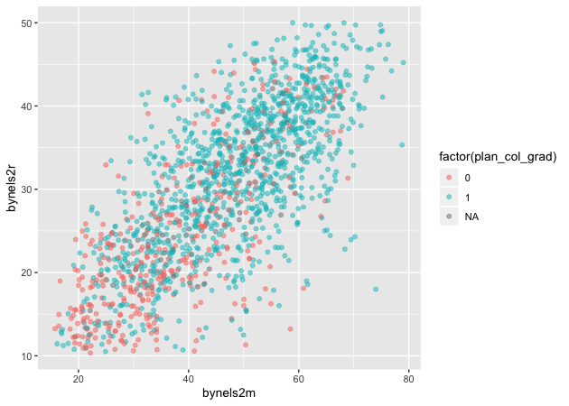

Another key part of exploratory data analysis is making plots that let
you visually inspect the data. This module will focus on graphics.

R has three major graphing systems: the [base
system](https://stat.ethz.ch/R-manual/R-devel/library/graphics/html/00Index.html),
[lattice](http://lattice.r-forge.r-project.org), and
[ggplot2](http://ggplot2.tidyverse.org). Each system has its benefits
and drawbacks and each is also very versatile with many, many options
for creating and adjusting plots.

Unfortunately, there isn’t enough time to go through all three graphing
systems. After describing a few base R graphing functions, this module
will focus on ggplot2 since it allows users to build plots using the
[grammar of graphics](http://vita.had.co.nz/papers/layered-grammar.html)
and integrates well with the tidyverse.

We’ll use the same ELS plans data we’ve been using, again in Stata
format since it has variable and value labels.

``` r
## libraries
library(tidyverse)
library(haven)
library(labelled)
```

``` r
## read in Stata data file
df <- read_dta('../data/els_plans.dta')
```

Plots using base R
==================

Even though users have developed new graphics libraries, the base R
graphics system is still very powerful. It’s also very easy to use in a
pinch. When I want a quick visual of a data distribution that’s just for
me, I generally use base R.

Histogram
---------

For continuous variables, a histogram is a useful plot. Though the
`hist()` function has many options to adjust how it looks, the defaults
work really well.

``` r
## histogram of math scores
hist(df$bynels2m)
```


> #### Quick exercise
>
> Check the distribution of reading scores.

Density
-------

Density plots are also really helpful. R doesn’t have single density
plot function, but you can get a density plot in one of two ways, each
of which will give a slightly different result.

First, you can adjust the `hist()` function to add the `freq = FALSE`
argument. It looks like the first histogram above, but notice that the
y-axis now represents density rather than counts.

``` r
## density plot of math scores with hist() function
hist(df$bynels2m, freq = FALSE)
```


Second, you can `plot()` the `density()` of a continuous variable.
Unlike `hist()`, however, `density()` doesn’t automatically ignore
missing values, so we have to tell it to remove `NA`s.

``` r
## density plot of math scores
plot(density(df$bynels2m, na.rm = TRUE))
```


> #### Quick exercise
>
> Plot the density of reading scores. Next, try to use the `col`
> argument in `plot()` to change the color of the line to `'red'`.

Box plot
--------

Call a box plot using the `boxplot()` function. This one is a little
trickier because it uses the [R
formula](https://www.statmethods.net/graphs/boxplot.html) construction
to set the continuous variable against the group. (We’ll talk more about
formulas in the module on modeling.) The formula uses a tilde, `~`, and
should be constructed like this:

-   `<var> ~ <group var>`

Notice how we can use the `data` argument instead of adding `df$` in
front of the variable names.

``` r
## box plot of math scores against student expectations
boxplot(bynels2m ~ bystexp, data = df)
```


Scatter
-------

Finally, plot continuous variables against one another using the base
`plot()` function. There are two primary ways to make a scatter plot
using `plot()`:

-   `plot(x, y)`
-   `plot(y ~ x)`

With both, `x` is the variable that will go on the x-axis and `y` the
one that will go on the y-axis. It’s really a matter of which makes
sense to you. We’ll use the first.

``` r
## scatter plot of math against reading scores
plot(df$bynels2m, df$bynels2r)
```


> #### Quick exercise
>
> Rerun the above plot, but this time store it in an object. Next, plot
> reading scores against math scores using the second formula method and
> store it in another object. Visually compare the two, but for a more
> formal test, use `identical(plot_1, plot_2)` on the two plot objects
> to prove they are the same.

Plots using ggplot2
===================

The first few times I tried to use ggplot2, I didn’t quite get it. But
once I did (and it doesn’t take too long!), I really started to like it.
It’s now my go-to system for making plots.

The [ggplot2 system](http://ggplot2.tidyverse.org/reference/) is too
involved to cover in all of its details, but that’s kind of the point of
the grammar of graphics: once you see how it’s put together, you can
anticipate the commands you need to build your plot.

We’ll start by covering the same plots as above.

Histogram
---------

[As the main help site says](http://ggplot2.tidyverse.org), all ggplot2
plots need three things:

-   data
-   how variables in the data map onto the plot (*e.g.*, what’s on the
    x-axis? what’s on the y-axis)
-   what kind of figure you want to make (*e.g.*, what do you want to
    **do** with those data and mappings?)

Depending on the plot you want to make, each of these pieces may be
called at different points in the command structure, which is usually
made up of linked functions like other tidyverse libraries. The key
difference between ggplot2 and dplyr, for example, is that while dplyr
uses the pipe (`%>%`) to connect different functions, ggplot2 uses a
plus sign (`+`).

We’ll start by making a histogram again. To help make these pieces
clearer, I’ll use the argument names when possible. The first function,
which initializes the plot is `ggplot()`. Its first argument is the
data.

The aesthetic mappings, that is, which variables go where or how they
function on the plot, go inside the `aes()` function. Since we only have
one variable, `bynels2m`, it is assigned to `x`.

If we stop there and print…

``` r
## init ggplot 
p <- ggplot(data = df, mapping = aes(x = bynels2m))
p
```


…nothing! Well, not nothing, but no histogram. That’s because the plot
object `p` knows the data and the key variable mapping but doesn’t know
what do with them. What do we want?

Since we want a histogram, we add the `geom_histogram()` function to the
existing plot object. Trying again…

``` r
## add histogram instruction
p <- p + geom_histogram()
p
```


Success!

Density
-------

Unlike the base R graphics system, ggplot2 does have a density plotting
command, `geom_density()`. We’ll go ahead and chain it to the first
command and print.

Notice how the function chain is the mostly the same as above, but (1)
written in a single linked chain and (2) using a different `geom_*()`
command at the end to indicate that we want something different.

``` r
## density
p <- ggplot(data = df, mapping = aes(x = bynels2m)) +
    geom_density()
p
```


> #### Quick exercise
>
> Make a density plot of reading scores.

If we want to superimpose the density plot over the histogram, we only
need chain the two commands together with a slight modification in how
the histogram is made. This way, the histogram and the density will be
on the same scale.

The change happens in the `geom_histogram()` function, where we add a
new mapping: `aes(y = ..density..)`. (NOTE: this is similar to what we
did above in base R to make a histogram on a density scale.)

``` r
## histogram with density plot overlapping
p <- ggplot(data = df, mapping = aes(x = bynels2m)) +
    geom_histogram(mapping = aes(y = ..density..)) +
    geom_density()
p
```


It worked, but it’s not the greatest visual since the colors are the
same and the density plot is thin with no fill.

Adding to what came before, the `geom_histogram()` and `geom_density()`
both take on new arguments that change the defaults. Now the resulting
plot should look nicer and be easier to read.

``` r
## histogram with density plot overlapping (add color to see better)
p <- ggplot(data = df, mapping = aes(x = bynels2m)) +
    geom_histogram(mapping = aes(y = ..density..),
                   color = 'black',
                   fill = 'white') +
    geom_density(fill = 'red', alpha = 0.2)
p
```


> #### Quick exercise
>
> Try changing some of the arguments in the last plot. What happens when
> you change `alpha` (keep the value between 0 and 1)? What does the
> `color` argument change? And `fill`? What happens if you switch the
> `geom_*()` functions, call `geom_histogram()` after you call
> `geom_density()`?

Two-way
-------

Plotting the difference in a continuous distribution across groups is a
common task. Let’s see the difference between student math scores
between students with parents who have any postsecondary degree and
those without.

Since we’re using data that was labelled in Stata, we’ll first use
`val_labels()` to check the `bypared` variable.

``` r
## get parental education levels, use `val_labels()` to show them
val_labels(df$bypared)
```

                                   {missing} 
                                          NA 
       {survey component legitimate skip/na} 
                                          NA 
                             {nonrespondent} 
                                          NA 
                  did not finish high school 
                                           1 
           graduated from high school or ged 
                                           2 
           attended 2-year school, no degree 
                                           3 
                graduated from 2-year school 
                                           4 
          attended college, no 4-year degree 
                                           5 
                      graduated from college 
                                           6 
     completed master^s degree or equivalent 
                                           7 
    completed phd, md, other advanced degree 
                                           8 

The way this variable is structured prevents us from using a `>=` test
like we have been. We want to count parents with a two-year degree (`4`)
in addition to those having a Bachelor’s degree or higher (`6`, `7`, and
`8`), but we don’t want to count those who attended, but didn’t earn a
degree (`5`).

To do this, we’ll use the special operator `%in%` which does exactly
what it sounds like. If a value of `bypared` is **in** the set that we
give it, then the new indicator `pared_coll` will be 1; if not, 0.

The `ggplot()` function doesn’t need to use our full data. In fact, our
data needs to be set up a bit differently to make this plot. We’ll make
a new temporary data object that only has the data we need.

``` r
## need to set up data
plot_df <- df %>%
    select(bypared, bynels2m) %>%
    na.omit() %>%                       # can't plot NAs, so drop them
    mutate(pared_coll = ifelse(bypared %in% c(4,6,7,8), 1, 0)) %>%
    select(-bypared) 

## show
head(plot_df)
```

    # A tibble: 6 x 2
      bynels2m pared_coll
         <dbl>      <dbl>
    1     47.8          0
    2     55.3          0
    3     66.2          0
    4     35.3          0
    5     30.0          0
    6     24.3          0

To plot against the two groups we’ve made, we need to add it to the
aesthetic feature, `aes()`. The math score, `bynels2m`, is still mapped
to `x`, but since we want two side-by-side histograms, we set the `fill`
aesthetic to our new indicator variable. So the function knows that it’s
a group, we wrap it in the `factor()` function.

Finally, we add some changes to the `geom_histogram()` function so that
each group is on the same scale.

``` r
## two way histogram
p <- ggplot(data = plot_df,
            aes(x = bynels2m, fill = factor(pared_coll))) +
    geom_histogram(alpha = 0.5, stat = 'density', position = 'identity')
p
```


> #### Quick exercise
>
> Remove some of the new arguments in `geom_histogram()`. How does the
> resulting plot change? Remove the `factor()` function from around
> `pared_coll`: what happens?

Box plot
--------

By this point, you’re hopefully seeing the pattern in how ggplot2
figures are put together. To make a box plot, we need to add a `y`
mapping to the `aes()` in addition to the `x` mapping. We don’t have to,
but we’ve also added the same variable to `fill` as we did to `x`. We do
this so that in addition to having different box and whisker plots along
the x-axis, each plot is given its own color.

``` r
## box plot using both factor() and as_factor()
p <- ggplot(data = df,
            mapping = aes(x = factor(bypared),
                          y = bynels2r,
                          fill = as_factor(bypared))) +
    geom_boxplot()
p
```


> #### Quick exercise
>
> Change the `as_factor()` and `factor()` functions above. How does the
> plot change?

Scatter
=======

To make a scatter plot, make sure that the `aes()` has mappings for the
`x` axis and `y` axis and then use `geom_point()` to plot. To make
things easier to see, we’ll first reduce the data to 10% of the full
sample using `sample_frac()` from dplyr.

``` r
## sample 10% to make figure clearer
df_10 <- df %>% sample_frac(0.1)

## scatter
p <- ggplot(data = df_10, mapping = aes(x = bynels2m, y = bynels2r)) +
    geom_point()
p
```


Now that we have our scatter plot, let’s say that we want to add a third
dimension. Specifically, we want to change the color of each point based
on whether a student plans to earn a Bachelor’s degree or higher. That
means we need a new dummy variable that is 1 for those with BA/BS plans
and 0 for others.

We can look at the student base year expectations with `table()`…

``` r
## see student base year plans
table(df$bystexp)
```


      -1    1    2    3    4    5    6    7 
    1450  128  983  879  561 5416 3153 2666 

…but those numbers don’t tell us much. Since we read in a Stata data
file with labelled values, though, we can use the `val_labels()`
function to see our options.

``` r
## see how the labels map
val_labels(df$bystexp)
```

       {survey component legitimate skip/na} 
                                          NA 
                             {nonrespondent} 
                                          NA 
                                {don^t know} 
                                          NA 
            less than high school graduation 
                                           1 
          high school graduation or ged only 
                                           2 
    attend or complete 2-year college/school 
                                           3 
    attend college, 4-year degree incomplete 
                                           4 
                       graduate from college 
                                           5 
        obtain master^s degree or equivalent 
                                           6 
    obtain phd, md, or other advanced degree 
                                           7 

Now we see that `bystexp >= 5` mean a student plans to earn a Bachelor’s
degree or higher. Let’s create that.

``` r
## create variable for students who plan to graduate from college
df_10 <- df_10 %>%
    mutate(plan_col_grad = ifelse(bystexp >= 5, 1, 0))
```

Now that we have our new variable `plan_col_grad`, we can add it the
`color` aesthetic, `aes()` in `geom_point()`. Don’t forget to use
`factor()` so that ggplot knows to treat it like a group!

``` r
## scatter
p <- ggplot(data = df_10,
            mapping = aes(x = bynels2m, y = bynels2r)) +
    geom_point(mapping = aes(color = factor(plan_col_grad)), alpha = 0.5)
p
```



> #### Quick exercise
>
> Change how you make `plan_col_grad` so that instead of 1 and 0, you
> use ‘yes’ and ‘no’. Make your figure again. What changes?

Fitted lines
------------

It’s often helpful to plot fitted lines against a scatter plot to help
see the underlying trend. There are a number of ways to do this with the
`geom_smooth()` function.

### Linear fit

Setting `method = lm` in `geom_smooth()` will fit a simple straight line
with 95% confidence interval shaded around it.

``` r
## add fitted line with linear fit
p <- ggplot(data = df_10, mapping = aes(x = bynels2m, y = bynels2r)) +
    geom_point(mapping = aes(color = factor(plan_col_grad)), alpha = 0.5) +
    geom_smooth(method = lm)
p
```


### Linear fit with polynomials

In addition to the `method`, we can add a `formula` to allow the fitted
line to take a non-linear shape. Using the `aes()` values of `x` and
`y`, the argument below uses an R formula, `y ~ x`, but with the
addition of the `poly()` function. Setting the second argument in
`poly()` to 2 gives the line an extra quadratic term, which allows it to
take a more curved shape.

``` r
## add fitted line with polynomial linear fit
p <- ggplot(data = df_10, mapping = aes(x = bynels2m, y = bynels2r)) +
    geom_point(mapping = aes(color = factor(plan_col_grad)), alpha = 0.5) +
    geom_smooth(method = lm, formula = y ~ poly(x,2))
p
```


> #### Quick exercise
>
> Change the value in `poly()` to higher numbers. How does the line
> change?

### Loess

Finally, we can skip trying to adjust a linear line and just fit a
[loess](https://en.wikipedia.org/wiki/Local_regression).

``` r
## add fitted line with loess
p <- ggplot(data = df_10, mapping = aes(x = bynels2m, y = bynels2r)) +
    geom_point(mapping = aes(color = factor(plan_col_grad)), alpha = 0.5) +
    geom_smooth(method = loess)
p
```


Plotly
======

As a final example, we’ll turn our last plot into an interactive plotly
figure. [Plotly](https://plot.ly/d3-js-for-r-and-shiny-charts/) works
with a number of languages, but it integrates really well with ggplot.
In fact, once the plot is made, we only have to use the `ggplotly()`
function to make it interactive.

``` r
## load plotly library
library(plotly)
```


    Attaching package: 'plotly'

    The following object is masked from 'package:ggplot2':

        last_plot

    The following object is masked from 'package:stats':

        filter

    The following object is masked from 'package:graphics':

        layout

``` r
## create an interactive plot with the last figure
p <- ggplotly(p)
p
```

<!--html_preserve-->

<script type="application/json" data-for="2f655844df2d">{"x":{"data":[{"x":[53.6399993896484,44.75,23.3899993896484,51.8699989318848,29.7700004577637,28.9099998474121,24.5200004577637,45.2099990844727,50.9500007629395,39.0200004577637,39.189998626709,20.5499992370605,31.5599994659424,39.189998626709,16.4899997711182,45.2000007629395,69.0599975585938,47.3699989318848,21.75,29.6000003814697,19.0100002288818,35.6399993896484,22.4599990844727,17.8899993896484,33.060001373291,34.5,77,32.3699989318848,20.9699993133545,20.4899997711182,43.2400016784668,18.1399993896484,37.6500015258789,30.7600002288818,31.3400001525879,59.9000015258789,31.8299999237061,60.810001373291,47.5699996948242,14.9700002670288,27.2399997711182,59.1699981689453,19.6200008392334,56.4000015258789,38.1599998474121,19.9699993133545,51.310001373291,25.2600002288818,32.2599983215332,36.9099998474121,47.3300018310547,35.939998626709,21.5900001525879,35.189998626709,24.4099998474121,48.5,33.1300010681152,23.1299991607666,32.689998626709,63.9300003051758,23.7999992370605,29.9799995422363,38.5,35.439998626709,34.7299995422363,54.9599990844727,29.9599990844727,40.8600006103516,27.2999992370605,21.5599994659424,49.7000007629395,25.1800003051758,44.4500007629395,59.9099998474121,36.6399993896484,41.7299995422363,36.25,42.8300018310547,21.1700000762939,37.1199989318848,28.6700000762939,27.6800003051758,49.0400009155273,26.5100002288818,56.4599990844727,33.4900016784668,27.2700004577637,42.6199989318848,29.0900001525879,46.1199989318848,24.1900005340576,17.2299995422363,52.0999984741211,62.5499992370605,58.1199989318848,35.4199981689453,22.1000003814697,49.810001373291,29.7900009155273,39.7900009155273,40.1399993896484,53.4599990844727,30.6499996185303,57.6599998474121,52.6100006103516,42.4799995422363,43.1100006103516,55.7799987792969,37.0999984741211,36.3300018310547,28.7700004577637,39.8699989318848,56.060001373291,22.8600006103516,16.8400001525879,33.8699989318848,27.5900001525879,36.1100006103516,50.7599983215332,25.4599990844727,27.6900005340576,28.7700004577637,21.6000003814697,35.3499984741211,25.8500003814697,49.5499992370605,30.0799999237061,24.8700008392334,21.2199993133545,24.8199996948242,42.1699981689453,48.5999984741211,61.7599983215332,43.7799987792969,28.7099990844727,51.1500015258789,71.7200012207031,47.0900001525879,40.9900016784668,50.4099998474121,26.6299991607666,44.560001373291,23.3899993896484,27.7099990844727,34.2299995422363,39.9300003051758,36,27.1800003051758,18.4300003051758,50.3600006103516,24.9699993133545,43.7200012207031,38.8400001525879,66.1100006103516,23.7099990844727,35.4199981689453,55.3300018310547,27.6000003814697,29.1700000762939,41.4300003051758,20.2700004577637,27.1599998474121,37.7200012207031,26.8700008392334,52.2599983215332,37.3699989318848,26.0599994659424,33.7099990844727,20.9799995422363,49.2599983215332,64.2799987792969,34.1300010681152,51.2999992370605,33.060001373291,47.2799987792969,20.4099998474121,29.6499996185303,25.3400001525879,20.7600002288818,29.5100002288818,44.2900009155273,23.2399997711182,39.0900001525879,29.1000003814697,31.9300003051758,42.2400016784668,30.9099998474121,43.2900009155273,34.1300010681152,41.8899993896484,38.5999984741211,37.5,24.1599998474121,66.7099990844727,25.9200000762939,19.4099998474121,41.6500015258789,35.8300018310547,38.6300010681152,37.6199989318848,47.0099983215332,32.9000015258789,24.0200004577637,62.9799995422363,36.810001373291,21.5200004577637,29.4099998474121,39.0800018310547,65.2699966430664,47.6599998474121,18.8700008392334,36.6300010681152,25.4799995422363,66.2399978637695,30.6800003051758,48.2599983215332,44.0800018310547,25.9300003051758,24.2999992370605,24.1499996185303,32.9599990844727,25.8199996948242,48.6599998474121,50.9599990844727,37.2900009155273,37.1599998474121,45.7900009155273,43.689998626709,26.8999996185303,34.2700004577637,20.5499992370605,19.7099990844727,31.1299991607666,16.2299995422363,24.0599994659424,33.4700012207031,22.1200008392334,38.0699996948242,31.8500003814697,33.4599990844727,22.1800003051758,33.8899993896484,46.310001373291,38.8499984741211,53.8199996948242,45.3800010681152,57.1300010681152,56.9000015258789,17.4899997711182,27.3299999237061,32.7099990844727,45.2700004577637,49.2999992370605,46.3899993896484,41.9700012207031,69.4800033569336,48.0099983215332,50.3699989318848,22.9599990844727,22.75,32.9799995422363,34.2099990844727,42.3300018310547,44.5699996948242,31.1299991607666,34.4500007629395,52.9500007629395,33.4500007629395,43.75,44.2000007629395,26.3299999237061,40.2099990844727,50.7200012207031,36.2099990844727,36.1500015258789,46.7700004577637,31.2199993133545,40.439998626709,59.4700012207031,49.5400009155273,46.0400009155273,59.8199996948242,37.6199989318848,52.5,38.7999992370605,18.8400001525879,29.3199996948242,50.2299995422363,41.25,45.7999992370605,15.6499996185303,29.7800006866455,27.1700000762939,29.8799991607666,42.3699989318848,62.7299995422363,36.9500007629395,23.3299999237061,29.2900009155273,44.1500015258789,33.9599990844727,41.3499984741211,15.9200000762939,26.2800006866455,38.8300018310547,33.3699989318848,17.4200000762939,56.0099983215332,34.75,58.5,38.9099998474121,24.9200000762939,21.4099998474121,28.8199996948242,32.7900009155273,21.9099998474121,22.1399993896484,24.7999992370605,24.8899993896484,16.4400005340576,41.1300010681152,67.7099990844727,57.6500015258789,28.8799991607666,27.8899993896484,28.2800006866455,30.4400005340576,41.3300018310547,61.1800003051758,70.9700012207031,22.8700008392334,30.8400001525879,46.9500007629395,29.3500003814697,46.1699981689453,40.5400009155273,41.4799995422363,38.3400001525879,59.2700004577637,54.6399993896484,70.6399993896484,41.1199989318848,22.9400005340576,54.0699996948242,55.7999992370605,56.1500015258789,58.939998626709,37.2700004577637,45.7000007629395,49.75,27.5699996948242,48.689998626709,54.9599990844727,34.0299987792969,30.9699993133545,19.8999996185303,33.3800010681152,38.5499992370605,20.6000003814697,45.7700004577637,51.6100006103516,18.9699993133545,20.3099994659424,54.5499992370605,40.6199989318848,34.5,31.4200000762939,36.75,32.310001373291,45.2799987792969,23.0699996948242,19.3700008392334,35.8600006103516,27.6299991607666,56.2599983215332,45.4500007629395,24.4599990844727,37.9900016784668,30.9599990844727,47.6300010681152,55.939998626709,54.1500015258789,62.4900016784668,30.8899993896484,28.7099990844727,17.9400005340576,44.4099998474121,35.0999984741211,33.2400016784668,23.75,34.4199981689453,43.0200004577637,35.9799995422363,49.7400016784668,44.3800010681152,42.1399993896484],"y":[34.8499984741211,22.5900001525879,12.2799997329712,31.4599990844727,18.2199993133545,17.25,31.6000003814697,38.3600006103516,20.6200008392334,12.5799999237061,21.7700004577637,13.8400001525879,13.9499998092651,17.4799995422363,14.4499998092651,27.7000007629395,34.8699989318848,32.0099983215332,20.6299991607666,21.1299991607666,29.2099990844727,26.6700000762939,18.4300003051758,10.1199998855591,18.7000007629395,26.3099994659424,46.9199981689453,12.1599998474121,13.8299999237061,15.25,35.5200004577637,25.9099998474121,40.8899993896484,30.9200000762939,22.6900005340576,29.3700008392334,20.6599998474121,46.1199989318848,33.3400001525879,14.2700004577637,16.5499992370605,43.0800018310547,14.2399997711182,37.4599990844727,38.1100006103516,17.5200004577637,26.0799999237061,13.5299997329712,17.3799991607666,29.9899997711182,31.7000007629395,23.5,14.6000003814697,27.9799995422363,12.9399995803833,26.7099990844727,29.1499996185303,30.9300003051758,28.0499992370605,46.0400009155273,19.7399997711182,10.6000003814697,29.0599994659424,19.0100002288818,18,16.25,25.3099994659424,24.4699993133545,25.0900001525879,13.1999998092651,23.2700004577637,21.8999996185303,20.8099994659424,27.6900005340576,14.9799995422363,18.2999992370605,19.1499996185303,38.189998626709,21.8899993896484,25.4899997711182,15.8599996566772,21.3799991607666,43.7700004577637,12.7399997711182,39.3699989318848,17.3600006103516,13.9700002670288,19.9099998474121,14.539999961853,29.7199993133545,12.3299999237061,12.1499996185303,34.0299987792969,47.5299987792969,38.7400016784668,26.6000003814697,12.3699998855591,25.0900001525879,14.1599998474121,34.0800018310547,27.3799991607666,30.5699996948242,20.6900005340576,27.0900001525879,39.9199981689453,44.0800018310547,36.3499984741211,30.3299999237061,23.8199996948242,21.8799991607666,20.5499992370605,17.8799991607666,30.1700000762939,30.0900001525879,11.9399995803833,13.25,24.6399993896484,15.1700000762939,36.8600006103516,23.8500003814697,13.2200002670288,17.8700008392334,20.0799999237061,22.4599990844727,28.4099998474121,40.5200004577637,17.6399993896484,13.8599996566772,22.9099998474121,24.4699993133545,28.5599994659424,40.4000015258789,37.939998626709,22.2999992370605,24.9099998474121,30.6800003051758,26.9699993133545,26.0499992370605,22.7800006866455,27.2299995422363,23.3199996948242,28.1800003051758,17.7999992370605,18.75,18.2700004577637,28.4899997711182,27.1800003051758,15.2200002670288,16.2199993133545,34.060001373291,32.9300003051758,21.7800006866455,33.4300003051758,30.4699993133545,35.7799987792969,19.2999992370605,28.3999996185303,15.9499998092651,18.3799991607666,23.3700008392334,13.2799997329712,26.1599998474121,19.7399997711182,19.5100002288818,43.189998626709,15.75,17.8400001525879,22.7700004577637,11.9099998474121,24.8600006103516,38.1100006103516,16.3999996185303,37.4900016784668,28.9500007629395,14.1499996185303,19.2800006866455,15.9700002670288,16.5300006866455,12.2799997329712,17.6399993896484,28.2399997711182,13.0600004196167,24.9799995422363,11.4399995803833,21.9899997711182,37.9900016784668,22.1299991607666,28.8500003814697,11.8999996185303,24.25,25.1499996185303,16.2700004577637,19.6800003051758,35.5499992370605,10.8699998855591,12.2799997329712,26.8700008392334,29.9099998474121,28.0499992370605,18.2600002288818,24.7399997711182,17.1200008392334,20.8099994659424,38.0900001525879,23.7399997711182,14.0299997329712,23.5300006866455,18.4099998474121,32.1599998474121,14.5600004196167,11.3100004196167,28.2399997711182,23.4200000762939,42.6800003051758,15.8999996185303,25.2000007629395,15.3900003433228,17.4699993133545,13.6599998474121,12.8699998855591,15.7399997711182,22.9599990844727,21.4799995422363,40.2200012207031,32.0299987792969,31.7199993133545,28.7800006866455,31.1100006103516,24.0300006866455,16.5900001525879,13.1300001144409,13.9799995422363,17.2399997711182,13.1300001144409,31.9300003051758,16.0300006866455,13.8299999237061,21.75,18.6000003814697,39.6599998474121,18.2099990844727,17.3700008392334,32,13.9099998474121,32.6500015258789,17.75,40.3800010681152,16.9099998474121,17.6200008392334,13.6199998855591,16.7000007629395,26.9799995422363,29.9500007629395,13.1400003433228,21.7700004577637,38.0999984741211,33.3600006103516,30.7800006866455,18.7600002288818,14.7399997711182,31.7900009155273,31.8600006103516,21.2800006866455,20.5599994659424,27.5200004577637,29.0699996948242,29.9500007629395,14.4899997711182,16.3999996185303,12.6499996185303,16.2600002288818,33.7999992370605,33.6100006103516,14.289999961853,13.1700000762939,19.3199996948242,20.2000007629395,24.1200008392334,39.2099990844727,38.2400016784668,28.4400005340576,39.3800010681152,23.3500003814697,31.8600006103516,26.8400001525879,14.0900001525879,23.7999992370605,30.6599998474121,29.0200004577637,38.9000015258789,12.0900001525879,24.2199993133545,12.960000038147,30.3199996948242,28.7299995422363,29.7299995422363,18.4899997711182,11.25,15.0500001907349,23.6599998474121,19.8199996948242,18.5799999237061,16.0900001525879,30.4099998474121,20.9200000762939,13.3800001144409,17.2099990844727,33.8199996948242,16.3899993896484,13.2200002670288,24.3500003814697,24.5699996948242,13.3599996566772,24.5200004577637,24.4699993133545,22.1299991607666,23.3899993896484,20.9099998474121,22.2600002288818,14.9700002670288,24.4200000762939,47.939998626709,39.3899993896484,16.9200000762939,28.6800003051758,21.1499996185303,19.1000003814697,25.8999996185303,38.6699981689453,45.7400016784668,13.4399995803833,23.4400005340576,39.0200004577637,23.4899997711182,24.9799995422363,21.6100006103516,26.0799999237061,25.6599998474121,34.0299987792969,40.2299995422363,45.2799987792969,13.4899997711182,13.4300003051758,26.4400005340576,40.0200004577637,30.4099998474121,17.0900001525879,20.8400001525879,38.0099983215332,11.0600004196167,30.0499992370605,33.9500007629395,16.2999992370605,27.5100002288818,25.5799999237061,37.0099983215332,17.3899993896484,28.5,11.3500003814697,30.6000003814697,29.6499996185303,20.1700000762939,15.960000038147,31.8700008392334,21.1900005340576,21.2800006866455,22.3299999237061,21.1499996185303,10.8900003433228,24.1399993896484,12.5900001525879,18.2700004577637,22.5900001525879,14.5200004577637,22.6200008392334,24.9099998474121,24.3299999237061,17.8500003814697,22.5300006866455,33.310001373291,34.9500007629395,36.189998626709,34.4900016784668,26.8299999237061,21.6499996185303,17.6499996185303,31.7999992370605,15.8900003433228,20.6499996185303,11.1000003814697,18.2000007629395,25.6900005340576,28.6499996185303,33.7200012207031,23.1100006103516,28.1000003814697],"text":["factor(plan_col_grad): 0<br />bynels2m: 53.64<br />bynels2r: 34.85","factor(plan_col_grad): 0<br />bynels2m: 44.75<br />bynels2r: 22.59","factor(plan_col_grad): 0<br />bynels2m: 23.39<br />bynels2r: 12.28","factor(plan_col_grad): 0<br />bynels2m: 51.87<br />bynels2r: 31.46","factor(plan_col_grad): 0<br />bynels2m: 29.77<br />bynels2r: 18.22","factor(plan_col_grad): 0<br />bynels2m: 28.91<br />bynels2r: 17.25","factor(plan_col_grad): 0<br />bynels2m: 24.52<br />bynels2r: 31.60","factor(plan_col_grad): 0<br />bynels2m: 45.21<br />bynels2r: 38.36","factor(plan_col_grad): 0<br />bynels2m: 50.95<br />bynels2r: 20.62","factor(plan_col_grad): 0<br />bynels2m: 39.02<br />bynels2r: 12.58","factor(plan_col_grad): 0<br />bynels2m: 39.19<br />bynels2r: 21.77","factor(plan_col_grad): 0<br />bynels2m: 20.55<br />bynels2r: 13.84","factor(plan_col_grad): 0<br />bynels2m: 31.56<br />bynels2r: 13.95","factor(plan_col_grad): 0<br />bynels2m: 39.19<br />bynels2r: 17.48","factor(plan_col_grad): 0<br />bynels2m: 16.49<br />bynels2r: 14.45","factor(plan_col_grad): 0<br />bynels2m: 45.20<br />bynels2r: 27.70","factor(plan_col_grad): 0<br />bynels2m: 69.06<br />bynels2r: 34.87","factor(plan_col_grad): 0<br />bynels2m: 47.37<br />bynels2r: 32.01","factor(plan_col_grad): 0<br />bynels2m: 21.75<br />bynels2r: 20.63","factor(plan_col_grad): 0<br />bynels2m: 29.60<br />bynels2r: 21.13","factor(plan_col_grad): 0<br />bynels2m: 19.01<br />bynels2r: 29.21","factor(plan_col_grad): 0<br />bynels2m: 35.64<br />bynels2r: 26.67","factor(plan_col_grad): 0<br />bynels2m: 22.46<br />bynels2r: 18.43","factor(plan_col_grad): 0<br />bynels2m: 17.89<br />bynels2r: 10.12","factor(plan_col_grad): 0<br />bynels2m: 33.06<br />bynels2r: 18.70","factor(plan_col_grad): 0<br />bynels2m: 34.50<br />bynels2r: 26.31","factor(plan_col_grad): 0<br />bynels2m: 77.00<br />bynels2r: 46.92","factor(plan_col_grad): 0<br />bynels2m: 32.37<br />bynels2r: 12.16","factor(plan_col_grad): 0<br />bynels2m: 20.97<br />bynels2r: 13.83","factor(plan_col_grad): 0<br />bynels2m: 20.49<br />bynels2r: 15.25","factor(plan_col_grad): 0<br />bynels2m: 43.24<br />bynels2r: 35.52","factor(plan_col_grad): 0<br />bynels2m: 18.14<br />bynels2r: 25.91","factor(plan_col_grad): 0<br />bynels2m: 37.65<br />bynels2r: 40.89","factor(plan_col_grad): 0<br />bynels2m: 30.76<br />bynels2r: 30.92","factor(plan_col_grad): 0<br />bynels2m: 31.34<br />bynels2r: 22.69","factor(plan_col_grad): 0<br />bynels2m: 59.90<br />bynels2r: 29.37","factor(plan_col_grad): 0<br />bynels2m: 31.83<br />bynels2r: 20.66","factor(plan_col_grad): 0<br />bynels2m: 60.81<br />bynels2r: 46.12","factor(plan_col_grad): 0<br />bynels2m: 47.57<br />bynels2r: 33.34","factor(plan_col_grad): 0<br />bynels2m: 14.97<br />bynels2r: 14.27","factor(plan_col_grad): 0<br />bynels2m: 27.24<br />bynels2r: 16.55","factor(plan_col_grad): 0<br />bynels2m: 59.17<br />bynels2r: 43.08","factor(plan_col_grad): 0<br />bynels2m: 19.62<br />bynels2r: 14.24","factor(plan_col_grad): 0<br />bynels2m: 56.40<br />bynels2r: 37.46","factor(plan_col_grad): 0<br />bynels2m: 38.16<br />bynels2r: 38.11","factor(plan_col_grad): 0<br />bynels2m: 19.97<br />bynels2r: 17.52","factor(plan_col_grad): 0<br />bynels2m: 51.31<br />bynels2r: 26.08","factor(plan_col_grad): 0<br />bynels2m: 25.26<br />bynels2r: 13.53","factor(plan_col_grad): 0<br />bynels2m: 32.26<br />bynels2r: 17.38","factor(plan_col_grad): 0<br />bynels2m: 36.91<br />bynels2r: 29.99","factor(plan_col_grad): 0<br />bynels2m: 47.33<br />bynels2r: 31.70","factor(plan_col_grad): 0<br />bynels2m: 35.94<br />bynels2r: 23.50","factor(plan_col_grad): 0<br />bynels2m: 21.59<br />bynels2r: 14.60","factor(plan_col_grad): 0<br />bynels2m: 35.19<br />bynels2r: 27.98","factor(plan_col_grad): 0<br />bynels2m: 24.41<br />bynels2r: 12.94","factor(plan_col_grad): 0<br />bynels2m: 48.50<br />bynels2r: 26.71","factor(plan_col_grad): 0<br />bynels2m: 33.13<br />bynels2r: 29.15","factor(plan_col_grad): 0<br />bynels2m: 23.13<br />bynels2r: 30.93","factor(plan_col_grad): 0<br />bynels2m: 32.69<br />bynels2r: 28.05","factor(plan_col_grad): 0<br />bynels2m: 63.93<br />bynels2r: 46.04","factor(plan_col_grad): 0<br />bynels2m: 23.80<br />bynels2r: 19.74","factor(plan_col_grad): 0<br />bynels2m: 29.98<br />bynels2r: 10.60","factor(plan_col_grad): 0<br />bynels2m: 38.50<br />bynels2r: 29.06","factor(plan_col_grad): 0<br />bynels2m: 35.44<br />bynels2r: 19.01","factor(plan_col_grad): 0<br />bynels2m: 34.73<br />bynels2r: 18.00","factor(plan_col_grad): 0<br />bynels2m: 54.96<br />bynels2r: 16.25","factor(plan_col_grad): 0<br />bynels2m: 29.96<br />bynels2r: 25.31","factor(plan_col_grad): 0<br />bynels2m: 40.86<br />bynels2r: 24.47","factor(plan_col_grad): 0<br />bynels2m: 27.30<br />bynels2r: 25.09","factor(plan_col_grad): 0<br />bynels2m: 21.56<br />bynels2r: 13.20","factor(plan_col_grad): 0<br />bynels2m: 49.70<br />bynels2r: 23.27","factor(plan_col_grad): 0<br />bynels2m: 25.18<br />bynels2r: 21.90","factor(plan_col_grad): 0<br />bynels2m: 44.45<br />bynels2r: 20.81","factor(plan_col_grad): 0<br />bynels2m: 59.91<br />bynels2r: 27.69","factor(plan_col_grad): 0<br />bynels2m: 36.64<br />bynels2r: 14.98","factor(plan_col_grad): 0<br />bynels2m: 41.73<br />bynels2r: 18.30","factor(plan_col_grad): 0<br />bynels2m: 36.25<br />bynels2r: 19.15","factor(plan_col_grad): 0<br />bynels2m: 42.83<br />bynels2r: 38.19","factor(plan_col_grad): 0<br />bynels2m: 21.17<br />bynels2r: 21.89","factor(plan_col_grad): 0<br />bynels2m: 37.12<br />bynels2r: 25.49","factor(plan_col_grad): 0<br />bynels2m: 28.67<br />bynels2r: 15.86","factor(plan_col_grad): 0<br />bynels2m: 27.68<br />bynels2r: 21.38","factor(plan_col_grad): 0<br />bynels2m: 49.04<br />bynels2r: 43.77","factor(plan_col_grad): 0<br />bynels2m: 26.51<br />bynels2r: 12.74","factor(plan_col_grad): 0<br />bynels2m: 56.46<br />bynels2r: 39.37","factor(plan_col_grad): 0<br />bynels2m: 33.49<br />bynels2r: 17.36","factor(plan_col_grad): 0<br />bynels2m: 27.27<br />bynels2r: 13.97","factor(plan_col_grad): 0<br />bynels2m: 42.62<br />bynels2r: 19.91","factor(plan_col_grad): 0<br />bynels2m: 29.09<br />bynels2r: 14.54","factor(plan_col_grad): 0<br />bynels2m: 46.12<br />bynels2r: 29.72","factor(plan_col_grad): 0<br />bynels2m: 24.19<br />bynels2r: 12.33","factor(plan_col_grad): 0<br />bynels2m: 17.23<br />bynels2r: 12.15","factor(plan_col_grad): 0<br />bynels2m: 52.10<br />bynels2r: 34.03","factor(plan_col_grad): 0<br />bynels2m: 62.55<br />bynels2r: 47.53","factor(plan_col_grad): 0<br />bynels2m: 58.12<br />bynels2r: 38.74","factor(plan_col_grad): 0<br />bynels2m: 35.42<br />bynels2r: 26.60","factor(plan_col_grad): 0<br />bynels2m: 22.10<br />bynels2r: 12.37","factor(plan_col_grad): 0<br />bynels2m: 49.81<br />bynels2r: 25.09","factor(plan_col_grad): 0<br />bynels2m: 29.79<br />bynels2r: 14.16","factor(plan_col_grad): 0<br />bynels2m: 39.79<br />bynels2r: 34.08","factor(plan_col_grad): 0<br />bynels2m: 40.14<br />bynels2r: 27.38","factor(plan_col_grad): 0<br />bynels2m: 53.46<br />bynels2r: 30.57","factor(plan_col_grad): 0<br />bynels2m: 30.65<br />bynels2r: 20.69","factor(plan_col_grad): 0<br />bynels2m: 57.66<br />bynels2r: 27.09","factor(plan_col_grad): 0<br />bynels2m: 52.61<br />bynels2r: 39.92","factor(plan_col_grad): 0<br />bynels2m: 42.48<br />bynels2r: 44.08","factor(plan_col_grad): 0<br />bynels2m: 43.11<br />bynels2r: 36.35","factor(plan_col_grad): 0<br />bynels2m: 55.78<br />bynels2r: 30.33","factor(plan_col_grad): 0<br />bynels2m: 37.10<br />bynels2r: 23.82","factor(plan_col_grad): 0<br />bynels2m: 36.33<br />bynels2r: 21.88","factor(plan_col_grad): 0<br />bynels2m: 28.77<br />bynels2r: 20.55","factor(plan_col_grad): 0<br />bynels2m: 39.87<br />bynels2r: 17.88","factor(plan_col_grad): 0<br />bynels2m: 56.06<br />bynels2r: 30.17","factor(plan_col_grad): 0<br />bynels2m: 22.86<br />bynels2r: 30.09","factor(plan_col_grad): 0<br />bynels2m: 16.84<br />bynels2r: 11.94","factor(plan_col_grad): 0<br />bynels2m: 33.87<br />bynels2r: 13.25","factor(plan_col_grad): 0<br />bynels2m: 27.59<br />bynels2r: 24.64","factor(plan_col_grad): 0<br />bynels2m: 36.11<br />bynels2r: 15.17","factor(plan_col_grad): 0<br />bynels2m: 50.76<br />bynels2r: 36.86","factor(plan_col_grad): 0<br />bynels2m: 25.46<br />bynels2r: 23.85","factor(plan_col_grad): 0<br />bynels2m: 27.69<br />bynels2r: 13.22","factor(plan_col_grad): 0<br />bynels2m: 28.77<br />bynels2r: 17.87","factor(plan_col_grad): 0<br />bynels2m: 21.60<br />bynels2r: 20.08","factor(plan_col_grad): 0<br />bynels2m: 35.35<br />bynels2r: 22.46","factor(plan_col_grad): 0<br />bynels2m: 25.85<br />bynels2r: 28.41","factor(plan_col_grad): 0<br />bynels2m: 49.55<br />bynels2r: 40.52","factor(plan_col_grad): 0<br />bynels2m: 30.08<br />bynels2r: 17.64","factor(plan_col_grad): 0<br />bynels2m: 24.87<br />bynels2r: 13.86","factor(plan_col_grad): 0<br />bynels2m: 21.22<br />bynels2r: 22.91","factor(plan_col_grad): 0<br />bynels2m: 24.82<br />bynels2r: 24.47","factor(plan_col_grad): 0<br />bynels2m: 42.17<br />bynels2r: 28.56","factor(plan_col_grad): 0<br />bynels2m: 48.60<br />bynels2r: 40.40","factor(plan_col_grad): 0<br />bynels2m: 61.76<br />bynels2r: 37.94","factor(plan_col_grad): 0<br />bynels2m: 43.78<br />bynels2r: 22.30","factor(plan_col_grad): 0<br />bynels2m: 28.71<br />bynels2r: 24.91","factor(plan_col_grad): 0<br />bynels2m: 51.15<br />bynels2r: 30.68","factor(plan_col_grad): 0<br />bynels2m: 71.72<br />bynels2r: 26.97","factor(plan_col_grad): 0<br />bynels2m: 47.09<br />bynels2r: 26.05","factor(plan_col_grad): 0<br />bynels2m: 40.99<br />bynels2r: 22.78","factor(plan_col_grad): 0<br />bynels2m: 50.41<br />bynels2r: 27.23","factor(plan_col_grad): 0<br />bynels2m: 26.63<br />bynels2r: 23.32","factor(plan_col_grad): 0<br />bynels2m: 44.56<br />bynels2r: 28.18","factor(plan_col_grad): 0<br />bynels2m: 23.39<br />bynels2r: 17.80","factor(plan_col_grad): 0<br />bynels2m: 27.71<br />bynels2r: 18.75","factor(plan_col_grad): 0<br />bynels2m: 34.23<br />bynels2r: 18.27","factor(plan_col_grad): 0<br />bynels2m: 39.93<br />bynels2r: 28.49","factor(plan_col_grad): 0<br />bynels2m: 36.00<br />bynels2r: 27.18","factor(plan_col_grad): 0<br />bynels2m: 27.18<br />bynels2r: 15.22","factor(plan_col_grad): 0<br />bynels2m: 18.43<br />bynels2r: 16.22","factor(plan_col_grad): 0<br />bynels2m: 50.36<br />bynels2r: 34.06","factor(plan_col_grad): 0<br />bynels2m: 24.97<br />bynels2r: 32.93","factor(plan_col_grad): 0<br />bynels2m: 43.72<br />bynels2r: 21.78","factor(plan_col_grad): 0<br />bynels2m: 38.84<br />bynels2r: 33.43","factor(plan_col_grad): 0<br />bynels2m: 66.11<br />bynels2r: 30.47","factor(plan_col_grad): 0<br />bynels2m: 23.71<br />bynels2r: 35.78","factor(plan_col_grad): 0<br />bynels2m: 35.42<br />bynels2r: 19.30","factor(plan_col_grad): 0<br />bynels2m: 55.33<br />bynels2r: 28.40","factor(plan_col_grad): 0<br />bynels2m: 27.60<br />bynels2r: 15.95","factor(plan_col_grad): 0<br />bynels2m: 29.17<br />bynels2r: 18.38","factor(plan_col_grad): 0<br />bynels2m: 41.43<br />bynels2r: 23.37","factor(plan_col_grad): 0<br />bynels2m: 20.27<br />bynels2r: 13.28","factor(plan_col_grad): 0<br />bynels2m: 27.16<br />bynels2r: 26.16","factor(plan_col_grad): 0<br />bynels2m: 37.72<br />bynels2r: 19.74","factor(plan_col_grad): 0<br />bynels2m: 26.87<br />bynels2r: 19.51","factor(plan_col_grad): 0<br />bynels2m: 52.26<br />bynels2r: 43.19","factor(plan_col_grad): 0<br />bynels2m: 37.37<br />bynels2r: 15.75","factor(plan_col_grad): 0<br />bynels2m: 26.06<br />bynels2r: 17.84","factor(plan_col_grad): 0<br />bynels2m: 33.71<br />bynels2r: 22.77","factor(plan_col_grad): 0<br />bynels2m: 20.98<br />bynels2r: 11.91","factor(plan_col_grad): 0<br />bynels2m: 49.26<br />bynels2r: 24.86","factor(plan_col_grad): 0<br />bynels2m: 64.28<br />bynels2r: 38.11","factor(plan_col_grad): 0<br />bynels2m: 34.13<br />bynels2r: 16.40","factor(plan_col_grad): 0<br />bynels2m: 51.30<br />bynels2r: 37.49","factor(plan_col_grad): 0<br />bynels2m: 33.06<br />bynels2r: 28.95","factor(plan_col_grad): 0<br />bynels2m: 47.28<br />bynels2r: 14.15","factor(plan_col_grad): 0<br />bynels2m: 20.41<br />bynels2r: 19.28","factor(plan_col_grad): 0<br />bynels2m: 29.65<br />bynels2r: 15.97","factor(plan_col_grad): 0<br />bynels2m: 25.34<br />bynels2r: 16.53","factor(plan_col_grad): 0<br />bynels2m: 20.76<br />bynels2r: 12.28","factor(plan_col_grad): 0<br />bynels2m: 29.51<br />bynels2r: 17.64","factor(plan_col_grad): 0<br />bynels2m: 44.29<br />bynels2r: 28.24","factor(plan_col_grad): 0<br />bynels2m: 23.24<br />bynels2r: 13.06","factor(plan_col_grad): 0<br />bynels2m: 39.09<br />bynels2r: 24.98","factor(plan_col_grad): 0<br />bynels2m: 29.10<br />bynels2r: 11.44","factor(plan_col_grad): 0<br />bynels2m: 31.93<br />bynels2r: 21.99","factor(plan_col_grad): 0<br />bynels2m: 42.24<br />bynels2r: 37.99","factor(plan_col_grad): 0<br />bynels2m: 30.91<br />bynels2r: 22.13","factor(plan_col_grad): 0<br />bynels2m: 43.29<br />bynels2r: 28.85","factor(plan_col_grad): 0<br />bynels2m: 34.13<br />bynels2r: 11.90","factor(plan_col_grad): 0<br />bynels2m: 41.89<br />bynels2r: 24.25","factor(plan_col_grad): 0<br />bynels2m: 38.60<br />bynels2r: 25.15","factor(plan_col_grad): 0<br />bynels2m: 37.50<br />bynels2r: 16.27","factor(plan_col_grad): 0<br />bynels2m: 24.16<br />bynels2r: 19.68","factor(plan_col_grad): 0<br />bynels2m: 66.71<br />bynels2r: 35.55","factor(plan_col_grad): 0<br />bynels2m: 25.92<br />bynels2r: 10.87","factor(plan_col_grad): 0<br />bynels2m: 19.41<br />bynels2r: 12.28","factor(plan_col_grad): 0<br />bynels2m: 41.65<br />bynels2r: 26.87","factor(plan_col_grad): 0<br />bynels2m: 35.83<br />bynels2r: 29.91","factor(plan_col_grad): 0<br />bynels2m: 38.63<br />bynels2r: 28.05","factor(plan_col_grad): 0<br />bynels2m: 37.62<br />bynels2r: 18.26","factor(plan_col_grad): 0<br />bynels2m: 47.01<br />bynels2r: 24.74","factor(plan_col_grad): 0<br />bynels2m: 32.90<br />bynels2r: 17.12","factor(plan_col_grad): 0<br />bynels2m: 24.02<br />bynels2r: 20.81","factor(plan_col_grad): 0<br />bynels2m: 62.98<br />bynels2r: 38.09","factor(plan_col_grad): 0<br />bynels2m: 36.81<br />bynels2r: 23.74","factor(plan_col_grad): 0<br />bynels2m: 21.52<br />bynels2r: 14.03","factor(plan_col_grad): 0<br />bynels2m: 29.41<br />bynels2r: 23.53","factor(plan_col_grad): 0<br />bynels2m: 39.08<br />bynels2r: 18.41","factor(plan_col_grad): 0<br />bynels2m: 65.27<br />bynels2r: 32.16","factor(plan_col_grad): 0<br />bynels2m: 47.66<br />bynels2r: 14.56","factor(plan_col_grad): 0<br />bynels2m: 18.87<br />bynels2r: 11.31","factor(plan_col_grad): 0<br />bynels2m: 36.63<br />bynels2r: 28.24","factor(plan_col_grad): 0<br />bynels2m: 25.48<br />bynels2r: 23.42","factor(plan_col_grad): 0<br />bynels2m: 66.24<br />bynels2r: 42.68","factor(plan_col_grad): 0<br />bynels2m: 30.68<br />bynels2r: 15.90","factor(plan_col_grad): 0<br />bynels2m: 48.26<br />bynels2r: 25.20","factor(plan_col_grad): 0<br />bynels2m: 44.08<br />bynels2r: 15.39","factor(plan_col_grad): 0<br />bynels2m: 25.93<br />bynels2r: 17.47","factor(plan_col_grad): 0<br />bynels2m: 24.30<br />bynels2r: 13.66","factor(plan_col_grad): 0<br />bynels2m: 24.15<br />bynels2r: 12.87","factor(plan_col_grad): 0<br />bynels2m: 32.96<br />bynels2r: 15.74","factor(plan_col_grad): 0<br />bynels2m: 25.82<br />bynels2r: 22.96","factor(plan_col_grad): 0<br />bynels2m: 48.66<br />bynels2r: 21.48","factor(plan_col_grad): 0<br />bynels2m: 50.96<br />bynels2r: 40.22","factor(plan_col_grad): 0<br />bynels2m: 37.29<br />bynels2r: 32.03","factor(plan_col_grad): 0<br />bynels2m: 37.16<br />bynels2r: 31.72","factor(plan_col_grad): 0<br />bynels2m: 45.79<br />bynels2r: 28.78","factor(plan_col_grad): 0<br />bynels2m: 43.69<br />bynels2r: 31.11","factor(plan_col_grad): 0<br />bynels2m: 26.90<br />bynels2r: 24.03","factor(plan_col_grad): 0<br />bynels2m: 34.27<br />bynels2r: 16.59","factor(plan_col_grad): 0<br />bynels2m: 20.55<br />bynels2r: 13.13","factor(plan_col_grad): 0<br />bynels2m: 19.71<br />bynels2r: 13.98","factor(plan_col_grad): 0<br />bynels2m: 31.13<br />bynels2r: 17.24","factor(plan_col_grad): 0<br />bynels2m: 16.23<br />bynels2r: 13.13","factor(plan_col_grad): 0<br />bynels2m: 24.06<br />bynels2r: 31.93","factor(plan_col_grad): 0<br />bynels2m: 33.47<br />bynels2r: 16.03","factor(plan_col_grad): 0<br />bynels2m: 22.12<br />bynels2r: 13.83","factor(plan_col_grad): 0<br />bynels2m: 38.07<br />bynels2r: 21.75","factor(plan_col_grad): 0<br />bynels2m: 31.85<br />bynels2r: 18.60","factor(plan_col_grad): 0<br />bynels2m: 33.46<br />bynels2r: 39.66","factor(plan_col_grad): 0<br />bynels2m: 22.18<br />bynels2r: 18.21","factor(plan_col_grad): 0<br />bynels2m: 33.89<br />bynels2r: 17.37","factor(plan_col_grad): 0<br />bynels2m: 46.31<br />bynels2r: 32.00","factor(plan_col_grad): 0<br />bynels2m: 38.85<br />bynels2r: 13.91","factor(plan_col_grad): 0<br />bynels2m: 53.82<br />bynels2r: 32.65","factor(plan_col_grad): 0<br />bynels2m: 45.38<br />bynels2r: 17.75","factor(plan_col_grad): 0<br />bynels2m: 57.13<br />bynels2r: 40.38","factor(plan_col_grad): 0<br />bynels2m: 56.90<br />bynels2r: 16.91","factor(plan_col_grad): 0<br />bynels2m: 17.49<br />bynels2r: 17.62","factor(plan_col_grad): 0<br />bynels2m: 27.33<br />bynels2r: 13.62","factor(plan_col_grad): 0<br />bynels2m: 32.71<br />bynels2r: 16.70","factor(plan_col_grad): 0<br />bynels2m: 45.27<br />bynels2r: 26.98","factor(plan_col_grad): 0<br />bynels2m: 49.30<br />bynels2r: 29.95","factor(plan_col_grad): 0<br />bynels2m: 46.39<br />bynels2r: 13.14","factor(plan_col_grad): 0<br />bynels2m: 41.97<br />bynels2r: 21.77","factor(plan_col_grad): 0<br />bynels2m: 69.48<br />bynels2r: 38.10","factor(plan_col_grad): 0<br />bynels2m: 48.01<br />bynels2r: 33.36","factor(plan_col_grad): 0<br />bynels2m: 50.37<br />bynels2r: 30.78","factor(plan_col_grad): 0<br />bynels2m: 22.96<br />bynels2r: 18.76","factor(plan_col_grad): 0<br />bynels2m: 22.75<br />bynels2r: 14.74","factor(plan_col_grad): 0<br />bynels2m: 32.98<br />bynels2r: 31.79","factor(plan_col_grad): 0<br />bynels2m: 34.21<br />bynels2r: 31.86","factor(plan_col_grad): 0<br />bynels2m: 42.33<br />bynels2r: 21.28","factor(plan_col_grad): 0<br />bynels2m: 44.57<br />bynels2r: 20.56","factor(plan_col_grad): 0<br />bynels2m: 31.13<br />bynels2r: 27.52","factor(plan_col_grad): 0<br />bynels2m: 34.45<br />bynels2r: 29.07","factor(plan_col_grad): 0<br />bynels2m: 52.95<br />bynels2r: 29.95","factor(plan_col_grad): 0<br />bynels2m: 33.45<br />bynels2r: 14.49","factor(plan_col_grad): 0<br />bynels2m: 43.75<br />bynels2r: 16.40","factor(plan_col_grad): 0<br />bynels2m: 44.20<br />bynels2r: 12.65","factor(plan_col_grad): 0<br />bynels2m: 26.33<br />bynels2r: 16.26","factor(plan_col_grad): 0<br />bynels2m: 40.21<br />bynels2r: 33.80","factor(plan_col_grad): 0<br />bynels2m: 50.72<br />bynels2r: 33.61","factor(plan_col_grad): 0<br />bynels2m: 36.21<br />bynels2r: 14.29","factor(plan_col_grad): 0<br />bynels2m: 36.15<br />bynels2r: 13.17","factor(plan_col_grad): 0<br />bynels2m: 46.77<br />bynels2r: 19.32","factor(plan_col_grad): 0<br />bynels2m: 31.22<br />bynels2r: 20.20","factor(plan_col_grad): 0<br />bynels2m: 40.44<br />bynels2r: 24.12","factor(plan_col_grad): 0<br />bynels2m: 59.47<br />bynels2r: 39.21","factor(plan_col_grad): 0<br />bynels2m: 49.54<br />bynels2r: 38.24","factor(plan_col_grad): 0<br />bynels2m: 46.04<br />bynels2r: 28.44","factor(plan_col_grad): 0<br />bynels2m: 59.82<br />bynels2r: 39.38","factor(plan_col_grad): 0<br />bynels2m: 37.62<br />bynels2r: 23.35","factor(plan_col_grad): 0<br />bynels2m: 52.50<br />bynels2r: 31.86","factor(plan_col_grad): 0<br />bynels2m: 38.80<br />bynels2r: 26.84","factor(plan_col_grad): 0<br />bynels2m: 18.84<br />bynels2r: 14.09","factor(plan_col_grad): 0<br />bynels2m: 29.32<br />bynels2r: 23.80","factor(plan_col_grad): 0<br />bynels2m: 50.23<br />bynels2r: 30.66","factor(plan_col_grad): 0<br />bynels2m: 41.25<br />bynels2r: 29.02","factor(plan_col_grad): 0<br />bynels2m: 45.80<br />bynels2r: 38.90","factor(plan_col_grad): 0<br />bynels2m: 15.65<br />bynels2r: 12.09","factor(plan_col_grad): 0<br />bynels2m: 29.78<br />bynels2r: 24.22","factor(plan_col_grad): 0<br />bynels2m: 27.17<br />bynels2r: 12.96","factor(plan_col_grad): 0<br />bynels2m: 29.88<br />bynels2r: 30.32","factor(plan_col_grad): 0<br />bynels2m: 42.37<br />bynels2r: 28.73","factor(plan_col_grad): 0<br />bynels2m: 62.73<br />bynels2r: 29.73","factor(plan_col_grad): 0<br />bynels2m: 36.95<br />bynels2r: 18.49","factor(plan_col_grad): 0<br />bynels2m: 23.33<br />bynels2r: 11.25","factor(plan_col_grad): 0<br />bynels2m: 29.29<br />bynels2r: 15.05","factor(plan_col_grad): 0<br />bynels2m: 44.15<br />bynels2r: 23.66","factor(plan_col_grad): 0<br />bynels2m: 33.96<br />bynels2r: 19.82","factor(plan_col_grad): 0<br />bynels2m: 41.35<br />bynels2r: 18.58","factor(plan_col_grad): 0<br />bynels2m: 15.92<br />bynels2r: 16.09","factor(plan_col_grad): 0<br />bynels2m: 26.28<br />bynels2r: 30.41","factor(plan_col_grad): 0<br />bynels2m: 38.83<br />bynels2r: 20.92","factor(plan_col_grad): 0<br />bynels2m: 33.37<br />bynels2r: 13.38","factor(plan_col_grad): 0<br />bynels2m: 17.42<br />bynels2r: 17.21","factor(plan_col_grad): 0<br />bynels2m: 56.01<br />bynels2r: 33.82","factor(plan_col_grad): 0<br />bynels2m: 34.75<br />bynels2r: 16.39","factor(plan_col_grad): 0<br />bynels2m: 58.50<br />bynels2r: 13.22","factor(plan_col_grad): 0<br />bynels2m: 38.91<br />bynels2r: 24.35","factor(plan_col_grad): 0<br />bynels2m: 24.92<br />bynels2r: 24.57","factor(plan_col_grad): 0<br />bynels2m: 21.41<br />bynels2r: 13.36","factor(plan_col_grad): 0<br />bynels2m: 28.82<br />bynels2r: 24.52","factor(plan_col_grad): 0<br />bynels2m: 32.79<br />bynels2r: 24.47","factor(plan_col_grad): 0<br />bynels2m: 21.91<br />bynels2r: 22.13","factor(plan_col_grad): 0<br />bynels2m: 22.14<br />bynels2r: 23.39","factor(plan_col_grad): 0<br />bynels2m: 24.80<br />bynels2r: 20.91","factor(plan_col_grad): 0<br />bynels2m: 24.89<br />bynels2r: 22.26","factor(plan_col_grad): 0<br />bynels2m: 16.44<br />bynels2r: 14.97","factor(plan_col_grad): 0<br />bynels2m: 41.13<br />bynels2r: 24.42","factor(plan_col_grad): 0<br />bynels2m: 67.71<br />bynels2r: 47.94","factor(plan_col_grad): 0<br />bynels2m: 57.65<br />bynels2r: 39.39","factor(plan_col_grad): 0<br />bynels2m: 28.88<br />bynels2r: 16.92","factor(plan_col_grad): 0<br />bynels2m: 27.89<br />bynels2r: 28.68","factor(plan_col_grad): 0<br />bynels2m: 28.28<br />bynels2r: 21.15","factor(plan_col_grad): 0<br />bynels2m: 30.44<br />bynels2r: 19.10","factor(plan_col_grad): 0<br />bynels2m: 41.33<br />bynels2r: 25.90","factor(plan_col_grad): 0<br />bynels2m: 61.18<br />bynels2r: 38.67","factor(plan_col_grad): 0<br />bynels2m: 70.97<br />bynels2r: 45.74","factor(plan_col_grad): 0<br />bynels2m: 22.87<br />bynels2r: 13.44","factor(plan_col_grad): 0<br />bynels2m: 30.84<br />bynels2r: 23.44","factor(plan_col_grad): 0<br />bynels2m: 46.95<br />bynels2r: 39.02","factor(plan_col_grad): 0<br />bynels2m: 29.35<br />bynels2r: 23.49","factor(plan_col_grad): 0<br />bynels2m: 46.17<br />bynels2r: 24.98","factor(plan_col_grad): 0<br />bynels2m: 40.54<br />bynels2r: 21.61","factor(plan_col_grad): 0<br />bynels2m: 41.48<br />bynels2r: 26.08","factor(plan_col_grad): 0<br />bynels2m: 38.34<br />bynels2r: 25.66","factor(plan_col_grad): 0<br />bynels2m: 59.27<br />bynels2r: 34.03","factor(plan_col_grad): 0<br />bynels2m: 54.64<br />bynels2r: 40.23","factor(plan_col_grad): 0<br />bynels2m: 70.64<br />bynels2r: 45.28","factor(plan_col_grad): 0<br />bynels2m: 41.12<br />bynels2r: 13.49","factor(plan_col_grad): 0<br />bynels2m: 22.94<br />bynels2r: 13.43","factor(plan_col_grad): 0<br />bynels2m: 54.07<br />bynels2r: 26.44","factor(plan_col_grad): 0<br />bynels2m: 55.80<br />bynels2r: 40.02","factor(plan_col_grad): 0<br />bynels2m: 56.15<br />bynels2r: 30.41","factor(plan_col_grad): 0<br />bynels2m: 58.94<br />bynels2r: 17.09","factor(plan_col_grad): 0<br />bynels2m: 37.27<br />bynels2r: 20.84","factor(plan_col_grad): 0<br />bynels2m: 45.70<br />bynels2r: 38.01","factor(plan_col_grad): 0<br />bynels2m: 49.75<br />bynels2r: 11.06","factor(plan_col_grad): 0<br />bynels2m: 27.57<br />bynels2r: 30.05","factor(plan_col_grad): 0<br />bynels2m: 48.69<br />bynels2r: 33.95","factor(plan_col_grad): 0<br />bynels2m: 54.96<br />bynels2r: 16.30","factor(plan_col_grad): 0<br />bynels2m: 34.03<br />bynels2r: 27.51","factor(plan_col_grad): 0<br />bynels2m: 30.97<br />bynels2r: 25.58","factor(plan_col_grad): 0<br />bynels2m: 19.90<br />bynels2r: 37.01","factor(plan_col_grad): 0<br />bynels2m: 33.38<br />bynels2r: 17.39","factor(plan_col_grad): 0<br />bynels2m: 38.55<br />bynels2r: 28.50","factor(plan_col_grad): 0<br />bynels2m: 20.60<br />bynels2r: 11.35","factor(plan_col_grad): 0<br />bynels2m: 45.77<br />bynels2r: 30.60","factor(plan_col_grad): 0<br />bynels2m: 51.61<br />bynels2r: 29.65","factor(plan_col_grad): 0<br />bynels2m: 18.97<br />bynels2r: 20.17","factor(plan_col_grad): 0<br />bynels2m: 20.31<br />bynels2r: 15.96","factor(plan_col_grad): 0<br />bynels2m: 54.55<br />bynels2r: 31.87","factor(plan_col_grad): 0<br />bynels2m: 40.62<br />bynels2r: 21.19","factor(plan_col_grad): 0<br />bynels2m: 34.50<br />bynels2r: 21.28","factor(plan_col_grad): 0<br />bynels2m: 31.42<br />bynels2r: 22.33","factor(plan_col_grad): 0<br />bynels2m: 36.75<br />bynels2r: 21.15","factor(plan_col_grad): 0<br />bynels2m: 32.31<br />bynels2r: 10.89","factor(plan_col_grad): 0<br />bynels2m: 45.28<br />bynels2r: 24.14","factor(plan_col_grad): 0<br />bynels2m: 23.07<br />bynels2r: 12.59","factor(plan_col_grad): 0<br />bynels2m: 19.37<br />bynels2r: 18.27","factor(plan_col_grad): 0<br />bynels2m: 35.86<br />bynels2r: 22.59","factor(plan_col_grad): 0<br />bynels2m: 27.63<br />bynels2r: 14.52","factor(plan_col_grad): 0<br />bynels2m: 56.26<br />bynels2r: 22.62","factor(plan_col_grad): 0<br />bynels2m: 45.45<br />bynels2r: 24.91","factor(plan_col_grad): 0<br />bynels2m: 24.46<br />bynels2r: 24.33","factor(plan_col_grad): 0<br />bynels2m: 37.99<br />bynels2r: 17.85","factor(plan_col_grad): 0<br />bynels2m: 30.96<br />bynels2r: 22.53","factor(plan_col_grad): 0<br />bynels2m: 47.63<br />bynels2r: 33.31","factor(plan_col_grad): 0<br />bynels2m: 55.94<br />bynels2r: 34.95","factor(plan_col_grad): 0<br />bynels2m: 54.15<br />bynels2r: 36.19","factor(plan_col_grad): 0<br />bynels2m: 62.49<br />bynels2r: 34.49","factor(plan_col_grad): 0<br />bynels2m: 30.89<br />bynels2r: 26.83","factor(plan_col_grad): 0<br />bynels2m: 28.71<br />bynels2r: 21.65","factor(plan_col_grad): 0<br />bynels2m: 17.94<br />bynels2r: 17.65","factor(plan_col_grad): 0<br />bynels2m: 44.41<br />bynels2r: 31.80","factor(plan_col_grad): 0<br />bynels2m: 35.10<br />bynels2r: 15.89","factor(plan_col_grad): 0<br />bynels2m: 33.24<br />bynels2r: 20.65","factor(plan_col_grad): 0<br />bynels2m: 23.75<br />bynels2r: 11.10","factor(plan_col_grad): 0<br />bynels2m: 34.42<br />bynels2r: 18.20","factor(plan_col_grad): 0<br />bynels2m: 43.02<br />bynels2r: 25.69","factor(plan_col_grad): 0<br />bynels2m: 35.98<br />bynels2r: 28.65","factor(plan_col_grad): 0<br />bynels2m: 49.74<br />bynels2r: 33.72","factor(plan_col_grad): 0<br />bynels2m: 44.38<br />bynels2r: 23.11","factor(plan_col_grad): 0<br />bynels2m: 42.14<br />bynels2r: 28.10"],"type":"scatter","mode":"markers","marker":{"autocolorscale":false,"color":"rgba(248,118,109,1)","opacity":0.5,"size":5.66929133858268,"symbol":"circle","line":{"width":1.88976377952756,"color":"rgba(248,118,109,1)"}},"hoveron":"points","name":"0","legendgroup":"0","showlegend":true,"xaxis":"x","yaxis":"y","hoverinfo":"text","frame":null},{"x":[53.0800018310547,61.3699989318848,39.1100006103516,24.6599998474121,66.4100036621094,33.9700012207031,34.5400009155273,55.8800010681152,57.6300010681152,57.5999984741211,22.4799995422363,44.0400009155273,57.189998626709,71.4800033569336,71.2300033569336,44.4599990844727,48.5499992370605,46.1699981689453,35.0999984741211,57.5200004577637,48.9199981689453,52.810001373291,54.5699996948242,34.9300003051758,40.7799987792969,49.8400001525879,43.810001373291,50.75,41.9700012207031,23.5699996948242,60.310001373291,50.2599983215332,43.5,72.3000030517578,38.3800010681152,40.1300010681152,33.4500007629395,36.2000007629395,42.5,59.3699989318848,36.25,55.1300010681152,59.25,51.6199989318848,40.2000007629395,30.1100006103516,44.9099998474121,48.7900009155273,64.629997253418,38.4099998474121,61.4700012207031,20.0300006866455,63.2400016784668,29.7800006866455,58.9000015258789,38.3400001525879,31.1100006103516,39.7000007629395,25.1700000762939,53.560001373291,60.560001373291,55.7799987792969,44.5699996948242,64.8899993896484,49.810001373291,49.0999984741211,39.0299987792969,40.2900009155273,54.3699989318848,24.7399997711182,56.9199981689453,39.0099983215332,61.5,38.9199981689453,59.2099990844727,47.4500007629395,46.6699981689453,62.439998626709,34.4799995422363,45.939998626709,46.6199989318848,60.2900009155273,61.9599990844727,28.6700000762939,39.4900016784668,42.0400009155273,43.1300010681152,47.5999984741211,40.5200004577637,40.1699981689453,37.7099990844727,68.6500015258789,44.6800003051758,26.7099990844727,44.560001373291,51.2000007629395,65.1600036621094,36.8400001525879,34.5099983215332,51.75,52.4000015258789,64.0599975585938,58.1399993896484,61.4900016784668,47.3199996948242,42.8400001525879,28.4799995422363,54.060001373291,49.7799987792969,57.189998626709,70.5500030517578,50.7999992370605,39.7000007629395,50.9900016784668,38.6100006103516,35.7400016784668,66.7300033569336,61.6500015258789,33.6699981689453,54.2700004577637,55.8600006103516,58.3899993896484,43.4300003051758,66.6699981689453,55.3800010681152,51.4500007629395,40.5699996948242,39,59.6100006103516,50.2599983215332,36.6599998474121,41.7599983215332,41.9199981689453,47.2000007629395,57.7599983215332,51.0900001525879,45.9599990844727,55.6100006103516,52.6199989318848,64.9000015258789,28.0200004577637,45.2299995422363,48.7000007629395,67.2600021362305,38.7999992370605,52.7299995422363,49.689998626709,46.6599998474121,42.5800018310547,50.8699989318848,35.5200004577637,33.4599990844727,50.7799987792969,39.2400016784668,50.1399993896484,33.3400001525879,49.439998626709,59.0200004577637,32.939998626709,57.0900001525879,62.6800003051758,64.129997253418,45.4000015258789,62.5800018310547,49.3899993896484,52.3199996948242,61.9700012207031,24.8600006103516,51.0499992370605,40.810001373291,45.2200012207031,52.7900009155273,24.6000003814697,61.3699989318848,55.1599998474121,60.0299987792969,44.0299987792969,40.3300018310547,67.0899963378906,57.310001373291,19.7700004577637,43.7200012207031,59.4500007629395,51.3300018310547,60.689998626709,47.560001373291,57.4799995422363,42.1699981689453,63.2099990844727,67.6500015258789,56.8199996948242,46.3499984741211,24.3299999237061,42.1399993896484,57.6199989318848,56.9300003051758,46.4000015258789,54.2599983215332,52.3400001525879,52.8400001525879,39.5499992370605,29.6499996185303,45.3300018310547,46.0099983215332,59.5900001525879,21.7000007629395,57.4799995422363,19.9200000762939,46,60.2900009155273,65.5699996948242,49.5800018310547,30.7800006866455,52.2900009155273,60.5999984741211,17.3400001525879,62.3400001525879,51.7700004577637,33.4099998474121,57.7400016784668,45.3800010681152,47.2299995422363,50.9799995422363,64.0599975585938,45.9900016784668,53.7799987792969,52.8600006103516,34.6399993896484,60.0400009155273,69.2099990844727,45.3899993896484,60.4900016784668,53.2799987792969,43.8899993896484,69.2799987792969,61.9000015258789,36.3899993896484,16.9500007629395,38.5699996948242,56.7700004577637,60.9199981689453,23.3199996948242,31.7299995422363,60.5200004577637,44.0999984741211,26.5900001525879,53.2999992370605,38.9000015258789,63.9599990844727,49.7599983215332,42.310001373291,33.5400009155273,59.7799987792969,47.5,51.9799995422363,58.189998626709,45.5200004577637,30.5699996948242,35.9900016784668,64.5800018310547,41.3899993896484,52.3300018310547,44.4500007629395,69.9300003051758,38.0900001525879,46.7799987792969,50.5900001525879,58.8899993896484,50.5900001525879,47.1100006103516,61.2000007629395,45.8400001525879,61.4900016784668,40.7599983215332,32.3199996948242,42.560001373291,67.6999969482422,36.5999984741211,30.3899993896484,39.9599990844727,26.7600002288818,67.4499969482422,66.7399978637695,55.2000007629395,32.1300010681152,50.6699981689453,27.8400001525879,60.7799987792969,25.3799991607666,30.5,24.7999992370605,44.6199989318848,49.0999984741211,51.8199996948242,26.1800003051758,48.5499992370605,33.0699996948242,30.8799991607666,57.0400009155273,53.8499984741211,61.75,60,28.9300003051758,48.4799995422363,30.9799995422363,21.9300003051758,53.0499992370605,41.7799987792969,39.6100006103516,32.5800018310547,31.6800003051758,54.5,38.2599983215332,36.810001373291,45.1300010681152,50.4599990844727,66.4800033569336,39.7200012207031,62.1599998474121,68.25,43.9000015258789,50.75,46.4500007629395,40.6199989318848,35.6100006103516,58.310001373291,33.9300003051758,38.5099983215332,57.4700012207031,28.0900001525879,54.810001373291,48.1800003051758,49.7599983215332,48.4500007629395,56.7000007629395,36.2999992370605,63.5299987792969,34.060001373291,50.0999984741211,55.6100006103516,51.0200004577637,47.4799995422363,51.4000015258789,43.8499984741211,43.3800010681152,47.5,61.5800018310547,41.6199989318848,61.189998626709,73.7300033569336,47.060001373291,36.6800003051758,37.560001373291,31.5200004577637,57.3899993896484,49.560001373291,45,73.7300033569336,56.439998626709,43.5099983215332,42.6199989318848,18.8299999237061,55.8899993896484,54.4300003051758,23.7099990844727,43.4900016784668,63.7400016784668,59.8400001525879,42.7099990844727,55.2400016784668,50.560001373291,56.5400009155273,49.5999984741211,49.5800018310547,34.0999984741211,55.4900016784668,50.7599983215332,29.7099990844727,61.2200012207031,58.2299995422363,60.6500015258789,60.2299995422363,69.2200012207031,33.0999984741211,55.0299987792969,37.6599998474121,58.5999984741211,51.3600006103516,51.1300010681152,50.9700012207031,58.3400001525879,51.3199996948242,28.0100002288818,58.4300003051758,32.5200004577637,48.3199996948242,42.6800003051758,44.5400009155273,40.9099998474121,39.3600006103516,30.9500007629395,56.2000007629395,59.7700004577637,41.3800010681152,41.9199981689453,36.9799995422363,58.9700012207031,46.3600006103516,57.0699996948242,66.1500015258789,65.6900024414062,59.5400009155273,48.8400001525879,37.939998626709,29.2399997711182,41.0299987792969,52.0299987792969,41.9500007629395,56.3199996948242,46.4099998474121,60.0200004577637,35.810001373291,44.5699996948242,44.2599983215332,32.4199981689453,51.1599998474121,36.7200012207031,29.3799991607666,27.1599998474121,57.6100006103516,50.9900016784668,40.2099990844727,55.2999992370605,43.9799995422363,41.8199996948242,71.5800018310547,41.5499992370605,43.9599990844727,44.7299995422363,58.1800003051758,41.4700012207031,64.5100021362305,59.4300003051758,31.7000007629395,46.689998626709,62.0400009155273,63.9300003051758,44.0400009155273,45.4599990844727,71.870002746582,45.2700004577637,70.3499984741211,52.7700004577637,61.8400001525879,34.2799987792969,30.7900009155273,53.0299987792969,59.0699996948242,57.3400001525879,63.4000015258789,36.0400009155273,71.4100036621094,71.3099975585938,54.9099998474121,39.0200004577637,60.6199989318848,40.25,28.2000007629395,68.2799987792969,57.2799987792969,63.060001373291,40.439998626709,60.0699996948242,31.6599998474121,38.810001373291,43.0800018310547,32.9000015258789,47.0099983215332,55.5800018310547,48.0400009155273,38.0999984741211,46.3499984741211,51.1300010681152,39.0200004577637,58.3499984741211,45.5999984741211,26.8999996185303,65.6100006103516,39.7599983215332,57.0299987792969,51.2000007629395,41.810001373291,44.2900009155273,58.2900009155273,39.1500015258789,42.9000015258789,61.2200012207031,69.7799987792969,49.6599998474121,37.4700012207031,60.5499992370605,30.8899993896484,39.7599983215332,51.25,52.9300003051758,58.6599998474121,49.1500015258789,18.3299999237061,56.9099998474121,54.7200012207031,52.7200012207031,36.8899993896484,39.3400001525879,43.8800010681152,48.939998626709,39.3800010681152,30.3299999237061,66.379997253418,35.0499992370605,40.0299987792969,55.6800003051758,63.7099990844727,33.5499992370605,38.8600006103516,48.8300018310547,60.3600006103516,47.7599983215332,64.9199981689453,43.4000015258789,50.2299995422363,62.7999992370605,24.7600002288818,72.1800003051758,45.7700004577637,49.0099983215332,59.1699981689453,48.1100006103516,41.3400001525879,32.5699996948242,30.4099998474121,46.060001373291,33.75,56.9900016784668,50.0999984741211,44.8300018310547,56.9700012207031,31.8700008392334,28.2700004577637,49.1300010681152,70.2099990844727,50.0800018310547,61.560001373291,42.939998626709,57.7000007629395,65.9000015258789,45.0499992370605,69.3099975585938,44.4199981689453,42.1500015258789,49.2200012207031,56.0999984741211,36.3199996948242,54.7000007629395,47.560001373291,50.3300018310547,23,64.9899978637695,49.1699981689453,34.1500015258789,48.4099998474121,47.5800018310547,34.5800018310547,37.0499992370605,49.5400009155273,45.4700012207031,48.1800003051758,48.4700012207031,31.1200008392334,44.9900016784668,28.9899997711182,58.7999992370605,36.8199996948242,46.0400009155273,53.189998626709,50.3300018310547,33.4599990844727,34.939998626709,54,61.0800018310547,60.6100006103516,60.2299995422363,48.4500007629395,66.7600021362305,51.0499992370605,23.0900001525879,60.9500007629395,39.4099998474121,43.6399993896484,38.8800010681152,42.3400001525879,55.4900016784668,18.9099998474121,59.8300018310547,54.1399993896484,23.0799999237061,61.189998626709,64.6100006103516,57.7299995422363,40.6199989318848,52.6199989318848,37.8600006103516,48.5900001525879,42.7099990844727,53.5800018310547,49.2299995422363,52.1500015258789,41.7400016784668,53.2200012207031,52.5699996948242,73.8899993896484,26.7900009155273,36.5,39.9000015258789,50.9099998474121,54.0099983215332,51.5999984741211,69.8600006103516,50.7599983215332,59.560001373291,57.1300010681152,34.3400001525879,32.4900016784668,53.060001373291,75.6999969482422,46.7599983215332,56.3499984741211,23.5100002288818,48,45.5900001525879,42.2200012207031,30.7999992370605,48.8199996948242,21.2600002288818,55.25,50.2700004577637,43.4500007629395,40.0400009155273,59.0499992370605,47.9300003051758,22.6800003051758,45.7200012207031,54.2000007629395,30.5599994659424,43.6599998474121,57.189998626709,37.1699981689453,43.2999992370605,46.4000015258789,51.1100006103516,55.4700012207031,55.4300003051758,56.4000015258789,47.939998626709,48.0900001525879,33.5800018310547,57.2000007629395,42.4700012207031,47.5900001525879,41.1800003051758,38.6399993896484,34.7099990844727,50.4799995422363,70.1800003051758,35.8300018310547,41.3499984741211,36.5400009155273,52.5200004577637,26.6800003051758,53.939998626709,62.5499992370605,68.25,57.439998626709,40.5,27.3899993896484,45.2599983215332,28.5300006866455,59.5299987792969,64.4400024414062,29.4400005340576,32.8499984741211,37,66.5199966430664,50.1500015258789,66.8199996948242,54.2999992370605,35.3800010681152,53.4199981689453,52.0800018310547,62.3400001525879,45.0400009155273,42,35.1699981689453,30.4500007629395,22.7999992370605,43.2799987792969,58.1399993896484,60.0699996948242,66.7699966430664,30.3299999237061,37.1300010681152,39.0200004577637,63.2200012207031,50.4000015258789,28.4400005340576,60.439998626709,60.7900009155273,38.8499984741211,66.4599990844727,32.4000015258789,49.6399993896484,57.8800010681152,45.4000015258789,40.8699989318848,41.7700004577637,33.6199989318848,54.8499984741211,54.9900016784668,35.0699996948242,61.5,53.1800003051758,66.6699981689453,48.2000007629395,51.9900016784668,28.8799991607666,61.3300018310547,58.4700012207031,57.3199996948242,71.120002746582,31.7700004577637,44.2299995422363,28.5200004577637,54.0299987792969,54.3400001525879,23.8899993896484,23.2299995422363,35.8499984741211,32.8600006103516,35.9099998474121,56.6300010681152,37.8899993896484,56.0400009155273,59.3699989318848,44.0800018310547,33.0499992370605,64.6600036621094,56.7099990844727,60.2900009155273,37.0400009155273,59.3400001525879,27.4099998474121,57.3800010681152,37.7000007629395,53.0499992370605,54.0200004577637,27.6900005340576,39.5200004577637,40.439998626709,63.4000015258789,32.0699996948242,51.4099998474121,54.7900009155273,47.4199981689453,43.4900016784668,47.3199996948242,69.25,53.0400009155273,61.9099998474121,41.2700004577637,46.1699981689453,24.1700000762939,57.560001373291,41.9500007629395,49.2799987792969,34.189998626709,33.1699981689453,31.4899997711182,50.2400016784668,66.1699981689453,51.3199996948242,53.0900001525879,51,46.7000007629395,50.6500015258789,62.0499992370605,20.3600006103516,59.8600006103516,51.4700012207031,35.6100006103516,60.0800018310547,56.2799987792969,52.4900016784668,61.1800003051758,43.9000015258789,45.5499992370605,22.7199993133545,60.2599983215332,28.0499992370605,44.1300010681152,60.2799987792969,42.4300003051758,22.5599994659424,59.3699989318848,38.7299995422363,49.6699981689453,46.0800018310547,36.6100006103516,60.8499984741211,19.2999992370605,21.0799999237061,42,44.4500007629395,35.0699996948242,74.4199981689453,36.2700004577637,39.7099990844727,28.8700008392334,53.189998626709,60.2599983215332,52.2900009155273,38.4599990844727,52.9700012207031,55.9799995422363,58.310001373291,43.9000015258789,57.8400001525879,37.3199996948242,55.7000007629395,47.6199989318848,70.2399978637695,41.0999984741211,38.9900016784668,58.7000007629395,40.689998626709,48.2700004577637,34,70,35.5299987792969,59.1699981689453,65.5899963378906,52.8800010681152,63.060001373291,68.5199966430664,63.9500007629395,59.560001373291,41.0200004577637,49.2700004577637,39.0299987792969,43.7400016784668,52.4900016784668,26.7099990844727,46.1500015258789,63.939998626709,49.0900001525879,28.1100006103516,32.0200004577637,30.1800003051758,40.3899993896484,39.810001373291,54.1399993896484,47.6800003051758,51.8699989318848,24.8999996185303,53.5800018310547,65.0699996948242,35.8499984741211,39.9099998474121,63.1300010681152,38.0099983215332,43.6500015258789,61.4300003051758,59.4900016784668,60.1599998474121,63.2999992370605,71.9700012207031,37.0800018310547,45.8899993896484,53.5800018310547,47.9799995422363,47.8499984741211,33.9300003051758,25.2000007629395,59.9199981689453,41.5999984741211,50.3499984741211,41.1399993896484,45.6199989318848,75.2300033569336,49.6800003051758,51.7099990844727,25.3999996185303,56.8199996948242,53.9700012207031,46.8899993896484,43.3400001525879,34.5200004577637,53.0900001525879,36.6300010681152,59.2700004577637,30.8400001525879,56.3400001525879,54.9300003051758,45.9500007629395,52.8300018310547,48.6300010681152,53.9700012207031,33.560001373291,54.3800010681152,70.1999969482422,47.8300018310547,51.8400001525879,38.1800003051758,77.4700012207031,51.9300003051758,65.0100021362305,69.3300018310547,34.4099998474121,62.4099998474121,68.6399993896484,64.3899993896484,58.5499992370605,48.7400016784668,51.9599990844727,50.5200004577637,45.9199981689453,29.4099998474121,34.1500015258789,39.5999984741211,44.189998626709,49.6599998474121,36.0200004577637,69.870002746582,53.1599998474121,41.0400009155273,37.3800010681152,52.439998626709,66.0500030517578,36.3899993896484,50.6699981689453,30.0799999237061,59.8199996948242,66.7600021362305,64.0999984741211,40.310001373291,46.5299987792969,51.689998626709,53.2200012207031,58.0200004577637,59,41.8300018310547,33.5999984741211,54.2400016784668,39.1399993896484,59.189998626709,38.6300010681152,37.5999984741211,57.5499992370605,55.7599983215332,45.8300018310547,57.2599983215332,50.3600006103516,54.3899993896484,49.4599990844727,59.3899993896484,60.6800003051758,48.7900009155273,53.8600006103516,51.0800018310547,43.7400016784668,64.0400009155273,60.4000015258789,51.0999984741211,54.8400001525879,50.4799995422363,53.189998626709,57.0699996948242,48.9500007629395,54.2299995422363,42.5299987792969,38.1300010681152,41.0900001525879,48.2400016784668,58.7799987792969,56.689998626709,22.4599990844727,32.7599983215332,26.9699993133545,20.5499992370605,46.7299995422363,17.2099990844727,35.6500015258789,44.6300010681152,49.6100006103516,25.7800006866455,56.8800010681152,42.6399993896484,62.2900009155273,52.5800018310547,49.7299995422363,63.7400016784668,18.5,45.1800003051758,57.1100006103516,55.5699996948242,36.060001373291,47.7400016784668,60.4099998474121,52.8899993896484,33.7400016784668,65.5500030517578,32.1599998474121,46.1699981689453,63.2099990844727,28.3500003814697,58.4900016784668,20.9899997711182,36.9199981689453,30.7299995422363,62.0999984741211,51.6300010681152,71.8899993896484,50.2599983215332,66.8300018310547,53.5900001525879,52.9900016784668,48.7700004577637,60.0499992370605,54.8800010681152,42.060001373291,77.4300003051758,63.7799987792969,35.2999992370605,64.6100006103516,71.3099975585938,67.9199981689453,61.689998626709,26.6900005340576,36.7799987792969,49.3199996948242,33.8699989318848,34.9199981689453,50.7999992370605,39.4300003051758,60.9000015258789,33.7999992370605,36.189998626709,41.3499984741211,42.5400009155273,59.7700004577637,68.129997253418,48.6800003051758,73.9700012207031,67.0800018310547,62.439998626709,55.3499984741211,54.2700004577637,49.2299995422363,44.1199989318848,58.3600006103516,26.6800003051758,43.689998626709,69.5999984741211,54.4099998474121,63.4300003051758,41.5800018310547,39.189998626709,55.7900009155273,64.9100036621094,51.2900009155273,75.2300033569336,45.2799987792969,28.7600002288818,50.2999992370605,57.0099983215332,50.7400016784668,30.9500007629395,62.4799995422363,59.9099998474121,65.379997253418,55.7400016784668,66.0100021362305,67.4899978637695,53.7999992370605,58.4599990844727,54.189998626709,51.7299995422363,59.6800003051758,65.5899963378906,42.6800003051758,30.0300006866455,58.5800018310547,33.4799995422363,48.939998626709,53.4799995422363,39.3400001525879,39.7599983215332,58.7400016784668,39.2999992370605,62.1199989318848,62.2400016784668,42.8499984741211,20.8500003814697,54.3899993896484,21.5699996948242],"y":[34.939998626709,44.6800003051758,22.3400001525879,24.7900009155273,45.4799995422363,28.2700004577637,16.8999996185303,32.3499984741211,42.9000015258789,33.5800018310547,10.8900003433228,24.5900001525879,38.5999984741211,42.7000007629395,38.7799987792969,30.9400005340576,28.2199993133545,29.0100002288818,27.2399997711182,31.6200008392334,30.5499992370605,43.8699989318848,35.0099983215332,19.8700008392334,18.6399993896484,27.5200004577637,22.6200008392334,39.0900001525879,22.8400001525879,29.6100006103516,29.9099998474121,25.6599998474121,30.5400009155273,45.8400001525879,22.2299995422363,27.2399997711182,31.9899997711182,38.2999992370605,32.5400009155273,30.9400005340576,11.3500003814697,38.1199989318848,46.1300010681152,20.8500003814697,18.7399997711182,22.8299999237061,32.3899993896484,35.4300003051758,37.1300010681152,34.3600006103516,41.8600006103516,16.2800006866455,37.3800010681152,21.5799999237061,42.1300010681152,32.3800010681152,28.4200000762939,20.2900009155273,20.4099998474121,26.2299995422363,45.439998626709,43.8699989318848,42.1300010681152,45.6399993896484,38.4599990844727,23.0900001525879,31.1599998474121,27.3299999237061,22.4599990844727,27.6900005340576,33.3899993896484,22.1800003051758,48.7299995422363,33.3600006103516,40.8499984741211,30.8700008392334,12.2600002288818,38.0499992370605,12.6400003433228,28.3299999237061,33.560001373291,37.2099990844727,40.0900001525879,28.5,26.25,26.3700008392334,29.2299995422363,30.9400005340576,20.7600002288818,26.9799995422363,32.8499984741211,36.6399993896484,19.5100002288818,22.7600002288818,26.3700008392334,21.6499996185303,46.0400009155273,31.5699996948242,30.3999996185303,36.0800018310547,35,30.3899993896484,40.9700012207031,36.9900016784668,37.1399993896484,21.2700004577637,33.9599990844727,33.8300018310547,36.060001373291,32.4500007629395,46.1399993896484,31.0799999237061,22.3799991607666,39.2599983215332,32.5699996948242,15.8400001525879,44.9599990844727,31.1900005340576,31.2600002288818,39.9199981689453,32.7599983215332,40.0699996948242,34.3699989318848,39.6500015258789,40.25,25.4099998474121,24.5699996948242,25.3799991607666,38.5999984741211,22.7299995422363,31,33.2799987792969,29.7399997711182,33.6199989318848,34.0800018310547,38.25,32.7900009155273,29.8500003814697,39.4900016784668,33.6300010681152,20.1100006103516,35.7200012207031,28.6299991607666,39.8699989318848,33.8699989318848,34.0099983215332,42.6599998474121,29.2900009155273,24.0400009155273,38.7599983215332,29.5799999237061,22.9500007629395,39.5099983215332,22.1399993896484,34.060001373291,29.2800006866455,24.9300003051758,41.4099998474121,34.5400009155273,35.7099990844727,34.5200004577637,42.9199981689453,32.1199989318848,44.5200004577637,24.7700004577637,45.3600006103516,38.3499984741211,33.0299987792969,36.2999992370605,41.4099998474121,30.3600006103516,37.7700004577637,10.8699998855591,38.3199996948242,40.2000007629395,44.7900009155273,26.7900009155273,34.9900016784668,42.9500007629395,39.1199989318848,18.8500003814697,39.439998626709,35.560001373291,31.0400009155273,42.8800010681152,47.2400016784668,22.0100002288818,30.2099990844727,45.3899993896484,41.5499992370605,34.8499984741211,35.439998626709,19.5100002288818,25.0400009155273,44.2900009155273,33.7400016784668,35.060001373291,33.8699989318848,38.3699989318848,34.5499992370605,31.3600006103516,28.8799991607666,46.5200004577637,33.0099983215332,44.1800003051758,15.8999996185303,40.0400009155273,20.3799991607666,22.3500003814697,39.2200012207031,32.9000015258789,38.0099983215332,15.2600002288818,25.0599994659424,41.7200012207031,10.1599998474121,47.0699996948242,30.8500003814697,22.0200004577637,20.7299995422363,32.0699996948242,36.0699996948242,35.8899993896484,46.3800010681152,27.0200004577637,41.8300018310547,29.3400001525879,42.9300003051758,31.9699993133545,47.8300018310547,34.0400009155273,30.1599998474121,32.9700012207031,35.4900016784668,45.2700004577637,36.1300010681152,32.2799987792969,11.9099998474121,25.75,39.7099990844727,44.5800018310547,11.8999996185303,25.7700004577637,36.4300003051758,26.0200004577637,17.7900009155273,30.8400001525879,26.9799995422363,41.5800018310547,24.3999996185303,37.0900001525879,34.5,29.8899993896484,29.1000003814697,37.6399993896484,40,18.8400001525879,25.5100002288818,26.8700008392334,36.3300018310547,38.9199981689453,35.0800018310547,28.6800003051758,45.6399993896484,33.9900016784668,30.5200004577637,29.6900005340576,39,34.5699996948242,32.7599983215332,49.7400016784668,32.3899993896484,46.7400016784668,37.5,11.9300003051758,39.0800018310547,31.4899997711182,31.7199993133545,21.5499992370605,20.6000003814697,33.3300018310547,35.0099983215332,41.5800018310547,36.5299987792969,26.8299999237061,34.6300010681152,19.2800006866455,47.9799995422363,24.2399997711182,14.8999996185303,23.3400001525879,22.9400005340576,33.1399993896484,25.5799999237061,10.1800003051758,31.3099994659424,25.7099990844727,30.1599998474121,30.3899993896484,40.5499992370605,34.689998626709,35.2900009155273,20.7399997711182,35.7999992370605,12.8800001144409,15.3800001144409,38.6500015258789,32.310001373291,35.2999992370605,32.0200004577637,18.4799995422363,27.5100002288818,10.6000003814697,17.6100006103516,30.8299999237061,30.3600006103516,46.3899993896484,23.3099994659424,31.9699993133545,45.5499992370605,34.0699996948242,29.5300006866455,23,31.8999996185303,33.6100006103516,37.4799995422363,28.8700008392334,28.9699993133545,40.5499992370605,22.4200000762939,39.3600006103516,28.0499992370605,44.7400016784668,33.5099983215332,35.7900009155273,17.8600006103516,39.1399993896484,27.9599990844727,26.5,35.1699981689453,43.4700012207031,24.1299991607666,39.8300018310547,15.3199996948242,22.4099998474121,36.4900016784668,30.4799995422363,27.7199993133545,39,44.8199996948242,32.560001373291,24.3799991607666,27.6599998474121,41.3699989318848,34.0800018310547,38.4700012207031,36.0200004577637,50.5699996948242,38.560001373291,25.4599990844727,23.9899997711182,12.4899997711182,39.4000015258789,41.7099990844727,10.3599996566772,24.7099990844727,34.8400001525879,38.2999992370605,33.3899993896484,29.2700004577637,40.4599990844727,32.2599983215332,29.6000003814697,25.5,10.6499996185303,28.8299999237061,24.2900009155273,19.0300006866455,41.0200004577637,39.3600006103516,40.2700004577637,32.2000007629395,44.2999992370605,34.0699996948242,40.7799987792969,41.0800018310547,43.7900009155273,39.5900001525879,31.3199996948242,27.7800006866455,42.2299995422363,34.5400009155273,25.1200008392334,30.1499996185303,17.6700000762939,43.2999992370605,41.4700012207031,37.189998626709,33.2799987792969,40.9500007629395,18.2900009155273,40.0299987792969,44.689998626709,27.8600006103516,25.0400009155273,14.3500003814697,22,28.2299995422363,30.1499996185303,43.3699989318848,46.2400016784668,40.9500007629395,33.439998626709,40.6100006103516,25.3299999237061,13.1800003051758,30,33.9900016784668,35.060001373291,33.5200004577637,40.25,15.710000038147,24.8899993896484,26.4799995422363,18.4400005340576,32.3499984741211,36.9599990844727,33.7700004577637,18.5599994659424,33.6300010681152,35.1100006103516,22.8400001525879,36.3499984741211,24.0499992370605,32.7099990844727,44.7099990844727,14.8699998855591,23.3500003814697,21.6000003814697,40.4099998474121,27.9400005340576,44.6100006103516,34.2799987792969,25.1499996185303,33.5400009155273,36.2900009155273,31.1700000762939,34.8699989318848,19.75,39.7900009155273,21.2600002288818,49.6599998474121,36.689998626709,35.1199989318848,23.0699996948242,18.5599994659424,23.9500007629395,28.3199996948242,34.9099998474121,44.3600006103516,25.3600006103516,32.7000007629395,47.0999984741211,38.4900016784668,33.189998626709,46.1300010681152,24.1100006103516,26.7299995422363,36.2700004577637,42.3400001525879,20.6399993896484,22.0300006866455,32.2000007629395,34.8899993896484,33.4199981689453,23.1800003051758,22.2600002288818,28.1100006103516,35.3699989318848,21.2299995422363,22.6000003814697,21.2000007629395,34.2299995422363,24.0400009155273,44.0099983215332,39.3400001525879,27.5699996948242,31.3999996185303,23.0499992370605,39.2200012207031,22.0200004577637,28.6100006103516,19.8199996948242,36.3400001525879,19.9300003051758,31.2000007629395,46.1100006103516,32.8300018310547,13.8699998855591,25.1800003051758,28.4500007629395,19.9300003051758,23.0200004577637,31.3700008392334,24.9500007629395,37.8499984741211,31.2700004577637,13.8299999237061,32.310001373291,47.4900016784668,40.5800018310547,27.0699996948242,39,14.8699998855591,32.6300010681152,19.1200008392334,26.7800006866455,40.2700004577637,22.6200008392334,23.1900005340576,40.7900009155273,35.0800018310547,18.5900001525879,23.0300006866455,36.7999992370605,35.6399993896484,25.0900001525879,42.8300018310547,28.75,28.3099994659424,36.1800003051758,26.1599998474121,34.689998626709,25.4799995422363,37.2000007629395,38.9700012207031,32.6399993896484,26.1100006103516,29.1200008392334,25.5799999237061,34.5999984741211,22.2099990844727,38.4199981689453,40.9599990844727,30.9899997711182,34.8300018310547,26.0100002288818,14.1199998855591,31.1000003814697,40.6500015258789,23.9099998474121,38.5099983215332,29.8799991607666,38.0499992370605,29.8899993896484,32.189998626709,43.2599983215332,23.7800006866455,30.1200008392334,28.6399993896484,38.7099990844727,21.8600006103516,25.5400009155273,23,33.3300018310547,13.1999998092651,44.2900009155273,37.4799995422363,11.6800003051758,27.0499992370605,38,15.960000038147,39.1300010681152,40.2000007629395,45.3199996948242,37.9099998474121,31.6900005340576,18.25,32.6800003051758,17.0100002288818,36.2900009155273,28.8400001525879,26.4799995422363,39.060001373291,42.7299995422363,20.8199996948242,31.9799995422363,38.9700012207031,44.8199996948242,37.7900009155273,44.3499984741211,36.2400016784668,41.939998626709,36.1399993896484,26.5,37.310001373291,24.7099990844727,41.0499992370605,27.3600006103516,25.8299999237061,39.0400009155273,11.6000003814697,34.810001373291,38.9000015258789,15.8599996566772,33.6100006103516,34.689998626709,49.6599998474121,31.0699996948242,31.3500003814697,44,40.6300010681152,33.3400001525879,35.5299987792969,36.9199981689453,35.7099990844727,26.2800006866455,26.4899997711182,31.9300003051758,43.9099998474121,11.6899995803833,28.1499996185303,29.9400005340576,19.7299995422363,39.7700004577637,33.0299987792969,47.9799995422363,26.5100002288818,39.2900009155273,28.2900009155273,28.5200004577637,28.3899993896484,38.810001373291,27.2000007629395,32.3400001525879,37.1100006103516,15.1599998474121,28.7199993133545,34.2299995422363,33.560001373291,25.0799999237061,27.2399997711182,24.5300006866455,37.8600006103516,38.4500007629395,36.7799987792969,20.3899993896484,45.1300010681152,31.8099994659424,15.0699996948242,38.7599983215332,34.4500007629395,18.2900009155273,26.6200008392334,28.6000003814697,27.0799999237061,31.1499996185303,28.3700008392334,26.5,30.3600006103516,39.0800018310547,40.25,23.9799995422363,39.2900009155273,28.4699993133545,39.689998626709,27.6299991607666,25.5300006866455,31.1299991607666,29.5300006866455,22.0300006866455,23.2600002288818,42.6699981689453,23.0200004577637,30.5100002288818,16.8400001525879,41.0699996948242,12.039999961853,35.2900009155273,47.6100006103516,46.8199996948242,31.0400009155273,26.2700004577637,18.7000007629395,35.5999984741211,24.5799999237061,41.560001373291,46.9900016784668,23.1599998474121,30.3899993896484,15.6199998855591,45.4500007629395,36.3600006103516,39.8600006103516,36.8400001525879,23.0200004577637,36.0699996948242,18.2399997711182,18.1499996185303,31.25,28.7700004577637,18.4500007629395,22.3400001525879,12.5799999237061,32.2299995422363,30.6900005340576,40.2200012207031,44.2900009155273,18.3999996185303,26.5300006866455,29.5100002288818,36.75,32.060001373291,21.1399993896484,38.439998626709,43.7700004577637,19.3199996948242,48.7000007629395,22.3700008392334,32.9300003051758,35.3800010681152,24.5200004577637,36.5499992370605,24.1100006103516,21.2099990844727,20.3500003814697,31.3299999237061,14.9799995422363,41.939998626709,42.1800003051758,41.7599983215332,40.6699981689453,38.5499992370605,19.8199996948242,30.3099994659424,38.5499992370605,35.9599990844727,44.5200004577637,24.5599994659424,29.7999992370605,17.9899997711182,29.2600002288818,37.5999984741211,21.1100006103516,17.3899993896484,22.1700000762939,28.1499996185303,27.2199993133545,41.5800018310547,25.9599990844727,26.2299995422363,39.0699996948242,29.8299999237061,12.9700002670288,43.060001373291,38.939998626709,44.5999984741211,21.0400009155273,44.8400001525879,17.8899993896484,45.4599990844727,28.4099998474121,31.2800006866455,37.2999992370605,29.3500003814697,24.8400001525879,32.3600006103516,42.3499984741211,22.5699996948242,10.6800003051758,31.5,37.060001373291,17.0699996948242,39.5,46.1199989318848,33.4700012207031,48.0200004577637,23.6000003814697,36.9900016784668,19.7700004577637,31.5200004577637,16.9099998474121,31.0400009155273,20.2900009155273,19.1299991607666,31.1800003051758,17.1000003814697,29.6000003814697,39.9900016784668,37.8699989318848,32.7200012207031,31.3500003814697,41.7799987792969,44.0900001525879,14.4499998092651,38.75,31.1000003814697,15.6700000762939,40.9000015258789,42.439998626709,32.6399993896484,42.4700012207031,27.6900005340576,34.6300010681152,10.789999961853,24.7199993133545,21.4099998474121,20.4400005340576,35.0200004577637,32.060001373291,14.4399995803833,31.1299991607666,23,27.1900005340576,30.9099998474121,23.75,44.3400001525879,17.6399993896484,10.1099996566772,22.4099998474121,31.3199996948242,27.0499992370605,44.2599983215332,21.5499992370605,11.7600002288818,12.8900003433228,13.5900001525879,44.5,22.2399997711182,25.1800003051758,31.6700000762939,21.0599994659424,39.6199989318848,21.4099998474121,36.7700004577637,30.6700000762939,32.5499992370605,43.7700004577637,47.3800010681152,25.6700000762939,24.8500003814697,44.6300010681152,32.3199996948242,35.0299987792969,23.7800006866455,40.5999984741211,20.5900001525879,31.8299999237061,36.2599983215332,24.25,46.6199989318848,42.9900016784668,31.1800003051758,48.6100006103516,42.2999992370605,24.6100006103516,31.6900005340576,12.6099996566772,33.2799987792969,20.6200008392334,27.0200004577637,43.3400001525879,27.8899993896484,27.9099998474121,20.8199996948242,25.8199996948242,19.6900005340576,21.1200008392334,30.2000007629395,30.7099990844727,30.5499992370605,21.4300003051758,41.0900001525879,37.1100006103516,21.4599990844727,40.7799987792969,38.060001373291,32.5699996948242,21.7199993133545,18.9799995422363,34.810001373291,36.3800010681152,40.189998626709,43.8699989318848,29.3999996185303,31.7700004577637,31.3500003814697,35.1399993896484,34.2200012207031,28.5599994659424,11.460000038147,46.75,41.189998626709,38.7900009155273,27.6900005340576,36.2400016784668,41.1300010681152,38.9900016784668,40.8499984741211,16.6399993896484,30.1499996185303,41.5800018310547,41.9799995422363,27.8199996948242,19.7800006866455,39.25,31.6900005340576,45.0999984741211,29.9099998474121,38.7900009155273,31.4599990844727,44.0200004577637,32.8499984741211,25.2800006866455,35.3699989318848,28.4400005340576,39.6800003051758,39.939998626709,39.8699989318848,35.75,34.3899993896484,44.1500015258789,40.689998626709,39.689998626709,41.9199981689453,30.25,45.6399993896484,46.9099998474121,29.6499996185303,41.1500015258789,33.060001373291,38.5499992370605,43.3899993896484,38.3199996948242,40.6699981689453,22.4099998474121,21.9300003051758,38.9900016784668,37.1100006103516,12.1300001144409,28,11.8400001525879,14.8900003433228,35.189998626709,38.5499992370605,41.9700012207031,26.75,28.3600006103516,19.8799991607666,36.0699996948242,37.8199996948242,36.6699981689453,34.6199989318848,30.1599998474121,27.4200000762939,38.6300010681152,34.7099990844727,41.4700012207031,33.3199996948242,33.9900016784668,32.7900009155273,23.3099994659424,46.2400016784668,28.3899993896484,37.1100006103516,37.6699981689453,23.0400009155273,27.5499992370605,35.9099998474121,31.5300006866455,32.3400001525879,22.0599994659424,34.6599998474121,46.2000007629395,35.0699996948242,30.75,26.3899993896484,34.7200012207031,39.3199996948242,21.3700008392334,31.6399993896484,22.6800003051758,45.3300018310547,24.5599994659424,33.189998626709,27.0799999237061,43.5699996948242,28.7199993133545,13.8999996185303,33.2099990844727,36.689998626709,38.939998626709,34.8300018310547,18.5900001525879,27.2600002288818,15.3299999237061,12.9200000762939,29.7199993133545,13.289999961853,14.2700004577637,21.8999996185303,38.0499992370605,22.6299991607666,32.8400001525879,22.1900005340576,39.7400016784668,31.9400005340576,29.9799995422363,28.8999996185303,10.7399997711182,27.1800003051758,39.7799987792969,39.3499984741211,17.7999992370605,33.6699981689453,36.4700012207031,29.5900001525879,24.9500007629395,38.939998626709,22.7000007629395,33.5699996948242,41.7200012207031,23.1100006103516,31.5499992370605,19.6399993896484,15.9899997711182,23.4300003051758,37.8400001525879,41.2099990844727,47.2400016784668,38.5900001525879,46.3699989318848,39.1199989318848,31.5,31.9599990844727,26.2900009155273,40.75,29.2800006866455,41.0200004577637,44.1599998474121,45.1800003051758,40.6599998474121,37.6300010681152,33.4199981689453,40.5999984741211,22.7199993133545,32.2000007629395,38.4300003051758,32.5699996948242,24.1000003814697,31.6599998474121,32.6699981689453,25.8400001525879,20.6499996185303,30.7399997711182,35.3499984741211,45.2400016784668,25.9799995422363,36.8899993896484,25.3600006103516,47.6399993896484,35.8600006103516,41.6399993896484,44,31.6000003814697,36.7299995422363,27.0499992370605,36.8400001525879,17,18.3500003814697,48.5499992370605,36.3699989318848,36.2700004577637,27.6499996185303,36.3199996948242,31.7800006866455,39.5200004577637,19.2900009155273,35.9300003051758,33.8300018310547,26.2399997711182,22.4200000762939,45.6399993896484,33.9199981689453,33.1500015258789,50.5699996948242,45.0900001525879,41.9599990844727,42.5699996948242,44.5499992370605,34.3300018310547,28.9300003051758,38.3800010681152,42.6599998474121,31.6000003814697,37.1399993896484,37.9799995422363,36.1300010681152,27.0900001525879,36.0099983215332,15.2399997711182,29.4799995422363,30.9599990844727,37.3800010681152,25.6200008392334,28.0100002288818,27.3299999237061,36.3600006103516,42.939998626709,27.6599998474121,19.8400001525879,37.4000015258789,16.9599990844727],"text":["factor(plan_col_grad): 1<br />bynels2m: 53.08<br />bynels2r: 34.94","factor(plan_col_grad): 1<br />bynels2m: 61.37<br />bynels2r: 44.68","factor(plan_col_grad): 1<br />bynels2m: 39.11<br />bynels2r: 22.34","factor(plan_col_grad): 1<br />bynels2m: 24.66<br />bynels2r: 24.79","factor(plan_col_grad): 1<br />bynels2m: 66.41<br />bynels2r: 45.48","factor(plan_col_grad): 1<br />bynels2m: 33.97<br />bynels2r: 28.27","factor(plan_col_grad): 1<br />bynels2m: 34.54<br />bynels2r: 16.90","factor(plan_col_grad): 1<br />bynels2m: 55.88<br />bynels2r: 32.35","factor(plan_col_grad): 1<br />bynels2m: 57.63<br />bynels2r: 42.90","factor(plan_col_grad): 1<br />bynels2m: 57.60<br />bynels2r: 33.58","factor(plan_col_grad): 1<br />bynels2m: 22.48<br />bynels2r: 10.89","factor(plan_col_grad): 1<br />bynels2m: 44.04<br />bynels2r: 24.59","factor(plan_col_grad): 1<br />bynels2m: 57.19<br />bynels2r: 38.60","factor(plan_col_grad): 1<br />bynels2m: 71.48<br />bynels2r: 42.70","factor(plan_col_grad): 1<br />bynels2m: 71.23<br />bynels2r: 38.78","factor(plan_col_grad): 1<br />bynels2m: 44.46<br />bynels2r: 30.94","factor(plan_col_grad): 1<br />bynels2m: 48.55<br />bynels2r: 28.22","factor(plan_col_grad): 1<br />bynels2m: 46.17<br />bynels2r: 29.01","factor(plan_col_grad): 1<br />bynels2m: 35.10<br />bynels2r: 27.24","factor(plan_col_grad): 1<br />bynels2m: 57.52<br />bynels2r: 31.62","factor(plan_col_grad): 1<br />bynels2m: 48.92<br />bynels2r: 30.55","factor(plan_col_grad): 1<br />bynels2m: 52.81<br />bynels2r: 43.87","factor(plan_col_grad): 1<br />bynels2m: 54.57<br />bynels2r: 35.01","factor(plan_col_grad): 1<br />bynels2m: 34.93<br />bynels2r: 19.87","factor(plan_col_grad): 1<br />bynels2m: 40.78<br />bynels2r: 18.64","factor(plan_col_grad): 1<br />bynels2m: 49.84<br />bynels2r: 27.52","factor(plan_col_grad): 1<br />bynels2m: 43.81<br />bynels2r: 22.62","factor(plan_col_grad): 1<br />bynels2m: 50.75<br />bynels2r: 39.09","factor(plan_col_grad): 1<br />bynels2m: 41.97<br />bynels2r: 22.84","factor(plan_col_grad): 1<br />bynels2m: 23.57<br />bynels2r: 29.61","factor(plan_col_grad): 1<br />bynels2m: 60.31<br />bynels2r: 29.91","factor(plan_col_grad): 1<br />bynels2m: 50.26<br />bynels2r: 25.66","factor(plan_col_grad): 1<br />bynels2m: 43.50<br />bynels2r: 30.54","factor(plan_col_grad): 1<br />bynels2m: 72.30<br />bynels2r: 45.84","factor(plan_col_grad): 1<br />bynels2m: 38.38<br />bynels2r: 22.23","factor(plan_col_grad): 1<br />bynels2m: 40.13<br />bynels2r: 27.24","factor(plan_col_grad): 1<br />bynels2m: 33.45<br />bynels2r: 31.99","factor(plan_col_grad): 1<br />bynels2m: 36.20<br />bynels2r: 38.30","factor(plan_col_grad): 1<br />bynels2m: 42.50<br />bynels2r: 32.54","factor(plan_col_grad): 1<br />bynels2m: 59.37<br />bynels2r: 30.94","factor(plan_col_grad): 1<br />bynels2m: 36.25<br />bynels2r: 11.35","factor(plan_col_grad): 1<br />bynels2m: 55.13<br />bynels2r: 38.12","factor(plan_col_grad): 1<br />bynels2m: 59.25<br />bynels2r: 46.13","factor(plan_col_grad): 1<br />bynels2m: 51.62<br />bynels2r: 20.85","factor(plan_col_grad): 1<br />bynels2m: 40.20<br />bynels2r: 18.74","factor(plan_col_grad): 1<br />bynels2m: 30.11<br />bynels2r: 22.83","factor(plan_col_grad): 1<br />bynels2m: 44.91<br />bynels2r: 32.39","factor(plan_col_grad): 1<br />bynels2m: 48.79<br />bynels2r: 35.43","factor(plan_col_grad): 1<br />bynels2m: 64.63<br />bynels2r: 37.13","factor(plan_col_grad): 1<br />bynels2m: 38.41<br />bynels2r: 34.36","factor(plan_col_grad): 1<br />bynels2m: 61.47<br />bynels2r: 41.86","factor(plan_col_grad): 1<br />bynels2m: 20.03<br />bynels2r: 16.28","factor(plan_col_grad): 1<br />bynels2m: 63.24<br />bynels2r: 37.38","factor(plan_col_grad): 1<br />bynels2m: 29.78<br />bynels2r: 21.58","factor(plan_col_grad): 1<br />bynels2m: 58.90<br />bynels2r: 42.13","factor(plan_col_grad): 1<br />bynels2m: 38.34<br />bynels2r: 32.38","factor(plan_col_grad): 1<br />bynels2m: 31.11<br />bynels2r: 28.42","factor(plan_col_grad): 1<br />bynels2m: 39.70<br />bynels2r: 20.29","factor(plan_col_grad): 1<br />bynels2m: 25.17<br />bynels2r: 20.41","factor(plan_col_grad): 1<br />bynels2m: 53.56<br />bynels2r: 26.23","factor(plan_col_grad): 1<br />bynels2m: 60.56<br />bynels2r: 45.44","factor(plan_col_grad): 1<br />bynels2m: 55.78<br />bynels2r: 43.87","factor(plan_col_grad): 1<br />bynels2m: 44.57<br />bynels2r: 42.13","factor(plan_col_grad): 1<br />bynels2m: 64.89<br />bynels2r: 45.64","factor(plan_col_grad): 1<br />bynels2m: 49.81<br />bynels2r: 38.46","factor(plan_col_grad): 1<br />bynels2m: 49.10<br />bynels2r: 23.09","factor(plan_col_grad): 1<br />bynels2m: 39.03<br />bynels2r: 31.16","factor(plan_col_grad): 1<br />bynels2m: 40.29<br />bynels2r: 27.33","factor(plan_col_grad): 1<br />bynels2m: 54.37<br />bynels2r: 22.46","factor(plan_col_grad): 1<br />bynels2m: 24.74<br />bynels2r: 27.69","factor(plan_col_grad): 1<br />bynels2m: 56.92<br />bynels2r: 33.39","factor(plan_col_grad): 1<br />bynels2m: 39.01<br />bynels2r: 22.18","factor(plan_col_grad): 1<br />bynels2m: 61.50<br />bynels2r: 48.73","factor(plan_col_grad): 1<br />bynels2m: 38.92<br />bynels2r: 33.36","factor(plan_col_grad): 1<br />bynels2m: 59.21<br />bynels2r: 40.85","factor(plan_col_grad): 1<br />bynels2m: 47.45<br />bynels2r: 30.87","factor(plan_col_grad): 1<br />bynels2m: 46.67<br />bynels2r: 12.26","factor(plan_col_grad): 1<br />bynels2m: 62.44<br />bynels2r: 38.05","factor(plan_col_grad): 1<br />bynels2m: 34.48<br />bynels2r: 12.64","factor(plan_col_grad): 1<br />bynels2m: 45.94<br />bynels2r: 28.33","factor(plan_col_grad): 1<br />bynels2m: 46.62<br />bynels2r: 33.56","factor(plan_col_grad): 1<br />bynels2m: 60.29<br />bynels2r: 37.21","factor(plan_col_grad): 1<br />bynels2m: 61.96<br />bynels2r: 40.09","factor(plan_col_grad): 1<br />bynels2m: 28.67<br />bynels2r: 28.50","factor(plan_col_grad): 1<br />bynels2m: 39.49<br />bynels2r: 26.25","factor(plan_col_grad): 1<br />bynels2m: 42.04<br />bynels2r: 26.37","factor(plan_col_grad): 1<br />bynels2m: 43.13<br />bynels2r: 29.23","factor(plan_col_grad): 1<br />bynels2m: 47.60<br />bynels2r: 30.94","factor(plan_col_grad): 1<br />bynels2m: 40.52<br />bynels2r: 20.76","factor(plan_col_grad): 1<br />bynels2m: 40.17<br />bynels2r: 26.98","factor(plan_col_grad): 1<br />bynels2m: 37.71<br />bynels2r: 32.85","factor(plan_col_grad): 1<br />bynels2m: 68.65<br />bynels2r: 36.64","factor(plan_col_grad): 1<br />bynels2m: 44.68<br />bynels2r: 19.51","factor(plan_col_grad): 1<br />bynels2m: 26.71<br />bynels2r: 22.76","factor(plan_col_grad): 1<br />bynels2m: 44.56<br />bynels2r: 26.37","factor(plan_col_grad): 1<br />bynels2m: 51.20<br />bynels2r: 21.65","factor(plan_col_grad): 1<br />bynels2m: 65.16<br />bynels2r: 46.04","factor(plan_col_grad): 1<br />bynels2m: 36.84<br />bynels2r: 31.57","factor(plan_col_grad): 1<br />bynels2m: 34.51<br />bynels2r: 30.40","factor(plan_col_grad): 1<br />bynels2m: 51.75<br />bynels2r: 36.08","factor(plan_col_grad): 1<br />bynels2m: 52.40<br />bynels2r: 35.00","factor(plan_col_grad): 1<br />bynels2m: 64.06<br />bynels2r: 30.39","factor(plan_col_grad): 1<br />bynels2m: 58.14<br />bynels2r: 40.97","factor(plan_col_grad): 1<br />bynels2m: 61.49<br />bynels2r: 36.99","factor(plan_col_grad): 1<br />bynels2m: 47.32<br />bynels2r: 37.14","factor(plan_col_grad): 1<br />bynels2m: 42.84<br />bynels2r: 21.27","factor(plan_col_grad): 1<br />bynels2m: 28.48<br />bynels2r: 33.96","factor(plan_col_grad): 1<br />bynels2m: 54.06<br />bynels2r: 33.83","factor(plan_col_grad): 1<br />bynels2m: 49.78<br />bynels2r: 36.06","factor(plan_col_grad): 1<br />bynels2m: 57.19<br />bynels2r: 32.45","factor(plan_col_grad): 1<br />bynels2m: 70.55<br />bynels2r: 46.14","factor(plan_col_grad): 1<br />bynels2m: 50.80<br />bynels2r: 31.08","factor(plan_col_grad): 1<br />bynels2m: 39.70<br />bynels2r: 22.38","factor(plan_col_grad): 1<br />bynels2m: 50.99<br />bynels2r: 39.26","factor(plan_col_grad): 1<br />bynels2m: 38.61<br />bynels2r: 32.57","factor(plan_col_grad): 1<br />bynels2m: 35.74<br />bynels2r: 15.84","factor(plan_col_grad): 1<br />bynels2m: 66.73<br />bynels2r: 44.96","factor(plan_col_grad): 1<br />bynels2m: 61.65<br />bynels2r: 31.19","factor(plan_col_grad): 1<br />bynels2m: 33.67<br />bynels2r: 31.26","factor(plan_col_grad): 1<br />bynels2m: 54.27<br />bynels2r: 39.92","factor(plan_col_grad): 1<br />bynels2m: 55.86<br />bynels2r: 32.76","factor(plan_col_grad): 1<br />bynels2m: 58.39<br />bynels2r: 40.07","factor(plan_col_grad): 1<br />bynels2m: 43.43<br />bynels2r: 34.37","factor(plan_col_grad): 1<br />bynels2m: 66.67<br />bynels2r: 39.65","factor(plan_col_grad): 1<br />bynels2m: 55.38<br />bynels2r: 40.25","factor(plan_col_grad): 1<br />bynels2m: 51.45<br />bynels2r: 25.41","factor(plan_col_grad): 1<br />bynels2m: 40.57<br />bynels2r: 24.57","factor(plan_col_grad): 1<br />bynels2m: 39.00<br />bynels2r: 25.38","factor(plan_col_grad): 1<br />bynels2m: 59.61<br />bynels2r: 38.60","factor(plan_col_grad): 1<br />bynels2m: 50.26<br />bynels2r: 22.73","factor(plan_col_grad): 1<br />bynels2m: 36.66<br />bynels2r: 31.00","factor(plan_col_grad): 1<br />bynels2m: 41.76<br />bynels2r: 33.28","factor(plan_col_grad): 1<br />bynels2m: 41.92<br />bynels2r: 29.74","factor(plan_col_grad): 1<br />bynels2m: 47.20<br />bynels2r: 33.62","factor(plan_col_grad): 1<br />bynels2m: 57.76<br />bynels2r: 34.08","factor(plan_col_grad): 1<br />bynels2m: 51.09<br />bynels2r: 38.25","factor(plan_col_grad): 1<br />bynels2m: 45.96<br />bynels2r: 32.79","factor(plan_col_grad): 1<br />bynels2m: 55.61<br />bynels2r: 29.85","factor(plan_col_grad): 1<br />bynels2m: 52.62<br />bynels2r: 39.49","factor(plan_col_grad): 1<br />bynels2m: 64.90<br />bynels2r: 33.63","factor(plan_col_grad): 1<br />bynels2m: 28.02<br />bynels2r: 20.11","factor(plan_col_grad): 1<br />bynels2m: 45.23<br />bynels2r: 35.72","factor(plan_col_grad): 1<br />bynels2m: 48.70<br />bynels2r: 28.63","factor(plan_col_grad): 1<br />bynels2m: 67.26<br />bynels2r: 39.87","factor(plan_col_grad): 1<br />bynels2m: 38.80<br />bynels2r: 33.87","factor(plan_col_grad): 1<br />bynels2m: 52.73<br />bynels2r: 34.01","factor(plan_col_grad): 1<br />bynels2m: 49.69<br />bynels2r: 42.66","factor(plan_col_grad): 1<br />bynels2m: 46.66<br />bynels2r: 29.29","factor(plan_col_grad): 1<br />bynels2m: 42.58<br />bynels2r: 24.04","factor(plan_col_grad): 1<br />bynels2m: 50.87<br />bynels2r: 38.76","factor(plan_col_grad): 1<br />bynels2m: 35.52<br />bynels2r: 29.58","factor(plan_col_grad): 1<br />bynels2m: 33.46<br />bynels2r: 22.95","factor(plan_col_grad): 1<br />bynels2m: 50.78<br />bynels2r: 39.51","factor(plan_col_grad): 1<br />bynels2m: 39.24<br />bynels2r: 22.14","factor(plan_col_grad): 1<br />bynels2m: 50.14<br />bynels2r: 34.06","factor(plan_col_grad): 1<br />bynels2m: 33.34<br />bynels2r: 29.28","factor(plan_col_grad): 1<br />bynels2m: 49.44<br />bynels2r: 24.93","factor(plan_col_grad): 1<br />bynels2m: 59.02<br />bynels2r: 41.41","factor(plan_col_grad): 1<br />bynels2m: 32.94<br />bynels2r: 34.54","factor(plan_col_grad): 1<br />bynels2m: 57.09<br />bynels2r: 35.71","factor(plan_col_grad): 1<br />bynels2m: 62.68<br />bynels2r: 34.52","factor(plan_col_grad): 1<br />bynels2m: 64.13<br />bynels2r: 42.92","factor(plan_col_grad): 1<br />bynels2m: 45.40<br />bynels2r: 32.12","factor(plan_col_grad): 1<br />bynels2m: 62.58<br />bynels2r: 44.52","factor(plan_col_grad): 1<br />bynels2m: 49.39<br />bynels2r: 24.77","factor(plan_col_grad): 1<br />bynels2m: 52.32<br />bynels2r: 45.36","factor(plan_col_grad): 1<br />bynels2m: 61.97<br />bynels2r: 38.35","factor(plan_col_grad): 1<br />bynels2m: 24.86<br />bynels2r: 33.03","factor(plan_col_grad): 1<br />bynels2m: 51.05<br />bynels2r: 36.30","factor(plan_col_grad): 1<br />bynels2m: 40.81<br />bynels2r: 41.41","factor(plan_col_grad): 1<br />bynels2m: 45.22<br />bynels2r: 30.36","factor(plan_col_grad): 1<br />bynels2m: 52.79<br />bynels2r: 37.77","factor(plan_col_grad): 1<br />bynels2m: 24.60<br />bynels2r: 10.87","factor(plan_col_grad): 1<br />bynels2m: 61.37<br />bynels2r: 38.32","factor(plan_col_grad): 1<br />bynels2m: 55.16<br />bynels2r: 40.20","factor(plan_col_grad): 1<br />bynels2m: 60.03<br />bynels2r: 44.79","factor(plan_col_grad): 1<br />bynels2m: 44.03<br />bynels2r: 26.79","factor(plan_col_grad): 1<br />bynels2m: 40.33<br />bynels2r: 34.99","factor(plan_col_grad): 1<br />bynels2m: 67.09<br />bynels2r: 42.95","factor(plan_col_grad): 1<br />bynels2m: 57.31<br />bynels2r: 39.12","factor(plan_col_grad): 1<br />bynels2m: 19.77<br />bynels2r: 18.85","factor(plan_col_grad): 1<br />bynels2m: 43.72<br />bynels2r: 39.44","factor(plan_col_grad): 1<br />bynels2m: 59.45<br />bynels2r: 35.56","factor(plan_col_grad): 1<br />bynels2m: 51.33<br />bynels2r: 31.04","factor(plan_col_grad): 1<br />bynels2m: 60.69<br />bynels2r: 42.88","factor(plan_col_grad): 1<br />bynels2m: 47.56<br />bynels2r: 47.24","factor(plan_col_grad): 1<br />bynels2m: 57.48<br />bynels2r: 22.01","factor(plan_col_grad): 1<br />bynels2m: 42.17<br />bynels2r: 30.21","factor(plan_col_grad): 1<br />bynels2m: 63.21<br />bynels2r: 45.39","factor(plan_col_grad): 1<br />bynels2m: 67.65<br />bynels2r: 41.55","factor(plan_col_grad): 1<br />bynels2m: 56.82<br />bynels2r: 34.85","factor(plan_col_grad): 1<br />bynels2m: 46.35<br />bynels2r: 35.44","factor(plan_col_grad): 1<br />bynels2m: 24.33<br />bynels2r: 19.51","factor(plan_col_grad): 1<br />bynels2m: 42.14<br />bynels2r: 25.04","factor(plan_col_grad): 1<br />bynels2m: 57.62<br />bynels2r: 44.29","factor(plan_col_grad): 1<br />bynels2m: 56.93<br />bynels2r: 33.74","factor(plan_col_grad): 1<br />bynels2m: 46.40<br />bynels2r: 35.06","factor(plan_col_grad): 1<br />bynels2m: 54.26<br />bynels2r: 33.87","factor(plan_col_grad): 1<br />bynels2m: 52.34<br />bynels2r: 38.37","factor(plan_col_grad): 1<br />bynels2m: 52.84<br />bynels2r: 34.55","factor(plan_col_grad): 1<br />bynels2m: 39.55<br />bynels2r: 31.36","factor(plan_col_grad): 1<br />bynels2m: 29.65<br />bynels2r: 28.88","factor(plan_col_grad): 1<br />bynels2m: 45.33<br />bynels2r: 46.52","factor(plan_col_grad): 1<br />bynels2m: 46.01<br />bynels2r: 33.01","factor(plan_col_grad): 1<br />bynels2m: 59.59<br />bynels2r: 44.18","factor(plan_col_grad): 1<br />bynels2m: 21.70<br />bynels2r: 15.90","factor(plan_col_grad): 1<br />bynels2m: 57.48<br />bynels2r: 40.04","factor(plan_col_grad): 1<br />bynels2m: 19.92<br />bynels2r: 20.38","factor(plan_col_grad): 1<br />bynels2m: 46.00<br />bynels2r: 22.35","factor(plan_col_grad): 1<br />bynels2m: 60.29<br />bynels2r: 39.22","factor(plan_col_grad): 1<br />bynels2m: 65.57<br />bynels2r: 32.90","factor(plan_col_grad): 1<br />bynels2m: 49.58<br />bynels2r: 38.01","factor(plan_col_grad): 1<br />bynels2m: 30.78<br />bynels2r: 15.26","factor(plan_col_grad): 1<br />bynels2m: 52.29<br />bynels2r: 25.06","factor(plan_col_grad): 1<br />bynels2m: 60.60<br />bynels2r: 41.72","factor(plan_col_grad): 1<br />bynels2m: 17.34<br />bynels2r: 10.16","factor(plan_col_grad): 1<br />bynels2m: 62.34<br />bynels2r: 47.07","factor(plan_col_grad): 1<br />bynels2m: 51.77<br />bynels2r: 30.85","factor(plan_col_grad): 1<br />bynels2m: 33.41<br />bynels2r: 22.02","factor(plan_col_grad): 1<br />bynels2m: 57.74<br />bynels2r: 20.73","factor(plan_col_grad): 1<br />bynels2m: 45.38<br />bynels2r: 32.07","factor(plan_col_grad): 1<br />bynels2m: 47.23<br />bynels2r: 36.07","factor(plan_col_grad): 1<br />bynels2m: 50.98<br />bynels2r: 35.89","factor(plan_col_grad): 1<br />bynels2m: 64.06<br />bynels2r: 46.38","factor(plan_col_grad): 1<br />bynels2m: 45.99<br />bynels2r: 27.02","factor(plan_col_grad): 1<br />bynels2m: 53.78<br />bynels2r: 41.83","factor(plan_col_grad): 1<br />bynels2m: 52.86<br />bynels2r: 29.34","factor(plan_col_grad): 1<br />bynels2m: 34.64<br />bynels2r: 42.93","factor(plan_col_grad): 1<br />bynels2m: 60.04<br />bynels2r: 31.97","factor(plan_col_grad): 1<br />bynels2m: 69.21<br />bynels2r: 47.83","factor(plan_col_grad): 1<br />bynels2m: 45.39<br />bynels2r: 34.04","factor(plan_col_grad): 1<br />bynels2m: 60.49<br />bynels2r: 30.16","factor(plan_col_grad): 1<br />bynels2m: 53.28<br />bynels2r: 32.97","factor(plan_col_grad): 1<br />bynels2m: 43.89<br />bynels2r: 35.49","factor(plan_col_grad): 1<br />bynels2m: 69.28<br />bynels2r: 45.27","factor(plan_col_grad): 1<br />bynels2m: 61.90<br />bynels2r: 36.13","factor(plan_col_grad): 1<br />bynels2m: 36.39<br />bynels2r: 32.28","factor(plan_col_grad): 1<br />bynels2m: 16.95<br />bynels2r: 11.91","factor(plan_col_grad): 1<br />bynels2m: 38.57<br />bynels2r: 25.75","factor(plan_col_grad): 1<br />bynels2m: 56.77<br />bynels2r: 39.71","factor(plan_col_grad): 1<br />bynels2m: 60.92<br />bynels2r: 44.58","factor(plan_col_grad): 1<br />bynels2m: 23.32<br />bynels2r: 11.90","factor(plan_col_grad): 1<br />bynels2m: 31.73<br />bynels2r: 25.77","factor(plan_col_grad): 1<br />bynels2m: 60.52<br />bynels2r: 36.43","factor(plan_col_grad): 1<br />bynels2m: 44.10<br />bynels2r: 26.02","factor(plan_col_grad): 1<br />bynels2m: 26.59<br />bynels2r: 17.79","factor(plan_col_grad): 1<br />bynels2m: 53.30<br />bynels2r: 30.84","factor(plan_col_grad): 1<br />bynels2m: 38.90<br />bynels2r: 26.98","factor(plan_col_grad): 1<br />bynels2m: 63.96<br />bynels2r: 41.58","factor(plan_col_grad): 1<br />bynels2m: 49.76<br />bynels2r: 24.40","factor(plan_col_grad): 1<br />bynels2m: 42.31<br />bynels2r: 37.09","factor(plan_col_grad): 1<br />bynels2m: 33.54<br />bynels2r: 34.50","factor(plan_col_grad): 1<br />bynels2m: 59.78<br />bynels2r: 29.89","factor(plan_col_grad): 1<br />bynels2m: 47.50<br />bynels2r: 29.10","factor(plan_col_grad): 1<br />bynels2m: 51.98<br />bynels2r: 37.64","factor(plan_col_grad): 1<br />bynels2m: 58.19<br />bynels2r: 40.00","factor(plan_col_grad): 1<br />bynels2m: 45.52<br />bynels2r: 18.84","factor(plan_col_grad): 1<br />bynels2m: 30.57<br />bynels2r: 25.51","factor(plan_col_grad): 1<br />bynels2m: 35.99<br />bynels2r: 26.87","factor(plan_col_grad): 1<br />bynels2m: 64.58<br />bynels2r: 36.33","factor(plan_col_grad): 1<br />bynels2m: 41.39<br />bynels2r: 38.92","factor(plan_col_grad): 1<br />bynels2m: 52.33<br />bynels2r: 35.08","factor(plan_col_grad): 1<br />bynels2m: 44.45<br />bynels2r: 28.68","factor(plan_col_grad): 1<br />bynels2m: 69.93<br />bynels2r: 45.64","factor(plan_col_grad): 1<br />bynels2m: 38.09<br />bynels2r: 33.99","factor(plan_col_grad): 1<br />bynels2m: 46.78<br />bynels2r: 30.52","factor(plan_col_grad): 1<br />bynels2m: 50.59<br />bynels2r: 29.69","factor(plan_col_grad): 1<br />bynels2m: 58.89<br />bynels2r: 39.00","factor(plan_col_grad): 1<br />bynels2m: 50.59<br />bynels2r: 34.57","factor(plan_col_grad): 1<br />bynels2m: 47.11<br />bynels2r: 32.76","factor(plan_col_grad): 1<br />bynels2m: 61.20<br />bynels2r: 49.74","factor(plan_col_grad): 1<br />bynels2m: 45.84<br />bynels2r: 32.39","factor(plan_col_grad): 1<br />bynels2m: 61.49<br />bynels2r: 46.74","factor(plan_col_grad): 1<br />bynels2m: 40.76<br />bynels2r: 37.50","factor(plan_col_grad): 1<br />bynels2m: 32.32<br />bynels2r: 11.93","factor(plan_col_grad): 1<br />bynels2m: 42.56<br />bynels2r: 39.08","factor(plan_col_grad): 1<br />bynels2m: 67.70<br />bynels2r: 31.49","factor(plan_col_grad): 1<br />bynels2m: 36.60<br />bynels2r: 31.72","factor(plan_col_grad): 1<br />bynels2m: 30.39<br />bynels2r: 21.55","factor(plan_col_grad): 1<br />bynels2m: 39.96<br />bynels2r: 20.60","factor(plan_col_grad): 1<br />bynels2m: 26.76<br />bynels2r: 33.33","factor(plan_col_grad): 1<br />bynels2m: 67.45<br />bynels2r: 35.01","factor(plan_col_grad): 1<br />bynels2m: 66.74<br />bynels2r: 41.58","factor(plan_col_grad): 1<br />bynels2m: 55.20<br />bynels2r: 36.53","factor(plan_col_grad): 1<br />bynels2m: 32.13<br />bynels2r: 26.83","factor(plan_col_grad): 1<br />bynels2m: 50.67<br />bynels2r: 34.63","factor(plan_col_grad): 1<br />bynels2m: 27.84<br />bynels2r: 19.28","factor(plan_col_grad): 1<br />bynels2m: 60.78<br />bynels2r: 47.98","factor(plan_col_grad): 1<br />bynels2m: 25.38<br />bynels2r: 24.24","factor(plan_col_grad): 1<br />bynels2m: 30.50<br />bynels2r: 14.90","factor(plan_col_grad): 1<br />bynels2m: 24.80<br />bynels2r: 23.34","factor(plan_col_grad): 1<br />bynels2m: 44.62<br />bynels2r: 22.94","factor(plan_col_grad): 1<br />bynels2m: 49.10<br />bynels2r: 33.14","factor(plan_col_grad): 1<br />bynels2m: 51.82<br />bynels2r: 25.58","factor(plan_col_grad): 1<br />bynels2m: 26.18<br />bynels2r: 10.18","factor(plan_col_grad): 1<br />bynels2m: 48.55<br />bynels2r: 31.31","factor(plan_col_grad): 1<br />bynels2m: 33.07<br />bynels2r: 25.71","factor(plan_col_grad): 1<br />bynels2m: 30.88<br />bynels2r: 30.16","factor(plan_col_grad): 1<br />bynels2m: 57.04<br />bynels2r: 30.39","factor(plan_col_grad): 1<br />bynels2m: 53.85<br />bynels2r: 40.55","factor(plan_col_grad): 1<br />bynels2m: 61.75<br />bynels2r: 34.69","factor(plan_col_grad): 1<br />bynels2m: 60.00<br />bynels2r: 35.29","factor(plan_col_grad): 1<br />bynels2m: 28.93<br />bynels2r: 20.74","factor(plan_col_grad): 1<br />bynels2m: 48.48<br />bynels2r: 35.80","factor(plan_col_grad): 1<br />bynels2m: 30.98<br />bynels2r: 12.88","factor(plan_col_grad): 1<br />bynels2m: 21.93<br />bynels2r: 15.38","factor(plan_col_grad): 1<br />bynels2m: 53.05<br />bynels2r: 38.65","factor(plan_col_grad): 1<br />bynels2m: 41.78<br />bynels2r: 32.31","factor(plan_col_grad): 1<br />bynels2m: 39.61<br />bynels2r: 35.30","factor(plan_col_grad): 1<br />bynels2m: 32.58<br />bynels2r: 32.02","factor(plan_col_grad): 1<br />bynels2m: 31.68<br />bynels2r: 18.48","factor(plan_col_grad): 1<br />bynels2m: 54.50<br />bynels2r: 27.51","factor(plan_col_grad): 1<br />bynels2m: 38.26<br />bynels2r: 10.60","factor(plan_col_grad): 1<br />bynels2m: 36.81<br />bynels2r: 17.61","factor(plan_col_grad): 1<br />bynels2m: 45.13<br />bynels2r: 30.83","factor(plan_col_grad): 1<br />bynels2m: 50.46<br />bynels2r: 30.36","factor(plan_col_grad): 1<br />bynels2m: 66.48<br />bynels2r: 46.39","factor(plan_col_grad): 1<br />bynels2m: 39.72<br />bynels2r: 23.31","factor(plan_col_grad): 1<br />bynels2m: 62.16<br />bynels2r: 31.97","factor(plan_col_grad): 1<br />bynels2m: 68.25<br />bynels2r: 45.55","factor(plan_col_grad): 1<br />bynels2m: 43.90<br />bynels2r: 34.07","factor(plan_col_grad): 1<br />bynels2m: 50.75<br />bynels2r: 29.53","factor(plan_col_grad): 1<br />bynels2m: 46.45<br />bynels2r: 23.00","factor(plan_col_grad): 1<br />bynels2m: 40.62<br />bynels2r: 31.90","factor(plan_col_grad): 1<br />bynels2m: 35.61<br />bynels2r: 33.61","factor(plan_col_grad): 1<br />bynels2m: 58.31<br />bynels2r: 37.48","factor(plan_col_grad): 1<br />bynels2m: 33.93<br />bynels2r: 28.87","factor(plan_col_grad): 1<br />bynels2m: 38.51<br />bynels2r: 28.97","factor(plan_col_grad): 1<br />bynels2m: 57.47<br />bynels2r: 40.55","factor(plan_col_grad): 1<br />bynels2m: 28.09<br />bynels2r: 22.42","factor(plan_col_grad): 1<br />bynels2m: 54.81<br />bynels2r: 39.36","factor(plan_col_grad): 1<br />bynels2m: 48.18<br />bynels2r: 28.05","factor(plan_col_grad): 1<br />bynels2m: 49.76<br />bynels2r: 44.74","factor(plan_col_grad): 1<br />bynels2m: 48.45<br />bynels2r: 33.51","factor(plan_col_grad): 1<br />bynels2m: 56.70<br />bynels2r: 35.79","factor(plan_col_grad): 1<br />bynels2m: 36.30<br />bynels2r: 17.86","factor(plan_col_grad): 1<br />bynels2m: 63.53<br />bynels2r: 39.14","factor(plan_col_grad): 1<br />bynels2m: 34.06<br />bynels2r: 27.96","factor(plan_col_grad): 1<br />bynels2m: 50.10<br />bynels2r: 26.50","factor(plan_col_grad): 1<br />bynels2m: 55.61<br />bynels2r: 35.17","factor(plan_col_grad): 1<br />bynels2m: 51.02<br />bynels2r: 43.47","factor(plan_col_grad): 1<br />bynels2m: 47.48<br />bynels2r: 24.13","factor(plan_col_grad): 1<br />bynels2m: 51.40<br />bynels2r: 39.83","factor(plan_col_grad): 1<br />bynels2m: 43.85<br />bynels2r: 15.32","factor(plan_col_grad): 1<br />bynels2m: 43.38<br />bynels2r: 22.41","factor(plan_col_grad): 1<br />bynels2m: 47.50<br />bynels2r: 36.49","factor(plan_col_grad): 1<br />bynels2m: 61.58<br />bynels2r: 30.48","factor(plan_col_grad): 1<br />bynels2m: 41.62<br />bynels2r: 27.72","factor(plan_col_grad): 1<br />bynels2m: 61.19<br />bynels2r: 39.00","factor(plan_col_grad): 1<br />bynels2m: 73.73<br />bynels2r: 44.82","factor(plan_col_grad): 1<br />bynels2m: 47.06<br />bynels2r: 32.56","factor(plan_col_grad): 1<br />bynels2m: 36.68<br />bynels2r: 24.38","factor(plan_col_grad): 1<br />bynels2m: 37.56<br />bynels2r: 27.66","factor(plan_col_grad): 1<br />bynels2m: 31.52<br />bynels2r: 41.37","factor(plan_col_grad): 1<br />bynels2m: 57.39<br />bynels2r: 34.08","factor(plan_col_grad): 1<br />bynels2m: 49.56<br />bynels2r: 38.47","factor(plan_col_grad): 1<br />bynels2m: 45.00<br />bynels2r: 36.02","factor(plan_col_grad): 1<br />bynels2m: 73.73<br />bynels2r: 50.57","factor(plan_col_grad): 1<br />bynels2m: 56.44<br />bynels2r: 38.56","factor(plan_col_grad): 1<br />bynels2m: 43.51<br />bynels2r: 25.46","factor(plan_col_grad): 1<br />bynels2m: 42.62<br />bynels2r: 23.99","factor(plan_col_grad): 1<br />bynels2m: 18.83<br />bynels2r: 12.49","factor(plan_col_grad): 1<br />bynels2m: 55.89<br />bynels2r: 39.40","factor(plan_col_grad): 1<br />bynels2m: 54.43<br />bynels2r: 41.71","factor(plan_col_grad): 1<br />bynels2m: 23.71<br />bynels2r: 10.36","factor(plan_col_grad): 1<br />bynels2m: 43.49<br />bynels2r: 24.71","factor(plan_col_grad): 1<br />bynels2m: 63.74<br />bynels2r: 34.84","factor(plan_col_grad): 1<br />bynels2m: 59.84<br />bynels2r: 38.30","factor(plan_col_grad): 1<br />bynels2m: 42.71<br />bynels2r: 33.39","factor(plan_col_grad): 1<br />bynels2m: 55.24<br />bynels2r: 29.27","factor(plan_col_grad): 1<br />bynels2m: 50.56<br />bynels2r: 40.46","factor(plan_col_grad): 1<br />bynels2m: 56.54<br />bynels2r: 32.26","factor(plan_col_grad): 1<br />bynels2m: 49.60<br />bynels2r: 29.60","factor(plan_col_grad): 1<br />bynels2m: 49.58<br />bynels2r: 25.50","factor(plan_col_grad): 1<br />bynels2m: 34.10<br />bynels2r: 10.65","factor(plan_col_grad): 1<br />bynels2m: 55.49<br />bynels2r: 28.83","factor(plan_col_grad): 1<br />bynels2m: 50.76<br />bynels2r: 24.29","factor(plan_col_grad): 1<br />bynels2m: 29.71<br />bynels2r: 19.03","factor(plan_col_grad): 1<br />bynels2m: 61.22<br />bynels2r: 41.02","factor(plan_col_grad): 1<br />bynels2m: 58.23<br />bynels2r: 39.36","factor(plan_col_grad): 1<br />bynels2m: 60.65<br />bynels2r: 40.27","factor(plan_col_grad): 1<br />bynels2m: 60.23<br />bynels2r: 32.20","factor(plan_col_grad): 1<br />bynels2m: 69.22<br />bynels2r: 44.30","factor(plan_col_grad): 1<br />bynels2m: 33.10<br />bynels2r: 34.07","factor(plan_col_grad): 1<br />bynels2m: 55.03<br />bynels2r: 40.78","factor(plan_col_grad): 1<br />bynels2m: 37.66<br />bynels2r: 41.08","factor(plan_col_grad): 1<br />bynels2m: 58.60<br />bynels2r: 43.79","factor(plan_col_grad): 1<br />bynels2m: 51.36<br />bynels2r: 39.59","factor(plan_col_grad): 1<br />bynels2m: 51.13<br />bynels2r: 31.32","factor(plan_col_grad): 1<br />bynels2m: 50.97<br />bynels2r: 27.78","factor(plan_col_grad): 1<br />bynels2m: 58.34<br />bynels2r: 42.23","factor(plan_col_grad): 1<br />bynels2m: 51.32<br />bynels2r: 34.54","factor(plan_col_grad): 1<br />bynels2m: 28.01<br />bynels2r: 25.12","factor(plan_col_grad): 1<br />bynels2m: 58.43<br />bynels2r: 30.15","factor(plan_col_grad): 1<br />bynels2m: 32.52<br />bynels2r: 17.67","factor(plan_col_grad): 1<br />bynels2m: 48.32<br />bynels2r: 43.30","factor(plan_col_grad): 1<br />bynels2m: 42.68<br />bynels2r: 41.47","factor(plan_col_grad): 1<br />bynels2m: 44.54<br />bynels2r: 37.19","factor(plan_col_grad): 1<br />bynels2m: 40.91<br />bynels2r: 33.28","factor(plan_col_grad): 1<br />bynels2m: 39.36<br />bynels2r: 40.95","factor(plan_col_grad): 1<br />bynels2m: 30.95<br />bynels2r: 18.29","factor(plan_col_grad): 1<br />bynels2m: 56.20<br />bynels2r: 40.03","factor(plan_col_grad): 1<br />bynels2m: 59.77<br />bynels2r: 44.69","factor(plan_col_grad): 1<br />bynels2m: 41.38<br />bynels2r: 27.86","factor(plan_col_grad): 1<br />bynels2m: 41.92<br />bynels2r: 25.04","factor(plan_col_grad): 1<br />bynels2m: 36.98<br />bynels2r: 14.35","factor(plan_col_grad): 1<br />bynels2m: 58.97<br />bynels2r: 22.00","factor(plan_col_grad): 1<br />bynels2m: 46.36<br />bynels2r: 28.23","factor(plan_col_grad): 1<br />bynels2m: 57.07<br />bynels2r: 30.15","factor(plan_col_grad): 1<br />bynels2m: 66.15<br />bynels2r: 43.37","factor(plan_col_grad): 1<br />bynels2m: 65.69<br />bynels2r: 46.24","factor(plan_col_grad): 1<br />bynels2m: 59.54<br />bynels2r: 40.95","factor(plan_col_grad): 1<br />bynels2m: 48.84<br />bynels2r: 33.44","factor(plan_col_grad): 1<br />bynels2m: 37.94<br />bynels2r: 40.61","factor(plan_col_grad): 1<br />bynels2m: 29.24<br />bynels2r: 25.33","factor(plan_col_grad): 1<br />bynels2m: 41.03<br />bynels2r: 13.18","factor(plan_col_grad): 1<br />bynels2m: 52.03<br />bynels2r: 30.00","factor(plan_col_grad): 1<br />bynels2m: 41.95<br />bynels2r: 33.99","factor(plan_col_grad): 1<br />bynels2m: 56.32<br />bynels2r: 35.06","factor(plan_col_grad): 1<br />bynels2m: 46.41<br />bynels2r: 33.52","factor(plan_col_grad): 1<br />bynels2m: 60.02<br />bynels2r: 40.25","factor(plan_col_grad): 1<br />bynels2m: 35.81<br />bynels2r: 15.71","factor(plan_col_grad): 1<br />bynels2m: 44.57<br />bynels2r: 24.89","factor(plan_col_grad): 1<br />bynels2m: 44.26<br />bynels2r: 26.48","factor(plan_col_grad): 1<br />bynels2m: 32.42<br />bynels2r: 18.44","factor(plan_col_grad): 1<br />bynels2m: 51.16<br />bynels2r: 32.35","factor(plan_col_grad): 1<br />bynels2m: 36.72<br />bynels2r: 36.96","factor(plan_col_grad): 1<br />bynels2m: 29.38<br />bynels2r: 33.77","factor(plan_col_grad): 1<br />bynels2m: 27.16<br />bynels2r: 18.56","factor(plan_col_grad): 1<br />bynels2m: 57.61<br />bynels2r: 33.63","factor(plan_col_grad): 1<br />bynels2m: 50.99<br />bynels2r: 35.11","factor(plan_col_grad): 1<br />bynels2m: 40.21<br />bynels2r: 22.84","factor(plan_col_grad): 1<br />bynels2m: 55.30<br />bynels2r: 36.35","factor(plan_col_grad): 1<br />bynels2m: 43.98<br />bynels2r: 24.05","factor(plan_col_grad): 1<br />bynels2m: 41.82<br />bynels2r: 32.71","factor(plan_col_grad): 1<br />bynels2m: 71.58<br />bynels2r: 44.71","factor(plan_col_grad): 1<br />bynels2m: 41.55<br />bynels2r: 14.87","factor(plan_col_grad): 1<br />bynels2m: 43.96<br />bynels2r: 23.35","factor(plan_col_grad): 1<br />bynels2m: 44.73<br />bynels2r: 21.60","factor(plan_col_grad): 1<br />bynels2m: 58.18<br />bynels2r: 40.41","factor(plan_col_grad): 1<br />bynels2m: 41.47<br />bynels2r: 27.94","factor(plan_col_grad): 1<br />bynels2m: 64.51<br />bynels2r: 44.61","factor(plan_col_grad): 1<br />bynels2m: 59.43<br />bynels2r: 34.28","factor(plan_col_grad): 1<br />bynels2m: 31.70<br />bynels2r: 25.15","factor(plan_col_grad): 1<br />bynels2m: 46.69<br />bynels2r: 33.54","factor(plan_col_grad): 1<br />bynels2m: 62.04<br />bynels2r: 36.29","factor(plan_col_grad): 1<br />bynels2m: 63.93<br />bynels2r: 31.17","factor(plan_col_grad): 1<br />bynels2m: 44.04<br />bynels2r: 34.87","factor(plan_col_grad): 1<br />bynels2m: 45.46<br />bynels2r: 19.75","factor(plan_col_grad): 1<br />bynels2m: 71.87<br />bynels2r: 39.79","factor(plan_col_grad): 1<br />bynels2m: 45.27<br />bynels2r: 21.26","factor(plan_col_grad): 1<br />bynels2m: 70.35<br />bynels2r: 49.66","factor(plan_col_grad): 1<br />bynels2m: 52.77<br />bynels2r: 36.69","factor(plan_col_grad): 1<br />bynels2m: 61.84<br />bynels2r: 35.12","factor(plan_col_grad): 1<br />bynels2m: 34.28<br />bynels2r: 23.07","factor(plan_col_grad): 1<br />bynels2m: 30.79<br />bynels2r: 18.56","factor(plan_col_grad): 1<br />bynels2m: 53.03<br />bynels2r: 23.95","factor(plan_col_grad): 1<br />bynels2m: 59.07<br />bynels2r: 28.32","factor(plan_col_grad): 1<br />bynels2m: 57.34<br />bynels2r: 34.91","factor(plan_col_grad): 1<br />bynels2m: 63.40<br />bynels2r: 44.36","factor(plan_col_grad): 1<br />bynels2m: 36.04<br />bynels2r: 25.36","factor(plan_col_grad): 1<br />bynels2m: 71.41<br />bynels2r: 32.70","factor(plan_col_grad): 1<br />bynels2m: 71.31<br />bynels2r: 47.10","factor(plan_col_grad): 1<br />bynels2m: 54.91<br />bynels2r: 38.49","factor(plan_col_grad): 1<br />bynels2m: 39.02<br />bynels2r: 33.19","factor(plan_col_grad): 1<br />bynels2m: 60.62<br />bynels2r: 46.13","factor(plan_col_grad): 1<br />bynels2m: 40.25<br />bynels2r: 24.11","factor(plan_col_grad): 1<br />bynels2m: 28.20<br />bynels2r: 26.73","factor(plan_col_grad): 1<br />bynels2m: 68.28<br />bynels2r: 36.27","factor(plan_col_grad): 1<br />bynels2m: 57.28<br />bynels2r: 42.34","factor(plan_col_grad): 1<br />bynels2m: 63.06<br />bynels2r: 20.64","factor(plan_col_grad): 1<br />bynels2m: 40.44<br />bynels2r: 22.03","factor(plan_col_grad): 1<br />bynels2m: 60.07<br />bynels2r: 32.20","factor(plan_col_grad): 1<br />bynels2m: 31.66<br />bynels2r: 34.89","factor(plan_col_grad): 1<br />bynels2m: 38.81<br />bynels2r: 33.42","factor(plan_col_grad): 1<br />bynels2m: 43.08<br />bynels2r: 23.18","factor(plan_col_grad): 1<br />bynels2m: 32.90<br />bynels2r: 22.26","factor(plan_col_grad): 1<br />bynels2m: 47.01<br />bynels2r: 28.11","factor(plan_col_grad): 1<br />bynels2m: 55.58<br />bynels2r: 35.37","factor(plan_col_grad): 1<br />bynels2m: 48.04<br />bynels2r: 21.23","factor(plan_col_grad): 1<br />bynels2m: 38.10<br />bynels2r: 22.60","factor(plan_col_grad): 1<br />bynels2m: 46.35<br />bynels2r: 21.20","factor(plan_col_grad): 1<br />bynels2m: 51.13<br />bynels2r: 34.23","factor(plan_col_grad): 1<br />bynels2m: 39.02<br />bynels2r: 24.04","factor(plan_col_grad): 1<br />bynels2m: 58.35<br />bynels2r: 44.01","factor(plan_col_grad): 1<br />bynels2m: 45.60<br />bynels2r: 39.34","factor(plan_col_grad): 1<br />bynels2m: 26.90<br />bynels2r: 27.57","factor(plan_col_grad): 1<br />bynels2m: 65.61<br />bynels2r: 31.40","factor(plan_col_grad): 1<br />bynels2m: 39.76<br />bynels2r: 23.05","factor(plan_col_grad): 1<br />bynels2m: 57.03<br />bynels2r: 39.22","factor(plan_col_grad): 1<br />bynels2m: 51.20<br />bynels2r: 22.02","factor(plan_col_grad): 1<br />bynels2m: 41.81<br />bynels2r: 28.61","factor(plan_col_grad): 1<br />bynels2m: 44.29<br />bynels2r: 19.82","factor(plan_col_grad): 1<br />bynels2m: 58.29<br />bynels2r: 36.34","factor(plan_col_grad): 1<br />bynels2m: 39.15<br />bynels2r: 19.93","factor(plan_col_grad): 1<br />bynels2m: 42.90<br />bynels2r: 31.20","factor(plan_col_grad): 1<br />bynels2m: 61.22<br />bynels2r: 46.11","factor(plan_col_grad): 1<br />bynels2m: 69.78<br />bynels2r: 32.83","factor(plan_col_grad): 1<br />bynels2m: 49.66<br />bynels2r: 13.87","factor(plan_col_grad): 1<br />bynels2m: 37.47<br />bynels2r: 25.18","factor(plan_col_grad): 1<br />bynels2m: 60.55<br />bynels2r: 28.45","factor(plan_col_grad): 1<br />bynels2m: 30.89<br />bynels2r: 19.93","factor(plan_col_grad): 1<br />bynels2m: 39.76<br />bynels2r: 23.02","factor(plan_col_grad): 1<br />bynels2m: 51.25<br />bynels2r: 31.37","factor(plan_col_grad): 1<br />bynels2m: 52.93<br />bynels2r: 24.95","factor(plan_col_grad): 1<br />bynels2m: 58.66<br />bynels2r: 37.85","factor(plan_col_grad): 1<br />bynels2m: 49.15<br />bynels2r: 31.27","factor(plan_col_grad): 1<br />bynels2m: 18.33<br />bynels2r: 13.83","factor(plan_col_grad): 1<br />bynels2m: 56.91<br />bynels2r: 32.31","factor(plan_col_grad): 1<br />bynels2m: 54.72<br />bynels2r: 47.49","factor(plan_col_grad): 1<br />bynels2m: 52.72<br />bynels2r: 40.58","factor(plan_col_grad): 1<br />bynels2m: 36.89<br />bynels2r: 27.07","factor(plan_col_grad): 1<br />bynels2m: 39.34<br />bynels2r: 39.00","factor(plan_col_grad): 1<br />bynels2m: 43.88<br />bynels2r: 14.87","factor(plan_col_grad): 1<br />bynels2m: 48.94<br />bynels2r: 32.63","factor(plan_col_grad): 1<br />bynels2m: 39.38<br />bynels2r: 19.12","factor(plan_col_grad): 1<br />bynels2m: 30.33<br />bynels2r: 26.78","factor(plan_col_grad): 1<br />bynels2m: 66.38<br />bynels2r: 40.27","factor(plan_col_grad): 1<br />bynels2m: 35.05<br />bynels2r: 22.62","factor(plan_col_grad): 1<br />bynels2m: 40.03<br />bynels2r: 23.19","factor(plan_col_grad): 1<br />bynels2m: 55.68<br />bynels2r: 40.79","factor(plan_col_grad): 1<br />bynels2m: 63.71<br />bynels2r: 35.08","factor(plan_col_grad): 1<br />bynels2m: 33.55<br />bynels2r: 18.59","factor(plan_col_grad): 1<br />bynels2m: 38.86<br />bynels2r: 23.03","factor(plan_col_grad): 1<br />bynels2m: 48.83<br />bynels2r: 36.80","factor(plan_col_grad): 1<br />bynels2m: 60.36<br />bynels2r: 35.64","factor(plan_col_grad): 1<br />bynels2m: 47.76<br />bynels2r: 25.09","factor(plan_col_grad): 1<br />bynels2m: 64.92<br />bynels2r: 42.83","factor(plan_col_grad): 1<br />bynels2m: 43.40<br />bynels2r: 28.75","factor(plan_col_grad): 1<br />bynels2m: 50.23<br />bynels2r: 28.31","factor(plan_col_grad): 1<br />bynels2m: 62.80<br />bynels2r: 36.18","factor(plan_col_grad): 1<br />bynels2m: 24.76<br />bynels2r: 26.16","factor(plan_col_grad): 1<br />bynels2m: 72.18<br />bynels2r: 34.69","factor(plan_col_grad): 1<br />bynels2m: 45.77<br />bynels2r: 25.48","factor(plan_col_grad): 1<br />bynels2m: 49.01<br />bynels2r: 37.20","factor(plan_col_grad): 1<br />bynels2m: 59.17<br />bynels2r: 38.97","factor(plan_col_grad): 1<br />bynels2m: 48.11<br />bynels2r: 32.64","factor(plan_col_grad): 1<br />bynels2m: 41.34<br />bynels2r: 26.11","factor(plan_col_grad): 1<br />bynels2m: 32.57<br />bynels2r: 29.12","factor(plan_col_grad): 1<br />bynels2m: 30.41<br />bynels2r: 25.58","factor(plan_col_grad): 1<br />bynels2m: 46.06<br />bynels2r: 34.60","factor(plan_col_grad): 1<br />bynels2m: 33.75<br />bynels2r: 22.21","factor(plan_col_grad): 1<br />bynels2m: 56.99<br />bynels2r: 38.42","factor(plan_col_grad): 1<br />bynels2m: 50.10<br />bynels2r: 40.96","factor(plan_col_grad): 1<br />bynels2m: 44.83<br />bynels2r: 30.99","factor(plan_col_grad): 1<br />bynels2m: 56.97<br />bynels2r: 34.83","factor(plan_col_grad): 1<br />bynels2m: 31.87<br />bynels2r: 26.01","factor(plan_col_grad): 1<br />bynels2m: 28.27<br />bynels2r: 14.12","factor(plan_col_grad): 1<br />bynels2m: 49.13<br />bynels2r: 31.10","factor(plan_col_grad): 1<br />bynels2m: 70.21<br />bynels2r: 40.65","factor(plan_col_grad): 1<br />bynels2m: 50.08<br />bynels2r: 23.91","factor(plan_col_grad): 1<br />bynels2m: 61.56<br />bynels2r: 38.51","factor(plan_col_grad): 1<br />bynels2m: 42.94<br />bynels2r: 29.88","factor(plan_col_grad): 1<br />bynels2m: 57.70<br />bynels2r: 38.05","factor(plan_col_grad): 1<br />bynels2m: 65.90<br />bynels2r: 29.89","factor(plan_col_grad): 1<br />bynels2m: 45.05<br />bynels2r: 32.19","factor(plan_col_grad): 1<br />bynels2m: 69.31<br />bynels2r: 43.26","factor(plan_col_grad): 1<br />bynels2m: 44.42<br />bynels2r: 23.78","factor(plan_col_grad): 1<br />bynels2m: 42.15<br />bynels2r: 30.12","factor(plan_col_grad): 1<br />bynels2m: 49.22<br />bynels2r: 28.64","factor(plan_col_grad): 1<br />bynels2m: 56.10<br />bynels2r: 38.71","factor(plan_col_grad): 1<br />bynels2m: 36.32<br />bynels2r: 21.86","factor(plan_col_grad): 1<br />bynels2m: 54.70<br />bynels2r: 25.54","factor(plan_col_grad): 1<br />bynels2m: 47.56<br />bynels2r: 23.00","factor(plan_col_grad): 1<br />bynels2m: 50.33<br />bynels2r: 33.33","factor(plan_col_grad): 1<br />bynels2m: 23.00<br />bynels2r: 13.20","factor(plan_col_grad): 1<br />bynels2m: 64.99<br />bynels2r: 44.29","factor(plan_col_grad): 1<br />bynels2m: 49.17<br />bynels2r: 37.48","factor(plan_col_grad): 1<br />bynels2m: 34.15<br />bynels2r: 11.68","factor(plan_col_grad): 1<br />bynels2m: 48.41<br />bynels2r: 27.05","factor(plan_col_grad): 1<br />bynels2m: 47.58<br />bynels2r: 38.00","factor(plan_col_grad): 1<br />bynels2m: 34.58<br />bynels2r: 15.96","factor(plan_col_grad): 1<br />bynels2m: 37.05<br />bynels2r: 39.13","factor(plan_col_grad): 1<br />bynels2m: 49.54<br />bynels2r: 40.20","factor(plan_col_grad): 1<br />bynels2m: 45.47<br />bynels2r: 45.32","factor(plan_col_grad): 1<br />bynels2m: 48.18<br />bynels2r: 37.91","factor(plan_col_grad): 1<br />bynels2m: 48.47<br />bynels2r: 31.69","factor(plan_col_grad): 1<br />bynels2m: 31.12<br />bynels2r: 18.25","factor(plan_col_grad): 1<br />bynels2m: 44.99<br />bynels2r: 32.68","factor(plan_col_grad): 1<br />bynels2m: 28.99<br />bynels2r: 17.01","factor(plan_col_grad): 1<br />bynels2m: 58.80<br />bynels2r: 36.29","factor(plan_col_grad): 1<br />bynels2m: 36.82<br />bynels2r: 28.84","factor(plan_col_grad): 1<br />bynels2m: 46.04<br />bynels2r: 26.48","factor(plan_col_grad): 1<br />bynels2m: 53.19<br />bynels2r: 39.06","factor(plan_col_grad): 1<br />bynels2m: 50.33<br />bynels2r: 42.73","factor(plan_col_grad): 1<br />bynels2m: 33.46<br />bynels2r: 20.82","factor(plan_col_grad): 1<br />bynels2m: 34.94<br />bynels2r: 31.98","factor(plan_col_grad): 1<br />bynels2m: 54.00<br />bynels2r: 38.97","factor(plan_col_grad): 1<br />bynels2m: 61.08<br />bynels2r: 44.82","factor(plan_col_grad): 1<br />bynels2m: 60.61<br />bynels2r: 37.79","factor(plan_col_grad): 1<br />bynels2m: 60.23<br />bynels2r: 44.35","factor(plan_col_grad): 1<br />bynels2m: 48.45<br />bynels2r: 36.24","factor(plan_col_grad): 1<br />bynels2m: 66.76<br />bynels2r: 41.94","factor(plan_col_grad): 1<br />bynels2m: 51.05<br />bynels2r: 36.14","factor(plan_col_grad): 1<br />bynels2m: 23.09<br />bynels2r: 26.50","factor(plan_col_grad): 1<br />bynels2m: 60.95<br />bynels2r: 37.31","factor(plan_col_grad): 1<br />bynels2m: 39.41<br />bynels2r: 24.71","factor(plan_col_grad): 1<br />bynels2m: 43.64<br />bynels2r: 41.05","factor(plan_col_grad): 1<br />bynels2m: 38.88<br />bynels2r: 27.36","factor(plan_col_grad): 1<br />bynels2m: 42.34<br />bynels2r: 25.83","factor(plan_col_grad): 1<br />bynels2m: 55.49<br />bynels2r: 39.04","factor(plan_col_grad): 1<br />bynels2m: 18.91<br />bynels2r: 11.60","factor(plan_col_grad): 1<br />bynels2m: 59.83<br />bynels2r: 34.81","factor(plan_col_grad): 1<br />bynels2m: 54.14<br />bynels2r: 38.90","factor(plan_col_grad): 1<br />bynels2m: 23.08<br />bynels2r: 15.86","factor(plan_col_grad): 1<br />bynels2m: 61.19<br />bynels2r: 33.61","factor(plan_col_grad): 1<br />bynels2m: 64.61<br />bynels2r: 34.69","factor(plan_col_grad): 1<br />bynels2m: 57.73<br />bynels2r: 49.66","factor(plan_col_grad): 1<br />bynels2m: 40.62<br />bynels2r: 31.07","factor(plan_col_grad): 1<br />bynels2m: 52.62<br />bynels2r: 31.35","factor(plan_col_grad): 1<br />bynels2m: 37.86<br />bynels2r: 44.00","factor(plan_col_grad): 1<br />bynels2m: 48.59<br />bynels2r: 40.63","factor(plan_col_grad): 1<br />bynels2m: 42.71<br />bynels2r: 33.34","factor(plan_col_grad): 1<br />bynels2m: 53.58<br />bynels2r: 35.53","factor(plan_col_grad): 1<br />bynels2m: 49.23<br />bynels2r: 36.92","factor(plan_col_grad): 1<br />bynels2m: 52.15<br />bynels2r: 35.71","factor(plan_col_grad): 1<br />bynels2m: 41.74<br />bynels2r: 26.28","factor(plan_col_grad): 1<br />bynels2m: 53.22<br />bynels2r: 26.49","factor(plan_col_grad): 1<br />bynels2m: 52.57<br />bynels2r: 31.93","factor(plan_col_grad): 1<br />bynels2m: 73.89<br />bynels2r: 43.91","factor(plan_col_grad): 1<br />bynels2m: 26.79<br />bynels2r: 11.69","factor(plan_col_grad): 1<br />bynels2m: 36.50<br />bynels2r: 28.15","factor(plan_col_grad): 1<br />bynels2m: 39.90<br />bynels2r: 29.94","factor(plan_col_grad): 1<br />bynels2m: 50.91<br />bynels2r: 19.73","factor(plan_col_grad): 1<br />bynels2m: 54.01<br />bynels2r: 39.77","factor(plan_col_grad): 1<br />bynels2m: 51.60<br />bynels2r: 33.03","factor(plan_col_grad): 1<br />bynels2m: 69.86<br />bynels2r: 47.98","factor(plan_col_grad): 1<br />bynels2m: 50.76<br />bynels2r: 26.51","factor(plan_col_grad): 1<br />bynels2m: 59.56<br />bynels2r: 39.29","factor(plan_col_grad): 1<br />bynels2m: 57.13<br />bynels2r: 28.29","factor(plan_col_grad): 1<br />bynels2m: 34.34<br />bynels2r: 28.52","factor(plan_col_grad): 1<br />bynels2m: 32.49<br />bynels2r: 28.39","factor(plan_col_grad): 1<br />bynels2m: 53.06<br />bynels2r: 38.81","factor(plan_col_grad): 1<br />bynels2m: 75.70<br />bynels2r: 27.20","factor(plan_col_grad): 1<br />bynels2m: 46.76<br />bynels2r: 32.34","factor(plan_col_grad): 1<br />bynels2m: 56.35<br />bynels2r: 37.11","factor(plan_col_grad): 1<br />bynels2m: 23.51<br />bynels2r: 15.16","factor(plan_col_grad): 1<br />bynels2m: 48.00<br />bynels2r: 28.72","factor(plan_col_grad): 1<br />bynels2m: 45.59<br />bynels2r: 34.23","factor(plan_col_grad): 1<br />bynels2m: 42.22<br />bynels2r: 33.56","factor(plan_col_grad): 1<br />bynels2m: 30.80<br />bynels2r: 25.08","factor(plan_col_grad): 1<br />bynels2m: 48.82<br />bynels2r: 27.24","factor(plan_col_grad): 1<br />bynels2m: 21.26<br />bynels2r: 24.53","factor(plan_col_grad): 1<br />bynels2m: 55.25<br />bynels2r: 37.86","factor(plan_col_grad): 1<br />bynels2m: 50.27<br />bynels2r: 38.45","factor(plan_col_grad): 1<br />bynels2m: 43.45<br />bynels2r: 36.78","factor(plan_col_grad): 1<br />bynels2m: 40.04<br />bynels2r: 20.39","factor(plan_col_grad): 1<br />bynels2m: 59.05<br />bynels2r: 45.13","factor(plan_col_grad): 1<br />bynels2m: 47.93<br />bynels2r: 31.81","factor(plan_col_grad): 1<br />bynels2m: 22.68<br />bynels2r: 15.07","factor(plan_col_grad): 1<br />bynels2m: 45.72<br />bynels2r: 38.76","factor(plan_col_grad): 1<br />bynels2m: 54.20<br />bynels2r: 34.45","factor(plan_col_grad): 1<br />bynels2m: 30.56<br />bynels2r: 18.29","factor(plan_col_grad): 1<br />bynels2m: 43.66<br />bynels2r: 26.62","factor(plan_col_grad): 1<br />bynels2m: 57.19<br />bynels2r: 28.60","factor(plan_col_grad): 1<br />bynels2m: 37.17<br />bynels2r: 27.08","factor(plan_col_grad): 1<br />bynels2m: 43.30<br />bynels2r: 31.15","factor(plan_col_grad): 1<br />bynels2m: 46.40<br />bynels2r: 28.37","factor(plan_col_grad): 1<br />bynels2m: 51.11<br />bynels2r: 26.50","factor(plan_col_grad): 1<br />bynels2m: 55.47<br />bynels2r: 30.36","factor(plan_col_grad): 1<br />bynels2m: 55.43<br />bynels2r: 39.08","factor(plan_col_grad): 1<br />bynels2m: 56.40<br />bynels2r: 40.25","factor(plan_col_grad): 1<br />bynels2m: 47.94<br />bynels2r: 23.98","factor(plan_col_grad): 1<br />bynels2m: 48.09<br />bynels2r: 39.29","factor(plan_col_grad): 1<br />bynels2m: 33.58<br />bynels2r: 28.47","factor(plan_col_grad): 1<br />bynels2m: 57.20<br />bynels2r: 39.69","factor(plan_col_grad): 1<br />bynels2m: 42.47<br />bynels2r: 27.63","factor(plan_col_grad): 1<br />bynels2m: 47.59<br />bynels2r: 25.53","factor(plan_col_grad): 1<br />bynels2m: 41.18<br />bynels2r: 31.13","factor(plan_col_grad): 1<br />bynels2m: 38.64<br />bynels2r: 29.53","factor(plan_col_grad): 1<br />bynels2m: 34.71<br />bynels2r: 22.03","factor(plan_col_grad): 1<br />bynels2m: 50.48<br />bynels2r: 23.26","factor(plan_col_grad): 1<br />bynels2m: 70.18<br />bynels2r: 42.67","factor(plan_col_grad): 1<br />bynels2m: 35.83<br />bynels2r: 23.02","factor(plan_col_grad): 1<br />bynels2m: 41.35<br />bynels2r: 30.51","factor(plan_col_grad): 1<br />bynels2m: 36.54<br />bynels2r: 16.84","factor(plan_col_grad): 1<br />bynels2m: 52.52<br />bynels2r: 41.07","factor(plan_col_grad): 1<br />bynels2m: 26.68<br />bynels2r: 12.04","factor(plan_col_grad): 1<br />bynels2m: 53.94<br />bynels2r: 35.29","factor(plan_col_grad): 1<br />bynels2m: 62.55<br />bynels2r: 47.61","factor(plan_col_grad): 1<br />bynels2m: 68.25<br />bynels2r: 46.82","factor(plan_col_grad): 1<br />bynels2m: 57.44<br />bynels2r: 31.04","factor(plan_col_grad): 1<br />bynels2m: 40.50<br />bynels2r: 26.27","factor(plan_col_grad): 1<br />bynels2m: 27.39<br />bynels2r: 18.70","factor(plan_col_grad): 1<br />bynels2m: 45.26<br />bynels2r: 35.60","factor(plan_col_grad): 1<br />bynels2m: 28.53<br />bynels2r: 24.58","factor(plan_col_grad): 1<br />bynels2m: 59.53<br />bynels2r: 41.56","factor(plan_col_grad): 1<br />bynels2m: 64.44<br />bynels2r: 46.99","factor(plan_col_grad): 1<br />bynels2m: 29.44<br />bynels2r: 23.16","factor(plan_col_grad): 1<br />bynels2m: 32.85<br />bynels2r: 30.39","factor(plan_col_grad): 1<br />bynels2m: 37.00<br />bynels2r: 15.62","factor(plan_col_grad): 1<br />bynels2m: 66.52<br />bynels2r: 45.45","factor(plan_col_grad): 1<br />bynels2m: 50.15<br />bynels2r: 36.36","factor(plan_col_grad): 1<br />bynels2m: 66.82<br />bynels2r: 39.86","factor(plan_col_grad): 1<br />bynels2m: 54.30<br />bynels2r: 36.84","factor(plan_col_grad): 1<br />bynels2m: 35.38<br />bynels2r: 23.02","factor(plan_col_grad): 1<br />bynels2m: 53.42<br />bynels2r: 36.07","factor(plan_col_grad): 1<br />bynels2m: 52.08<br />bynels2r: 18.24","factor(plan_col_grad): 1<br />bynels2m: 62.34<br />bynels2r: 18.15","factor(plan_col_grad): 1<br />bynels2m: 45.04<br />bynels2r: 31.25","factor(plan_col_grad): 1<br />bynels2m: 42.00<br />bynels2r: 28.77","factor(plan_col_grad): 1<br />bynels2m: 35.17<br />bynels2r: 18.45","factor(plan_col_grad): 1<br />bynels2m: 30.45<br />bynels2r: 22.34","factor(plan_col_grad): 1<br />bynels2m: 22.80<br />bynels2r: 12.58","factor(plan_col_grad): 1<br />bynels2m: 43.28<br />bynels2r: 32.23","factor(plan_col_grad): 1<br />bynels2m: 58.14<br />bynels2r: 30.69","factor(plan_col_grad): 1<br />bynels2m: 60.07<br />bynels2r: 40.22","factor(plan_col_grad): 1<br />bynels2m: 66.77<br />bynels2r: 44.29","factor(plan_col_grad): 1<br />bynels2m: 30.33<br />bynels2r: 18.40","factor(plan_col_grad): 1<br />bynels2m: 37.13<br />bynels2r: 26.53","factor(plan_col_grad): 1<br />bynels2m: 39.02<br />bynels2r: 29.51","factor(plan_col_grad): 1<br />bynels2m: 63.22<br />bynels2r: 36.75","factor(plan_col_grad): 1<br />bynels2m: 50.40<br />bynels2r: 32.06","factor(plan_col_grad): 1<br />bynels2m: 28.44<br />bynels2r: 21.14","factor(plan_col_grad): 1<br />bynels2m: 60.44<br />bynels2r: 38.44","factor(plan_col_grad): 1<br />bynels2m: 60.79<br />bynels2r: 43.77","factor(plan_col_grad): 1<br />bynels2m: 38.85<br />bynels2r: 19.32","factor(plan_col_grad): 1<br />bynels2m: 66.46<br />bynels2r: 48.70","factor(plan_col_grad): 1<br />bynels2m: 32.40<br />bynels2r: 22.37","factor(plan_col_grad): 1<br />bynels2m: 49.64<br />bynels2r: 32.93","factor(plan_col_grad): 1<br />bynels2m: 57.88<br />bynels2r: 35.38","factor(plan_col_grad): 1<br />bynels2m: 45.40<br />bynels2r: 24.52","factor(plan_col_grad): 1<br />bynels2m: 40.87<br />bynels2r: 36.55","factor(plan_col_grad): 1<br />bynels2m: 41.77<br />bynels2r: 24.11","factor(plan_col_grad): 1<br />bynels2m: 33.62<br />bynels2r: 21.21","factor(plan_col_grad): 1<br />bynels2m: 54.85<br />bynels2r: 20.35","factor(plan_col_grad): 1<br />bynels2m: 54.99<br />bynels2r: 31.33","factor(plan_col_grad): 1<br />bynels2m: 35.07<br />bynels2r: 14.98","factor(plan_col_grad): 1<br />bynels2m: 61.50<br />bynels2r: 41.94","factor(plan_col_grad): 1<br />bynels2m: 53.18<br />bynels2r: 42.18","factor(plan_col_grad): 1<br />bynels2m: 66.67<br />bynels2r: 41.76","factor(plan_col_grad): 1<br />bynels2m: 48.20<br />bynels2r: 40.67","factor(plan_col_grad): 1<br />bynels2m: 51.99<br />bynels2r: 38.55","factor(plan_col_grad): 1<br />bynels2m: 28.88<br />bynels2r: 19.82","factor(plan_col_grad): 1<br />bynels2m: 61.33<br />bynels2r: 30.31","factor(plan_col_grad): 1<br />bynels2m: 58.47<br />bynels2r: 38.55","factor(plan_col_grad): 1<br />bynels2m: 57.32<br />bynels2r: 35.96","factor(plan_col_grad): 1<br />bynels2m: 71.12<br />bynels2r: 44.52","factor(plan_col_grad): 1<br />bynels2m: 31.77<br />bynels2r: 24.56","factor(plan_col_grad): 1<br />bynels2m: 44.23<br />bynels2r: 29.80","factor(plan_col_grad): 1<br />bynels2m: 28.52<br />bynels2r: 17.99","factor(plan_col_grad): 1<br />bynels2m: 54.03<br />bynels2r: 29.26","factor(plan_col_grad): 1<br />bynels2m: 54.34<br />bynels2r: 37.60","factor(plan_col_grad): 1<br />bynels2m: 23.89<br />bynels2r: 21.11","factor(plan_col_grad): 1<br />bynels2m: 23.23<br />bynels2r: 17.39","factor(plan_col_grad): 1<br />bynels2m: 35.85<br />bynels2r: 22.17","factor(plan_col_grad): 1<br />bynels2m: 32.86<br />bynels2r: 28.15","factor(plan_col_grad): 1<br />bynels2m: 35.91<br />bynels2r: 27.22","factor(plan_col_grad): 1<br />bynels2m: 56.63<br />bynels2r: 41.58","factor(plan_col_grad): 1<br />bynels2m: 37.89<br />bynels2r: 25.96","factor(plan_col_grad): 1<br />bynels2m: 56.04<br />bynels2r: 26.23","factor(plan_col_grad): 1<br />bynels2m: 59.37<br />bynels2r: 39.07","factor(plan_col_grad): 1<br />bynels2m: 44.08<br />bynels2r: 29.83","factor(plan_col_grad): 1<br />bynels2m: 33.05<br />bynels2r: 12.97","factor(plan_col_grad): 1<br />bynels2m: 64.66<br />bynels2r: 43.06","factor(plan_col_grad): 1<br />bynels2m: 56.71<br />bynels2r: 38.94","factor(plan_col_grad): 1<br />bynels2m: 60.29<br />bynels2r: 44.60","factor(plan_col_grad): 1<br />bynels2m: 37.04<br />bynels2r: 21.04","factor(plan_col_grad): 1<br />bynels2m: 59.34<br />bynels2r: 44.84","factor(plan_col_grad): 1<br />bynels2m: 27.41<br />bynels2r: 17.89","factor(plan_col_grad): 1<br />bynels2m: 57.38<br />bynels2r: 45.46","factor(plan_col_grad): 1<br />bynels2m: 37.70<br />bynels2r: 28.41","factor(plan_col_grad): 1<br />bynels2m: 53.05<br />bynels2r: 31.28","factor(plan_col_grad): 1<br />bynels2m: 54.02<br />bynels2r: 37.30","factor(plan_col_grad): 1<br />bynels2m: 27.69<br />bynels2r: 29.35","factor(plan_col_grad): 1<br />bynels2m: 39.52<br />bynels2r: 24.84","factor(plan_col_grad): 1<br />bynels2m: 40.44<br />bynels2r: 32.36","factor(plan_col_grad): 1<br />bynels2m: 63.40<br />bynels2r: 42.35","factor(plan_col_grad): 1<br />bynels2m: 32.07<br />bynels2r: 22.57","factor(plan_col_grad): 1<br />bynels2m: 51.41<br />bynels2r: 10.68","factor(plan_col_grad): 1<br />bynels2m: 54.79<br />bynels2r: 31.50","factor(plan_col_grad): 1<br />bynels2m: 47.42<br />bynels2r: 37.06","factor(plan_col_grad): 1<br />bynels2m: 43.49<br />bynels2r: 17.07","factor(plan_col_grad): 1<br />bynels2m: 47.32<br />bynels2r: 39.50","factor(plan_col_grad): 1<br />bynels2m: 69.25<br />bynels2r: 46.12","factor(plan_col_grad): 1<br />bynels2m: 53.04<br />bynels2r: 33.47","factor(plan_col_grad): 1<br />bynels2m: 61.91<br />bynels2r: 48.02","factor(plan_col_grad): 1<br />bynels2m: 41.27<br />bynels2r: 23.60","factor(plan_col_grad): 1<br />bynels2m: 46.17<br />bynels2r: 36.99","factor(plan_col_grad): 1<br />bynels2m: 24.17<br />bynels2r: 19.77","factor(plan_col_grad): 1<br />bynels2m: 57.56<br />bynels2r: 31.52","factor(plan_col_grad): 1<br />bynels2m: 41.95<br />bynels2r: 16.91","factor(plan_col_grad): 1<br />bynels2m: 49.28<br />bynels2r: 31.04","factor(plan_col_grad): 1<br />bynels2m: 34.19<br />bynels2r: 20.29","factor(plan_col_grad): 1<br />bynels2m: 33.17<br />bynels2r: 19.13","factor(plan_col_grad): 1<br />bynels2m: 31.49<br />bynels2r: 31.18","factor(plan_col_grad): 1<br />bynels2m: 50.24<br />bynels2r: 17.10","factor(plan_col_grad): 1<br />bynels2m: 66.17<br />bynels2r: 29.60","factor(plan_col_grad): 1<br />bynels2m: 51.32<br />bynels2r: 39.99","factor(plan_col_grad): 1<br />bynels2m: 53.09<br />bynels2r: 37.87","factor(plan_col_grad): 1<br />bynels2m: 51.00<br />bynels2r: 32.72","factor(plan_col_grad): 1<br />bynels2m: 46.70<br />bynels2r: 31.35","factor(plan_col_grad): 1<br />bynels2m: 50.65<br />bynels2r: 41.78","factor(plan_col_grad): 1<br />bynels2m: 62.05<br />bynels2r: 44.09","factor(plan_col_grad): 1<br />bynels2m: 20.36<br />bynels2r: 14.45","factor(plan_col_grad): 1<br />bynels2m: 59.86<br />bynels2r: 38.75","factor(plan_col_grad): 1<br />bynels2m: 51.47<br />bynels2r: 31.10","factor(plan_col_grad): 1<br />bynels2m: 35.61<br />bynels2r: 15.67","factor(plan_col_grad): 1<br />bynels2m: 60.08<br />bynels2r: 40.90","factor(plan_col_grad): 1<br />bynels2m: 56.28<br />bynels2r: 42.44","factor(plan_col_grad): 1<br />bynels2m: 52.49<br />bynels2r: 32.64","factor(plan_col_grad): 1<br />bynels2m: 61.18<br />bynels2r: 42.47","factor(plan_col_grad): 1<br />bynels2m: 43.90<br />bynels2r: 27.69","factor(plan_col_grad): 1<br />bynels2m: 45.55<br />bynels2r: 34.63","factor(plan_col_grad): 1<br />bynels2m: 22.72<br />bynels2r: 10.79","factor(plan_col_grad): 1<br />bynels2m: 60.26<br />bynels2r: 24.72","factor(plan_col_grad): 1<br />bynels2m: 28.05<br />bynels2r: 21.41","factor(plan_col_grad): 1<br />bynels2m: 44.13<br />bynels2r: 20.44","factor(plan_col_grad): 1<br />bynels2m: 60.28<br />bynels2r: 35.02","factor(plan_col_grad): 1<br />bynels2m: 42.43<br />bynels2r: 32.06","factor(plan_col_grad): 1<br />bynels2m: 22.56<br />bynels2r: 14.44","factor(plan_col_grad): 1<br />bynels2m: 59.37<br />bynels2r: 31.13","factor(plan_col_grad): 1<br />bynels2m: 38.73<br />bynels2r: 23.00","factor(plan_col_grad): 1<br />bynels2m: 49.67<br />bynels2r: 27.19","factor(plan_col_grad): 1<br />bynels2m: 46.08<br />bynels2r: 30.91","factor(plan_col_grad): 1<br />bynels2m: 36.61<br />bynels2r: 23.75","factor(plan_col_grad): 1<br />bynels2m: 60.85<br />bynels2r: 44.34","factor(plan_col_grad): 1<br />bynels2m: 19.30<br />bynels2r: 17.64","factor(plan_col_grad): 1<br />bynels2m: 21.08<br />bynels2r: 10.11","factor(plan_col_grad): 1<br />bynels2m: 42.00<br />bynels2r: 22.41","factor(plan_col_grad): 1<br />bynels2m: 44.45<br />bynels2r: 31.32","factor(plan_col_grad): 1<br />bynels2m: 35.07<br />bynels2r: 27.05","factor(plan_col_grad): 1<br />bynels2m: 74.42<br />bynels2r: 44.26","factor(plan_col_grad): 1<br />bynels2m: 36.27<br />bynels2r: 21.55","factor(plan_col_grad): 1<br />bynels2m: 39.71<br />bynels2r: 11.76","factor(plan_col_grad): 1<br />bynels2m: 28.87<br />bynels2r: 12.89","factor(plan_col_grad): 1<br />bynels2m: 53.19<br />bynels2r: 13.59","factor(plan_col_grad): 1<br />bynels2m: 60.26<br />bynels2r: 44.50","factor(plan_col_grad): 1<br />bynels2m: 52.29<br />bynels2r: 22.24","factor(plan_col_grad): 1<br />bynels2m: 38.46<br />bynels2r: 25.18","factor(plan_col_grad): 1<br />bynels2m: 52.97<br />bynels2r: 31.67","factor(plan_col_grad): 1<br />bynels2m: 55.98<br />bynels2r: 21.06","factor(plan_col_grad): 1<br />bynels2m: 58.31<br />bynels2r: 39.62","factor(plan_col_grad): 1<br />bynels2m: 43.90<br />bynels2r: 21.41","factor(plan_col_grad): 1<br />bynels2m: 57.84<br />bynels2r: 36.77","factor(plan_col_grad): 1<br />bynels2m: 37.32<br />bynels2r: 30.67","factor(plan_col_grad): 1<br />bynels2m: 55.70<br />bynels2r: 32.55","factor(plan_col_grad): 1<br />bynels2m: 47.62<br />bynels2r: 43.77","factor(plan_col_grad): 1<br />bynels2m: 70.24<br />bynels2r: 47.38","factor(plan_col_grad): 1<br />bynels2m: 41.10<br />bynels2r: 25.67","factor(plan_col_grad): 1<br />bynels2m: 38.99<br />bynels2r: 24.85","factor(plan_col_grad): 1<br />bynels2m: 58.70<br />bynels2r: 44.63","factor(plan_col_grad): 1<br />bynels2m: 40.69<br />bynels2r: 32.32","factor(plan_col_grad): 1<br />bynels2m: 48.27<br />bynels2r: 35.03","factor(plan_col_grad): 1<br />bynels2m: 34.00<br />bynels2r: 23.78","factor(plan_col_grad): 1<br />bynels2m: 70.00<br />bynels2r: 40.60","factor(plan_col_grad): 1<br />bynels2m: 35.53<br />bynels2r: 20.59","factor(plan_col_grad): 1<br />bynels2m: 59.17<br />bynels2r: 31.83","factor(plan_col_grad): 1<br />bynels2m: 65.59<br />bynels2r: 36.26","factor(plan_col_grad): 1<br />bynels2m: 52.88<br />bynels2r: 24.25","factor(plan_col_grad): 1<br />bynels2m: 63.06<br />bynels2r: 46.62","factor(plan_col_grad): 1<br />bynels2m: 68.52<br />bynels2r: 42.99","factor(plan_col_grad): 1<br />bynels2m: 63.95<br />bynels2r: 31.18","factor(plan_col_grad): 1<br />bynels2m: 59.56<br />bynels2r: 48.61","factor(plan_col_grad): 1<br />bynels2m: 41.02<br />bynels2r: 42.30","factor(plan_col_grad): 1<br />bynels2m: 49.27<br />bynels2r: 24.61","factor(plan_col_grad): 1<br />bynels2m: 39.03<br />bynels2r: 31.69","factor(plan_col_grad): 1<br />bynels2m: 43.74<br />bynels2r: 12.61","factor(plan_col_grad): 1<br />bynels2m: 52.49<br />bynels2r: 33.28","factor(plan_col_grad): 1<br />bynels2m: 26.71<br />bynels2r: 20.62","factor(plan_col_grad): 1<br />bynels2m: 46.15<br />bynels2r: 27.02","factor(plan_col_grad): 1<br />bynels2m: 63.94<br />bynels2r: 43.34","factor(plan_col_grad): 1<br />bynels2m: 49.09<br />bynels2r: 27.89","factor(plan_col_grad): 1<br />bynels2m: 28.11<br />bynels2r: 27.91","factor(plan_col_grad): 1<br />bynels2m: 32.02<br />bynels2r: 20.82","factor(plan_col_grad): 1<br />bynels2m: 30.18<br />bynels2r: 25.82","factor(plan_col_grad): 1<br />bynels2m: 40.39<br />bynels2r: 19.69","factor(plan_col_grad): 1<br />bynels2m: 39.81<br />bynels2r: 21.12","factor(plan_col_grad): 1<br />bynels2m: 54.14<br />bynels2r: 30.20","factor(plan_col_grad): 1<br />bynels2m: 47.68<br />bynels2r: 30.71","factor(plan_col_grad): 1<br />bynels2m: 51.87<br />bynels2r: 30.55","factor(plan_col_grad): 1<br />bynels2m: 24.90<br />bynels2r: 21.43","factor(plan_col_grad): 1<br />bynels2m: 53.58<br />bynels2r: 41.09","factor(plan_col_grad): 1<br />bynels2m: 65.07<br />bynels2r: 37.11","factor(plan_col_grad): 1<br />bynels2m: 35.85<br />bynels2r: 21.46","factor(plan_col_grad): 1<br />bynels2m: 39.91<br />bynels2r: 40.78","factor(plan_col_grad): 1<br />bynels2m: 63.13<br />bynels2r: 38.06","factor(plan_col_grad): 1<br />bynels2m: 38.01<br />bynels2r: 32.57","factor(plan_col_grad): 1<br />bynels2m: 43.65<br />bynels2r: 21.72","factor(plan_col_grad): 1<br />bynels2m: 61.43<br />bynels2r: 18.98","factor(plan_col_grad): 1<br />bynels2m: 59.49<br />bynels2r: 34.81","factor(plan_col_grad): 1<br />bynels2m: 60.16<br />bynels2r: 36.38","factor(plan_col_grad): 1<br />bynels2m: 63.30<br />bynels2r: 40.19","factor(plan_col_grad): 1<br />bynels2m: 71.97<br />bynels2r: 43.87","factor(plan_col_grad): 1<br />bynels2m: 37.08<br />bynels2r: 29.40","factor(plan_col_grad): 1<br />bynels2m: 45.89<br />bynels2r: 31.77","factor(plan_col_grad): 1<br />bynels2m: 53.58<br />bynels2r: 31.35","factor(plan_col_grad): 1<br />bynels2m: 47.98<br />bynels2r: 35.14","factor(plan_col_grad): 1<br />bynels2m: 47.85<br />bynels2r: 34.22","factor(plan_col_grad): 1<br />bynels2m: 33.93<br />bynels2r: 28.56","factor(plan_col_grad): 1<br />bynels2m: 25.20<br />bynels2r: 11.46","factor(plan_col_grad): 1<br />bynels2m: 59.92<br />bynels2r: 46.75","factor(plan_col_grad): 1<br />bynels2m: 41.60<br />bynels2r: 41.19","factor(plan_col_grad): 1<br />bynels2m: 50.35<br />bynels2r: 38.79","factor(plan_col_grad): 1<br />bynels2m: 41.14<br />bynels2r: 27.69","factor(plan_col_grad): 1<br />bynels2m: 45.62<br />bynels2r: 36.24","factor(plan_col_grad): 1<br />bynels2m: 75.23<br />bynels2r: 41.13","factor(plan_col_grad): 1<br />bynels2m: 49.68<br />bynels2r: 38.99","factor(plan_col_grad): 1<br />bynels2m: 51.71<br />bynels2r: 40.85","factor(plan_col_grad): 1<br />bynels2m: 25.40<br />bynels2r: 16.64","factor(plan_col_grad): 1<br />bynels2m: 56.82<br />bynels2r: 30.15","factor(plan_col_grad): 1<br />bynels2m: 53.97<br />bynels2r: 41.58","factor(plan_col_grad): 1<br />bynels2m: 46.89<br />bynels2r: 41.98","factor(plan_col_grad): 1<br />bynels2m: 43.34<br />bynels2r: 27.82","factor(plan_col_grad): 1<br />bynels2m: 34.52<br />bynels2r: 19.78","factor(plan_col_grad): 1<br />bynels2m: 53.09<br />bynels2r: 39.25","factor(plan_col_grad): 1<br />bynels2m: 36.63<br />bynels2r: 31.69","factor(plan_col_grad): 1<br />bynels2m: 59.27<br />bynels2r: 45.10","factor(plan_col_grad): 1<br />bynels2m: 30.84<br />bynels2r: 29.91","factor(plan_col_grad): 1<br />bynels2m: 56.34<br />bynels2r: 38.79","factor(plan_col_grad): 1<br />bynels2m: 54.93<br />bynels2r: 31.46","factor(plan_col_grad): 1<br />bynels2m: 45.95<br />bynels2r: 44.02","factor(plan_col_grad): 1<br />bynels2m: 52.83<br />bynels2r: 32.85","factor(plan_col_grad): 1<br />bynels2m: 48.63<br />bynels2r: 25.28","factor(plan_col_grad): 1<br />bynels2m: 53.97<br />bynels2r: 35.37","factor(plan_col_grad): 1<br />bynels2m: 33.56<br />bynels2r: 28.44","factor(plan_col_grad): 1<br />bynels2m: 54.38<br />bynels2r: 39.68","factor(plan_col_grad): 1<br />bynels2m: 70.20<br />bynels2r: 39.94","factor(plan_col_grad): 1<br />bynels2m: 47.83<br />bynels2r: 39.87","factor(plan_col_grad): 1<br />bynels2m: 51.84<br />bynels2r: 35.75","factor(plan_col_grad): 1<br />bynels2m: 38.18<br />bynels2r: 34.39","factor(plan_col_grad): 1<br />bynels2m: 77.47<br />bynels2r: 44.15","factor(plan_col_grad): 1<br />bynels2m: 51.93<br />bynels2r: 40.69","factor(plan_col_grad): 1<br />bynels2m: 65.01<br />bynels2r: 39.69","factor(plan_col_grad): 1<br />bynels2m: 69.33<br />bynels2r: 41.92","factor(plan_col_grad): 1<br />bynels2m: 34.41<br />bynels2r: 30.25","factor(plan_col_grad): 1<br />bynels2m: 62.41<br />bynels2r: 45.64","factor(plan_col_grad): 1<br />bynels2m: 68.64<br />bynels2r: 46.91","factor(plan_col_grad): 1<br />bynels2m: 64.39<br />bynels2r: 29.65","factor(plan_col_grad): 1<br />bynels2m: 58.55<br />bynels2r: 41.15","factor(plan_col_grad): 1<br />bynels2m: 48.74<br />bynels2r: 33.06","factor(plan_col_grad): 1<br />bynels2m: 51.96<br />bynels2r: 38.55","factor(plan_col_grad): 1<br />bynels2m: 50.52<br />bynels2r: 43.39","factor(plan_col_grad): 1<br />bynels2m: 45.92<br />bynels2r: 38.32","factor(plan_col_grad): 1<br />bynels2m: 29.41<br />bynels2r: 40.67","factor(plan_col_grad): 1<br />bynels2m: 34.15<br />bynels2r: 22.41","factor(plan_col_grad): 1<br />bynels2m: 39.60<br />bynels2r: 21.93","factor(plan_col_grad): 1<br />bynels2m: 44.19<br />bynels2r: 38.99","factor(plan_col_grad): 1<br />bynels2m: 49.66<br />bynels2r: 37.11","factor(plan_col_grad): 1<br />bynels2m: 36.02<br />bynels2r: 12.13","factor(plan_col_grad): 1<br />bynels2m: 69.87<br />bynels2r: 28.00","factor(plan_col_grad): 1<br />bynels2m: 53.16<br />bynels2r: 11.84","factor(plan_col_grad): 1<br />bynels2m: 41.04<br />bynels2r: 14.89","factor(plan_col_grad): 1<br />bynels2m: 37.38<br />bynels2r: 35.19","factor(plan_col_grad): 1<br />bynels2m: 52.44<br />bynels2r: 38.55","factor(plan_col_grad): 1<br />bynels2m: 66.05<br />bynels2r: 41.97","factor(plan_col_grad): 1<br />bynels2m: 36.39<br />bynels2r: 26.75","factor(plan_col_grad): 1<br />bynels2m: 50.67<br />bynels2r: 28.36","factor(plan_col_grad): 1<br />bynels2m: 30.08<br />bynels2r: 19.88","factor(plan_col_grad): 1<br />bynels2m: 59.82<br />bynels2r: 36.07","factor(plan_col_grad): 1<br />bynels2m: 66.76<br />bynels2r: 37.82","factor(plan_col_grad): 1<br />bynels2m: 64.10<br />bynels2r: 36.67","factor(plan_col_grad): 1<br />bynels2m: 40.31<br />bynels2r: 34.62","factor(plan_col_grad): 1<br />bynels2m: 46.53<br />bynels2r: 30.16","factor(plan_col_grad): 1<br />bynels2m: 51.69<br />bynels2r: 27.42","factor(plan_col_grad): 1<br />bynels2m: 53.22<br />bynels2r: 38.63","factor(plan_col_grad): 1<br />bynels2m: 58.02<br />bynels2r: 34.71","factor(plan_col_grad): 1<br />bynels2m: 59.00<br />bynels2r: 41.47","factor(plan_col_grad): 1<br />bynels2m: 41.83<br />bynels2r: 33.32","factor(plan_col_grad): 1<br />bynels2m: 33.60<br />bynels2r: 33.99","factor(plan_col_grad): 1<br />bynels2m: 54.24<br />bynels2r: 32.79","factor(plan_col_grad): 1<br />bynels2m: 39.14<br />bynels2r: 23.31","factor(plan_col_grad): 1<br />bynels2m: 59.19<br />bynels2r: 46.24","factor(plan_col_grad): 1<br />bynels2m: 38.63<br />bynels2r: 28.39","factor(plan_col_grad): 1<br />bynels2m: 37.60<br />bynels2r: 37.11","factor(plan_col_grad): 1<br />bynels2m: 57.55<br />bynels2r: 37.67","factor(plan_col_grad): 1<br />bynels2m: 55.76<br />bynels2r: 23.04","factor(plan_col_grad): 1<br />bynels2m: 45.83<br />bynels2r: 27.55","factor(plan_col_grad): 1<br />bynels2m: 57.26<br />bynels2r: 35.91","factor(plan_col_grad): 1<br />bynels2m: 50.36<br />bynels2r: 31.53","factor(plan_col_grad): 1<br />bynels2m: 54.39<br />bynels2r: 32.34","factor(plan_col_grad): 1<br />bynels2m: 49.46<br />bynels2r: 22.06","factor(plan_col_grad): 1<br />bynels2m: 59.39<br />bynels2r: 34.66","factor(plan_col_grad): 1<br />bynels2m: 60.68<br />bynels2r: 46.20","factor(plan_col_grad): 1<br />bynels2m: 48.79<br />bynels2r: 35.07","factor(plan_col_grad): 1<br />bynels2m: 53.86<br />bynels2r: 30.75","factor(plan_col_grad): 1<br />bynels2m: 51.08<br />bynels2r: 26.39","factor(plan_col_grad): 1<br />bynels2m: 43.74<br />bynels2r: 34.72","factor(plan_col_grad): 1<br />bynels2m: 64.04<br />bynels2r: 39.32","factor(plan_col_grad): 1<br />bynels2m: 60.40<br />bynels2r: 21.37","factor(plan_col_grad): 1<br />bynels2m: 51.10<br />bynels2r: 31.64","factor(plan_col_grad): 1<br />bynels2m: 54.84<br />bynels2r: 22.68","factor(plan_col_grad): 1<br />bynels2m: 50.48<br />bynels2r: 45.33","factor(plan_col_grad): 1<br />bynels2m: 53.19<br />bynels2r: 24.56","factor(plan_col_grad): 1<br />bynels2m: 57.07<br />bynels2r: 33.19","factor(plan_col_grad): 1<br />bynels2m: 48.95<br />bynels2r: 27.08","factor(plan_col_grad): 1<br />bynels2m: 54.23<br />bynels2r: 43.57","factor(plan_col_grad): 1<br />bynels2m: 42.53<br />bynels2r: 28.72","factor(plan_col_grad): 1<br />bynels2m: 38.13<br />bynels2r: 13.90","factor(plan_col_grad): 1<br />bynels2m: 41.09<br />bynels2r: 33.21","factor(plan_col_grad): 1<br />bynels2m: 48.24<br />bynels2r: 36.69","factor(plan_col_grad): 1<br />bynels2m: 58.78<br />bynels2r: 38.94","factor(plan_col_grad): 1<br />bynels2m: 56.69<br />bynels2r: 34.83","factor(plan_col_grad): 1<br />bynels2m: 22.46<br />bynels2r: 18.59","factor(plan_col_grad): 1<br />bynels2m: 32.76<br />bynels2r: 27.26","factor(plan_col_grad): 1<br />bynels2m: 26.97<br />bynels2r: 15.33","factor(plan_col_grad): 1<br />bynels2m: 20.55<br />bynels2r: 12.92","factor(plan_col_grad): 1<br />bynels2m: 46.73<br />bynels2r: 29.72","factor(plan_col_grad): 1<br />bynels2m: 17.21<br />bynels2r: 13.29","factor(plan_col_grad): 1<br />bynels2m: 35.65<br />bynels2r: 14.27","factor(plan_col_grad): 1<br />bynels2m: 44.63<br />bynels2r: 21.90","factor(plan_col_grad): 1<br />bynels2m: 49.61<br />bynels2r: 38.05","factor(plan_col_grad): 1<br />bynels2m: 25.78<br />bynels2r: 22.63","factor(plan_col_grad): 1<br />bynels2m: 56.88<br />bynels2r: 32.84","factor(plan_col_grad): 1<br />bynels2m: 42.64<br />bynels2r: 22.19","factor(plan_col_grad): 1<br />bynels2m: 62.29<br />bynels2r: 39.74","factor(plan_col_grad): 1<br />bynels2m: 52.58<br />bynels2r: 31.94","factor(plan_col_grad): 1<br />bynels2m: 49.73<br />bynels2r: 29.98","factor(plan_col_grad): 1<br />bynels2m: 63.74<br />bynels2r: 28.90","factor(plan_col_grad): 1<br />bynels2m: 18.50<br />bynels2r: 10.74","factor(plan_col_grad): 1<br />bynels2m: 45.18<br />bynels2r: 27.18","factor(plan_col_grad): 1<br />bynels2m: 57.11<br />bynels2r: 39.78","factor(plan_col_grad): 1<br />bynels2m: 55.57<br />bynels2r: 39.35","factor(plan_col_grad): 1<br />bynels2m: 36.06<br />bynels2r: 17.80","factor(plan_col_grad): 1<br />bynels2m: 47.74<br />bynels2r: 33.67","factor(plan_col_grad): 1<br />bynels2m: 60.41<br />bynels2r: 36.47","factor(plan_col_grad): 1<br />bynels2m: 52.89<br />bynels2r: 29.59","factor(plan_col_grad): 1<br />bynels2m: 33.74<br />bynels2r: 24.95","factor(plan_col_grad): 1<br />bynels2m: 65.55<br />bynels2r: 38.94","factor(plan_col_grad): 1<br />bynels2m: 32.16<br />bynels2r: 22.70","factor(plan_col_grad): 1<br />bynels2m: 46.17<br />bynels2r: 33.57","factor(plan_col_grad): 1<br />bynels2m: 63.21<br />bynels2r: 41.72","factor(plan_col_grad): 1<br />bynels2m: 28.35<br />bynels2r: 23.11","factor(plan_col_grad): 1<br />bynels2m: 58.49<br />bynels2r: 31.55","factor(plan_col_grad): 1<br />bynels2m: 20.99<br />bynels2r: 19.64","factor(plan_col_grad): 1<br />bynels2m: 36.92<br />bynels2r: 15.99","factor(plan_col_grad): 1<br />bynels2m: 30.73<br />bynels2r: 23.43","factor(plan_col_grad): 1<br />bynels2m: 62.10<br />bynels2r: 37.84","factor(plan_col_grad): 1<br />bynels2m: 51.63<br />bynels2r: 41.21","factor(plan_col_grad): 1<br />bynels2m: 71.89<br />bynels2r: 47.24","factor(plan_col_grad): 1<br />bynels2m: 50.26<br />bynels2r: 38.59","factor(plan_col_grad): 1<br />bynels2m: 66.83<br />bynels2r: 46.37","factor(plan_col_grad): 1<br />bynels2m: 53.59<br />bynels2r: 39.12","factor(plan_col_grad): 1<br />bynels2m: 52.99<br />bynels2r: 31.50","factor(plan_col_grad): 1<br />bynels2m: 48.77<br />bynels2r: 31.96","factor(plan_col_grad): 1<br />bynels2m: 60.05<br />bynels2r: 26.29","factor(plan_col_grad): 1<br />bynels2m: 54.88<br />bynels2r: 40.75","factor(plan_col_grad): 1<br />bynels2m: 42.06<br />bynels2r: 29.28","factor(plan_col_grad): 1<br />bynels2m: 77.43<br />bynels2r: 41.02","factor(plan_col_grad): 1<br />bynels2m: 63.78<br />bynels2r: 44.16","factor(plan_col_grad): 1<br />bynels2m: 35.30<br />bynels2r: 45.18","factor(plan_col_grad): 1<br />bynels2m: 64.61<br />bynels2r: 40.66","factor(plan_col_grad): 1<br />bynels2m: 71.31<br />bynels2r: 37.63","factor(plan_col_grad): 1<br />bynels2m: 67.92<br />bynels2r: 33.42","factor(plan_col_grad): 1<br />bynels2m: 61.69<br />bynels2r: 40.60","factor(plan_col_grad): 1<br />bynels2m: 26.69<br />bynels2r: 22.72","factor(plan_col_grad): 1<br />bynels2m: 36.78<br />bynels2r: 32.20","factor(plan_col_grad): 1<br />bynels2m: 49.32<br />bynels2r: 38.43","factor(plan_col_grad): 1<br />bynels2m: 33.87<br />bynels2r: 32.57","factor(plan_col_grad): 1<br />bynels2m: 34.92<br />bynels2r: 24.10","factor(plan_col_grad): 1<br />bynels2m: 50.80<br />bynels2r: 31.66","factor(plan_col_grad): 1<br />bynels2m: 39.43<br />bynels2r: 32.67","factor(plan_col_grad): 1<br />bynels2m: 60.90<br />bynels2r: 25.84","factor(plan_col_grad): 1<br />bynels2m: 33.80<br />bynels2r: 20.65","factor(plan_col_grad): 1<br />bynels2m: 36.19<br />bynels2r: 30.74","factor(plan_col_grad): 1<br />bynels2m: 41.35<br />bynels2r: 35.35","factor(plan_col_grad): 1<br />bynels2m: 42.54<br />bynels2r: 45.24","factor(plan_col_grad): 1<br />bynels2m: 59.77<br />bynels2r: 25.98","factor(plan_col_grad): 1<br />bynels2m: 68.13<br />bynels2r: 36.89","factor(plan_col_grad): 1<br />bynels2m: 48.68<br />bynels2r: 25.36","factor(plan_col_grad): 1<br />bynels2m: 73.97<br />bynels2r: 47.64","factor(plan_col_grad): 1<br />bynels2m: 67.08<br />bynels2r: 35.86","factor(plan_col_grad): 1<br />bynels2m: 62.44<br />bynels2r: 41.64","factor(plan_col_grad): 1<br />bynels2m: 55.35<br />bynels2r: 44.00","factor(plan_col_grad): 1<br />bynels2m: 54.27<br />bynels2r: 31.60","factor(plan_col_grad): 1<br />bynels2m: 49.23<br />bynels2r: 36.73","factor(plan_col_grad): 1<br />bynels2m: 44.12<br />bynels2r: 27.05","factor(plan_col_grad): 1<br />bynels2m: 58.36<br />bynels2r: 36.84","factor(plan_col_grad): 1<br />bynels2m: 26.68<br />bynels2r: 17.00","factor(plan_col_grad): 1<br />bynels2m: 43.69<br />bynels2r: 18.35","factor(plan_col_grad): 1<br />bynels2m: 69.60<br />bynels2r: 48.55","factor(plan_col_grad): 1<br />bynels2m: 54.41<br />bynels2r: 36.37","factor(plan_col_grad): 1<br />bynels2m: 63.43<br />bynels2r: 36.27","factor(plan_col_grad): 1<br />bynels2m: 41.58<br />bynels2r: 27.65","factor(plan_col_grad): 1<br />bynels2m: 39.19<br />bynels2r: 36.32","factor(plan_col_grad): 1<br />bynels2m: 55.79<br />bynels2r: 31.78","factor(plan_col_grad): 1<br />bynels2m: 64.91<br />bynels2r: 39.52","factor(plan_col_grad): 1<br />bynels2m: 51.29<br />bynels2r: 19.29","factor(plan_col_grad): 1<br />bynels2m: 75.23<br />bynels2r: 35.93","factor(plan_col_grad): 1<br />bynels2m: 45.28<br />bynels2r: 33.83","factor(plan_col_grad): 1<br />bynels2m: 28.76<br />bynels2r: 26.24","factor(plan_col_grad): 1<br />bynels2m: 50.30<br />bynels2r: 22.42","factor(plan_col_grad): 1<br />bynels2m: 57.01<br />bynels2r: 45.64","factor(plan_col_grad): 1<br />bynels2m: 50.74<br />bynels2r: 33.92","factor(plan_col_grad): 1<br />bynels2m: 30.95<br />bynels2r: 33.15","factor(plan_col_grad): 1<br />bynels2m: 62.48<br />bynels2r: 50.57","factor(plan_col_grad): 1<br />bynels2m: 59.91<br />bynels2r: 45.09","factor(plan_col_grad): 1<br />bynels2m: 65.38<br />bynels2r: 41.96","factor(plan_col_grad): 1<br />bynels2m: 55.74<br />bynels2r: 42.57","factor(plan_col_grad): 1<br />bynels2m: 66.01<br />bynels2r: 44.55","factor(plan_col_grad): 1<br />bynels2m: 67.49<br />bynels2r: 34.33","factor(plan_col_grad): 1<br />bynels2m: 53.80<br />bynels2r: 28.93","factor(plan_col_grad): 1<br />bynels2m: 58.46<br />bynels2r: 38.38","factor(plan_col_grad): 1<br />bynels2m: 54.19<br />bynels2r: 42.66","factor(plan_col_grad): 1<br />bynels2m: 51.73<br />bynels2r: 31.60","factor(plan_col_grad): 1<br />bynels2m: 59.68<br />bynels2r: 37.14","factor(plan_col_grad): 1<br />bynels2m: 65.59<br />bynels2r: 37.98","factor(plan_col_grad): 1<br />bynels2m: 42.68<br />bynels2r: 36.13","factor(plan_col_grad): 1<br />bynels2m: 30.03<br />bynels2r: 27.09","factor(plan_col_grad): 1<br />bynels2m: 58.58<br />bynels2r: 36.01","factor(plan_col_grad): 1<br />bynels2m: 33.48<br />bynels2r: 15.24","factor(plan_col_grad): 1<br />bynels2m: 48.94<br />bynels2r: 29.48","factor(plan_col_grad): 1<br />bynels2m: 53.48<br />bynels2r: 30.96","factor(plan_col_grad): 1<br />bynels2m: 39.34<br />bynels2r: 37.38","factor(plan_col_grad): 1<br />bynels2m: 39.76<br />bynels2r: 25.62","factor(plan_col_grad): 1<br />bynels2m: 58.74<br />bynels2r: 28.01","factor(plan_col_grad): 1<br />bynels2m: 39.30<br />bynels2r: 27.33","factor(plan_col_grad): 1<br />bynels2m: 62.12<br />bynels2r: 36.36","factor(plan_col_grad): 1<br />bynels2m: 62.24<br />bynels2r: 42.94","factor(plan_col_grad): 1<br />bynels2m: 42.85<br />bynels2r: 27.66","factor(plan_col_grad): 1<br />bynels2m: 20.85<br />bynels2r: 19.84","factor(plan_col_grad): 1<br />bynels2m: 54.39<br />bynels2r: 37.40","factor(plan_col_grad): 1<br />bynels2m: 21.57<br />bynels2r: 16.96"],"type":"scatter","mode":"markers","marker":{"autocolorscale":false,"color":"rgba(0,191,196,1)","opacity":0.5,"size":5.66929133858268,"symbol":"circle","line":{"width":1.88976377952756,"color":"rgba(0,191,196,1)"}},"hoveron":"points","name":"1","legendgroup":"1","showlegend":true,"xaxis":"x","yaxis":"y","hoverinfo":"text","frame":null},{"x":[null,57.2299995422363,47.5200004577637,35.25,55.5999984741211,null,null,46.0699996948242,null,41.3300018310547,61.8800010681152,41.5,null,52.2799987792969,null,45.8600006103516,null,40.5499992370605,51.5800018310547,31.4599990844727,null,null,null,null,35.5900001525879,55.1399993896484,44.75,37.2700004577637,null,43.8800010681152,null,64.9800033569336,null,56.5999984741211,34.6599998474121,null,35.9599990844727,48.3400001525879,54.1399993896484,34.2900009155273,46.5699996948242,68.7699966430664,null,50.0099983215332,51.6100006103516,29.1800003051758,53.8899993896484,35.8199996948242,61.0999984741211,42.9300003051758,null,47.3899993896484,25.0499992370605,35.189998626709,35.0800018310547,null,null,43.2799987792969,null,42.1199989318848,67.3499984741211,34.8499984741211,32.3899993896484,55.6699981689453,null,43.0200004577637,null,50.4099998474121,29.1499996185303,67.9599990844727,37.7900009155273,57.4799995422363,null,32.9000015258789,43.4099998474121,37.4700012207031,null,null,null,43.0499992370605,34.9500007629395,null,null,47.4500007629395,38.6599998474121,63.439998626709,53.6500015258789,52.810001373291,null,36.9000015258789,44.3499984741211,46.1800003051758,44.7900009155273,null,27.9400005340576,33.4700012207031,33.939998626709,52.7700004577637,57.939998626709,47.8899993896484,null,null,42.4599990844727,40.6599998474121,42.5900001525879,29.2099990844727,44.3899993896484],"y":[null,37.2299995422363,33.9099998474121,24.4799995422363,32.4300003051758,null,null,31.1000003814697,null,29.6299991607666,38.9799995422363,30.8799991607666,null,23.8600006103516,null,29.6800003051758,null,22.8700008392334,27.9599990844727,28.2700004577637,null,null,null,null,28.6000003814697,32.2299995422363,24.2199993133545,19.8700008392334,null,29.9899997711182,null,38.6800003051758,null,36.0900001525879,25.8400001525879,null,25.8400001525879,36.5900001525879,37.0499992370605,19.9799995422363,22.6800003051758,41.5999984741211,null,36.6800003051758,38.310001373291,20,32.5499992370605,21.1499996185303,35.5900001525879,26.4500007629395,null,30.7800006866455,15.7299995422363,22.0499992370605,23.9400005340576,null,null,20.5,null,22.2800006866455,43.7400016784668,23.5400009155273,26.9699993133545,33.5400009155273,null,33.560001373291,null,29.3199996948242,18.2099990844727,39.7200012207031,22.1200008392334,30.4699993133545,null,23.8500003814697,32.5,20.1900005340576,null,null,null,36.189998626709,21.5300006866455,null,null,24.1499996185303,25.5400009155273,39.5200004577637,35.7999992370605,30.5400009155273,null,21.8500003814697,27.7700004577637,30.3500003814697,25.5900001525879,null,23.8899993896484,31.9899997711182,17.3199996948242,29.4200000762939,36.6199989318848,28.3600006103516,null,null,26.6399993896484,26.3799991607666,25.6399993896484,20.0400009155273,29.1200008392334],"text":["factor(plan_col_grad): NA<br />bynels2m:    NA<br />bynels2r:    NA","factor(plan_col_grad): NA<br />bynels2m: 57.23<br />bynels2r: 37.23","factor(plan_col_grad): NA<br />bynels2m: 47.52<br />bynels2r: 33.91","factor(plan_col_grad): NA<br />bynels2m: 35.25<br />bynels2r: 24.48","factor(plan_col_grad): NA<br />bynels2m: 55.60<br />bynels2r: 32.43","factor(plan_col_grad): NA<br />bynels2m:    NA<br />bynels2r:    NA","factor(plan_col_grad): NA<br />bynels2m:    NA<br />bynels2r:    NA","factor(plan_col_grad): NA<br />bynels2m: 46.07<br />bynels2r: 31.10","factor(plan_col_grad): NA<br />bynels2m:    NA<br />bynels2r:    NA","factor(plan_col_grad): NA<br />bynels2m: 41.33<br />bynels2r: 29.63","factor(plan_col_grad): NA<br />bynels2m: 61.88<br />bynels2r: 38.98","factor(plan_col_grad): NA<br />bynels2m: 41.50<br />bynels2r: 30.88","factor(plan_col_grad): NA<br />bynels2m:    NA<br />bynels2r:    NA","factor(plan_col_grad): NA<br />bynels2m: 52.28<br />bynels2r: 23.86","factor(plan_col_grad): NA<br />bynels2m:    NA<br />bynels2r:    NA","factor(plan_col_grad): NA<br />bynels2m: 45.86<br />bynels2r: 29.68","factor(plan_col_grad): NA<br />bynels2m:    NA<br />bynels2r:    NA","factor(plan_col_grad): NA<br />bynels2m: 40.55<br />bynels2r: 22.87","factor(plan_col_grad): NA<br />bynels2m: 51.58<br />bynels2r: 27.96","factor(plan_col_grad): NA<br />bynels2m: 31.46<br />bynels2r: 28.27","factor(plan_col_grad): NA<br />bynels2m:    NA<br />bynels2r:    NA","factor(plan_col_grad): NA<br />bynels2m:    NA<br />bynels2r:    NA","factor(plan_col_grad): NA<br />bynels2m:    NA<br />bynels2r:    NA","factor(plan_col_grad): NA<br />bynels2m:    NA<br />bynels2r:    NA","factor(plan_col_grad): NA<br />bynels2m: 35.59<br />bynels2r: 28.60","factor(plan_col_grad): NA<br />bynels2m: 55.14<br />bynels2r: 32.23","factor(plan_col_grad): NA<br />bynels2m: 44.75<br />bynels2r: 24.22","factor(plan_col_grad): NA<br />bynels2m: 37.27<br />bynels2r: 19.87","factor(plan_col_grad): NA<br />bynels2m:    NA<br />bynels2r:    NA","factor(plan_col_grad): NA<br />bynels2m: 43.88<br />bynels2r: 29.99","factor(plan_col_grad): NA<br />bynels2m:    NA<br />bynels2r:    NA","factor(plan_col_grad): NA<br />bynels2m: 64.98<br />bynels2r: 38.68","factor(plan_col_grad): NA<br />bynels2m:    NA<br />bynels2r:    NA","factor(plan_col_grad): NA<br />bynels2m: 56.60<br />bynels2r: 36.09","factor(plan_col_grad): NA<br />bynels2m: 34.66<br />bynels2r: 25.84","factor(plan_col_grad): NA<br />bynels2m:    NA<br />bynels2r:    NA","factor(plan_col_grad): NA<br />bynels2m: 35.96<br />bynels2r: 25.84","factor(plan_col_grad): NA<br />bynels2m: 48.34<br />bynels2r: 36.59","factor(plan_col_grad): NA<br />bynels2m: 54.14<br />bynels2r: 37.05","factor(plan_col_grad): NA<br />bynels2m: 34.29<br />bynels2r: 19.98","factor(plan_col_grad): NA<br />bynels2m: 46.57<br />bynels2r: 22.68","factor(plan_col_grad): NA<br />bynels2m: 68.77<br />bynels2r: 41.60","factor(plan_col_grad): NA<br />bynels2m:    NA<br />bynels2r:    NA","factor(plan_col_grad): NA<br />bynels2m: 50.01<br />bynels2r: 36.68","factor(plan_col_grad): NA<br />bynels2m: 51.61<br />bynels2r: 38.31","factor(plan_col_grad): NA<br />bynels2m: 29.18<br />bynels2r: 20.00","factor(plan_col_grad): NA<br />bynels2m: 53.89<br />bynels2r: 32.55","factor(plan_col_grad): NA<br />bynels2m: 35.82<br />bynels2r: 21.15","factor(plan_col_grad): NA<br />bynels2m: 61.10<br />bynels2r: 35.59","factor(plan_col_grad): NA<br />bynels2m: 42.93<br />bynels2r: 26.45","factor(plan_col_grad): NA<br />bynels2m:    NA<br />bynels2r:    NA","factor(plan_col_grad): NA<br />bynels2m: 47.39<br />bynels2r: 30.78","factor(plan_col_grad): NA<br />bynels2m: 25.05<br />bynels2r: 15.73","factor(plan_col_grad): NA<br />bynels2m: 35.19<br />bynels2r: 22.05","factor(plan_col_grad): NA<br />bynels2m: 35.08<br />bynels2r: 23.94","factor(plan_col_grad): NA<br />bynels2m:    NA<br />bynels2r:    NA","factor(plan_col_grad): NA<br />bynels2m:    NA<br />bynels2r:    NA","factor(plan_col_grad): NA<br />bynels2m: 43.28<br />bynels2r: 20.50","factor(plan_col_grad): NA<br />bynels2m:    NA<br />bynels2r:    NA","factor(plan_col_grad): NA<br />bynels2m: 42.12<br />bynels2r: 22.28","factor(plan_col_grad): NA<br />bynels2m: 67.35<br />bynels2r: 43.74","factor(plan_col_grad): NA<br />bynels2m: 34.85<br />bynels2r: 23.54","factor(plan_col_grad): NA<br />bynels2m: 32.39<br />bynels2r: 26.97","factor(plan_col_grad): NA<br />bynels2m: 55.67<br />bynels2r: 33.54","factor(plan_col_grad): NA<br />bynels2m:    NA<br />bynels2r:    NA","factor(plan_col_grad): NA<br />bynels2m: 43.02<br />bynels2r: 33.56","factor(plan_col_grad): NA<br />bynels2m:    NA<br />bynels2r:    NA","factor(plan_col_grad): NA<br />bynels2m: 50.41<br />bynels2r: 29.32","factor(plan_col_grad): NA<br />bynels2m: 29.15<br />bynels2r: 18.21","factor(plan_col_grad): NA<br />bynels2m: 67.96<br />bynels2r: 39.72","factor(plan_col_grad): NA<br />bynels2m: 37.79<br />bynels2r: 22.12","factor(plan_col_grad): NA<br />bynels2m: 57.48<br />bynels2r: 30.47","factor(plan_col_grad): NA<br />bynels2m:    NA<br />bynels2r:    NA","factor(plan_col_grad): NA<br />bynels2m: 32.90<br />bynels2r: 23.85","factor(plan_col_grad): NA<br />bynels2m: 43.41<br />bynels2r: 32.50","factor(plan_col_grad): NA<br />bynels2m: 37.47<br />bynels2r: 20.19","factor(plan_col_grad): NA<br />bynels2m:    NA<br />bynels2r:    NA","factor(plan_col_grad): NA<br />bynels2m:    NA<br />bynels2r:    NA","factor(plan_col_grad): NA<br />bynels2m:    NA<br />bynels2r:    NA","factor(plan_col_grad): NA<br />bynels2m: 43.05<br />bynels2r: 36.19","factor(plan_col_grad): NA<br />bynels2m: 34.95<br />bynels2r: 21.53","factor(plan_col_grad): NA<br />bynels2m:    NA<br />bynels2r:    NA","factor(plan_col_grad): NA<br />bynels2m:    NA<br />bynels2r:    NA","factor(plan_col_grad): NA<br />bynels2m: 47.45<br />bynels2r: 24.15","factor(plan_col_grad): NA<br />bynels2m: 38.66<br />bynels2r: 25.54","factor(plan_col_grad): NA<br />bynels2m: 63.44<br />bynels2r: 39.52","factor(plan_col_grad): NA<br />bynels2m: 53.65<br />bynels2r: 35.80","factor(plan_col_grad): NA<br />bynels2m: 52.81<br />bynels2r: 30.54","factor(plan_col_grad): NA<br />bynels2m:    NA<br />bynels2r:    NA","factor(plan_col_grad): NA<br />bynels2m: 36.90<br />bynels2r: 21.85","factor(plan_col_grad): NA<br />bynels2m: 44.35<br />bynels2r: 27.77","factor(plan_col_grad): NA<br />bynels2m: 46.18<br />bynels2r: 30.35","factor(plan_col_grad): NA<br />bynels2m: 44.79<br />bynels2r: 25.59","factor(plan_col_grad): NA<br />bynels2m:    NA<br />bynels2r:    NA","factor(plan_col_grad): NA<br />bynels2m: 27.94<br />bynels2r: 23.89","factor(plan_col_grad): NA<br />bynels2m: 33.47<br />bynels2r: 31.99","factor(plan_col_grad): NA<br />bynels2m: 33.94<br />bynels2r: 17.32","factor(plan_col_grad): NA<br />bynels2m: 52.77<br />bynels2r: 29.42","factor(plan_col_grad): NA<br />bynels2m: 57.94<br />bynels2r: 36.62","factor(plan_col_grad): NA<br />bynels2m: 47.89<br />bynels2r: 28.36","factor(plan_col_grad): NA<br />bynels2m:    NA<br />bynels2r:    NA","factor(plan_col_grad): NA<br />bynels2m:    NA<br />bynels2r:    NA","factor(plan_col_grad): NA<br />bynels2m: 42.46<br />bynels2r: 26.64","factor(plan_col_grad): NA<br />bynels2m: 40.66<br />bynels2r: 26.38","factor(plan_col_grad): NA<br />bynels2m: 42.59<br />bynels2r: 25.64","factor(plan_col_grad): NA<br />bynels2m: 29.21<br />bynels2r: 20.04","factor(plan_col_grad): NA<br />bynels2m: 44.39<br />bynels2r: 29.12"],"type":"scatter","mode":"markers","marker":{"autocolorscale":false,"color":"rgba(127,127,127,1)","opacity":0.5,"size":5.66929133858268,"symbol":"circle","line":{"width":1.88976377952756,"color":"rgba(127,127,127,1)"}},"hoveron":"points","name":"NA","legendgroup":"NA","showlegend":true,"xaxis":"x","yaxis":"y","hoverinfo":"text","frame":null},{"x":[14.9700002670288,15.761139519607,16.5522787721851,17.3434180247633,18.1345572773414,18.9256965299196,19.7168357824977,20.5079750350759,21.2991142876541,22.0902535402322,22.8813927928104,23.6725320453885,24.4636712979667,25.2548105505448,26.045949803123,26.8370890557011,27.6282283082793,28.4193675608575,29.2105068134356,30.0016460660138,30.7927853185919,31.5839245711701,32.3750638237482,33.1662030763264,33.9573423289045,34.7484815814827,35.5396208340609,36.330760086639,37.1218993392172,37.9130385917953,38.7041778443735,39.4953170969516,40.2864563495298,41.0775956021079,41.8687348546861,42.6598741072643,43.4510133598424,44.2421526124206,45.0332918649987,45.8244311175769,46.615570370155,47.4067096227332,48.1978488753114,48.9889881278895,49.7801273804677,50.5712666330458,51.362405885624,52.1535451382021,52.9446843907803,53.7358236433584,54.5269628959366,55.3181021485148,56.1092414010929,56.9003806536711,57.6915199062492,58.4826591588274,59.2737984114055,60.0649376639837,60.8560769165618,61.64721616914,62.4383554217182,63.2294946742963,64.0206339268745,64.8117731794526,65.6029124320308,66.3940516846089,67.1851909371871,67.9763301897652,68.7674694423434,69.5586086949216,70.3497479474997,71.1408872000779,71.932026452656,72.7231657052342,73.5143049578123,74.3054442103905,75.0965834629687,75.8877227155468,76.678861968125,77.4700012207031],"y":[13.8155140361877,14.2493287756353,14.6813711244548,15.1116282510839,15.5400873239602,15.9667355115215,16.3915599822053,16.8145479044493,17.2356864466912,17.6549627773687,18.0723640649194,18.487877477781,18.9014901843912,19.3131893531876,19.7229621526079,20.1307957510898,20.5366773170709,20.9405940189889,21.3422076161403,21.7391270298053,22.1318151511248,22.5214332938169,22.9091427715994,23.2961048981902,23.6834809873074,24.0724323526689,24.46408660423,24.8576171274308,25.2525840365443,25.6495359780073,26.0490215982562,26.4515895437278,26.8577884608587,27.2700181532271,27.6977289527686,28.1365845079309,28.5799294805124,29.0211085323118,29.4534663251278,29.8703564326323,30.2691583627672,30.6560133122039,31.038158759124,31.4228321817093,31.8172710581414,32.2286633119791,32.6571138570391,33.095836490907,33.5392926450376,33.9819437508856,34.4182512399059,34.8426765435531,35.2577446464525,35.6732845016974,36.0870433248351,36.4965597525183,36.8993724214003,37.2930199681341,37.6751600427367,38.04754389405,38.4116583052478,38.7675669197209,39.11533338086,39.4550213320557,39.7866944166988,40.1104162781799,40.4262505598898,40.7342609052191,41.0345109575586,41.3270643602989,41.6119847568307,41.8893357905449,42.1591811048319,42.4215843430826,42.6766091486876,42.9243191650377,43.1647780355235,43.3980494035357,43.6241969124651,43.8432842057023],"text":["bynels2m: 14.97000<br />bynels2r: 13.81551","bynels2m: 15.76114<br />bynels2r: 14.24933","bynels2m: 16.55228<br />bynels2r: 14.68137","bynels2m: 17.34342<br />bynels2r: 15.11163","bynels2m: 18.13456<br />bynels2r: 15.54009","bynels2m: 18.92570<br />bynels2r: 15.96674","bynels2m: 19.71684<br />bynels2r: 16.39156","bynels2m: 20.50798<br />bynels2r: 16.81455","bynels2m: 21.29911<br />bynels2r: 17.23569","bynels2m: 22.09025<br />bynels2r: 17.65496","bynels2m: 22.88139<br />bynels2r: 18.07236","bynels2m: 23.67253<br />bynels2r: 18.48788","bynels2m: 24.46367<br />bynels2r: 18.90149","bynels2m: 25.25481<br />bynels2r: 19.31319","bynels2m: 26.04595<br />bynels2r: 19.72296","bynels2m: 26.83709<br />bynels2r: 20.13080","bynels2m: 27.62823<br />bynels2r: 20.53668","bynels2m: 28.41937<br />bynels2r: 20.94059","bynels2m: 29.21051<br />bynels2r: 21.34221","bynels2m: 30.00165<br />bynels2r: 21.73913","bynels2m: 30.79279<br />bynels2r: 22.13182","bynels2m: 31.58392<br />bynels2r: 22.52143","bynels2m: 32.37506<br />bynels2r: 22.90914","bynels2m: 33.16620<br />bynels2r: 23.29610","bynels2m: 33.95734<br />bynels2r: 23.68348","bynels2m: 34.74848<br />bynels2r: 24.07243","bynels2m: 35.53962<br />bynels2r: 24.46409","bynels2m: 36.33076<br />bynels2r: 24.85762","bynels2m: 37.12190<br />bynels2r: 25.25258","bynels2m: 37.91304<br />bynels2r: 25.64954","bynels2m: 38.70418<br />bynels2r: 26.04902","bynels2m: 39.49532<br />bynels2r: 26.45159","bynels2m: 40.28646<br />bynels2r: 26.85779","bynels2m: 41.07760<br />bynels2r: 27.27002","bynels2m: 41.86873<br />bynels2r: 27.69773","bynels2m: 42.65987<br />bynels2r: 28.13658","bynels2m: 43.45101<br />bynels2r: 28.57993","bynels2m: 44.24215<br />bynels2r: 29.02111","bynels2m: 45.03329<br />bynels2r: 29.45347","bynels2m: 45.82443<br />bynels2r: 29.87036","bynels2m: 46.61557<br />bynels2r: 30.26916","bynels2m: 47.40671<br />bynels2r: 30.65601","bynels2m: 48.19785<br />bynels2r: 31.03816","bynels2m: 48.98899<br />bynels2r: 31.42283","bynels2m: 49.78013<br />bynels2r: 31.81727","bynels2m: 50.57127<br />bynels2r: 32.22866","bynels2m: 51.36241<br />bynels2r: 32.65711","bynels2m: 52.15355<br />bynels2r: 33.09584","bynels2m: 52.94468<br />bynels2r: 33.53929","bynels2m: 53.73582<br />bynels2r: 33.98194","bynels2m: 54.52696<br />bynels2r: 34.41825","bynels2m: 55.31810<br />bynels2r: 34.84268","bynels2m: 56.10924<br />bynels2r: 35.25774","bynels2m: 56.90038<br />bynels2r: 35.67328","bynels2m: 57.69152<br />bynels2r: 36.08704","bynels2m: 58.48266<br />bynels2r: 36.49656","bynels2m: 59.27380<br />bynels2r: 36.89937","bynels2m: 60.06494<br />bynels2r: 37.29302","bynels2m: 60.85608<br />bynels2r: 37.67516","bynels2m: 61.64722<br />bynels2r: 38.04754","bynels2m: 62.43836<br />bynels2r: 38.41166","bynels2m: 63.22949<br />bynels2r: 38.76757","bynels2m: 64.02063<br />bynels2r: 39.11533","bynels2m: 64.81177<br />bynels2r: 39.45502","bynels2m: 65.60291<br />bynels2r: 39.78669","bynels2m: 66.39405<br />bynels2r: 40.11042","bynels2m: 67.18519<br />bynels2r: 40.42625","bynels2m: 67.97633<br />bynels2r: 40.73426","bynels2m: 68.76747<br />bynels2r: 41.03451","bynels2m: 69.55861<br />bynels2r: 41.32706","bynels2m: 70.34975<br />bynels2r: 41.61198","bynels2m: 71.14089<br />bynels2r: 41.88934","bynels2m: 71.93203<br />bynels2r: 42.15918","bynels2m: 72.72317<br />bynels2r: 42.42158","bynels2m: 73.51430<br />bynels2r: 42.67661","bynels2m: 74.30544<br />bynels2r: 42.92432","bynels2m: 75.09658<br />bynels2r: 43.16478","bynels2m: 75.88772<br />bynels2r: 43.39805","bynels2m: 76.67886<br />bynels2r: 43.62420","bynels2m: 77.47000<br />bynels2r: 43.84328"],"type":"scatter","mode":"lines","name":"fitted values","line":{"width":3.77952755905512,"color":"rgba(51,102,255,1)","dash":"solid"},"hoveron":"points","showlegend":false,"xaxis":"x","yaxis":"y","hoverinfo":"text","frame":null},{"x":[14.9700002670288,15.761139519607,16.5522787721851,17.3434180247633,18.1345572773414,18.9256965299196,19.7168357824977,20.5079750350759,21.2991142876541,22.0902535402322,22.8813927928104,23.6725320453885,24.4636712979667,25.2548105505448,26.045949803123,26.8370890557011,27.6282283082793,28.4193675608575,29.2105068134356,30.0016460660138,30.7927853185919,31.5839245711701,32.3750638237482,33.1662030763264,33.9573423289045,34.7484815814827,35.5396208340609,36.330760086639,37.1218993392172,37.9130385917953,38.7041778443735,39.4953170969516,40.2864563495298,41.0775956021079,41.8687348546861,42.6598741072643,43.4510133598424,44.2421526124206,45.0332918649987,45.8244311175769,46.615570370155,47.4067096227332,48.1978488753114,48.9889881278895,49.7801273804677,50.5712666330458,51.362405885624,52.1535451382021,52.9446843907803,53.7358236433584,54.5269628959366,55.3181021485148,56.1092414010929,56.9003806536711,57.6915199062492,58.4826591588274,59.2737984114055,60.0649376639837,60.8560769165618,61.64721616914,62.4383554217182,63.2294946742963,64.0206339268745,64.8117731794526,65.6029124320308,66.3940516846089,67.1851909371871,67.9763301897652,68.7674694423434,69.5586086949216,70.3497479474997,71.1408872000779,71.932026452656,72.7231657052342,73.5143049578123,74.3054442103905,75.0965834629687,75.8877227155468,76.678861968125,77.4700012207031,77.4700012207031,77.4700012207031,76.678861968125,75.8877227155468,75.0965834629687,74.3054442103905,73.5143049578123,72.7231657052342,71.932026452656,71.1408872000779,70.3497479474997,69.5586086949216,68.7674694423434,67.9763301897652,67.1851909371871,66.3940516846089,65.6029124320308,64.8117731794526,64.0206339268745,63.2294946742963,62.4383554217182,61.64721616914,60.8560769165618,60.0649376639837,59.2737984114055,58.4826591588274,57.6915199062492,56.9003806536711,56.1092414010929,55.3181021485148,54.5269628959366,53.7358236433584,52.9446843907803,52.1535451382021,51.362405885624,50.5712666330458,49.7801273804677,48.9889881278895,48.1978488753114,47.4067096227332,46.615570370155,45.8244311175769,45.0332918649987,44.2421526124206,43.4510133598424,42.6598741072643,41.8687348546861,41.0775956021079,40.2864563495298,39.4953170969516,38.7041778443735,37.9130385917953,37.1218993392172,36.330760086639,35.5396208340609,34.7484815814827,33.9573423289045,33.1662030763264,32.3750638237482,31.5839245711701,30.7927853185919,30.0016460660138,29.2105068134356,28.4193675608575,27.6282283082793,26.8370890557011,26.045949803123,25.2548105505448,24.4636712979667,23.6725320453885,22.8813927928104,22.0902535402322,21.2991142876541,20.5079750350759,19.7168357824977,18.9256965299196,18.1345572773414,17.3434180247633,16.5522787721851,15.761139519607,14.9700002670288,14.9700002670288],"y":[11.696907543994,12.3007283536437,12.8938668858429,13.4761076231998,14.0472009595221,14.6068592279147,15.1547547045746,15.690522026455,16.2137689557344,16.7241011329981,17.2211675222669,17.7047317460799,18.174767665906,18.6315638574968,19.0758051356302,19.508592133708,19.9313749083702,20.345810991009,20.7534341125655,21.1546273318938,21.5505872474916,21.9423593445381,22.3308927362698,22.7173407213456,23.1032403133738,23.4905630589059,23.8816999409129,24.2803680099009,24.6828357991721,25.0828938846091,25.4777386760987,25.8697938130013,26.2660947735291,26.6777215124184,27.1155260200446,27.5642080206916,28.0082704082436,28.4400252078397,28.860321076184,29.2746037630969,29.6844748434055,30.0847512578004,30.4721876881366,30.8510726721134,31.2347950081863,31.6421781417972,32.0787590868338,32.529786951602,32.9818866894082,33.4259358034085,33.8584382506454,34.2800704838798,34.6968979805434,35.1144999053549,35.5288155624569,35.9364801514915,36.3350506923245,36.7227482197734,37.0979470036992,37.4606390600944,37.8103060062002,38.1455317968893,38.4648898349231,38.7671026736805,39.0511711101426,39.3164406947163,39.5625974439057,39.7896103262733,39.9976502160246,40.1870110622757,40.3580473478354,40.5111312371073,40.6466267389338,40.7648762194693,40.8661948766265,40.950869863513,41.0191618521345,41.0713076868061,41.1075233602805,41.12800691089,41.12800691089,46.5585615005145,46.1408704646496,45.7247911202654,45.3103942189124,44.8977684665623,44.4870234207487,44.0782924666959,43.67173547073,43.2675403439824,42.865922165826,42.4671176583221,42.0713716990925,41.6789114841649,41.2899036758739,40.9043918616435,40.522217723255,40.1429399904309,39.7657769267969,39.3896020425526,39.0130106042955,38.6344487280056,38.2523730817743,37.8632917164948,37.4636941504762,37.0566393535452,36.6452710872132,36.23206909804,35.8185913123617,35.4052826032265,34.9780642291663,34.5379516983628,34.096698600667,33.6618860302121,33.2354686272444,32.8151484821609,32.3997471080964,31.9945916913052,31.6041298301115,31.2272753666074,30.8538418821289,30.4661091021677,30.0466115740715,29.602191856784,29.1515885527813,28.7089609951701,28.2799318854927,27.8623147940357,27.4494821481883,27.0333852744543,26.6203045204138,26.2161780714054,25.8223322739166,25.4348662449607,25.046473267547,24.6543016464319,24.263721661241,23.8748690750348,23.4873928069289,23.1005072430957,22.7130430547581,22.3236267277168,21.9309811197151,21.5353770469687,21.1419797257716,20.7529993684716,20.3701191695857,19.9948148488785,19.6282127028764,19.2710232094821,18.923560607572,18.5858244217393,18.2576039376481,17.9385737824436,17.6283652598359,17.3266117951282,17.0329736883984,16.747148878968,16.4688753630667,16.197929197627,15.9341205283814,11.696907543994],"text":["bynels2m: 14.97000<br />bynels2r: 13.81551","bynels2m: 15.76114<br />bynels2r: 14.24933","bynels2m: 16.55228<br />bynels2r: 14.68137","bynels2m: 17.34342<br />bynels2r: 15.11163","bynels2m: 18.13456<br />bynels2r: 15.54009","bynels2m: 18.92570<br />bynels2r: 15.96674","bynels2m: 19.71684<br />bynels2r: 16.39156","bynels2m: 20.50798<br />bynels2r: 16.81455","bynels2m: 21.29911<br />bynels2r: 17.23569","bynels2m: 22.09025<br />bynels2r: 17.65496","bynels2m: 22.88139<br />bynels2r: 18.07236","bynels2m: 23.67253<br />bynels2r: 18.48788","bynels2m: 24.46367<br />bynels2r: 18.90149","bynels2m: 25.25481<br />bynels2r: 19.31319","bynels2m: 26.04595<br />bynels2r: 19.72296","bynels2m: 26.83709<br />bynels2r: 20.13080","bynels2m: 27.62823<br />bynels2r: 20.53668","bynels2m: 28.41937<br />bynels2r: 20.94059","bynels2m: 29.21051<br />bynels2r: 21.34221","bynels2m: 30.00165<br />bynels2r: 21.73913","bynels2m: 30.79279<br />bynels2r: 22.13182","bynels2m: 31.58392<br />bynels2r: 22.52143","bynels2m: 32.37506<br />bynels2r: 22.90914","bynels2m: 33.16620<br />bynels2r: 23.29610","bynels2m: 33.95734<br />bynels2r: 23.68348","bynels2m: 34.74848<br />bynels2r: 24.07243","bynels2m: 35.53962<br />bynels2r: 24.46409","bynels2m: 36.33076<br />bynels2r: 24.85762","bynels2m: 37.12190<br />bynels2r: 25.25258","bynels2m: 37.91304<br />bynels2r: 25.64954","bynels2m: 38.70418<br />bynels2r: 26.04902","bynels2m: 39.49532<br />bynels2r: 26.45159","bynels2m: 40.28646<br />bynels2r: 26.85779","bynels2m: 41.07760<br />bynels2r: 27.27002","bynels2m: 41.86873<br />bynels2r: 27.69773","bynels2m: 42.65987<br />bynels2r: 28.13658","bynels2m: 43.45101<br />bynels2r: 28.57993","bynels2m: 44.24215<br />bynels2r: 29.02111","bynels2m: 45.03329<br />bynels2r: 29.45347","bynels2m: 45.82443<br />bynels2r: 29.87036","bynels2m: 46.61557<br />bynels2r: 30.26916","bynels2m: 47.40671<br />bynels2r: 30.65601","bynels2m: 48.19785<br />bynels2r: 31.03816","bynels2m: 48.98899<br />bynels2r: 31.42283","bynels2m: 49.78013<br />bynels2r: 31.81727","bynels2m: 50.57127<br />bynels2r: 32.22866","bynels2m: 51.36241<br />bynels2r: 32.65711","bynels2m: 52.15355<br />bynels2r: 33.09584","bynels2m: 52.94468<br />bynels2r: 33.53929","bynels2m: 53.73582<br />bynels2r: 33.98194","bynels2m: 54.52696<br />bynels2r: 34.41825","bynels2m: 55.31810<br />bynels2r: 34.84268","bynels2m: 56.10924<br />bynels2r: 35.25774","bynels2m: 56.90038<br />bynels2r: 35.67328","bynels2m: 57.69152<br />bynels2r: 36.08704","bynels2m: 58.48266<br />bynels2r: 36.49656","bynels2m: 59.27380<br />bynels2r: 36.89937","bynels2m: 60.06494<br />bynels2r: 37.29302","bynels2m: 60.85608<br />bynels2r: 37.67516","bynels2m: 61.64722<br />bynels2r: 38.04754","bynels2m: 62.43836<br />bynels2r: 38.41166","bynels2m: 63.22949<br />bynels2r: 38.76757","bynels2m: 64.02063<br />bynels2r: 39.11533","bynels2m: 64.81177<br />bynels2r: 39.45502","bynels2m: 65.60291<br />bynels2r: 39.78669","bynels2m: 66.39405<br />bynels2r: 40.11042","bynels2m: 67.18519<br />bynels2r: 40.42625","bynels2m: 67.97633<br />bynels2r: 40.73426","bynels2m: 68.76747<br />bynels2r: 41.03451","bynels2m: 69.55861<br />bynels2r: 41.32706","bynels2m: 70.34975<br />bynels2r: 41.61198","bynels2m: 71.14089<br />bynels2r: 41.88934","bynels2m: 71.93203<br />bynels2r: 42.15918","bynels2m: 72.72317<br />bynels2r: 42.42158","bynels2m: 73.51430<br />bynels2r: 42.67661","bynels2m: 74.30544<br />bynels2r: 42.92432","bynels2m: 75.09658<br />bynels2r: 43.16478","bynels2m: 75.88772<br />bynels2r: 43.39805","bynels2m: 76.67886<br />bynels2r: 43.62420","bynels2m: 77.47000<br />bynels2r: 43.84328","bynels2m: 77.47000<br />bynels2r: 43.84328","bynels2m: 77.47000<br />bynels2r: 43.84328","bynels2m: 76.67886<br />bynels2r: 43.62420","bynels2m: 75.88772<br />bynels2r: 43.39805","bynels2m: 75.09658<br />bynels2r: 43.16478","bynels2m: 74.30544<br />bynels2r: 42.92432","bynels2m: 73.51430<br />bynels2r: 42.67661","bynels2m: 72.72317<br />bynels2r: 42.42158","bynels2m: 71.93203<br />bynels2r: 42.15918","bynels2m: 71.14089<br />bynels2r: 41.88934","bynels2m: 70.34975<br />bynels2r: 41.61198","bynels2m: 69.55861<br />bynels2r: 41.32706","bynels2m: 68.76747<br />bynels2r: 41.03451","bynels2m: 67.97633<br />bynels2r: 40.73426","bynels2m: 67.18519<br />bynels2r: 40.42625","bynels2m: 66.39405<br />bynels2r: 40.11042","bynels2m: 65.60291<br />bynels2r: 39.78669","bynels2m: 64.81177<br />bynels2r: 39.45502","bynels2m: 64.02063<br />bynels2r: 39.11533","bynels2m: 63.22949<br />bynels2r: 38.76757","bynels2m: 62.43836<br />bynels2r: 38.41166","bynels2m: 61.64722<br />bynels2r: 38.04754","bynels2m: 60.85608<br />bynels2r: 37.67516","bynels2m: 60.06494<br />bynels2r: 37.29302","bynels2m: 59.27380<br />bynels2r: 36.89937","bynels2m: 58.48266<br />bynels2r: 36.49656","bynels2m: 57.69152<br />bynels2r: 36.08704","bynels2m: 56.90038<br />bynels2r: 35.67328","bynels2m: 56.10924<br />bynels2r: 35.25774","bynels2m: 55.31810<br />bynels2r: 34.84268","bynels2m: 54.52696<br />bynels2r: 34.41825","bynels2m: 53.73582<br />bynels2r: 33.98194","bynels2m: 52.94468<br />bynels2r: 33.53929","bynels2m: 52.15355<br />bynels2r: 33.09584","bynels2m: 51.36241<br />bynels2r: 32.65711","bynels2m: 50.57127<br />bynels2r: 32.22866","bynels2m: 49.78013<br />bynels2r: 31.81727","bynels2m: 48.98899<br />bynels2r: 31.42283","bynels2m: 48.19785<br />bynels2r: 31.03816","bynels2m: 47.40671<br />bynels2r: 30.65601","bynels2m: 46.61557<br />bynels2r: 30.26916","bynels2m: 45.82443<br />bynels2r: 29.87036","bynels2m: 45.03329<br />bynels2r: 29.45347","bynels2m: 44.24215<br />bynels2r: 29.02111","bynels2m: 43.45101<br />bynels2r: 28.57993","bynels2m: 42.65987<br />bynels2r: 28.13658","bynels2m: 41.86873<br />bynels2r: 27.69773","bynels2m: 41.07760<br />bynels2r: 27.27002","bynels2m: 40.28646<br />bynels2r: 26.85779","bynels2m: 39.49532<br />bynels2r: 26.45159","bynels2m: 38.70418<br />bynels2r: 26.04902","bynels2m: 37.91304<br />bynels2r: 25.64954","bynels2m: 37.12190<br />bynels2r: 25.25258","bynels2m: 36.33076<br />bynels2r: 24.85762","bynels2m: 35.53962<br />bynels2r: 24.46409","bynels2m: 34.74848<br />bynels2r: 24.07243","bynels2m: 33.95734<br />bynels2r: 23.68348","bynels2m: 33.16620<br />bynels2r: 23.29610","bynels2m: 32.37506<br />bynels2r: 22.90914","bynels2m: 31.58392<br />bynels2r: 22.52143","bynels2m: 30.79279<br />bynels2r: 22.13182","bynels2m: 30.00165<br />bynels2r: 21.73913","bynels2m: 29.21051<br />bynels2r: 21.34221","bynels2m: 28.41937<br />bynels2r: 20.94059","bynels2m: 27.62823<br />bynels2r: 20.53668","bynels2m: 26.83709<br />bynels2r: 20.13080","bynels2m: 26.04595<br />bynels2r: 19.72296","bynels2m: 25.25481<br />bynels2r: 19.31319","bynels2m: 24.46367<br />bynels2r: 18.90149","bynels2m: 23.67253<br />bynels2r: 18.48788","bynels2m: 22.88139<br />bynels2r: 18.07236","bynels2m: 22.09025<br />bynels2r: 17.65496","bynels2m: 21.29911<br />bynels2r: 17.23569","bynels2m: 20.50798<br />bynels2r: 16.81455","bynels2m: 19.71684<br />bynels2r: 16.39156","bynels2m: 18.92570<br />bynels2r: 15.96674","bynels2m: 18.13456<br />bynels2r: 15.54009","bynels2m: 17.34342<br />bynels2r: 15.11163","bynels2m: 16.55228<br />bynels2r: 14.68137","bynels2m: 15.76114<br />bynels2r: 14.24933","bynels2m: 14.97000<br />bynels2r: 13.81551","bynels2m: 14.97000<br />bynels2r: 13.81551"],"type":"scatter","mode":"lines","line":{"width":3.77952755905512,"color":"transparent","dash":"solid"},"fill":"toself","fillcolor":"rgba(153,153,153,0.4)","hoveron":"points","hoverinfo":"x+y","showlegend":false,"xaxis":"x","yaxis":"y","frame":null}],"layout":{"margin":{"t":26.2283105022831,"r":7.30593607305936,"b":40.1826484018265,"l":37.2602739726027},"plot_bgcolor":"rgba(235,235,235,1)","paper_bgcolor":"rgba(255,255,255,1)","font":{"color":"rgba(0,0,0,1)","family":"","size":14.6118721461187},"xaxis":{"domain":[0,1],"type":"linear","autorange":false,"tickmode":"array","range":[11.8450002193451,80.5950012683868],"ticktext":["20","40","60","80"],"tickvals":[20,40,60,80],"ticks":"outside","tickcolor":"rgba(51,51,51,1)","ticklen":3.65296803652968,"tickwidth":0.66417600664176,"showticklabels":true,"tickfont":{"color":"rgba(77,77,77,1)","family":"","size":11.689497716895},"tickangle":-0,"showline":false,"linecolor":null,"linewidth":0,"showgrid":true,"gridcolor":"rgba(255,255,255,1)","gridwidth":0.66417600664176,"zeroline":false,"anchor":"y","title":"bynels2m","titlefont":{"color":"rgba(0,0,0,1)","family":"","size":14.6118721461187},"hoverformat":".2f"},"yaxis":{"domain":[0,1],"type":"linear","autorange":false,"tickmode":"array","range":[8.0869996547699,52.5929996967316],"ticktext":["10","20","30","40","50"],"tickvals":[10,20,30,40,50],"ticks":"outside","tickcolor":"rgba(51,51,51,1)","ticklen":3.65296803652968,"tickwidth":0.66417600664176,"showticklabels":true,"tickfont":{"color":"rgba(77,77,77,1)","family":"","size":11.689497716895},"tickangle":-0,"showline":false,"linecolor":null,"linewidth":0,"showgrid":true,"gridcolor":"rgba(255,255,255,1)","gridwidth":0.66417600664176,"zeroline":false,"anchor":"x","title":"bynels2r","titlefont":{"color":"rgba(0,0,0,1)","family":"","size":14.6118721461187},"hoverformat":".2f"},"shapes":[{"type":"rect","fillcolor":null,"line":{"color":null,"width":0,"linetype":[]},"yref":"paper","xref":"paper","x0":0,"x1":1,"y0":0,"y1":1}],"showlegend":true,"legend":{"bgcolor":"rgba(255,255,255,1)","bordercolor":"transparent","borderwidth":1.88976377952756,"font":{"color":"rgba(0,0,0,1)","family":"","size":11.689497716895},"y":0.913385826771654},"annotations":[{"text":"factor(plan_col_grad)","x":1.02,"y":1,"showarrow":false,"ax":0,"ay":0,"font":{"color":"rgba(0,0,0,1)","family":"","size":14.6118721461187},"xref":"paper","yref":"paper","textangle":-0,"xanchor":"left","yanchor":"bottom","legendTitle":true}],"hovermode":"closest"},"source":"A","attrs":{"2f6556716f25":{"colour":{},"x":{},"y":{},"type":"ggplotly"},"2f6531381279":{"x":{},"y":{}}},"cur_data":"2f6556716f25","visdat":{"2f6556716f25":["function (y) ","x"],"2f6531381279":["function (y) ","x"]},"config":{"modeBarButtonsToAdd":[{"name":"Collaborate","icon":{"width":1000,"ascent":500,"descent":-50,"path":"M487 375c7-10 9-23 5-36l-79-259c-3-12-11-23-22-31-11-8-22-12-35-12l-263 0c-15 0-29 5-43 15-13 10-23 23-28 37-5 13-5 25-1 37 0 0 0 3 1 7 1 5 1 8 1 11 0 2 0 4-1 6 0 3-1 5-1 6 1 2 2 4 3 6 1 2 2 4 4 6 2 3 4 5 5 7 5 7 9 16 13 26 4 10 7 19 9 26 0 2 0 5 0 9-1 4-1 6 0 8 0 2 2 5 4 8 3 3 5 5 5 7 4 6 8 15 12 26 4 11 7 19 7 26 1 1 0 4 0 9-1 4-1 7 0 8 1 2 3 5 6 8 4 4 6 6 6 7 4 5 8 13 13 24 4 11 7 20 7 28 1 1 0 4 0 7-1 3-1 6-1 7 0 2 1 4 3 6 1 1 3 4 5 6 2 3 3 5 5 6 1 2 3 5 4 9 2 3 3 7 5 10 1 3 2 6 4 10 2 4 4 7 6 9 2 3 4 5 7 7 3 2 7 3 11 3 3 0 8 0 13-1l0-1c7 2 12 2 14 2l218 0c14 0 25-5 32-16 8-10 10-23 6-37l-79-259c-7-22-13-37-20-43-7-7-19-10-37-10l-248 0c-5 0-9-2-11-5-2-3-2-7 0-12 4-13 18-20 41-20l264 0c5 0 10 2 16 5 5 3 8 6 10 11l85 282c2 5 2 10 2 17 7-3 13-7 17-13z m-304 0c-1-3-1-5 0-7 1-1 3-2 6-2l174 0c2 0 4 1 7 2 2 2 4 4 5 7l6 18c0 3 0 5-1 7-1 1-3 2-6 2l-173 0c-3 0-5-1-8-2-2-2-4-4-4-7z m-24-73c-1-3-1-5 0-7 2-2 3-2 6-2l174 0c2 0 5 0 7 2 3 2 4 4 5 7l6 18c1 2 0 5-1 6-1 2-3 3-5 3l-174 0c-3 0-5-1-7-3-3-1-4-4-5-6z"},"click":"function(gd) { \n        // is this being viewed in RStudio?\n        if (location.search == '?viewer_pane=1') {\n          alert('To learn about plotly for collaboration, visit:\\n https://cpsievert.github.io/plotly_book/plot-ly-for-collaboration.html');\n        } else {\n          window.open('https://cpsievert.github.io/plotly_book/plot-ly-for-collaboration.html', '_blank');\n        }\n      }"}],"cloud":false},"highlight":{"on":"plotly_click","persistent":false,"dynamic":false,"selectize":false,"opacityDim":0.2,"selected":{"opacity":1}},"base_url":"https://plot.ly"},"evals":["config.modeBarButtonsToAdd.0.click"],"jsHooks":{"render":[{"code":"function(el, x) { var ctConfig = crosstalk.var('plotlyCrosstalkOpts').set({\"on\":\"plotly_click\",\"persistent\":false,\"dynamic\":false,\"selectize\":false,\"opacityDim\":0.2,\"selected\":{\"opacity\":1}}); }","data":null}]}}</script>
<!--/html_preserve-->
<!--html_preserve-->
<iframe markdown="1" src="./plotly/plotly/ptly_one.html">
</iframe><!--/html_preserve-->
Other than the neat! factor, the plotly figure is great for pinpointing
outliers. Looking at the figure, hover over markers that seem outside
the expected value. Clearly, this can be a great tool for inspecting
your data.

Hovering over each point, however, it’s not immediately clear which
observation is being considered. Sure, we could record the math and
reading scores along with the `plan_col_grad` value and then search for
them in the data, but it would be much easier if we could change the
tooltip to give us a unique identifier, like the student ID.

Luckily, plotly will let us do this. We’ll remake the last plot in
ggplot2, but add a small bit to the `aes()` in the form of a `text`
argument. Instead of using the default tooltip values, we’ll `paste0()`
our own together, using friendly variable names and rounded values
(`round()`). So that the information looks neat, we’ll use HTML break
line commands, `<br>`, to separate each line. Finally, when we call
`ggplotly()` this time, we’ll change the `tooltip` argument from the
default `'all'` to `'text'` so it only includes our nicely formatted
text.

``` r
## redo last figure with addition of text in aes()
p <- ggplot(data = df_10, mapping = aes(x = bynels2m, y = bynels2r)) +
    geom_point(mapping = aes(color = factor(plan_col_grad),
                             text = paste0('stu_id: ', stu_id,
                                           '<br>',
                                           'college?: ', plan_col_grad,
                                           '<br>',
                                           'math: ', round(bynels2m, 2),
                                           '<br>',
                                           'read: ', round(bynels2r, 2))),
               alpha = 0.5) +
    geom_smooth(method = loess)

## create an interactive plot, and limit tooltip to text argument above
p <- ggplotly(p, tooltip = 'text')
p
```

<!--html_preserve-->

<script type="application/json" data-for="2f6573d721b8">{"x":{"data":[{"x":[53.6399993896484,44.75,23.3899993896484,51.8699989318848,29.7700004577637,28.9099998474121,24.5200004577637,45.2099990844727,50.9500007629395,39.0200004577637,39.189998626709,20.5499992370605,31.5599994659424,39.189998626709,16.4899997711182,45.2000007629395,69.0599975585938,47.3699989318848,21.75,29.6000003814697,19.0100002288818,35.6399993896484,22.4599990844727,17.8899993896484,33.060001373291,34.5,77,32.3699989318848,20.9699993133545,20.4899997711182,43.2400016784668,18.1399993896484,37.6500015258789,30.7600002288818,31.3400001525879,59.9000015258789,31.8299999237061,60.810001373291,47.5699996948242,14.9700002670288,27.2399997711182,59.1699981689453,19.6200008392334,56.4000015258789,38.1599998474121,19.9699993133545,51.310001373291,25.2600002288818,32.2599983215332,36.9099998474121,47.3300018310547,35.939998626709,21.5900001525879,35.189998626709,24.4099998474121,48.5,33.1300010681152,23.1299991607666,32.689998626709,63.9300003051758,23.7999992370605,29.9799995422363,38.5,35.439998626709,34.7299995422363,54.9599990844727,29.9599990844727,40.8600006103516,27.2999992370605,21.5599994659424,49.7000007629395,25.1800003051758,44.4500007629395,59.9099998474121,36.6399993896484,41.7299995422363,36.25,42.8300018310547,21.1700000762939,37.1199989318848,28.6700000762939,27.6800003051758,49.0400009155273,26.5100002288818,56.4599990844727,33.4900016784668,27.2700004577637,42.6199989318848,29.0900001525879,46.1199989318848,24.1900005340576,17.2299995422363,52.0999984741211,62.5499992370605,58.1199989318848,35.4199981689453,22.1000003814697,49.810001373291,29.7900009155273,39.7900009155273,40.1399993896484,53.4599990844727,30.6499996185303,57.6599998474121,52.6100006103516,42.4799995422363,43.1100006103516,55.7799987792969,37.0999984741211,36.3300018310547,28.7700004577637,39.8699989318848,56.060001373291,22.8600006103516,16.8400001525879,33.8699989318848,27.5900001525879,36.1100006103516,50.7599983215332,25.4599990844727,27.6900005340576,28.7700004577637,21.6000003814697,35.3499984741211,25.8500003814697,49.5499992370605,30.0799999237061,24.8700008392334,21.2199993133545,24.8199996948242,42.1699981689453,48.5999984741211,61.7599983215332,43.7799987792969,28.7099990844727,51.1500015258789,71.7200012207031,47.0900001525879,40.9900016784668,50.4099998474121,26.6299991607666,44.560001373291,23.3899993896484,27.7099990844727,34.2299995422363,39.9300003051758,36,27.1800003051758,18.4300003051758,50.3600006103516,24.9699993133545,43.7200012207031,38.8400001525879,66.1100006103516,23.7099990844727,35.4199981689453,55.3300018310547,27.6000003814697,29.1700000762939,41.4300003051758,20.2700004577637,27.1599998474121,37.7200012207031,26.8700008392334,52.2599983215332,37.3699989318848,26.0599994659424,33.7099990844727,20.9799995422363,49.2599983215332,64.2799987792969,34.1300010681152,51.2999992370605,33.060001373291,47.2799987792969,20.4099998474121,29.6499996185303,25.3400001525879,20.7600002288818,29.5100002288818,44.2900009155273,23.2399997711182,39.0900001525879,29.1000003814697,31.9300003051758,42.2400016784668,30.9099998474121,43.2900009155273,34.1300010681152,41.8899993896484,38.5999984741211,37.5,24.1599998474121,66.7099990844727,25.9200000762939,19.4099998474121,41.6500015258789,35.8300018310547,38.6300010681152,37.6199989318848,47.0099983215332,32.9000015258789,24.0200004577637,62.9799995422363,36.810001373291,21.5200004577637,29.4099998474121,39.0800018310547,65.2699966430664,47.6599998474121,18.8700008392334,36.6300010681152,25.4799995422363,66.2399978637695,30.6800003051758,48.2599983215332,44.0800018310547,25.9300003051758,24.2999992370605,24.1499996185303,32.9599990844727,25.8199996948242,48.6599998474121,50.9599990844727,37.2900009155273,37.1599998474121,45.7900009155273,43.689998626709,26.8999996185303,34.2700004577637,20.5499992370605,19.7099990844727,31.1299991607666,16.2299995422363,24.0599994659424,33.4700012207031,22.1200008392334,38.0699996948242,31.8500003814697,33.4599990844727,22.1800003051758,33.8899993896484,46.310001373291,38.8499984741211,53.8199996948242,45.3800010681152,57.1300010681152,56.9000015258789,17.4899997711182,27.3299999237061,32.7099990844727,45.2700004577637,49.2999992370605,46.3899993896484,41.9700012207031,69.4800033569336,48.0099983215332,50.3699989318848,22.9599990844727,22.75,32.9799995422363,34.2099990844727,42.3300018310547,44.5699996948242,31.1299991607666,34.4500007629395,52.9500007629395,33.4500007629395,43.75,44.2000007629395,26.3299999237061,40.2099990844727,50.7200012207031,36.2099990844727,36.1500015258789,46.7700004577637,31.2199993133545,40.439998626709,59.4700012207031,49.5400009155273,46.0400009155273,59.8199996948242,37.6199989318848,52.5,38.7999992370605,18.8400001525879,29.3199996948242,50.2299995422363,41.25,45.7999992370605,15.6499996185303,29.7800006866455,27.1700000762939,29.8799991607666,42.3699989318848,62.7299995422363,36.9500007629395,23.3299999237061,29.2900009155273,44.1500015258789,33.9599990844727,41.3499984741211,15.9200000762939,26.2800006866455,38.8300018310547,33.3699989318848,17.4200000762939,56.0099983215332,34.75,58.5,38.9099998474121,24.9200000762939,21.4099998474121,28.8199996948242,32.7900009155273,21.9099998474121,22.1399993896484,24.7999992370605,24.8899993896484,16.4400005340576,41.1300010681152,67.7099990844727,57.6500015258789,28.8799991607666,27.8899993896484,28.2800006866455,30.4400005340576,41.3300018310547,61.1800003051758,70.9700012207031,22.8700008392334,30.8400001525879,46.9500007629395,29.3500003814697,46.1699981689453,40.5400009155273,41.4799995422363,38.3400001525879,59.2700004577637,54.6399993896484,70.6399993896484,41.1199989318848,22.9400005340576,54.0699996948242,55.7999992370605,56.1500015258789,58.939998626709,37.2700004577637,45.7000007629395,49.75,27.5699996948242,48.689998626709,54.9599990844727,34.0299987792969,30.9699993133545,19.8999996185303,33.3800010681152,38.5499992370605,20.6000003814697,45.7700004577637,51.6100006103516,18.9699993133545,20.3099994659424,54.5499992370605,40.6199989318848,34.5,31.4200000762939,36.75,32.310001373291,45.2799987792969,23.0699996948242,19.3700008392334,35.8600006103516,27.6299991607666,56.2599983215332,45.4500007629395,24.4599990844727,37.9900016784668,30.9599990844727,47.6300010681152,55.939998626709,54.1500015258789,62.4900016784668,30.8899993896484,28.7099990844727,17.9400005340576,44.4099998474121,35.0999984741211,33.2400016784668,23.75,34.4199981689453,43.0200004577637,35.9799995422363,49.7400016784668,44.3800010681152,42.1399993896484],"y":[34.8499984741211,22.5900001525879,12.2799997329712,31.4599990844727,18.2199993133545,17.25,31.6000003814697,38.3600006103516,20.6200008392334,12.5799999237061,21.7700004577637,13.8400001525879,13.9499998092651,17.4799995422363,14.4499998092651,27.7000007629395,34.8699989318848,32.0099983215332,20.6299991607666,21.1299991607666,29.2099990844727,26.6700000762939,18.4300003051758,10.1199998855591,18.7000007629395,26.3099994659424,46.9199981689453,12.1599998474121,13.8299999237061,15.25,35.5200004577637,25.9099998474121,40.8899993896484,30.9200000762939,22.6900005340576,29.3700008392334,20.6599998474121,46.1199989318848,33.3400001525879,14.2700004577637,16.5499992370605,43.0800018310547,14.2399997711182,37.4599990844727,38.1100006103516,17.5200004577637,26.0799999237061,13.5299997329712,17.3799991607666,29.9899997711182,31.7000007629395,23.5,14.6000003814697,27.9799995422363,12.9399995803833,26.7099990844727,29.1499996185303,30.9300003051758,28.0499992370605,46.0400009155273,19.7399997711182,10.6000003814697,29.0599994659424,19.0100002288818,18,16.25,25.3099994659424,24.4699993133545,25.0900001525879,13.1999998092651,23.2700004577637,21.8999996185303,20.8099994659424,27.6900005340576,14.9799995422363,18.2999992370605,19.1499996185303,38.189998626709,21.8899993896484,25.4899997711182,15.8599996566772,21.3799991607666,43.7700004577637,12.7399997711182,39.3699989318848,17.3600006103516,13.9700002670288,19.9099998474121,14.539999961853,29.7199993133545,12.3299999237061,12.1499996185303,34.0299987792969,47.5299987792969,38.7400016784668,26.6000003814697,12.3699998855591,25.0900001525879,14.1599998474121,34.0800018310547,27.3799991607666,30.5699996948242,20.6900005340576,27.0900001525879,39.9199981689453,44.0800018310547,36.3499984741211,30.3299999237061,23.8199996948242,21.8799991607666,20.5499992370605,17.8799991607666,30.1700000762939,30.0900001525879,11.9399995803833,13.25,24.6399993896484,15.1700000762939,36.8600006103516,23.8500003814697,13.2200002670288,17.8700008392334,20.0799999237061,22.4599990844727,28.4099998474121,40.5200004577637,17.6399993896484,13.8599996566772,22.9099998474121,24.4699993133545,28.5599994659424,40.4000015258789,37.939998626709,22.2999992370605,24.9099998474121,30.6800003051758,26.9699993133545,26.0499992370605,22.7800006866455,27.2299995422363,23.3199996948242,28.1800003051758,17.7999992370605,18.75,18.2700004577637,28.4899997711182,27.1800003051758,15.2200002670288,16.2199993133545,34.060001373291,32.9300003051758,21.7800006866455,33.4300003051758,30.4699993133545,35.7799987792969,19.2999992370605,28.3999996185303,15.9499998092651,18.3799991607666,23.3700008392334,13.2799997329712,26.1599998474121,19.7399997711182,19.5100002288818,43.189998626709,15.75,17.8400001525879,22.7700004577637,11.9099998474121,24.8600006103516,38.1100006103516,16.3999996185303,37.4900016784668,28.9500007629395,14.1499996185303,19.2800006866455,15.9700002670288,16.5300006866455,12.2799997329712,17.6399993896484,28.2399997711182,13.0600004196167,24.9799995422363,11.4399995803833,21.9899997711182,37.9900016784668,22.1299991607666,28.8500003814697,11.8999996185303,24.25,25.1499996185303,16.2700004577637,19.6800003051758,35.5499992370605,10.8699998855591,12.2799997329712,26.8700008392334,29.9099998474121,28.0499992370605,18.2600002288818,24.7399997711182,17.1200008392334,20.8099994659424,38.0900001525879,23.7399997711182,14.0299997329712,23.5300006866455,18.4099998474121,32.1599998474121,14.5600004196167,11.3100004196167,28.2399997711182,23.4200000762939,42.6800003051758,15.8999996185303,25.2000007629395,15.3900003433228,17.4699993133545,13.6599998474121,12.8699998855591,15.7399997711182,22.9599990844727,21.4799995422363,40.2200012207031,32.0299987792969,31.7199993133545,28.7800006866455,31.1100006103516,24.0300006866455,16.5900001525879,13.1300001144409,13.9799995422363,17.2399997711182,13.1300001144409,31.9300003051758,16.0300006866455,13.8299999237061,21.75,18.6000003814697,39.6599998474121,18.2099990844727,17.3700008392334,32,13.9099998474121,32.6500015258789,17.75,40.3800010681152,16.9099998474121,17.6200008392334,13.6199998855591,16.7000007629395,26.9799995422363,29.9500007629395,13.1400003433228,21.7700004577637,38.0999984741211,33.3600006103516,30.7800006866455,18.7600002288818,14.7399997711182,31.7900009155273,31.8600006103516,21.2800006866455,20.5599994659424,27.5200004577637,29.0699996948242,29.9500007629395,14.4899997711182,16.3999996185303,12.6499996185303,16.2600002288818,33.7999992370605,33.6100006103516,14.289999961853,13.1700000762939,19.3199996948242,20.2000007629395,24.1200008392334,39.2099990844727,38.2400016784668,28.4400005340576,39.3800010681152,23.3500003814697,31.8600006103516,26.8400001525879,14.0900001525879,23.7999992370605,30.6599998474121,29.0200004577637,38.9000015258789,12.0900001525879,24.2199993133545,12.960000038147,30.3199996948242,28.7299995422363,29.7299995422363,18.4899997711182,11.25,15.0500001907349,23.6599998474121,19.8199996948242,18.5799999237061,16.0900001525879,30.4099998474121,20.9200000762939,13.3800001144409,17.2099990844727,33.8199996948242,16.3899993896484,13.2200002670288,24.3500003814697,24.5699996948242,13.3599996566772,24.5200004577637,24.4699993133545,22.1299991607666,23.3899993896484,20.9099998474121,22.2600002288818,14.9700002670288,24.4200000762939,47.939998626709,39.3899993896484,16.9200000762939,28.6800003051758,21.1499996185303,19.1000003814697,25.8999996185303,38.6699981689453,45.7400016784668,13.4399995803833,23.4400005340576,39.0200004577637,23.4899997711182,24.9799995422363,21.6100006103516,26.0799999237061,25.6599998474121,34.0299987792969,40.2299995422363,45.2799987792969,13.4899997711182,13.4300003051758,26.4400005340576,40.0200004577637,30.4099998474121,17.0900001525879,20.8400001525879,38.0099983215332,11.0600004196167,30.0499992370605,33.9500007629395,16.2999992370605,27.5100002288818,25.5799999237061,37.0099983215332,17.3899993896484,28.5,11.3500003814697,30.6000003814697,29.6499996185303,20.1700000762939,15.960000038147,31.8700008392334,21.1900005340576,21.2800006866455,22.3299999237061,21.1499996185303,10.8900003433228,24.1399993896484,12.5900001525879,18.2700004577637,22.5900001525879,14.5200004577637,22.6200008392334,24.9099998474121,24.3299999237061,17.8500003814697,22.5300006866455,33.310001373291,34.9500007629395,36.189998626709,34.4900016784668,26.8299999237061,21.6499996185303,17.6499996185303,31.7999992370605,15.8900003433228,20.6499996185303,11.1000003814697,18.2000007629395,25.6900005340576,28.6499996185303,33.7200012207031,23.1100006103516,28.1000003814697],"text":["stu_id: 381208<br>college?: 0<br>math: 53.64<br>read: 34.85","stu_id: 228213<br>college?: 0<br>math: 44.75<br>read: 22.59","stu_id: 301116<br>college?: 0<br>math: 23.39<br>read: 12.28","stu_id: 353211<br>college?: 0<br>math: 51.87<br>read: 31.46","stu_id: 282213<br>college?: 0<br>math: 29.77<br>read: 18.22","stu_id: 201125<br>college?: 0<br>math: 28.91<br>read: 17.25","stu_id: 170109<br>college?: 0<br>math: 24.52<br>read: 31.6","stu_id: 219224<br>college?: 0<br>math: 45.21<br>read: 38.36","stu_id: 291109<br>college?: 0<br>math: 50.95<br>read: 20.62","stu_id: 182228<br>college?: 0<br>math: 39.02<br>read: 12.58","stu_id: 266230<br>college?: 0<br>math: 39.19<br>read: 21.77","stu_id: 130114<br>college?: 0<br>math: 20.55<br>read: 13.84","stu_id: 289218<br>college?: 0<br>math: 31.56<br>read: 13.95","stu_id: 141117<br>college?: 0<br>math: 39.19<br>read: 17.48","stu_id: 119222<br>college?: 0<br>math: 16.49<br>read: 14.45","stu_id: 154113<br>college?: 0<br>math: 45.2<br>read: 27.7","stu_id: 156201<br>college?: 0<br>math: 69.06<br>read: 34.87","stu_id: 352311<br>college?: 0<br>math: 47.37<br>read: 32.01","stu_id: 233106<br>college?: 0<br>math: 21.75<br>read: 20.63","stu_id: 325216<br>college?: 0<br>math: 29.6<br>read: 21.13","stu_id: 379208<br>college?: 0<br>math: 19.01<br>read: 29.21","stu_id: 457117<br>college?: 0<br>math: 35.64<br>read: 26.67","stu_id: 130118<br>college?: 0<br>math: 22.46<br>read: 18.43","stu_id: 276226<br>college?: 0<br>math: 17.89<br>read: 10.12","stu_id: 342201<br>college?: 0<br>math: 33.06<br>read: 18.7","stu_id: 323205<br>college?: 0<br>math: 34.5<br>read: 26.31","stu_id: 147213<br>college?: 0<br>math: 77<br>read: 46.92","stu_id: 338206<br>college?: 0<br>math: 32.37<br>read: 12.16","stu_id: 359228<br>college?: 0<br>math: 20.97<br>read: 13.83","stu_id: 118202<br>college?: 0<br>math: 20.49<br>read: 15.25","stu_id: 198224<br>college?: 0<br>math: 43.24<br>read: 35.52","stu_id: 259113<br>college?: 0<br>math: 18.14<br>read: 25.91","stu_id: 339112<br>college?: 0<br>math: 37.65<br>read: 40.89","stu_id: 150220<br>college?: 0<br>math: 30.76<br>read: 30.92","stu_id: 151124<br>college?: 0<br>math: 31.34<br>read: 22.69","stu_id: 396209<br>college?: 0<br>math: 59.9<br>read: 29.37","stu_id: 426332<br>college?: 0<br>math: 31.83<br>read: 20.66","stu_id: 439214<br>college?: 0<br>math: 60.81<br>read: 46.12","stu_id: 133215<br>college?: 0<br>math: 47.57<br>read: 33.34","stu_id: 349228<br>college?: 0<br>math: 14.97<br>read: 14.27","stu_id: 204224<br>college?: 0<br>math: 27.24<br>read: 16.55","stu_id: 394216<br>college?: 0<br>math: 59.17<br>read: 43.08","stu_id: 254222<br>college?: 0<br>math: 19.62<br>read: 14.24","stu_id: 198126<br>college?: 0<br>math: 56.4<br>read: 37.46","stu_id: 352322<br>college?: 0<br>math: 38.16<br>read: 38.11","stu_id: 130226<br>college?: 0<br>math: 19.97<br>read: 17.52","stu_id: 359304<br>college?: 0<br>math: 51.31<br>read: 26.08","stu_id: 215118<br>college?: 0<br>math: 25.26<br>read: 13.53","stu_id: 288120<br>college?: 0<br>math: 32.26<br>read: 17.38","stu_id: 133228<br>college?: 0<br>math: 36.91<br>read: 29.99","stu_id: 108229<br>college?: 0<br>math: 47.33<br>read: 31.7","stu_id: 126105<br>college?: 0<br>math: 35.94<br>read: 23.5","stu_id: 260125<br>college?: 0<br>math: 21.59<br>read: 14.6","stu_id: 191103<br>college?: 0<br>math: 35.19<br>read: 27.98","stu_id: 424117<br>college?: 0<br>math: 24.41<br>read: 12.94","stu_id: 277117<br>college?: 0<br>math: 48.5<br>read: 26.71","stu_id: 210211<br>college?: 0<br>math: 33.13<br>read: 29.15","stu_id: 225223<br>college?: 0<br>math: 23.13<br>read: 30.93","stu_id: 139208<br>college?: 0<br>math: 32.69<br>read: 28.05","stu_id: 114221<br>college?: 0<br>math: 63.93<br>read: 46.04","stu_id: 102107<br>college?: 0<br>math: 23.8<br>read: 19.74","stu_id: 113110<br>college?: 0<br>math: 29.98<br>read: 10.6","stu_id: 153206<br>college?: 0<br>math: 38.5<br>read: 29.06","stu_id: 359232<br>college?: 0<br>math: 35.44<br>read: 19.01","stu_id: 395201<br>college?: 0<br>math: 34.73<br>read: 18","stu_id: 321209<br>college?: 0<br>math: 54.96<br>read: 16.25","stu_id: 136206<br>college?: 0<br>math: 29.96<br>read: 25.31","stu_id: 259216<br>college?: 0<br>math: 40.86<br>read: 24.47","stu_id: 298107<br>college?: 0<br>math: 27.3<br>read: 25.09","stu_id: 160228<br>college?: 0<br>math: 21.56<br>read: 13.2","stu_id: 124122<br>college?: 0<br>math: 49.7<br>read: 23.27","stu_id: 225201<br>college?: 0<br>math: 25.18<br>read: 21.9","stu_id: 292112<br>college?: 0<br>math: 44.45<br>read: 20.81","stu_id: 215218<br>college?: 0<br>math: 59.91<br>read: 27.69","stu_id: 275112<br>college?: 0<br>math: 36.64<br>read: 14.98","stu_id: 353110<br>college?: 0<br>math: 41.73<br>read: 18.3","stu_id: 179204<br>college?: 0<br>math: 36.25<br>read: 19.15","stu_id: 458220<br>college?: 0<br>math: 42.83<br>read: 38.19","stu_id: 460107<br>college?: 0<br>math: 21.17<br>read: 21.89","stu_id: 361110<br>college?: 0<br>math: 37.12<br>read: 25.49","stu_id: 121219<br>college?: 0<br>math: 28.67<br>read: 15.86","stu_id: 344218<br>college?: 0<br>math: 27.68<br>read: 21.38","stu_id: 151216<br>college?: 0<br>math: 49.04<br>read: 43.77","stu_id: 318214<br>college?: 0<br>math: 26.51<br>read: 12.74","stu_id: 152112<br>college?: 0<br>math: 56.46<br>read: 39.37","stu_id: 182208<br>college?: 0<br>math: 33.49<br>read: 17.36","stu_id: 231222<br>college?: 0<br>math: 27.27<br>read: 13.97","stu_id: 124110<br>college?: 0<br>math: 42.62<br>read: 19.91","stu_id: 242223<br>college?: 0<br>math: 29.09<br>read: 14.54","stu_id: 353116<br>college?: 0<br>math: 46.12<br>read: 29.72","stu_id: 190109<br>college?: 0<br>math: 24.19<br>read: 12.33","stu_id: 227217<br>college?: 0<br>math: 17.23<br>read: 12.15","stu_id: 126218<br>college?: 0<br>math: 52.1<br>read: 34.03","stu_id: 314126<br>college?: 0<br>math: 62.55<br>read: 47.53","stu_id: 211103<br>college?: 0<br>math: 58.12<br>read: 38.74","stu_id: 228218<br>college?: 0<br>math: 35.42<br>read: 26.6","stu_id: 214112<br>college?: 0<br>math: 22.1<br>read: 12.37","stu_id: 118227<br>college?: 0<br>math: 49.81<br>read: 25.09","stu_id: 288220<br>college?: 0<br>math: 29.79<br>read: 14.16","stu_id: 308218<br>college?: 0<br>math: 39.79<br>read: 34.08","stu_id: 358119<br>college?: 0<br>math: 40.14<br>read: 27.38","stu_id: 189211<br>college?: 0<br>math: 53.46<br>read: 30.57","stu_id: 247121<br>college?: 0<br>math: 30.65<br>read: 20.69","stu_id: 128207<br>college?: 0<br>math: 57.66<br>read: 27.09","stu_id: 330116<br>college?: 0<br>math: 52.61<br>read: 39.92","stu_id: 388204<br>college?: 0<br>math: 42.48<br>read: 44.08","stu_id: 273101<br>college?: 0<br>math: 43.11<br>read: 36.35","stu_id: 425316<br>college?: 0<br>math: 55.78<br>read: 30.33","stu_id: 373219<br>college?: 0<br>math: 37.1<br>read: 23.82","stu_id: 362119<br>college?: 0<br>math: 36.33<br>read: 21.88","stu_id: 344103<br>college?: 0<br>math: 28.77<br>read: 20.55","stu_id: 275201<br>college?: 0<br>math: 39.87<br>read: 17.88","stu_id: 452226<br>college?: 0<br>math: 56.06<br>read: 30.17","stu_id: 147114<br>college?: 0<br>math: 22.86<br>read: 30.09","stu_id: 133211<br>college?: 0<br>math: 16.84<br>read: 11.94","stu_id: 213215<br>college?: 0<br>math: 33.87<br>read: 13.25","stu_id: 147122<br>college?: 0<br>math: 27.59<br>read: 24.64","stu_id: 269219<br>college?: 0<br>math: 36.11<br>read: 15.17","stu_id: 198117<br>college?: 0<br>math: 50.76<br>read: 36.86","stu_id: 154206<br>college?: 0<br>math: 25.46<br>read: 23.85","stu_id: 290201<br>college?: 0<br>math: 27.69<br>read: 13.22","stu_id: 347214<br>college?: 0<br>math: 28.77<br>read: 17.87","stu_id: 101219<br>college?: 0<br>math: 21.6<br>read: 20.08","stu_id: 111222<br>college?: 0<br>math: 35.35<br>read: 22.46","stu_id: 264211<br>college?: 0<br>math: 25.85<br>read: 28.41","stu_id: 331203<br>college?: 0<br>math: 49.55<br>read: 40.52","stu_id: 424210<br>college?: 0<br>math: 30.08<br>read: 17.64","stu_id: 301229<br>college?: 0<br>math: 24.87<br>read: 13.86","stu_id: 233230<br>college?: 0<br>math: 21.22<br>read: 22.91","stu_id: 171116<br>college?: 0<br>math: 24.82<br>read: 24.47","stu_id: 324113<br>college?: 0<br>math: 42.17<br>read: 28.56","stu_id: 415205<br>college?: 0<br>math: 48.6<br>read: 40.4","stu_id: 375113<br>college?: 0<br>math: 61.76<br>read: 37.94","stu_id: 360225<br>college?: 0<br>math: 43.78<br>read: 22.3","stu_id: 287204<br>college?: 0<br>math: 28.71<br>read: 24.91","stu_id: 183118<br>college?: 0<br>math: 51.15<br>read: 30.68","stu_id: 274225<br>college?: 0<br>math: 71.72<br>read: 26.97","stu_id: 252207<br>college?: 0<br>math: 47.09<br>read: 26.05","stu_id: 342214<br>college?: 0<br>math: 40.99<br>read: 22.78","stu_id: 191114<br>college?: 0<br>math: 50.41<br>read: 27.23","stu_id: 368107<br>college?: 0<br>math: 26.63<br>read: 23.32","stu_id: 210204<br>college?: 0<br>math: 44.56<br>read: 28.18","stu_id: 171221<br>college?: 0<br>math: 23.39<br>read: 17.8","stu_id: 414207<br>college?: 0<br>math: 27.71<br>read: 18.75","stu_id: 361211<br>college?: 0<br>math: 34.23<br>read: 18.27","stu_id: 305219<br>college?: 0<br>math: 39.93<br>read: 28.49","stu_id: 298116<br>college?: 0<br>math: 36<br>read: 27.18","stu_id: 188204<br>college?: 0<br>math: 27.18<br>read: 15.22","stu_id: 325218<br>college?: 0<br>math: 18.43<br>read: 16.22","stu_id: 114209<br>college?: 0<br>math: 50.36<br>read: 34.06","stu_id: 264319<br>college?: 0<br>math: 24.97<br>read: 32.93","stu_id: 319223<br>college?: 0<br>math: 43.72<br>read: 21.78","stu_id: 359212<br>college?: 0<br>math: 38.84<br>read: 33.43","stu_id: 291132<br>college?: 0<br>math: 66.11<br>read: 30.47","stu_id: 236114<br>college?: 0<br>math: 23.71<br>read: 35.78","stu_id: 376209<br>college?: 0<br>math: 35.42<br>read: 19.3","stu_id: 109224<br>college?: 0<br>math: 55.33<br>read: 28.4","stu_id: 295119<br>college?: 0<br>math: 27.6<br>read: 15.95","stu_id: 205213<br>college?: 0<br>math: 29.17<br>read: 18.38","stu_id: 210121<br>college?: 0<br>math: 41.43<br>read: 23.37","stu_id: 438109<br>college?: 0<br>math: 20.27<br>read: 13.28","stu_id: 275204<br>college?: 0<br>math: 27.16<br>read: 26.16","stu_id: 182112<br>college?: 0<br>math: 37.72<br>read: 19.74","stu_id: 316103<br>college?: 0<br>math: 26.87<br>read: 19.51","stu_id: 188113<br>college?: 0<br>math: 52.26<br>read: 43.19","stu_id: 151221<br>college?: 0<br>math: 37.37<br>read: 15.75","stu_id: 451203<br>college?: 0<br>math: 26.06<br>read: 17.84","stu_id: 451303<br>college?: 0<br>math: 33.71<br>read: 22.77","stu_id: 250114<br>college?: 0<br>math: 20.98<br>read: 11.91","stu_id: 231115<br>college?: 0<br>math: 49.26<br>read: 24.86","stu_id: 314113<br>college?: 0<br>math: 64.28<br>read: 38.11","stu_id: 265107<br>college?: 0<br>math: 34.13<br>read: 16.4","stu_id: 261107<br>college?: 0<br>math: 51.3<br>read: 37.49","stu_id: 233217<br>college?: 0<br>math: 33.06<br>read: 28.95","stu_id: 234222<br>college?: 0<br>math: 47.28<br>read: 14.15","stu_id: 381202<br>college?: 0<br>math: 20.41<br>read: 19.28","stu_id: 185205<br>college?: 0<br>math: 29.65<br>read: 15.97","stu_id: 302125<br>college?: 0<br>math: 25.34<br>read: 16.53","stu_id: 133222<br>college?: 0<br>math: 20.76<br>read: 12.28","stu_id: 153110<br>college?: 0<br>math: 29.51<br>read: 17.64","stu_id: 139214<br>college?: 0<br>math: 44.29<br>read: 28.24","stu_id: 299106<br>college?: 0<br>math: 23.24<br>read: 13.06","stu_id: 337105<br>college?: 0<br>math: 39.09<br>read: 24.98","stu_id: 150209<br>college?: 0<br>math: 29.1<br>read: 11.44","stu_id: 200102<br>college?: 0<br>math: 31.93<br>read: 21.99","stu_id: 461111<br>college?: 0<br>math: 42.24<br>read: 37.99","stu_id: 352217<br>college?: 0<br>math: 30.91<br>read: 22.13","stu_id: 240219<br>college?: 0<br>math: 43.29<br>read: 28.85","stu_id: 461221<br>college?: 0<br>math: 34.13<br>read: 11.9","stu_id: 159229<br>college?: 0<br>math: 41.89<br>read: 24.25","stu_id: 154110<br>college?: 0<br>math: 38.6<br>read: 25.15","stu_id: 168204<br>college?: 0<br>math: 37.5<br>read: 16.27","stu_id: 432205<br>college?: 0<br>math: 24.16<br>read: 19.68","stu_id: 459220<br>college?: 0<br>math: 66.71<br>read: 35.55","stu_id: 170205<br>college?: 0<br>math: 25.92<br>read: 10.87","stu_id: 104109<br>college?: 0<br>math: 19.41<br>read: 12.28","stu_id: 130106<br>college?: 0<br>math: 41.65<br>read: 26.87","stu_id: 273106<br>college?: 0<br>math: 35.83<br>read: 29.91","stu_id: 121215<br>college?: 0<br>math: 38.63<br>read: 28.05","stu_id: 424203<br>college?: 0<br>math: 37.62<br>read: 18.26","stu_id: 273112<br>college?: 0<br>math: 47.01<br>read: 24.74","stu_id: 363214<br>college?: 0<br>math: 32.9<br>read: 17.12","stu_id: 400117<br>college?: 0<br>math: 24.02<br>read: 20.81","stu_id: 343131<br>college?: 0<br>math: 62.98<br>read: 38.09","stu_id: 348132<br>college?: 0<br>math: 36.81<br>read: 23.74","stu_id: 102109<br>college?: 0<br>math: 21.52<br>read: 14.03","stu_id: 118210<br>college?: 0<br>math: 29.41<br>read: 23.53","stu_id: 252224<br>college?: 0<br>math: 39.08<br>read: 18.41","stu_id: 200123<br>college?: 0<br>math: 65.27<br>read: 32.16","stu_id: 450110<br>college?: 0<br>math: 47.66<br>read: 14.56","stu_id: 185217<br>college?: 0<br>math: 18.87<br>read: 11.31","stu_id: 381216<br>college?: 0<br>math: 36.63<br>read: 28.24","stu_id: 327206<br>college?: 0<br>math: 25.48<br>read: 23.42","stu_id: 101104<br>college?: 0<br>math: 66.24<br>read: 42.68","stu_id: 302108<br>college?: 0<br>math: 30.68<br>read: 15.9","stu_id: 456104<br>college?: 0<br>math: 48.26<br>read: 25.2","stu_id: 359117<br>college?: 0<br>math: 44.08<br>read: 15.39","stu_id: 324309<br>college?: 0<br>math: 25.93<br>read: 17.47","stu_id: 291204<br>college?: 0<br>math: 24.3<br>read: 13.66","stu_id: 361213<br>college?: 0<br>math: 24.15<br>read: 12.87","stu_id: 199212<br>college?: 0<br>math: 32.96<br>read: 15.74","stu_id: 276209<br>college?: 0<br>math: 25.82<br>read: 22.96","stu_id: 330216<br>college?: 0<br>math: 48.66<br>read: 21.48","stu_id: 281204<br>college?: 0<br>math: 50.96<br>read: 40.22","stu_id: 163101<br>college?: 0<br>math: 37.29<br>read: 32.03","stu_id: 125116<br>college?: 0<br>math: 37.16<br>read: 31.72","stu_id: 122217<br>college?: 0<br>math: 45.79<br>read: 28.78","stu_id: 137219<br>college?: 0<br>math: 43.69<br>read: 31.11","stu_id: 247114<br>college?: 0<br>math: 26.9<br>read: 24.03","stu_id: 302106<br>college?: 0<br>math: 34.27<br>read: 16.59","stu_id: 281221<br>college?: 0<br>math: 20.55<br>read: 13.13","stu_id: 225227<br>college?: 0<br>math: 19.71<br>read: 13.98","stu_id: 281226<br>college?: 0<br>math: 31.13<br>read: 17.24","stu_id: 225205<br>college?: 0<br>math: 16.23<br>read: 13.13","stu_id: 359310<br>college?: 0<br>math: 24.06<br>read: 31.93","stu_id: 369211<br>college?: 0<br>math: 33.47<br>read: 16.03","stu_id: 365221<br>college?: 0<br>math: 22.12<br>read: 13.83","stu_id: 271205<br>college?: 0<br>math: 38.07<br>read: 21.75","stu_id: 187205<br>college?: 0<br>math: 31.85<br>read: 18.6","stu_id: 241317<br>college?: 0<br>math: 33.46<br>read: 39.66","stu_id: 225113<br>college?: 0<br>math: 22.18<br>read: 18.21","stu_id: 324117<br>college?: 0<br>math: 33.89<br>read: 17.37","stu_id: 150128<br>college?: 0<br>math: 46.31<br>read: 32","stu_id: 180136<br>college?: 0<br>math: 38.85<br>read: 13.91","stu_id: 150124<br>college?: 0<br>math: 53.82<br>read: 32.65","stu_id: 179206<br>college?: 0<br>math: 45.38<br>read: 17.75","stu_id: 380216<br>college?: 0<br>math: 57.13<br>read: 40.38","stu_id: 429135<br>college?: 0<br>math: 56.9<br>read: 16.91","stu_id: 162210<br>college?: 0<br>math: 17.49<br>read: 17.62","stu_id: 215127<br>college?: 0<br>math: 27.33<br>read: 13.62","stu_id: 379120<br>college?: 0<br>math: 32.71<br>read: 16.7","stu_id: 122103<br>college?: 0<br>math: 45.27<br>read: 26.98","stu_id: 347105<br>college?: 0<br>math: 49.3<br>read: 29.95","stu_id: 255214<br>college?: 0<br>math: 46.39<br>read: 13.14","stu_id: 132105<br>college?: 0<br>math: 41.97<br>read: 21.77","stu_id: 254228<br>college?: 0<br>math: 69.48<br>read: 38.1","stu_id: 279101<br>college?: 0<br>math: 48.01<br>read: 33.36","stu_id: 155103<br>college?: 0<br>math: 50.37<br>read: 30.78","stu_id: 414202<br>college?: 0<br>math: 22.96<br>read: 18.76","stu_id: 281116<br>college?: 0<br>math: 22.75<br>read: 14.74","stu_id: 327110<br>college?: 0<br>math: 32.98<br>read: 31.79","stu_id: 394227<br>college?: 0<br>math: 34.21<br>read: 31.86","stu_id: 220116<br>college?: 0<br>math: 42.33<br>read: 21.28","stu_id: 264121<br>college?: 0<br>math: 44.57<br>read: 20.56","stu_id: 132120<br>college?: 0<br>math: 31.13<br>read: 27.52","stu_id: 264114<br>college?: 0<br>math: 34.45<br>read: 29.07","stu_id: 150127<br>college?: 0<br>math: 52.95<br>read: 29.95","stu_id: 196201<br>college?: 0<br>math: 33.45<br>read: 14.49","stu_id: 336231<br>college?: 0<br>math: 43.75<br>read: 16.4","stu_id: 457105<br>college?: 0<br>math: 44.2<br>read: 12.65","stu_id: 361123<br>college?: 0<br>math: 26.33<br>read: 16.26","stu_id: 289203<br>college?: 0<br>math: 40.21<br>read: 33.8","stu_id: 406202<br>college?: 0<br>math: 50.72<br>read: 33.61","stu_id: 151207<br>college?: 0<br>math: 36.21<br>read: 14.29","stu_id: 309229<br>college?: 0<br>math: 36.15<br>read: 13.17","stu_id: 113205<br>college?: 0<br>math: 46.77<br>read: 19.32","stu_id: 103114<br>college?: 0<br>math: 31.22<br>read: 20.2","stu_id: 336226<br>college?: 0<br>math: 40.44<br>read: 24.12","stu_id: 115211<br>college?: 0<br>math: 59.47<br>read: 39.21","stu_id: 436110<br>college?: 0<br>math: 49.54<br>read: 38.24","stu_id: 338123<br>college?: 0<br>math: 46.04<br>read: 28.44","stu_id: 401228<br>college?: 0<br>math: 59.82<br>read: 39.38","stu_id: 123216<br>college?: 0<br>math: 37.62<br>read: 23.35","stu_id: 317213<br>college?: 0<br>math: 52.5<br>read: 31.86","stu_id: 335109<br>college?: 0<br>math: 38.8<br>read: 26.84","stu_id: 240115<br>college?: 0<br>math: 18.84<br>read: 14.09","stu_id: 341221<br>college?: 0<br>math: 29.32<br>read: 23.8","stu_id: 293104<br>college?: 0<br>math: 50.23<br>read: 30.66","stu_id: 441215<br>college?: 0<br>math: 41.25<br>read: 29.02","stu_id: 394229<br>college?: 0<br>math: 45.8<br>read: 38.9","stu_id: 233107<br>college?: 0<br>math: 15.65<br>read: 12.09","stu_id: 354104<br>college?: 0<br>math: 29.78<br>read: 24.22","stu_id: 292211<br>college?: 0<br>math: 27.17<br>read: 12.96","stu_id: 333212<br>college?: 0<br>math: 29.88<br>read: 30.32","stu_id: 419121<br>college?: 0<br>math: 42.37<br>read: 28.73","stu_id: 275121<br>college?: 0<br>math: 62.73<br>read: 29.73","stu_id: 163210<br>college?: 0<br>math: 36.95<br>read: 18.49","stu_id: 314116<br>college?: 0<br>math: 23.33<br>read: 11.25","stu_id: 293103<br>college?: 0<br>math: 29.29<br>read: 15.05","stu_id: 419203<br>college?: 0<br>math: 44.15<br>read: 23.66","stu_id: 144111<br>college?: 0<br>math: 33.96<br>read: 19.82","stu_id: 332116<br>college?: 0<br>math: 41.35<br>read: 18.58","stu_id: 286207<br>college?: 0<br>math: 15.92<br>read: 16.09","stu_id: 273114<br>college?: 0<br>math: 26.28<br>read: 30.41","stu_id: 322223<br>college?: 0<br>math: 38.83<br>read: 20.92","stu_id: 337112<br>college?: 0<br>math: 33.37<br>read: 13.38","stu_id: 220207<br>college?: 0<br>math: 17.42<br>read: 17.21","stu_id: 181108<br>college?: 0<br>math: 56.01<br>read: 33.82","stu_id: 336223<br>college?: 0<br>math: 34.75<br>read: 16.39","stu_id: 429120<br>college?: 0<br>math: 58.5<br>read: 13.22","stu_id: 174220<br>college?: 0<br>math: 38.91<br>read: 24.35","stu_id: 290124<br>college?: 0<br>math: 24.92<br>read: 24.57","stu_id: 219202<br>college?: 0<br>math: 21.41<br>read: 13.36","stu_id: 247327<br>college?: 0<br>math: 28.82<br>read: 24.52","stu_id: 133112<br>college?: 0<br>math: 32.79<br>read: 24.47","stu_id: 461230<br>college?: 0<br>math: 21.91<br>read: 22.13","stu_id: 368121<br>college?: 0<br>math: 22.14<br>read: 23.39","stu_id: 205219<br>college?: 0<br>math: 24.8<br>read: 20.91","stu_id: 266109<br>college?: 0<br>math: 24.89<br>read: 22.26","stu_id: 301223<br>college?: 0<br>math: 16.44<br>read: 14.97","stu_id: 112106<br>college?: 0<br>math: 41.13<br>read: 24.42","stu_id: 437101<br>college?: 0<br>math: 67.71<br>read: 47.94","stu_id: 157106<br>college?: 0<br>math: 57.65<br>read: 39.39","stu_id: 318215<br>college?: 0<br>math: 28.88<br>read: 16.92","stu_id: 194126<br>college?: 0<br>math: 27.89<br>read: 28.68","stu_id: 121126<br>college?: 0<br>math: 28.28<br>read: 21.15","stu_id: 272122<br>college?: 0<br>math: 30.44<br>read: 19.1","stu_id: 107113<br>college?: 0<br>math: 41.33<br>read: 25.9","stu_id: 158126<br>college?: 0<br>math: 61.18<br>read: 38.67","stu_id: 101129<br>college?: 0<br>math: 70.97<br>read: 45.74","stu_id: 236213<br>college?: 0<br>math: 22.87<br>read: 13.44","stu_id: 186120<br>college?: 0<br>math: 30.84<br>read: 23.44","stu_id: 437201<br>college?: 0<br>math: 46.95<br>read: 39.02","stu_id: 198129<br>college?: 0<br>math: 29.35<br>read: 23.49","stu_id: 276219<br>college?: 0<br>math: 46.17<br>read: 24.98","stu_id: 218220<br>college?: 0<br>math: 40.54<br>read: 21.61","stu_id: 328108<br>college?: 0<br>math: 41.48<br>read: 26.08","stu_id: 243209<br>college?: 0<br>math: 38.34<br>read: 25.66","stu_id: 135114<br>college?: 0<br>math: 59.27<br>read: 34.03","stu_id: 262212<br>college?: 0<br>math: 54.64<br>read: 40.23","stu_id: 430204<br>college?: 0<br>math: 70.64<br>read: 45.28","stu_id: 219226<br>college?: 0<br>math: 41.12<br>read: 13.49","stu_id: 359302<br>college?: 0<br>math: 22.94<br>read: 13.43","stu_id: 304111<br>college?: 0<br>math: 54.07<br>read: 26.44","stu_id: 436101<br>college?: 0<br>math: 55.8<br>read: 40.02","stu_id: 343130<br>college?: 0<br>math: 56.15<br>read: 30.41","stu_id: 339116<br>college?: 0<br>math: 58.94<br>read: 17.09","stu_id: 158202<br>college?: 0<br>math: 37.27<br>read: 20.84","stu_id: 301120<br>college?: 0<br>math: 45.7<br>read: 38.01","stu_id: 215125<br>college?: 0<br>math: 49.75<br>read: 11.06","stu_id: 355207<br>college?: 0<br>math: 27.57<br>read: 30.05","stu_id: 436319<br>college?: 0<br>math: 48.69<br>read: 33.95","stu_id: 123233<br>college?: 0<br>math: 54.96<br>read: 16.3","stu_id: 133205<br>college?: 0<br>math: 34.03<br>read: 27.51","stu_id: 373233<br>college?: 0<br>math: 30.97<br>read: 25.58","stu_id: 137105<br>college?: 0<br>math: 19.9<br>read: 37.01","stu_id: 112101<br>college?: 0<br>math: 33.38<br>read: 17.39","stu_id: 163110<br>college?: 0<br>math: 38.55<br>read: 28.5","stu_id: 302119<br>college?: 0<br>math: 20.6<br>read: 11.35","stu_id: 241208<br>college?: 0<br>math: 45.77<br>read: 30.6","stu_id: 448205<br>college?: 0<br>math: 51.61<br>read: 29.65","stu_id: 177204<br>college?: 0<br>math: 18.97<br>read: 20.17","stu_id: 150206<br>college?: 0<br>math: 20.31<br>read: 15.96","stu_id: 250218<br>college?: 0<br>math: 54.55<br>read: 31.87","stu_id: 109110<br>college?: 0<br>math: 40.62<br>read: 21.19","stu_id: 328212<br>college?: 0<br>math: 34.5<br>read: 21.28","stu_id: 371204<br>college?: 0<br>math: 31.42<br>read: 22.33","stu_id: 336212<br>college?: 0<br>math: 36.75<br>read: 21.15","stu_id: 401127<br>college?: 0<br>math: 32.31<br>read: 10.89","stu_id: 454109<br>college?: 0<br>math: 45.28<br>read: 24.14","stu_id: 209103<br>college?: 0<br>math: 23.07<br>read: 12.59","stu_id: 209214<br>college?: 0<br>math: 19.37<br>read: 18.27","stu_id: 191311<br>college?: 0<br>math: 35.86<br>read: 22.59","stu_id: 285209<br>college?: 0<br>math: 27.63<br>read: 14.52","stu_id: 350211<br>college?: 0<br>math: 56.26<br>read: 22.62","stu_id: 113232<br>college?: 0<br>math: 45.45<br>read: 24.91","stu_id: 280106<br>college?: 0<br>math: 24.46<br>read: 24.33","stu_id: 242110<br>college?: 0<br>math: 37.99<br>read: 17.85","stu_id: 132113<br>college?: 0<br>math: 30.96<br>read: 22.53","stu_id: 147104<br>college?: 0<br>math: 47.63<br>read: 33.31","stu_id: 185214<br>college?: 0<br>math: 55.94<br>read: 34.95","stu_id: 370226<br>college?: 0<br>math: 54.15<br>read: 36.19","stu_id: 156207<br>college?: 0<br>math: 62.49<br>read: 34.49","stu_id: 210123<br>college?: 0<br>math: 30.89<br>read: 26.83","stu_id: 374124<br>college?: 0<br>math: 28.71<br>read: 21.65","stu_id: 219123<br>college?: 0<br>math: 17.94<br>read: 17.65","stu_id: 352110<br>college?: 0<br>math: 44.41<br>read: 31.8","stu_id: 356106<br>college?: 0<br>math: 35.1<br>read: 15.89","stu_id: 373208<br>college?: 0<br>math: 33.24<br>read: 20.65","stu_id: 189104<br>college?: 0<br>math: 23.75<br>read: 11.1","stu_id: 182101<br>college?: 0<br>math: 34.42<br>read: 18.2","stu_id: 257217<br>college?: 0<br>math: 43.02<br>read: 25.69","stu_id: 452103<br>college?: 0<br>math: 35.98<br>read: 28.65","stu_id: 153123<br>college?: 0<br>math: 49.74<br>read: 33.72","stu_id: 306210<br>college?: 0<br>math: 44.38<br>read: 23.11","stu_id: 196231<br>college?: 0<br>math: 42.14<br>read: 28.1"],"type":"scatter","mode":"markers","marker":{"autocolorscale":false,"color":"rgba(248,118,109,1)","opacity":0.5,"size":5.66929133858268,"symbol":"circle","line":{"width":1.88976377952756,"color":"rgba(248,118,109,1)"}},"hoveron":"points","name":"0","legendgroup":"0","showlegend":true,"xaxis":"x","yaxis":"y","hoverinfo":"text","frame":null},{"x":[53.0800018310547,61.3699989318848,39.1100006103516,24.6599998474121,66.4100036621094,33.9700012207031,34.5400009155273,55.8800010681152,57.6300010681152,57.5999984741211,22.4799995422363,44.0400009155273,57.189998626709,71.4800033569336,71.2300033569336,44.4599990844727,48.5499992370605,46.1699981689453,35.0999984741211,57.5200004577637,48.9199981689453,52.810001373291,54.5699996948242,34.9300003051758,40.7799987792969,49.8400001525879,43.810001373291,50.75,41.9700012207031,23.5699996948242,60.310001373291,50.2599983215332,43.5,72.3000030517578,38.3800010681152,40.1300010681152,33.4500007629395,36.2000007629395,42.5,59.3699989318848,36.25,55.1300010681152,59.25,51.6199989318848,40.2000007629395,30.1100006103516,44.9099998474121,48.7900009155273,64.629997253418,38.4099998474121,61.4700012207031,20.0300006866455,63.2400016784668,29.7800006866455,58.9000015258789,38.3400001525879,31.1100006103516,39.7000007629395,25.1700000762939,53.560001373291,60.560001373291,55.7799987792969,44.5699996948242,64.8899993896484,49.810001373291,49.0999984741211,39.0299987792969,40.2900009155273,54.3699989318848,24.7399997711182,56.9199981689453,39.0099983215332,61.5,38.9199981689453,59.2099990844727,47.4500007629395,46.6699981689453,62.439998626709,34.4799995422363,45.939998626709,46.6199989318848,60.2900009155273,61.9599990844727,28.6700000762939,39.4900016784668,42.0400009155273,43.1300010681152,47.5999984741211,40.5200004577637,40.1699981689453,37.7099990844727,68.6500015258789,44.6800003051758,26.7099990844727,44.560001373291,51.2000007629395,65.1600036621094,36.8400001525879,34.5099983215332,51.75,52.4000015258789,64.0599975585938,58.1399993896484,61.4900016784668,47.3199996948242,42.8400001525879,28.4799995422363,54.060001373291,49.7799987792969,57.189998626709,70.5500030517578,50.7999992370605,39.7000007629395,50.9900016784668,38.6100006103516,35.7400016784668,66.7300033569336,61.6500015258789,33.6699981689453,54.2700004577637,55.8600006103516,58.3899993896484,43.4300003051758,66.6699981689453,55.3800010681152,51.4500007629395,40.5699996948242,39,59.6100006103516,50.2599983215332,36.6599998474121,41.7599983215332,41.9199981689453,47.2000007629395,57.7599983215332,51.0900001525879,45.9599990844727,55.6100006103516,52.6199989318848,64.9000015258789,28.0200004577637,45.2299995422363,48.7000007629395,67.2600021362305,38.7999992370605,52.7299995422363,49.689998626709,46.6599998474121,42.5800018310547,50.8699989318848,35.5200004577637,33.4599990844727,50.7799987792969,39.2400016784668,50.1399993896484,33.3400001525879,49.439998626709,59.0200004577637,32.939998626709,57.0900001525879,62.6800003051758,64.129997253418,45.4000015258789,62.5800018310547,49.3899993896484,52.3199996948242,61.9700012207031,24.8600006103516,51.0499992370605,40.810001373291,45.2200012207031,52.7900009155273,24.6000003814697,61.3699989318848,55.1599998474121,60.0299987792969,44.0299987792969,40.3300018310547,67.0899963378906,57.310001373291,19.7700004577637,43.7200012207031,59.4500007629395,51.3300018310547,60.689998626709,47.560001373291,57.4799995422363,42.1699981689453,63.2099990844727,67.6500015258789,56.8199996948242,46.3499984741211,24.3299999237061,42.1399993896484,57.6199989318848,56.9300003051758,46.4000015258789,54.2599983215332,52.3400001525879,52.8400001525879,39.5499992370605,29.6499996185303,45.3300018310547,46.0099983215332,59.5900001525879,21.7000007629395,57.4799995422363,19.9200000762939,46,60.2900009155273,65.5699996948242,49.5800018310547,30.7800006866455,52.2900009155273,60.5999984741211,17.3400001525879,62.3400001525879,51.7700004577637,33.4099998474121,57.7400016784668,45.3800010681152,47.2299995422363,50.9799995422363,64.0599975585938,45.9900016784668,53.7799987792969,52.8600006103516,34.6399993896484,60.0400009155273,69.2099990844727,45.3899993896484,60.4900016784668,53.2799987792969,43.8899993896484,69.2799987792969,61.9000015258789,36.3899993896484,16.9500007629395,38.5699996948242,56.7700004577637,60.9199981689453,23.3199996948242,31.7299995422363,60.5200004577637,44.0999984741211,26.5900001525879,53.2999992370605,38.9000015258789,63.9599990844727,49.7599983215332,42.310001373291,33.5400009155273,59.7799987792969,47.5,51.9799995422363,58.189998626709,45.5200004577637,30.5699996948242,35.9900016784668,64.5800018310547,41.3899993896484,52.3300018310547,44.4500007629395,69.9300003051758,38.0900001525879,46.7799987792969,50.5900001525879,58.8899993896484,50.5900001525879,47.1100006103516,61.2000007629395,45.8400001525879,61.4900016784668,40.7599983215332,32.3199996948242,42.560001373291,67.6999969482422,36.5999984741211,30.3899993896484,39.9599990844727,26.7600002288818,67.4499969482422,66.7399978637695,55.2000007629395,32.1300010681152,50.6699981689453,27.8400001525879,60.7799987792969,25.3799991607666,30.5,24.7999992370605,44.6199989318848,49.0999984741211,51.8199996948242,26.1800003051758,48.5499992370605,33.0699996948242,30.8799991607666,57.0400009155273,53.8499984741211,61.75,60,28.9300003051758,48.4799995422363,30.9799995422363,21.9300003051758,53.0499992370605,41.7799987792969,39.6100006103516,32.5800018310547,31.6800003051758,54.5,38.2599983215332,36.810001373291,45.1300010681152,50.4599990844727,66.4800033569336,39.7200012207031,62.1599998474121,68.25,43.9000015258789,50.75,46.4500007629395,40.6199989318848,35.6100006103516,58.310001373291,33.9300003051758,38.5099983215332,57.4700012207031,28.0900001525879,54.810001373291,48.1800003051758,49.7599983215332,48.4500007629395,56.7000007629395,36.2999992370605,63.5299987792969,34.060001373291,50.0999984741211,55.6100006103516,51.0200004577637,47.4799995422363,51.4000015258789,43.8499984741211,43.3800010681152,47.5,61.5800018310547,41.6199989318848,61.189998626709,73.7300033569336,47.060001373291,36.6800003051758,37.560001373291,31.5200004577637,57.3899993896484,49.560001373291,45,73.7300033569336,56.439998626709,43.5099983215332,42.6199989318848,18.8299999237061,55.8899993896484,54.4300003051758,23.7099990844727,43.4900016784668,63.7400016784668,59.8400001525879,42.7099990844727,55.2400016784668,50.560001373291,56.5400009155273,49.5999984741211,49.5800018310547,34.0999984741211,55.4900016784668,50.7599983215332,29.7099990844727,61.2200012207031,58.2299995422363,60.6500015258789,60.2299995422363,69.2200012207031,33.0999984741211,55.0299987792969,37.6599998474121,58.5999984741211,51.3600006103516,51.1300010681152,50.9700012207031,58.3400001525879,51.3199996948242,28.0100002288818,58.4300003051758,32.5200004577637,48.3199996948242,42.6800003051758,44.5400009155273,40.9099998474121,39.3600006103516,30.9500007629395,56.2000007629395,59.7700004577637,41.3800010681152,41.9199981689453,36.9799995422363,58.9700012207031,46.3600006103516,57.0699996948242,66.1500015258789,65.6900024414062,59.5400009155273,48.8400001525879,37.939998626709,29.2399997711182,41.0299987792969,52.0299987792969,41.9500007629395,56.3199996948242,46.4099998474121,60.0200004577637,35.810001373291,44.5699996948242,44.2599983215332,32.4199981689453,51.1599998474121,36.7200012207031,29.3799991607666,27.1599998474121,57.6100006103516,50.9900016784668,40.2099990844727,55.2999992370605,43.9799995422363,41.8199996948242,71.5800018310547,41.5499992370605,43.9599990844727,44.7299995422363,58.1800003051758,41.4700012207031,64.5100021362305,59.4300003051758,31.7000007629395,46.689998626709,62.0400009155273,63.9300003051758,44.0400009155273,45.4599990844727,71.870002746582,45.2700004577637,70.3499984741211,52.7700004577637,61.8400001525879,34.2799987792969,30.7900009155273,53.0299987792969,59.0699996948242,57.3400001525879,63.4000015258789,36.0400009155273,71.4100036621094,71.3099975585938,54.9099998474121,39.0200004577637,60.6199989318848,40.25,28.2000007629395,68.2799987792969,57.2799987792969,63.060001373291,40.439998626709,60.0699996948242,31.6599998474121,38.810001373291,43.0800018310547,32.9000015258789,47.0099983215332,55.5800018310547,48.0400009155273,38.0999984741211,46.3499984741211,51.1300010681152,39.0200004577637,58.3499984741211,45.5999984741211,26.8999996185303,65.6100006103516,39.7599983215332,57.0299987792969,51.2000007629395,41.810001373291,44.2900009155273,58.2900009155273,39.1500015258789,42.9000015258789,61.2200012207031,69.7799987792969,49.6599998474121,37.4700012207031,60.5499992370605,30.8899993896484,39.7599983215332,51.25,52.9300003051758,58.6599998474121,49.1500015258789,18.3299999237061,56.9099998474121,54.7200012207031,52.7200012207031,36.8899993896484,39.3400001525879,43.8800010681152,48.939998626709,39.3800010681152,30.3299999237061,66.379997253418,35.0499992370605,40.0299987792969,55.6800003051758,63.7099990844727,33.5499992370605,38.8600006103516,48.8300018310547,60.3600006103516,47.7599983215332,64.9199981689453,43.4000015258789,50.2299995422363,62.7999992370605,24.7600002288818,72.1800003051758,45.7700004577637,49.0099983215332,59.1699981689453,48.1100006103516,41.3400001525879,32.5699996948242,30.4099998474121,46.060001373291,33.75,56.9900016784668,50.0999984741211,44.8300018310547,56.9700012207031,31.8700008392334,28.2700004577637,49.1300010681152,70.2099990844727,50.0800018310547,61.560001373291,42.939998626709,57.7000007629395,65.9000015258789,45.0499992370605,69.3099975585938,44.4199981689453,42.1500015258789,49.2200012207031,56.0999984741211,36.3199996948242,54.7000007629395,47.560001373291,50.3300018310547,23,64.9899978637695,49.1699981689453,34.1500015258789,48.4099998474121,47.5800018310547,34.5800018310547,37.0499992370605,49.5400009155273,45.4700012207031,48.1800003051758,48.4700012207031,31.1200008392334,44.9900016784668,28.9899997711182,58.7999992370605,36.8199996948242,46.0400009155273,53.189998626709,50.3300018310547,33.4599990844727,34.939998626709,54,61.0800018310547,60.6100006103516,60.2299995422363,48.4500007629395,66.7600021362305,51.0499992370605,23.0900001525879,60.9500007629395,39.4099998474121,43.6399993896484,38.8800010681152,42.3400001525879,55.4900016784668,18.9099998474121,59.8300018310547,54.1399993896484,23.0799999237061,61.189998626709,64.6100006103516,57.7299995422363,40.6199989318848,52.6199989318848,37.8600006103516,48.5900001525879,42.7099990844727,53.5800018310547,49.2299995422363,52.1500015258789,41.7400016784668,53.2200012207031,52.5699996948242,73.8899993896484,26.7900009155273,36.5,39.9000015258789,50.9099998474121,54.0099983215332,51.5999984741211,69.8600006103516,50.7599983215332,59.560001373291,57.1300010681152,34.3400001525879,32.4900016784668,53.060001373291,75.6999969482422,46.7599983215332,56.3499984741211,23.5100002288818,48,45.5900001525879,42.2200012207031,30.7999992370605,48.8199996948242,21.2600002288818,55.25,50.2700004577637,43.4500007629395,40.0400009155273,59.0499992370605,47.9300003051758,22.6800003051758,45.7200012207031,54.2000007629395,30.5599994659424,43.6599998474121,57.189998626709,37.1699981689453,43.2999992370605,46.4000015258789,51.1100006103516,55.4700012207031,55.4300003051758,56.4000015258789,47.939998626709,48.0900001525879,33.5800018310547,57.2000007629395,42.4700012207031,47.5900001525879,41.1800003051758,38.6399993896484,34.7099990844727,50.4799995422363,70.1800003051758,35.8300018310547,41.3499984741211,36.5400009155273,52.5200004577637,26.6800003051758,53.939998626709,62.5499992370605,68.25,57.439998626709,40.5,27.3899993896484,45.2599983215332,28.5300006866455,59.5299987792969,64.4400024414062,29.4400005340576,32.8499984741211,37,66.5199966430664,50.1500015258789,66.8199996948242,54.2999992370605,35.3800010681152,53.4199981689453,52.0800018310547,62.3400001525879,45.0400009155273,42,35.1699981689453,30.4500007629395,22.7999992370605,43.2799987792969,58.1399993896484,60.0699996948242,66.7699966430664,30.3299999237061,37.1300010681152,39.0200004577637,63.2200012207031,50.4000015258789,28.4400005340576,60.439998626709,60.7900009155273,38.8499984741211,66.4599990844727,32.4000015258789,49.6399993896484,57.8800010681152,45.4000015258789,40.8699989318848,41.7700004577637,33.6199989318848,54.8499984741211,54.9900016784668,35.0699996948242,61.5,53.1800003051758,66.6699981689453,48.2000007629395,51.9900016784668,28.8799991607666,61.3300018310547,58.4700012207031,57.3199996948242,71.120002746582,31.7700004577637,44.2299995422363,28.5200004577637,54.0299987792969,54.3400001525879,23.8899993896484,23.2299995422363,35.8499984741211,32.8600006103516,35.9099998474121,56.6300010681152,37.8899993896484,56.0400009155273,59.3699989318848,44.0800018310547,33.0499992370605,64.6600036621094,56.7099990844727,60.2900009155273,37.0400009155273,59.3400001525879,27.4099998474121,57.3800010681152,37.7000007629395,53.0499992370605,54.0200004577637,27.6900005340576,39.5200004577637,40.439998626709,63.4000015258789,32.0699996948242,51.4099998474121,54.7900009155273,47.4199981689453,43.4900016784668,47.3199996948242,69.25,53.0400009155273,61.9099998474121,41.2700004577637,46.1699981689453,24.1700000762939,57.560001373291,41.9500007629395,49.2799987792969,34.189998626709,33.1699981689453,31.4899997711182,50.2400016784668,66.1699981689453,51.3199996948242,53.0900001525879,51,46.7000007629395,50.6500015258789,62.0499992370605,20.3600006103516,59.8600006103516,51.4700012207031,35.6100006103516,60.0800018310547,56.2799987792969,52.4900016784668,61.1800003051758,43.9000015258789,45.5499992370605,22.7199993133545,60.2599983215332,28.0499992370605,44.1300010681152,60.2799987792969,42.4300003051758,22.5599994659424,59.3699989318848,38.7299995422363,49.6699981689453,46.0800018310547,36.6100006103516,60.8499984741211,19.2999992370605,21.0799999237061,42,44.4500007629395,35.0699996948242,74.4199981689453,36.2700004577637,39.7099990844727,28.8700008392334,53.189998626709,60.2599983215332,52.2900009155273,38.4599990844727,52.9700012207031,55.9799995422363,58.310001373291,43.9000015258789,57.8400001525879,37.3199996948242,55.7000007629395,47.6199989318848,70.2399978637695,41.0999984741211,38.9900016784668,58.7000007629395,40.689998626709,48.2700004577637,34,70,35.5299987792969,59.1699981689453,65.5899963378906,52.8800010681152,63.060001373291,68.5199966430664,63.9500007629395,59.560001373291,41.0200004577637,49.2700004577637,39.0299987792969,43.7400016784668,52.4900016784668,26.7099990844727,46.1500015258789,63.939998626709,49.0900001525879,28.1100006103516,32.0200004577637,30.1800003051758,40.3899993896484,39.810001373291,54.1399993896484,47.6800003051758,51.8699989318848,24.8999996185303,53.5800018310547,65.0699996948242,35.8499984741211,39.9099998474121,63.1300010681152,38.0099983215332,43.6500015258789,61.4300003051758,59.4900016784668,60.1599998474121,63.2999992370605,71.9700012207031,37.0800018310547,45.8899993896484,53.5800018310547,47.9799995422363,47.8499984741211,33.9300003051758,25.2000007629395,59.9199981689453,41.5999984741211,50.3499984741211,41.1399993896484,45.6199989318848,75.2300033569336,49.6800003051758,51.7099990844727,25.3999996185303,56.8199996948242,53.9700012207031,46.8899993896484,43.3400001525879,34.5200004577637,53.0900001525879,36.6300010681152,59.2700004577637,30.8400001525879,56.3400001525879,54.9300003051758,45.9500007629395,52.8300018310547,48.6300010681152,53.9700012207031,33.560001373291,54.3800010681152,70.1999969482422,47.8300018310547,51.8400001525879,38.1800003051758,77.4700012207031,51.9300003051758,65.0100021362305,69.3300018310547,34.4099998474121,62.4099998474121,68.6399993896484,64.3899993896484,58.5499992370605,48.7400016784668,51.9599990844727,50.5200004577637,45.9199981689453,29.4099998474121,34.1500015258789,39.5999984741211,44.189998626709,49.6599998474121,36.0200004577637,69.870002746582,53.1599998474121,41.0400009155273,37.3800010681152,52.439998626709,66.0500030517578,36.3899993896484,50.6699981689453,30.0799999237061,59.8199996948242,66.7600021362305,64.0999984741211,40.310001373291,46.5299987792969,51.689998626709,53.2200012207031,58.0200004577637,59,41.8300018310547,33.5999984741211,54.2400016784668,39.1399993896484,59.189998626709,38.6300010681152,37.5999984741211,57.5499992370605,55.7599983215332,45.8300018310547,57.2599983215332,50.3600006103516,54.3899993896484,49.4599990844727,59.3899993896484,60.6800003051758,48.7900009155273,53.8600006103516,51.0800018310547,43.7400016784668,64.0400009155273,60.4000015258789,51.0999984741211,54.8400001525879,50.4799995422363,53.189998626709,57.0699996948242,48.9500007629395,54.2299995422363,42.5299987792969,38.1300010681152,41.0900001525879,48.2400016784668,58.7799987792969,56.689998626709,22.4599990844727,32.7599983215332,26.9699993133545,20.5499992370605,46.7299995422363,17.2099990844727,35.6500015258789,44.6300010681152,49.6100006103516,25.7800006866455,56.8800010681152,42.6399993896484,62.2900009155273,52.5800018310547,49.7299995422363,63.7400016784668,18.5,45.1800003051758,57.1100006103516,55.5699996948242,36.060001373291,47.7400016784668,60.4099998474121,52.8899993896484,33.7400016784668,65.5500030517578,32.1599998474121,46.1699981689453,63.2099990844727,28.3500003814697,58.4900016784668,20.9899997711182,36.9199981689453,30.7299995422363,62.0999984741211,51.6300010681152,71.8899993896484,50.2599983215332,66.8300018310547,53.5900001525879,52.9900016784668,48.7700004577637,60.0499992370605,54.8800010681152,42.060001373291,77.4300003051758,63.7799987792969,35.2999992370605,64.6100006103516,71.3099975585938,67.9199981689453,61.689998626709,26.6900005340576,36.7799987792969,49.3199996948242,33.8699989318848,34.9199981689453,50.7999992370605,39.4300003051758,60.9000015258789,33.7999992370605,36.189998626709,41.3499984741211,42.5400009155273,59.7700004577637,68.129997253418,48.6800003051758,73.9700012207031,67.0800018310547,62.439998626709,55.3499984741211,54.2700004577637,49.2299995422363,44.1199989318848,58.3600006103516,26.6800003051758,43.689998626709,69.5999984741211,54.4099998474121,63.4300003051758,41.5800018310547,39.189998626709,55.7900009155273,64.9100036621094,51.2900009155273,75.2300033569336,45.2799987792969,28.7600002288818,50.2999992370605,57.0099983215332,50.7400016784668,30.9500007629395,62.4799995422363,59.9099998474121,65.379997253418,55.7400016784668,66.0100021362305,67.4899978637695,53.7999992370605,58.4599990844727,54.189998626709,51.7299995422363,59.6800003051758,65.5899963378906,42.6800003051758,30.0300006866455,58.5800018310547,33.4799995422363,48.939998626709,53.4799995422363,39.3400001525879,39.7599983215332,58.7400016784668,39.2999992370605,62.1199989318848,62.2400016784668,42.8499984741211,20.8500003814697,54.3899993896484,21.5699996948242],"y":[34.939998626709,44.6800003051758,22.3400001525879,24.7900009155273,45.4799995422363,28.2700004577637,16.8999996185303,32.3499984741211,42.9000015258789,33.5800018310547,10.8900003433228,24.5900001525879,38.5999984741211,42.7000007629395,38.7799987792969,30.9400005340576,28.2199993133545,29.0100002288818,27.2399997711182,31.6200008392334,30.5499992370605,43.8699989318848,35.0099983215332,19.8700008392334,18.6399993896484,27.5200004577637,22.6200008392334,39.0900001525879,22.8400001525879,29.6100006103516,29.9099998474121,25.6599998474121,30.5400009155273,45.8400001525879,22.2299995422363,27.2399997711182,31.9899997711182,38.2999992370605,32.5400009155273,30.9400005340576,11.3500003814697,38.1199989318848,46.1300010681152,20.8500003814697,18.7399997711182,22.8299999237061,32.3899993896484,35.4300003051758,37.1300010681152,34.3600006103516,41.8600006103516,16.2800006866455,37.3800010681152,21.5799999237061,42.1300010681152,32.3800010681152,28.4200000762939,20.2900009155273,20.4099998474121,26.2299995422363,45.439998626709,43.8699989318848,42.1300010681152,45.6399993896484,38.4599990844727,23.0900001525879,31.1599998474121,27.3299999237061,22.4599990844727,27.6900005340576,33.3899993896484,22.1800003051758,48.7299995422363,33.3600006103516,40.8499984741211,30.8700008392334,12.2600002288818,38.0499992370605,12.6400003433228,28.3299999237061,33.560001373291,37.2099990844727,40.0900001525879,28.5,26.25,26.3700008392334,29.2299995422363,30.9400005340576,20.7600002288818,26.9799995422363,32.8499984741211,36.6399993896484,19.5100002288818,22.7600002288818,26.3700008392334,21.6499996185303,46.0400009155273,31.5699996948242,30.3999996185303,36.0800018310547,35,30.3899993896484,40.9700012207031,36.9900016784668,37.1399993896484,21.2700004577637,33.9599990844727,33.8300018310547,36.060001373291,32.4500007629395,46.1399993896484,31.0799999237061,22.3799991607666,39.2599983215332,32.5699996948242,15.8400001525879,44.9599990844727,31.1900005340576,31.2600002288818,39.9199981689453,32.7599983215332,40.0699996948242,34.3699989318848,39.6500015258789,40.25,25.4099998474121,24.5699996948242,25.3799991607666,38.5999984741211,22.7299995422363,31,33.2799987792969,29.7399997711182,33.6199989318848,34.0800018310547,38.25,32.7900009155273,29.8500003814697,39.4900016784668,33.6300010681152,20.1100006103516,35.7200012207031,28.6299991607666,39.8699989318848,33.8699989318848,34.0099983215332,42.6599998474121,29.2900009155273,24.0400009155273,38.7599983215332,29.5799999237061,22.9500007629395,39.5099983215332,22.1399993896484,34.060001373291,29.2800006866455,24.9300003051758,41.4099998474121,34.5400009155273,35.7099990844727,34.5200004577637,42.9199981689453,32.1199989318848,44.5200004577637,24.7700004577637,45.3600006103516,38.3499984741211,33.0299987792969,36.2999992370605,41.4099998474121,30.3600006103516,37.7700004577637,10.8699998855591,38.3199996948242,40.2000007629395,44.7900009155273,26.7900009155273,34.9900016784668,42.9500007629395,39.1199989318848,18.8500003814697,39.439998626709,35.560001373291,31.0400009155273,42.8800010681152,47.2400016784668,22.0100002288818,30.2099990844727,45.3899993896484,41.5499992370605,34.8499984741211,35.439998626709,19.5100002288818,25.0400009155273,44.2900009155273,33.7400016784668,35.060001373291,33.8699989318848,38.3699989318848,34.5499992370605,31.3600006103516,28.8799991607666,46.5200004577637,33.0099983215332,44.1800003051758,15.8999996185303,40.0400009155273,20.3799991607666,22.3500003814697,39.2200012207031,32.9000015258789,38.0099983215332,15.2600002288818,25.0599994659424,41.7200012207031,10.1599998474121,47.0699996948242,30.8500003814697,22.0200004577637,20.7299995422363,32.0699996948242,36.0699996948242,35.8899993896484,46.3800010681152,27.0200004577637,41.8300018310547,29.3400001525879,42.9300003051758,31.9699993133545,47.8300018310547,34.0400009155273,30.1599998474121,32.9700012207031,35.4900016784668,45.2700004577637,36.1300010681152,32.2799987792969,11.9099998474121,25.75,39.7099990844727,44.5800018310547,11.8999996185303,25.7700004577637,36.4300003051758,26.0200004577637,17.7900009155273,30.8400001525879,26.9799995422363,41.5800018310547,24.3999996185303,37.0900001525879,34.5,29.8899993896484,29.1000003814697,37.6399993896484,40,18.8400001525879,25.5100002288818,26.8700008392334,36.3300018310547,38.9199981689453,35.0800018310547,28.6800003051758,45.6399993896484,33.9900016784668,30.5200004577637,29.6900005340576,39,34.5699996948242,32.7599983215332,49.7400016784668,32.3899993896484,46.7400016784668,37.5,11.9300003051758,39.0800018310547,31.4899997711182,31.7199993133545,21.5499992370605,20.6000003814697,33.3300018310547,35.0099983215332,41.5800018310547,36.5299987792969,26.8299999237061,34.6300010681152,19.2800006866455,47.9799995422363,24.2399997711182,14.8999996185303,23.3400001525879,22.9400005340576,33.1399993896484,25.5799999237061,10.1800003051758,31.3099994659424,25.7099990844727,30.1599998474121,30.3899993896484,40.5499992370605,34.689998626709,35.2900009155273,20.7399997711182,35.7999992370605,12.8800001144409,15.3800001144409,38.6500015258789,32.310001373291,35.2999992370605,32.0200004577637,18.4799995422363,27.5100002288818,10.6000003814697,17.6100006103516,30.8299999237061,30.3600006103516,46.3899993896484,23.3099994659424,31.9699993133545,45.5499992370605,34.0699996948242,29.5300006866455,23,31.8999996185303,33.6100006103516,37.4799995422363,28.8700008392334,28.9699993133545,40.5499992370605,22.4200000762939,39.3600006103516,28.0499992370605,44.7400016784668,33.5099983215332,35.7900009155273,17.8600006103516,39.1399993896484,27.9599990844727,26.5,35.1699981689453,43.4700012207031,24.1299991607666,39.8300018310547,15.3199996948242,22.4099998474121,36.4900016784668,30.4799995422363,27.7199993133545,39,44.8199996948242,32.560001373291,24.3799991607666,27.6599998474121,41.3699989318848,34.0800018310547,38.4700012207031,36.0200004577637,50.5699996948242,38.560001373291,25.4599990844727,23.9899997711182,12.4899997711182,39.4000015258789,41.7099990844727,10.3599996566772,24.7099990844727,34.8400001525879,38.2999992370605,33.3899993896484,29.2700004577637,40.4599990844727,32.2599983215332,29.6000003814697,25.5,10.6499996185303,28.8299999237061,24.2900009155273,19.0300006866455,41.0200004577637,39.3600006103516,40.2700004577637,32.2000007629395,44.2999992370605,34.0699996948242,40.7799987792969,41.0800018310547,43.7900009155273,39.5900001525879,31.3199996948242,27.7800006866455,42.2299995422363,34.5400009155273,25.1200008392334,30.1499996185303,17.6700000762939,43.2999992370605,41.4700012207031,37.189998626709,33.2799987792969,40.9500007629395,18.2900009155273,40.0299987792969,44.689998626709,27.8600006103516,25.0400009155273,14.3500003814697,22,28.2299995422363,30.1499996185303,43.3699989318848,46.2400016784668,40.9500007629395,33.439998626709,40.6100006103516,25.3299999237061,13.1800003051758,30,33.9900016784668,35.060001373291,33.5200004577637,40.25,15.710000038147,24.8899993896484,26.4799995422363,18.4400005340576,32.3499984741211,36.9599990844727,33.7700004577637,18.5599994659424,33.6300010681152,35.1100006103516,22.8400001525879,36.3499984741211,24.0499992370605,32.7099990844727,44.7099990844727,14.8699998855591,23.3500003814697,21.6000003814697,40.4099998474121,27.9400005340576,44.6100006103516,34.2799987792969,25.1499996185303,33.5400009155273,36.2900009155273,31.1700000762939,34.8699989318848,19.75,39.7900009155273,21.2600002288818,49.6599998474121,36.689998626709,35.1199989318848,23.0699996948242,18.5599994659424,23.9500007629395,28.3199996948242,34.9099998474121,44.3600006103516,25.3600006103516,32.7000007629395,47.0999984741211,38.4900016784668,33.189998626709,46.1300010681152,24.1100006103516,26.7299995422363,36.2700004577637,42.3400001525879,20.6399993896484,22.0300006866455,32.2000007629395,34.8899993896484,33.4199981689453,23.1800003051758,22.2600002288818,28.1100006103516,35.3699989318848,21.2299995422363,22.6000003814697,21.2000007629395,34.2299995422363,24.0400009155273,44.0099983215332,39.3400001525879,27.5699996948242,31.3999996185303,23.0499992370605,39.2200012207031,22.0200004577637,28.6100006103516,19.8199996948242,36.3400001525879,19.9300003051758,31.2000007629395,46.1100006103516,32.8300018310547,13.8699998855591,25.1800003051758,28.4500007629395,19.9300003051758,23.0200004577637,31.3700008392334,24.9500007629395,37.8499984741211,31.2700004577637,13.8299999237061,32.310001373291,47.4900016784668,40.5800018310547,27.0699996948242,39,14.8699998855591,32.6300010681152,19.1200008392334,26.7800006866455,40.2700004577637,22.6200008392334,23.1900005340576,40.7900009155273,35.0800018310547,18.5900001525879,23.0300006866455,36.7999992370605,35.6399993896484,25.0900001525879,42.8300018310547,28.75,28.3099994659424,36.1800003051758,26.1599998474121,34.689998626709,25.4799995422363,37.2000007629395,38.9700012207031,32.6399993896484,26.1100006103516,29.1200008392334,25.5799999237061,34.5999984741211,22.2099990844727,38.4199981689453,40.9599990844727,30.9899997711182,34.8300018310547,26.0100002288818,14.1199998855591,31.1000003814697,40.6500015258789,23.9099998474121,38.5099983215332,29.8799991607666,38.0499992370605,29.8899993896484,32.189998626709,43.2599983215332,23.7800006866455,30.1200008392334,28.6399993896484,38.7099990844727,21.8600006103516,25.5400009155273,23,33.3300018310547,13.1999998092651,44.2900009155273,37.4799995422363,11.6800003051758,27.0499992370605,38,15.960000038147,39.1300010681152,40.2000007629395,45.3199996948242,37.9099998474121,31.6900005340576,18.25,32.6800003051758,17.0100002288818,36.2900009155273,28.8400001525879,26.4799995422363,39.060001373291,42.7299995422363,20.8199996948242,31.9799995422363,38.9700012207031,44.8199996948242,37.7900009155273,44.3499984741211,36.2400016784668,41.939998626709,36.1399993896484,26.5,37.310001373291,24.7099990844727,41.0499992370605,27.3600006103516,25.8299999237061,39.0400009155273,11.6000003814697,34.810001373291,38.9000015258789,15.8599996566772,33.6100006103516,34.689998626709,49.6599998474121,31.0699996948242,31.3500003814697,44,40.6300010681152,33.3400001525879,35.5299987792969,36.9199981689453,35.7099990844727,26.2800006866455,26.4899997711182,31.9300003051758,43.9099998474121,11.6899995803833,28.1499996185303,29.9400005340576,19.7299995422363,39.7700004577637,33.0299987792969,47.9799995422363,26.5100002288818,39.2900009155273,28.2900009155273,28.5200004577637,28.3899993896484,38.810001373291,27.2000007629395,32.3400001525879,37.1100006103516,15.1599998474121,28.7199993133545,34.2299995422363,33.560001373291,25.0799999237061,27.2399997711182,24.5300006866455,37.8600006103516,38.4500007629395,36.7799987792969,20.3899993896484,45.1300010681152,31.8099994659424,15.0699996948242,38.7599983215332,34.4500007629395,18.2900009155273,26.6200008392334,28.6000003814697,27.0799999237061,31.1499996185303,28.3700008392334,26.5,30.3600006103516,39.0800018310547,40.25,23.9799995422363,39.2900009155273,28.4699993133545,39.689998626709,27.6299991607666,25.5300006866455,31.1299991607666,29.5300006866455,22.0300006866455,23.2600002288818,42.6699981689453,23.0200004577637,30.5100002288818,16.8400001525879,41.0699996948242,12.039999961853,35.2900009155273,47.6100006103516,46.8199996948242,31.0400009155273,26.2700004577637,18.7000007629395,35.5999984741211,24.5799999237061,41.560001373291,46.9900016784668,23.1599998474121,30.3899993896484,15.6199998855591,45.4500007629395,36.3600006103516,39.8600006103516,36.8400001525879,23.0200004577637,36.0699996948242,18.2399997711182,18.1499996185303,31.25,28.7700004577637,18.4500007629395,22.3400001525879,12.5799999237061,32.2299995422363,30.6900005340576,40.2200012207031,44.2900009155273,18.3999996185303,26.5300006866455,29.5100002288818,36.75,32.060001373291,21.1399993896484,38.439998626709,43.7700004577637,19.3199996948242,48.7000007629395,22.3700008392334,32.9300003051758,35.3800010681152,24.5200004577637,36.5499992370605,24.1100006103516,21.2099990844727,20.3500003814697,31.3299999237061,14.9799995422363,41.939998626709,42.1800003051758,41.7599983215332,40.6699981689453,38.5499992370605,19.8199996948242,30.3099994659424,38.5499992370605,35.9599990844727,44.5200004577637,24.5599994659424,29.7999992370605,17.9899997711182,29.2600002288818,37.5999984741211,21.1100006103516,17.3899993896484,22.1700000762939,28.1499996185303,27.2199993133545,41.5800018310547,25.9599990844727,26.2299995422363,39.0699996948242,29.8299999237061,12.9700002670288,43.060001373291,38.939998626709,44.5999984741211,21.0400009155273,44.8400001525879,17.8899993896484,45.4599990844727,28.4099998474121,31.2800006866455,37.2999992370605,29.3500003814697,24.8400001525879,32.3600006103516,42.3499984741211,22.5699996948242,10.6800003051758,31.5,37.060001373291,17.0699996948242,39.5,46.1199989318848,33.4700012207031,48.0200004577637,23.6000003814697,36.9900016784668,19.7700004577637,31.5200004577637,16.9099998474121,31.0400009155273,20.2900009155273,19.1299991607666,31.1800003051758,17.1000003814697,29.6000003814697,39.9900016784668,37.8699989318848,32.7200012207031,31.3500003814697,41.7799987792969,44.0900001525879,14.4499998092651,38.75,31.1000003814697,15.6700000762939,40.9000015258789,42.439998626709,32.6399993896484,42.4700012207031,27.6900005340576,34.6300010681152,10.789999961853,24.7199993133545,21.4099998474121,20.4400005340576,35.0200004577637,32.060001373291,14.4399995803833,31.1299991607666,23,27.1900005340576,30.9099998474121,23.75,44.3400001525879,17.6399993896484,10.1099996566772,22.4099998474121,31.3199996948242,27.0499992370605,44.2599983215332,21.5499992370605,11.7600002288818,12.8900003433228,13.5900001525879,44.5,22.2399997711182,25.1800003051758,31.6700000762939,21.0599994659424,39.6199989318848,21.4099998474121,36.7700004577637,30.6700000762939,32.5499992370605,43.7700004577637,47.3800010681152,25.6700000762939,24.8500003814697,44.6300010681152,32.3199996948242,35.0299987792969,23.7800006866455,40.5999984741211,20.5900001525879,31.8299999237061,36.2599983215332,24.25,46.6199989318848,42.9900016784668,31.1800003051758,48.6100006103516,42.2999992370605,24.6100006103516,31.6900005340576,12.6099996566772,33.2799987792969,20.6200008392334,27.0200004577637,43.3400001525879,27.8899993896484,27.9099998474121,20.8199996948242,25.8199996948242,19.6900005340576,21.1200008392334,30.2000007629395,30.7099990844727,30.5499992370605,21.4300003051758,41.0900001525879,37.1100006103516,21.4599990844727,40.7799987792969,38.060001373291,32.5699996948242,21.7199993133545,18.9799995422363,34.810001373291,36.3800010681152,40.189998626709,43.8699989318848,29.3999996185303,31.7700004577637,31.3500003814697,35.1399993896484,34.2200012207031,28.5599994659424,11.460000038147,46.75,41.189998626709,38.7900009155273,27.6900005340576,36.2400016784668,41.1300010681152,38.9900016784668,40.8499984741211,16.6399993896484,30.1499996185303,41.5800018310547,41.9799995422363,27.8199996948242,19.7800006866455,39.25,31.6900005340576,45.0999984741211,29.9099998474121,38.7900009155273,31.4599990844727,44.0200004577637,32.8499984741211,25.2800006866455,35.3699989318848,28.4400005340576,39.6800003051758,39.939998626709,39.8699989318848,35.75,34.3899993896484,44.1500015258789,40.689998626709,39.689998626709,41.9199981689453,30.25,45.6399993896484,46.9099998474121,29.6499996185303,41.1500015258789,33.060001373291,38.5499992370605,43.3899993896484,38.3199996948242,40.6699981689453,22.4099998474121,21.9300003051758,38.9900016784668,37.1100006103516,12.1300001144409,28,11.8400001525879,14.8900003433228,35.189998626709,38.5499992370605,41.9700012207031,26.75,28.3600006103516,19.8799991607666,36.0699996948242,37.8199996948242,36.6699981689453,34.6199989318848,30.1599998474121,27.4200000762939,38.6300010681152,34.7099990844727,41.4700012207031,33.3199996948242,33.9900016784668,32.7900009155273,23.3099994659424,46.2400016784668,28.3899993896484,37.1100006103516,37.6699981689453,23.0400009155273,27.5499992370605,35.9099998474121,31.5300006866455,32.3400001525879,22.0599994659424,34.6599998474121,46.2000007629395,35.0699996948242,30.75,26.3899993896484,34.7200012207031,39.3199996948242,21.3700008392334,31.6399993896484,22.6800003051758,45.3300018310547,24.5599994659424,33.189998626709,27.0799999237061,43.5699996948242,28.7199993133545,13.8999996185303,33.2099990844727,36.689998626709,38.939998626709,34.8300018310547,18.5900001525879,27.2600002288818,15.3299999237061,12.9200000762939,29.7199993133545,13.289999961853,14.2700004577637,21.8999996185303,38.0499992370605,22.6299991607666,32.8400001525879,22.1900005340576,39.7400016784668,31.9400005340576,29.9799995422363,28.8999996185303,10.7399997711182,27.1800003051758,39.7799987792969,39.3499984741211,17.7999992370605,33.6699981689453,36.4700012207031,29.5900001525879,24.9500007629395,38.939998626709,22.7000007629395,33.5699996948242,41.7200012207031,23.1100006103516,31.5499992370605,19.6399993896484,15.9899997711182,23.4300003051758,37.8400001525879,41.2099990844727,47.2400016784668,38.5900001525879,46.3699989318848,39.1199989318848,31.5,31.9599990844727,26.2900009155273,40.75,29.2800006866455,41.0200004577637,44.1599998474121,45.1800003051758,40.6599998474121,37.6300010681152,33.4199981689453,40.5999984741211,22.7199993133545,32.2000007629395,38.4300003051758,32.5699996948242,24.1000003814697,31.6599998474121,32.6699981689453,25.8400001525879,20.6499996185303,30.7399997711182,35.3499984741211,45.2400016784668,25.9799995422363,36.8899993896484,25.3600006103516,47.6399993896484,35.8600006103516,41.6399993896484,44,31.6000003814697,36.7299995422363,27.0499992370605,36.8400001525879,17,18.3500003814697,48.5499992370605,36.3699989318848,36.2700004577637,27.6499996185303,36.3199996948242,31.7800006866455,39.5200004577637,19.2900009155273,35.9300003051758,33.8300018310547,26.2399997711182,22.4200000762939,45.6399993896484,33.9199981689453,33.1500015258789,50.5699996948242,45.0900001525879,41.9599990844727,42.5699996948242,44.5499992370605,34.3300018310547,28.9300003051758,38.3800010681152,42.6599998474121,31.6000003814697,37.1399993896484,37.9799995422363,36.1300010681152,27.0900001525879,36.0099983215332,15.2399997711182,29.4799995422363,30.9599990844727,37.3800010681152,25.6200008392334,28.0100002288818,27.3299999237061,36.3600006103516,42.939998626709,27.6599998474121,19.8400001525879,37.4000015258789,16.9599990844727],"text":["stu_id: 110210<br>college?: 1<br>math: 53.08<br>read: 34.94","stu_id: 444220<br>college?: 1<br>math: 61.37<br>read: 44.68","stu_id: 280120<br>college?: 1<br>math: 39.11<br>read: 22.34","stu_id: 184228<br>college?: 1<br>math: 24.66<br>read: 24.79","stu_id: 359124<br>college?: 1<br>math: 66.41<br>read: 45.48","stu_id: 313115<br>college?: 1<br>math: 33.97<br>read: 28.27","stu_id: 136212<br>college?: 1<br>math: 34.54<br>read: 16.9","stu_id: 210126<br>college?: 1<br>math: 55.88<br>read: 32.35","stu_id: 369224<br>college?: 1<br>math: 57.63<br>read: 42.9","stu_id: 213209<br>college?: 1<br>math: 57.6<br>read: 33.58","stu_id: 311206<br>college?: 1<br>math: 22.48<br>read: 10.89","stu_id: 182106<br>college?: 1<br>math: 44.04<br>read: 24.59","stu_id: 391123<br>college?: 1<br>math: 57.19<br>read: 38.6","stu_id: 152223<br>college?: 1<br>math: 71.48<br>read: 42.7","stu_id: 112232<br>college?: 1<br>math: 71.23<br>read: 38.78","stu_id: 187109<br>college?: 1<br>math: 44.46<br>read: 30.94","stu_id: 370111<br>college?: 1<br>math: 48.55<br>read: 28.22","stu_id: 185218<br>college?: 1<br>math: 46.17<br>read: 29.01","stu_id: 318114<br>college?: 1<br>math: 35.1<br>read: 27.24","stu_id: 361120<br>college?: 1<br>math: 57.52<br>read: 31.62","stu_id: 131120<br>college?: 1<br>math: 48.92<br>read: 30.55","stu_id: 446124<br>college?: 1<br>math: 52.81<br>read: 43.87","stu_id: 127222<br>college?: 1<br>math: 54.57<br>read: 35.01","stu_id: 250205<br>college?: 1<br>math: 34.93<br>read: 19.87","stu_id: 175116<br>college?: 1<br>math: 40.78<br>read: 18.64","stu_id: 180102<br>college?: 1<br>math: 49.84<br>read: 27.52","stu_id: 438101<br>college?: 1<br>math: 43.81<br>read: 22.62","stu_id: 454105<br>college?: 1<br>math: 50.75<br>read: 39.09","stu_id: 180117<br>college?: 1<br>math: 41.97<br>read: 22.84","stu_id: 201207<br>college?: 1<br>math: 23.57<br>read: 29.61","stu_id: 143104<br>college?: 1<br>math: 60.31<br>read: 29.91","stu_id: 250103<br>college?: 1<br>math: 50.26<br>read: 25.66","stu_id: 411112<br>college?: 1<br>math: 43.5<br>read: 30.54","stu_id: 448231<br>college?: 1<br>math: 72.3<br>read: 45.84","stu_id: 228124<br>college?: 1<br>math: 38.38<br>read: 22.23","stu_id: 426313<br>college?: 1<br>math: 40.13<br>read: 27.24","stu_id: 188211<br>college?: 1<br>math: 33.45<br>read: 31.99","stu_id: 109205<br>college?: 1<br>math: 36.2<br>read: 38.3","stu_id: 249220<br>college?: 1<br>math: 42.5<br>read: 32.54","stu_id: 166227<br>college?: 1<br>math: 59.37<br>read: 30.94","stu_id: 280218<br>college?: 1<br>math: 36.25<br>read: 11.35","stu_id: 392115<br>college?: 1<br>math: 55.13<br>read: 38.12","stu_id: 318210<br>college?: 1<br>math: 59.25<br>read: 46.13","stu_id: 163225<br>college?: 1<br>math: 51.62<br>read: 20.85","stu_id: 306208<br>college?: 1<br>math: 40.2<br>read: 18.74","stu_id: 433111<br>college?: 1<br>math: 30.11<br>read: 22.83","stu_id: 216211<br>college?: 1<br>math: 44.91<br>read: 32.39","stu_id: 344110<br>college?: 1<br>math: 48.79<br>read: 35.43","stu_id: 120115<br>college?: 1<br>math: 64.63<br>read: 37.13","stu_id: 238201<br>college?: 1<br>math: 38.41<br>read: 34.36","stu_id: 454207<br>college?: 1<br>math: 61.47<br>read: 41.86","stu_id: 214208<br>college?: 1<br>math: 20.03<br>read: 16.28","stu_id: 395128<br>college?: 1<br>math: 63.24<br>read: 37.38","stu_id: 290103<br>college?: 1<br>math: 29.78<br>read: 21.58","stu_id: 378204<br>college?: 1<br>math: 58.9<br>read: 42.13","stu_id: 233110<br>college?: 1<br>math: 38.34<br>read: 32.38","stu_id: 402120<br>college?: 1<br>math: 31.11<br>read: 28.42","stu_id: 279120<br>college?: 1<br>math: 39.7<br>read: 20.29","stu_id: 305229<br>college?: 1<br>math: 25.17<br>read: 20.41","stu_id: 145121<br>college?: 1<br>math: 53.56<br>read: 26.23","stu_id: 252115<br>college?: 1<br>math: 60.56<br>read: 45.44","stu_id: 393218<br>college?: 1<br>math: 55.78<br>read: 43.87","stu_id: 370211<br>college?: 1<br>math: 44.57<br>read: 42.13","stu_id: 440118<br>college?: 1<br>math: 64.89<br>read: 45.64","stu_id: 243103<br>college?: 1<br>math: 49.81<br>read: 38.46","stu_id: 416117<br>college?: 1<br>math: 49.1<br>read: 23.09","stu_id: 237231<br>college?: 1<br>math: 39.03<br>read: 31.16","stu_id: 262220<br>college?: 1<br>math: 40.29<br>read: 27.33","stu_id: 328103<br>college?: 1<br>math: 54.37<br>read: 22.46","stu_id: 403105<br>college?: 1<br>math: 24.74<br>read: 27.69","stu_id: 124201<br>college?: 1<br>math: 56.92<br>read: 33.39","stu_id: 212208<br>college?: 1<br>math: 39.01<br>read: 22.18","stu_id: 428105<br>college?: 1<br>math: 61.5<br>read: 48.73","stu_id: 410102<br>college?: 1<br>math: 38.92<br>read: 33.36","stu_id: 392211<br>college?: 1<br>math: 59.21<br>read: 40.85","stu_id: 269229<br>college?: 1<br>math: 47.45<br>read: 30.87","stu_id: 112108<br>college?: 1<br>math: 46.67<br>read: 12.26","stu_id: 427127<br>college?: 1<br>math: 62.44<br>read: 38.05","stu_id: 333117<br>college?: 1<br>math: 34.48<br>read: 12.64","stu_id: 421207<br>college?: 1<br>math: 45.94<br>read: 28.33","stu_id: 442208<br>college?: 1<br>math: 46.62<br>read: 33.56","stu_id: 440142<br>college?: 1<br>math: 60.29<br>read: 37.21","stu_id: 407207<br>college?: 1<br>math: 61.96<br>read: 40.09","stu_id: 451304<br>college?: 1<br>math: 28.67<br>read: 28.5","stu_id: 183204<br>college?: 1<br>math: 39.49<br>read: 26.25","stu_id: 167105<br>college?: 1<br>math: 42.04<br>read: 26.37","stu_id: 444207<br>college?: 1<br>math: 43.13<br>read: 29.23","stu_id: 140120<br>college?: 1<br>math: 47.6<br>read: 30.94","stu_id: 241313<br>college?: 1<br>math: 40.52<br>read: 20.76","stu_id: 226131<br>college?: 1<br>math: 40.17<br>read: 26.98","stu_id: 427143<br>college?: 1<br>math: 37.71<br>read: 32.85","stu_id: 273103<br>college?: 1<br>math: 68.65<br>read: 36.64","stu_id: 261117<br>college?: 1<br>math: 44.68<br>read: 19.51","stu_id: 273118<br>college?: 1<br>math: 26.71<br>read: 22.76","stu_id: 341115<br>college?: 1<br>math: 44.56<br>read: 26.37","stu_id: 411214<br>college?: 1<br>math: 51.2<br>read: 21.65","stu_id: 432133<br>college?: 1<br>math: 65.16<br>read: 46.04","stu_id: 345105<br>college?: 1<br>math: 36.84<br>read: 31.57","stu_id: 274124<br>college?: 1<br>math: 34.51<br>read: 30.4","stu_id: 449208<br>college?: 1<br>math: 51.75<br>read: 36.08","stu_id: 224105<br>college?: 1<br>math: 52.4<br>read: 35","stu_id: 295117<br>college?: 1<br>math: 64.06<br>read: 30.39","stu_id: 441112<br>college?: 1<br>math: 58.14<br>read: 40.97","stu_id: 338108<br>college?: 1<br>math: 61.49<br>read: 36.99","stu_id: 111206<br>college?: 1<br>math: 47.32<br>read: 37.14","stu_id: 287211<br>college?: 1<br>math: 42.84<br>read: 21.27","stu_id: 392223<br>college?: 1<br>math: 28.48<br>read: 33.96","stu_id: 420208<br>college?: 1<br>math: 54.06<br>read: 33.83","stu_id: 217109<br>college?: 1<br>math: 49.78<br>read: 36.06","stu_id: 330203<br>college?: 1<br>math: 57.19<br>read: 32.45","stu_id: 443205<br>college?: 1<br>math: 70.55<br>read: 46.14","stu_id: 414227<br>college?: 1<br>math: 50.8<br>read: 31.08","stu_id: 406210<br>college?: 1<br>math: 39.7<br>read: 22.38","stu_id: 107121<br>college?: 1<br>math: 50.99<br>read: 39.26","stu_id: 287210<br>college?: 1<br>math: 38.61<br>read: 32.57","stu_id: 371203<br>college?: 1<br>math: 35.74<br>read: 15.84","stu_id: 455311<br>college?: 1<br>math: 66.73<br>read: 44.96","stu_id: 382209<br>college?: 1<br>math: 61.65<br>read: 31.19","stu_id: 423215<br>college?: 1<br>math: 33.67<br>read: 31.26","stu_id: 428103<br>college?: 1<br>math: 54.27<br>read: 39.92","stu_id: 320226<br>college?: 1<br>math: 55.86<br>read: 32.76","stu_id: 394228<br>college?: 1<br>math: 58.39<br>read: 40.07","stu_id: 108223<br>college?: 1<br>math: 43.43<br>read: 34.37","stu_id: 161103<br>college?: 1<br>math: 66.67<br>read: 39.65","stu_id: 104107<br>college?: 1<br>math: 55.38<br>read: 40.25","stu_id: 300119<br>college?: 1<br>math: 51.45<br>read: 25.41","stu_id: 300231<br>college?: 1<br>math: 40.57<br>read: 24.57","stu_id: 381321<br>college?: 1<br>math: 39<br>read: 25.38","stu_id: 331222<br>college?: 1<br>math: 59.61<br>read: 38.6","stu_id: 448119<br>college?: 1<br>math: 50.26<br>read: 22.73","stu_id: 159218<br>college?: 1<br>math: 36.66<br>read: 31","stu_id: 146216<br>college?: 1<br>math: 41.76<br>read: 33.28","stu_id: 436105<br>college?: 1<br>math: 41.92<br>read: 29.74","stu_id: 301224<br>college?: 1<br>math: 47.2<br>read: 33.62","stu_id: 110228<br>college?: 1<br>math: 57.76<br>read: 34.08","stu_id: 425215<br>college?: 1<br>math: 51.09<br>read: 38.25","stu_id: 409209<br>college?: 1<br>math: 45.96<br>read: 32.79","stu_id: 392304<br>college?: 1<br>math: 55.61<br>read: 29.85","stu_id: 225112<br>college?: 1<br>math: 52.62<br>read: 39.49","stu_id: 429215<br>college?: 1<br>math: 64.9<br>read: 33.63","stu_id: 297229<br>college?: 1<br>math: 28.02<br>read: 20.11","stu_id: 406205<br>college?: 1<br>math: 45.23<br>read: 35.72","stu_id: 115123<br>college?: 1<br>math: 48.7<br>read: 28.63","stu_id: 295210<br>college?: 1<br>math: 67.26<br>read: 39.87","stu_id: 355106<br>college?: 1<br>math: 38.8<br>read: 33.87","stu_id: 445128<br>college?: 1<br>math: 52.73<br>read: 34.01","stu_id: 122118<br>college?: 1<br>math: 49.69<br>read: 42.66","stu_id: 297113<br>college?: 1<br>math: 46.66<br>read: 29.29","stu_id: 125201<br>college?: 1<br>math: 42.58<br>read: 24.04","stu_id: 392319<br>college?: 1<br>math: 50.87<br>read: 38.76","stu_id: 323221<br>college?: 1<br>math: 35.52<br>read: 29.58","stu_id: 151113<br>college?: 1<br>math: 33.46<br>read: 22.95","stu_id: 133101<br>college?: 1<br>math: 50.78<br>read: 39.51","stu_id: 337109<br>college?: 1<br>math: 39.24<br>read: 22.14","stu_id: 315118<br>college?: 1<br>math: 50.14<br>read: 34.06","stu_id: 246108<br>college?: 1<br>math: 33.34<br>read: 29.28","stu_id: 213204<br>college?: 1<br>math: 49.44<br>read: 24.93","stu_id: 418313<br>college?: 1<br>math: 59.02<br>read: 41.41","stu_id: 237117<br>college?: 1<br>math: 32.94<br>read: 34.54","stu_id: 426126<br>college?: 1<br>math: 57.09<br>read: 35.71","stu_id: 277124<br>college?: 1<br>math: 62.68<br>read: 34.52","stu_id: 381124<br>college?: 1<br>math: 64.13<br>read: 42.92","stu_id: 242115<br>college?: 1<br>math: 45.4<br>read: 32.12","stu_id: 273201<br>college?: 1<br>math: 62.58<br>read: 44.52","stu_id: 216207<br>college?: 1<br>math: 49.39<br>read: 24.77","stu_id: 441131<br>college?: 1<br>math: 52.32<br>read: 45.36","stu_id: 308207<br>college?: 1<br>math: 61.97<br>read: 38.35","stu_id: 445118<br>college?: 1<br>math: 24.86<br>read: 33.03","stu_id: 396126<br>college?: 1<br>math: 51.05<br>read: 36.3","stu_id: 443103<br>college?: 1<br>math: 40.81<br>read: 41.41","stu_id: 397212<br>college?: 1<br>math: 45.22<br>read: 30.36","stu_id: 103104<br>college?: 1<br>math: 52.79<br>read: 37.77","stu_id: 121134<br>college?: 1<br>math: 24.6<br>read: 10.87","stu_id: 447106<br>college?: 1<br>math: 61.37<br>read: 38.32","stu_id: 346223<br>college?: 1<br>math: 55.16<br>read: 40.2","stu_id: 422122<br>college?: 1<br>math: 60.03<br>read: 44.79","stu_id: 450209<br>college?: 1<br>math: 44.03<br>read: 26.79","stu_id: 356223<br>college?: 1<br>math: 40.33<br>read: 34.99","stu_id: 271210<br>college?: 1<br>math: 67.09<br>read: 42.95","stu_id: 385127<br>college?: 1<br>math: 57.31<br>read: 39.12","stu_id: 102121<br>college?: 1<br>math: 19.77<br>read: 18.85","stu_id: 198202<br>college?: 1<br>math: 43.72<br>read: 39.44","stu_id: 118220<br>college?: 1<br>math: 59.45<br>read: 35.56","stu_id: 319206<br>college?: 1<br>math: 51.33<br>read: 31.04","stu_id: 374203<br>college?: 1<br>math: 60.69<br>read: 42.88","stu_id: 174120<br>college?: 1<br>math: 47.56<br>read: 47.24","stu_id: 199121<br>college?: 1<br>math: 57.48<br>read: 22.01","stu_id: 298122<br>college?: 1<br>math: 42.17<br>read: 30.21","stu_id: 369203<br>college?: 1<br>math: 63.21<br>read: 45.39","stu_id: 158208<br>college?: 1<br>math: 67.65<br>read: 41.55","stu_id: 383113<br>college?: 1<br>math: 56.82<br>read: 34.85","stu_id: 275108<br>college?: 1<br>math: 46.35<br>read: 35.44","stu_id: 227112<br>college?: 1<br>math: 24.33<br>read: 19.51","stu_id: 169229<br>college?: 1<br>math: 42.14<br>read: 25.04","stu_id: 234224<br>college?: 1<br>math: 57.62<br>read: 44.29","stu_id: 223219<br>college?: 1<br>math: 56.93<br>read: 33.74","stu_id: 147111<br>college?: 1<br>math: 46.4<br>read: 35.06","stu_id: 223222<br>college?: 1<br>math: 54.26<br>read: 33.87","stu_id: 234127<br>college?: 1<br>math: 52.34<br>read: 38.37","stu_id: 148101<br>college?: 1<br>math: 52.84<br>read: 34.55","stu_id: 375219<br>college?: 1<br>math: 39.55<br>read: 31.36","stu_id: 123122<br>college?: 1<br>math: 29.65<br>read: 28.88","stu_id: 144203<br>college?: 1<br>math: 45.33<br>read: 46.52","stu_id: 134105<br>college?: 1<br>math: 46.01<br>read: 33.01","stu_id: 432112<br>college?: 1<br>math: 59.59<br>read: 44.18","stu_id: 384102<br>college?: 1<br>math: 21.7<br>read: 15.9","stu_id: 158128<br>college?: 1<br>math: 57.48<br>read: 40.04","stu_id: 102212<br>college?: 1<br>math: 19.92<br>read: 20.38","stu_id: 367117<br>college?: 1<br>math: 46<br>read: 22.35","stu_id: 426104<br>college?: 1<br>math: 60.29<br>read: 39.22","stu_id: 265231<br>college?: 1<br>math: 65.57<br>read: 32.9","stu_id: 159226<br>college?: 1<br>math: 49.58<br>read: 38.01","stu_id: 325134<br>college?: 1<br>math: 30.78<br>read: 15.26","stu_id: 394219<br>college?: 1<br>math: 52.29<br>read: 25.06","stu_id: 436317<br>college?: 1<br>math: 60.6<br>read: 41.72","stu_id: 281112<br>college?: 1<br>math: 17.34<br>read: 10.16","stu_id: 214123<br>college?: 1<br>math: 62.34<br>read: 47.07","stu_id: 390109<br>college?: 1<br>math: 51.77<br>read: 30.85","stu_id: 315115<br>college?: 1<br>math: 33.41<br>read: 22.02","stu_id: 156119<br>college?: 1<br>math: 57.74<br>read: 20.73","stu_id: 382212<br>college?: 1<br>math: 45.38<br>read: 32.07","stu_id: 384209<br>college?: 1<br>math: 47.23<br>read: 36.07","stu_id: 252221<br>college?: 1<br>math: 50.98<br>read: 35.89","stu_id: 356210<br>college?: 1<br>math: 64.06<br>read: 46.38","stu_id: 394223<br>college?: 1<br>math: 45.99<br>read: 27.02","stu_id: 352302<br>college?: 1<br>math: 53.78<br>read: 41.83","stu_id: 433103<br>college?: 1<br>math: 52.86<br>read: 29.34","stu_id: 114130<br>college?: 1<br>math: 34.64<br>read: 42.93","stu_id: 171106<br>college?: 1<br>math: 60.04<br>read: 31.97","stu_id: 151114<br>college?: 1<br>math: 69.21<br>read: 47.83","stu_id: 176116<br>college?: 1<br>math: 45.39<br>read: 34.04","stu_id: 283209<br>college?: 1<br>math: 60.49<br>read: 30.16","stu_id: 263202<br>college?: 1<br>math: 53.28<br>read: 32.97","stu_id: 363220<br>college?: 1<br>math: 43.89<br>read: 35.49","stu_id: 262211<br>college?: 1<br>math: 69.28<br>read: 45.27","stu_id: 309124<br>college?: 1<br>math: 61.9<br>read: 36.13","stu_id: 434112<br>college?: 1<br>math: 36.39<br>read: 32.28","stu_id: 303109<br>college?: 1<br>math: 16.95<br>read: 11.91","stu_id: 107117<br>college?: 1<br>math: 38.57<br>read: 25.75","stu_id: 418107<br>college?: 1<br>math: 56.77<br>read: 39.71","stu_id: 399105<br>college?: 1<br>math: 60.92<br>read: 44.58","stu_id: 233215<br>college?: 1<br>math: 23.32<br>read: 11.9","stu_id: 443211<br>college?: 1<br>math: 31.73<br>read: 25.77","stu_id: 159105<br>college?: 1<br>math: 60.52<br>read: 36.43","stu_id: 432227<br>college?: 1<br>math: 44.1<br>read: 26.02","stu_id: 288211<br>college?: 1<br>math: 26.59<br>read: 17.79","stu_id: 422132<br>college?: 1<br>math: 53.3<br>read: 30.84","stu_id: 219212<br>college?: 1<br>math: 38.9<br>read: 26.98","stu_id: 334207<br>college?: 1<br>math: 63.96<br>read: 41.58","stu_id: 120101<br>college?: 1<br>math: 49.76<br>read: 24.4","stu_id: 390212<br>college?: 1<br>math: 42.31<br>read: 37.09","stu_id: 264213<br>college?: 1<br>math: 33.54<br>read: 34.5","stu_id: 369228<br>college?: 1<br>math: 59.78<br>read: 29.89","stu_id: 160204<br>college?: 1<br>math: 47.5<br>read: 29.1","stu_id: 400206<br>college?: 1<br>math: 51.98<br>read: 37.64","stu_id: 142124<br>college?: 1<br>math: 58.19<br>read: 40","stu_id: 132235<br>college?: 1<br>math: 45.52<br>read: 18.84","stu_id: 377205<br>college?: 1<br>math: 30.57<br>read: 25.51","stu_id: 148102<br>college?: 1<br>math: 35.99<br>read: 26.87","stu_id: 191308<br>college?: 1<br>math: 64.58<br>read: 36.33","stu_id: 261110<br>college?: 1<br>math: 41.39<br>read: 38.92","stu_id: 123125<br>college?: 1<br>math: 52.33<br>read: 35.08","stu_id: 363124<br>college?: 1<br>math: 44.45<br>read: 28.68","stu_id: 440123<br>college?: 1<br>math: 69.93<br>read: 45.64","stu_id: 457111<br>college?: 1<br>math: 38.09<br>read: 33.99","stu_id: 443210<br>college?: 1<br>math: 46.78<br>read: 30.52","stu_id: 324304<br>college?: 1<br>math: 50.59<br>read: 29.69","stu_id: 158108<br>college?: 1<br>math: 58.89<br>read: 39","stu_id: 418309<br>college?: 1<br>math: 50.59<br>read: 34.57","stu_id: 311113<br>college?: 1<br>math: 47.11<br>read: 32.76","stu_id: 309102<br>college?: 1<br>math: 61.2<br>read: 49.74","stu_id: 237116<br>college?: 1<br>math: 45.84<br>read: 32.39","stu_id: 171203<br>college?: 1<br>math: 61.49<br>read: 46.74","stu_id: 161205<br>college?: 1<br>math: 40.76<br>read: 37.5","stu_id: 378110<br>college?: 1<br>math: 32.32<br>read: 11.93","stu_id: 406212<br>college?: 1<br>math: 42.56<br>read: 39.08","stu_id: 388106<br>college?: 1<br>math: 67.7<br>read: 31.49","stu_id: 368106<br>college?: 1<br>math: 36.6<br>read: 31.72","stu_id: 121226<br>college?: 1<br>math: 30.39<br>read: 21.55","stu_id: 185111<br>college?: 1<br>math: 39.96<br>read: 20.6","stu_id: 377225<br>college?: 1<br>math: 26.76<br>read: 33.33","stu_id: 274218<br>college?: 1<br>math: 67.45<br>read: 35.01","stu_id: 118219<br>college?: 1<br>math: 66.74<br>read: 41.58","stu_id: 430102<br>college?: 1<br>math: 55.2<br>read: 36.53","stu_id: 376107<br>college?: 1<br>math: 32.13<br>read: 26.83","stu_id: 177101<br>college?: 1<br>math: 50.67<br>read: 34.63","stu_id: 282223<br>college?: 1<br>math: 27.84<br>read: 19.28","stu_id: 353104<br>college?: 1<br>math: 60.78<br>read: 47.98","stu_id: 410110<br>college?: 1<br>math: 25.38<br>read: 24.24","stu_id: 247112<br>college?: 1<br>math: 30.5<br>read: 14.9","stu_id: 231120<br>college?: 1<br>math: 24.8<br>read: 23.34","stu_id: 214212<br>college?: 1<br>math: 44.62<br>read: 22.94","stu_id: 378211<br>college?: 1<br>math: 49.1<br>read: 33.14","stu_id: 106119<br>college?: 1<br>math: 51.82<br>read: 25.58","stu_id: 378111<br>college?: 1<br>math: 26.18<br>read: 10.18","stu_id: 458108<br>college?: 1<br>math: 48.55<br>read: 31.31","stu_id: 251129<br>college?: 1<br>math: 33.07<br>read: 25.71","stu_id: 238209<br>college?: 1<br>math: 30.88<br>read: 30.16","stu_id: 267218<br>college?: 1<br>math: 57.04<br>read: 30.39","stu_id: 216103<br>college?: 1<br>math: 53.85<br>read: 40.55","stu_id: 193115<br>college?: 1<br>math: 61.75<br>read: 34.69","stu_id: 307216<br>college?: 1<br>math: 60<br>read: 35.29","stu_id: 186118<br>college?: 1<br>math: 28.93<br>read: 20.74","stu_id: 231112<br>college?: 1<br>math: 48.48<br>read: 35.8","stu_id: 320228<br>college?: 1<br>math: 30.98<br>read: 12.88","stu_id: 125126<br>college?: 1<br>math: 21.93<br>read: 15.38","stu_id: 440109<br>college?: 1<br>math: 53.05<br>read: 38.65","stu_id: 426307<br>college?: 1<br>math: 41.78<br>read: 32.31","stu_id: 409219<br>college?: 1<br>math: 39.61<br>read: 35.3","stu_id: 314104<br>college?: 1<br>math: 32.58<br>read: 32.02","stu_id: 145120<br>college?: 1<br>math: 31.68<br>read: 18.48","stu_id: 109108<br>college?: 1<br>math: 54.5<br>read: 27.51","stu_id: 359215<br>college?: 1<br>math: 38.26<br>read: 10.6","stu_id: 310113<br>college?: 1<br>math: 36.81<br>read: 17.61","stu_id: 129223<br>college?: 1<br>math: 45.13<br>read: 30.83","stu_id: 122215<br>college?: 1<br>math: 50.46<br>read: 30.36","stu_id: 438210<br>college?: 1<br>math: 66.48<br>read: 46.39","stu_id: 119121<br>college?: 1<br>math: 39.72<br>read: 23.31","stu_id: 273207<br>college?: 1<br>math: 62.16<br>read: 31.97","stu_id: 357204<br>college?: 1<br>math: 68.25<br>read: 45.55","stu_id: 440224<br>college?: 1<br>math: 43.9<br>read: 34.07","stu_id: 118106<br>college?: 1<br>math: 50.75<br>read: 29.53","stu_id: 191118<br>college?: 1<br>math: 46.45<br>read: 23","stu_id: 451325<br>college?: 1<br>math: 40.62<br>read: 31.9","stu_id: 324116<br>college?: 1<br>math: 35.61<br>read: 33.61","stu_id: 225110<br>college?: 1<br>math: 58.31<br>read: 37.48","stu_id: 368129<br>college?: 1<br>math: 33.93<br>read: 28.87","stu_id: 119228<br>college?: 1<br>math: 38.51<br>read: 28.97","stu_id: 124111<br>college?: 1<br>math: 57.47<br>read: 40.55","stu_id: 116228<br>college?: 1<br>math: 28.09<br>read: 22.42","stu_id: 406209<br>college?: 1<br>math: 54.81<br>read: 39.36","stu_id: 229118<br>college?: 1<br>math: 48.18<br>read: 28.05","stu_id: 238223<br>college?: 1<br>math: 49.76<br>read: 44.74","stu_id: 216106<br>college?: 1<br>math: 48.45<br>read: 33.51","stu_id: 158215<br>college?: 1<br>math: 56.7<br>read: 35.79","stu_id: 238104<br>college?: 1<br>math: 36.3<br>read: 17.86","stu_id: 185112<br>college?: 1<br>math: 63.53<br>read: 39.14","stu_id: 103226<br>college?: 1<br>math: 34.06<br>read: 27.96","stu_id: 218215<br>college?: 1<br>math: 50.1<br>read: 26.5","stu_id: 234122<br>college?: 1<br>math: 55.61<br>read: 35.17","stu_id: 408231<br>college?: 1<br>math: 51.02<br>read: 43.47","stu_id: 179122<br>college?: 1<br>math: 47.48<br>read: 24.13","stu_id: 120206<br>college?: 1<br>math: 51.4<br>read: 39.83","stu_id: 137119<br>college?: 1<br>math: 43.85<br>read: 15.32","stu_id: 188119<br>college?: 1<br>math: 43.38<br>read: 22.41","stu_id: 336119<br>college?: 1<br>math: 47.5<br>read: 36.49","stu_id: 439102<br>college?: 1<br>math: 61.58<br>read: 30.48","stu_id: 400209<br>college?: 1<br>math: 41.62<br>read: 27.72","stu_id: 401214<br>college?: 1<br>math: 61.19<br>read: 39","stu_id: 199228<br>college?: 1<br>math: 73.73<br>read: 44.82","stu_id: 447102<br>college?: 1<br>math: 47.06<br>read: 32.56","stu_id: 415103<br>college?: 1<br>math: 36.68<br>read: 24.38","stu_id: 252220<br>college?: 1<br>math: 37.56<br>read: 27.66","stu_id: 152206<br>college?: 1<br>math: 31.52<br>read: 41.37","stu_id: 114121<br>college?: 1<br>math: 57.39<br>read: 34.08","stu_id: 307107<br>college?: 1<br>math: 49.56<br>read: 38.47","stu_id: 150202<br>college?: 1<br>math: 45<br>read: 36.02","stu_id: 222102<br>college?: 1<br>math: 73.73<br>read: 50.57","stu_id: 174118<br>college?: 1<br>math: 56.44<br>read: 38.56","stu_id: 146213<br>college?: 1<br>math: 43.51<br>read: 25.46","stu_id: 115216<br>college?: 1<br>math: 42.62<br>read: 23.99","stu_id: 204230<br>college?: 1<br>math: 18.83<br>read: 12.49","stu_id: 378118<br>college?: 1<br>math: 55.89<br>read: 39.4","stu_id: 402104<br>college?: 1<br>math: 54.43<br>read: 41.71","stu_id: 303234<br>college?: 1<br>math: 23.71<br>read: 10.36","stu_id: 414221<br>college?: 1<br>math: 43.49<br>read: 24.71","stu_id: 363119<br>college?: 1<br>math: 63.74<br>read: 34.84","stu_id: 419211<br>college?: 1<br>math: 59.84<br>read: 38.3","stu_id: 199119<br>college?: 1<br>math: 42.71<br>read: 33.39","stu_id: 342225<br>college?: 1<br>math: 55.24<br>read: 29.27","stu_id: 278211<br>college?: 1<br>math: 50.56<br>read: 40.46","stu_id: 402223<br>college?: 1<br>math: 56.54<br>read: 32.26","stu_id: 254109<br>college?: 1<br>math: 49.6<br>read: 29.6","stu_id: 279223<br>college?: 1<br>math: 49.58<br>read: 25.5","stu_id: 233122<br>college?: 1<br>math: 34.1<br>read: 10.65","stu_id: 239218<br>college?: 1<br>math: 55.49<br>read: 28.83","stu_id: 211131<br>college?: 1<br>math: 50.76<br>read: 24.29","stu_id: 445122<br>college?: 1<br>math: 29.71<br>read: 19.03","stu_id: 440101<br>college?: 1<br>math: 61.22<br>read: 41.02","stu_id: 142213<br>college?: 1<br>math: 58.23<br>read: 39.36","stu_id: 380209<br>college?: 1<br>math: 60.65<br>read: 40.27","stu_id: 300221<br>college?: 1<br>math: 60.23<br>read: 32.2","stu_id: 111120<br>college?: 1<br>math: 69.22<br>read: 44.3","stu_id: 364223<br>college?: 1<br>math: 33.1<br>read: 34.07","stu_id: 411224<br>college?: 1<br>math: 55.03<br>read: 40.78","stu_id: 444208<br>college?: 1<br>math: 37.66<br>read: 41.08","stu_id: 436326<br>college?: 1<br>math: 58.6<br>read: 43.79","stu_id: 420116<br>college?: 1<br>math: 51.36<br>read: 39.59","stu_id: 296219<br>college?: 1<br>math: 51.13<br>read: 31.32","stu_id: 307122<br>college?: 1<br>math: 50.97<br>read: 27.78","stu_id: 343107<br>college?: 1<br>math: 58.34<br>read: 42.23","stu_id: 250324<br>college?: 1<br>math: 51.32<br>read: 34.54","stu_id: 195101<br>college?: 1<br>math: 28.01<br>read: 25.12","stu_id: 385213<br>college?: 1<br>math: 58.43<br>read: 30.15","stu_id: 256326<br>college?: 1<br>math: 32.52<br>read: 17.67","stu_id: 410130<br>college?: 1<br>math: 48.32<br>read: 43.3","stu_id: 454120<br>college?: 1<br>math: 42.68<br>read: 41.47","stu_id: 341109<br>college?: 1<br>math: 44.54<br>read: 37.19","stu_id: 325209<br>college?: 1<br>math: 40.91<br>read: 33.28","stu_id: 213102<br>college?: 1<br>math: 39.36<br>read: 40.95","stu_id: 305217<br>college?: 1<br>math: 30.95<br>read: 18.29","stu_id: 177115<br>college?: 1<br>math: 56.2<br>read: 40.03","stu_id: 152220<br>college?: 1<br>math: 59.77<br>read: 44.69","stu_id: 438102<br>college?: 1<br>math: 41.38<br>read: 27.86","stu_id: 169113<br>college?: 1<br>math: 41.92<br>read: 25.04","stu_id: 206212<br>college?: 1<br>math: 36.98<br>read: 14.35","stu_id: 359213<br>college?: 1<br>math: 58.97<br>read: 22","stu_id: 144132<br>college?: 1<br>math: 46.36<br>read: 28.23","stu_id: 293222<br>college?: 1<br>math: 57.07<br>read: 30.15","stu_id: 390205<br>college?: 1<br>math: 66.15<br>read: 43.37","stu_id: 142225<br>college?: 1<br>math: 65.69<br>read: 46.24","stu_id: 171119<br>college?: 1<br>math: 59.54<br>read: 40.95","stu_id: 268324<br>college?: 1<br>math: 48.84<br>read: 33.44","stu_id: 192116<br>college?: 1<br>math: 37.94<br>read: 40.61","stu_id: 383124<br>college?: 1<br>math: 29.24<br>read: 25.33","stu_id: 334201<br>college?: 1<br>math: 41.03<br>read: 13.18","stu_id: 293206<br>college?: 1<br>math: 52.03<br>read: 30","stu_id: 237216<br>college?: 1<br>math: 41.95<br>read: 33.99","stu_id: 126217<br>college?: 1<br>math: 56.32<br>read: 35.06","stu_id: 391117<br>college?: 1<br>math: 46.41<br>read: 33.52","stu_id: 362218<br>college?: 1<br>math: 60.02<br>read: 40.25","stu_id: 414219<br>college?: 1<br>math: 35.81<br>read: 15.71","stu_id: 333105<br>college?: 1<br>math: 44.57<br>read: 24.89","stu_id: 358121<br>college?: 1<br>math: 44.26<br>read: 26.48","stu_id: 220203<br>college?: 1<br>math: 32.42<br>read: 18.44","stu_id: 241207<br>college?: 1<br>math: 51.16<br>read: 32.35","stu_id: 109116<br>college?: 1<br>math: 36.72<br>read: 36.96","stu_id: 246107<br>college?: 1<br>math: 29.38<br>read: 33.77","stu_id: 115112<br>college?: 1<br>math: 27.16<br>read: 18.56","stu_id: 191217<br>college?: 1<br>math: 57.61<br>read: 33.63","stu_id: 396201<br>college?: 1<br>math: 50.99<br>read: 35.11","stu_id: 113128<br>college?: 1<br>math: 40.21<br>read: 22.84","stu_id: 101102<br>college?: 1<br>math: 55.3<br>read: 36.35","stu_id: 286206<br>college?: 1<br>math: 43.98<br>read: 24.05","stu_id: 436302<br>college?: 1<br>math: 41.82<br>read: 32.71","stu_id: 398208<br>college?: 1<br>math: 71.58<br>read: 44.71","stu_id: 204207<br>college?: 1<br>math: 41.55<br>read: 14.87","stu_id: 381221<br>college?: 1<br>math: 43.96<br>read: 23.35","stu_id: 129116<br>college?: 1<br>math: 44.73<br>read: 21.6","stu_id: 211119<br>college?: 1<br>math: 58.18<br>read: 40.41","stu_id: 137217<br>college?: 1<br>math: 41.47<br>read: 27.94","stu_id: 380109<br>college?: 1<br>math: 64.51<br>read: 44.61","stu_id: 120116<br>college?: 1<br>math: 59.43<br>read: 34.28","stu_id: 349241<br>college?: 1<br>math: 31.7<br>read: 25.15","stu_id: 352108<br>college?: 1<br>math: 46.69<br>read: 33.54","stu_id: 352127<br>college?: 1<br>math: 62.04<br>read: 36.29","stu_id: 293210<br>college?: 1<br>math: 63.93<br>read: 31.17","stu_id: 268105<br>college?: 1<br>math: 44.04<br>read: 34.87","stu_id: 281207<br>college?: 1<br>math: 45.46<br>read: 19.75","stu_id: 290219<br>college?: 1<br>math: 71.87<br>read: 39.79","stu_id: 284106<br>college?: 1<br>math: 45.27<br>read: 21.26","stu_id: 375209<br>college?: 1<br>math: 70.35<br>read: 49.66","stu_id: 232108<br>college?: 1<br>math: 52.77<br>read: 36.69","stu_id: 366218<br>college?: 1<br>math: 61.84<br>read: 35.12","stu_id: 262203<br>college?: 1<br>math: 34.28<br>read: 23.07","stu_id: 326231<br>college?: 1<br>math: 30.79<br>read: 18.56","stu_id: 301218<br>college?: 1<br>math: 53.03<br>read: 23.95","stu_id: 336215<br>college?: 1<br>math: 59.07<br>read: 28.32","stu_id: 196118<br>college?: 1<br>math: 57.34<br>read: 34.91","stu_id: 260219<br>college?: 1<br>math: 63.4<br>read: 44.36","stu_id: 309204<br>college?: 1<br>math: 36.04<br>read: 25.36","stu_id: 125119<br>college?: 1<br>math: 71.41<br>read: 32.7","stu_id: 395107<br>college?: 1<br>math: 71.31<br>read: 47.1","stu_id: 256125<br>college?: 1<br>math: 54.91<br>read: 38.49","stu_id: 273113<br>college?: 1<br>math: 39.02<br>read: 33.19","stu_id: 185227<br>college?: 1<br>math: 60.62<br>read: 46.13","stu_id: 156104<br>college?: 1<br>math: 40.25<br>read: 24.11","stu_id: 331101<br>college?: 1<br>math: 28.2<br>read: 26.73","stu_id: 228125<br>college?: 1<br>math: 68.28<br>read: 36.27","stu_id: 124115<br>college?: 1<br>math: 57.28<br>read: 42.34","stu_id: 341203<br>college?: 1<br>math: 63.06<br>read: 20.64","stu_id: 231208<br>college?: 1<br>math: 40.44<br>read: 22.03","stu_id: 197111<br>college?: 1<br>math: 60.07<br>read: 32.2","stu_id: 437112<br>college?: 1<br>math: 31.66<br>read: 34.89","stu_id: 424225<br>college?: 1<br>math: 38.81<br>read: 33.42","stu_id: 395215<br>college?: 1<br>math: 43.08<br>read: 23.18","stu_id: 294231<br>college?: 1<br>math: 32.9<br>read: 22.26","stu_id: 424321<br>college?: 1<br>math: 47.01<br>read: 28.11","stu_id: 171212<br>college?: 1<br>math: 55.58<br>read: 35.37","stu_id: 331213<br>college?: 1<br>math: 48.04<br>read: 21.23","stu_id: 277121<br>college?: 1<br>math: 38.1<br>read: 22.6","stu_id: 248223<br>college?: 1<br>math: 46.35<br>read: 21.2","stu_id: 158121<br>college?: 1<br>math: 51.13<br>read: 34.23","stu_id: 149215<br>college?: 1<br>math: 39.02<br>read: 24.04","stu_id: 140221<br>college?: 1<br>math: 58.35<br>read: 44.01","stu_id: 216123<br>college?: 1<br>math: 45.6<br>read: 39.34","stu_id: 305213<br>college?: 1<br>math: 26.9<br>read: 27.57","stu_id: 219113<br>college?: 1<br>math: 65.61<br>read: 31.4","stu_id: 351203<br>college?: 1<br>math: 39.76<br>read: 23.05","stu_id: 353111<br>college?: 1<br>math: 57.03<br>read: 39.22","stu_id: 411108<br>college?: 1<br>math: 51.2<br>read: 22.02","stu_id: 442209<br>college?: 1<br>math: 41.81<br>read: 28.61","stu_id: 185114<br>college?: 1<br>math: 44.29<br>read: 19.82","stu_id: 406119<br>college?: 1<br>math: 58.29<br>read: 36.34","stu_id: 360219<br>college?: 1<br>math: 39.15<br>read: 19.93","stu_id: 117216<br>college?: 1<br>math: 42.9<br>read: 31.2","stu_id: 425228<br>college?: 1<br>math: 61.22<br>read: 46.11","stu_id: 299121<br>college?: 1<br>math: 69.78<br>read: 32.83","stu_id: 275228<br>college?: 1<br>math: 49.66<br>read: 13.87","stu_id: 318208<br>college?: 1<br>math: 37.47<br>read: 25.18","stu_id: 280127<br>college?: 1<br>math: 60.55<br>read: 28.45","stu_id: 239208<br>college?: 1<br>math: 30.89<br>read: 19.93","stu_id: 389205<br>college?: 1<br>math: 39.76<br>read: 23.02","stu_id: 254107<br>college?: 1<br>math: 51.25<br>read: 31.37","stu_id: 407205<br>college?: 1<br>math: 52.93<br>read: 24.95","stu_id: 420213<br>college?: 1<br>math: 58.66<br>read: 37.85","stu_id: 445127<br>college?: 1<br>math: 49.15<br>read: 31.27","stu_id: 164133<br>college?: 1<br>math: 18.33<br>read: 13.83","stu_id: 118112<br>college?: 1<br>math: 56.91<br>read: 32.31","stu_id: 369119<br>college?: 1<br>math: 54.72<br>read: 47.49","stu_id: 356217<br>college?: 1<br>math: 52.72<br>read: 40.58","stu_id: 291214<br>college?: 1<br>math: 36.89<br>read: 27.07","stu_id: 406114<br>college?: 1<br>math: 39.34<br>read: 39","stu_id: 422201<br>college?: 1<br>math: 43.88<br>read: 14.87","stu_id: 402201<br>college?: 1<br>math: 48.94<br>read: 32.63","stu_id: 172106<br>college?: 1<br>math: 39.38<br>read: 19.12","stu_id: 161112<br>college?: 1<br>math: 30.33<br>read: 26.78","stu_id: 186215<br>college?: 1<br>math: 66.38<br>read: 40.27","stu_id: 361114<br>college?: 1<br>math: 35.05<br>read: 22.62","stu_id: 120201<br>college?: 1<br>math: 40.03<br>read: 23.19","stu_id: 144219<br>college?: 1<br>math: 55.68<br>read: 40.79","stu_id: 211217<br>college?: 1<br>math: 63.71<br>read: 35.08","stu_id: 382205<br>college?: 1<br>math: 33.55<br>read: 18.59","stu_id: 314203<br>college?: 1<br>math: 38.86<br>read: 23.03","stu_id: 149118<br>college?: 1<br>math: 48.83<br>read: 36.8","stu_id: 357124<br>college?: 1<br>math: 60.36<br>read: 35.64","stu_id: 315121<br>college?: 1<br>math: 47.76<br>read: 25.09","stu_id: 377216<br>college?: 1<br>math: 64.92<br>read: 42.83","stu_id: 277205<br>college?: 1<br>math: 43.4<br>read: 28.75","stu_id: 294214<br>college?: 1<br>math: 50.23<br>read: 28.31","stu_id: 417109<br>college?: 1<br>math: 62.8<br>read: 36.18","stu_id: 206107<br>college?: 1<br>math: 24.76<br>read: 26.16","stu_id: 192119<br>college?: 1<br>math: 72.18<br>read: 34.69","stu_id: 335210<br>college?: 1<br>math: 45.77<br>read: 25.48","stu_id: 454209<br>college?: 1<br>math: 49.01<br>read: 37.2","stu_id: 113216<br>college?: 1<br>math: 59.17<br>read: 38.97","stu_id: 203217<br>college?: 1<br>math: 48.11<br>read: 32.64","stu_id: 316208<br>college?: 1<br>math: 41.34<br>read: 26.11","stu_id: 391204<br>college?: 1<br>math: 32.57<br>read: 29.12","stu_id: 266103<br>college?: 1<br>math: 30.41<br>read: 25.58","stu_id: 319220<br>college?: 1<br>math: 46.06<br>read: 34.6","stu_id: 433228<br>college?: 1<br>math: 33.75<br>read: 22.21","stu_id: 208214<br>college?: 1<br>math: 56.99<br>read: 38.42","stu_id: 415128<br>college?: 1<br>math: 50.1<br>read: 40.96","stu_id: 357312<br>college?: 1<br>math: 44.83<br>read: 30.99","stu_id: 386210<br>college?: 1<br>math: 56.97<br>read: 34.83","stu_id: 429117<br>college?: 1<br>math: 31.87<br>read: 26.01","stu_id: 137102<br>college?: 1<br>math: 28.27<br>read: 14.12","stu_id: 267115<br>college?: 1<br>math: 49.13<br>read: 31.1","stu_id: 401229<br>college?: 1<br>math: 70.21<br>read: 40.65","stu_id: 249202<br>college?: 1<br>math: 50.08<br>read: 23.91","stu_id: 149117<br>college?: 1<br>math: 61.56<br>read: 38.51","stu_id: 241124<br>college?: 1<br>math: 42.94<br>read: 29.88","stu_id: 120207<br>college?: 1<br>math: 57.7<br>read: 38.05","stu_id: 156214<br>college?: 1<br>math: 65.9<br>read: 29.89","stu_id: 126221<br>college?: 1<br>math: 45.05<br>read: 32.19","stu_id: 119116<br>college?: 1<br>math: 69.31<br>read: 43.26","stu_id: 316223<br>college?: 1<br>math: 44.42<br>read: 23.78","stu_id: 251133<br>college?: 1<br>math: 42.15<br>read: 30.12","stu_id: 112110<br>college?: 1<br>math: 49.22<br>read: 28.64","stu_id: 272210<br>college?: 1<br>math: 56.1<br>read: 38.71","stu_id: 230208<br>college?: 1<br>math: 36.32<br>read: 21.86","stu_id: 441205<br>college?: 1<br>math: 54.7<br>read: 25.54","stu_id: 389108<br>college?: 1<br>math: 47.56<br>read: 23","stu_id: 380204<br>college?: 1<br>math: 50.33<br>read: 33.33","stu_id: 122113<br>college?: 1<br>math: 23<br>read: 13.2","stu_id: 404217<br>college?: 1<br>math: 64.99<br>read: 44.29","stu_id: 202102<br>college?: 1<br>math: 49.17<br>read: 37.48","stu_id: 214115<br>college?: 1<br>math: 34.15<br>read: 11.68","stu_id: 103129<br>college?: 1<br>math: 48.41<br>read: 27.05","stu_id: 389213<br>college?: 1<br>math: 47.58<br>read: 38","stu_id: 411123<br>college?: 1<br>math: 34.58<br>read: 15.96","stu_id: 263105<br>college?: 1<br>math: 37.05<br>read: 39.13","stu_id: 213101<br>college?: 1<br>math: 49.54<br>read: 40.2","stu_id: 392305<br>college?: 1<br>math: 45.47<br>read: 45.32","stu_id: 331202<br>college?: 1<br>math: 48.18<br>read: 37.91","stu_id: 436321<br>college?: 1<br>math: 48.47<br>read: 31.69","stu_id: 244203<br>college?: 1<br>math: 31.12<br>read: 18.25","stu_id: 363213<br>college?: 1<br>math: 44.99<br>read: 32.68","stu_id: 136125<br>college?: 1<br>math: 28.99<br>read: 17.01","stu_id: 111118<br>college?: 1<br>math: 58.8<br>read: 36.29","stu_id: 213110<br>college?: 1<br>math: 36.82<br>read: 28.84","stu_id: 370223<br>college?: 1<br>math: 46.04<br>read: 26.48","stu_id: 424328<br>college?: 1<br>math: 53.19<br>read: 39.06","stu_id: 201105<br>college?: 1<br>math: 50.33<br>read: 42.73","stu_id: 316224<br>college?: 1<br>math: 33.46<br>read: 20.82","stu_id: 136203<br>college?: 1<br>math: 34.94<br>read: 31.98","stu_id: 130124<br>college?: 1<br>math: 54<br>read: 38.97","stu_id: 152118<br>college?: 1<br>math: 61.08<br>read: 44.82","stu_id: 393204<br>college?: 1<br>math: 60.61<br>read: 37.79","stu_id: 446125<br>college?: 1<br>math: 60.23<br>read: 44.35","stu_id: 328107<br>college?: 1<br>math: 48.45<br>read: 36.24","stu_id: 200125<br>college?: 1<br>math: 66.76<br>read: 41.94","stu_id: 222106<br>college?: 1<br>math: 51.05<br>read: 36.14","stu_id: 215102<br>college?: 1<br>math: 23.09<br>read: 26.5","stu_id: 260107<br>college?: 1<br>math: 60.95<br>read: 37.31","stu_id: 133102<br>college?: 1<br>math: 39.41<br>read: 24.71","stu_id: 329126<br>college?: 1<br>math: 43.64<br>read: 41.05","stu_id: 122117<br>college?: 1<br>math: 38.88<br>read: 27.36","stu_id: 269102<br>college?: 1<br>math: 42.34<br>read: 25.83","stu_id: 411204<br>college?: 1<br>math: 55.49<br>read: 39.04","stu_id: 279110<br>college?: 1<br>math: 18.91<br>read: 11.6","stu_id: 292121<br>college?: 1<br>math: 59.83<br>read: 34.81","stu_id: 343111<br>college?: 1<br>math: 54.14<br>read: 38.9","stu_id: 245213<br>college?: 1<br>math: 23.08<br>read: 15.86","stu_id: 261113<br>college?: 1<br>math: 61.19<br>read: 33.61","stu_id: 179219<br>college?: 1<br>math: 64.61<br>read: 34.69","stu_id: 228118<br>college?: 1<br>math: 57.73<br>read: 49.66","stu_id: 413204<br>college?: 1<br>math: 40.62<br>read: 31.07","stu_id: 342216<br>college?: 1<br>math: 52.62<br>read: 31.35","stu_id: 440111<br>college?: 1<br>math: 37.86<br>read: 44","stu_id: 415120<br>college?: 1<br>math: 48.59<br>read: 40.63","stu_id: 137204<br>college?: 1<br>math: 42.71<br>read: 33.34","stu_id: 249212<br>college?: 1<br>math: 53.58<br>read: 35.53","stu_id: 438103<br>college?: 1<br>math: 49.23<br>read: 36.92","stu_id: 287123<br>college?: 1<br>math: 52.15<br>read: 35.71","stu_id: 229217<br>college?: 1<br>math: 41.74<br>read: 26.28","stu_id: 106210<br>college?: 1<br>math: 53.22<br>read: 26.49","stu_id: 402219<br>college?: 1<br>math: 52.57<br>read: 31.93","stu_id: 293212<br>college?: 1<br>math: 73.89<br>read: 43.91","stu_id: 409109<br>college?: 1<br>math: 26.79<br>read: 11.69","stu_id: 154219<br>college?: 1<br>math: 36.5<br>read: 28.15","stu_id: 269223<br>college?: 1<br>math: 39.9<br>read: 29.94","stu_id: 454102<br>college?: 1<br>math: 50.91<br>read: 19.73","stu_id: 407216<br>college?: 1<br>math: 54.01<br>read: 39.77","stu_id: 152104<br>college?: 1<br>math: 51.6<br>read: 33.03","stu_id: 320214<br>college?: 1<br>math: 69.86<br>read: 47.98","stu_id: 422221<br>college?: 1<br>math: 50.76<br>read: 26.51","stu_id: 197219<br>college?: 1<br>math: 59.56<br>read: 39.29","stu_id: 139212<br>college?: 1<br>math: 57.13<br>read: 28.29","stu_id: 417121<br>college?: 1<br>math: 34.34<br>read: 28.52","stu_id: 252210<br>college?: 1<br>math: 32.49<br>read: 28.39","stu_id: 452112<br>college?: 1<br>math: 53.06<br>read: 38.81","stu_id: 249219<br>college?: 1<br>math: 75.7<br>read: 27.2","stu_id: 214106<br>college?: 1<br>math: 46.76<br>read: 32.34","stu_id: 461216<br>college?: 1<br>math: 56.35<br>read: 37.11","stu_id: 447203<br>college?: 1<br>math: 23.51<br>read: 15.16","stu_id: 335218<br>college?: 1<br>math: 48<br>read: 28.72","stu_id: 323102<br>college?: 1<br>math: 45.59<br>read: 34.23","stu_id: 378102<br>college?: 1<br>math: 42.22<br>read: 33.56","stu_id: 135202<br>college?: 1<br>math: 30.8<br>read: 25.08","stu_id: 114207<br>college?: 1<br>math: 48.82<br>read: 27.24","stu_id: 340129<br>college?: 1<br>math: 21.26<br>read: 24.53","stu_id: 461116<br>college?: 1<br>math: 55.25<br>read: 37.86","stu_id: 452242<br>college?: 1<br>math: 50.27<br>read: 38.45","stu_id: 327122<br>college?: 1<br>math: 43.45<br>read: 36.78","stu_id: 329102<br>college?: 1<br>math: 40.04<br>read: 20.39","stu_id: 319107<br>college?: 1<br>math: 59.05<br>read: 45.13","stu_id: 405112<br>college?: 1<br>math: 47.93<br>read: 31.81","stu_id: 279221<br>college?: 1<br>math: 22.68<br>read: 15.07","stu_id: 417129<br>college?: 1<br>math: 45.72<br>read: 38.76","stu_id: 308307<br>college?: 1<br>math: 54.2<br>read: 34.45","stu_id: 285205<br>college?: 1<br>math: 30.56<br>read: 18.29","stu_id: 225118<br>college?: 1<br>math: 43.66<br>read: 26.62","stu_id: 101131<br>college?: 1<br>math: 57.19<br>read: 28.6","stu_id: 201219<br>college?: 1<br>math: 37.17<br>read: 27.08","stu_id: 444214<br>college?: 1<br>math: 43.3<br>read: 31.15","stu_id: 447109<br>college?: 1<br>math: 46.4<br>read: 28.37","stu_id: 260202<br>college?: 1<br>math: 51.11<br>read: 26.5","stu_id: 379119<br>college?: 1<br>math: 55.47<br>read: 30.36","stu_id: 259202<br>college?: 1<br>math: 55.43<br>read: 39.08","stu_id: 169111<br>college?: 1<br>math: 56.4<br>read: 40.25","stu_id: 154106<br>college?: 1<br>math: 47.94<br>read: 23.98","stu_id: 181110<br>college?: 1<br>math: 48.09<br>read: 39.29","stu_id: 222115<br>college?: 1<br>math: 33.58<br>read: 28.47","stu_id: 408210<br>college?: 1<br>math: 57.2<br>read: 39.69","stu_id: 221201<br>college?: 1<br>math: 42.47<br>read: 27.63","stu_id: 338112<br>college?: 1<br>math: 47.59<br>read: 25.53","stu_id: 257216<br>college?: 1<br>math: 41.18<br>read: 31.13","stu_id: 135103<br>college?: 1<br>math: 38.64<br>read: 29.53","stu_id: 374128<br>college?: 1<br>math: 34.71<br>read: 22.03","stu_id: 112116<br>college?: 1<br>math: 50.48<br>read: 23.26","stu_id: 395113<br>college?: 1<br>math: 70.18<br>read: 42.67","stu_id: 194110<br>college?: 1<br>math: 35.83<br>read: 23.02","stu_id: 327124<br>college?: 1<br>math: 41.35<br>read: 30.51","stu_id: 175111<br>college?: 1<br>math: 36.54<br>read: 16.84","stu_id: 221207<br>college?: 1<br>math: 52.52<br>read: 41.07","stu_id: 340205<br>college?: 1<br>math: 26.68<br>read: 12.04","stu_id: 425225<br>college?: 1<br>math: 53.94<br>read: 35.29","stu_id: 392320<br>college?: 1<br>math: 62.55<br>read: 47.61","stu_id: 440204<br>college?: 1<br>math: 68.25<br>read: 46.82","stu_id: 163219<br>college?: 1<br>math: 57.44<br>read: 31.04","stu_id: 458103<br>college?: 1<br>math: 40.5<br>read: 26.27","stu_id: 332224<br>college?: 1<br>math: 27.39<br>read: 18.7","stu_id: 379107<br>college?: 1<br>math: 45.26<br>read: 35.6","stu_id: 146202<br>college?: 1<br>math: 28.53<br>read: 24.58","stu_id: 393202<br>college?: 1<br>math: 59.53<br>read: 41.56","stu_id: 458221<br>college?: 1<br>math: 64.44<br>read: 46.99","stu_id: 425308<br>college?: 1<br>math: 29.44<br>read: 23.16","stu_id: 438214<br>college?: 1<br>math: 32.85<br>read: 30.39","stu_id: 125123<br>college?: 1<br>math: 37<br>read: 15.62","stu_id: 412118<br>college?: 1<br>math: 66.52<br>read: 45.45","stu_id: 454222<br>college?: 1<br>math: 50.15<br>read: 36.36","stu_id: 399109<br>college?: 1<br>math: 66.82<br>read: 39.86","stu_id: 317118<br>college?: 1<br>math: 54.3<br>read: 36.84","stu_id: 198114<br>college?: 1<br>math: 35.38<br>read: 23.02","stu_id: 219109<br>college?: 1<br>math: 53.42<br>read: 36.07","stu_id: 377110<br>college?: 1<br>math: 52.08<br>read: 18.24","stu_id: 351218<br>college?: 1<br>math: 62.34<br>read: 18.15","stu_id: 370219<br>college?: 1<br>math: 45.04<br>read: 31.25","stu_id: 327126<br>college?: 1<br>math: 42<br>read: 28.77","stu_id: 148216<br>college?: 1<br>math: 35.17<br>read: 18.45","stu_id: 111217<br>college?: 1<br>math: 30.45<br>read: 22.34","stu_id: 268317<br>college?: 1<br>math: 22.8<br>read: 12.58","stu_id: 415123<br>college?: 1<br>math: 43.28<br>read: 32.23","stu_id: 300107<br>college?: 1<br>math: 58.14<br>read: 30.69","stu_id: 193224<br>college?: 1<br>math: 60.07<br>read: 40.22","stu_id: 209106<br>college?: 1<br>math: 66.77<br>read: 44.29","stu_id: 325224<br>college?: 1<br>math: 30.33<br>read: 18.4","stu_id: 339124<br>college?: 1<br>math: 37.13<br>read: 26.53","stu_id: 321103<br>college?: 1<br>math: 39.02<br>read: 29.51","stu_id: 264122<br>college?: 1<br>math: 63.22<br>read: 36.75","stu_id: 457210<br>college?: 1<br>math: 50.4<br>read: 32.06","stu_id: 438110<br>college?: 1<br>math: 28.44<br>read: 21.14","stu_id: 215209<br>college?: 1<br>math: 60.44<br>read: 38.44","stu_id: 320225<br>college?: 1<br>math: 60.79<br>read: 43.77","stu_id: 101111<br>college?: 1<br>math: 38.85<br>read: 19.32","stu_id: 291202<br>college?: 1<br>math: 66.46<br>read: 48.7","stu_id: 351110<br>college?: 1<br>math: 32.4<br>read: 22.37","stu_id: 170105<br>college?: 1<br>math: 49.64<br>read: 32.93","stu_id: 414201<br>college?: 1<br>math: 57.88<br>read: 35.38","stu_id: 195219<br>college?: 1<br>math: 45.4<br>read: 24.52","stu_id: 363101<br>college?: 1<br>math: 40.87<br>read: 36.55","stu_id: 282108<br>college?: 1<br>math: 41.77<br>read: 24.11","stu_id: 149223<br>college?: 1<br>math: 33.62<br>read: 21.21","stu_id: 360211<br>college?: 1<br>math: 54.85<br>read: 20.35","stu_id: 352320<br>college?: 1<br>math: 54.99<br>read: 31.33","stu_id: 148118<br>college?: 1<br>math: 35.07<br>read: 14.98","stu_id: 162121<br>college?: 1<br>math: 61.5<br>read: 41.94","stu_id: 106209<br>college?: 1<br>math: 53.18<br>read: 42.18","stu_id: 393213<br>college?: 1<br>math: 66.67<br>read: 41.76","stu_id: 209218<br>college?: 1<br>math: 48.2<br>read: 40.67","stu_id: 384214<br>college?: 1<br>math: 51.99<br>read: 38.55","stu_id: 204226<br>college?: 1<br>math: 28.88<br>read: 19.82","stu_id: 237106<br>college?: 1<br>math: 61.33<br>read: 30.31","stu_id: 247118<br>college?: 1<br>math: 58.47<br>read: 38.55","stu_id: 358208<br>college?: 1<br>math: 57.32<br>read: 35.96","stu_id: 447212<br>college?: 1<br>math: 71.12<br>read: 44.52","stu_id: 290228<br>college?: 1<br>math: 31.77<br>read: 24.56","stu_id: 230210<br>college?: 1<br>math: 44.23<br>read: 29.8","stu_id: 188213<br>college?: 1<br>math: 28.52<br>read: 17.99","stu_id: 112226<br>college?: 1<br>math: 54.03<br>read: 29.26","stu_id: 167221<br>college?: 1<br>math: 54.34<br>read: 37.6","stu_id: 170110<br>college?: 1<br>math: 23.89<br>read: 21.11","stu_id: 290117<br>college?: 1<br>math: 23.23<br>read: 17.39","stu_id: 300219<br>college?: 1<br>math: 35.85<br>read: 22.17","stu_id: 296218<br>college?: 1<br>math: 32.86<br>read: 28.15","stu_id: 422127<br>college?: 1<br>math: 35.91<br>read: 27.22","stu_id: 317225<br>college?: 1<br>math: 56.63<br>read: 41.58","stu_id: 129124<br>college?: 1<br>math: 37.89<br>read: 25.96","stu_id: 315212<br>college?: 1<br>math: 56.04<br>read: 26.23","stu_id: 227117<br>college?: 1<br>math: 59.37<br>read: 39.07","stu_id: 258207<br>college?: 1<br>math: 44.08<br>read: 29.83","stu_id: 137101<br>college?: 1<br>math: 33.05<br>read: 12.97","stu_id: 157201<br>college?: 1<br>math: 64.66<br>read: 43.06","stu_id: 385220<br>college?: 1<br>math: 56.71<br>read: 38.94","stu_id: 394114<br>college?: 1<br>math: 60.29<br>read: 44.6","stu_id: 127119<br>college?: 1<br>math: 37.04<br>read: 21.04","stu_id: 161203<br>college?: 1<br>math: 59.34<br>read: 44.84","stu_id: 275203<br>college?: 1<br>math: 27.41<br>read: 17.89","stu_id: 389201<br>college?: 1<br>math: 57.38<br>read: 45.46","stu_id: 125120<br>college?: 1<br>math: 37.7<br>read: 28.41","stu_id: 178222<br>college?: 1<br>math: 53.05<br>read: 31.28","stu_id: 110114<br>college?: 1<br>math: 54.02<br>read: 37.3","stu_id: 133221<br>college?: 1<br>math: 27.69<br>read: 29.35","stu_id: 111133<br>college?: 1<br>math: 39.52<br>read: 24.84","stu_id: 159223<br>college?: 1<br>math: 40.44<br>read: 32.36","stu_id: 441126<br>college?: 1<br>math: 63.4<br>read: 42.35","stu_id: 167215<br>college?: 1<br>math: 32.07<br>read: 22.57","stu_id: 206220<br>college?: 1<br>math: 51.41<br>read: 10.68","stu_id: 239221<br>college?: 1<br>math: 54.79<br>read: 31.5","stu_id: 417208<br>college?: 1<br>math: 47.42<br>read: 37.06","stu_id: 234111<br>college?: 1<br>math: 43.49<br>read: 17.07","stu_id: 101226<br>college?: 1<br>math: 47.32<br>read: 39.5","stu_id: 439202<br>college?: 1<br>math: 69.25<br>read: 46.12","stu_id: 413201<br>college?: 1<br>math: 53.04<br>read: 33.47","stu_id: 459105<br>college?: 1<br>math: 61.91<br>read: 48.02","stu_id: 295214<br>college?: 1<br>math: 41.27<br>read: 23.6","stu_id: 210104<br>college?: 1<br>math: 46.17<br>read: 36.99","stu_id: 125204<br>college?: 1<br>math: 24.17<br>read: 19.77","stu_id: 297123<br>college?: 1<br>math: 57.56<br>read: 31.52","stu_id: 110211<br>college?: 1<br>math: 41.95<br>read: 16.91","stu_id: 352323<br>college?: 1<br>math: 49.28<br>read: 31.04","stu_id: 434141<br>college?: 1<br>math: 34.19<br>read: 20.29","stu_id: 361124<br>college?: 1<br>math: 33.17<br>read: 19.13","stu_id: 427125<br>college?: 1<br>math: 31.49<br>read: 31.18","stu_id: 345108<br>college?: 1<br>math: 50.24<br>read: 17.1","stu_id: 296205<br>college?: 1<br>math: 66.17<br>read: 29.6","stu_id: 317207<br>college?: 1<br>math: 51.32<br>read: 39.99","stu_id: 395126<br>college?: 1<br>math: 53.09<br>read: 37.87","stu_id: 123206<br>college?: 1<br>math: 51<br>read: 32.72","stu_id: 123215<br>college?: 1<br>math: 46.7<br>read: 31.35","stu_id: 398205<br>college?: 1<br>math: 50.65<br>read: 41.78","stu_id: 190202<br>college?: 1<br>math: 62.05<br>read: 44.09","stu_id: 196124<br>college?: 1<br>math: 20.36<br>read: 14.45","stu_id: 363210<br>college?: 1<br>math: 59.86<br>read: 38.75","stu_id: 194201<br>college?: 1<br>math: 51.47<br>read: 31.1","stu_id: 266104<br>college?: 1<br>math: 35.61<br>read: 15.67","stu_id: 153108<br>college?: 1<br>math: 60.08<br>read: 40.9","stu_id: 264107<br>college?: 1<br>math: 56.28<br>read: 42.44","stu_id: 198119<br>college?: 1<br>math: 52.49<br>read: 32.64","stu_id: 271218<br>college?: 1<br>math: 61.18<br>read: 42.47","stu_id: 120225<br>college?: 1<br>math: 43.9<br>read: 27.69","stu_id: 103312<br>college?: 1<br>math: 45.55<br>read: 34.63","stu_id: 263119<br>college?: 1<br>math: 22.72<br>read: 10.79","stu_id: 293221<br>college?: 1<br>math: 60.26<br>read: 24.72","stu_id: 270112<br>college?: 1<br>math: 28.05<br>read: 21.41","stu_id: 258112<br>college?: 1<br>math: 44.13<br>read: 20.44","stu_id: 127220<br>college?: 1<br>math: 60.28<br>read: 35.02","stu_id: 431210<br>college?: 1<br>math: 42.43<br>read: 32.06","stu_id: 131106<br>college?: 1<br>math: 22.56<br>read: 14.44","stu_id: 364209<br>college?: 1<br>math: 59.37<br>read: 31.13","stu_id: 110222<br>college?: 1<br>math: 38.73<br>read: 23","stu_id: 110130<br>college?: 1<br>math: 49.67<br>read: 27.19","stu_id: 409201<br>college?: 1<br>math: 46.08<br>read: 30.91","stu_id: 255203<br>college?: 1<br>math: 36.61<br>read: 23.75","stu_id: 418308<br>college?: 1<br>math: 60.85<br>read: 44.34","stu_id: 367114<br>college?: 1<br>math: 19.3<br>read: 17.64","stu_id: 268211<br>college?: 1<br>math: 21.08<br>read: 10.11","stu_id: 321105<br>college?: 1<br>math: 42<br>read: 22.41","stu_id: 156101<br>college?: 1<br>math: 44.45<br>read: 31.32","stu_id: 142116<br>college?: 1<br>math: 35.07<br>read: 27.05","stu_id: 111130<br>college?: 1<br>math: 74.42<br>read: 44.26","stu_id: 433105<br>college?: 1<br>math: 36.27<br>read: 21.55","stu_id: 294225<br>college?: 1<br>math: 39.71<br>read: 11.76","stu_id: 128204<br>college?: 1<br>math: 28.87<br>read: 12.89","stu_id: 197107<br>college?: 1<br>math: 53.19<br>read: 13.59","stu_id: 406111<br>college?: 1<br>math: 60.26<br>read: 44.5","stu_id: 192206<br>college?: 1<br>math: 52.29<br>read: 22.24","stu_id: 337208<br>college?: 1<br>math: 38.46<br>read: 25.18","stu_id: 234121<br>college?: 1<br>math: 52.97<br>read: 31.67","stu_id: 297217<br>college?: 1<br>math: 55.98<br>read: 21.06","stu_id: 336122<br>college?: 1<br>math: 58.31<br>read: 39.62","stu_id: 422206<br>college?: 1<br>math: 43.9<br>read: 21.41","stu_id: 421216<br>college?: 1<br>math: 57.84<br>read: 36.77","stu_id: 220122<br>college?: 1<br>math: 37.32<br>read: 30.67","stu_id: 214117<br>college?: 1<br>math: 55.7<br>read: 32.55","stu_id: 320206<br>college?: 1<br>math: 47.62<br>read: 43.77","stu_id: 268107<br>college?: 1<br>math: 70.24<br>read: 47.38","stu_id: 221113<br>college?: 1<br>math: 41.1<br>read: 25.67","stu_id: 120229<br>college?: 1<br>math: 38.99<br>read: 24.85","stu_id: 217315<br>college?: 1<br>math: 58.7<br>read: 44.63","stu_id: 235229<br>college?: 1<br>math: 40.69<br>read: 32.32","stu_id: 184221<br>college?: 1<br>math: 48.27<br>read: 35.03","stu_id: 352202<br>college?: 1<br>math: 34<br>read: 23.78","stu_id: 211206<br>college?: 1<br>math: 70<br>read: 40.6","stu_id: 300227<br>college?: 1<br>math: 35.53<br>read: 20.59","stu_id: 138224<br>college?: 1<br>math: 59.17<br>read: 31.83","stu_id: 320108<br>college?: 1<br>math: 65.59<br>read: 36.26","stu_id: 267107<br>college?: 1<br>math: 52.88<br>read: 24.25","stu_id: 418210<br>college?: 1<br>math: 63.06<br>read: 46.62","stu_id: 112234<br>college?: 1<br>math: 68.52<br>read: 42.99","stu_id: 407110<br>college?: 1<br>math: 63.95<br>read: 31.18","stu_id: 438112<br>college?: 1<br>math: 59.56<br>read: 48.61","stu_id: 247209<br>college?: 1<br>math: 41.02<br>read: 42.3","stu_id: 288207<br>college?: 1<br>math: 49.27<br>read: 24.61","stu_id: 154210<br>college?: 1<br>math: 39.03<br>read: 31.69","stu_id: 150103<br>college?: 1<br>math: 43.74<br>read: 12.61","stu_id: 360218<br>college?: 1<br>math: 52.49<br>read: 33.28","stu_id: 103219<br>college?: 1<br>math: 26.71<br>read: 20.62","stu_id: 235217<br>college?: 1<br>math: 46.15<br>read: 27.02","stu_id: 166103<br>college?: 1<br>math: 63.94<br>read: 43.34","stu_id: 359217<br>college?: 1<br>math: 49.09<br>read: 27.89","stu_id: 327130<br>college?: 1<br>math: 28.11<br>read: 27.91","stu_id: 103307<br>college?: 1<br>math: 32.02<br>read: 20.82","stu_id: 290109<br>college?: 1<br>math: 30.18<br>read: 25.82","stu_id: 373210<br>college?: 1<br>math: 40.39<br>read: 19.69","stu_id: 104207<br>college?: 1<br>math: 39.81<br>read: 21.12","stu_id: 333110<br>college?: 1<br>math: 54.14<br>read: 30.2","stu_id: 264113<br>college?: 1<br>math: 47.68<br>read: 30.71","stu_id: 352324<br>college?: 1<br>math: 51.87<br>read: 30.55","stu_id: 253116<br>college?: 1<br>math: 24.9<br>read: 21.43","stu_id: 309130<br>college?: 1<br>math: 53.58<br>read: 41.09","stu_id: 303201<br>college?: 1<br>math: 65.07<br>read: 37.11","stu_id: 243114<br>college?: 1<br>math: 35.85<br>read: 21.46","stu_id: 381305<br>college?: 1<br>math: 39.91<br>read: 40.78","stu_id: 385109<br>college?: 1<br>math: 63.13<br>read: 38.06","stu_id: 146210<br>college?: 1<br>math: 38.01<br>read: 32.57","stu_id: 400118<br>college?: 1<br>math: 43.65<br>read: 21.72","stu_id: 109112<br>college?: 1<br>math: 61.43<br>read: 18.98","stu_id: 297201<br>college?: 1<br>math: 59.49<br>read: 34.81","stu_id: 103308<br>college?: 1<br>math: 60.16<br>read: 36.38","stu_id: 451324<br>college?: 1<br>math: 63.3<br>read: 40.19","stu_id: 455310<br>college?: 1<br>math: 71.97<br>read: 43.87","stu_id: 196229<br>college?: 1<br>math: 37.08<br>read: 29.4","stu_id: 416104<br>college?: 1<br>math: 45.89<br>read: 31.77","stu_id: 384117<br>college?: 1<br>math: 53.58<br>read: 31.35","stu_id: 445120<br>college?: 1<br>math: 47.98<br>read: 35.14","stu_id: 196216<br>college?: 1<br>math: 47.85<br>read: 34.22","stu_id: 241218<br>college?: 1<br>math: 33.93<br>read: 28.56","stu_id: 139127<br>college?: 1<br>math: 25.2<br>read: 11.46","stu_id: 141221<br>college?: 1<br>math: 59.92<br>read: 46.75","stu_id: 334213<br>college?: 1<br>math: 41.6<br>read: 41.19","stu_id: 356120<br>college?: 1<br>math: 50.35<br>read: 38.79","stu_id: 381203<br>college?: 1<br>math: 41.14<br>read: 27.69","stu_id: 243214<br>college?: 1<br>math: 45.62<br>read: 36.24","stu_id: 354212<br>college?: 1<br>math: 75.23<br>read: 41.13","stu_id: 320218<br>college?: 1<br>math: 49.68<br>read: 38.99","stu_id: 125101<br>college?: 1<br>math: 51.71<br>read: 40.85","stu_id: 298201<br>college?: 1<br>math: 25.4<br>read: 16.64","stu_id: 301220<br>college?: 1<br>math: 56.82<br>read: 30.15","stu_id: 396121<br>college?: 1<br>math: 53.97<br>read: 41.58","stu_id: 125113<br>college?: 1<br>math: 46.89<br>read: 41.98","stu_id: 271104<br>college?: 1<br>math: 43.34<br>read: 27.82","stu_id: 209203<br>college?: 1<br>math: 34.52<br>read: 19.78","stu_id: 248210<br>college?: 1<br>math: 53.09<br>read: 39.25","stu_id: 128212<br>college?: 1<br>math: 36.63<br>read: 31.69","stu_id: 320227<br>college?: 1<br>math: 59.27<br>read: 45.1","stu_id: 204101<br>college?: 1<br>math: 30.84<br>read: 29.91","stu_id: 290233<br>college?: 1<br>math: 56.34<br>read: 38.79","stu_id: 197214<br>college?: 1<br>math: 54.93<br>read: 31.46","stu_id: 312119<br>college?: 1<br>math: 45.95<br>read: 44.02","stu_id: 217229<br>college?: 1<br>math: 52.83<br>read: 32.85","stu_id: 391105<br>college?: 1<br>math: 48.63<br>read: 25.28","stu_id: 255122<br>college?: 1<br>math: 53.97<br>read: 35.37","stu_id: 337213<br>college?: 1<br>math: 33.56<br>read: 28.44","stu_id: 377111<br>college?: 1<br>math: 54.38<br>read: 39.68","stu_id: 174109<br>college?: 1<br>math: 70.2<br>read: 39.94","stu_id: 309226<br>college?: 1<br>math: 47.83<br>read: 39.87","stu_id: 159114<br>college?: 1<br>math: 51.84<br>read: 35.75","stu_id: 452201<br>college?: 1<br>math: 38.18<br>read: 34.39","stu_id: 134227<br>college?: 1<br>math: 77.47<br>read: 44.15","stu_id: 401203<br>college?: 1<br>math: 51.93<br>read: 40.69","stu_id: 206223<br>college?: 1<br>math: 65.01<br>read: 39.69","stu_id: 293229<br>college?: 1<br>math: 69.33<br>read: 41.92","stu_id: 263121<br>college?: 1<br>math: 34.41<br>read: 30.25","stu_id: 163111<br>college?: 1<br>math: 62.41<br>read: 45.64","stu_id: 319207<br>college?: 1<br>math: 68.64<br>read: 46.91","stu_id: 166220<br>college?: 1<br>math: 64.39<br>read: 29.65","stu_id: 143101<br>college?: 1<br>math: 58.55<br>read: 41.15","stu_id: 230215<br>college?: 1<br>math: 48.74<br>read: 33.06","stu_id: 264212<br>college?: 1<br>math: 51.96<br>read: 38.55","stu_id: 120111<br>college?: 1<br>math: 50.52<br>read: 43.39","stu_id: 445104<br>college?: 1<br>math: 45.92<br>read: 38.32","stu_id: 453202<br>college?: 1<br>math: 29.41<br>read: 40.67","stu_id: 365227<br>college?: 1<br>math: 34.15<br>read: 22.41","stu_id: 378218<br>college?: 1<br>math: 39.6<br>read: 21.93","stu_id: 248209<br>college?: 1<br>math: 44.19<br>read: 38.99","stu_id: 242119<br>college?: 1<br>math: 49.66<br>read: 37.11","stu_id: 199122<br>college?: 1<br>math: 36.02<br>read: 12.13","stu_id: 182224<br>college?: 1<br>math: 69.87<br>read: 28","stu_id: 342111<br>college?: 1<br>math: 53.16<br>read: 11.84","stu_id: 410218<br>college?: 1<br>math: 41.04<br>read: 14.89","stu_id: 119230<br>college?: 1<br>math: 37.38<br>read: 35.19","stu_id: 166112<br>college?: 1<br>math: 52.44<br>read: 38.55","stu_id: 155203<br>college?: 1<br>math: 66.05<br>read: 41.97","stu_id: 398115<br>college?: 1<br>math: 36.39<br>read: 26.75","stu_id: 384106<br>college?: 1<br>math: 50.67<br>read: 28.36","stu_id: 414212<br>college?: 1<br>math: 30.08<br>read: 19.88","stu_id: 300209<br>college?: 1<br>math: 59.82<br>read: 36.07","stu_id: 395207<br>college?: 1<br>math: 66.76<br>read: 37.82","stu_id: 268126<br>college?: 1<br>math: 64.1<br>read: 36.67","stu_id: 185219<br>college?: 1<br>math: 40.31<br>read: 34.62","stu_id: 152127<br>college?: 1<br>math: 46.53<br>read: 30.16","stu_id: 405205<br>college?: 1<br>math: 51.69<br>read: 27.42","stu_id: 122125<br>college?: 1<br>math: 53.22<br>read: 38.63","stu_id: 188208<br>college?: 1<br>math: 58.02<br>read: 34.71","stu_id: 109202<br>college?: 1<br>math: 59<br>read: 41.47","stu_id: 294103<br>college?: 1<br>math: 41.83<br>read: 33.32","stu_id: 438105<br>college?: 1<br>math: 33.6<br>read: 33.99","stu_id: 143217<br>college?: 1<br>math: 54.24<br>read: 32.79","stu_id: 301221<br>college?: 1<br>math: 39.14<br>read: 23.31","stu_id: 138219<br>college?: 1<br>math: 59.19<br>read: 46.24","stu_id: 423219<br>college?: 1<br>math: 38.63<br>read: 28.39","stu_id: 251207<br>college?: 1<br>math: 37.6<br>read: 37.11","stu_id: 314107<br>college?: 1<br>math: 57.55<br>read: 37.67","stu_id: 134117<br>college?: 1<br>math: 55.76<br>read: 23.04","stu_id: 230231<br>college?: 1<br>math: 45.83<br>read: 27.55","stu_id: 292225<br>college?: 1<br>math: 57.26<br>read: 35.91","stu_id: 314118<br>college?: 1<br>math: 50.36<br>read: 31.53","stu_id: 130111<br>college?: 1<br>math: 54.39<br>read: 32.34","stu_id: 316123<br>college?: 1<br>math: 49.46<br>read: 22.06","stu_id: 123224<br>college?: 1<br>math: 59.39<br>read: 34.66","stu_id: 389107<br>college?: 1<br>math: 60.68<br>read: 46.2","stu_id: 215105<br>college?: 1<br>math: 48.79<br>read: 35.07","stu_id: 193103<br>college?: 1<br>math: 53.86<br>read: 30.75","stu_id: 371125<br>college?: 1<br>math: 51.08<br>read: 26.39","stu_id: 392117<br>college?: 1<br>math: 43.74<br>read: 34.72","stu_id: 444122<br>college?: 1<br>math: 64.04<br>read: 39.32","stu_id: 429114<br>college?: 1<br>math: 60.4<br>read: 21.37","stu_id: 390103<br>college?: 1<br>math: 51.1<br>read: 31.64","stu_id: 342109<br>college?: 1<br>math: 54.84<br>read: 22.68","stu_id: 103313<br>college?: 1<br>math: 50.48<br>read: 45.33","stu_id: 227222<br>college?: 1<br>math: 53.19<br>read: 24.56","stu_id: 324108<br>college?: 1<br>math: 57.07<br>read: 33.19","stu_id: 346225<br>college?: 1<br>math: 48.95<br>read: 27.08","stu_id: 255216<br>college?: 1<br>math: 54.23<br>read: 43.57","stu_id: 330214<br>college?: 1<br>math: 42.53<br>read: 28.72","stu_id: 144213<br>college?: 1<br>math: 38.13<br>read: 13.9","stu_id: 370231<br>college?: 1<br>math: 41.09<br>read: 33.21","stu_id: 109220<br>college?: 1<br>math: 48.24<br>read: 36.69","stu_id: 167106<br>college?: 1<br>math: 58.78<br>read: 38.94","stu_id: 215221<br>college?: 1<br>math: 56.69<br>read: 34.83","stu_id: 303101<br>college?: 1<br>math: 22.46<br>read: 18.59","stu_id: 165216<br>college?: 1<br>math: 32.76<br>read: 27.26","stu_id: 340113<br>college?: 1<br>math: 26.97<br>read: 15.33","stu_id: 205118<br>college?: 1<br>math: 20.55<br>read: 12.92","stu_id: 268326<br>college?: 1<br>math: 46.73<br>read: 29.72","stu_id: 365225<br>college?: 1<br>math: 17.21<br>read: 13.29","stu_id: 209215<br>college?: 1<br>math: 35.65<br>read: 14.27","stu_id: 191225<br>college?: 1<br>math: 44.63<br>read: 21.9","stu_id: 245111<br>college?: 1<br>math: 49.61<br>read: 38.05","stu_id: 195216<br>college?: 1<br>math: 25.78<br>read: 22.63","stu_id: 380101<br>college?: 1<br>math: 56.88<br>read: 32.84","stu_id: 427141<br>college?: 1<br>math: 42.64<br>read: 22.19","stu_id: 129208<br>college?: 1<br>math: 62.29<br>read: 39.74","stu_id: 260111<br>college?: 1<br>math: 52.58<br>read: 31.94","stu_id: 214204<br>college?: 1<br>math: 49.73<br>read: 29.98","stu_id: 179230<br>college?: 1<br>math: 63.74<br>read: 28.9","stu_id: 411128<br>college?: 1<br>math: 18.5<br>read: 10.74","stu_id: 217314<br>college?: 1<br>math: 45.18<br>read: 27.18","stu_id: 258219<br>college?: 1<br>math: 57.11<br>read: 39.78","stu_id: 434136<br>college?: 1<br>math: 55.57<br>read: 39.35","stu_id: 180105<br>college?: 1<br>math: 36.06<br>read: 17.8","stu_id: 388210<br>college?: 1<br>math: 47.74<br>read: 33.67","stu_id: 239124<br>college?: 1<br>math: 60.41<br>read: 36.47","stu_id: 199208<br>college?: 1<br>math: 52.89<br>read: 29.59","stu_id: 229119<br>college?: 1<br>math: 33.74<br>read: 24.95","stu_id: 128110<br>college?: 1<br>math: 65.55<br>read: 38.94","stu_id: 146207<br>college?: 1<br>math: 32.16<br>read: 22.7","stu_id: 357213<br>college?: 1<br>math: 46.17<br>read: 33.57","stu_id: 192108<br>college?: 1<br>math: 63.21<br>read: 41.72","stu_id: 201209<br>college?: 1<br>math: 28.35<br>read: 23.11","stu_id: 354206<br>college?: 1<br>math: 58.49<br>read: 31.55","stu_id: 301214<br>college?: 1<br>math: 20.99<br>read: 19.64","stu_id: 219227<br>college?: 1<br>math: 36.92<br>read: 15.99","stu_id: 230117<br>college?: 1<br>math: 30.73<br>read: 23.43","stu_id: 110119<br>college?: 1<br>math: 62.1<br>read: 37.84","stu_id: 433205<br>college?: 1<br>math: 51.63<br>read: 41.21","stu_id: 439216<br>college?: 1<br>math: 71.89<br>read: 47.24","stu_id: 154203<br>college?: 1<br>math: 50.26<br>read: 38.59","stu_id: 275215<br>college?: 1<br>math: 66.83<br>read: 46.37","stu_id: 220219<br>college?: 1<br>math: 53.59<br>read: 39.12","stu_id: 421212<br>college?: 1<br>math: 52.99<br>read: 31.5","stu_id: 115109<br>college?: 1<br>math: 48.77<br>read: 31.96","stu_id: 176210<br>college?: 1<br>math: 60.05<br>read: 26.29","stu_id: 397216<br>college?: 1<br>math: 54.88<br>read: 40.75","stu_id: 158225<br>college?: 1<br>math: 42.06<br>read: 29.28","stu_id: 219116<br>college?: 1<br>math: 77.43<br>read: 41.02","stu_id: 456107<br>college?: 1<br>math: 63.78<br>read: 44.16","stu_id: 387208<br>college?: 1<br>math: 35.3<br>read: 45.18","stu_id: 385105<br>college?: 1<br>math: 64.61<br>read: 40.66","stu_id: 267111<br>college?: 1<br>math: 71.31<br>read: 37.63","stu_id: 165107<br>college?: 1<br>math: 67.92<br>read: 33.42","stu_id: 414217<br>college?: 1<br>math: 61.69<br>read: 40.6","stu_id: 182103<br>college?: 1<br>math: 26.69<br>read: 22.72","stu_id: 276225<br>college?: 1<br>math: 36.78<br>read: 32.2","stu_id: 417122<br>college?: 1<br>math: 49.32<br>read: 38.43","stu_id: 232202<br>college?: 1<br>math: 33.87<br>read: 32.57","stu_id: 315120<br>college?: 1<br>math: 34.92<br>read: 24.1","stu_id: 412114<br>college?: 1<br>math: 50.8<br>read: 31.66","stu_id: 386221<br>college?: 1<br>math: 39.43<br>read: 32.67","stu_id: 268129<br>college?: 1<br>math: 60.9<br>read: 25.84","stu_id: 235207<br>college?: 1<br>math: 33.8<br>read: 20.65","stu_id: 368113<br>college?: 1<br>math: 36.19<br>read: 30.74","stu_id: 389210<br>college?: 1<br>math: 41.35<br>read: 35.35","stu_id: 212110<br>college?: 1<br>math: 42.54<br>read: 45.24","stu_id: 410219<br>college?: 1<br>math: 59.77<br>read: 25.98","stu_id: 155114<br>college?: 1<br>math: 68.13<br>read: 36.89","stu_id: 357123<br>college?: 1<br>math: 48.68<br>read: 25.36","stu_id: 401227<br>college?: 1<br>math: 73.97<br>read: 47.64","stu_id: 440218<br>college?: 1<br>math: 67.08<br>read: 35.86","stu_id: 370110<br>college?: 1<br>math: 62.44<br>read: 41.64","stu_id: 270203<br>college?: 1<br>math: 55.35<br>read: 44","stu_id: 139218<br>college?: 1<br>math: 54.27<br>read: 31.6","stu_id: 342212<br>college?: 1<br>math: 49.23<br>read: 36.73","stu_id: 198109<br>college?: 1<br>math: 44.12<br>read: 27.05","stu_id: 291113<br>college?: 1<br>math: 58.36<br>read: 36.84","stu_id: 268310<br>college?: 1<br>math: 26.68<br>read: 17","stu_id: 121224<br>college?: 1<br>math: 43.69<br>read: 18.35","stu_id: 446127<br>college?: 1<br>math: 69.6<br>read: 48.55","stu_id: 415112<br>college?: 1<br>math: 54.41<br>read: 36.37","stu_id: 214202<br>college?: 1<br>math: 63.43<br>read: 36.27","stu_id: 110107<br>college?: 1<br>math: 41.58<br>read: 27.65","stu_id: 274113<br>college?: 1<br>math: 39.19<br>read: 36.32","stu_id: 316111<br>college?: 1<br>math: 55.79<br>read: 31.78","stu_id: 449207<br>college?: 1<br>math: 64.91<br>read: 39.52","stu_id: 387120<br>college?: 1<br>math: 51.29<br>read: 19.29","stu_id: 322206<br>college?: 1<br>math: 75.23<br>read: 35.93","stu_id: 425202<br>college?: 1<br>math: 45.28<br>read: 33.83","stu_id: 345203<br>college?: 1<br>math: 28.76<br>read: 26.24","stu_id: 371106<br>college?: 1<br>math: 50.3<br>read: 22.42","stu_id: 440148<br>college?: 1<br>math: 57.01<br>read: 45.64","stu_id: 264206<br>college?: 1<br>math: 50.74<br>read: 33.92","stu_id: 332107<br>college?: 1<br>math: 30.95<br>read: 33.15","stu_id: 231105<br>college?: 1<br>math: 62.48<br>read: 50.57","stu_id: 144118<br>college?: 1<br>math: 59.91<br>read: 45.09","stu_id: 152102<br>college?: 1<br>math: 65.38<br>read: 41.96","stu_id: 139217<br>college?: 1<br>math: 55.74<br>read: 42.57","stu_id: 312214<br>college?: 1<br>math: 66.01<br>read: 44.55","stu_id: 147222<br>college?: 1<br>math: 67.49<br>read: 34.33","stu_id: 377301<br>college?: 1<br>math: 53.8<br>read: 28.93","stu_id: 370210<br>college?: 1<br>math: 58.46<br>read: 38.38","stu_id: 414105<br>college?: 1<br>math: 54.19<br>read: 42.66","stu_id: 186226<br>college?: 1<br>math: 51.73<br>read: 31.6","stu_id: 126103<br>college?: 1<br>math: 59.68<br>read: 37.14","stu_id: 447204<br>college?: 1<br>math: 65.59<br>read: 37.98","stu_id: 395124<br>college?: 1<br>math: 42.68<br>read: 36.13","stu_id: 355233<br>college?: 1<br>math: 30.03<br>read: 27.09","stu_id: 258108<br>college?: 1<br>math: 58.58<br>read: 36.01","stu_id: 133230<br>college?: 1<br>math: 33.48<br>read: 15.24","stu_id: 228114<br>college?: 1<br>math: 48.94<br>read: 29.48","stu_id: 447124<br>college?: 1<br>math: 53.48<br>read: 30.96","stu_id: 385114<br>college?: 1<br>math: 39.34<br>read: 37.38","stu_id: 202113<br>college?: 1<br>math: 39.76<br>read: 25.62","stu_id: 446105<br>college?: 1<br>math: 58.74<br>read: 28.01","stu_id: 316206<br>college?: 1<br>math: 39.3<br>read: 27.33","stu_id: 110116<br>college?: 1<br>math: 62.12<br>read: 36.36","stu_id: 359106<br>college?: 1<br>math: 62.24<br>read: 42.94","stu_id: 421110<br>college?: 1<br>math: 42.85<br>read: 27.66","stu_id: 131123<br>college?: 1<br>math: 20.85<br>read: 19.84","stu_id: 346220<br>college?: 1<br>math: 54.39<br>read: 37.4","stu_id: 288108<br>college?: 1<br>math: 21.57<br>read: 16.96"],"type":"scatter","mode":"markers","marker":{"autocolorscale":false,"color":"rgba(0,191,196,1)","opacity":0.5,"size":5.66929133858268,"symbol":"circle","line":{"width":1.88976377952756,"color":"rgba(0,191,196,1)"}},"hoveron":"points","name":"1","legendgroup":"1","showlegend":true,"xaxis":"x","yaxis":"y","hoverinfo":"text","frame":null},{"x":[null,57.2299995422363,47.5200004577637,35.25,55.5999984741211,null,null,46.0699996948242,null,41.3300018310547,61.8800010681152,41.5,null,52.2799987792969,null,45.8600006103516,null,40.5499992370605,51.5800018310547,31.4599990844727,null,null,null,null,35.5900001525879,55.1399993896484,44.75,37.2700004577637,null,43.8800010681152,null,64.9800033569336,null,56.5999984741211,34.6599998474121,null,35.9599990844727,48.3400001525879,54.1399993896484,34.2900009155273,46.5699996948242,68.7699966430664,null,50.0099983215332,51.6100006103516,29.1800003051758,53.8899993896484,35.8199996948242,61.0999984741211,42.9300003051758,null,47.3899993896484,25.0499992370605,35.189998626709,35.0800018310547,null,null,43.2799987792969,null,42.1199989318848,67.3499984741211,34.8499984741211,32.3899993896484,55.6699981689453,null,43.0200004577637,null,50.4099998474121,29.1499996185303,67.9599990844727,37.7900009155273,57.4799995422363,null,32.9000015258789,43.4099998474121,37.4700012207031,null,null,null,43.0499992370605,34.9500007629395,null,null,47.4500007629395,38.6599998474121,63.439998626709,53.6500015258789,52.810001373291,null,36.9000015258789,44.3499984741211,46.1800003051758,44.7900009155273,null,27.9400005340576,33.4700012207031,33.939998626709,52.7700004577637,57.939998626709,47.8899993896484,null,null,42.4599990844727,40.6599998474121,42.5900001525879,29.2099990844727,44.3899993896484],"y":[null,37.2299995422363,33.9099998474121,24.4799995422363,32.4300003051758,null,null,31.1000003814697,null,29.6299991607666,38.9799995422363,30.8799991607666,null,23.8600006103516,null,29.6800003051758,null,22.8700008392334,27.9599990844727,28.2700004577637,null,null,null,null,28.6000003814697,32.2299995422363,24.2199993133545,19.8700008392334,null,29.9899997711182,null,38.6800003051758,null,36.0900001525879,25.8400001525879,null,25.8400001525879,36.5900001525879,37.0499992370605,19.9799995422363,22.6800003051758,41.5999984741211,null,36.6800003051758,38.310001373291,20,32.5499992370605,21.1499996185303,35.5900001525879,26.4500007629395,null,30.7800006866455,15.7299995422363,22.0499992370605,23.9400005340576,null,null,20.5,null,22.2800006866455,43.7400016784668,23.5400009155273,26.9699993133545,33.5400009155273,null,33.560001373291,null,29.3199996948242,18.2099990844727,39.7200012207031,22.1200008392334,30.4699993133545,null,23.8500003814697,32.5,20.1900005340576,null,null,null,36.189998626709,21.5300006866455,null,null,24.1499996185303,25.5400009155273,39.5200004577637,35.7999992370605,30.5400009155273,null,21.8500003814697,27.7700004577637,30.3500003814697,25.5900001525879,null,23.8899993896484,31.9899997711182,17.3199996948242,29.4200000762939,36.6199989318848,28.3600006103516,null,null,26.6399993896484,26.3799991607666,25.6399993896484,20.0400009155273,29.1200008392334],"text":["stu_id: 118223<br>college?: NA<br>math: NA<br>read: NA","stu_id: 112229<br>college?: NA<br>math: 57.23<br>read: 37.23","stu_id: 285121<br>college?: NA<br>math: 47.52<br>read: 33.91","stu_id: 300124<br>college?: NA<br>math: 35.25<br>read: 24.48","stu_id: 333215<br>college?: NA<br>math: 55.6<br>read: 32.43","stu_id: 218261<br>college?: NA<br>math: NA<br>read: NA","stu_id: 299161<br>college?: NA<br>math: NA<br>read: NA","stu_id: 300228<br>college?: NA<br>math: 46.07<br>read: 31.1","stu_id: 253261<br>college?: NA<br>math: NA<br>read: NA","stu_id: 346125<br>college?: NA<br>math: 41.33<br>read: 29.63","stu_id: 309105<br>college?: NA<br>math: 61.88<br>read: 38.98","stu_id: 152210<br>college?: NA<br>math: 41.5<br>read: 30.88","stu_id: 281162<br>college?: NA<br>math: NA<br>read: NA","stu_id: 284211<br>college?: NA<br>math: 52.28<br>read: 23.86","stu_id: 334261<br>college?: NA<br>math: NA<br>read: NA","stu_id: 338131<br>college?: NA<br>math: 45.86<br>read: 29.68","stu_id: 127261<br>college?: NA<br>math: NA<br>read: NA","stu_id: 274114<br>college?: NA<br>math: 40.55<br>read: 22.87","stu_id: 428314<br>college?: NA<br>math: 51.58<br>read: 27.96","stu_id: 282122<br>college?: NA<br>math: 31.46<br>read: 28.27","stu_id: 349161<br>college?: NA<br>math: NA<br>read: NA","stu_id: 453161<br>college?: NA<br>math: NA<br>read: NA","stu_id: 102261<br>college?: NA<br>math: NA<br>read: NA","stu_id: 264161<br>college?: NA<br>math: NA<br>read: NA","stu_id: 338231<br>college?: NA<br>math: 35.59<br>read: 28.6","stu_id: 322103<br>college?: NA<br>math: 55.14<br>read: 32.23","stu_id: 256109<br>college?: NA<br>math: 44.75<br>read: 24.22","stu_id: 323210<br>college?: NA<br>math: 37.27<br>read: 19.87","stu_id: 246216<br>college?: NA<br>math: NA<br>read: NA","stu_id: 333205<br>college?: NA<br>math: 43.88<br>read: 29.99","stu_id: 361161<br>college?: NA<br>math: NA<br>read: NA","stu_id: 416219<br>college?: NA<br>math: 64.98<br>read: 38.68","stu_id: 169226<br>college?: NA<br>math: NA<br>read: NA","stu_id: 449134<br>college?: NA<br>math: 56.6<br>read: 36.09","stu_id: 340214<br>college?: NA<br>math: 34.66<br>read: 25.84","stu_id: 241116<br>college?: NA<br>math: NA<br>read: NA","stu_id: 307117<br>college?: NA<br>math: 35.96<br>read: 25.84","stu_id: 339214<br>college?: NA<br>math: 48.34<br>read: 36.59","stu_id: 383108<br>college?: NA<br>math: 54.14<br>read: 37.05","stu_id: 338215<br>college?: NA<br>math: 34.29<br>read: 19.98","stu_id: 194102<br>college?: NA<br>math: 46.57<br>read: 22.68","stu_id: 419214<br>college?: NA<br>math: 68.77<br>read: 41.6","stu_id: 370114<br>college?: NA<br>math: NA<br>read: NA","stu_id: 447112<br>college?: NA<br>math: 50.01<br>read: 36.68","stu_id: 448204<br>college?: NA<br>math: 51.61<br>read: 38.31","stu_id: 268122<br>college?: NA<br>math: 29.18<br>read: 20","stu_id: 340126<br>college?: NA<br>math: 53.89<br>read: 32.55","stu_id: 284214<br>college?: NA<br>math: 35.82<br>read: 21.15","stu_id: 451113<br>college?: NA<br>math: 61.1<br>read: 35.59","stu_id: 131228<br>college?: NA<br>math: 42.93<br>read: 26.45","stu_id: 200104<br>college?: NA<br>math: NA<br>read: NA","stu_id: 322221<br>college?: NA<br>math: 47.39<br>read: 30.78","stu_id: 305230<br>college?: NA<br>math: 25.05<br>read: 15.73","stu_id: 108209<br>college?: NA<br>math: 35.19<br>read: 22.05","stu_id: 340209<br>college?: NA<br>math: 35.08<br>read: 23.94","stu_id: 154218<br>college?: NA<br>math: NA<br>read: NA","stu_id: 191161<br>college?: NA<br>math: NA<br>read: NA","stu_id: 307101<br>college?: NA<br>math: 43.28<br>read: 20.5","stu_id: 329112<br>college?: NA<br>math: NA<br>read: NA","stu_id: 315207<br>college?: NA<br>math: 42.12<br>read: 22.28","stu_id: 291121<br>college?: NA<br>math: 67.35<br>read: 43.74","stu_id: 121230<br>college?: NA<br>math: 34.85<br>read: 23.54","stu_id: 221204<br>college?: NA<br>math: 32.39<br>read: 26.97","stu_id: 241309<br>college?: NA<br>math: 55.67<br>read: 33.54","stu_id: 200132<br>college?: NA<br>math: NA<br>read: NA","stu_id: 272111<br>college?: NA<br>math: 43.02<br>read: 33.56","stu_id: 229161<br>college?: NA<br>math: NA<br>read: NA","stu_id: 159103<br>college?: NA<br>math: 50.41<br>read: 29.32","stu_id: 298223<br>college?: NA<br>math: 29.15<br>read: 18.21","stu_id: 429211<br>college?: NA<br>math: 67.96<br>read: 39.72","stu_id: 433112<br>college?: NA<br>math: 37.79<br>read: 22.12","stu_id: 428210<br>college?: NA<br>math: 57.48<br>read: 30.47","stu_id: 251161<br>college?: NA<br>math: NA<br>read: NA","stu_id: 382106<br>college?: NA<br>math: 32.9<br>read: 23.85","stu_id: 441116<br>college?: NA<br>math: 43.41<br>read: 32.5","stu_id: 381317<br>college?: NA<br>math: 37.47<br>read: 20.19","stu_id: 174206<br>college?: NA<br>math: NA<br>read: NA","stu_id: 179112<br>college?: NA<br>math: NA<br>read: NA","stu_id: 180262<br>college?: NA<br>math: NA<br>read: NA","stu_id: 316209<br>college?: NA<br>math: 43.05<br>read: 36.19","stu_id: 367207<br>college?: NA<br>math: 34.95<br>read: 21.53","stu_id: 356203<br>college?: NA<br>math: NA<br>read: NA","stu_id: 375261<br>college?: NA<br>math: NA<br>read: NA","stu_id: 295218<br>college?: NA<br>math: 47.45<br>read: 24.15","stu_id: 338221<br>college?: NA<br>math: 38.66<br>read: 25.54","stu_id: 429208<br>college?: NA<br>math: 63.44<br>read: 39.52","stu_id: 380201<br>college?: NA<br>math: 53.65<br>read: 35.8","stu_id: 341231<br>college?: NA<br>math: 52.81<br>read: 30.54","stu_id: 314262<br>college?: NA<br>math: NA<br>read: NA","stu_id: 130207<br>college?: NA<br>math: 36.9<br>read: 21.85","stu_id: 367232<br>college?: NA<br>math: 44.35<br>read: 27.77","stu_id: 207104<br>college?: NA<br>math: 46.18<br>read: 30.35","stu_id: 373231<br>college?: NA<br>math: 44.79<br>read: 25.59","stu_id: 191362<br>college?: NA<br>math: NA<br>read: NA","stu_id: 156103<br>college?: NA<br>math: 27.94<br>read: 23.89","stu_id: 453232<br>college?: NA<br>math: 33.47<br>read: 31.99","stu_id: 369231<br>college?: NA<br>math: 33.94<br>read: 17.32","stu_id: 118116<br>college?: NA<br>math: 52.77<br>read: 29.42","stu_id: 338233<br>college?: NA<br>math: 57.94<br>read: 36.62","stu_id: 204119<br>college?: NA<br>math: 47.89<br>read: 28.36","stu_id: 288161<br>college?: NA<br>math: NA<br>read: NA","stu_id: 373261<br>college?: NA<br>math: NA<br>read: NA","stu_id: 363114<br>college?: NA<br>math: 42.46<br>read: 26.64","stu_id: 162212<br>college?: NA<br>math: 40.66<br>read: 26.38","stu_id: 416214<br>college?: NA<br>math: 42.59<br>read: 25.64","stu_id: 260116<br>college?: NA<br>math: 29.21<br>read: 20.04","stu_id: 380117<br>college?: NA<br>math: 44.39<br>read: 29.12"],"type":"scatter","mode":"markers","marker":{"autocolorscale":false,"color":"rgba(127,127,127,1)","opacity":0.5,"size":5.66929133858268,"symbol":"circle","line":{"width":1.88976377952756,"color":"rgba(127,127,127,1)"}},"hoveron":"points","name":"NA","legendgroup":"NA","showlegend":true,"xaxis":"x","yaxis":"y","hoverinfo":"text","frame":null},{"x":[14.9700002670288,15.761139519607,16.5522787721851,17.3434180247633,18.1345572773414,18.9256965299196,19.7168357824977,20.5079750350759,21.2991142876541,22.0902535402322,22.8813927928104,23.6725320453885,24.4636712979667,25.2548105505448,26.045949803123,26.8370890557011,27.6282283082793,28.4193675608575,29.2105068134356,30.0016460660138,30.7927853185919,31.5839245711701,32.3750638237482,33.1662030763264,33.9573423289045,34.7484815814827,35.5396208340609,36.330760086639,37.1218993392172,37.9130385917953,38.7041778443735,39.4953170969516,40.2864563495298,41.0775956021079,41.8687348546861,42.6598741072643,43.4510133598424,44.2421526124206,45.0332918649987,45.8244311175769,46.615570370155,47.4067096227332,48.1978488753114,48.9889881278895,49.7801273804677,50.5712666330458,51.362405885624,52.1535451382021,52.9446843907803,53.7358236433584,54.5269628959366,55.3181021485148,56.1092414010929,56.9003806536711,57.6915199062492,58.4826591588274,59.2737984114055,60.0649376639837,60.8560769165618,61.64721616914,62.4383554217182,63.2294946742963,64.0206339268745,64.8117731794526,65.6029124320308,66.3940516846089,67.1851909371871,67.9763301897652,68.7674694423434,69.5586086949216,70.3497479474997,71.1408872000779,71.932026452656,72.7231657052342,73.5143049578123,74.3054442103905,75.0965834629687,75.8877227155468,76.678861968125,77.4700012207031],"y":[13.8155140361877,14.2493287756353,14.6813711244548,15.1116282510839,15.5400873239602,15.9667355115215,16.3915599822053,16.8145479044493,17.2356864466912,17.6549627773687,18.0723640649194,18.487877477781,18.9014901843912,19.3131893531876,19.7229621526079,20.1307957510898,20.5366773170709,20.9405940189889,21.3422076161403,21.7391270298053,22.1318151511248,22.5214332938169,22.9091427715994,23.2961048981902,23.6834809873074,24.0724323526689,24.46408660423,24.8576171274308,25.2525840365443,25.6495359780073,26.0490215982562,26.4515895437278,26.8577884608587,27.2700181532271,27.6977289527686,28.1365845079309,28.5799294805124,29.0211085323118,29.4534663251278,29.8703564326323,30.2691583627672,30.6560133122039,31.038158759124,31.4228321817093,31.8172710581414,32.2286633119791,32.6571138570391,33.095836490907,33.5392926450376,33.9819437508856,34.4182512399059,34.8426765435531,35.2577446464525,35.6732845016974,36.0870433248351,36.4965597525183,36.8993724214003,37.2930199681341,37.6751600427367,38.04754389405,38.4116583052478,38.7675669197209,39.11533338086,39.4550213320557,39.7866944166988,40.1104162781799,40.4262505598898,40.7342609052191,41.0345109575586,41.3270643602989,41.6119847568307,41.8893357905449,42.1591811048319,42.4215843430826,42.6766091486876,42.9243191650377,43.1647780355235,43.3980494035357,43.6241969124651,43.8432842057023],"text":"","type":"scatter","mode":"lines","name":"fitted values","line":{"width":3.77952755905512,"color":"rgba(51,102,255,1)","dash":"solid"},"hoveron":"points","showlegend":false,"xaxis":"x","yaxis":"y","hoverinfo":"text","frame":null},{"x":[14.9700002670288,15.761139519607,16.5522787721851,17.3434180247633,18.1345572773414,18.9256965299196,19.7168357824977,20.5079750350759,21.2991142876541,22.0902535402322,22.8813927928104,23.6725320453885,24.4636712979667,25.2548105505448,26.045949803123,26.8370890557011,27.6282283082793,28.4193675608575,29.2105068134356,30.0016460660138,30.7927853185919,31.5839245711701,32.3750638237482,33.1662030763264,33.9573423289045,34.7484815814827,35.5396208340609,36.330760086639,37.1218993392172,37.9130385917953,38.7041778443735,39.4953170969516,40.2864563495298,41.0775956021079,41.8687348546861,42.6598741072643,43.4510133598424,44.2421526124206,45.0332918649987,45.8244311175769,46.615570370155,47.4067096227332,48.1978488753114,48.9889881278895,49.7801273804677,50.5712666330458,51.362405885624,52.1535451382021,52.9446843907803,53.7358236433584,54.5269628959366,55.3181021485148,56.1092414010929,56.9003806536711,57.6915199062492,58.4826591588274,59.2737984114055,60.0649376639837,60.8560769165618,61.64721616914,62.4383554217182,63.2294946742963,64.0206339268745,64.8117731794526,65.6029124320308,66.3940516846089,67.1851909371871,67.9763301897652,68.7674694423434,69.5586086949216,70.3497479474997,71.1408872000779,71.932026452656,72.7231657052342,73.5143049578123,74.3054442103905,75.0965834629687,75.8877227155468,76.678861968125,77.4700012207031,77.4700012207031,77.4700012207031,76.678861968125,75.8877227155468,75.0965834629687,74.3054442103905,73.5143049578123,72.7231657052342,71.932026452656,71.1408872000779,70.3497479474997,69.5586086949216,68.7674694423434,67.9763301897652,67.1851909371871,66.3940516846089,65.6029124320308,64.8117731794526,64.0206339268745,63.2294946742963,62.4383554217182,61.64721616914,60.8560769165618,60.0649376639837,59.2737984114055,58.4826591588274,57.6915199062492,56.9003806536711,56.1092414010929,55.3181021485148,54.5269628959366,53.7358236433584,52.9446843907803,52.1535451382021,51.362405885624,50.5712666330458,49.7801273804677,48.9889881278895,48.1978488753114,47.4067096227332,46.615570370155,45.8244311175769,45.0332918649987,44.2421526124206,43.4510133598424,42.6598741072643,41.8687348546861,41.0775956021079,40.2864563495298,39.4953170969516,38.7041778443735,37.9130385917953,37.1218993392172,36.330760086639,35.5396208340609,34.7484815814827,33.9573423289045,33.1662030763264,32.3750638237482,31.5839245711701,30.7927853185919,30.0016460660138,29.2105068134356,28.4193675608575,27.6282283082793,26.8370890557011,26.045949803123,25.2548105505448,24.4636712979667,23.6725320453885,22.8813927928104,22.0902535402322,21.2991142876541,20.5079750350759,19.7168357824977,18.9256965299196,18.1345572773414,17.3434180247633,16.5522787721851,15.761139519607,14.9700002670288,14.9700002670288],"y":[11.696907543994,12.3007283536437,12.8938668858429,13.4761076231998,14.0472009595221,14.6068592279147,15.1547547045746,15.690522026455,16.2137689557344,16.7241011329981,17.2211675222669,17.7047317460799,18.174767665906,18.6315638574968,19.0758051356302,19.508592133708,19.9313749083702,20.345810991009,20.7534341125655,21.1546273318938,21.5505872474916,21.9423593445381,22.3308927362698,22.7173407213456,23.1032403133738,23.4905630589059,23.8816999409129,24.2803680099009,24.6828357991721,25.0828938846091,25.4777386760987,25.8697938130013,26.2660947735291,26.6777215124184,27.1155260200446,27.5642080206916,28.0082704082436,28.4400252078397,28.860321076184,29.2746037630969,29.6844748434055,30.0847512578004,30.4721876881366,30.8510726721134,31.2347950081863,31.6421781417972,32.0787590868338,32.529786951602,32.9818866894082,33.4259358034085,33.8584382506454,34.2800704838798,34.6968979805434,35.1144999053549,35.5288155624569,35.9364801514915,36.3350506923245,36.7227482197734,37.0979470036992,37.4606390600944,37.8103060062002,38.1455317968893,38.4648898349231,38.7671026736805,39.0511711101426,39.3164406947163,39.5625974439057,39.7896103262733,39.9976502160246,40.1870110622757,40.3580473478354,40.5111312371073,40.6466267389338,40.7648762194693,40.8661948766265,40.950869863513,41.0191618521345,41.0713076868061,41.1075233602805,41.12800691089,41.12800691089,46.5585615005145,46.1408704646496,45.7247911202654,45.3103942189124,44.8977684665623,44.4870234207487,44.0782924666959,43.67173547073,43.2675403439824,42.865922165826,42.4671176583221,42.0713716990925,41.6789114841649,41.2899036758739,40.9043918616435,40.522217723255,40.1429399904309,39.7657769267969,39.3896020425526,39.0130106042955,38.6344487280056,38.2523730817743,37.8632917164948,37.4636941504762,37.0566393535452,36.6452710872132,36.23206909804,35.8185913123617,35.4052826032265,34.9780642291663,34.5379516983628,34.096698600667,33.6618860302121,33.2354686272444,32.8151484821609,32.3997471080964,31.9945916913052,31.6041298301115,31.2272753666074,30.8538418821289,30.4661091021677,30.0466115740715,29.602191856784,29.1515885527813,28.7089609951701,28.2799318854927,27.8623147940357,27.4494821481883,27.0333852744543,26.6203045204138,26.2161780714054,25.8223322739166,25.4348662449607,25.046473267547,24.6543016464319,24.263721661241,23.8748690750348,23.4873928069289,23.1005072430957,22.7130430547581,22.3236267277168,21.9309811197151,21.5353770469687,21.1419797257716,20.7529993684716,20.3701191695857,19.9948148488785,19.6282127028764,19.2710232094821,18.923560607572,18.5858244217393,18.2576039376481,17.9385737824436,17.6283652598359,17.3266117951282,17.0329736883984,16.747148878968,16.4688753630667,16.197929197627,15.9341205283814,11.696907543994],"text":"","type":"scatter","mode":"lines","line":{"width":3.77952755905512,"color":"transparent","dash":"solid"},"fill":"toself","fillcolor":"rgba(153,153,153,0.4)","hoveron":"points","hoverinfo":"x+y","showlegend":false,"xaxis":"x","yaxis":"y","frame":null}],"layout":{"margin":{"t":26.2283105022831,"r":7.30593607305936,"b":40.1826484018265,"l":37.2602739726027},"plot_bgcolor":"rgba(235,235,235,1)","paper_bgcolor":"rgba(255,255,255,1)","font":{"color":"rgba(0,0,0,1)","family":"","size":14.6118721461187},"xaxis":{"domain":[0,1],"type":"linear","autorange":false,"tickmode":"array","range":[11.8450002193451,80.5950012683868],"ticktext":["20","40","60","80"],"tickvals":[20,40,60,80],"ticks":"outside","tickcolor":"rgba(51,51,51,1)","ticklen":3.65296803652968,"tickwidth":0.66417600664176,"showticklabels":true,"tickfont":{"color":"rgba(77,77,77,1)","family":"","size":11.689497716895},"tickangle":-0,"showline":false,"linecolor":null,"linewidth":0,"showgrid":true,"gridcolor":"rgba(255,255,255,1)","gridwidth":0.66417600664176,"zeroline":false,"anchor":"y","title":"bynels2m","titlefont":{"color":"rgba(0,0,0,1)","family":"","size":14.6118721461187},"hoverformat":".2f"},"yaxis":{"domain":[0,1],"type":"linear","autorange":false,"tickmode":"array","range":[8.0869996547699,52.5929996967316],"ticktext":["10","20","30","40","50"],"tickvals":[10,20,30,40,50],"ticks":"outside","tickcolor":"rgba(51,51,51,1)","ticklen":3.65296803652968,"tickwidth":0.66417600664176,"showticklabels":true,"tickfont":{"color":"rgba(77,77,77,1)","family":"","size":11.689497716895},"tickangle":-0,"showline":false,"linecolor":null,"linewidth":0,"showgrid":true,"gridcolor":"rgba(255,255,255,1)","gridwidth":0.66417600664176,"zeroline":false,"anchor":"x","title":"bynels2r","titlefont":{"color":"rgba(0,0,0,1)","family":"","size":14.6118721461187},"hoverformat":".2f"},"shapes":[{"type":"rect","fillcolor":null,"line":{"color":null,"width":0,"linetype":[]},"yref":"paper","xref":"paper","x0":0,"x1":1,"y0":0,"y1":1}],"showlegend":true,"legend":{"bgcolor":"rgba(255,255,255,1)","bordercolor":"transparent","borderwidth":1.88976377952756,"font":{"color":"rgba(0,0,0,1)","family":"","size":11.689497716895},"y":0.913385826771654},"annotations":[{"text":"factor(plan_col_grad)","x":1.02,"y":1,"showarrow":false,"ax":0,"ay":0,"font":{"color":"rgba(0,0,0,1)","family":"","size":14.6118721461187},"xref":"paper","yref":"paper","textangle":-0,"xanchor":"left","yanchor":"bottom","legendTitle":true}],"hovermode":"closest"},"source":"A","attrs":{"2f6535c1bd71":{"colour":{},"text":{},"x":{},"y":{},"type":"ggplotly"},"2f65427c6149":{"x":{},"y":{}}},"cur_data":"2f6535c1bd71","visdat":{"2f6535c1bd71":["function (y) ","x"],"2f65427c6149":["function (y) ","x"]},"config":{"modeBarButtonsToAdd":[{"name":"Collaborate","icon":{"width":1000,"ascent":500,"descent":-50,"path":"M487 375c7-10 9-23 5-36l-79-259c-3-12-11-23-22-31-11-8-22-12-35-12l-263 0c-15 0-29 5-43 15-13 10-23 23-28 37-5 13-5 25-1 37 0 0 0 3 1 7 1 5 1 8 1 11 0 2 0 4-1 6 0 3-1 5-1 6 1 2 2 4 3 6 1 2 2 4 4 6 2 3 4 5 5 7 5 7 9 16 13 26 4 10 7 19 9 26 0 2 0 5 0 9-1 4-1 6 0 8 0 2 2 5 4 8 3 3 5 5 5 7 4 6 8 15 12 26 4 11 7 19 7 26 1 1 0 4 0 9-1 4-1 7 0 8 1 2 3 5 6 8 4 4 6 6 6 7 4 5 8 13 13 24 4 11 7 20 7 28 1 1 0 4 0 7-1 3-1 6-1 7 0 2 1 4 3 6 1 1 3 4 5 6 2 3 3 5 5 6 1 2 3 5 4 9 2 3 3 7 5 10 1 3 2 6 4 10 2 4 4 7 6 9 2 3 4 5 7 7 3 2 7 3 11 3 3 0 8 0 13-1l0-1c7 2 12 2 14 2l218 0c14 0 25-5 32-16 8-10 10-23 6-37l-79-259c-7-22-13-37-20-43-7-7-19-10-37-10l-248 0c-5 0-9-2-11-5-2-3-2-7 0-12 4-13 18-20 41-20l264 0c5 0 10 2 16 5 5 3 8 6 10 11l85 282c2 5 2 10 2 17 7-3 13-7 17-13z m-304 0c-1-3-1-5 0-7 1-1 3-2 6-2l174 0c2 0 4 1 7 2 2 2 4 4 5 7l6 18c0 3 0 5-1 7-1 1-3 2-6 2l-173 0c-3 0-5-1-8-2-2-2-4-4-4-7z m-24-73c-1-3-1-5 0-7 2-2 3-2 6-2l174 0c2 0 5 0 7 2 3 2 4 4 5 7l6 18c1 2 0 5-1 6-1 2-3 3-5 3l-174 0c-3 0-5-1-7-3-3-1-4-4-5-6z"},"click":"function(gd) { \n        // is this being viewed in RStudio?\n        if (location.search == '?viewer_pane=1') {\n          alert('To learn about plotly for collaboration, visit:\\n https://cpsievert.github.io/plotly_book/plot-ly-for-collaboration.html');\n        } else {\n          window.open('https://cpsievert.github.io/plotly_book/plot-ly-for-collaboration.html', '_blank');\n        }\n      }"}],"cloud":false},"highlight":{"on":"plotly_click","persistent":false,"dynamic":false,"selectize":false,"opacityDim":0.2,"selected":{"opacity":1}},"base_url":"https://plot.ly"},"evals":["config.modeBarButtonsToAdd.0.click"],"jsHooks":{"render":[{"code":"function(el, x) { var ctConfig = crosstalk.var('plotlyCrosstalkOpts').set({\"on\":\"plotly_click\",\"persistent\":false,\"dynamic\":false,\"selectize\":false,\"opacityDim\":0.2,\"selected\":{\"opacity\":1}}); }","data":null}]}}</script>
<!--/html_preserve-->
<!--html_preserve-->
<iframe markdown="1" src="./plotly/plotly/ptly_two.html">
</iframe><!--/html_preserve-->
Now it’s really easy to find outliers!

> #### Quick exercise
>
> Use the plotly figure to inspect your data, particularly outliers.
