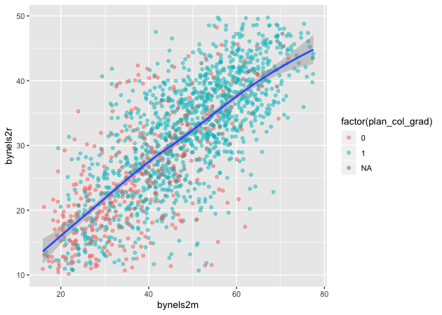

Another key part of exploratory data analysis is making plots that let
you visually inspect the data. This module will focus on graphics.

R has three major graphing systems: the [base
system](https://stat.ethz.ch/R-manual/R-devel/library/graphics/html/00Index.html),
[lattice](http://lattice.r-forge.r-project.org), and
[ggplot2](http://ggplot2.tidyverse.org). Each system has its benefits
and drawbacks. Each system is also very versatile with many, many
options for creating and adjusting plots.

Unfortunately, there isn’t enough time to go through each system. After
describing a few base R graphing functions, this module will focus on
ggplot2 since it allows users to build plots using the [grammar of
graphics](http://vita.had.co.nz/papers/layered-grammar.html) and
integrates well with the tidyverse.

We’ll use the same ELS plans data we’ve been using, again in Stata
format since it has variable and value labels.

``` r
## libraries
library(tidyverse)
library(haven)
library(labelled)
```

``` r
## read in Stata data file
df <- read_dta('../data/els_plans.dta')
```

Plots using base R
==================

Even though users have developed new graphics libraries, the base R
graphics system is still very powerful. It’s also very easy to use in a
pinch. When I want a quick visual of a data distribution that’s just for
me, I generally use base R.

Histogram
---------

For continuous variables, a histogram is a useful plot. Though the
`hist()` function has many options to adjust how it looks, the defaults
work really well.

``` r
## histogram of math scores
hist(df$bynels2m)
```


> #### Quick exercise
>
> Check the distribution of reading scores.

Density
-------

Density plots are also really helpful. R doesn’t have single density
plot function, but you can `plot()` the `density()` of a continuous
variable. Unlike `hist()`, however, `density()` doesn’t automatically
ignore missing values, so like some other commands, we have to tell it
to remove `NA`s.

``` r
## density plot of math scores
plot(density(df$bynels2m, na.rm = TRUE))
```


> #### Quick exercise
>
> Plot the density of reading scores. Next, try to use the `col`
> argument in `plot()` to change the color of the line to `'red'`.

Box plot
--------

Call a box plot using the `boxplot()` function. This one is a little
tricker because it uses the [R
formula](https://www.statmethods.net/graphs/boxplot.html) to set the
continuous variable against the group. (We’ll talk more about formulas
in the module on modeling.) The formula uses a tilde, `~`, and should be
constructed like this:

-   `<var> ~ <group var>`

<!-- -->

``` r
## box plot of math scores against student expectations
boxplot(bynels2m ~ bystexp, data = df)
```


Scatter
-------

Finally, plot continuous variables against one another using the base
`plot()` function. There are two primary ways to make a scatter plot
using `plot()`:

-   `plot(x, y)`
-   `plot(y ~ x)`

We’ll use the first.

``` r
## scatter plot of math against reading scores
plot(df$bynels2m, df$bynels2r)
```


> #### Quick exercise
>
> Plot math scores against reading scores using the other formula
> method.

Plots using ggplot2
===================

The first few times I tried to use ggplot2, I didn’t quite get it. But
once I did (and it doesn’t take too long!), I really started to like it
and it’s now my go to system for making plots.

The ggplot2 system is too involved to fully cover, but that’s kind of
the point of the grammar of graphics: once you see how it’s put
together, you can anticipate the commands you need to build your plot.

We’ll start by covering the same plots as above.

Histogram
---------

[As the main help site says](http://ggplot2.tidyverse.org), all ggplot2
plots need three things:

-   data
-   how variables in the data map onto the plot (*e.g.*, what’s on the
    x-axis? what’s on the y-axis)
-   what kind of figure you want to make or add to the plot

Depending on the plot you want to make, these pieces may come in
different points in the command structure, which is usually made up of
linked functions like other tidyverse libraries. The key difference
between the two is that while dplyr uses the pipe (`%>%`) to connect
different functions, ggplot2 uses a plus sign (`+`).

We’ll start by making a histogram again. To help make these pieces
clearer, I’ll use the argument names when possible. The first function,
which initializes the plot is `ggplot()`. Its first argument is the
data.

The aesthetic mappings, that is, which variables go where or how they
function on the plot, go inside the `aes()` function. Since we only have
one variable, `bynels2m`, it is assigned to `x`.

If we stop there and print…

``` r
## init ggplot 
p <- ggplot(data = df, mapping = aes(x = bynels2m))
p
```


…nothing! Well, not nothing, but no histogram. That’s because the plot
object `p` knows the data and the key variable mapping but doesn’t know
what do with them. What do we want?

Since we want a histogram, we add the `geom_histogram()` function to the
existing plot object. Trying again…

``` r
## add histogram instruction
p <- p + geom_histogram()
p
```


Success!

Density
-------

Unlike the base R graphics system, ggplot2 does have a density plotting
command, `geom_density()`. We’ll go ahead and chain it to the first
command and print. Notice how the function chain is the mostly the same
as above, but (1) written in a single linked chain and (2) using a
different `geom_*()` command at the end to indicate that we want
something different.

``` r
## density
p <- ggplot(data = df, mapping = aes(x = bynels2m)) +
    geom_density()
p
```


> #### Quick exercise
>
> Make a density plot of reading scores.

If we want to superimpose the density plot over the histogram, we only
need chain the two commands together with a slight modification in how
the histogram is made. This way, the histogram and the density will be
on the same scale.

The change happens in the `geom_histogram()` function, where we add a
new mapping: `aes(y = ..density..)`.

``` r
## histogram with density plot overlapping
p <- ggplot(data = df, mapping = aes(x = bynels2m)) +
    geom_histogram(mapping = aes(y = ..density..)) +
    geom_density()
p
```


It worked, but it’s not the greatest visual since the colors are the
same and the density plot is thin with no fill.

Adding to what came before, the `geom_histogram()` and `geom_density()`
both take on new arguments that change the defaults. Now the resulting
plot should look nicer and be easier to read.

``` r
## histogram with density plot overlapping (add color to see better)
p <- ggplot(data = df, mapping = aes(x = bynels2m)) +
    geom_histogram(mapping = aes(y = ..density..),
                   color = 'black',
                   fill = 'white') +
    geom_density(fill = 'red', alpha = 0.2)
p
```


> #### Quick exercise
>
> Try changing some of the arguments in the last plot. What happens when
> you change `alpha`? What does the `color` argument change? And `fill`?

Two-way
-------

Plotting the difference in a continuous distribution across groups is a
common task. Let’s see the difference between student math scores
between students with parents who have any postsecondary degree and
those without.

Since we’re using data that was labelled in Stata, we’ll first use
`val_labels()` to check the `bypared` variable.

``` r
## get parental education levels, use `val_labels()` to show them
val_labels(df$bypared)
```

    ##                                {missing} 
    ##                                       -9 
    ##    {survey component legitimate skip/na} 
    ##                                       -8 
    ##                          {nonrespondent} 
    ##                                       -4 
    ##               did not finish high school 
    ##                                        1 
    ##        graduated from high school or ged 
    ##                                        2 
    ##        attended 2-year school, no degree 
    ##                                        3 
    ##             graduated from 2-year school 
    ##                                        4 
    ##       attended college, no 4-year degree 
    ##                                        5 
    ##                   graduated from college 
    ##                                        6 
    ##  completed master^s degree or equivalent 
    ##                                        7 
    ## completed phd, md, other advanced degree 
    ##                                        8

The way this variable is structured prevents us from using a `>=` test
like we have been. We want to count parents with a two-year degree (`4`)
in addition to those having a Bachelor’s degree or higher (`6`, `7`, and
`8`), but we don’t want to count those who attended, but didn’t earn a
degree (`5`).

To do this, we’ll use the special operator `%in%` which does exactly
what it sounds like. If a value of `bypared` is **in** the set that we
give it, then the new indicator `pared_coll` will be 1; if not, 0.

The `ggplot()` function doesn’t need to use our full data. In fact, our
data needs to be set up a bit differently to make this plot. We’ll make
a new temporary data object that only has what we need.

``` r
## need to set up data
plot_df <- df %>%
    select(bypared, bynels2m) %>%
    na.omit() %>%                       # can't plot NAs, so drop them
    mutate(pared_coll = ifelse(bypared %in% c(4,6,7,8), 1, 0)) %>%
    select(-bypared) 

## show
head(plot_df)
```

    ## # A tibble: 6 x 2
    ##   bynels2m pared_coll
    ##      <dbl>      <dbl>
    ## 1     47.8          0
    ## 2     55.3          0
    ## 3     66.2          0
    ## 4     35.3          0
    ## 5     30.0          0
    ## 6     24.3          0

To plot against the two groups we’ve made, we need to add it to the
aesthetic feature, `aes()`. The math score, `bynels2m`, is still mapped
to `x`, but since we want two side-by-side histograms, we set the `fill`
aesthetic to our new indicator variable. So the function knows that it’s
a group, we wrap it in the `factor()` function.

Finally, we add some changes to the `geom_histogram()` function so that
each group is on the same scale.

``` r
## two way histogram
p <- ggplot(data = plot_df,
            aes(x = bynels2m, fill = factor(pared_coll))) +
    geom_histogram(alpha = 0.5, stat = 'density', position = 'identity')
p
```


> #### Quick exercise
>
> Remove some of the new arguments in `geom_histogram()`. How does the
> resulting plot change? Remove the `factor()` function from around
> `pared_coll`: what happens?

Box plot
--------

By this point, you’re hopefully seeing the pattern in how ggplot figures
are put together. To make a box plot, we need to add a `y` mapping to
the `aes()` in addition to the `x` mapping. We don’t have to, but we’ve
also added the same variable to `fill` as we did to `x` so that in
addition to having different box and whisker plots along the x-axis,
each plot is given its own color.

``` r
## box plot using both factor() and as_factor()
p <- ggplot(data = df,
            mapping = aes(x = factor(bypared),
                          y = bynels2r,
                          fill = as_factor(bypared))) +
    geom_boxplot()
p
```


> #### Quick exercise
>
> Change the `as_factor()` and `factor()` functions above. How does the
> plot change?

Scatter
=======

To make a scatter plot, make sure that the `aes()` has mappings for the
`x` axis and `y` axis and then use `geom_point()` to plot. To make
things easier to see, we’ll first reduce the data to 10% of the full
sample.

``` r
## sample 10% to make figure clearer
df_10 <- df %>% sample_frac(0.1)

## scatter
p <- ggplot(data = df_10, mapping = aes(x = bynels2m, y = bynels2r)) +
    geom_point()
p
```


Now that we have our scatter plot, let’s say that we want to add a third
dimension. Specifically, we want to change the point color based on
whether a student plans to earn a Bachelor’s degree or higher. That
means we need a new dummy variable that is 1 for those with BA/BS plans
and 0 for others.

We can look at the student base year expectations with `table()`

``` r
## see student base year plans
table(df$bystexp)
```

    ## 
    ##   -1    1    2    3    4    5    6    7 
    ## 1450  128  983  879  561 5416 3153 2666

But those numbers don’t tell us much. Since we read in a Stata data file
with labelled values, though, we can use the `val_labels()` function to
see our options.

``` r
## see how the labels map
val_labels(df$bystexp)
```

    ##    {survey component legitimate skip/na} 
    ##                                       -8 
    ##                          {nonrespondent} 
    ##                                       -4 
    ##                             {don^t know} 
    ##                                       -1 
    ##         less than high school graduation 
    ##                                        1 
    ##       high school graduation or ged only 
    ##                                        2 
    ## attend or complete 2-year college/school 
    ##                                        3 
    ## attend college, 4-year degree incomplete 
    ##                                        4 
    ##                    graduate from college 
    ##                                        5 
    ##     obtain master^s degree or equivalent 
    ##                                        6 
    ## obtain phd, md, or other advanced degree 
    ##                                        7

Now we see that `bystexp >= 5` mean a student plans to earn a Bachelor’s
degree or higher. Let’s create that.

``` r
## create variable for students who plan to graduate from college
df_10 <- df_10 %>%
    mutate(plan_col_grad = ifelse(bystexp >= 5, 1, 0))
```

Now that we have our new variable `plan_col_grad`, we can add it the
`color` aesthetic, `aes()` in `geom_point()`. Don’t forget to use
`factor()` so that ggplot knows to treat it like a group!

``` r
## scatter
p <- ggplot(data = df_10,
            mapping = aes(x = bynels2m, y = bynels2r)) +
    geom_point(mapping = aes(color = factor(plan_col_grad)), alpha = 0.5)
p
```


> #### Quick exercise
>
> Change how you make `plan_col_grad` so that instead of 1 and 0, you
> use ‘yes’ and ‘no’. Make your figure again. What changes?

Fitted lines
------------

It’s often helpful to plot fitted lines against a scatter plot to help
see the underlying trend. There are a number of ways to do this with the
`geom_smooth()` function.

### Linear fit

Setting `method = lm` in `geom_smooth()` will fit a simple straight
line.

``` r
## add fitted line with linear fit
p <- ggplot(data = df_10, mapping = aes(x = bynels2m, y = bynels2r)) +
    geom_point(mapping = aes(color = factor(plan_col_grad)), alpha = 0.5) +
    geom_smooth(method = lm)
p
```


### Linear fit with polynomials

In addition to the `method`, we can add a `formula` to allow the fitted
line to take a non-linear shape. Using the `aes()` values of `x` and
`y`, the argument below uses an R formula, `y ~ x`, but with the
addition of the `poly()` function. Setting the second argument in
`poly()` to 2 gives the line an extra quadratic term, which allows it to
take a more curved shape.

``` r
## add fitted line with polynomial linear fit
p <- ggplot(data = df_10, mapping = aes(x = bynels2m, y = bynels2r)) +
    geom_point(mapping = aes(color = factor(plan_col_grad)), alpha = 0.5) +
    geom_smooth(method = lm, formula = y ~ poly(x,2))
p
```


> #### Quick exercise
>
> Change the value in `poly()` to higher numbers. How does the line
> change?

### Loess

Finally, we can skip trying to adjust a linear line and just fit a
[loess](https://en.wikipedia.org/wiki/Local_regression).

``` r
## add fitted line with lowess
p <- ggplot(data = df_10, mapping = aes(x = bynels2m, y = bynels2r)) +
    geom_point(mapping = aes(color = factor(plan_col_grad)), alpha = 0.5) +
    geom_smooth(method = loess)
p
```


Plotly
======

``` r
## load plotly library
library(plotly)
```

    ## Error in library(plotly): there is no package called 'plotly'

As a final example, we’ll turn our last plot into an interactive plotly
figure. [Plotly](https://plot.ly/d3-js-for-r-and-shiny-charts/) works
with a number of languages, but it integrates really well with ggplot.
In fact, once the plot is made, we only have to use the `ggplotly()`
function to make it interactive. We’ll add a small bit to the `aes()`,
though, to make it easier to identify outliers when we hover over them.

``` r
## redo last figure with addition of text in aes()
p <- ggplot(data = df_10, mapping = aes(x = bynels2m, y = bynels2r)) +
    geom_point(mapping = aes(color = factor(plan_col_grad),
                             text = paste0('stu_id: ', stu_id)), alpha = 0.5) +
    geom_smooth(method = loess)

## create an interactive plot with the last figure
p <- ggplotly(p)
```

    ## Error in ggplotly(p): could not find function "ggplotly"

``` r
p
```



Other than the neat! factor, the plotly figure is great for pinpointing
outliers. Looking at the figure, hover over markers that seem outside
the expected value. Clearly, this can be a great tool for inspecting
your data.

    ## Error in as.vector(x, "character"): cannot coerce type 'environment' to vector of type 'character'

<!--html_preserve-->
<iframe markdown="1" src="./plotly/plotly/ptly_one.html">
</iframe><!--/html_preserve-->
> #### Quick exercise
>
> Use the plotly figure to inspect your data, particularly outliers.
