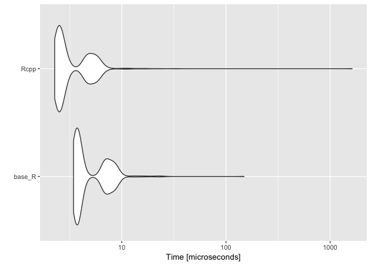
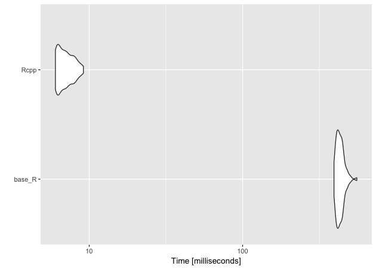
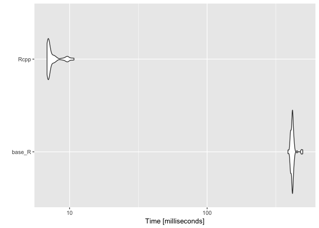

``` r
## libraries
library(tidyverse)
library(Rcpp)
library(microbenchmark)
```

``` r
## load data
load('../data/hp_rcpp.Rdata')
```

## College locations

``` r
## college locations
col_df
```

    # A tibble: 7,647 x 5
       unitid instnm                              fips5   lon   lat
        <int> <chr>                               <chr> <dbl> <dbl>
     1 100654 Alabama A & M University            01089 -86.6  34.8
     2 100663 University of Alabama at Birmingham 01073 -86.8  33.5
     3 100690 Amridge University                  01101 -86.2  32.4
     4 100706 University of Alabama in Huntsville 01089 -86.6  34.7
     5 100724 Alabama State University            01101 -86.3  32.4
     6 100733 University of Alabama System Office 01125 -87.5  33.2
     7 100751 The University of Alabama           01125 -87.5  33.2
     8 100760 Central Alabama Community College   01123 -85.9  32.9
     9 100812 Athens State University             01083 -87.0  34.8
    10 100830 Auburn University at Montgomery     01101 -86.2  32.4
    # ... with 7,637 more rows

## Census block group locations

``` r
## census block group locations
cbg_df
```

    # A tibble: 217,740 x 4
       fips11         pop   lon   lat
       <chr>        <int> <dbl> <dbl>
     1 010010201001   698 -86.5  32.5
     2 010010201002  1214 -86.5  32.5
     3 010010202001  1003 -86.5  32.5
     4 010010202002  1167 -86.5  32.5
     5 010010203001  2549 -86.5  32.5
     6 010010203002   824 -86.5  32.5
     7 010010204001   944 -86.4  32.5
     8 010010204002  1937 -86.4  32.5
     9 010010204003   935 -86.4  32.5
    10 010010204004   570 -86.4  32.5
    # ... with 217,730 more rows

# Compute great circle distance with Haversine

``` r
## convert degrees to radians
deg_to_rad <- function(degree) {
    m_pi <- 3.141592653589793238462643383280
    return(degree * m_pi / 180)
}

## compute Haversine distance between two points
dist_haversine <- function(xlon, xlat, ylon, ylat) {

    ## radius of Earth in meters
    e_r <- 6378137

    ## return 0 if same point
    if (xlon == ylon & xlat == xlon) { return(0) }

    ## convert degrees to radians
    xlon = deg_to_rad(xlon)
    xlat = deg_to_rad(xlat)
    ylon = deg_to_rad(ylon)
    ylat = deg_to_rad(ylat)

    ## haversine distance formula
    d1 <- sin((ylat - xlat) / 2)
    d2 <- sin((ylon - xlon) / 2)

    return(2 * e_r * asin(sqrt(d1^2 + cos(xlat) * cos(ylat) * d2^2)))
}
```

``` r
## store first census block group point (x) and first college point (y)
xlon <- cbg_df[[1, 'lon']]
xlat <- cbg_df[[1, 'lat']]
ylon <- col_df[[1, 'lon']]
ylat <- col_df[[1, 'lat']]

## test single distance function
d <- dist_haversine(xlon, xlat, ylon, ylat)
d
```

    [1] 258212.3

## Many to many distance matrix

``` r
## compute many to many distances and return matrix
dist_mtom <- function(xlon,         # vector of starting longitudes
                      xlat,         # vector of starting latitudes
                      ylon,         # vector of ending longitudes
                      ylat,         # vector of ending latitudes
                      x_names,      # vector of starting point names
                      y_names) {    # vector of ending point names

    ## init output matrix (n X k)
    n <- length(xlon)
    k <- length(ylon)
    mat <- matrix(NA, n, k)

    ## double loop through each set of points to get all combinations
    for(i in 1:n) {
        for(j in 1:k) {
            mat[i,j] <- dist_haversine(xlon[i], xlat[i], ylon[j], ylat[j])
        }
    }

    ## add row and column names
    rownames(mat) <- x_names
    colnames(mat) <- y_names
    return(mat)
}
```

``` r
## test matrix (limit to only 10 starting points)
distmat <- dist_mtom(cbg_df$lon[1:10], cbg_df$lat[1:10],
                     col_df$lon, col_df$lat,
                     cbg_df$fips11[1:10], col_df$unitid)

## show
distmat[1:5,1:5]
```

``` 
               100654   100663   100690   100706   100724
010010201001 258212.3 119349.8 31495.73 251754.3 21138.09
010010201002 256255.2 117447.3 32284.61 249798.4 22263.60
010010202001 256775.4 118210.3 31047.25 250348.1 21059.86
010010202002 258084.9 119554.9 30210.67 251665.2 20017.60
010010203001 256958.5 118703.3 29758.10 250567.0 19905.92
```

> #### Quick exercise
> 
> Can you find the minimum distance for each starting point? What’s the
> name of the nearest end point?

## Nearest end point

``` r
## compute and return minimum distance along with name
dist_min <- function(xlon,         # vector of starting longitudes
                     xlat,         # vector of starting latitudes
                     ylon,         # vector of ending longitudes
                     ylat,         # vector of ending latitudes
                     x_names,      # vector of starting point names
                     y_names) {    # vector of ending point names
    
    ## NB: lengths: x coords == x names && y coords == y_names
    n <- length(xlon)
    k <- length(ylon)
    minvec_name <- vector('character', n)
    minvec_meter <- vector('numeric', n)

    ## init temporary vector for distances between one x and all ys
    tmp <- vector('numeric', k)

    ## give tmp names of y vector
    names(tmp) <- y_names

    ## loop through each set of starting points
    for(i in 1:n) {
        for(j in 1:k) {
            tmp[j] <- dist_haversine(xlon[i], xlat[i], ylon[j], ylat[j])
        }

        ## add to output matrix
        minvec_name[i] <- names(which.min(tmp))
        minvec_meter[i] <- min(tmp)
    }

    return(data.frame('fips11' = x_names,
                      'unitid' = minvec_name,
                      'meters' = minvec_meter,
                      stringsAsFactors = FALSE))
}
```

``` r
## test matrix (limit to only 10 starting points)
mindf <- dist_min(cbg_df$lon[1:10], cbg_df$lat[1:10],
                  col_df$lon, col_df$lat,
                  cbg_df$fips11[1:10], col_df$unitid)
## show
mindf
```

``` 
         fips11 unitid   meters
1  010010201001 101471 15785.88
2  010010201002 101471 14228.69
3  010010202001 101471 13949.21
4  010010202002 101471 14870.35
5  010010203001 101471 13362.81
6  010010203002 101471 14389.79
7  010010204001 101471 12704.73
8  010010204002 101471 13270.80
9  010010204003 101471 14102.44
10 010010204004 101471 14756.51
```

> #### Quick exercise
> 
> How long will it take to find the closest college to each census
> track? Use `system.time()` and extrapolate to make a best guess.

# Rcpp

``` r
## source Rcpp code
sourceCpp('../scripts/dist_func.cpp', rebuild = TRUE)
```

## Front matter

``` cpp
// header files to include
#include <Rcpp.h>

// preprocessor replacements
#define e_r 6378137.0       
#define m_pi 3.141592653589793238462643383280

// use Rcpp namespace to avoid Rcpp::<...> repetition
using namespace Rcpp;
```

## Utility functions

``` cpp
// convert degrees to radians
// [[Rcpp::export]]
double deg_to_rad_rcpp(double degree) {
 return(degree * m_pi / 180.0);

// compute Haversine distance between two points
// [[Rcpp::export]]
double dist_haversine_rcpp(double xlon,
                            double xlat,
                            double ylon,
                            double ylat) {

  // return 0 if same point
  if (xlon == ylon && xlat == xlon) return 0.0;

  // convert degrees to radians
  xlon = deg_to_rad_rcpp(xlon);
  xlat = deg_to_rad_rcpp(xlat);
  ylon = deg_to_rad_rcpp(ylon);
  ylat = deg_to_rad_rcpp(ylat);

  // haversine distance formula
  double d1 = sin((ylat - xlat) / 2.0);
  double d2 = sin((ylon - xlon) / 2.0);
  return 2.0 * e_r * asin(sqrt(d1*d1 + cos(xlat) * cos(ylat) * d2*d2));
  return dist;   
}
```

## Many to many distance matrix

``` cpp
// compute many to many distances and return matrix
// [[Rcpp::export]]
NumericMatrix dist_mtom_rcpp(NumericVector xlon,
                               NumericVector xlat,
                               NumericVector ylon,
                               NumericVector ylat,
                               CharacterVector x_names,
                               CharacterVector y_names) {

  // init output matrix (x X y)
  int n = xlon.size();
  int k = ylon.size();
  NumericMatrix distmat(n,k);

  // double loop through each set of points to get all combinations
  for(int i = 0; i < n; i++) {
    for(int j = 0; j < k; j++) {
      distmat(i,j) = dist_haversine_rcpp(xlon[i],xlat[i],ylon[j],ylat[j]);
    }
  }
  // add row and column names
  rownames(distmat) = x_names;
  colnames(distmat) = y_names;
  return distmat;
}   
```

## Nearest end point

``` cpp
// compute and return minimum distance along with name
// [[Rcpp::export]]
DataFrame dist_min_rcpp(NumericVector xlon,
                          NumericVector xlat,
                          NumericVector ylon,
                          NumericVector ylat,
                          CharacterVector x_names,
                          CharacterVector y_names) {

  // init output matrix (x X 3)
  int n = xlon.size();
  int k = ylon.size();
  CharacterVector minvec_name(n);
  NumericVector minvec_meter(n);
  NumericVector tmp(k);

  // loop through each set of starting points
  for(int i = 0; i < n; i++) {
    for(int j = 0; j < k; j++) {
      tmp[j] = dist_haversine_rcpp(xlon[i],xlat[i],ylon[j],ylat[j]);
    }
    // add to output matrix
    minvec_name[i] = y_names[which_min(tmp)];
    minvec_meter[i] = min(tmp);
  }

  // return created data frame
  return DataFrame::create(Named("fips11") = x_names,
                            Named("unitid") = minvec_name,
                            Named("meters") = minvec_meter,
                            _["stringsAsFactors"] = false);
}
```

# Quick comparisons

## Single distance

``` r
d_Rcpp <- dist_haversine_rcpp(xlon, xlat, ylon, ylat)

## show
d_Rcpp
```

    [1] 258212.3

``` r
## compare
identical(d, d_Rcpp)
```

    [1] TRUE

## Many to many

``` r
distmat_Rcpp <- dist_mtom_rcpp(cbg_df$lon[1:10], cbg_df$lat[1:10],
                               col_df$lon, col_df$lat,
                               cbg_df$fips11[1:10], col_df$unitid)

## show
distmat_Rcpp[1:5,1:5]
```

``` 
               100654   100663   100690   100706   100724
010010201001 258212.3 119349.8 31495.73 251754.3 21138.09
010010201002 256255.2 117447.3 32284.61 249798.4 22263.60
010010202001 256775.4 118210.3 31047.25 250348.1 21059.86
010010202002 258084.9 119554.9 30210.67 251665.2 20017.60
010010203001 256958.5 118703.3 29758.10 250567.0 19905.92
```

``` r
## compare
all.equal(distmat, distmat_Rcpp)
```

    [1] TRUE

## Minimum distances

``` r
mindf_Rcpp <- dist_min_rcpp(cbg_df$lon[1:10], cbg_df$lat[1:10],
                            col_df$lon, col_df$lat,
                            cbg_df$fips11[1:10], col_df$unitid)

## show
mindf_Rcpp
```

``` 
         fips11 unitid   meters
1  010010201001 101471 15785.88
2  010010201002 101471 14228.69
3  010010202001 101471 13949.21
4  010010202002 101471 14870.35
5  010010203001 101471 13362.81
6  010010203002 101471 14389.79
7  010010204001 101471 12704.73
8  010010204002 101471 13270.80
9  010010204003 101471 14102.44
10 010010204004 101471 14756.51
```

``` r
## compare
all.equal(mindf, mindf_Rcpp)
```

    [1] TRUE

# Benchmarks

``` r
tm_single <- microbenchmark(base_R = dist_haversine(xlon, xlat, ylon, ylat),
                            Rcpp = dist_haversine_rcpp(xlon, xlat, ylon, ylat),
                            times = 1000)
## results
tm_single
```

    Unit: microseconds
       expr   min    lq     mean median     uq     max neval
     base_R 1.856 1.929 2.059579  1.958 2.0140  16.853  1000
       Rcpp 1.325 1.370 2.237910  1.403 1.4525 797.096  1000

``` r
## plot
autoplot(tm_single)
```



``` r
## time for base R to do many to many with 100 starting points
system.time(dist_mtom(cbg_df$lon[1:100], cbg_df$lat[1:100],
                      col_df$lon, col_df$lat,
                      cbg_df$fips11[1:100], col_df$unitid))
```

``` 
   user  system elapsed 
  2.070   0.012   2.083 
```

``` r
## ...and now Rcpp version
system.time(dist_mtom_rcpp(cbg_df$lon[1:100], cbg_df$lat[1:100],
                           col_df$lon, col_df$lat,
                           cbg_df$fips11[1:100], col_df$unitid))
```

``` 
   user  system elapsed 
  0.036   0.000   0.036 
```

``` r
## compare just 10 many to many
tm_mtom <- microbenchmark(base_R = dist_mtom(cbg_df$lon[1:10], cbg_df$lat[1:10],
                                             col_df$lon, col_df$lat,
                                             cbg_df$fips11[1:10], col_df$unitid),
                          Rcpp = dist_mtom_rcpp(cbg_df$lon[1:10], cbg_df$lat[1:10],
                                                col_df$lon, col_df$lat,
                                                cbg_df$fips11[1:10], col_df$unitid),
                          times = 100)

## results
tm_mtom
```

    Unit: milliseconds
       expr        min         lq       mean     median         uq        max
     base_R 197.057237 203.348951 208.545831 206.482848 210.210083 264.782868
       Rcpp   3.179775   3.234547   3.304756   3.272729   3.374662   3.634047
     neval
       100
       100

``` r
## plot
autoplot(tm_mtom)
```



``` r
## time for base R to do many to many with 100 starting points
system.time(dist_min(cbg_df$lon[1:100], cbg_df$lat[1:100],
                     col_df$lon, col_df$lat,
                     cbg_df$fips11[1:100], col_df$unitid))
```

``` 
   user  system elapsed 
  2.100   0.009   2.117 
```

``` r
## ...and now Rcpp version
system.time(dist_min_rcpp(cbg_df$lon[1:100], cbg_df$lat[1:100],
                          col_df$lon, col_df$lat,
                          cbg_df$fips11[1:100], col_df$unitid))
```

``` 
   user  system elapsed 
  0.034   0.000   0.033 
```

``` r
## compare just 10 min
tm_min <- microbenchmark(base_R = dist_min(cbg_df$lon[1:10], cbg_df$lat[1:10],
                                           col_df$lon, col_df$lat,
                                           cbg_df$fips11[1:10], col_df$unitid),
                         Rcpp = dist_min_rcpp(cbg_df$lon[1:10], cbg_df$lat[1:10],
                                              col_df$lon, col_df$lat,
                                              cbg_df$fips11[1:10], col_df$unitid),
                         times = 100)
## results
tm_min
```

    Unit: milliseconds
       expr        min         lq       mean     median         uq        max
     base_R 192.406121 205.150824 209.557421 208.917229 211.350122 253.219094
       Rcpp   3.403444   3.448892   3.523223   3.487917   3.552427   4.191474
     neval
       100
       100

``` r
## plot
autoplot(tm_min)
```



# Full run for Rcpp version

``` r
## find minimum
system.time(full_min <- dist_min_rcpp(cbg_df$lon, cbg_df$lat,
                                      col_df$lon, col_df$lat,
                                      cbg_df$fips11, col_df$unitid))
```

``` 
   user  system elapsed 
 71.906   0.117  72.165 
```

``` r
## show
full_min %>% tbl_df()
```

    # A tibble: 217,740 x 3
       fips11       unitid meters
       <chr>        <chr>   <dbl>
     1 010010201001 101471 15786.
     2 010010201002 101471 14229.
     3 010010202001 101471 13949.
     4 010010202002 101471 14870.
     5 010010203001 101471 13363.
     6 010010203002 101471 14390.
     7 010010204001 101471 12705.
     8 010010204002 101471 13271.
     9 010010204003 101471 14102.
    10 010010204004 101471 14757.
    # ... with 217,730 more rows

> #### Not-so quick exercise
> 
> Below is a function that computes the great circle distance using
> [Vincenty’s
> formula](https://en.wikipedia.org/wiki/Vincenty%27s_formulae). It’s
> more accurate than the haversine version, but can be much more
> compuationally intensive. Try to convert the base R function into an
> Rcpp function. You’ll need to start a new script and then use
> `sourceCpp()` to read it in and test. Once you’ve got, substitute the
> respective Vincenty formula functions into the `dist_min_*()`
> functions and compare times.
> 
> A few things to keep in mind:  
> 1\. You’ll need to declare your variables and types (lot’s of
> `double`); don’t forget that double numbers need a decimal, otherwise
> C++ thinks they are integers.  
> 2\. Don’t forget your semi-colon line enders\!  
> 3\. `abs()` in C++ is `fabs()`  
> 4\. Remember: `a^2 = a * a`

``` r
## base R distance function using Vincenty formula
dist_vincenty <- function(xlon,
                          xlat,
                          ylon,
                          ylat) {

    ## return 0 if same point
    if (xlon == ylon && xlat == ylat) { return(0) }

    ## convert degrees to radians
    xlon <- deg_to_rad(xlon)
    xlat <- deg_to_rad(xlat)
    ylon <- deg_to_rad(ylon)
    ylat <- deg_to_rad(ylat)

    ## ---------------------------------------------------
    ## https:##en.wikipedia.org/wiki/Vincenty%27s_formulae
    ## ---------------------------------------------------

    ## some constants
    a <- 6378137
    f <- 1 / 298.257223563
    b <- (1 - f) * a
    U1 <- atan((1 - f) * tan(xlat))
    U2 <- atan((1 - f) * tan(ylat))
    sinU1 <- sin(U1)
    sinU2 <- sin(U2)
    cosU1 <- cos(U1)
    cosU2 <- cos(U2)
    L <- ylon - xlon
    lambda <- L                         # initial value

    ## set up loop
    iters <- 100                        # no more than 100 loops
    tol <- 1.0e-12                      # tolerance level
    again <- TRUE

    while (again) {

        ## sin sigma
        sinLambda <- sin(lambda)
        cosLambda <- cos(lambda)
        p1 <- cosU2 * sinLambda
        p2 <- cosU1 * sinU2 - sinU1 * cosU2 * cosLambda
        sinsig <- sqrt(p1^2 + p2^2)

        ## cos sigma
        cossig <- sinU1 * sinU2 + cosU1 * cosU2 * cosLambda

        ## plain ol' sigma
        sigma <- atan2(sinsig, cossig)

        ## sin alpha
        sina <- cosU1 * cosU2 * sinLambda / sinsig

        ## cos^2 alpha
        cos2a <- 1 - (sina * sina)

        ## cos 2*sig_m
        cos2sigm <- cossig - 2 * sinU1 * sinU2 / cos2a

        ## C
        C <- f / 16 * cos2a * (4 + f * (4 - 3 * cos2a))

        ## store old lambda
        lambdaOld <- lambda

        ## update lambda
        lambda <- L + (1 - C) * f * sina *
            (sigma + C * sinsig * (cos2sigm + C * cossig *
                                   (-1 + 2 * cos2sigm^2)))

        ## subtract from iteration total
        iters <- iters - 1

        ## go again if lambda diff is > tolerance and still have iterations
        again <- (abs(lambda - lambdaOld) > tol && iters > 0)
    }
    ## if iteration count runs out, stop and send message
    if (iters == 0) {
        stop("Failed to converge!", call. = FALSE)
    }
    else {

        ## u^2
        Usq <- cos2a * (a^2 - b^2) / (b^2)

        ## A
        A <- 1 + Usq / 16384 * (4096 + Usq * (-768 + Usq * (320 - 175 * Usq)))

        ## B
        B <- Usq / 1024 * (256 + Usq * (-128 + Usq * (74 - 47 * Usq)))

        ## delta sigma
        dsigma <- B * sinsig *
            (cos2sigm + B / 4 *
             (cossig * (-1 + 2 * cos2sigm^2)
                 - B / 6 * cos2sigm * (-3 + 4 * sinsig^2)
                 * (-3 + 4 * cos2sigm^2)))

        ## return the distance
        return(b * A * (sigma - dsigma))
  }
}
```
