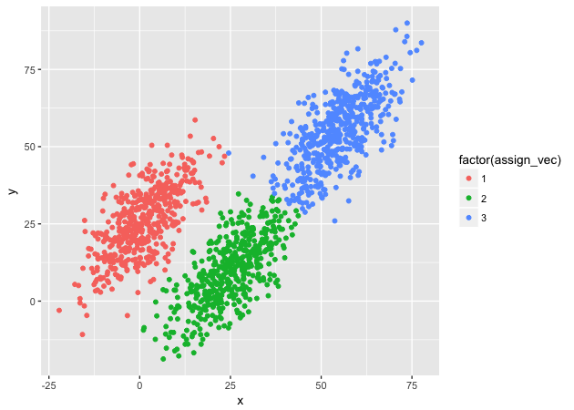

In this module, we’ll continue to practice programming in R.

``` r
## libraries
library(tidyverse)
library(plotly)
```

# Read in and inspect data

``` r
## read in data
df <- readRDS('../data/programming_two.rds')

## show
df
```

    # A tibble: 1,500 x 3
            x     y     z
        <dbl> <dbl> <dbl>
     1  33.1  11.6  -16.0
     2  -8.55  6.01  11.8
     3  50.7  56.3   97.8
     4   2.83 27.5   34.4
     5  -4.66 20.0   25.1
     6  -3.04 16.2   22.8
     7  30.5  12.1  -14.3
     8   7.08 25.3   25.6
     9   1.33 20.1   17.6
    10  -3.11 13.4   11.5
    # ... with 1,490 more rows

``` r
## plot first two dimensions
g <- ggplot(df, mapping = aes(x = x, y = y)) + geom_point()
g
```


# K-means clustering

\\\[ \\underset{S}{arg\\,min} \\sum\_{i=1}^k\\sum\_{x\\in S\_i}
\\vert\\vert x - \\mu\_i \\vert\\vert^2\\\]

where

  - \\(k\\) is the number of clusters  
  - \\(S\_i\\) is one cluster set of points  
  - \\(\\vert\\vert x - \\mu\_i \\vert\\vert^2\\) is the squared
    [Euclidean
    distance](https://en.wikipedia.org/wiki/Euclidean_distance)

## Algorithm

There are number of algorithms to compute k-means. We’ll use [Lloyd’s
algorithm](https://en.wikipedia.org/wiki/Lloyd%27s_algorithm), which
isn’t the best, but is the simplest and works well enough for our
purposes.

1.  Choose number of clusters, \\(k\\).  
2.  Randomly choose \\(k\\) points from data to serve as initial cluster
    means.  
3.  Repeat following steps until assignments no longer change:
    1.  Assign each point to the cluster with the closest mean (see
        **Step 3.1**, below, for formal definition).  
    2.  Update means to reflect points assigned to the cluster (see
        **Step 3.2**, below, for formal definition).

### Step 3.1: Assign each point to the closest mean

\\\[ S\_i^{(t)} = \\{ x\_p : \\vert\\vert x\_p - m\_i^{(t)}
\\vert\\vert^2 \\leq \\vert\\vert x\_p - m\_j^{(t)} \\vert\\vert^2
\\,\\forall\\, j, 1 \\lt j \\lt k \\}\\\]

*At time \\(t\\), each set, \\(S\_i\\), contains all the points,
\\(x\_p\\) for which its mean, \\(m\_i^{(t)}\\), is the nearest of
possible cluster means.*

### Step 3.2: Update means to reflect points in the cluster

\\\[ m\_i^{(t+1)} = \\frac{1}{\\vert S\_i^{(t)} \\vert} \\sum\_{x\_j\\in
S\_i^{(t)}} x\_j \\\]

*At time \\(t+1\\), each cluster mean \\(m\_i^{(t+1)}\\) is the centroid
of the points, \\(x\_j\\) assigned to the cluster at time
\\(t\\).*

# Let’s run it\!

``` r
## convert data to matrix to make our lives easier (x and y, only, for now)
dat <- df %>% select(x, y) %>% as.matrix()

## get initial means to start
index <- sample(1:nrow(dat), 3)           # give k random indexes
means <- dat[index,]

## show
means
```

``` 
             x        y
[1,] -3.041515 28.54325
[2,] 50.433999 55.22618
[3,] 52.956470 60.61488
```

``` r
## init assignment vector
assign_vec <- numeric(nrow(dat))

## assign each point to one of the clusters
for (i in 1:nrow(dat)) {
    ## init a temporary distance object to hold k distance values
    distance <- numeric(3)
    ## compare to each mean
    for (j in 1:3) {
        distance[j] <- sum((dat[i,] - means[j,])^2)
    }
    ## assign the index of smallest value, which is effectively cluster ID
    assign_vec[i] <- which.min(distance)
}

## repeat above in loop until assignments don't change
identical <- FALSE
while (!identical) {

    ## update means
    for (i in 1:3) {
        means[i,] <- colMeans(dat[assign_vec == i,])
    }

    ## store old assignments, b/c we need to compare
    old_assign_vec <- assign_vec

    ## assign each point to one of the clusters
    for (i in 1:nrow(dat)) {
        ## init a temporary distance object to hold k distance values
        distance <- numeric(3)
        ## compare to each mean
        for (j in 1:3) {
            distance[j] <- sum((dat[i,] - means[j,])^2)
        }
        ## assign the index of smallest value, which is effectively cluster ID
        assign_vec[i] <- which.min(distance)
    }
  
    ## check if assignments change
    identical <- identical(old_assign_vec, assign_vec)
}
```

``` r
## check assignment
plot_df <- bind_cols(df, as.data.frame(assign_vec))
g <- ggplot(plot_df, mapping = aes(x = x, y = y, color = factor(assign_vec))) +
    geom_point()
g
```



## Problems

1.  Repeated code  
2.  Magic numbers (3)  
3.  Variable names depend on working environment  
4.  Primary purpose of code is obfuscated

# Convert to functions

``` r
## Euclidean distance^2
euclid_dist_sq <- function(x,y) return(sum((x - y)^2))

## standardize function that also returns mu and sd
standardize <- function(data) {
    ## column means
    mu <- colMeans(data)
    ## column standard deviations
    sd <- sqrt(diag(var(data)))
    ## scale data (z-score); faster to use pre-computed mu/sd
    sdata <- scale(data, center = mu, scale = sd)
    return(list('mu' = mu, 'sd' = sd, 'scaled_data' = sdata))
}

## compute new means for points in cluster
compute_mean <- function(data, k, assign_vec) {
    ## init means matrix: # means X # features (data columns)
    means <- matrix(NA, k, ncol(data))
    ## for each mean...
    for (i in 1:k) {
        ## ...get column means, restricting to cluster assigned points
        means[i,] <- colMeans(data[assign_vec == i,])
    }
    return(means)
}

## find nearest mean to each point and assign to cluster
assign_to_cluster <- function(data, k, means, assign_vec) {
    ## init within-cluster sum of squares for each cluster
    wcss <- numeric(k)
    ## for each data point (slow!)...
    for (i in 1:nrow(data)) {
        ## ...init distance vector, one for each cluster mean
        distance <- numeric(k)
        ## ...for each mean...
        for (j in 1:k) {
            ## ...compute distance to point
            distance[j] <- euclid_dist_sq(data[i,], means[j,])
        }
        ## ...assign to cluster with nearest mean
        assign_vec[i] <- which.min(distance)
        ## ...add distance to running sum of squares for assigned cluster
        wcss[assign_vec[i]] <- wcss[assign_vec[i]] + distance[assign_vec[i]]
    }
    return(list('assign_vec' = assign_vec, 'wcss' = wcss))
}
```

``` r
## kmean funtion
my_kmeans <- function(data, k, iterations = 100, nstarts = 1, standardize = FALSE) {

    ## convert to matrix
    x <- as.matrix(data)

    ## standardize if TRUE
    if (standardize) {
        sdata <- standardize(data)
        x <- sdata[['scaled_data']]
    }

    ## for number of starts
    for (s in 1:nstarts) {

        ## init identical
        identical <- FALSE

        ## select k random points as starting means
        means <- x[sample(1:nrow(x),k),]

        ## init assignment vector
        init_assign_vec <- rep(NA, nrow(x))

        ## first assignment
        assign_wcss <- assign_to_cluster(x, k, means, init_assign_vec)

        ## iterate until iterations run out or no change in assignment
        while (iterations > 0 && !identical) {

            ## store old assignment / wcss object
            old_assign_wcss <- assign_wcss

            ## get new means
            means <- compute_mean(x, k, assign_wcss[['assign_vec']])

            ## new assignments
            assign_wcss <- assign_to_cluster(x, k, means, assign_wcss[['assign_vec']])

            ## check if identical (no change in assignment)
            identical <- identical(old_assign_wcss[['assign_vec']],
                                   assign_wcss[['assign_vec']])

            ## reduce iteration counter
            iterations <- iterations - 1
        }

        ## store best values...
        if (s == 1) {
            best_wcss <- assign_wcss[['wcss']]
            best_centers <- means
            best_assignvec <- assign_wcss[['assign_vec']]
        } else {
            ## ...update accordingly if number of starts is > 1 & wcss is lower
            if (sum(assign_wcss[['wcss']]) < sum(best_wcss)) {
                best_wcss <- assign_wcss[['wcss']]
                best_centers <- means
                best_assignvec <- assign_wcss[['assign_vec']]
            }
        }
    }

    ## convert back to non-standarded centers if necessary
    if (standardize) {
        sd <- sdata[['sd']]
        mu <- sdata[['mu']]
        for (j in 1:ncol(x)) {
            best_centers[,j] <- best_centers[,j] * sd[j] + mu[j]
        }
    }

    ## return assignment vector, cluster centers, & wcss
    return(list('assignments' = best_assignvec,
                'centers' = best_centers,
                'wcss' = best_wcss))
}
```

# 2 dimensions

``` r
## 2 dimensions
km_2d <- my_kmeans(df[,c('x','y')], 3, nstarts = 20)

## check centers and wcss
km_2d$centers
```

``` 
           [,1]      [,2]
[1,]  0.7741392 25.471911
[2,] 25.0407539  9.780767
[3,] 54.6683528 54.725368
```

``` r
km_2d$wcss
```

    [1] 89184.79 88179.39 99748.81

# 3 dimensions

``` r
## 3 dimensions
km_3d <- my_kmeans(df, 3, nstarts = 20)

## check centers and wcss
km_3d$centers
```

``` 
           [,1]     [,2]      [,3]
[1,] 54.8865406 54.97876 105.13575
[2,] 25.2858908 10.26503 -24.21246
[3,]  0.8928973 25.51276  25.58783
```

``` r
km_3d$wcss
```

    [1] 159247.5 167007.1 153343.3

# Check out plots

``` r
## using 2D: looks good 2D...
p <- plot_ly(df, x = ~x, y = ~y, color = factor(km_2d$assignments)) %>%
    add_markers()
p
```

<!--html_preserve-->

<iframe src="./plotly/plotly/ptly_2d2d.html">

</iframe>

<!--/html_preserve-->

``` r
## ...but off in 3D
p <- plot_ly(df, x = ~x, y = ~y, z = ~z, color = factor(km_2d$assignments)) %>%
    add_markers()
p
```

<!--html_preserve-->

<iframe src="./plotly/plotly/ptly_2d3d.html">

</iframe>

<!--/html_preserve-->

``` r
## using 3D: looks off in 2D...
p <- plot_ly(df, x = ~x, y = ~y, color = factor(km_3d$assignments)) %>%
    add_markers()
p
```

<!--html_preserve-->

<iframe src="./plotly/plotly/ptly_3d2d.html">

</iframe>

<!--/html_preserve-->

``` r
## ...but clearly better fit in 3D
p <- plot_ly(df, x = ~x, y = ~y, z = ~z, color = factor(km_3d$assignments)) %>%
    add_markers()
p
```

<!--html_preserve-->

<iframe src="./plotly/plotly/ptly_3d3d.html">

</iframe>

<!--/html_preserve-->
